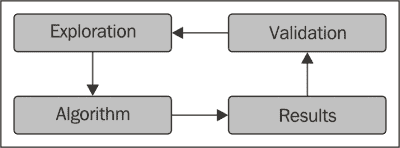

# 二、R——开发机器学习算法的强大工具

在使用机器学习技术之前，我们需要选择合适的软件。有许多编程语言和软件类型为用户提供了机器学习工具。事实上，最重要的部分是知道使用哪些技术以及如何构建新的技术，而软件只是一个工具。但是，选择正确的软件可以让您构建更快、更准确的解决方案。

在本章中，您将学习:

*   构建机器学习解决方案的软件要求
*   R 如何与 RStudio 结合，促进机器学习解决方案的开发
*   R 的结构
*   R 的工具
*   一些重要的 R 包

# 为什么是 R

理解开发机器学习解决方案中的挑战有助于选择软件，让你以最简单和最有效的方式面对它们。本章说明了软件需求，并解释了为什么我们将使用 r。

## 机器学习的互动方法

开发一个机器学习解决方案由具有不同需求的步骤组成。此外，一个步骤的结果有助于改进前一个步骤，因此经常需要回来修改它。

在面对一个问题并构建其机器学习解决方案之前，我们希望尽可能多地了解挑战和可用资源。实际上，为了确定解决方案的正确途径，拥有所有可能的信息非常重要。为此，我们从数据出发，使用统计和机器学习工具从数据中提取业务洞察和模式。

一个简单的例子是，一家大型超市发起了一场针对特定客户的新营销活动。可用的数据是关于过去销售的交易。在建立任何机器学习技术之前，我们需要一些基本的信息，例如前一年的客户总数和总销售量。知道客户总数后，我们想确定客户的平均年支出。然后，下一步可以将客户分成具有同质购买习惯的组，并计算每个组的平均客户年支出。

提取一些基本信息后，我们对问题有了更详细的概述，经常会有新的问题冒出来。因此，我们需要通过应用其他统计和机器学习模型来识别新的模式和提取新的见解。这个过程将一直持续下去，直到信息允许我们确定最终的机器学习解决方案。

一个问题的解决方案通常有不同的选择。为了选择最合适的一个，我们可以构建其中的一些并比较它们的结果。此外，大多数算法都可以通过调整来提高性能，并且调整取决于结果。

总之，构建一个机器学习解决方案包括彼此紧密相关的不同步骤。一个新步骤的目标是基于对前一个步骤的分析，有时，一个步骤是基于以下结果进行修改的。从起点到终点没有一条明确定义的路径，软件应该允许这一点。



## 对机器学习软件的期望

机器学习软件有不同的选择，这一部分展示了我们对自己选择的期望。同时，软件应该为用户提供机器学习工具，并允许构建特定的解决方案。

最重要的机器学习技术由不同类型的软件和软件包提供。然而，使用尖端技术可以改善解决方案。大多数机器学习算法都是由学术界开发的，用于研究，所以在它们进入商业领域之前需要时间。此外，除了少数例外，公司没有足够的资源来开发先进的技术。因此，软件应该允许用户访问学术界开发的工具。在自由和开放源码软件的情况下，通常有一个国际社区为用户提供许多包含尖端工具的软件包。

另一个软件需求是允许用户开发快速有效的解决方案。解决机器学习问题的方法需要大量的交互，因为用户经常根据结果修改解决方案。一个好的用户友好的图形包对于探索每一步的结果和决定做什么是很重要的。因此，该工具应该允许用户快速构建用于数据探索、处理和可视化的可重用组件。

总之，软件要求是:

*   机器学习工具
*   图形包
*   组件的可重用性

## R 和 RStudio

我们将使用的软件是 R，这一小节解释了为什么。

**R** 是为数据分析和机器学习而设计的编程语言。它是一种解释型语言，因为它直接执行命令，所以比其他编程语言更加用户友好。尽管与一些商业软件相比，R 的学习曲线更陡峭，但与其他编程语言相比，R 更容易学习。

r 是最流行的统计编程语言，有一个庞大的国际社区支持它。它的存储库(CRAN)包含超过 5000 个带有统计和机器学习工具的包。这样，我们就可以使用国际社会提供的最先进的工具。

其他有用的 R 工具是它的图形包，只需要几行代码就可以生成漂亮而专业的图表。通过这种方式，在解决方案开发过程中探索数据和结果变得非常容易。

R 的另一个优势是 **RStudio** ，这是一个为 R 设计的 IDE。R studio 包括一个交互式控制台和工具，用于访问 R 帮助、可视化/保存图表以及进行调试。r 与 RStudio 相结合，允许用户相对快速地开发强大的机器学习解决方案。


# R 教程

我假设您已经熟悉一种编程语言，尽管不一定是 R。本节包含一个简短的 R 教程，展示了一些对构建机器学习解决方案有用的工具。因为对 R 的正确介绍需要一整本书，所以本教程只关注一些相关的主题。

如果您已经熟悉 R，您可以快速通读这一节。如果您是 R 新手，我建议您将本节与交互式在线教程结合起来，以获得更完整的概述。此外，为了获得更多的熟悉度，使用这些工具会非常有用。

在开始学习教程之前，我们需要安装 R 和 RStudio。这两种类型的软件都是开源的，它们支持最相关的操作系统。阅读 RStudio 教程以了解如何使用这个强大的 IDE 也很有用。

我的建议是在 RStudio 环境中生成一个新的 R 脚本，并将代码复制粘贴到脚本中。您可以通过转到特定命令行并按下 *Ctrl* + *Enter* 来运行该命令。

## R 的基本工具

R 的基本结构非常简单。任何种类的变量都存储在一个对象中，通过输入其名称即可可视化。让我们开始定义一些数字:

```
n1 <- 2
n2 <- 3
```

我们可以通过输入名称来可视化一个对象，如下所示:

```
n1
[1] 2

```

我们可以对对象执行一些基本操作:

```
n1 + n2
[1] 5
n1 * n2
[1] 6

```

任何操作的输出都可以存储在另一个对象中:

```
nSum <- n1 + n2
nProd <- n1 * n2
nSum
[1] 5

```

用于向代码添加注释的标准语法包括以哈希开始一行，如下所示:

```
# we performed some basic operations on the numbers
```

我们可以对对象应用 R 函数，语法非常简单，因为参数总是在括号内:`result <- functionName(argument1, argument2, …)`。

例如，我们可以使用`sum`来计算数值变量的和:

```
sum(2, 3)
[1] 5
sum(2, 3, 4)
[1] 9

```

类似地，对于操作符，我们可以将函数的输出存储到另一个对象中，如下所示:

```
s1 <- sum(2, 3)
s2 <- sum(2, 3, 4)
```

还有一些在控制台上打印消息的功能。例如，对于给定的任何对象，`print`都以相同的方式显示其内容，也就是说，只需键入对象名:

```
print(s1)
[1] 5

```

用于定义新函数的语法很简单。例如，我们可以定义一个函数`funProd`，它计算两个参数的乘积:

```
funProd <- function(n1, n2)
{
  n <- n1 * n2
  return(n)
}
```

`n1`和`n2`输入在括号内定义，操作包含在花括号内。`return` 方法终止函数，给出结果作为输出。我们可以通过输入名字来可视化任何函数中的代码。

为了让跟踪函数正在做什么，我们可以在函数执行时打印变量，如下所示:

```
funProdPrint <- function(n1, n2){
  n <- n1 * n2
  print(n1)
  print(n2)
  print(n)
  return(n)
}
prod <- funProdPrint(n1 = 2, n2 = 3)
[1] 2
[1] 3
[1] 6

```

### 提示

**下载示例代码**

你可以从你在[http://www.packtpub.com](http://www.packtpub.com)的账户下载你购买的所有 Packt Publishing 书籍的示例代码文件。如果你在别处购买了这本书，你可以访问 http://www.packtpub.com/support 并注册，让文件直接通过电子邮件发送给你。

有不同的 R 函数与文档相关联。我们可以使用`help`来显示它们的描述，如图所示:

```
help(sum)
```

另一种选择是使用`sum`，但就个人而言，我更喜欢使用`help`，以便使用其他 R 函数的相同括号语法。

为了执行基本的 R 操作，我们必须将数据存储在向量中，向量是包含排序后的值集合的对象。我们可以使用`c`定义一个新的向量，它是一个连接其输入的函数，如下所示:

```
a1 <- c(1, 2, 3)
a1
[1] 1 2 3

```

我们可以用方括号提取向量的一个元素。将`1`放入方括号中，可以提取第一个元素。请注意，R 的索引不同于 Python 等其他编程语言，在 Python 中，第一个元素被索引为`0`而不是`1`，如下所示:

```
a1[1]
[1] 1

```

我们可以通过在方括号内放置一个向量来同时提取多个元素，如下所示:

```
a1[c(1, 2)]
[1] 1 2

```

我们还可以对向量执行一些基本操作:

```
a sPaste <- paste(s1, s2, sep = '_')
1 + 1
[1] 2 3 4
a2 <- c(1, 2, 3)
a1 + a2
[1] 2 4 6

```

如果我们想定义一个包含整数序列的向量，我们可以使用这个符号:

```
a3 <- 1:10
a3
[1]  1  2  3  4  5  6  7  8  9 10

```

向量可以包含未定义的值，这些值在 R:

```
a4 <- c(1, NA, 2)
```

如果我们对一个`NA`值执行操作，输出将是`NA`。

另一个重要的数据元素是布尔。布尔变量用`TRUE`和`FALSE`定义，基本运算符有`&`或`&&`(与)、`|`或`||`(或)，还有`!`(非)。布尔元素可以是单个元素或向量。对于向量，短格式(`&`和`|`)比较每个元素，长格式(`&&`和`||`)仅计算每个向量的第一个元素，如下所示:

```
bool1 <- TRUE
bool2 <- FALSE
bool3 <- bool1 & bool2
bool4 <- bool1 | bool2
bool5 <- !bool1
bool3
[1] FALSE
bool4
[1] TRUE
bool5
[1] FALSE

```

我们可以使用关系运算符来定义布尔变量，例如`==`(等于)、`!=`(不等于)、`<=`(小于或等于)、`>=`、`<`和`>`:

```
x1 <- 1
x2 <- 2
bool5 <- x1 == x2
bool6 <- x1 != x2
bool7 <- x1 <= x2
bool5
[1] FALSE
bool6
[1] TRUE
bool7
[1] FALSE

```

布尔变量可以包含在由`if`定义的`if`语句中，语法类似于函数。我们将条件放在括号内，操作在花括号内，如下所示:

```
if(bool5){
  x <- 1
}else{
  x <- 2
}
x
[1] 2

```

我们可以使用`for`定义`for`循环，它们的语法与`if`相同。括号包含变量名和带有值的向量，花括号包含操作，如下所示:

```
vectorI <- c(1, 2, 5)
x <- 0
for(i in vectorI)
{
  if(i > 1)
  {
    x <- x + i
  }
}
x
[1] 7

```

如果我们想重复一个操作固定的次数，我们可以定义一个包含第一个 *n 个* 整数的向量:

```
nIter <- 10
vectorIter <- 1:nIter
total <- 0
for(i in vectorIter){
  total <- total + 1
}
total
[1] 10

```

这一小节向展示了 R 的一些基本组件。下一小节展示了分析数据的 R 对象。

## 了解基本 R 对象

有不同种类的物体，我们见过其中的一些:`numeric`、`function`、`boolean`、`vector`。我们可以很容易地识别出前面例子中使用的对象的类别。

考虑下面这个的例子:

```
class(n1)
[1] "numeric"
class(funProd)
[1] "function"
class(bool5)
[1] "logical"
class(a1)
[1] "numeric"

```

`a1`向量属于`numeric`类，因为它的所有元素都是数字。同理，有逻辑元素的向量属于`logical`。

字符串使用单引号或双引号定义，如下所示:

```
s1 <- 'string1'
s2 <- "string2"
```

有不同的字符串函数，如连接两个字符串的`paste`和从字符串中提取子集的`substring`，如下所示:

```
sPaste <- paste(s1, s2, sep = '_')
sPaste
[1] "string1_string2"
sSub <- substring(sPaste, 2, 5)
sSub
[1] "trin"

```

可以像定义`numeric`或`logical`一样定义`string`向量:

```
vectorStrings <- c(s1, s2, sPaste, sSub)
vectorStrings
[1] "string1"         "string2"         "string1_string2" "trin"
class(vectorStrings)
[1] "character"

```

一个向量可以包括任何种类的对象(甚至是潜在的函数)。如果我们定义一个包含字符串和数字的向量会发生什么？

```
vectorStringsNum <- c(s1, s2, 10, 1.3)
vectorStringsNum
[1] "string1" "string2" "10"      "1.3" 
class(vectorStringsNum)
[1] "character"

```

如前面的代码所示，R 将数字转换成字符，以得到一个齐次向量。然而，还有其他数据结构允许我们存储异构对象。

如果我们有 categoric 变量，我们可以使用字符串来存储它们，但还有另一个选项:`factors`。这个 R 对象包含一个变量，该变量的值属于一组定义的值，称为`levels`。每个级别都与一个整数相关联，数据可以被视为获得相同结果的整数或字符。因子也有助于创建序数变量。

从一个字符串开始，我们可以使用`factor`生成一个因子:

```
vectorString <- c('a', 'a', 'b', 'c')
vectorFactor <- factor(vectorString)
class(vectorFactor)
[1] "factor"

```

使用级别，我们可以确定可能的值:

```
levels(vectorFactor)
```

另一个有用的函数是`table`，虽然不一定与因子相关，但它会计算每个级别的出现次数:

```
table(vectorFactor)
vectorFactor
a b c 
2 1 1 

```

另一个有用的数据元素是`Date`，它是用来存储日期的 R 选项之一。我们开始构建一个字符串，如`'2013-01-01'`，并在另一个字符串中定义年、月和日的位置，如下所示:

```
stringDate <- '2013-01-01'
formatDate <- '%Y-%m-%d'
```

现在，使用`as.Date`，我们可以生成日期对象:

```
date1 <- as.Date(stringDate, format = formatDate)
class(date1)
[1] "Date"
date1
[1] "2013-01-01"

```

我们可以对日期应用简单的操作，比如添加一个确定的天数:

```
date2 <- date1 + 10
date2
[1] "2013-01-11"

```

我们还可以使用布尔运算符来匹配两个日期:

```
date1 > date2
[1] FALSE

```

另一种数据类型是 `list`，它定义了数据元素的有序异构集合:

```
l1 <- list(1, a1, sPaste)
l1
[[1]]
[1] 1

[[2]]
[1] 1 2 3

[[3]]
[1] "string1_string2"

```

每个对象都可以与一个允许我们访问它的键相关联:

```
l2 <- list(elNumber = 1, elvector = a1, elString = sPaste)
l2
$elNumber
[1] 1

$elVector
[1] 1 2 3

$elString
[1] "string1_string2"

```

在这两种情况下，我们都可以使用双方括号和元素的位置从列表中提取元素，如下所示:

```
l1[[1]]
[1] 1
l2[[1]]
[1] 1

```

在`l2`的例子中，我们已经为定义了它的键，所以我们可以使用`$`操作符来访问它的元素:

```
l2$elNumber
[1] 1

```

我们可以使用`names`可视化所有的键名:

```
names(l2)
[1] "elNumber" "elVector"  "elString"

```

还可以定义或更改键名:

```
names(l1) <- c('el1', 'el2', 'el3')
names(l1)
[1] "el1" "el2" "el3"

```

为了从列表中提取一个子列表，我们可以使用单个方括号，类似于向量:

```
l3 <- l2[1]
l3
$elNumber
[1] 1
l4 <- l2[c(1, 2)]
l4
$elNumber
[1] 1

$elVector
[1] 1 2 3

```

允许您存储表格数据的 R 对象是一个`matrix`。要生成一个新矩阵，将所有值放入一个向量中，并使用`matrix`，如下所示:

```
vectorMatrix <- c(1, 2, 3, 11, 12, 13)
matrix1 <- matrix(vectorMatrix, ncol = 2)
matrix1
 [,1] [,2]
[1,]    1   11
[2,]    2   12
[3,]    3   13

```

使用`t`，我们可以转置一个矩阵，这意味着我们可以交换行和列:

```
matrix2 <- t(matrix1)
matrix2
 [,1] [,2] [,3]
[1,]    1    2    3
[2,]   11   12   13

```

如前面的代码所示，`matrix1`和`matrix2`只包含数字数据。使用`cbind`，我们可以添加另一列。如果我们添加一个字符列会发生什么？

```
vector3 <- c('a', 'b', 'c')
matrix3 <- cbind(matrix1, vector3)
matrix3
```

r 将数字转换成字符。原因是矩阵和向量一样，只能包含同类数据。

矩阵可以有行和列名，我们可以使用 `rownames`和`colnames`来显示它们:

```
rownames(matrix3)
NULL
colnames(matrix3)
[1] ""       ""       "vector3"

```

我们通过向`matrix3`添加一列来定义`matrix3`。它的 columns 和 R 自动设置最后一列名等于 vector 名，即`vector3`。使用相同的函数，我们可以手动设置行和列的名称，如下所示:

```
rownames(matrix3) <- c('row1', 'row2', 'row3')
colnames(matrix3) <- c('col1', 'col2', 'col3')
matrix3
 col1 col2 col3
row1 "1"  "11" "a" 
row2 "2"  "12" "b" 
row3 "3"  "13" "c" 

```

我们可以使用`View`可视化一个数据帧:

```
View(df2)
```

### 提示

关于数据帧，请参考本章的脚本。

有一些函数允许对向量、矩阵或列表的每个元素执行相同的操作。这些功能如下:

*   `apply`:对矩阵的每一行、列或元素应用函数
*   `sapply`:对向量的每个元素应用函数
*   `lapply`:对列表的每个元素应用一个函数

`sapply`函数是最简单的，我们可以从它开始。我们可以用`1`和`10`之间的整数定义一个向量`x1`，以及一个函数`func1`，它返回输入的平方:

```
x1 <- 1:10
func1 <- function(el){
  result <- el ^ 2
  return(result)
}
```

现在，我们可以通过指定参数来使用`sapply`:`X`—数组，以及`FUN`—函数:

```
sapply(X = x1, FUN = func1)
[1]   1   4   9  16  25  36  49  64  81 100

```

同样，我们可以用`lapply`:

```
l1 <- list(a = 1, b = 2, c = 3)
lapply(X = l1, FUN = func1)
$a
[1] 1

$b
[1] 4

$c
[1] 9

```

对矩阵执行操作的函数是`apply`。它可用于对每一行应用相同的函数。让我们首先定义一个矩阵:

```
matrix4 <- matrix(1:9, nrow = 3)
matrix4
 [,1] [,2] [,3]
[1,]    1    4    7
[2,]    2    5    8
[3,]    3    6    9

```

为了将`sum`函数应用于每一行，我们使用`apply`，将`MARGIN`输入定义为等于`1`，这指定我们对每一行执行操作:

```
apply(X = matrix4, MARGIN = 1, FUN = sum)
[1] 12 15 18

```

定义`MARGIN = 2`，我们对每一列执行操作:

```
apply(X = matrix4, MARGIN = 2, FUN = sum)
[1]  6 15 24

```

我们可以使用`MARGIN = c(1, 2)`将函数应用于矩阵的每个元素:

```
apply(X = matrix4, MARGIN = c(1, 2), FUN = func1)
 [,1] [,2] [,3]
[1,]    1   16   49
[2,]    4   25   64
[3,]    9   36   81

```

本节展示了一些与机器学习分析相关的对象和工具。然而，它们仍然只是基础。

## R 标准是什么？

对于拥有一个干净和标准化的代码来说，有一些风格规则，这一小节展示了其中的一些。

与其他编程语言不同，R 不需要任何缩进。但是，缩进代码会使它更易读、更整洁。R 标准是使用两个空格，RStudio 自动定义了这个缩进。

给变量赋值的标准是使用`<-`操作符，即使有可能使用`=`使 R 更类似于其他编程语言。但是，如果在函数输入中使用，这两个运算符有不同的含义。

标识符有不同的选项，就我个人而言，我喜欢小写的 camel:

```
lowerCamelCase
```

但是 R 社区很大，有不同的约定。

每个运算符都应该用空格括起来，在函数的输入中，逗号后面应该总是有一个空格:

```
x <- 1
sum(1, 2)
```

还有一些其他的样式规则，你可以在[https://Google-style guide . Google code . com/SVN/trunk/rguide . XML](https://google-styleguide.googlecode.com/svn/trunk/Rguide.xml)找到。


# 一些有用的 R 包

有不同的 R 包为用户提供通用功能和特定技术。本章介绍两个强大的通用软件包:`data.table`和`plyr`。

有些包已经安装在 r 的基础版中，但是为了使用`data.table`和`plyr`，我们需要使用`install.packages`从官方 CRAN 库下载。让我们从`data.table`开始，它是一个包，提供了用于处理数据帧的附加工具:

```
install.packages('data.table')
```

如果该命令不起作用，您可以指定存储库:

```
install.packages(
  pkgs = 'data.table',
  repos = 'http://cran.us.r-project.org'
)
```

安装软件包后，我们需要加载它才能使用它的功能。不幸的是，R 将从包中导入所有函数，而不使用名称空间，有时不同的包之间可能会有名称冲突:

```
library(data.table)
```

这个包包含一个名为`data.table`的新类，它继承自`data.frame`。继承意味着数据表可以使用所有数据框工具，如果没有被覆盖的话，还可以使用其他工具。

为了使用该包，起点是我们将要分析的数据集。r 为用户提供了一些数据集，我们可以使用`data`看到它们的列表和描述:

```
data()
```

我们将使用的数据集是`iris`。虽然对于教程来说这是一个非常标准的数据集，但是我决定使用它，因为它很适合用来显示数据表工具。我保证我会在接下来的章节中选择更多有趣的话题。首先，我们来看看数据描述:

```
help(iris)
```

数据集包含关于三种鸢尾花的数据:`setosa`、`versicolor`和`virginica`。这些数据显示了每朵花的萼片和花瓣的长度和宽度。

`iris`数据集是一个数据框。首先，让我们使用`data.table`将其转换成数据表:

```
class(iris)
[1] "data.frame"
dtIris <- data.table(iris)
class(dtIris)
[1] "data.table" "data.frame"

```

由于继承关系，`dtIris`对象属于`data.table`和`data.frame`类。在分析数据之前，我们可以使用`str`快速探索结构:

```
str(dtIris)
Classes 'data.table' and 'data.frame':  150 obs. of  5 variables:
 $ Sepal.Length: num  5.1 4.9 4.7 4.6 5 5.4 4.6 5 4.4 4.9 ...
 $ Sepal.Width : num  3.5 3 3.2 3.1 3.6 3.9 3.4 3.4 2.9 3.1 ...
 $ Petal.Length: num  1.4 1.4 1.3 1.5 1.4 1.7 1.4 1.5 1.4 1.5 ...
 $ Petal.Width : num  0.2 0.2 0.2 0.2 0.2 0.4 0.3 0.2 0.2 0.1 ...
 $ Species     : Factor w/ 3 levels "setosa","versicolor",..: 1 1 1 1 1 1 1 1 1 1 ...
 - attr(*, ".internal.selfref")=<externalptr> 

```

正如我们所见，有四个数字列显示了花的属性，一个因子列显示了种类。现在，使用`print`，我们可以显示包含在`dtIris`中的数据:

```
print(dtIris)
 Sepal.Length Sepal.Width Petal.Length Petal.Width   Species
 1:          5.1         3.5          1.4         0.2    setosa
 2:          4.9         3.0          1.4         0.2    setosa
 3:          4.7         3.2          1.3         0.2    setosa
 4:          4.6         3.1          1.5         0.2    setosa
 5:          5.0         3.6          1.4         0.2    setosa
 --- 
146:          6.7         3.0          5.2         2.3 virginica
147:          6.3         2.5          5.0         1.9 virginica
148:          6.5         3.0          5.2         2.0 virginica
149:          6.2         3.4          5.4         2.3 virginica
150:          5.9         3.0          5.1         1.8 virginica

```

现在，我们可以看到第一行和最后五行。为了看到整个表格，我们可以使用`View`:

```
View(dtIris)
```

查看完数据，我们来看看基本操作。方括号允许我们执行多种操作。例如，通过将一个数字放在方括号中，我们提取相关的行:

```
dtIris[1]
 Sepal.Length Sepal.Width Petal.Length Petal.Width Species
1:          5.1         3.5          1.4         0.2  setosa

```

通过放置一个向量，我们可以提取更多的行:

```
dtIris[1:3]
 Sepal.Length Sepal.Width Petal.Length Petal.Width Species
1:          5.1         3.5          1.4         0.2  setosa
2:          4.9         3.0          1.4         0.2  setosa
3:          4.7         3.2          1.3         0.2  setosa

```

如果我们想要提取一个列，我们插入列名作为第二个参数:

```
dtIris[, Species]
[1] setosa     setosa     setosa     setosa     setosa     setosa 
…
[145] virginica  virginica  virginica  virginica  virginica  virginica 
Levels: setosa versicolor virginica

```

我们可以使用列位置的编号来代替列名，在本例中是 5。我们也可以同时提取行和列:

```
dtIris[1:3, Species]
[1] setosa setosa setosa
Levels: setosa versicolor virginica

```

如果我们想要定义一个只有前三列的数据表呢？我们可以使用类似的符号，将`Species`作为一个字符串，并将`with = F`作为第三个参数:

```
dtIris[1:3, 'Species', with = F]
 Species
1:  setosa
2:  setosa
3:  setosa

```

我们还可以提取一个包含两列或更多列`dtIris`的数据表:

```
dtIris[1:3, c(5, 1, 2), with = F]
 Species Sepal.Length Sepal.Width
1:  setosa          5.1         3.5
2:  setosa          4.9         3.0
3:  setosa          4.7         3.2

```

我们在第一个参数中放入一个向量来选择行。像数据帧和矩阵一样，我们可以选择定义逻辑向量的行，例如`dtIris$Sepal.Length > 7`。在数据表的情况下，我们可以不使用`$`操作符直接访问列。然后，我们只需要将`Sepal.Length > 7`作为第一个参数:

```
dtIris[Sepal.Length > 7]
 Sepal.Length Sepal.Width Petal.Length Petal.Width   Species
 1:          7.1         3.0          5.9         2.1 virginica
 2:          7.6         3.0          6.6         2.1 virginica
 3:          7.3         2.9          6.3         1.8 virginica
 4:          7.2         3.6          6.1         2.5 virginica
 5:          7.7         3.8          6.7         2.2 virginica
 6:          7.7         2.6          6.9         2.3 virginica
 7:          7.7         2.8          6.7         2.0 virginica
 8:          7.2         3.2          6.0         1.8 virginica
 9:          7.2         3.0          5.8         1.6 virginica
10:          7.4         2.8          6.1         1.9 virginica
11:          7.9         3.8          6.4         2.0 virginica
12:          7.7         3.0          6.1         2.3 virginica

```

要定义一个新列，我们可以在第二个方括号参数中使用`:=`操作符。我们只需输入其他列的名称就可以访问它们。例如，我们可以将`Sepal.Area`定义为与`Sepal.Length * Sepal.Width`的乘积:

```
dtIris[, Sepal.Area := Sepal.Length * Sepal.Width]
dtIris[1:6]
 Sepal.Length Sepal.Width Petal.Length Petal.Width Species Sepal.Area
1:          5.1         3.5          1.4         0.2  setosa      17.85
2:          4.9         3.0          1.4         0.2  setosa      14.70
3:          4.7         3.2          1.3         0.2  setosa      15.04
4:          4.6         3.1          1.5         0.2  setosa      14.26
5:          5.0         3.6          1.4         0.2  setosa      18.00
6:          5.4         3.9          1.7         0.4  setosa      21.06

```

如果我们想要计算平均值`Sepal.Area`，我们可以在方括号中的第二个参数内执行操作:

```
dtIris[, mean(Sepal.Area)]
[1] 17.82287

```

如果我们想知道每个物种的平均花瓣面积呢？语法是一样的；我们在第三个参数中包含了`by = 'Species'`:

```
dtIris[, mean(Sepal.Area), by = 'Species']
 Species      V1
1:     setosa 17.2578
2: versicolor 16.5262
3:  virginica 19.6846

```

我们同时计算更多的统计数据。例如，我们可以确定每个物种的最大和最小萼片面积。在这种情况下，语法是相似的，只是在第二个参数中增加了`list`:

```
dtIris[
     , list(areaMin = min(Sepal.Area), areaMax = max(Sepal.Area)),
     by = 'Species'
     ]
 Species areaMin areaMax
1:     setosa   10.35   25.08
2: versicolor   10.00   22.40
3:  virginic
a   12.25   30.02

```

另一个有用的包是`plyr`，它包含一些类似于`apply`的功能，适用于不同的上下文。让我们首先安装并加载软件包:

```
install.packages('plyr')
library('plyr')
```

一个有用的函数是`dlply`，它将一个数据帧分割成块，对每个块应用一个函数，并定义一个包含函数输出的列表。输入类型如下所示:

*   `.data`:这是数据帧。
*   `.variables`:这是定义分割的变量。每个块对应于变量的一个可能值。
*   `.fun`:这是应用于每个块的函数。

例如，从`iris`数据框开始，我们可以计算每个物种的平均萼片长度。首先，我们可以通过计算平均萼片长度来定义`funcDl`:

```
funcDl <- function(dtChunk){
  result <- mean(dtIris$Sepal.Length)
  return(result)
}
```

现在，我们可以使用`dlply`将`funcDl`应用于每个物种:

```
dlply(
  .data = iris,
  .variables = 'Species',
  .fun = funcDl
)
$setosa
[1] 5.843333

$versicolor
[1] 5.843333

$virginica
[1] 5.843333

```

让我们研究一下列表中包含的数据:

```
names(listIris)
```

列表中的每个元素都有相应物种的名称。让我们来看看其中的一个元素:

```
listIris$setosa
```

`dlply`函数从一个数据帧开始生成一个列表，在名字中，`d`代表数据帧，`l`代表列表。还有其他`ply`功能，选项有:

*   `a`:数组
*   `d`:数据帧
*   `l`:列表

例如，`adply`定义了一个从数组开始的数据帧，`laply`定义了一个从列表开始的数组。

本节介绍了两个有用的包。在 CRAN 库中有超过 5000 个软件包，我们将在后面的章节中看到其中的一些。


# 摘要

在本章中，您了解了开发机器学习解决方案所需的软件。您看到了为什么 R 与 RStudio 结合使用是帮助您克服机器学习挑战的好工具。

您了解了 R 的基础知识以及一些最重要的数据类型和函数。你也见过`data.table`、`plyr`之类的包。

下一章将向您展示一个简单的例子，说明使用探索性数据分析和机器学习可能面临的挑战。你会看到 R 工具被用来构建图表，使用机器学习算法。