# 三、一个简单的机器学习分析

本章展示了探索性数据分析和机器学习技术的例子。r 为我们提供了不同的数据集，可以用来试验这些工具。在这一章中，我们将使用一个关于泰坦尼克号乘客的有趣数据集。

泰坦尼克号事件期间发生的一些事实，比如先救妇孺的政策，第一社会阶层的特权。为了调查发生了什么，我们可以使用与事件相关的数据。R 数据集是关于一些乘客的，它显示了他们的个人数据和幸存者。首先，我们可以探索一些数据，以了解发生了什么。然后，从其他乘客的个人数据出发，机器学习模型的目标是预测哪些新乘客将幸存下来。

在本章中，我们将讨论以下主题:

*   探索数据
*   使用简单的图表可视化数据
*   使用机器学习技术探索数据
*   使用机器学习技术预测结果

# 交互浏览数据

本节向您展示如何使用简单的技术来可视化数据。我们使用`data.table`包处理数据，并使用基本的 R 图可视化信息。一个很棒的绘图包是`ggplot2`，它允许你创建漂亮的专业图表。不幸的是，它的语法比基本的 R 图表更复杂，所以我们在本书中没有足够的篇幅来介绍它。

r 为我们提供了一个`Titanic`数据集，其中包含了一些乘客的生存统计数据。在开始分析数据之前，让我们用下面的代码看一下他们的文档:

```
help(Titanic)
```

文件显示，乘客是根据他们的社会阶层、性别和年龄分组的。对于每一组，数据集显示了有多少人幸存，有多少人没有。我们可以使用`class`来查看数据的格式:

```
class(Titanic)
[1] "table"

```

对象`Titanic`属于`table`类，因此它显示类变量的每个组合的计数，如下所示:

```
Titanic
, , Age = Child, Survived = No

 Sex
Class  Male Female
 1st     0      0
 2nd     0      0
 3rd    35     17
 Crew    0      0
...

```

该表显示了频率，即每个变量组合的乘客人数，这些变量是个人数据和幸存者的数据。

## 用数据定义表格

在这一小节中，我们将以更方便的格式转换数据。第一步是定义数据框:

```
dfTitanic <- data.frame(Titanic)
```

我们可以用`str`看到`dfTitanic`的结构:

```
str(dfTitanic)
'data.frame':   32 obs. of  5 variables:
 $ Class   : Factor w/ 4 levels "1st","2nd","3rd",..: 1 2 3 4 1 2 3 4 1 2 ...
 $ Sex     : Factor w/ 2 levels "Male","Female": 1 1 1 1 2 2 2 2 1 1 ...
 $ Age     : Factor w/ 2 levels "Child","Adult": 1 1 1 1 1 1 1 1 2 2 ...
 $ Survived: Factor w/ 2 levels "No","Yes": 1 1 1 1 1 1 1 1 1 1 ...
 $ Freq    : num  0 0 35 0 0 0 17 0 118 154 ...

```

有四个因素代表乘客的属性，`Freq`显示每个属性组合的乘客数量。为了使用强大的工具处理数据，我们将`dfTitanic`转换成数据表:

```
library(data.table)
dtTitanic <- data.table(dfTitanic)
```

我们可以使用`head`来可视化表格的顶行:

```
head(dtTitanic)
 Class    Sex   Age Survived Freq
1:   1st   Male Child       No    0
2:   2nd   Male Child       No    0
3:   3rd   Male Child       No   35
4:  Crew   Male Child       No    0
5:   1st Female Child       No    0
6:   2nd Female Child       No    0

```

这里，`Class`、`Sex`、`Age`和`Survived`代表属性，`Freq`显示每个组合的乘客数量。例如，有 35 名三等男生幸存下来。其他五个特征组合没有乘客。

为了开始分析，我们可以定义包含乘客总数的`nTot`:

```
nTot <- dtTitanic[, sum(Freq)]
nTot
[1] 2201

```

还有`2201`乘客。他们之中，有多少人幸存？我们可以使用一个简单的数据表聚合来计算幸存和未幸存的乘客。我们需要指定以下内容:

*   **操作**:在统计乘客的顺序中，我们对`Freq`列求和，所以操作为`n=sum(Freq)`
*   **聚合**:我们为`Survived`列的每个可能值计算乘客数量，因此我们需要指定我们通过`Survived`进行聚合

这是数据表语法。我们使用方括号和三个参数:

*   **要选择的行**:我们正在使用所有的表，所以参数为空
*   **操作**:包含一个包含该操作的列表，即`n=sum(Freq)`
*   **聚合**:我们指定聚合`by='Survived'`

考虑以下代码:

```
dtSurvived <- dtTitanic[, list(n=sum(Freq)), by='Survived']
dtSurvived
 Survived    n
1:       No 1490
2:      Yes  711

```

## 通过直方图可视化数据

我们可以通过构建直方图来可视化`dtSurvived`，R 函数为`barplot`:

```
help(barplot)
```

在我们的例子中，我们需要的参数是`height`和`names.arg`，指定条形的高度和标签。在我们的例子中，两个参数都需要一个向量。让我们看看如何构建图表。请遵循以下步骤:

1.  用包含乘客人数的高度定义向量:

    ```
    vectorHeight <- dtSurvived[, n]
    ```

2.  用包含幸存乘客人数的名字定义向量:

    ```
    vectorNames <- dtSurvived[, Survived]
    ```

3.  构建图表:

    ```
    barplot(height=vectorHeight, names.arg=vectorNames)
    ```

直方图如下所示:

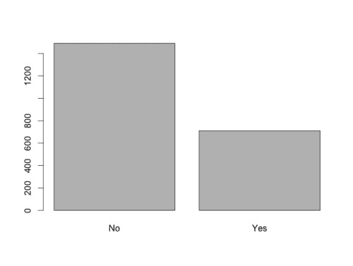

直方图显示了幸存或未幸存的乘客人数。每个条形的高度等于乘客的数量，标签显示条形所代表的内容。我们可以只用一行代码构建相同的图表:

```
barplot(height=dtSurvived[, n], names.arg=dtSurvived[, Survived])
```

这张图表显示了乘客总数。如果我们想把百分比可视化呢？让我们来看看以下步骤:

1.  定义包含乘客数量除以总乘客数量的`percentage`列。我们可以使用`:=`数据表操作来定义新列。此列将是`height`自变量:

    ```
    dtSurvived[, percentage := n / sum(n)]
    ```

2.  为可视化定义包含蓝色和红色的`colorPlot`列。我们使用`ifelse`，这是一个函数，如果`Survived == 'Yes'`指定颜色为`blue`，否则为`red`。该列将是`col`自变量:

    ```
    dtSurvived[, colorPlot := ifelse(Survived == 'Yes', 'blue', 'red')]
    ```

3.  构建图表，正如预期的那样，我们包括了`col`参数，定义了`color`向量。此外，百分比的范围在 0 和 1 之间，因此我们可以通过添加等于`c(0, 1)` :

    ```
    barplot(   height=dtSurvived[, percentage],   names.arg=dtSurvived[, Survived],   col=dtSurvived[, colorPlot],   ylim=c(0, 1) )
    ```

    的`ylim`参数来指定绘图的面积将在 0 和 1 之间

直方图如下:

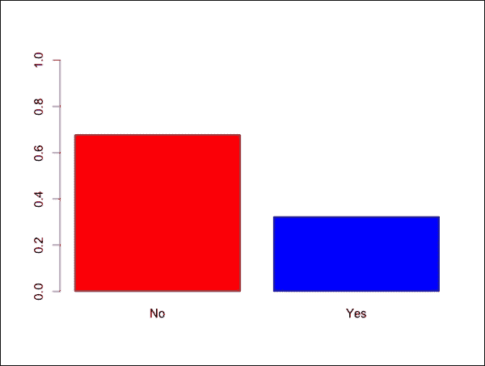

我们可以为图表添加标题和图例；请遵循以下步骤:

1.  将包含百分比的`textPercentage`列定义为字符串。例如，对于百分比 0.323035，我们在图例中显示 32%:

    ```
    dtSurvived[, textPercentage := paste(round(percentage * 100), '%', sep='')]
    ```

2.  定义剧情标题:

    ```
    plotTitle <- 'Proportion of passengers surviving or not'
    ```

3.  定义*y 轴标签:

    ```
    ylabel <- 'percentage'
    ``` 
4.  *构建剧情:

    ```
    barplot(   height=dtSurvived[, percentage],   names.arg=dtSurvived[, Survived],   col=dtSurvived[, colorPlot],   ylim=c(0, 1),   legend.text=dtSurvived[, textPercentage],   ylab=ylabel,   main=plotTitle )
    ``` 

*直方图如下所示:*

*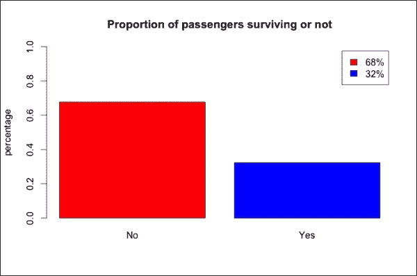*

*一般的存活率是 **32%** ，虽然在不同的属性组合上有所不同。下一小节将向您展示如何可视化属性的影响。*

## *可视化特征的影响*

*在这个小节中，我们确定了性别对存活率的影响。首先，我们可以定义`dtGender`显示每个性别幸存或未幸存的乘客数量。该操作为`n=sum(Freq)`，针对`Survived`和`Sex`的每一个组合进行。与上一节类似，我们执行一个简单的数据表聚合，指定以下内容:*

*   ***要选择的行**:我们正在使用整个表，所以参数为空*
*   ***操作**:包含操作的列表，即`n=sum(Freq)`*
*   ***聚合**:我们按两列聚合，所以我们定义`by=c('Survived', 'Sex')`*

*考虑以下代码:*

```
*dtGender <- dtTitanic[, list(n=sum(Freq)), by=c('Survived', 'Sex')]
dtGender
 **Survived    Sex    n**
**1:       No   Male 1364**
**2:       No Female  126**
**3:      Yes   Male  367**
**4:      Yes Female  344*** 
```

*现在，我们可以通过直方图来可视化新的数据表，就像我们之前看到的那样。步骤如下:*

1.  *添加`percentage`栏，将`n`除以该性别的乘客人数。操作是`n / sum(n)`，按性别来做。然后，我们使用`:=`操作，指定我们计算总和`by='Sex'` :

    ```
    dtGender[, percentage := n / sum(n), by='Sex']
    ``` 
2.  *定义绘图颜色:

    ```
    dtGender[, colorPlot := ifelse(Survived == 'Yes', 'blue', 'red')]
    ``` 
3.  *定义 *y* 轴标签:

    ```
    dtGender[, textPercentage := paste(round(percentage * 100), '%', sep='')]
    ``` 
4.  *提取表格中的男性生存统计:

    ```
    dtGenderMale <- dtGender[Sex == 'Male']
    ``` 
5.  *建立男性直方图:

    ```
    barplot(   height=dtGenderMale[, percentage],   names.arg=dtGenderMale[, Survived],   col=dtGenderMale[, colorPlot],   ylim=c(0, 1),   legend.text=dtGenderMale[, textPercentage],   ylab='percentage',   main='Survival rate for the males' )
    ``` 
6.  *我们可以不提取`dtGenderMale`，而是直接构建图表，在提取向量时添加`Sex == 'Male'`。我们可以用类似的方法为女性建立相同的直方图:

    ```
    barplot(   height=dtGender[Sex == 'Female', percentage],   names.arg=dtGender[Sex == 'Female', Survived],   col=dtGender[Sex == 'Female', colorPlot],   ylim=c(0, 1),   legend.text=dtGender[Sex == 'Female', textPercentage],   ylab='percentage',   main='Survival rate for the females' )
    ``` 

*让我们展示一下我们制作的图表:*

*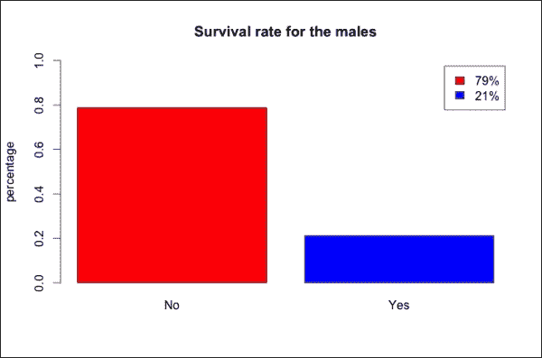*

*与幸存乘客的 32%相比，男性的存活率仅为 21%。*

*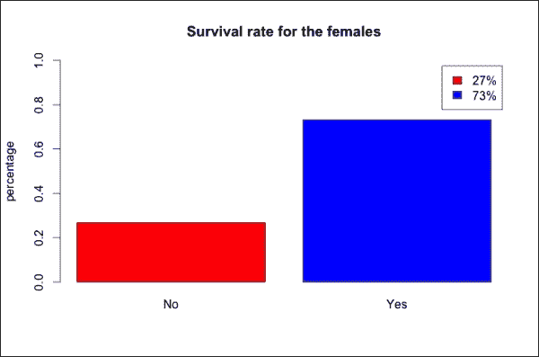*

*不出所料，女性存活率明显高于平均水平。*

*我们可以在同一个图表中比较两种性别，该图表显示的是存活率，即`Yes`栏。我们可以使用相同的命令并包括`Survived == 'Yes'`条件来构建情节。唯一的区别是`col`参数，在本例中是`Sex`列，它是一个具有两个级别的因子。在这种情况下，`barplot`自动定义黑色和红色两种颜色:*

```
*barplot(
  height=dtGender[Survived == 'Yes', percentage],
  names.arg=dtGender[Survived == 'Yes', Sex],
  col=dtGender[Survived == 'Yes', Sex],
  ylim=c(0, 1),
  legend.text=dtGender[Survived == 'Yes', textPercentage],
  ylab='percentage',
  main='Survival rate by gender'
)*
```

*直方图如下所示:*

*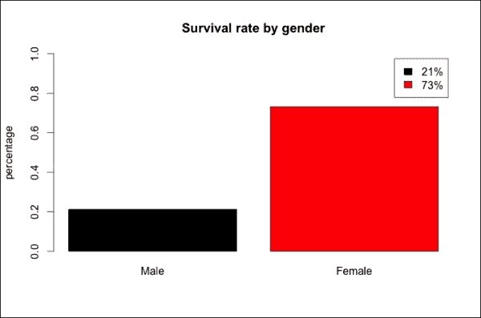*

*图表让我们可以看到差异，图例显示存活率。不出所料，差别是巨大的。*

## *将两个特征的影响可视化*

*在这一章中，我们研究另一个特性的影响:阶级。不同等级的乘客存活率有什么不同？首先，我们可以按照以下步骤构建与性别相同的存活率图表:*

1.  *定义`dtClass`包含每个等级幸存或未幸存的乘客:

    ```
    dtClass <- dtTitanic[, list(n=sum(Freq)), by=c('Survived', 'Class')]
    ``` 
2.  *定义每个等级幸存或未幸存乘客的百分比:

    ```
    dtClass[, percentage := n / sum(n), by='Class']
    ``` 
3.  *定义百分比文本:

    ```
    dtClass[, textPercentage := paste(round(percentage * 100), '%', sep='')]
    ``` 
4.  *构建直方图:

    ```
    barplot(   height=dtClass[Survived == 'Yes', percentage],   names.arg=dtClass[Survived == 'Yes', Class],   col=dtClass[Survived == 'Yes', Class],   ylim=c(0, 1),   legend.text=dtClass[Survived == 'Yes', textPercentage],   ylab='survival rate',   main='Survival rate by class' )
    ``` 

*直方图如下:*

*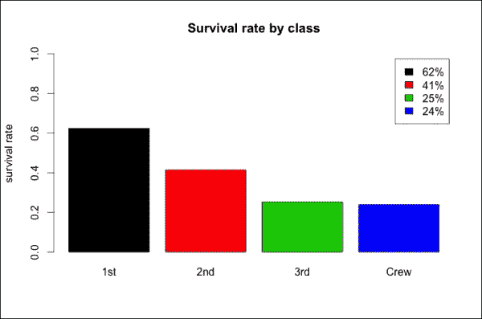*

*各个班级的存活率差异很大。我们可以注意到，属于较高等级的乘客更有可能存活，并且机组人员的存活率与第三等级相似。能否得出阶级对存活率影响大的结论？*

*图表显示了每个班级的总存活率。然而，知道了女性更有可能存活，一个具有更高的女性:男性比率的班级将有可能有更高的存活率。如果仅仅用性别来解释较高的存活率，那么属于不同阶层的事实根本没有影响。*

*为了了解存活率之间的差异是否取决于每个班级中雌性的百分比，我们可以按班级将性别比例可视化。该图是一个直方图，显示了每个社会阶层的女性百分比，命令与前面的命令相似:*

```
*dtGenderFreq <- dtTitanic[, list(n=sum(Freq)), by=c('Sex', 'Class')]
dtGenderFreq[, percentage := n / sum(n), by='Class']
dtGenderFreq <- dtGenderFreq[Sex == 'Female']
dtGenderFreq[, textPercentage := paste(round(percentage * 100), '%', sep='')]
barplot(
  height=dtGenderFreq[, percentage],
  names.arg=dtGenderFreq[, Class],
  col=dtGenderFreq[, Class],
  ylim=c(0, 1),
  legend.text=dtGenderFreq[, textPercentage],
  ylab='survival rate',
  main='Percentage of females'
)*
```

*直方图如下所示:*

*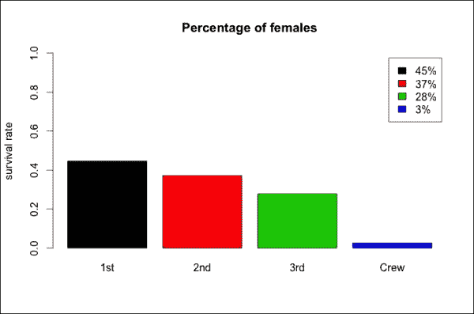*

*不同班级的性别比例差异很大，因为女性在顶级班级中的比例更高，而且船员中几乎没有女性。因此，女性的百分比可能会使各个阶层的存活率有所偏差。为了更好地理解这两个属性对存活率的影响，我们需要同时考虑性别和阶级。为此，我们可以计算这两个特征的每个组合的存活率。使用以下步骤构建图表:*

1.  *计算`Survived`、`Sex`和`Class`每种组合的乘客总数。现在`by`参数包括三个列名:

    ```
    dtGenderClass <- dtTitanic[, list(n=sum(Freq)), by=c('Survived', 'Sex', 'Class')]
    ``` 
2.  *添加`nTot`列，指定每个特征组合的乘客总数(不包括`Survived`)。`by`论据包括两个特点:

    ```
    dtGenderClass[, nTot := sum(n), by=c('Sex', 'Class')]
    ``` 
3.  *添加`percentage`列。`by`参数包括两个特性:

    ```
    dtGenderClass[, percentage := n / sum(n), by=c('Sex', 'Class')]
    ``` 
4.  *使用`Survived == 'Yes'`条件提取包含存活率的列:

    ```
    dtGenderClass <- dtGenderClass[Survived == 'Yes']
    ``` 
5.  *添加`textPercentage`栏:

    ```
    dtGenderClass[, textPercentage := paste(round(percentage * 100), '%', sep='')]
    ``` 
6.  *增加`colorPlot`栏。`rainbow`函数用定义数量的彩虹颜色构建一个向量。在这种情况下，我们为每一行定义一列，所以我们使用`rainbow(nrow(dtGenderClass))` :

    ```
    dtGenderClass[, colorPlot := rainbow(nrow(dtGenderClass))]
    ``` 
7.  *定义要包含在标签中的组名。由于直方图将显示两种特征的每种组合的存活率，我们使用`paste`将每个组的名称设置为性别和类别的组合。为了将这些名字放入图表中，我们定义了包含性别缩写的`SexAbbr`:

    ```
    dtGenderClass[, SexAbbr := ifelse(Sex == 'Male', 'M', 'F')] dtGenderClass[, barName := paste(Class, SexAbbr, sep='')]
    ``` 
8.  *定义标签，包含地块名称和组内乘客数量。因为我们想在两个不同的行中显示名字和号码，我们用`\n`将它们分开，它在一个字符串中定义了一个新行:

    ```
    dtGenderClass[, barLabel := paste(barName, nTot, sep='\n')]
    ``` 
9.  *生成直方图。与`ylim`类似，`xlim`参数定义了要可视化的 *x* 区域。在这种情况下，我们使用`xlim`来避免图例和图表重叠:

    ```
    barplot(   height=dtGenderClass[, percentage],   names.arg=dtGenderClass[, barLabel],   col=dtGenderClass[, colorPlot],   xlim=c(0, 11),   ylim=c(0, 1),   ylab='survival rate',   legend.text=dtGenderClass[, textPercentage] )
    ``` 

*生成的直方图如下:*

*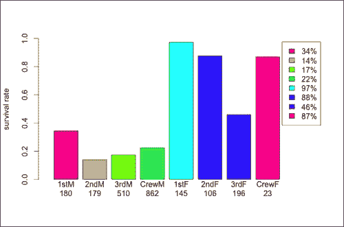*

*我们可以在一个小组的栏目下找到该小组的乘客人数。除了女乘务员，每个酒吧至少有 100 名乘客，所以我们可以假设这个结果是有意义的。为了衡量意义，我们可以使用统计技术，如置信区间或假设检验，但这不是本书的主题。*

*这个阶层以不同的方式影响着男性和女性。就男性而言，存活率很低，尽管第一班的存活率明显较高。就女生而言，除了三年级以外，每个班级的存活率接近 100%。*

*我们也可以反过来看这张图表，以了解性别对同等级乘客的影响。在所有情况下，存活率都明显较高，尽管某些特定类别的差异要高得多。性别和阶级的影响是相关的，所以如果我们想了解它们的影响，我们需要同时考虑这两个特征。*

*我们还没有探索年龄。我们可以想象所有特征的每种组合的存活率。准备和绘制表格的代码与前面类似。在这种情况下，我们可以直接对`dtTitanic`进行操作。步骤如下:*

1.  *计算这三个特征的每种组合的存活或死亡人数的百分比:

    ```
    dtTitanic[, nTot := sum(Freq), by=c('Sex', 'Class', 'Age')]
    ``` 
2.  *添加每个属性组合的幸存乘客百分比:

    ```
    dtTitanic[, percentage := Freq / nTot]
    ``` 
3.  *使用`Survived == 'Yes'`条件提取存活率:

    ```
    dtAll <- dtTitanic[Survived == 'Yes', ]
    ``` 
4.  *添加图例文本，包括所有三个特征的缩写。对于类，我们使用 substring，它是一个提取字符串一部分的函数。在我们的例子中，我们提取第一个字符，所以我们指定使用`substring(Class, 1, 1)` :

    ```
    dtAll[, ClassAbbr := substring(Class, 1, 1)] dtAll[, SexAbbr := ifelse(Sex == 'Male', 'M', 'F')] dtAll[, AgeAbbr := ifelse(Age == 'Child', 'C', 'A')] dtAll[, textLegend := paste(ClassAbbr, SexAbbr, AgeAbbr, sep='')];
    ```

    提取`1`和`1`之间的元素*
5.  *添加地块颜色:

    ```
    dtAll[, colorPlot := rainbow(nrow(dtAll))]
    ``` 
6.  *添加要在标签中显示的百分比:

    ```
    dtAll[, labelPerc := paste(round(percentage * 100), '%', sep='')]
    ``` 
7.  *添加包括百分比和总数的标签:

    ```
    dtAll[, label := paste(labelPerc, nTot, sep='\n')]
    ``` 
8.  *生成情节。我们有比以前更多的组，所以布局是不同的，以便可视化所有相关信息。`xlim`参数为图例留出一些空间，`cex.names`参数减小标签文本大小:

    ```
    barplot(   height=dtAll[, percentage],   names.arg=dtAll[, label],   col=dtAll[, colorPlot],   xlim=c(0, 23),   legend.text=dtAll[, textLegend],   cex.names=0.5 )
    ``` 

*直方图如下所示:*

*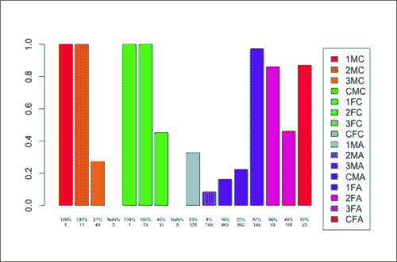*

*图例显示缩写的功能组合。例如， **1MC** 表示头等舱，男性，儿童。在没有乘客的组合情况下，我们没有关于百分比的任何信息，所以条形标签显示 **NaN%** 。*

*因为我们结合了三个特征，所以一些组非常小。例如，我们只有五个一年级男生。也有其他完全没有乘客的群体(比如机组人员中的孩子)。因此，这种方法有一定的局限性。*

*

# 使用机器学习模型探索数据

可视化每组乘客的存活率为我们提供了一个数据概览。我们知道不同的特征是如何与存活率相互影响的。例如，我们知道社会阶层对存活率的影响因性别而异。但是这两个特性哪个影响最大呢？每个特性的影响有多大？我们还没有定义这些特性的等级，也没有量化每个特性的影响。一些机器学习技术允许我们进一步调查，回答我们的问题。

## 使用决策树探索数据

我们有三个特征(阶级、性别和年龄),我们想相应地将乘客分组。我们无法为每个特征组合定义一个组，因为我们没有足够的数据用于某些组，比如第一个班级的女生。一种解决方案是将乘客分组，每组包含足够的数据。群体由特征上的一些条件来定义，例如不属于第一类的雄性。这些小组应该涵盖每一种可能的情况，不要重叠。一种识别足够大的组的机器学习技术是决策树学习。

有一位新乘客，我们知道他是二等舱的一个男孩。我们不知道乘客能否生还，我们想预测一下。我们如何使用这些数据？我们可以检查乘客是男是女。因此，根据我们之前的数据探索，他有 21%的概率活下来，因为他是男性。考虑到社会阶层，我们可以说他活下来的概率是 14%。有 179 名二等男乘客，所以这个结果是有意义的。那么，知道他是一个孩子，我们就可以查一下二等男孩子的存活率，是百分之百。说他有百分之百的概率活下来有意义吗？只有 11 名乘客是二等舱的男性儿童，所以我们没有足够的数据来做出准确的预测。应该用二等男的存活率吗？如果我们用所有男孩的存活率来代替呢？二班的孩子呢？不同的选择会导致不同的结果。

一个解决方案是识别关键特征并只考虑它们。例如，如果性别和阶级是两个最重要的特征，我们可以用它们来做预测。然而，在第三类男孩的情况下，我们比第一类男孩有更多的数据。如果我们只考虑三等男性的年龄呢？我们希望包含的功能数量取决于我们考虑的群体。

除了选择两个最重要的特征之外，我们可以定义一个标准来划分一个足够大的组，并且我们可以通过决策树来可视化这个原则。让我们假设开始时所有的乘客都属于同一个组。我们可以根据性别把他们分成两组。然后，我们可以将男性分成两组:一边是第一类，另一边是所有其他类。对雌性来说，最有意义的分裂可能是另一种:一边是孩子，另一边是成年人。

决策树学习技术从数据中学习，以便识别最有意义的拆分，并且可以用于探索数据。树继续分割数据，直到由树叶定义的组太小。然后，对于每个组，我们使用相关数据来定义一个属性，该属性可以是:

*   **Categoric** :这是一个属性，其值属于类别。在这种情况下，类别为**幸存**和**未幸存**。该树执行分类。
*   **数字**:这是一个可以衡量的属性，在这里是存活率。该树执行回归。

我们可以使用`rpart`包在 R 中构建一个决策树。此外，我们可以使用另一个包`rpart.plot`来可视化这些树。为了使用这些包，我们需要安装并加载它们。如果出现安装问题，您可以将存储库指定为`install.packages`的一个参数:

```
install.packages('rpart')
install.packages('rpart.plot')
```

安装完成后，我们可以加载两个包:

```
library('rpart')
library('rpart.plot')
```

起点是`dtTitanic`,它为每个特征组合包含一行。在构建决策树之前，我们需要将数据转换成另一种格式。我们需要为每个乘客安排一行，并且除了`Freq`之外还有相同的列。为了生成新格式的新表格，我们用`list`和`by`进行数据表操作。

对于`dtTitanic`的每一行，我们希望生成一个行数等于`Freq`的表。每一行对应于`Survived`、`Sex`、`Age`和`Class`之间的组合，因此`by`参数包含一个具有四个特征的向量。

在新表中，每一行包含一名乘客，因此`Freq`等于`1`。然后，对于`dtTitanic`的每一行，我们需要定义一个具有等于`1`的`Freq`元素的向量。为了做到这一点，我们使用`rep`,它是一个函数，将一个元素复制规定的次数。在我们的例子中，我们使用`rep(1, Freq))`。其他列复制了在`by`中定义的元素，即`Survived`、`Sex`、`Age`和`Class`，因此我们不需要重新定义它们:

```
dtLong <- dtTitanic[
  , list(Freq = rep(1, Freq)),
  by=c('Survived', 'Sex', 'Age', 'Class')
  ]
```

`Freq`是每行的`1`，所以我们不再需要它，可以删除它:

```
dtLong[, Freq := NULL]
```

为了构建一个显示存活率的决策树，我们需要改变`Survived`的格式。不是有`No`和`Yes`，而是分别要`0`和`1`。要修改该列，我们可以使用`ifelse`:

```
dtLong[, Survived := ifelse(Survived == 'Yes', 1, 0)]
```

用`head`来看看`DtLong`的前六排:

```
head(dtLong)
 Survived  Sex   Age Class
1:        0 Male Child   3rd
2:        0 Male Child   3rd
3:        0 Male Child   3rd
4:        0 Male Child   3rd
5:        0 Male Child   3rd
6:        0 Male Child   3rd

```

前六排显示了六个没有存活下来的男孩。

`dtLong`对象包含决策树算法的标准输入，我们可以使用`rpart`来构建模型。我们的目标是定义我们能够估计存活率的乘客群体:

```
help(rpart)
```

强制的参数有:

*   `formula`:这是一个公式对象，定义要预测的属性和用于预测的特征。公式由字符串定义，如`outcome ~ feature1 + feature2 + feature3`。
*   `data`:这是数据帧或数据表，在我们的例子中是`dtLong`。

我们需要从`Survived ~ Sex + Age + Class`字符串开始定义公式:

```
formulaRpart <- formula('Survived ~ Sex + Age + Class')
```

现在我们可以构建包含决策树的`treeRegr`。由于`Survived`是数字，该函数自动构建一个`regrssion`树:

```
treeRegr <- rpart(
  formula=formulaRpart,
  data=dtLong
)
```

`treeRegr`对象包含决策树，我们可以使用`prp(treeRegr)`来可视化它:

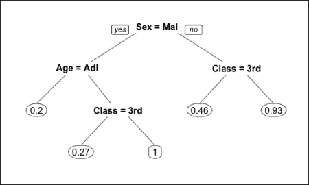

让我们看看这棵树。每个内部节点都标有将数据分成两部分的条件。例如，顶部的节点将乘客分为男性和女性。左边的分支对应于满足条件的乘客(在本例中是男性乘客)，右边的分支对应于其他乘客(女性)。每片叶子决定了群体的存活率。例如，右边的叶子表明不属于第三类的雌性的存活率是 93%。

由于缺乏数据，该树没有包含所有可能的特征组合。例如，在雌性的例子中，只有 45 个孩子，他们属于不同的社会阶层，所以树没有根据年龄划分雌性。

让我们假设我们有一个新的乘客是女性，儿童，二等舱。我们如何预测她能否幸存？她是不属于第三类的女性，所以她的预期存活率是 93%。因此，我们可以说她将有可能活下来。

这个树定义了一个存活率，它是一个数字。如果我们想预测乘客是否幸存呢？我们可以建立一个分类树，将`method='class'`输入添加到`rpart`:

```
treeClass = rpart(
    formula='Survived ~ Sex + Age + Class',
    data=dtLong,
    method='class'
)
prp(treeClass)
```

树形图如下所示:

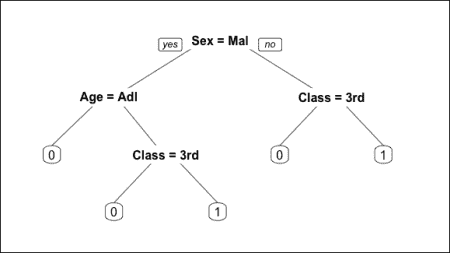

这棵树预言，幸存的乘客只有不属于第三等级的女性和儿童。这个结果对探索数据是有用的。下一步是使用机器学习模型来预测结果。我们可以使用这个树来达到这个目的，尽管它只定义了 16 种可能的特征组合中的五组乘客，所以它可能不是最合适的技术。还有更高级的算法，在下一章我们将看到其中的一种。


# 预测更新的结果

给定一名新的乘客，并知道他或她的个人信息，我们希望预测他或她是否会幸存。到目前为止，我们探索的选择是基于将乘客分组并确定每组的存活率。对于一些特征的组合，例如第一类女性儿童，我们没有足够的数据，所以我们必须使用更大群体的存活率，例如不属于第三类的女性。我们忽略了一些细节，例如，他们是孩子的事实，这样我们就失去了信息。不管我们有多少乘客，有没有一种方法可以估计任何特征组合的存活率？

有许多机器学习算法会同时考虑所有特征。在这一章中，我们看到了一个非常流行的算法，那就是**随机森林**算法。在这种情况下，这并不是最好的选择，因为当有更多的特性时，它的性能会更好，但是对于说明一种通用方法来说，这是很好的。

## 建立机器学习模型

顾名思义，随机森林算法基于许多随机决策树。该算法重复以下步骤构建`ntree`树:

1.  从 sampsize 倍的数据(在我们的例子中，即`dtLong`)中选择一个随机行来生成构建树的数据。每一行都可以选择多次，最后我们得到一个 sampsize 随机行的表。
2.  随机选择一个`mtry`数量的特征(不幸的是，在我们的例子中，我们没有很多特征，但仍然有可能选择其中的一个子集)。
3.  仅考虑所选特征，基于采样数据构建决策树。

一个随机森林模型由`ntree`决策树组成。在我们的上下文中，给定一个新乘客，模型使用每棵树来预测他们的存活率。最终的预测值是存活率之间的平均值。在算法的另一个变体中，我们用众数代替平均值。

随机森林是一种流行的算法，由`randomForest`包提供。让我们安装并加载它:

```
install.packages('randomForest')
library('randomForest')
```

像简单的决策树学习一样，随机森林属性可以是分类的或数字的。

在我们的例子中，所有的特征都是分类的，每个特征有两到四个可能的值。我们可以将特征转换成数字格式。例如，在`Sex`的情况下，可能的值是`Male`和`Female`。我们可以定义一个数字特征，在`Male`的情况下为`1`，否则为`0`。新功能以不同的方式显示相同的信息。以这种方式从范畴中导出的数字特征称为哑变量。如果一个类别特征有两个以上的类别，我们可以为每个类别定义一个虚拟变量。这样看哑变量，如果其中一个等于`1`，就知道是哪些组了。如果都等于`0`，我们就知道还剩一组。

我们可以通过以下步骤定义一个包含虚拟变量的新表:

1.  建立类别特征表的副本:

    ```
    dtDummy <- copy(dtLong)
    ```

2.  将`Sex`转换成虚拟变量:

    ```
    dtDummy[, Male := Sex == 'Male'] dtDummy[, Sex := NULL]
    ```

3.  将`Age`转换成虚拟变量:

    ```
    dtDummy[, Child := Age == 'Child'] dtDummy[, Age := NULL]
    ```

4.  将`Class`转换成三个虚拟变量:

    ```
    dtDummy[, Class1 := Class == '1st'] dtDummy[, Class2 := Class == '2nd'] dtDummy[, Class3 := Class == '3rd'] dtDummy[, Class := NULL]
    ```

5.  定义`formulaRf`公式:

    ```
    formulaRf <- formula('Survived ~ Male + Child + Class1 + Class2 + Class3')
    ```

6.  构建包含随机森林模型的`forest`。所有参数都保留默认值:

    ```
    forest <- randomForest(   formula=formulaRf,   data=dtDummy )
    ```

我们将随机森林模型存储在`forest`中，这是一个包含机器学习模型以及所有相关参数和信息的列表。我们可以通过观察列表中的元素来探索这个模型。例如，模型构建的树的数量包含在`ntree`元素中:

```
forest$ntree
[1] 500

```

另一个参数是`mtry`，它定义了每次迭代中使用的变量数量:

```
forest$mtry
[1] 1

```

树的数量默认为 500。

该算法一次只选择一个特征。原因是随机森林旨在与许多功能一起工作，因此它在这种情况下性能不佳。

另一个参数是`type`，它定义了算法的输出。随机森林可用于不同的目的，在我们的例子中，我们希望估计存活率，因此我们希望将其用于回归:

```
forest$type
[1] "regression"

```

正如所料，`forest`正在执行回归。

如果我们想改变一些参数，我们可以在自变量中定义它们。在这一章中，我们没有定义一个标准来设置参数，所以我们只是分配另一个值。例如，我们可以使用三个随机特征和每个随机特征的`1500`随机行来构建`1000`树。我们可以通过改变参数来重建`forest`:

```
forest <- randomForest(
  formula=formulaRf,
  data=dtDummy,
  ntree=1000,
  mtry=3,
  sampsize=1500
)
```

我们构建了一个随机的`forest`模型，下一小节将展示如何使用它。

## 使用模型预测新的结果

现在我们已经建立了模型，我们可以用它来执行一些预测。如果我们有一个新乘客，他们的存活率是多少？首先，让我们随机抽取一名乘客:

```
rowRandom <- dtDummy[100]
rowRandom
 Survived Freq Male Child Class1 Class2 Class3
1:       No    1 TRUE FALSE   TRUE  FALSE  FALSE

```

随机乘客是头等舱的一名成年男性。我们可以用`forest`模型来估计他的存活率。`predict`函数允许我们对新数据应用模型，获得预测:

```
predict(forest, rowRandom)
 1 
0.3830159

```

估计存活率约为 38 %,所以乘客不太可能生还。我们可以用同样的方法来预测所有乘客的存活率。然而，这意味着将模型应用于我们用来构建它的相同数据。这种方法不适合测试模型，因为预测值将与初始数据相关。请记住，这个结果不能使用，我们可以使用它来比较预测和真实数据:

```
prediction = predict(forest, dtDummy)
```

我们可以看到使用`sample`对六个随机行的预测:

```
sample(prediction, 6)
 1895       448       967      1553      1683         4 
0.6934046 0.2260507 0.2499303 0.3830159 0.2260507 0.2974706

```

我们定义了每位乘客的存活率。让我们将估计的存活率添加到`dtDummy`表中:

```
dtDummy[, SurvivalRatePred := predict(forest, dtDummy)]
```

现在，我们可以预测，如果一名乘客的存活率高于某个阈值，例如 50 %,他将会活下来。我们可以定义一个新列名`SurvivedPred`，包含我们的预测:

```
dtDummy[, SurvivedPred := ifelse(SurvivalRatePred > 0.5, 1, 0)]
```

现在我们可以将预测的存活率与初始数据进行比较。为了评估这两个值匹配的次数，我们可以定义一个`error`列，如果这两个值不匹配，它就是`TRUE`:

```
dtDummy[, error := SurvivedPred != Survived]
```

从误差栏开始，我们可以将总误差计算为我们做出错误预测的乘客的百分比。我们需要用错误的数量除以乘客的数量。由于布尔变量向量的和等于`TRUE`值的数量，所以我们可以将和应用于错误的错误数量。乘客总数由`.N`定义，在`data.table`符号中等于行数:

```
percError <- dtDummy[, sum(error) / .N]
percError
[1] 0.2094502

```

该模型在 21%的情况下预测了错误的结果，因此我们的准确率为 79%。无论如何，这个结果没有任何意义，因为我们是在我们用来建立模型的相同数据上进行预测的。此外，知道了有多少乘客幸存，我们就可以猜测出他们每个人最常见的结局。如果有超过一半的人幸存，我们可以为所有人设置`SurvivedPred = TRUE`，猜测超过一半。让我们计算一下幸存的总概率。总的存活率低于 50 %,所以每位乘客更有可能无法生还。然后，在没有任何其他信息的情况下，我们可以预测无人生还:

```
dtTitanic[Survived == 'No', sum(Freq)] / dtTitanic[, sum(Freq)]
[1] 0.676965

```

在不考虑任何特征的情况下，我们可以让达到超过 65%的准确率，所以 79%只高出 15%。此外，如前所述，这种准确性无法使用，因为我们将模型应用于构建它所用的相同数据。

## 验证模型

为了评估一个模型的真实准确性，我们可以使用一部分数据来构建它，比如 80%的乘客。然后，我们可以对剩下的 20%的数据应用该模型。我们用来建立模型的数据称为 **训练集** ，另一个称为**测试集**。

我们可以以 80%的概率将每一行分配给训练集。这样，训练集将包含大约 80%的数据。为了定义哪些行应该包括在训练集中，我们可以定义一个逻辑向量，称为`indexTrain`，它是属于训练集的每一行的`TRUE`。我们可以使用 sample 生成向量，参数如下:

*   `x`:这代表可能的值；在这种情况下，`TRUE`和`FALSE`
*   `size`:表示向量长度；在这种情况下，它等于`dtDummy`中的行数
*   `replace`:如果数值为`TRUE`，每个数值(`TRUE`或`FALSE`)可以采样多次
*   `prob`:这是一个向量，具有对`x`的值进行采样的概率；在这种情况下，它是`c(0.8, 0.2)`

考虑以下代码:

```
indexTrain <- sample(
  x=c(TRUE, FALSE),
  size=nrow(dtDummy),
  replace=TRUE,
  prob=c(0.8, 0.2)
)
```

现在，我们可以提取`indexTrain`等于`TRUE`的行:

```
dtTrain <- dtDummy[indexTrain]
```

同样，我们提取测试集的行。`!`运算符是指`NOT`，它允许提取`indexTrain`等于`FALSE`的行；

```
dtTest <- dtDummy[!indexTrain]
```

现在，我们可以使用与之前相同的参数来构建模型。知道我们有更少的数据，我们可以减少定义用于每棵树的数据的 sampsize 参数:

```
forest <- randomForest(
  formula=formulaRf,
  data=dtTrain,
  ntree=1000,
  mtry=3,
  sampsize=1200
)
```

我们建立了一个模型，没有考虑`dtTest`，所以我们可以用它来预测`dtTest`。像以前一样，我们预测如果一名乘客的存活率高于 50 %,他将会活下来。预测之后，我们可以使用与之前相同的 R 命令来估计误差:

```
dtTest[, SurvivalRatePred := predict(forest, dtTest)]
dtTest[, SurvivedPred := ifelse(SurvivalRatePred > 0.5, 1, 0)]
dtTest[, error := SurvivedPred != Survived]
percError <- dtTest[, sum(error) / .N]
percError
[1] 0.2416107

```

估计误差`percError`取决于我们如何分割数据，因此每次我们定义新的随机训练/测试分割时，它都是不同的。然而，我们可以多次重复这些步骤，并计算平均误差。这种方法被称为交叉验证，它是一种非常有用的评估准确性的工具。

本章展示了构建和验证机器学习模型的一般方法。使用这种方法，我们可以预测一个属性并估计预测的准确性。


# 总结

在本章中，我们学习了如何使用数据表操作处理数据，并构建了一些简单的 R 图用于探索性数据分析。我们学习了如何使用决策树来找到有用的见解，并建立机器学习模型(随机森林)来执行预测。我们看到了如何更改模型的参数以及如何验证它。

接下来的三章详细介绍了本章中介绍的步骤。[第 4 章](ch04.html "Chapter 4. Step 1 – Data Exploration and Feature Engineering")、*步骤 1——数据探索和特征工程*，深入展示了由数据探索和特征工程组成的机器学习的第一步。*