# 四、构建产品推荐系统

数字世界让一切都变得触手可及。随着一切都在网上进行，网上购物或电子商务已经成为一件大事。从杂货到电子产品，甚至汽车，一切都可以在亚马逊、Flipkart 和易贝世界买到。这个不断扩大的数字市场正是数据科学展示其魔力的合适场所。

电子商务的在线革命不仅赋予了消费者权力，也让他们不知所措，有太多的选择。选择不仅是在产品或类别方面，而且是在不同的电子商务平台之间。在这个竞争激烈的市场中成为一家电子商务公司可能真的很难。脱颖而出是一项挑战，这也是数据再次发挥作用的地方。

正如我们在[第 3 章](ch03.html "Chapter 3. Predicting Customer Shopping Trends with Market Basket Analysis")、*通过购物篮分析预测顾客购物趋势*中看到的，购买模式可以提供许多关于购物行为的见解。我们利用这些数据发现关联规则，不仅帮助客户快速找到合适的产品，还帮助零售商增加收入(参见[第 3 章](ch03.html "Chapter 3. Predicting Customer Shopping Trends with Market Basket Analysis")、*用购物篮分析预测客户购物趋势*)。对于关联规则，粒度位于事务级别。它们将事务作为一个中心实体，因此不提供用户特定的洞察力。

在本章中，我们也将继续我们在电子商务领域的项目工作。这里我们将解决个性化的问题。我们将使用机器学习算法为用户提供特定的建议。

通过本章，我们将了解:

*   推荐系统及其类型
*   推荐系统的问题
*   协作过滤器
*   基于矩阵分解从零开始构建推荐系统
*   利用高度优化的 R 包构建生产就绪推荐引擎并评估其推荐

在本章中，我们将互换使用术语**推荐引擎**和**推荐系统**。

# 了解推荐系统

*每个人都是独一无二的*，我们做事的方式决定了我们的独特之处。我们以一种非常独特的方式吃饭、走路、说话，甚至购物。由于本章的重点是电子商务，我们将主要关注我们的购物行为。我们将利用每位顾客的独特行为来提供个性化的购物体验。

为了完成提供个性化购物体验的任务，我们需要一个系统来理解和模拟我们的客户。推荐引擎是这样的系统，它了解顾客的偏好、选择等等，推荐更接近用户自己可能购买的新产品，从而提供个性化的体验。这种系统所提供的选择将有很高的可能性被客户购买。

让我们试着正式定义一个推荐系统。

**推荐系统**(或**推荐引擎**)是一类信息过滤系统，它分析输入数据来预测用户的偏好，就像他们可能为自己做的一样。

与删除或过滤信息的信息过滤系统不同，推荐引擎添加或重新排列流向用户的信息，这与当前上下文更相关。

推荐引擎并不是一个新概念。它们在互联网出现之前就已经存在了。他们以我们的朋友和家人的形式存在，他们曾经推荐我们买东西，因为他们理解我们的选择。这些过去是，现在仍然是一种**离线推荐引擎**。网络上充满了网上推荐引擎。从在 Twitter 上推荐关注**谁** 到在网飞上推荐**你可能喜欢的其他电影**到在 LinkedIn 上推荐**你可能感兴趣的工作**，推荐引擎无处不在，不仅仅是在电子商务平台上。

现在我们已经了解了什么是推荐引擎，让我们看看它们的不同类型:

*   **基于用户的推荐引擎**:顾名思义，这些系统以用户为中心实体。分析用户的活动、偏好或行为，以根据他们与其他这样的用户的相似性来预测他们可能喜欢什么。由于专门针对这种推荐引擎的协作过滤器的广泛使用，它们通常也被称为基于用户的协作过滤器。
*   **基于内容的推荐引擎**:顾名思义，这些引擎以内容或项目作为中心实体。分析这些项目以提取特征；此外，用户简档被构建来将用户偏好映射到项目类型。然后，引擎使用这些信息来预测与用户过去喜欢的项目相似的项目。这种推荐引擎也被称为 **基于项目的协作过滤器**，其根源在于信息检索理论。
*   **混合推荐引擎**:这些系统在预测结果的基础上，结合两个世界的优点来改进。这两种纯类型可以同时使用，然后将它们的结果结合起来；可以通过向基于内容的系统添加协作过滤功能，甚至通过将两种方法统一到一个模型中来使用它们。多项研究表明，混合方法优于简单方法。混合推荐引擎也能更好地解决困扰推荐引擎的问题。

在我们深入这些算法的复杂性之前，让我们看看影响推荐系统的问题。


# 推荐系统的问题

推荐器引擎主要受以下两个问题的影响:

*   **The sparsity problem**: Recommender engines work upon user preferences (or ratings for different items, depending upon the application) to predict or recommend products. Usually the ratings are given on some chosen scale but the user may choose not to rate certain items which he/she hasn't bought or looked at. For such cases, the rating is blank or zero. Hence, the ratings matrix R has elements of the form:

    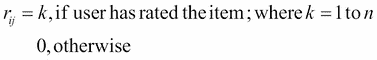

    对于任何真实世界的应用，例如电子商务平台，由于平台上可用的大量用户和项目，这样的评级矩阵的大小是巨大的。即使在这样的平台上收集了大量的用户相关信息，评级矩阵本身可能仍然相当稀疏，也就是说，矩阵可能具有许多作为空白(或零)的元素。这个问题一般被称为**稀疏性** **问题**。稀疏性问题使得推荐引擎的预测无效，因为算法由于空白或缺失评级而不能正确地推断相关性。在最坏的情况下，当实际上两个用户具有高度相似的偏好时，该算法可能将他们称为不相关的。稀疏性问题通常会影响协同过滤算法。

*   **冷启动问题**:稀疏性问题的一个特例是冷启动问题。如前所述，当评级矩阵包含稀疏填充的元素(或评级)时，推荐引擎无法返回有效的推荐。冷启动问题出现在两种特殊的情况下。首先，假设一个用户刚刚被添加到系统中。在这种情况下，代表用户的行将包含零(大多数情况下)。向这样的用户推荐项目实际上是不可能的，因为无法获得与他/她的偏好相关的信息。第二种情况是当一个项目被新添加到系统中时。由于新添加的项目没有用户的任何评级，推荐这样的项目对于推荐系统来说是困难的。因此，这两种情况代表了所谓的冷启动问题。与稀疏性问题非常相似，冷启动问题也困扰着协作过滤器。


# 协同过滤器

推荐系统和协作过滤器有着悠久的历史。从早期使用硬编码结果的特定分类的原始推荐引擎，到当前各种电子商务平台上的复杂推荐引擎，推荐引擎一直使用协作过滤器。它们不仅易于理解，而且实现起来也同样简单。在我们深入研究实现细节之前，让我们借此机会了解更多关于协作过滤器的知识。

### 注

**有趣的事实**

推荐引擎无疑超越了任何已知的电子商务平台！虚拟图书馆员 Grundy 是在 1979 年开发的。这是一个向用户推荐书籍的系统。它根据某些预定义的模式和每个类别的已知列表中的推荐书籍来为用户建模。

## 核心概念和定义

**协作过滤器**(以下记为 **CF** )和推荐引擎通常使用某些术语和定义来正式定义和处理问题。

推荐引擎的问题域围绕着用户和他们感兴趣的项目。 **用户**是与系统交互的任何人，并且对**项目**执行某些动作(比如购买或查看它)。类似地，**评级**定义了用户对所考虑的项目的偏好。一般来说，这个三元组被表示为一个`(user, item, rating)`元组。因为评级量化了用户的偏好，所以评级本身可以根据应用以不同的方式来定义。应用程序将评级定义为范围从 *0 到 5* 的整数值范围，而其他应用程序可能定义实数值范围。一些应用程序可能使用二进制标度，其值如*喜欢/不喜欢*或*购买/未购买*。因此，每个应用程序都使用一个等级来适应用户的偏好。

既然我们已经知道了相关的关键角色，下一步就是用数学方法表示这些核心概念。一组`(user, item, rating)`通常以稀疏的矩阵的形式表示，称为**评级矩阵**。每个用户由一行表示，而列表示项目。该评分矩阵的每个元素指的是用户对某个项目的评分或偏好。评级矩阵是一个**稀疏矩阵** ，因为不是所有的项目都会被每个用户评级，因此这种未评级的项目会包含空值或空白值。使用 0-5 分制的评分矩阵(未评分/缺失评分用`?`表示)如下所示，显示了三位用户对不同笔记本电脑型号的偏好:

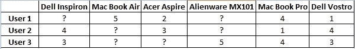

评级矩阵示例

推荐引擎的任务是执行两个主要操作:**预测**和**推荐**。预测操作对给定的用户和项目起作用，以确定用户对所考虑的项目的可能偏好。对于评级矩阵(如前面所示)，预测类似于对缺失值的识别(在前面的示例中由`?`表示)。

推荐操作在预测完成后进行。给定一个用户，推荐操作根据用户的偏好生成一个前 *N* 个项目的列表。

### 注

注意，在推荐引擎的上下文中，考虑预测和推荐任务的用户被称为**活跃用户**。

## 协同过滤算法

协作过滤器是一组广泛应用于各种应用的流行算法。众所周知，协同过滤利用相似用户的行为来为活跃用户预测和推荐项目。这些算法基于一个简单的假设，即相似的用户展示相似的行为。更正式地说，该算法假设系统中其他用户的偏好或评级可以用来为活动用户提供合理的预测。

**基于邻居的** **协同过滤**，又称为**用户-用户协同过滤**或 **kNN 协同过滤**，是协同过滤器家族中使用最早、最广泛的算法之一。kNN 协作过滤器基于具有相似偏好的用户之间的相似行为的核心假设。该算法利用相似性度量(在第 2 章、*中讨论，让我们帮助机器学习*)来预测并为活跃用户推荐商品。该算法遵循两步方法，首先计算预测，然后是建议。接下来讨论该算法的三个主要组成部分。

### 预测

kNN CF 的第一步是利用评级矩阵(通常表示为`R`)来计算预测。因为我们关心用户-用户 CF，所以要考虑表示为`u`的活动用户(所考虑的用户)的邻域。

设`U`是系统中所有可用用户的集合，`N`表示所需的邻域，其中。该算法然后使用一个相似性度量，比如说`s`，来计算`u`的邻居。一旦`N` ( `u`的邻域)被识别，相邻用户的评级被聚集以计算`u`对当前项目的偏好。聚集偏好最常见的方法是使用`N`个相邻用户的**加权平均值**。

数学上，活动用户`u`对项目`i`的预测偏好，表示为`p[ui]`，给出如下:

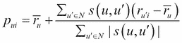

其中:

*   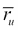是活跃用户`u's`的平均评分
*   是活动用户 u 和相邻用户之间的相似性度量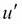

在前面的等式中，我们从相邻用户的平均评级中减去活动用户的平均评级，以消除用户的评级偏差(一些用户给出极高或极低的评级，因此他们可能会对整体预测评级产生偏差)。一个有偏见的推荐引擎可能会阻止更好的用户-产品匹配，以支持受欢迎的或反对不太受欢迎的。我们可以通过使用标准偏差来控制平均值上的评分分布，从而标准化用户的评分，从而进一步改进预测。为了简单起见，我们将使用前面提到的等式。下图描述了活动用户的最近邻居:

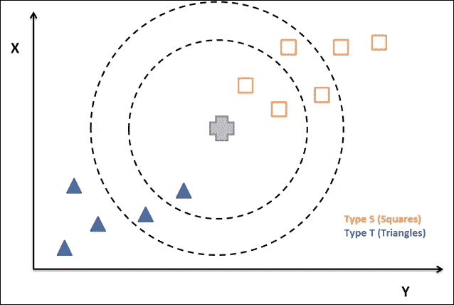

最近邻居( *K=3* )

现在的问题是，为什么只使用加权平均来预测评级，以及邻居的最佳数量(`N`)是多少。使用加权平均值的原因是，这是有助于产生一致结果的一种方法。多年来，不同的系统使用了各种方法，如*多元回归*(视频推荐的 BellCore 系统)、*未加权平均*(音乐推荐的 Ringo)等等，但加权平均在实践中表现得相当好。

### 注意

有关更多信息，请参阅 W. Hill、L. Stead、M. Rosenstein 和 G. Furnas 的文章*在虚拟使用社区中推荐和评估选择*，载于 ACM CHI '95，第 194-201 页，ACM Press/Addison-Wesley Publishing co .，1995。

关于最佳邻居数量的第二个问题，这是一个非常依赖于应用的问题。我们在[第二章](ch02.html "Chapter 2. Let's Help Machines Learn")、*中看到，让我们帮助机器学习*，邻居的数量可以如何改变算法的结果(参见*K-最近邻居* ( *KNN* ))，类似地`N`的值可以影响推荐引擎的结果。通常，限制相邻用户的数量有助于通过移除与活动用户相关性低的用户来降低噪声。不过话说回来，`N`的价值取决于应用，需要数据科学家进行尽职调查。

### 建议

一旦对*活跃用户*进行了预测，就可以通过按照预测排名对项目进行排序来生成推荐列表。该推荐列表可以通过应用某些最小阈值和其他用户特定特征，例如对颜色、尺寸、价格敏感度等的偏好，来进一步微调。因此，该步骤基于他/她的个人偏好生成用户更有可能购买的可能物品的列表。我们将在接下来的部分*构建推荐引擎*中对此进行更多介绍。

### 相似度

相似性度量是我们基于协同过滤的推荐引擎算法的重要组成部分。有多种相似性度量可供使用。其中最常见的是**余弦相似度**度量。这种方法将每个用户表示为一个`n`维度的评级向量，并且通过计算两个这样的用户向量之间的余弦距离来测量相似性。

数学上，余弦相似度如下所示:

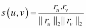

其中，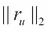和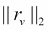是每个评价向量的 **L2** 或**欧几里德** **范数**。

**Pearson** **相关性**和 **Spearman 等级相关性**是一对统计相似性度量，也被广泛使用。

既然我们已经了解了协作过滤器的基本知识和一般概念，我们就可以开始研究实现细节了。让我们从一砖一瓦地建立推荐系统开始吧！


# 构建推荐引擎

正如在前一节中所讨论的，协同过滤是一种简单但非常有效的预测和推荐项目给用户的方法。如果我们仔细观察，算法对输入数据起作用，输入数据只不过是不同产品的用户评级的矩阵表示。

将数学观点引入图中，**矩阵分解**是一种操作矩阵并从矩阵中表示的数据中识别潜在或隐藏特征的技术。基于相同的概念，让我们使用矩阵分解作为预测用户尚未评级的项目的评级的基础。

## 矩阵分解

矩阵分解是指识别两个或多个矩阵，当这些矩阵相乘时，我们得到原始矩阵。如前所述，矩阵分解可用于发现两种不同实体之间的潜在特征。在为我们的电子商务平台准备推荐引擎的过程中，我们将理解并使用矩阵分解的概念。

由于我们当前项目的目标是个性化购物体验，并为电子商务平台推荐产品评级，因此我们的输入数据包含网站上各种产品的用户评级。我们处理输入数据，并将其转换为矩阵表示，以便使用矩阵分解进行分析。输入数据如下所示:

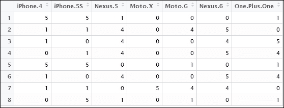

用户评级矩阵

如您所见，输入数据是一个矩阵，每行代表一个特定用户对列中不同项目的评分。对于当前案例，表示项目的列是不同的手机，如 iPhone 4、iPhone 5s、Nexus 5 等等。每行包含八个不同用户对这些手机的评分。评级范围从 1 到 5，1 为最低，5 为最高。评级为 0 表示未评级的项目或缺少评级。

我们的推荐引擎的任务将是为输入矩阵中缺失的那些预测正确的评级。然后，我们可以使用预测的评分来推荐用户最想要的项目。

这里的前提是，如果两个用户喜欢产品或物品的相似特征，他们会相似地评价产品。由于我们目前的数据与不同手机的用户评级相关，人们可能会根据手机的硬件配置、价格、操作系统等对手机进行评级。因此，矩阵分解试图识别这些潜在特征，以预测某个用户和某个产品的评分。

在试图识别这些潜在特征时，我们从这样一个基本假设出发，即这些特征的数量少于所考虑的项目总数。这个假设是有道理的，因为如果是这样的话，那么每个用户都会有一个与他/她相关联的特定特性(产品也是如此)。这反过来会使推荐无效，因为没有一个用户会对由其他用户评级的项目感兴趣(通常不是这种情况)。

现在让我们进入矩阵分解的数学细节和我们的推荐引擎。

由于我们正在处理不同产品的用户评级，让我们假设`U`是代表用户偏好的矩阵，类似地，矩阵`P`代表我们有评级的产品。那么评级矩阵`R`将被定义为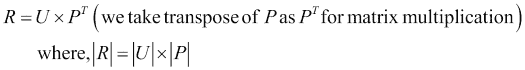。

假设该过程帮助我们识别`K`潜在特征，我们的目标是找到两个矩阵`X`和`Y`，使得它们的乘积(矩阵乘法)近似于`R`。

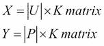

其中，`X`是表示用户和潜在特征之间的关联的用户相关矩阵。另一方面，`Y`是代表产品和潜在特征之间的关联的产品相关矩阵。

预测用户`u[i]`对产品`p[j]`的评分的任务是通过计算`p[j]` ( `vector Y`即用户)和`u[i]` ( `vector X`即产品`)`对应的向量的点积来完成的。


现在，为了找到矩阵`X`和`Y`，我们利用了一种叫做**梯度下降**的技术。梯度下降，用简单的话来说，就是试图找到一个函数的局部最小值；这是一种优化技术。我们在当前上下文中使用梯度下降来迭代地最小化预测评级和实际评级之间的差异。首先，我们随机初始化矩阵`X`和`Y`，然后计算它们的乘积与实际评级矩阵`R`的差异。

预测值和实际值之间的差异被称为**误差**。对于我们的问题，我们将考虑**的平方误差，其计算公式为:**

**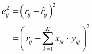**

**其中，`r[ij]`是用户`i`对产品`j`的实际评分，是产品`j`的预测值。**

**为了最小化误差，我们需要找到正确的方向或梯度来改变我们的值。为了获得每个变量`x`和`y`的梯度，我们将它们分别区分为:**

**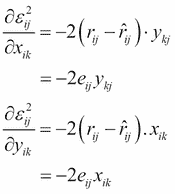**

**因此，找到`x[ik]`和`y[kj]`的方程式可以给出为:**

**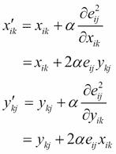**

**其中`α`是常数,表示下降的**速率**或接近最小值的速率(也称为学习速率)。`α` 的值定义了我们在任一方向上达到最小值的步长。大值可能导致振荡，因为我们每次都可能超过最小值。通常的做法是为`α`选择非常小的值，数量级为`10^(-4)`。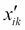和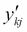是每次梯度下降迭代后`x[ik]`和`y[kj]`的更新值。**

**正如在[第二章](ch02.html "Chapter 2. Let's Help Machines Learn")、*让我们帮助机器学习*中看到的，机器学习算法会遭受过拟合。为了避免过度拟合，同时控制矩阵`X`和`Y`中的极值或大值，我们引入了正则化的概念。从形式上来说，**正则化**指的是为了防止过拟合而引入附加信息的过程。正则化会惩罚具有极值的模型。**

**为了防止过度拟合，我们引入了正则化常数`β`。随着`β`的引入，等式更新如下:**

**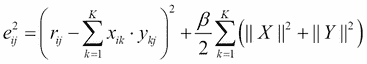**

**还有，**

**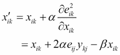****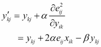**

**由于我们已经有了评级矩阵`R`并使用它来确定我们的预测值与实际值的差距，矩阵分解变成了一个监督学习问题。对于这个有监督的问题，就像我们在[第二章](ch02.html "Chapter 2. Let's Help Machines Learn")、*让我们帮助机器学习*中看到的，我们用其中的一些行作为我们的训练样本。设`S`是我们的训练集，元素是形式为`(u[i], p[j], r[ij])`的元组。因此，我们的任务是最小化训练集`S`中每个元组`(u[i], p[j], r[ij])` `є`的误差(`e[ij]`)。**

**总误差(比如`E`)可以计算为:**

**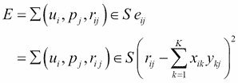**

## **实施**

**既然我们已经研究了矩阵分解的数学原理，让我们将算法转换成代码，并为之前讨论的手机评分输入数据集准备一个推荐引擎。**

**如*矩阵因式分解*部分所示，输入数据集是一个矩阵，每行代表用户对列中提到的产品的评分。评级范围从 1 到 5，0 代表缺失值。**

**为了将我们的算法转换成工作代码，我们需要计算并完成以下任务:**

*   **加载输入数据并将其转换为评级矩阵表示**
*   **准备基于矩阵分解的推荐模型**
*   **预测并向用户推荐产品**
*   **解释和评估模型**

**将输入数据加载并转换为矩阵表示很简单。如前所述，R 为我们提供了简单易用的实用函数。**

```r
 **# load raw ratings from csv**

**raw_ratings <- read.csv(<file_name>)**

**# convert columnar data to sparse ratings matrix**

**ratings_matrix <- data.matrix(raw_ratings)** 
```

**现在我们已经将数据加载到一个`R`矩阵中，我们继续准备用户潜在特征矩阵`X`和商品潜在特征矩阵`Y`。我们使用`runif`函数从均匀分布初始化两者。**

```r
 **# number of rows in ratings**

**rows <- nrow(ratings_matrix)**

**# number of columns in ratings matrix**

**columns <- ncol(ratings_matrix)**

**# latent features**

**K <- 2**

**# User-Feature Matrix**

**X <- matrix(runif(rows*K), nrow=rows, byrow=TRUE)**

**# Item-Feature Matrix**

**Y <- matrix(runif(columns*K), nrow=columns, byrow=TRUE)** 
```

**主要组件是矩阵分解函数本身。让我们将任务一分为二，计算梯度，然后计算总误差。**

**梯度的计算涉及评级矩阵`R`和两个因子矩阵`X`和`Y,`以及常数`α`和`β`。因为我们正在处理矩阵操作(特别是乘法)，所以在开始任何进一步的计算之前，我们转置`Y`。下面几行代码将前面讨论的算法转换成 R 语法。为了便于理解，所有变量都遵循类似于算法的命名约定。**

```r
 **for (i in seq(nrow(ratings_matrix))){**

 **for (j in seq(length(ratings_matrix[i, ]))){**

 **if (ratings_matrix[i, j] > 0){**

 **# error** 

 **eij = ratings_matrix[i, j] - as.numeric(X[i, ] %*% Y[, j])**

 **# gradient calculation** 

 **for (k in seq(K)){**

 **X[i, k] = X[i, k] + alpha * (2 * eij * Y[k, j]/**

 **- beta * X[i, k])**

 **Y[k, j] = Y[k, j] + alpha * (2 * eij * X[i, k]/**

 **- beta * Y[k, j])**

 **}**

 **}**

 **}**

 **}** 
```

**算法的下一部分是计算整体误差；为了保持一致，我们再次使用相似的变量名:**

```r
 **# Overall Squared Error Calculation**

**e = 0**

**for (i in seq(nrow(ratings_matrix))){**

 **for (j in seq(length(ratings_matrix[i, ]))){**

 **if (ratings_matrix[i, j] > 0){**

 **e = e + (ratings_matrix[i, j] - /**

 **as.numeric(X[i, ] %*% Y[, j]))^2**

 **for (k in seq(K)){**

 **e = e + (beta/2) * (X[i, k]^2 + Y[k, j]^2)**

 **}**

 **}**

 **}**

**}** 
```

**最后，我们多次迭代这些计算，以减轻冷启动和稀疏的风险。我们将控制多次启动的变量称为**纪元**。一旦总误差低于某个阈值，我们也会终止计算。**

**此外，由于我们已经从均匀分布初始化了`X`和`Y`，预测值将是实数。在返回预测矩阵之前，我们对最终输出进行舍入。**

**请注意，这是一个非常简单的实现，为了便于理解，很多复杂性都被忽略了。因此，这可能导致预测矩阵包含大于 5 的值。对于当前的场景，可以安全地假设最大刻度 5 以上的值等于 5(小于 0 的值也是如此)。我们鼓励读者微调代码来处理这种情况。**

**将`α`设置为`0.0002`、`β`设置为`0.02`、`K`(即潜在特征)设置为`2`、`epoch`设置为`1000`，让我们来看一个代码的示例运行，其中总错误阈值设置为`0.001`:**

```r
 **# load raw ratings from csv**

**raw_ratings <- read.csv("product_ratings.csv")**

**# convert columnar data to sparse ratings matrix**

**ratings_matrix <- data.matrix(raw_ratings)**

**# number of rows in ratings**

**rows <- nrow(ratings_matrix)**

**# number of columns in ratings matrix**

**columns <- ncol(ratings_matrix)**

**# latent features**

**K <- 2**

**# User-Feature Matrix**

**X <- matrix(runif(rows*K), nrow=rows, byrow=TRUE)**

**# Item-Feature Matrix**

**Y <- matrix(runif(columns*K), nrow=columns, byrow=TRUE)**

**# iterations**

**epoch <- 10000**

**# rate of descent**

**alpha <- 0.0002**

**# regularization constant**

**beta <- 0.02**

**pred.matrix <- mf_based_ucf(ratings_matrix, X, Y, K, epoch = epoch)**

**# setting column names**

**colnames(pred.matrix)<-c("iPhone.4","iPhone.5s","Nexus.5","Moto.X","Moto.G","Nexus.6",/"One.Plus.One")** 
```

**前面几行代码利用前面解释的函数来准备推荐的模型。预测评级或输出矩阵如下所示:**

**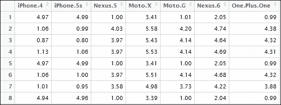

预测评级矩阵** 

## **结果解释**

**让我们做一个快速的视觉检查，看看我们的预测是好是坏。考虑用户 1 和 3 作为我们的训练样本。从输入数据集中，我们可以清楚地看到，用户 1 对 iPhones 给予了很高的评价，而用户 3 对基于 Android 的手机也给予了很高的评价。以下并排比较表明，我们的算法预测的值足够接近实际值:**

**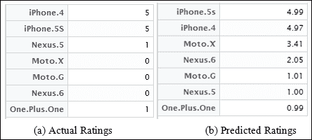

用户 1 的评分** 

**让我们在下面的截图中看到用户 3 的评分:**

**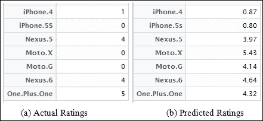

用户 3 的评分** 

**现在我们有了更新值的评级矩阵，我们准备向用户推荐产品。只显示用户尚未评价的产品是常识。正确的推荐集也将使销售者能够推销用户购买概率高的产品。**

**通常的做法是为每个用户返回未评级产品列表中的前 *N* 项的列表。所考虑的用户通常被称为**活动用户**。让我们把用户 6 看作我们的活动用户。该用户只对 Nexus 6、一加 1、Nexus 5、iPhone4 进行了评分，即 Nexus 6 评分最高，iPhone4 评分最低。使用我们的算法，为这样的客户获得一个推荐的前 2 名手机的列表，将会产生 Moto X 和 Moto G(确实非常正确，你明白为什么吗？).**

**因此，我们建立了一个足够智能的推荐引擎，向一个 Android 粉丝推荐合适的手机，并从另一场灾难中拯救了世界！**

***数据拯救！***

**这个使用矩阵分解的推荐引擎的简单实现让我们了解了这样一个系统实际上是如何工作的。接下来，让我们进入一些使用推荐引擎的真实世界。**

**

# 生产就绪推荐引擎

到目前为止，在本章中，我们已经详细了解了推荐引擎，甚至从头开始开发了一个(使用矩阵分解)。通过所有这些，这种系统的应用有多广泛是显而易见的。

如今，电子商务网站(或者任何流行的技术平台)都可以提供各种各样的内容。不仅如此，用户数量也是巨大的。在这种情况下，全球成千上万的用户同时浏览/购买商品，向他们提供推荐本身就是一项任务。让事情更加复杂的是，良好的用户体验(例如响应时间)可以让两个竞争对手产生巨大的差异。这些是日复一日处理数百万客户的生产系统的实例。

### 注

**有趣的事实**

Amazon.com 是电子商务领域最知名的公司之一，拥有 2.44 亿活跃客户。想象一下，为浏览数百万种产品的如此庞大的客户群提供推荐，需要处理的数据量有多大！

来源:[http://www.amazon.com/b?ie=UTF8&node = 8445211011](http://www.amazon.com/b?ie=UTF8&node=8445211011)

为了在这样的平台上提供无缝的使用能力，我们需要高度优化的库和硬件。对于每秒钟同时处理数千个用户的推荐引擎来说，R 有一个健壮可靠的框架叫做推荐者实验室。

Recommenderlab 是一个广泛使用的 R 扩展，旨在为推荐引擎提供一个健壮的基础。该库的重点是提供高效的数据处理、标准算法的可用性和评估能力。在本节中，我们将使用 recommenderlab 来处理相当大的数据集，以便向用户推荐商品。我们还将使用来自 recommenderlab 的评估函数来查看我们的推荐系统的好坏。这些功能将帮助我们建立一个生产就绪的推荐系统，类似(或至少更接近)许多在线应用程序，如亚马逊或网飞使用的系统。

本节中使用的数据集包含 5000 个用户对 100 个项目的评级。数据已被匿名化，产品名称已被产品 id 所取代。所用的评分等级为 0 至 5，1 为最差，5 为最佳，0 代表未评分项目或缺少评分。

要使用推荐者实验室为生产就绪系统构建推荐者引擎，需执行以下步骤:

1.  提取、转换和分析数据。
2.  准备推荐模型并生成推荐。
3.  评估推荐模型。

我们将在下面的小节中查看所有这些步骤。

## 提取、转换和分析

与任何数据密集型(尤其是机器学习)应用的情况一样，第一步也是最重要的一步是获取数据，理解/探索数据，然后将其转换为被认为适合当前应用的算法所需的格式。对于使用 recommenderlab 包的推荐引擎，我们将首先从上一节描述的 csv 文件中加载数据，然后使用各种 R 函数来研究它。

```r

# Load recommenderlab library

library("recommenderlab")

# Read dataset from csv file

raw_data <- read.csv("product_ratings_data.csv")

# Create rating matrix from data 

ratings_matrix<- as(raw_data, "realRatingMatrix")

#view transformed data

image(ratings_matrix[1:6,1:10])

```

前面的代码部分加载了 recommenderlab 包，然后使用标准的实用函数来读取`product_ratings_data.csv`文件。对于探索性的以及进一步的步骤，我们需要将数据转换成用户项目评级矩阵格式(如*核心概念和定义*部分所述)。

`as(<data>,<type>)`实用程序将`csv`转换成所需的评级矩阵格式。

`csv`文件包含如下截图所示格式的数据。每行包含一个用户对特定产品的评分。列标题不言自明。

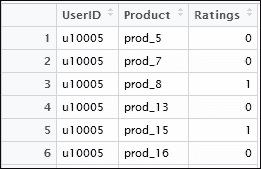

产品评级数据

`realRatingMatrix`转换将数据转换成矩阵，如下图所示。用户被描述为行，而列代表产品。评级使用梯度等级表示，白色表示缺失/未评级，黑色表示评级为 5/最佳。

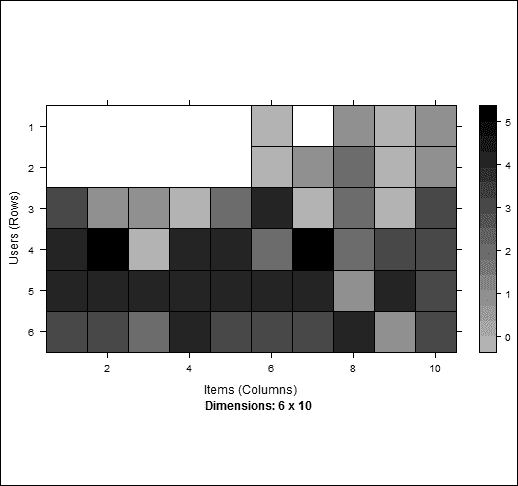

我们数据的评级矩阵表示

现在，我们的环境中已经有了数据，让我们探索它的一些特征，看看我们是否能够破译一些关键的模式。

首先，我们从我们的主数据集中提取一个代表性样本(参考截图*产品评级数据*)并对其进行分析:

*   我们用户群的平均评分
*   项目评级在用户群体中的传播/分布
*   每个用户评价的项目数

下面几行代码帮助我们探索数据集样本，并分析前面提到的要点:

```r

# Extract a sample from ratings matrix

sample_ratings <-sample(ratings_matrix,1000)

# Get the mean product ratings as given by first user

rowMeans(sample_ratings[1,])

# Get distribution of item ratings

hist(getRatings(sample_ratings), breaks=100,/

 xlab = "Product Ratings",main = " Histogram of Product Ratings")

# Get distribution of normalized item ratings

hist(getRatings(normalize(sample_ratings)),breaks=100,/

 xlab = "Normalized Product Ratings",main = /

 " Histogram of Normalized Product Ratings")

# Number of items rated per user

hist(rowCounts(sample_ratings),breaks=50,/

 xlab = "Number of Products",main =/

 " Histogram of Product Count Distribution")

```

出于探索的目的，我们从我们的数据集中抽取了一个由 1，000 名用户组成的样本。在我们的用户评级样本中，第一行给出的产品评级平均值是`2.055`。这告诉我们，这个用户要么没有看过/评价过很多产品，要么他通常对产品的评价很低。为了更好地了解用户对产品的评价，我们生成了一个项目评价分布直方图。这个分布在中间左右达到峰值，也就是`3`。直方图如下所示:

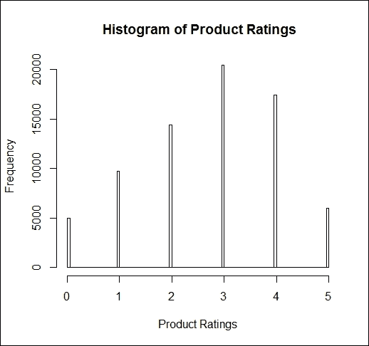

评分分布直方图

直方图显示，对于评分非常高或非常低的产品，评分正态分布在平均值附近，计数较低。

最后，我们检查用户评价的产品数量的分布。我们准备了一个直方图来显示这种分布:

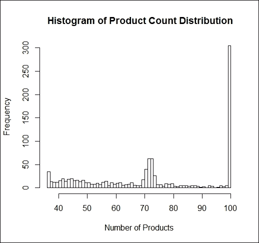

评级产品数量直方图

前面的直方图显示，有许多用户对`70`或更多产品进行了评价，也有许多用户对所有`100`产品进行了评价。

exploration 步骤帮助我们了解数据的状况。我们还可以了解用户通常对产品的评价方式，以及有多少产品正在被评价。

## 模型准备和预测

我们的 R 环境中有数据，这些数据已经转换成评级矩阵格式。在这一部分中，我们感兴趣的是准备一个基于基于用户的协同过滤的推荐引擎。我们将使用与前面章节中描述的相似的术语。Recommenderlab 提供了简单实用的工具来学习和准备构建推荐引擎的模型。

我们基于仅 1000 名用户的样本来准备我们的模型。这样，我们可以使用该模型来预测评级矩阵中其余用户的缺失评级。以下代码行利用前一千行来学习模型:

```r

# Create 'User Based collaborative filtering' model 

ubcf_recommender <- Recommender(ratings_matrix[1:1000],"UBCF")

```

前面代码中的“`UBCF`”表示基于用户的协同过滤。推荐者实验室还提供了其他算法，如 **IBCF** 或**基于项目的协同过滤**、 **PCA** 或**主成分分析**以及其他。

准备好模型后，我们用它来预测系统中第 1010^位和第 1011^位位【用户】的评分。Recommenderlab 还要求我们提及要推荐给用户的项目数量(当然是按照偏好的顺序)。对于当前的情况，我们提到 5 作为推荐的项目数。

```r

# Predict list of product which can be recommended to given users

recommendations <- predict(ubcf_recommender,/

 ratings_matrix[1010:1011], n=5)

# show recommendation in form of the list

as(recommendations, "list")

```

前面几行代码生成了两个列表，每个用户一个。这些列表中的每个元素都是推荐产品。该模型预测，对于用户 1，010，产品`prod_93`应该被推荐为最热门的产品，其次是`prod_79`，以此类推。

```r

# output generated by the model

[[1]]

[1] "prod_93" "prod_79" "prod_80" "prod_83" "prod_89"

[[2]]

[1] "prod_80" "prod_85" "prod_87" "prod_75" "prod_79"

```

Recommenderlab 是一个强大的平台，经过优化可以处理大型数据集。只需几行代码，我们就可以加载数据、学习模型，甚至可以立即向用户推荐产品。与我们使用矩阵分解开发的基本推荐引擎相比，除了性能上的明显差异之外，它还涉及许多行代码(与 recommenderlab 相比)。

## 模型评估

我们已经成功地准备了一个模型，并用它来预测和推荐产品给我们系统中的用户。但是我们对模型的准确性了解多少呢？为了评估准备好的模型，recommenderlab 提供了方便易用的工具。因为我们需要评估我们的模型，我们需要把它分成训练和测试数据集。此外，recommenderlab 要求我们提及用于测试的项目数量(它使用其余的来计算误差)。

对于当前案例，我们将使用 500 个用户来准备一个评估模型。该模型将基于一个 90-10 训练测试数据集，分为 15 个项目用于测试集。

```r

# Evaluation scheme

eval_scheme <- evaluationScheme(ratings_matrix[1:500],/

 method="split",train=0.9,given=15)

# View the evaluation scheme

eval_scheme

# Training model

training_recommender <- Recommender(getData(eval_scheme,/

 "train"), "UBCF")

# Preditions on the test dataset

test_rating <- predict(training_recommender,/

 getData(eval_scheme, "known"), type="ratings")

#Error 

error <- calcPredictionAccuracy(test_rating,/

 getData(eval_scheme, "unknown"))

error

```

我们使用评估方案来训练基于 *UBCF* 算法的模型。来自训练数据集的准备好的模型用于预测给定项目的评级。我们最后使用方法`calcPredictionAccuracy`来计算预测测试集的已知和未知组件之间的等级的误差。对于我们的例子，我们得到如下输出:

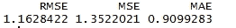

生成的输出提到了 **RMSE** 或均方根误差、 **MSE** 或均方误差、 **MAE** 或平均绝对误差的值。特别是对于 RMSE，这些值与正确值的偏差为`1.162`(注意，由于各种因素，如采样、迭代等，这些值可能会在运行中略有偏差)。当比较不同 CF 算法的结果时，这种评估将更有意义。

为了评价 UBCF，我们用 IBCF 作为对比。以下几行代码帮助我们准备一个基于 IBCF 的模型并测试评级，然后可以使用`calcPredictionAccuracy`实用程序进行比较:

```r

# Training model using IBCF

training_recommender_2 <- Recommender(getData(eval_scheme,/

 "train"), "IBCF")

# Preditions on the test dataset

test_rating_2 <- predict(training_recommender_2,/

 getData(eval_scheme, "known"),/

 type="ratings")

error_compare <- rbind(calcPredictionAccuracy(test_rating,/

 getData(eval_scheme, "unknown")),/

 calcPredictionAccuracy(test_rating_2,/

 getData(eval_scheme, "unknown")))

rownames(error_compare) <- c("User Based CF","Item Based CF")

```

比较结果显示，UBCF 的表现优于 IBCF，RMSE、MSE 和 MAE 值较低。

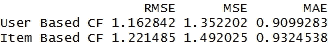

类似地，我们可以使用 recommenderlab 中可用的其他算法来测试/评估我们的模型。我们鼓励用户多尝试几次，看看哪种算法在预测收视率时误差最小。


# 总结

在这一章中，我们继续追求在电子商务领域使用机器学习来提高销售和整体用户体验。前一章讨论了基于事务日志的建议；在这一章中，我们考虑了人的因素，并研究了基于用户行为的推荐引擎。

我们从了解什么是推荐系统以及它们的分类开始，分为基于用户的、基于内容的和混合的推荐系统。我们谈到了与推荐引擎相关的问题。然后，我们深入研究了协作过滤器的细节，并讨论了预测和相似性度量的数学方法。在弄清楚我们的基础知识之后，我们开始从零开始构建我们自己的推荐引擎。我们利用矩阵分解，使用一个小的虚拟数据集逐步构建推荐引擎。然后，我们开始使用 R 的流行库 recommenderlab 构建一个生产就绪的推荐引擎。我们使用基于用户的 CF 作为核心算法，在更大的数据集上构建推荐模型，该数据集包含 5000 名用户对 100 种产品的评级。我们通过使用推荐者实验室的实用方法评估我们的推荐模型来结束我们的讨论。

接下来的几章将从电子商务转移到金融领域，并利用机器学习进行一些更有趣的用例。**