# 六、信用风险检测和预测——预测分析

在前一章中，我们讨论了金融领域中的许多领域，在这些领域中，我们接受了检测和预测可能存在潜在信贷风险的银行客户的挑战。我们现在对信用风险分析的主要目标有了一个很好的想法。除此之外，从数据集及其特征的描述性分析中获得的大量知识将对预测性分析有用，正如我们前面提到的。

在这一章中，我们将穿越预测分析的世界，它位于机器学习和数据科学的核心。预测分析包括几个方面，其中包括分类算法、回归算法、领域知识和业务逻辑，它们结合起来构建预测模型并从数据中获得有用的见解。在前一章的结尾，我们已经讨论了适用于解决我们目标的各种机器学习算法，当我们使用给定的数据集和这些算法构建预测模型时，我们将在本章探讨其中的几种算法。

预测分析的一个有趣之处是，它为希望在未来加强业务和利润的组织带来了很多希望。随着大数据的出现，大多数组织现在拥有的数据都超出了他们可以分析的范围！虽然这是一个巨大的挑战，但更严峻的挑战是从这些数据中选择正确的数据点，并建立能够正确预测未来结果的预测模型。然而，在这种方法中有几个注意事项，因为每个模型基本上都是基于公式、假设和概率的数学函数。此外，在现实世界中，条件和场景不断变化和发展，因此人们必须记住，今天建立的预测模型明天可能完全多余。

许多怀疑论者说，由于环境随时间不断变化，计算机很难模仿人类预测甚至人类都无法预测的结果，因此所有的统计方法都只有在理想的假设和条件下才有价值。虽然这在某种程度上是正确的，但有了正确的数据、正确的思维方式，并通过应用正确的算法和技术，我们可以建立强大的预测模型，这些模型肯定可以尝试并解决用传统或蛮力方法无法解决的问题。

预测建模是一项艰巨的任务，虽然可能会有许多挑战，并且结果可能总是难以获得，但人们必须有所保留地对待这些挑战，并记住著名统计学家 George E.P. Box 的名言，他声称*基本上所有的模型都是错误的，但有些是有用的！*，根据我们之前讨论的内容，这是非常正确的。永远记住，预测模型永远不会是 100%完美的，但是，如果它是用正确的原则建立的，它将非常有用！

在本章中，我们将关注以下主题:

*   预测分析
*   如何预测信用风险
*   预测建模中的重要概念
*   获取数据
*   数据预处理
*   特征选择
*   使用逻辑回归建模
*   使用支持向量机建模
*   使用决策树建模
*   使用随机森林建模
*   使用神经网络建模
*   模型比较和选择

# 预测分析

我们已经在上一章中讨论了相当多的预测分析，让您大致了解它的含义。我们将在这一部分更详细地讨论它。预测分析可以定义为机器学习领域的一个子集，它包括各种基于数据科学、统计学和数学公式的监督学习算法，使我们能够使用这些算法和已经收集的数据来建立预测模型。这些模型使我们能够根据过去的观察对未来可能发生的事情做出预测。将此与领域知识、专业知识和业务逻辑相结合，使分析师能够使用这些预测做出数据驱动的决策，这是预测分析的最终结果。

我们在这里谈论的数据是在过去已经观察到的数据，并且是在一段时间内收集的用于分析的数据。这些数据通常被称为历史数据或训练数据，用于模型。然而，在预测建模方法的大部分时间里，我们不直接输入原始数据，而是使用经过适当转换后从数据中提取的特征。数据特征与监督学习算法一起形成预测模型。当前获得的数据然后可以被馈送到该模型，以预测正在观察的结果，并且还测试该模型在各种准确度度量方面的性能。这些数据在机器学习领域被称为测试数据。

我们在本章中执行预测分析时将遵循的分析管道是一个标准流程，将在以下步骤中简要说明:

1.  **获取数据**:我们在这里获取数据集，我们将在其上构建预测模型。我们将对数据集进行一些基本的描述性分析，我们已经在前一章中介绍过了。一旦我们有了数据，我们将进入下一步。
2.  **数据预处理**:在这一步中，我们进行数据转换，如改变数据类型、特征缩放和归一化，如果需要，为模型训练准备数据。通常这一步骤在数据集准备步骤之后进行。然而，在这种情况下，最终结果是相同的，所以我们可以按任何顺序执行这些步骤。
3.  **数据集准备**:在这一步中，我们使用 70:30 或 60:40 这样的比例将来自数据的实例分成训练和测试数据集。我们通常使用训练数据集来训练一个模型，然后用测试数据集来检验它的性能和预测能力。数据通常以 60:20:20 的比例划分，除了另外两个数据集之外，我们还有一个验证数据集。然而，在本章中，我们将只保留两个数据集。
4.  **特征选择**:该过程是一个迭代过程，如果需要，甚至可以在后期进行。这一步的主要目标是从训练数据集中选择一组属性或特征，使预测模型能够给出可能的最佳预测，从而最大限度地降低错误率并提高准确性。
5.  **预测建模**:这个是我们选择最适合解决问题的机器学习算法的主要步骤，通过向该算法提供从训练数据集中提取的特征，使用该算法构建预测模型。这一阶段的输出是一个预测性的模型，可用于未来数据实例的预测。
6.  **模型评估**:在这个阶段，我们使用测试数据集从预测模型中获得预测，并使用各种技术和指标来衡量模型的性能。
7.  **模型调整**:我们微调模型的各种参数，必要时再次执行特征选择。然后，我们重建模型并重新评估，直到我们对结果满意为止。
8.  **模型部署**:一旦预测模型给出了令人满意的性能，我们就可以通过在任何应用程序中使用 web 服务来部署该模型，以提供实时或接近实时的预测。这一步更侧重于围绕部署模型的软件和应用程序开发，所以我们不会讨论这一步，因为它超出了范围。然而，有很多关于围绕预测模型构建 web 服务的教程，以支持*预测即服务*。

**最后三个步骤是重复的，如果需要可以执行几次**。

尽管前面的过程乍看起来可能相当密集，但它实际上是一个非常简单和直接的过程，一旦理解，它将在构建任何类型的预测建模中有用。需要记住的一件重要事情是，预测建模是一个迭代过程，在这个过程中，我们可能需要通过从模型预测中获得反馈并对其进行评估来多次分析数据和构建模型。因此，极其重要的是，即使您的模型在第一次运行时表现不佳，您也不要气馁，因为正如我们之前提到的，模型永远不会完美，构建一个好的预测模型是一门艺术，也是一门科学！

在下一节中，我们将重点关注如何应用预测分析来解决我们的预测问题，以及我们将在本章中探索的机器学习算法。


# 如何预测信用风险

如果您还记得上一章中我们的主要目标，我们正在处理一家德国银行的客户数据。我们将快速回顾一下我们的主要问题场景，以唤起您的记忆。这些银行客户是潜在的候选人，他们向银行申请信用贷款，条件是他们每月支付一定金额的利息以偿还贷款金额。在一个完美的世界里，信用贷款会自由发放，人们会毫无问题地偿还贷款。不幸的是，我们并不是生活在一个乌托邦的世界里，因此会有客户拖欠他们的信用贷款，无法偿还贷款金额，给银行造成巨大损失。因此，信用风险分析是银行重点关注的关键领域之一，在这里他们分析与客户及其信用历史相关的详细信息。

现在回到主要问题，为了预测信用风险，我们需要分析与客户有关的数据集，使用机器学习算法围绕它建立一个预测模型，并预测客户是否可能拖欠信用贷款，并可能被标记为潜在的信用风险。我们将遵循的实现这一点的过程是我们在前面的部分中讨论的。从上一章中，您已经对与之相关的数据和特性有了一个概念。我们将探索几种预测性的模型，理解这些模型如何工作背后的概念，然后建立这些模型来预测信用风险。一旦我们开始预测结果，我们将比较这些不同模型的性能，然后讨论业务影响以及如何从模型预测结果中获得洞察力。请注意，预测不是预测分析生命周期中的输出，但我们从这些预测中获得的有价值的见解是最终目标。金融机构等企业只有利用领域知识将预测结果和原始数据从机器学习算法转化为数据驱动的决策，才能获得价值，而这些决策在正确的时间执行，有助于业务增长。

对于这个场景，如果您记得数据集，特性`credit.rating`是响应或类变量，它指示客户的信用评级。我们将根据作为独立变量的其他特征来预测其他客户的价值。对于建模，我们将使用属于监督学习算法家族的机器学习算法。这些算法用于预测，可以分为两大类:分类和回归。然而，它们有一些不同之处，我们现在将讨论这些不同之处。在回归的情况下，要预测的变量的值是连续值，例如根据不同的特征(如房间数量、房屋面积等)预测房屋价格。回归主要处理基于输入特征的响应值的估计和预测。在分类的情况下，要预测的变量的值有离散和不同的标签，例如预测我行客户的信用评级，其中信用评级可以是好的，用`1`表示，也可以是坏的，用`0`表示。分类主要处理分类和识别数据集中每个数据元组的组成员。逻辑回归等算法是用于分类的回归模型的特殊情况，其中算法估计变量作为其他特征的函数位于其中一个类别标签中的概率。我们将在本章中使用以下机器学习算法构建预测模型:

*   逻辑回归
*   支持向量机
*   决策树
*   随机森林
*   神经网络

我们选择这些算法是为了让您对现有的各种监督机器学习算法有一个好的印象，这样您不仅可以了解这些模型背后的概念，还可以学习使用它们来实现构建模型，并使用各种技术来比较模型的性能。在我们开始分析之前，我们将浏览一下本书中提到的预测建模中的一些基本概念，并详细讨论其中一些概念，以便您对幕后发生的事情有一个好的了解。


# 预测建模中的重要概念

当我们谈论机器学习管道时，我们已经看了几个概念。在本节中，我们将了解预测建模中使用的典型术语，并详细讨论模型构建和评估概念。

## 准备数据

如前所述，数据准备步骤包括准备特征选择所需的数据集，以及使用数据构建预测模型。在这种情况下，我们经常使用以下术语:

*   **数据集**:它们通常是数据点或观察值的集合。大多数数据集通常对应于某种形式的结构化数据，包括二维数据结构，如包含各种值的数据矩阵或数据表(在 R 中，这通常用数据框表示)。例如，我们的`german_credit_dataset.csv`文件来自[第 5 章](ch05.html "Chapter 5. Credit Risk Detection and Prediction – Descriptive Analytics")、*信用风险检测和预测-描述性分析*。
*   **数据观察**:它们是数据集中的行，其中每一行都由一组针对一组属性的观察组成。这些行通常也称为元组。对于我们的数据集，包含客户信息的每一行都是一个很好的例子。
*   **数据特征**:它们是数据集中的列，描述数据集中的每一行。这些特征通常被称为属性或变量。`credit.rating`、`account.balance`等特征构成了我们信用风险数据集的特征。
*   **数据转换**:根据描述性分析的观察，根据需要转换各种数据特征的行为。数据类型转换、缺失值插补、缩放和标准化是一些最常用的技术。此外，对于分类变量，如果您的算法不能检测变量中的不同级别，您需要将其转换为几个虚拟变量；这个过程被称为一键编码。
*   **训练数据**:专门用于训练预测模型的数据。机器学习算法从该数据集中提取元组，并试图从各种观察实例中找出模式和学习。
*   **测试数据**:指的是提供给预测模型以获得预测的数据，然后我们使用该数据集元组中已经存在的类标签来检查模型的准确性。我们从不使用测试数据训练模型，因为这会使模型产生偏差并给出不正确的评估。

## 建立预测模型

我们使用机器学习算法和数据特征建立实际的预测模型，当我们向其提供新数据元组时，这些模型最终开始给出预测。与构建预测模型相关的一些概念如下:

*   **模型训练**:这类似于建立预测模型，我们使用监督机器学习算法，并向其提供训练数据特征，然后建立预测模型。
*   **预测模型**:是基于某种机器学习算法的，本质上是一种数学模型，有一些假设、公式、参数值。
*   **模型选择**:主要目的是从预测模型的多次迭代中选择一个预测模型的过程。选择最佳模型的标准可以有所不同，这取决于我们想要选择的指标，例如最大化准确性、最小化错误率或获得最大 AUC，这是我们将在后面讨论的内容。交叉验证是运行这个迭代过程的好方法。
*   **超参数优化**:基本上是尝试选择模型中算法使用的一组超参数，使模型的性能在其预测精度方面达到最优。这通常由网格搜索算法来完成。
*   **交叉验证**:这是一种模型验证技术，用于评估一个模型在一般情况下的表现。它主要用于迭代过程，其最终目标是优化模型并确保它不会与数据过度拟合，以便模型可以用新数据很好地概括并做出良好的预测。通常，会反复运行几轮交叉验证。每一轮交叉验证都包括将数据分成训练集和测试集；使用训练数据来训练模型，然后使用测试集来评估其性能。最后，我们得到一个最好的模型。

## 评估预测模型

预测建模中最重要的部分是测试所创建的模型是否真的有用。这是通过评估测试数据上的模型并使用各种度量来测量模型的性能来完成的。我们将在这里讨论一些流行的模型评估技术。为了清楚地解释这些概念，我们将考虑一个带有数据的例子。假设我们有 100 个客户，在测试数据中，其中 40 个客户的信用等级为 0 级，其余 60 个客户的信用等级为 1 级。现在让我们假设我们的模型预测 40 个坏实例中的 22 个是坏的，剩余的 18 个是好的。该模型还预测 60 个好客户中的 40 个为好客户，其余 20 个为坏客户。现在，我们将了解如何使用不同的技术评估模型性能:

*   **预测值**:它们通常是属于特定类或类别的离散值，通常被称为类标签。在我们的例子中，这是一个二元分类问题，我们处理两个类别，其中标签 1 表示信用评级良好的客户，0 表示信用评级不良。
*   **Confusion matrix**: It is a nice way to see how the model is predicting the different classes. It is a contingency table with usually two rows and two columns for a binary classification problem like ours. It reports the number of predicted instances in each class against the actual class values. For our preceding example, the confusion matrix would be a 2x2 matrix where two rows would indicate the predicted class labels and two columns would indicate the actual class labels. The total number of predictions with the bad (0) class label which are actually having the bad label is called **True Negative** (**TN**) and the remaining bad instances wrongly predicted as good are called **False Positive** (**FP**). Correspondingly, the total number of predictions with the good (1) class label that are actually labeled as good are called **True Positive** (**TP**) and the remaining good instances wrongly predicted as bad are called **False Negative** (**FN**).

    我们将在下图中对此进行描述，并讨论从混淆矩阵中得出的一些重要的指标，也在同一张图中进行了描述:

    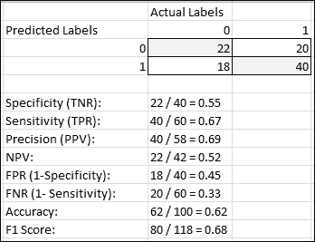

在上图中，2x2 矩阵中突出显示的值是我们的模型正确预测的值。白色的是模型预测错误的。因此我们可以很容易地推断出以下度量:TN 是 22， **FP** 是 **18** ， **TP** 是 **40** ，而 **FN** 是 **20** 。Total **N** 是 **40** ，total P 是 **60** ，在我们的示例数据集中加起来有 100 个客户。

**特异性**是也是被称为**真阴性率**，可以用公式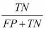来表示，它给我们以实际阴性的实例总数来正确预测总真阴性的比例。在我们的例子中，我们的特异性为 **55%** 。

**灵敏度**，也称为**真阳性率**和**召回**，有公式，公式表示由实际阳性的实例总数正确预测的总真阳性的比例。我们的例子的灵敏度是 67%。

**精度**，也被称为**正预测值**的，具有公式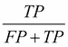，其指示所有正预测中实际正实例的数量。我们的例子有一个 69%的精度。

**否定** **预测值**有公式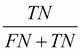，表示所有否定预测中实际否定实例的数量。我们的例子的净现值为 52% 。

****假阳性率**，又称假阳性率**，基本上是特异性的倒数；其中公式为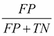，表示所有否定实例中的假肯定预测数。我们的例子有一个 45%的 FPR。****

******假** **负率**，又称 **漏率**，基本上是灵敏度的倒数；其中公式为，表示所有正例中的假阴性预测数。我们的示例的 FNR 为 **33%** 。****

******准确度**基本上是表示模型在进行预测时有多准确的度量，公式是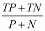。我们的预测准确率是 **62%** 。****

******F1** 得分是衡量模型准确性的另一个指标。它通过计算值的调和平均值来考虑精度和召回值，如公式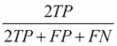所示。我们这款的 **f1** 得分 **68%** 。****

****一个**接收器** **操作者特性** ( **ROC** )曲线基本上是一个曲线图，当我们改变它的阈值时，它被用来可视化模型性能。ROC 图由 FPR 和 TPR 分别定义为 *x* 和 *y* 轴，每个预测样本可以被拟合为 ROC 空间中的一个点。对于所有的数据点，完美的绘图将包括 1 的 TPR 和 0 的 FPR。平均模型或基线模型将是从 *(0，0)* 到 *(1，1)* 的对角直线，指示两个值都是`0.5`。如果我们的模型在基础对角线上方有一条 ROC 曲线，这表明它比基线表现得更好。下图说明了典型 ROC 曲线看起来一般是怎样的:****

****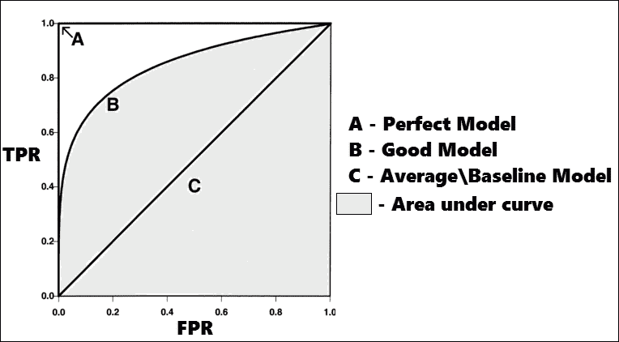****

******曲线下面积** ( **AUC** )基本上就是模型评估得到的 ROC 曲线下面积。 AUC 是一个值，它表示模型将随机选择的正面实例排序高于随机选择的负面实例的概率。所以 AUC 越高越好。请务必查看文件`performance_plot_utils.R`(与本章的代码包共享)，它有一些实用函数来绘制和描述这些值，我们将在稍后评估我们的模型时使用这些值。****

****这将为您提供足够的与预测建模相关的重要术语和概念的背景知识，现在我们将开始对数据进行预测分析！****

****

# 获取数据

在[第 5 章](ch05.html "Chapter 5. Credit Risk Detection and Prediction – Descriptive Analytics")、*信用风险检测和预测——描述性分析*中，我们已经分析了来自德国银行的信用数据集，并且已经执行了几次转换。在本章中，我们将处理转换后的数据集。我们已经保存了转换后的数据集，你可以通过打开`credit_dataset_final.csv`文件来查看。我们将像往常一样在 R 中进行所有的分析。要将数据加载到内存中，请运行以下代码片段:

```

> # load the dataset into data frame

> credit.df <- read.csv("credit_dataset_final.csv", header = TRUE, sep = ",")

```

这会将数据集加载到一个数据框中，现在可以使用`credit.df`变量轻松访问该数据框。接下来，我们将重点讨论数据转换和规范化。


# 数据预处理

在数据预处理步骤中，我们将主要关注两件事:数据类型转换和数据规范化。最后，我们将数据分为训练和测试数据集，用于预测建模。您可以在`data_preparation.R`文件中访问这一部分的代码。我们将使用一些实用函数，在下面的代码片段中会提到。记住通过在 R 控制台中运行它们来将它们加载到内存中:

```

## data type transformations - factoring

to.factors <- function(df, variables){

 for (variable in variables){

 df[[variable]] <- as.factor(df[[variable]])

 }

 return(df)

}

## normalizing - scaling

scale.features <- function(df, variables){

 for (variable in variables){

 df[[variable]] <- scale(df[[variable]], center=T, scale=T)

 }

 return(df)

}

```

前面的函数对数据帧进行操作以转换数据。对于数据类型转换，我们主要执行分类变量的因子分解，其中我们将分类特征的数据类型从数值转换为因子。有几个数字变量，包括`credit.amount`、`age`和`credit.duration.months`，它们都有不同的值，如果你记得上一章的分布，它们都是偏态分布。这有多种不利影响，如诱导共线性、梯度受到影响以及模型需要更长时间才能收敛。因此，我们将使用 z 分数归一化，其中对于名为 E 的特征，可以使用公式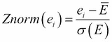来计算由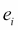表示的每个值，其中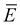表示总体平均值，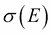表示特征`E`的标准偏差。我们使用以下代码片段对数据执行这些转换:

```

> # normalize variables

> numeric.vars <- c("credit.duration.months", "age", 

 "credit.amount")

> credit.df <- scale.features(credit.df, numeric.vars)

> # factor variables

> categorical.vars <- c('credit.rating', 'account.balance', 

+                       'previous.credit.payment.status',

+                       'credit.purpose', 'savings', 

+                       'employment.duration', 'installment.rate',

+                       'marital.status', 'guarantor', 

+                       'residence.duration', 'current.assets',

+                       'other.credits', 'apartment.type', 

+                       'bank.credits', 'occupation', 

+                       'dependents', 'telephone', 

+                       'foreign.worker')

> credit.df <- to.factors(df=credit.df, 

 variables=categorical.vars)

```

一旦预处理完成，我们将按照 60:40 的比例将数据分成训练和测试数据集，其中 600 个元组在训练数据集中，400 个元组在测试数据集中。它们将以随机方式选择，如下所示:

```

> # split data into training and test datasets in 60:40 ratio

> indexes <- sample(1:nrow(credit.df), size=0.6*nrow(credit.df))

> train.data <- credit.df[indexes,]

> test.data <- credit.df[-indexes,]

```

既然我们已经准备好了数据集，我们将在下一节探讨特性的重要性和选择。


# 功能选择

特征选择过程包括根据变量或特征的重要性对其进行排序，使用它们训练预测模型，然后尝试找出哪些变量是与该模型最相关的特征。虽然每个模型通常都有自己的一组重要特征，但对于分类，我们将在这里使用随机森林模型来尝试并找出哪些变量通常对基于分类的预测很重要。

我们执行特征选择有几个原因，包括:

*   删除冗余或不相关的功能，而不会丢失太多信息
*   通过使用过多的特征来防止模型过度拟合
*   减少由多余特征造成的模型方差
*   减少模型的训练时间和收敛时间
*   构建简单且易于解释的模型

我们将使用递归特征消除算法进行特征选择，并使用预测模型的评估算法，其中我们在不同的迭代中重复构建几个具有不同特征的机器学习模型。在每一次迭代中，我们不断消除不相关或冗余的特征，并检查我们获得最大准确性和最小误差的特征子集。因为这是一个迭代过程，并且遵循流行的贪婪爬山算法的原理，所以具有全局最优结果的穷举搜索通常是不可能的，并且取决于起点，我们可能以具有特征子集的局部最优结束，该特征子集可能不同于我们在不同运行中获得的特征子集。然而，如果我们使用交叉验证运行多次，那么所获得的子集中的大多数特征通常将是恒定的。我们将使用随机森林算法，稍后我们将对此进行更详细的解释。现在，只要记住它是一个集成学习算法，在其训练过程的每个阶段使用几个决策树。由于我们在算法的每个阶段都将一些随机性引入到这个过程中，所以这往往会减少方差和过度拟合，同时对模型的偏差有一点增加。

这个部分的代码存在于`feature_selection.R`文件中。我们将首先加载必要的库。如果您没有安装它们，请安装它们，就像我们在前面章节中所做的那样:

```

> library(caret)  # feature selection algorithm

> library(randomForest) # random forest algorithm

```

现在，我们在下面的代码片段中使用递归特征消除和随机森林为模型评估定义特征选择的效用函数。记得在R 控制台运行它，加载到内存供以后使用:

```

run.feature.selection <- function(num.iters=20, feature.vars, class.var){

 set.seed(10)

 variable.sizes <- 1:10

 control <- rfeControl(functions = rfFuncs, method = "cv", 

 verbose = FALSE, returnResamp = "all", 

 number = num.iters)

 results.rfe <- rfe(x = feature.vars, y = class.var, 

 sizes = variable.sizes, 

 rfeControl = control)

 return(results.rfe)

}

```

默认情况下，前面的代码使用交叉验证，将数据分为定型集和测试集。对于每次迭代，进行递归特征消除，并且在测试集上训练和测试模型的准确性和误差。数据分区在每次迭代中保持随机变化，以防止模型过度拟合，并最终给出模型如何以通用方式执行的一般估计。如果你观察，我们的函数默认运行 20 次迭代。请记住，在我们的例子中，我们总是在训练数据上进行训练，这些数据被内部分区，以便由函数进行交叉验证。变量`feature.vars`表示使用`train.data[,-1]`子集化可以在训练数据集中访问的所有独立特征变量，为了访问表示要预测的类别变量的`class.var`，我们使用`train.data[,1]`子集化。

### 注意

我们根本不接触测试数据，因为我们将只把它用于预测和模型评估。因此，我们不希望通过使用该数据来影响模型，因为这会导致不正确的评估。

现在，我们使用下面的代码对训练数据使用我们定义的函数来运行该算法。它可能需要一些时间来运行，所以如果您看到 R 需要一些时间来返回结果，请耐心等待:

```

rfe.results <- run.feature.selection(feature.vars=train.data[,-1], 

 class.var=train.data[,1])

# view results

rfe.results

```

查看结果时，我们得到以下输出:

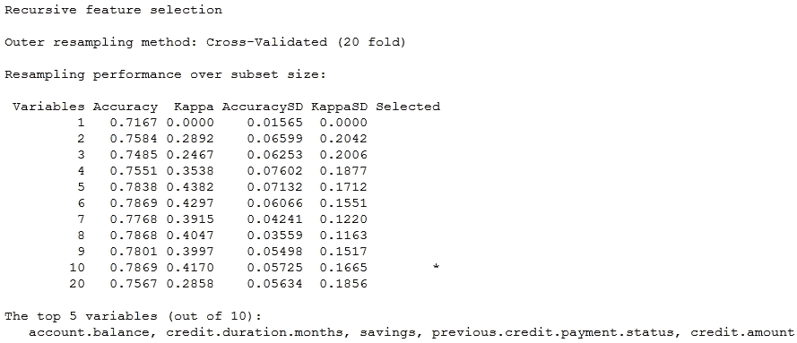

从输出中，您可以看到它总共找到了 20 个特性中最重要的 10 个特性，并且默认返回了前五个特性。您可以进一步使用这个结果变量，并通过使用 R 控制台中的`varImp(rfe.results)`命令查看所有变量及其重要性。值和重要性值可能会因您而异，因为训练和测试数据分区是随机进行的，如果您记得的话，所以如果您从屏幕截图中看到不同的值，请不要惊慌。然而，根据我们的观察，前五大特征通常会保持一致。我们现在将开始使用不同的机器学习算法构建预测模型，用于我们分析管道的下一阶段。但是，请记住，因为训练集和测试集是随机选择的，所以当我们执行这些实验时，您的集可能会给出与我们在这里描述的略有不同的结果。


# 使用逻辑回归建模

Logistic 回归是一种回归模型，其中因变量或类别变量不是连续的，而是分类的，就像我们的情况一样，信用评级是两个类别的因变量。原则上，逻辑回归通常被视为广义线性模型家族的一个特例。该模型通过估计概率来试图找出类别变量和其他独立特征变量之间的关系。它使用逻辑或 sigmoid 函数来估计这些概率。逻辑回归不直接预测类别，而是预测结果的概率。对于我们的模型，由于我们正在处理一个二元分类问题，我们将处理二项式逻辑回归。

首先，我们将如下加载库依赖项，并分离测试功能和类变量:

```

library(caret) # model training and evaluation

library(ROCR) # model evaluation

source("performance_plot_utils.R") # plotting metric results

## separate feature and class variables

test.feature.vars <- test.data[,-1]

test.class.var <- test.data[,1]

```

现在，我们将用所有独立变量训练初始模型，如下所示:

```

> formula.init <- "credit.rating ~ ."

> formula.init <- as.formula(formula.init)

> lr.model <- glm(formula=formula.init, data=train.data, family="binomial")

```

我们可以使用`summary(lr.model)`命令查看模型的详细信息，它根据的显著性值向您显示各种变量及其重要性。我们在下面的快照中展示了这些细节的一部分:

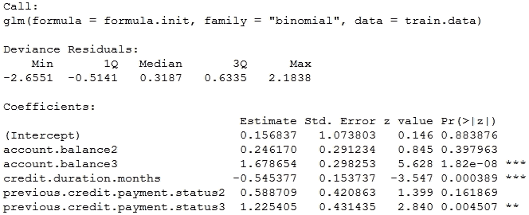

您可以看到，该模型自动执行分类变量的一次性编码，这基本上是为该变量中的每个类别提供一个变量。旁边有星的变量有 p 值`< 0.05`(我们在前一章讨论过)，因此是重要的。

接下来，我们对测试数据进行预测，并对结果进行如下评估:

```

> lr.predictions <- predict(lr.model, test.data, type="response")

> lr.predictions <- round(lr.predictions)

> confusionMatrix(data=lr.predictions, reference=test.class.var, positive='1')

```

在运行时，我们会得到一个带有相关指标的混淆矩阵，这是我们之前讨论过的，如下图所示。有趣的是，我们实现了总体准确率 **71.75%** ，这相当不错，考虑到该数据集拥有大多数信用评级良好的客户。它很好地预测了不良信用评级，这从 **48%** 的**特异性**中显而易见。**敏感度**为 **83%** ，相当不错， **NPV** 为 **58%** ， **PPV** 为 **76%** 。

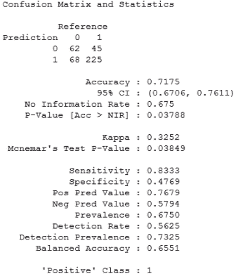

我们现在将尝试构建另一个具有一些选定功能的模型，并看看它的性能如何。如果你还记得的话，我们有一些对分类很重要的通用特征，这些特征是在前面的特征选择部分中获得的。我们仍将专门为逻辑回归运行特征选择，以使用以下代码片段查看特征重要性:

```

formula <- "credit.rating ~ ."

formula <- as.formula(formula)

control <- trainControl(method="repeatedcv", number=10, repeats=2)

model <- train(formula, data=train.data, method="glm", 

 trControl=control)

importance <- varImp(model, scale=FALSE)

plot(importance)

```

我们得到下面的图，从中我们选择前五个变量来构建下一个模型。如你所见，阅读剧情相当简单。重要性越大，变量越重要。随意添加更多的变量，并使用它们构建不同的模型！

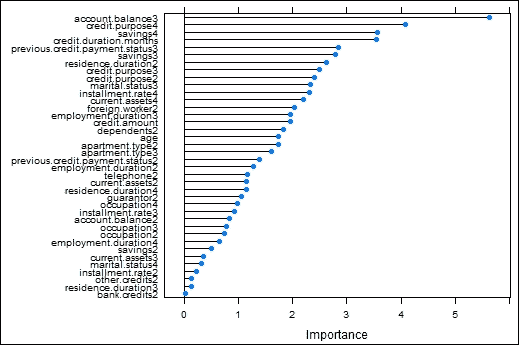

接下来，我们使用与之前类似的方法构建模型，并使用下面的代码片段在测试数据上测试模型性能:

```

> formula.new <- "credit.rating ~ account.balance + credit.purpose 

 + previous.credit.payment.status + savings 

 + credit.duration.months"

> formula.new <- as.formula(formula.new)

> lr.model.new <- glm(formula=formula.new, data=train.data, family="binomial")

> lr.predictions.new <- predict(lr.model.new, test.data, type="response") 

> lr.predictions.new <- round(lr.predictions.new)

> confusionMatrix(data=lr.predictions.new, reference=test.class.var, positive='1')

```

我们得到下面的混淆矩阵。但是，如果您查看模型评估结果，如以下输出所示，您将会看到现在准确度略有提高，为 **72.25%** 。**敏感度**已飙升至 **94%** ，这非常好，但遗憾的是，这是以牺牲特异性为代价的，特异性已下降至 **27%** ，您可以清楚地看到，更多的不良信用评级被预测为良好，在测试数据中，总共 130 个信用评级不良的客户中有 95 个！ **NPV** 已经上升到 **69%** ，因为更少的正面信用评级被误归类为假阴性，因为敏感度更高。

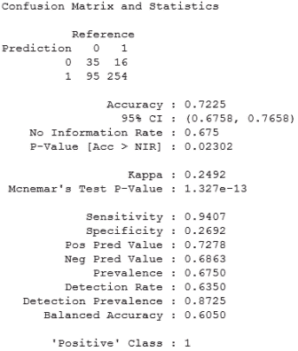

现在的问题是，我们要选择哪个模型进行预测。这不仅仅取决于的准确性，还取决于问题的领域和业务需求。如果我们预测信用评级为**不良** ( **0** )的客户为**良好** ( **1** )，这意味着我们将批准该客户的信用贷款，但该客户最终将无法还款，这将给银行造成损失。但是，如果我们预测信用评级为**良好** ( **1** )的客户为**不良** ( **0** )的客户，这意味着我们将拒绝向他发放贷款，在这种情况下，银行既不会获利，也不会遭受任何损失。这比错误地将不良信用评级预测为良好而招致巨大损失要好得多。

因此，我们选择第一个模型作为最佳模型，现在我们将使用以下代码片段查看一些指标评估图:

```

> lr.model.best <- lr.model

> lr.prediction.values <- predict(lr.model.best, test.feature.vars, type="response")

> predictions <- prediction(lr.prediction.values, test.class.var)

> par(mfrow=c(1,2))

> plot.roc.curve(predictions, title.text="LR ROC Curve")

> plot.pr.curve(predictions, title.text="LR Precision/Recall Curve")

```

我们从前面的代码中得到下面的图:

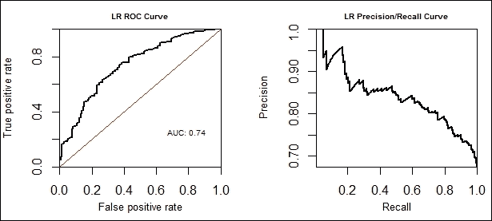

从前面的图中可以看出， **AUC** 是 **0.74** ，这对于一个开始来说是相当不错的。我们现在将使用支持向量机建立下一个预测模型，使用类似的过程，并看看它的进展如何。


# 使用支持向量机建模

支持向量机属于监督机器学习算法家族，用于分类和回归。考虑到我们的二进制分类问题，与逻辑回归不同，SVM 算法将围绕训练数据建立一个模型，以这样一种方式，即属于不同类别的训练数据点由一个清晰的间隙分开，该间隙被优化以使分开的距离最大。边缘上的样本通常被称为支持向量。将两个类分开的边缘的中间称为最优分离超平面。

在边缘错误一侧的数据点被加权以减少它们的影响，与我们前面讨论的硬分离边缘相比，这被称为软边缘。SVM 分类器可以是简单的线性分类器，其中数据点可以线性分离。然而，如果我们正在处理由几个特征组成的数据，使得不可能直接进行线性分离，那么我们利用几个核来实现相同的目的，并且这些形成非线性 SVM 分类器。您将能够想象 SVM 分类器实际上如何看起来更好，下图来自 R 中的`svm`库的官方文档:

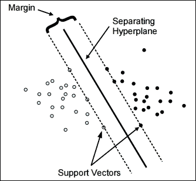

图片来源:[https://cran . r-project . org/web/packages/e 1071/vignettes/svmdoc . pdf](https://cran.r-project.org/web/packages/e1071/vignettes/svmdoc.pdf)

从图中，您可以清楚地看到，我们可以放置多个超平面来分隔数据点。然而，用于选择分离超平面的标准是这样的，即从两个类的分离距离是最大的，并且支持向量是两个类的代表性样本，如在页边上所描绘的。回到非线性分类器的问题，除了用于线性分类的常规线性核之外，SVM 有几个核可以用于实现这一点。其中包括多项式、**径向基** **函数** ( **RBF** )等几种。这些非线性核函数背后的主要原理是，即使在原始特征空间中线性分离是不可能的，它们也使得分离能够发生在更高维度的变换特征空间中，其中我们可以使用超平面来分离类别。要记住的一件重要的事情是适用于这里的维数灾难；由于我们可能最终使用更高维的特征空间，模型泛化误差增加，模型的预测能力降低。如果我们有足够的数据，它仍然合理地执行。在我们的模型中，我们将使用 RBF 核，也称为径向基函数，两个重要的参数是成本和伽玛。

我们将从加载必要的依赖项和准备测试数据特性开始:

```

library(e1071) # svm model

library(caret) # model training\optimizations

library(kernlab) # svm model for hyperparameters

library(ROCR) # model evaluation

source("performance_plot_utils.R") # plot model metrics

## separate feature and class variables

test.feature.vars <- test.data[,-1]

test.class.var <- test.data[,1]

```

完成后，我们使用训练数据和所有训练集特征上的 RBF 核来构建 SVM 模型:

```

> formula.init <- "credit.rating ~ ."

> formula.init <- as.formula(formula.init)

> svm.model <- svm(formula=formula.init, data=train.data, 

+                  kernel="radial", cost=100, gamma=1)

> summary(svm.model)

```

模型的属性由`summary`函数生成如下:

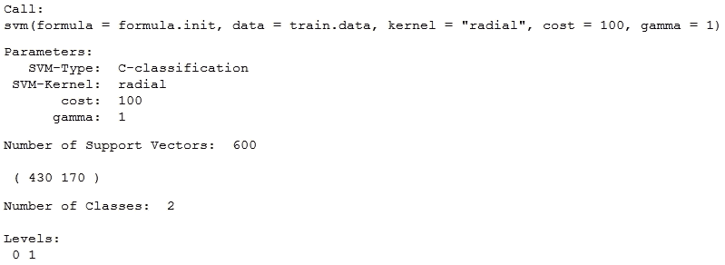

现在，我们使用该模型的测试数据进行预测，并对结果进行如下评估:

```
> svm.predictions <- predict(svm.model, test.feature.vars)

> confusionMatrix(data=svm.predictions, reference=test.class.var, positive="1")
```

这给了我们下面的混淆矩阵，就像我们在逻辑回归中看到的，并且详细描述了模型性能。我们观察到**准确度**为 **67.5%** ，**灵敏度**为 **100%** ，**特异性**为 **0%** ，这意味着只是预测每一个客户评级为好，这是一个非常激进的模型。这个模型明显受到主要分类问题的困扰，我们需要对此进行改进。

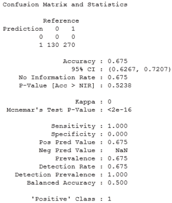

为了建立一个更好的模型，我们需要一些特征选择。我们已经有了在*功能选择*部分获得的前五个最佳功能。尽管如此，我们仍将专门为 SVM 运行一个特征选择算法来查看特征的重要性，如下所示:

```

> formula.init <- "credit.rating ~ ."

> formula.init <- as.formula(formula.init)

> control <- trainControl(method="repeatedcv", number=10, repeats=2)

> model <- train(formula.init, data=train.data, method="svmRadial", 

+                trControl=control)

> importance <- varImp(model, scale=FALSE)

> plot(importance, cex.lab=0.5)

```

这为我们提供了一个图，我们看到前五个重要变量与我们的前五个最佳特征相似，只是该算法将年龄排在比`credit.amount`更重要的位置，因此您可以通过构建几个具有不同特征的模型来测试这一点，并查看哪个给出了最佳结果。对我们来说，从随机森林中选择的特征给出了更好的结果。可变重要性图描述如下:

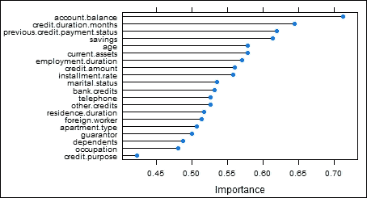

现在，我们基于为我们提供最佳结果的前五个特性构建一个新的 SVM 模型，并使用以下代码片段评估其在测试数据上的性能:

```

> formula.new <- "credit.rating ~ account.balance + 

 credit.duration.months + savings + 

 previous.credit.payment.status + credit.amount"

> formula.new <- as.formula(formula.new)

> svm.model.new <- svm(formula=formula.new, data=train.data, 

+                  kernel="radial", cost=100, gamma=1)

> svm.predictions.new <- predict(svm.model.new, test.feature.vars)

> confusionMatrix(data=svm.predictions.new, 

 reference=test.class.var, positive="1")

```

前面的代码片段最终给了我们一个关于测试数据的混淆矩阵，我们观察到整体准确性实际上下降了 **1%** 到 **66.5%** 。然而，最有趣的部分是，现在我们的模型能够从坏的预测更多的坏评级，这可以从混淆矩阵中看出。与之前的 **0%** 相比，**特异性**现在是 **38%** ，相应地，**灵敏度**从 **100%** 下降到 **80%** ，这仍然是好的，因为现在这个模型实际上是有用的并且有利可图！由此可以看出，特性选择确实非常强大。前面观察的混淆矩阵在下面的快照中描述:


我们肯定会选择该模型，并通过超参数调整继续进行模型优化，使用如下网格搜索算法优化成本和伽马参数:

```

cost.weights <- c(0.1, 10, 100)

gamma.weights <- c(0.01, 0.25, 0.5, 1)

tuning.results <- tune(svm, formula.new,

 data = train.data, kernel="Radial", 

 ranges=list(cost=cost.weights, gamma=gamma.weights))

print(tuning.results)

```

**输出**:

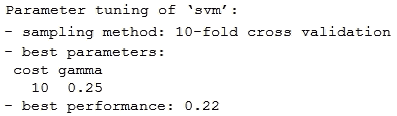

网格搜索图如下所示:

```

> plot(tuning.results, cex.main=0.6, cex.lab=0.8,xaxs="i", yaxs="i")

```

**输出:**

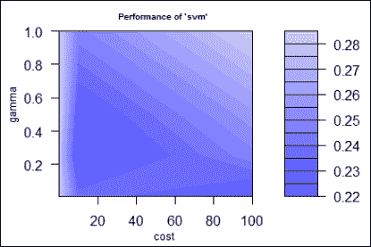

最暗的区域显示了提供最佳性能的参数值。我们现在选择最佳模型，并再次评估如下:

```

> svm.model.best = tuning.results$best.model

> svm.predictions.best <- predict(svm.model.best,

 test.feature.vars)

> confusionMatrix(data=svm.predictions.best, 

 reference=test.class.var, positive="1")

```

在观察我们从以下输出中获得的混淆矩阵结果(我们此后仅描述我们正在跟踪的指标)时，我们看到总体**准确度**已增加到 **71%** 、**灵敏度**增加到 **86%** 、**特异性**增加到 **41%** ，与之前的模型结果相比非常出色:

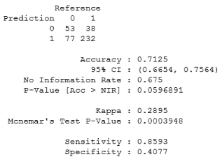

您可以看到超参数优化在预测建模中是多么强大！我们还绘制了一些评估曲线如下:

```

> svm.predictions.best <- predict(svm.model.best, test.feature.vars, decision.values = T)

> svm.prediction.values <- attributes(svm.predictions.best)$decision.values

> predictions <- prediction(svm.prediction.values, test.class.var)

> par(mfrow=c(1,2))

> plot.roc.curve(predictions, title.text="SVM ROC Curve")

> plot.pr.curve(predictions, title.text="SVM Precision/Recall Curve")

```

我们可以看到预测是如何在评估空间中绘制的，从以下 ROC 图中我们可以看到这种情况下的 AUC 是 0.69:

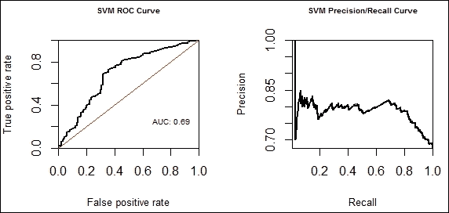

现在，假设我们想要优化基于 ROC 图的模型，目标是最大化 AUC。我们现在将尝试这样做，但是首先我们需要对分类变量的值进行编码以包含一些字母，因为 R 在表示只有数字的因子变量的列名时会引起一些问题。所以基本上，如果`credit.rating`有值`0`、`1`，那么它被转换成 **X0** 和**X1**；最终，我们的类别仍然是不同的，没有什么变化。我们首先用下面的代码片段转换数据:

```

> transformed.train <- train.data

> transformed.test <- test.data

> for (variable in categorical.vars){

+   new.train.var <- make.names(train.data[[variable]])

+   transformed.train[[variable]] <- new.train.var

+   new.test.var <- make.names(test.data[[variable]])

+   transformed.test[[variable]] <- new.test.var

+ }

> transformed.train <- to.factors(df=transformed.train, variables=categorical.vars)

> transformed.test <- to.factors(df=transformed.test, variables=categorical.vars)

> transformed.test.feature.vars <- transformed.test[,-1]

> transformed.test.class.var <- transformed.test[,1]

```

现在，我们再次使用网格搜索构建 AUC 优化模型，如下所示:

```

> grid <- expand.grid(C=c(1,10,100), sigma=c(0.01, 0.05, 0.1, 0.5, 

 1))

> ctr <- trainControl(method='cv', number=10, classProbs=TRUE,

 summaryFunction=twoClassSummary)

> svm.roc.model <- train(formula.init, transformed.train,

+                        method='svmRadial', trControl=ctr, 

+                        tuneGrid=grid, metric="ROC")

```

我们的下一步是对测试数据进行预测，并评估混淆矩阵:

```

> predictions <- predict(svm.roc.model, 

 transformed.test.feature.vars)

> confusionMatrix(predictions, transformed.test.class.var, 

 positive = "X1")

```

这给了我们以下结果:

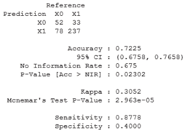

我们现在看到 **准确度**进一步提高至 **72%** ，**特异性**略有下降至 **40%** ，但**灵敏度**提高至 **87%** ，这很好。我们再次绘制曲线，如下所示:

```

> svm.predictions <- predict(svm.roc.model, transformed.test.feature.vars, type="prob")

> svm.prediction.values <- svm.predictions[,2]

> predictions <- prediction(svm.prediction.values, test.class.var)

> par(mfrow=c(1,2))

> plot.roc.curve(predictions, title.text="SVM ROC Curve")

> plot.pr.curve(predictions, title.text="SVM Precision/Recall Curve")

```

这为我们提供了以下图表，与我们在早期迭代中所做的相同:

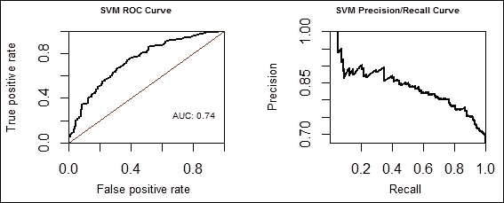

很高兴看到 AUC 确实从之前的 0.69 增加到现在的 0.74，这意味着基于 AUC 的优化算法确实有效，因为它在我们一直跟踪的所有方面都比以前的模型提供了更好的性能。接下来，我们将看看如何使用决策树建立预测模型。


# 使用决策树建模

决策树是属于监督机器学习算法家族的算法。它们也用于分类和回归，通常称为 **CART** ，代表**分类和回归树**。这些在决策支持系统、商业智能和运筹学中被大量使用。

决策树主要用于做出对实现某些目标最有用的决策，并基于这些决策设计策略。核心上，决策树只是一个有几个节点和条件边的流程图。每个非叶节点代表对特征之一的条件测试，每个边代表测试的结果。每个叶节点代表一个分类标签，在这里对最终结果进行预测。从根到所有叶节点的路径给了我们所有的分类规则。决策树易于表示、构建和理解。然而，缺点是它们很容易过度拟合，并且这些模型通常不能很好地概括。我们将遵循与之前类似的分析流程，基于决策树构建一些模型。

我们从加载必要的依赖项和测试数据特性开始:

```

> library(rpart)# tree models 

> library(caret) # feature selection

> library(rpart.plot) # plot dtree

> library(ROCR) # model evaluation

> library(e1071) # tuning model

> source("performance_plot_utils.R") # plotting curves

> ## separate feature and class variables

> test.feature.vars <- test.data[,-1]

> test.class.var <- test.data[,1]

```

现在，我们将构建一个具有以下所有功能的初始模型:

```

> formula.init <- "credit.rating ~ ."

> formula.init <- as.formula(formula.init)

> dt.model <- rpart(formula=formula.init, 

 method="class",data=train.data,control = 

 rpart.control(minsplit=20, cp=0.05))

```

我们使用以下代码预测和评估测试数据上的模型:

```

> dt.predictions <- predict(dt.model, test.feature.vars, 

 type="class")

> confusionMatrix(data=dt.predictions, reference=test.class.var, 

 positive="1")

```

从下面的输出中，我们看到模型**精度**在 **68%** 左右，**灵敏度**为 **92%** ，这是非常好的，但是**特异性**只有 **18%** ，这是我们应该尝试和改进的:

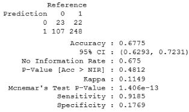

我们现在将尝试特征选择来改进模型。我们使用下面的代码来训练模型，并根据其重要性对功能进行排序:

```

> formula.init <- "credit.rating ~ ."

> formula.init <- as.formula(formula.init)

> control <- trainControl(method="repeatedcv", number=10, repeats=2)

> model <- train(formula.init, data=train.data, method="rpart", 

+                trControl=control)

> importance <- varImp(model, scale=FALSE)

> plot(importance)

```

这为我们提供了以下图表，显示了不同功能的重要性:

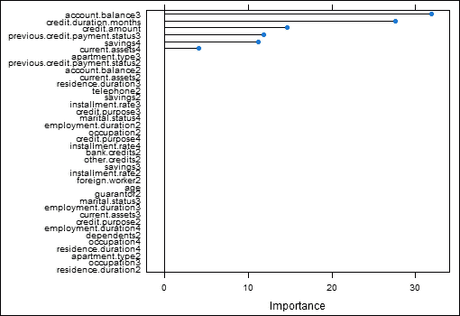

如果您仔细观察，就会发现决策树并没有使用模型构建中的所有特征，前五个特征与我们之前讨论特征选择时获得的特征相同。我们现在将使用这些功能构建一个模型，如下所示:

```

> formula.new <- "credit.rating ~ account.balance + savings +

 credit.amount + 

 credit.duration.months + 

 previous.credit.payment.status"

> formula.new <- as.formula(formula.new)

> dt.model.new <- rpart(formula=formula.new, method="class",data=train.data, 

+                   control = rpart.control(minsplit=20, cp=0.05),

+                   parms = list(prior = c(0.7, 0.3)))

```

我们现在对测试数据进行预测和评估，如下所示:

```

> dt.predictions.new <- predict(dt.model.new, test.feature.vars, 

 type="class")

> confusionMatrix(data=dt.predictions.new, 

 reference=test.class.var, positive="1")

```

这给了我们以下带有其他指标的混淆矩阵:


你现在可以看到，整个模型的**精度**已经下降了一点，降到了 **62%** 。然而，我们增加了我们的不良信用评级预测，我们预测 130 个不良信用评级客户中有 100 个，这非常好！因此，**特异性**跃升至 **77%** ，而**敏感性**下降至 **55%** ，但我们仍将大量信用评级良好的客户归类为良好。虽然这种模式有点激进，但它是一种合理的模式，因为尽管我们拒绝向更多可能拖欠付款的客户提供信用贷款，但我们也确保合理数量的优质客户获得信用贷款批准。

我们之所以获得这些结果，是因为我们已经用一个名为 prior 的参数构建了模型，如果您之前查看过建模部分的话。这个先验基本上使我们能够对类变量中的不同类应用权重。如果你还记得，我们的数据集中有 **700** 信用评级**良好的人**和 **300** 信用评级**不良的人**，这是高度偏斜的，因此在训练模型时，我们可以使用 prior 来指定该变量中每个类别的重要性，从而调整每个类别的错误分类的重要性。在我们的模型中，我们更加重视信用评级差的客户。

您可以通过使用参数`prior = c(0.7, 0.3)`来反转先验，并赋予评级良好的客户更多的重要性，这将给出以下混淆矩阵:

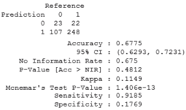

你现在可以清楚地看到，由于我们更加重视良好的信用评级，敏感性已经上升到 92%，特异性已经下降到 18%。您可以看到，这为您的建模提供了很大的灵活性，具体取决于您想要实现的目标。

为了查看模型，我们可以使用下面的代码片段:

```

> dt.model.best <- dt.model.new

> print(dt.model.best)

```

**输出**:

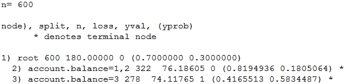

要可视化前面的树，可以使用以下内容:

```

> par(mfrow=c(1,1))

> prp(dt.model.best, type=1, extra=3, varlen=0, faclen=0)

```

这为我们提供了下面的树，我们可以看到，使用先验知识，五个特性中唯一正在使用的特性是`account.balance`，它忽略了所有其他特性。您可以通过探索`e1071`包中的`tune.rpart`功能，使用超参数调整来进一步尝试和优化模型:

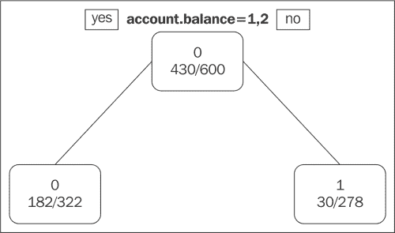

我们通过绘制如下度量评估曲线来完成我们的分析:

```

> dt.predictions.best <- predict(dt.model.best, test.feature.vars, 

 type="prob")

> dt.prediction.values <- dt.predictions.best[,2]

> predictions <- prediction(dt.prediction.values, test.class.var)

> par(mfrow=c(1,2))

> plot.roc.curve(predictions, title.text="DT ROC Curve")

> plot.pr.curve(predictions, title.text="DT Precision/Recall 

 Curve")

```

**AUC** 在 **0.66** 左右，这不是最好的，但肯定比下图中红线表示的基线要好:

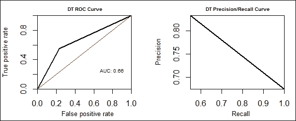

基于我们的业务需求，这种模式是相当公平的。我们将在本章后面的中讨论模型比较。我们现在将使用随机森林来构建我们的下一组预测模型。


# 使用随机森林建模

随机森林，也称为随机决策森林，是一种机器学习算法，来自集成学习算法家族。它用于回归和分类任务。随机森林只不过是决策树的集合或集合体，因此得名。

该算法的工作可以简要描述如下。在任何时间点，决策树集合中的每一棵树都是从一个引导样本构建的，该样本基本上是替换抽样。这种采样是在训练数据集上进行的。在构建决策树的过程中，先前被选为所有特征中的最佳分裂的分裂不再进行。现在，每次最佳分割总是从特征的随机子集中选择。将随机性引入到模型中稍微增加了模型的偏差，但是极大地减少了模型的方差，这防止了模型的过度拟合，这在决策树的情况下是一个严重的问题。总的来说，这产生了性能更好的通用模型。我们现在将通过加载必要的依赖项来开始我们的分析管道:

```

> library(randomForest) #rf model 

> library(caret) # feature selection

> library(e1071) # model tuning

> library(ROCR) # model evaluation

> source("performance_plot_utils.R") # plot curves

> ## separate feature and class variables

> test.feature.vars <- test.data[,-1]

> test.class.var <- test.data[,1]

```

接下来，我们将构建具有以下所有功能的初始培训模型:

```

> formula.init <- "credit.rating ~ ."

> formula.init <- as.formula(formula.init)

> rf.model <- randomForest(formula.init, data = train.data, 

 importance=T, proximity=T)

```

您可以使用以下代码查看模型的详细信息:

```

> print(rf.model)

```

**输出**:

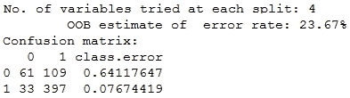

这为我们提供了关于**出袋误差** ( **OOBE** )的信息，其中约为 **23%** ，以及基于训练数据计算的混淆矩阵，以及在每次分割中使用了多少变量。

接下来，我们将使用该模型对测试数据进行预测，并对其进行评估:

```

> rf.predictions <- predict(rf.model, test.feature.vars, 

 type="class")

> confusionMatrix(data=rf.predictions, reference=test.class.var, 

 positive="1")

```

下面的输出描述了我们得到的总体**准确度**为**的 73%** ，**灵敏度**为**的 91%** ，以及**特异性**为**的 36%** :

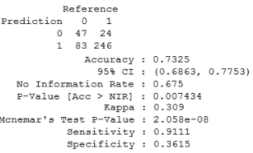

最初的模型产生了相当不错的结果。我们看到相当数量的信用评级不良的客户被归类为不良，而大多数信用评级良好的客户被评为良好。

现在，我们将使用特性选择部分的前五个特性构建一个新模型，在这里我们使用了随机森林算法本身来获得最佳特性。下面的代码片段构建了新模型:

```

formula.new <- "credit.rating ~ account.balance + savings +

 credit.amount + 

 credit.duration.months + 

 previous.credit.payment.status"

formula.new <- as.formula(formula.new)

rf.model.new <- randomForest(formula.new, data = train.data, 

 importance=T, proximity=T)

```

我们现在用该模型对测试数据进行预测，并评估其性能如下:

```

> rf.predictions.new <- predict(rf.model.new, test.feature.vars, 

 type="class")

> confusionMatrix(data=rf.predictions.new,   reference=test.class.var, positive="1")

```

这为我们提供了下面的混淆矩阵，作为其他基本性能指标的输出:

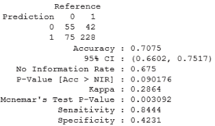

我们得到稍微降低的**准确度**为**的 71%** ，这很明显，因为我们已经消除了许多特征，但是现在**特异性**已经增加到**的 42%** ，这表明它能够将更多的坏实例正确地分类为坏实例。**灵敏度**略微下降至 **84%** 。我们现在将使用网格搜索对该模型执行超参数调整，如下所示，看看我们是否可以进一步提高性能。这里感兴趣的参数包括`ntree`，表示树的数量，`nodesize`，表示终端节点的最小大小，`mtry`，表示每次分裂时随机采样的变量的数量。

```

nodesize.vals <- c(2, 3, 4, 5)

ntree.vals <- c(200, 500, 1000, 2000)

tuning.results <- tune.randomForest(formula.new, 

 data = train.data,

 mtry=3, 

 nodesize=nodesize.vals,

 ntree=ntree.vals)

print(tuning.results)

```

**输出**:

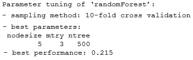

我们现在从前面的网格搜索中获得最佳模型，对测试数据执行预测，并使用以下代码片段评估其性能:

```

> rf.model.best <- tuning.results$best.model

> rf.predictions.best <- predict(rf.model.best, test.feature.vars, 

 type="class")

> confusionMatrix(data=rf.predictions.best,

 reference=test.class.var, positive="1")

```

我们可以从下面的输出中观察到一些情况。由于总体**精度**保持不变，为**的 71%** 和**的特异性**为**的 42%** ，因此性能的提升微不足道。**灵敏度**从 **84%** 略微增加到 **85%** :

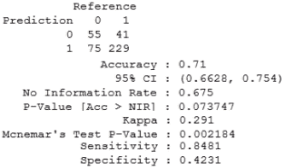

我们现在为该模型绘制一些性能曲线，如下所示:

```

> rf.predictions.best <- predict(rf.model.best, test.feature.vars, type="prob")

> rf.prediction.values <- rf.predictions.best[,2]

> predictions <- prediction(rf.prediction.values, test.class.var)

> par(mfrow=c(1,2))

> plot.roc.curve(predictions, title.text="RF ROC Curve")

> plot.pr.curve(predictions, title.text="RF Precision/Recall Curve")

```

我们观察到总 **AUC** 约为 **0.7** ，远好于下图中 **0.5** 的红色基线 **AUC** :

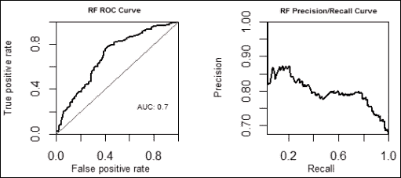

我们将探索的最后一个算法是神经网络，我们将在下一节使用它们来构建我们的模型。


# 使用神经网络建模

神经网络，或者在这种情况下更具体地说，人工神经网络，是一系列机器学习模型，其概念是基于生物神经网络的工作，就像我们的神经系统一样。神经网络已经存在很长时间了，但最近出现了一股使用深度学习和人工智能构建高度智能系统的兴趣热潮。深度学习利用深度神经网络，深度神经网络本质上是在输入和输出层之间具有大量隐藏层的神经网络。下图显示了典型的神经网络:

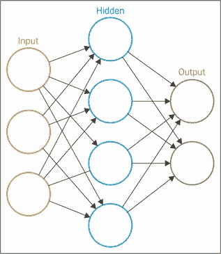

从图中，你可以推断出这个神经网络是一个由各种节点组成的互联网络，也叫做神经元。每个节点代表一个神经元，它只不过是一个数学函数。不可能深入研究如何用数学方法表示一个节点的每一个细节，但我们将在这里给出要点。这些数学函数接收一个或多个带权重的输入，这些权重在上图中表示为边，然后它对这些输入执行一些计算以给出输出。这些节点中使用的各种常用函数包括 step 函数和 sigmoid 函数，您已经看到它们在逻辑回归算法中的使用。一旦输入被函数加权和转换，这些函数的激活被发送到其他节点，直到它到达输出层。节点的集合形成一层，就像前面的图一样，我们有三层。

因此，神经网络取决于几个神经元或节点以及它们之间的互连模式，用于在每次迭代(通常称为 epoch)中更新连接权重的学习过程，以及将节点的输入和权重转换为其输出激活的节点激活函数，输出激活一层一层地传递，直到我们得到输出预测。我们将从加载必要的依赖项开始，如下所示:

```

> library(caret) # nn models

> library(ROCR) # evaluate models

> source("performance_plot_utils.R") # plot curves

> # data transformation

> test.feature.vars <- test.data[,-1]

> test.class.var <- test.data[,1]

```

我们现在将让做一些特征值编码，类似于我们为 SVM 做 AUC 优化时所做的。要刷新您的记忆，您可以运行以下代码片段:

```

> transformed.train <- train.data

> transformed.test <- test.data

> for (variable in categorical.vars){

+   new.train.var <- make.names(train.data[[variable]])

+   transformed.train[[variable]] <- new.train.var

+   new.test.var <- make.names(test.data[[variable]])

+   transformed.test[[variable]] <- new.test.var

+ }

> transformed.train <- to.factors(df=transformed.train, variables=categorical.vars)

> transformed.test <- to.factors(df=transformed.test, variables=categorical.vars)

> transformed.test.feature.vars <- transformed.test[,-1]

> transformed.test.class.var <- transformed.test[,1]

```

一旦我们准备好数据，我们将使用以下所有特征构建我们的初始神经网络模型:

```

> formula.init <- "credit.rating ~ ."

> formula.init <- as.formula(formula.init)

> nn.model <- train(formula.init, data = transformed.train, method="nnet")

```

如果您没有安装`nnet`包，前面的代码片段可能会要求您安装它，所以只要在它要求您安装时选择该选项，它就会自动安装并构建模型。如果失败，您可以单独安装它并再次运行代码。请记住，这是一个迭代过程，因此模型构建可能需要一些时间。一旦模型收敛，您可以使用`print(nn.model)`命令查看模型细节，该命令将显示具有不同大小和衰减选项的几个迭代结果，您将看到它会在内部进行超参数调整，以尝试获得最佳模型！

我们现在对测试数据进行预测，并按如下方式评估模型性能:

```

> nn.predictions <- predict(nn.model, 

 transformed.test.feature.vars, type="raw")

> confusionMatrix(data=nn.predictions, 

 reference=transformed.test.class.var, 

 positive="X1")

```

你可以从下面的输出中观察到我们的模型有一个 **精度**为 **72%** ，相当不错。它很好地预测了坏评级为坏，这从**特异性**即 **48%** 中可以明显看出，并且通常**敏感性**在 **84%** 中表现良好。

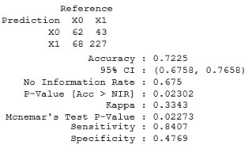

我们现在将使用以下代码片段来绘制基于神经网络的模型的重要特征:

```

> formula.init <- "credit.rating ~ ."

> formula.init <- as.formula(formula.init)

> control <- trainControl(method="repeatedcv", number=10, repeats=2)

> model <- train(formula.init, data=transformed.train, method="nnet", 

 trControl=control)

> importance <- varImp(model, scale=FALSE)

> plot(importance)

```

这为我们提供了以下根据重要性排列的图变量:

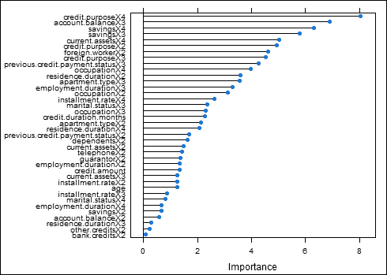

我们从前面的图中选择一些最重要的特征，并构建我们的下一个模型，如下所示:

```

> formula.new <- "credit.rating ~ account.balance + credit.purpose + savings + current.assets +

foreign.worker + previous.credit.payment.status"

> formula.new <- as.formula(formula.new)

> nn.model.new <- train(formula.new, data=transformed.train, method="nnet")

```

我们现在对测试数据进行预测，并评估模型性能:

```

> nn.predictions.new <- predict(nn.model.new, 

 transformed.test.feature.vars, 

 type="raw")

> confusionMatrix(data=nn.predictions.new, 

 reference=transformed.test.class.var, 

 positive="X1")

```

这给了我们下面的困惑矩阵，它包含了我们感兴趣的各种度量。我们从以下输出中观察到,**准确度**略微增加到了 **73%** 并且**灵敏度**现在增加到了 **87%** ，代价是**特异性**下降到了 **43%** :

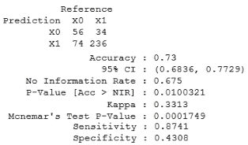

您可以检查超参数调整，它已经在内部完成，如下所示:

```

> plot(nn.model.new, cex.lab=0.5)

```

下图显示了在隐藏层中具有不同数量的节点的各种模型的准确性以及权重衰减:

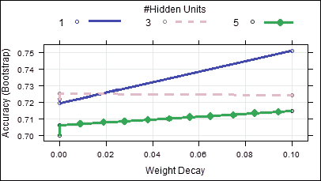

基于我们的要求，即银行使损失最小，我们选择最佳模型作为建立的初始神经网络模型，因为它具有与新模型相似的准确性，并且其特异性更高，这是极其重要的。我们现在为最佳模型绘制一些性能曲线，如下所示:

```

> nn.model.best <- nn.model

> nn.predictions.best <- predict(nn.model.best, transformed.test.feature.vars, type="prob")

> nn.prediction.values <- nn.predictions.best[,2]

> predictions <- prediction(nn.prediction.values, test.class.var)

> par(mfrow=c(1,2))

> plot.roc.curve(predictions, title.text="NN ROC Curve")

> plot.pr.curve(predictions, title.text="NN Precision/Recall Curve")

```

我们从下面的图中观察到 **AUC** 为 **0.74** ，这非常好，比用红色表示的基线好得多:


我们的预测建模会议到此结束，我们将用模型选择和比较来总结它。


# 模型比较和选择

我们已经探索了各种机器学习技术，并建立了几个模型来预测客户的信用评级，所以现在的问题是我们应该选择哪个模型，以及这些模型如何相互比较。我们的测试数据有 130 个信用等级为**不良** ( **0** )的客户实例和 270 个信用等级为**良好** ( **1** )的客户实例。

如果你还记得的话，之前我们已经讨论过在建模之后使用领域知识和业务需求来解释结果和做出决策。现在，我们的决定是选择最佳模式，为德国银行实现利润最大化和损失最小化。让我们考虑以下情况:

*   如果我们错误地将信用评级为“好”的客户预测为“坏”,银行最终将失去借给他的全部信用金额，因为他将拖欠付款，因此损失为 100%,为了便于计算，可以将其表示为-1。
*   如果我们正确地预测了一个信用评级为坏的客户，我们就正确地拒绝了他的信用贷款，因此既没有任何损失也没有任何利润。
*   如果我们正确地预测了一个信用评级良好的客户，我们就正确地给予他信用贷款。假设银行对贷款总额有利率，让我们假设利润是客户每月偿还的利息的 30%。因此，为了便于计算，利润表示为 30%或+0.3。
*   如果我们错误地预测一个信用评级良好的客户为不良客户，我们错误地拒绝了他的信用贷款，但在这种情况下既没有任何利润也没有任何损失。

记住这些条件，我们将为各种模型制作一个比较表，包括我们之前为每个机器学习算法的最佳模型计算的一些指标。请记住，考虑到所有的模型性能指标和业务需求，没有一个模型是最好的。每个模型都有自己的一组良好性能点，这在以下分析中显而易见:

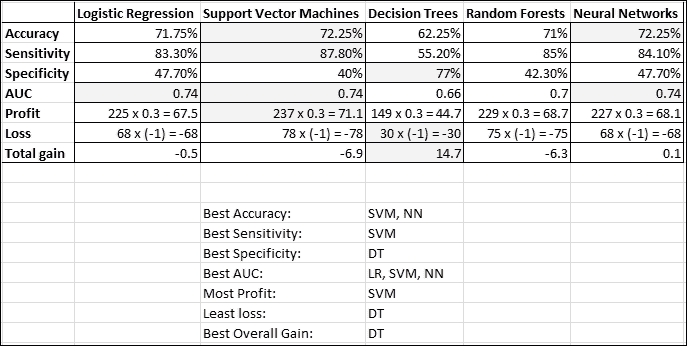

上表中突出显示的单元格显示了该特定指标的最佳性能。正如我们前面提到的，没有最佳模型，我们列出了根据每个指标表现最佳的模型。考虑到总的整体收益，决策树似乎是首选模型。但是，这是假设每个客户请求的信用贷款金额不变。请记住，如果每个客户要求不同金额的贷款，那么总收益的概念就无法比较，因为这样一来，一笔贷款的利润可能不同于另一笔贷款，不同贷款的损失也可能不同。这个分析有点复杂，超出了本章的范围，但是我们将简要地提到如何计算。如果你还记得的话，有一个`credit.amount`特性，它指定了客户请求的信用额度。由于我们在训练数据中已经有了客户数量，我们可以将评级的客户与他们请求的数量相加，并将发生亏损和盈利的客户相加，然后我们将获得银行对每种方法的总收益！


# 总结

在本章中，我们探索了监督学习世界中的几个重要领域。如果你从我们旅程的开始就跟随了这一章，并且一直坚持到最后，给自己一个鼓励吧！现在，您已经了解了预测分析的构成以及与之相关的一些重要概念。此外，我们已经了解了预测建模的工作原理以及实际应用中的完整预测分析管道。这将使您能够在未来构建自己的预测模型，并开始从模型预测中获得有价值的见解。我们还了解了如何实际使用模型进行预测，并评估这些预测来测试模型性能，以便我们可以进一步优化模型，然后根据指标和业务需求选择最佳模型。在我们结束并开始您自己的预测分析之旅之前，我想提一下，您应该始终记住奥卡姆剃刀，它指出*在竞争的假设中，应该选择假设最少的一个，*也可以解释为*有时，最简单的解决方案是最好的*。不要盲目地使用最新的软件包和技术来构建预测模型，因为首先您需要了解您正在解决的问题，然后从最简单的实现开始，这通常会比最复杂的解决方案带来更好的结果。****