<title>Chapter 7. Social Media Analysis – Analyzing Twitter Data</title> 

# 第七章。社交媒体分析——分析 Twitter 数据

互联是描述 21 世纪 T2 生活的词。虽然各种因素促成了“联系”一词，但有一个方面起到了举足轻重的作用。它被称为网络。网络使距离成为无关紧要的衡量标准，模糊了社会经济界限，它本身就是一个世界，我们都是其中的一部分。尤其是网络或互联网已经成为这场数据驱动革命的核心实体。正如我们在前面的章节中所看到的，对于大多数现代问题，网络/互联网(此后可互换使用)充当了数据的来源。无论是电子商务平台还是金融领域，互联网每秒钟都为我们提供海量数据。在这个虚拟世界中还有另一个数据海洋，它在非常私人的层面上触及我们的生活。社交网络或社交媒体是信息的巨兽，也是本章的主题。

在前一章中，我们介绍了金融领域，在这里我们分析和预测了某家银行的客户的信用风险。我们现在转变方向，进入社交媒体领域，看看机器学习和 R 如何使我们能够从这一数据海洋中揭示洞察力。

在本章中，我们将讨论以下主题:

*   社交网络的数据挖掘细节
*   不同数据可视化的重要性和用途
*   如何连接和收集 Twitter 数据的概述
*   利用 Twitter 数据揭示惊人的洞察力
*   了解社交网络如何给数据挖掘过程带来新的挑战

# 社交网络(推特)

我们每天都在使用社交网络。有许多迎合各种意识形态和哲学的社交网络，但是脸书和推特(除了几个之外)已经成为社交网络本身的同义词。这两个社交网络之所以受欢迎，不仅因为它们的独特性和服务质量，还因为它们让我们能够以一种非常直观的方式进行互动。正如我们看到的电子商务网站中使用的推荐引擎(见[第四章](ch04.html "Chapter 4. Building a Product Recommendation System")、*建立产品推荐系统*)，社交网络早在脸书、Twitter 甚至互联网之前就已经存在了。

科学家和数学家都对社交网络感兴趣。它是一个跨学科的课题，跨越但不限于社会学、心理学、生物学、经济学、传播学和信息科学。已经开发了各种理论来分析社交网络及其对人类生活的影响，其形式为影响经济、人口统计、健康、语言、文化、犯罪等的因素。

早在 19 世纪晚期所做的研究形成了我们今天所称的社交网络的基础。正如这个词本身所说，社会网络是由人类和影响社会生活的元素所代表的节点或实体之间的一种连接/网络。更正式地说，它是一个描述关系和互动的网络。因此，看到各种图论和算法被用来理解社交网络并不令人惊讶。19 世纪^(和 20 世纪^(局限于理论模型和艰苦的社会实验，而 21 世纪^(的技术已经为这些理论打开了大门，这些理论被测试、微调和建模，以帮助理解社会互动的动态。虽然通过一些社会网络(称为社会实验)来测试这些理论已经陷入了争议，但这些话题超出了本书的范围。我们将把自己限制在算法/数据科学领域，把争议留给专家去讨论。)))

### 注意

米尔格拉姆实验，或称小世界实验，是在 20 世纪 60 年代末进行的，目的是调查美国人的平均路径长度。作为这个实验的一部分，随机选择一些人作为邮件链的起点。这些随机的人被分派任务将邮件发送给下一个人，这样邮件就离它的目的地(波士顿的某个地方)更近了一步，以此类推。到目的地的平均六跳是这个著名实验的记录结果。都市民间传说暗示短语 *6 度分隔*源自这个实验，尽管米尔格拉姆博士本人从未使用过这个术语！他进行了更多的实验；搜索并感到惊讶。

来源:

[http://www.simplypsychology.org/milgram.html](http://www.simplypsychology.org/milgram.html)

在我们进入细节之前，让我们试着理解选择 Twitter 作为本章和下一章分析点的原因。让我们从理解 Twitter 是什么开始，为什么它如此受终端用户和数据科学家的欢迎。

众所周知，Twitter 是一个社交网络/微博服务，它允许用户发送和接收最多 140 个字符的推文。但是 Twitter 如此受欢迎是因为它迎合了人类的基本本能。我们人类是好奇的生物，不断地需要被倾听。对我们来说，有个人或某个地方来表达我们的观点是很重要的。我们喜欢分享我们的经历、成就、失败和想法。在某种程度上，我们也想知道我们的同龄人在做什么，名人在忙什么，或者只是新闻报道。Twitter 正好解决了这个问题。

早在 Twitter 出现之前，多种社交网络就已经存在，Twitter 取代的不是其他服务。在我们看来，是 Twitter 组织信息的方式和点击它的用户。其独特的*追随*关系模式迎合了我们对好奇心的渴望，而其简短、免费、高速的交流平台使用户能够畅所欲言，并被全球听到。通过允许用户跟踪感兴趣的人或实体，它使我们能够跟上他们的最新动态，而无需其他用户跟踪我们。*追随*模式提示 Twitter 的关系更倾向于兴趣图，而不是通常在脸书等社交网络中发现的友谊模式。

Twitter 因信息(和谣言)的超快速传播而闻名于世，并在全球范围内使用。它已经被创新性地用于某些以前无法想象的情况，例如在地震或台风等自然灾害发生时找人。它被用来传播信息，传播的广度和深度已经达到了病毒式传播的程度。不对称的关系和高速的信息交换有助于 Twitter 成为一个充满活力的实体。如果我们仔细分析和研究这个社交网络的数据和动态，我们可以发现许多见解。因此，这是本章的主题。

### 注意

**有趣的链接**:

[https://www . technology review . com/s/419368/how-Twitter-helps-in-a-disaster/](https://www.technologyreview.com/s/419368/how-twitter-helps-in-a-disaster/)

[http://www . city lab . com/tech/2015/04/how-Twitter-maps-can-be-used-during-disasters/391436/](http://www.citylab.com/tech/2015/04/how-twitter-maps-can-be-useful-during-disasters/391436/)

[https://www . Research gate . net/publication/282150020 _ A _ Systematic _ Literature _ Review _ of _ Twitter _ Research _ from _ A _ social-Political _ Revolution _ Perspective？channel = doi&linkId = 56050 B3 f 08 AE 5 e8e 3f 3125 CB&show full text = true](https://www.researchgate.net/publication/282150020_A_Systematic_Literature_Review_of_Twitter_Research_from_a_Socio-Political_Revolution_Perspective?channel=doi&linkId=56050b3f08ae5e8e3f3125cb&showFulltext=true)

[http://www . tandfonline . com/doi/ABS/10.1080/1369118 x . 2012 . 696123](http://www.tandfonline.com/doi/abs/10.1080/1369118X.2012.696123)

[http://www . PS mag . com/nature-and-technology/how-to-use-social-media-usefully](http://www.psmag.com/nature-and-technology/how-to-use-social-media-usefully)

让我们使用# RMachineLearningByExample 将一些数据科学应用到推文中！

<title>Data mining @social networks</title> 

# 数据挖掘@社交网络

到目前为止，我们已经阅读了本书的章节，理解了各种概念，学习了一些令人惊叹的算法。我们甚至参与了在日常生活中有应用的项目。简而言之，我们在没有明确使用这个术语的情况下完成了数据挖掘。现在让我们借此机会正式定义数据挖掘。

采矿，在这个词的经典意义上，是指从地球上提取有用的矿物质(如采煤)。在信息时代的背景下，挖掘是指从大量数据中提取有用的信息。因此，如果我们仔细观察，**知识** **挖掘**或**从** **数据** ( **KDD** )中发现知识似乎是比数据挖掘这个术语更好的表述。和许多关键词一样，简短和甜蜜吸引了人们的注意力。因此，您可能会在许多地方发现从数据中发现知识和数据挖掘这两个术语可以互换使用，这是正确的。数据挖掘过程类似于矿物开采，包括以下步骤:

1.  数据清理，去除噪音和不需要的数据
2.  数据转换将数据转换成相关的形式以供分析
3.  数据/模式评估揭示有趣的见解
4.  以有用的形式可视化知识的数据呈现

### 注意

数据挖掘不是使用搜索引擎来获取信息，比如关于蛇的信息。相反，它是关于揭示隐藏的洞察力，就像蛇是除了南极洲之外在每个大陆上发现的唯一的生物！

如果我们花一分钟来理解前面的步骤，我们可以看到我们在我们的项目中使用了完全相同的过程。请记住，我们只是形式化并介绍了我们在各个章节中遵循的流程，并没有遗漏或修改之前章节中完成的任何步骤。

## 挖掘社交网络数据

既然我们已经正式定义了数据挖掘，并且看到了将数据转化为知识所涉及的步骤，让我们来关注来自社交网络的数据。虽然数据挖掘方法独立于数据源，但要记住某些事情，这可能会导致更好的处理和改进的结果。

像挖掘任何其他类型的数据一样，领域知识对于挖掘社交网络数据来说绝对是一个优势。尽管社会网络分析是一个跨学科的课题(如前一节所讨论的)，但它主要涉及与用户或实体及其交互相关的数据分析。

在前面的章节中，我们已经看到了各种各样的数据，从电子商务平台到银行，再到与鲜花特性相关的数据。我们看到的数据具有不同的属性和特征。但是如果我们仔细观察，这些数据是某种测量或事件捕获的结果。

进入社交网络的领域，游戏场有点不同，如果不是完全不同的话。与我们目前所看到的不同，来自社交媒体平台的数据极具动态性。当我们说动态时，我们指的是数据点上的实际内容，而不是它的结构。数据点本身可能是(也可能不是)结构化的，但内容本身不是。

让我们具体地谈谈一条推文中包含的数据。一条示例推文如下所示:


图片来源:【https://twitter.com/POTUS/status/680464195993911296 

众所周知，一条推文包含 140 个字符。由于消息是由用户生成的(通常)，实际的消息可能具有不同的长度、语言，或者它可能包含图像、链接、视频等等。因此，一条 tweet 是一个结构化的数据点，它包含用户的句柄(`@POTUS`)、用户的名字(`President Obama`)、消息(`From the Obama family...`)，以及与它何时被 tweet 相关的信息(`26 Dec 2015`)、点赞数和转发数。一条推文还可能包含嵌入在消息中的标签、超链接、图像和视频。正如我们将在接下来的章节中看到的，除了前面讨论的属性之外，一条 tweet 还包含大量元数据(关于数据的数据)。同样，来自其他社交网络的数据也包含了比通常看到的更多的信息。

来自一条推文的如此多的信息，加上全球数百万用户每秒钟疯狂地发推文，呈现了大量的数据，其中有有趣的模式等待被发现。

从真正的意义上来说，Twitter 的数据(以及一般社交网络的数据)很好地代表了大数据的 3v(数量、多样性和速度)。

### 注意

每秒 143，199 条推文是 2013 年 8 月 3 日电影《空中楼阁》在日本播出时创下的纪录。平均每秒的推文通常在 5700 条左右；记录翻了 25 倍！在 Twitter 博客上了解更多信息:[https://blog . Twitter . com/2013/new-tweets-per-second-record-and-how](https://blog.twitter.com/2013/new-tweets-per-second-record-and-how)

因此，从社交网络中挖掘数据需要了解数据点的结构、潜在的哲学或社交网络的使用(Twitter 用于快速交换信息，而 LinkedIn 用于专业网络)、生成数据的速度和数量，以及数据科学家的思维极限。

在本章的最后，我们还将触及社交网络对通常的挖掘方法提出的挑战。

## 数据和可视化

当数据量每分钟都呈指数级增长时，数据挖掘活动的结果必须使决策者能够快速确定行动点。结果应该没有噪音/多余的信息，但足够清晰和完整以供使用。

以最方便、最有用的形式呈现信息以供目标受众(可能是非技术性的)轻松使用，这是数据挖掘过程的一个重要方面。到目前为止，在本书中，我们已经分析了数据，并利用折线图、条形图、直方图和散点图来揭示和展示见解。在我们使用这些以及本章中更多的可视化/图表之前，让我们试着理解它们的重要性并明智地使用它们。

在进行数据挖掘任务时，我们通常会全神贯注于数据、其复杂性、算法等等，以至于我们往往会忽略必须使结果可消费而不是难以阅读的数字和术语的部分。除了确保最终报告/文件包含正确且经过验证的数字之外，我们还需要确保这些数字的呈现方式便于最终用户使用。为了能够方便地使用这些信息/知识，我们借助了不同的可视化技术。

由于这不是一本关于可视化的书，我们冒昧地跳过了通常的线图、条形图、饼图、直方图和其他细节。在接下来的章节中使用可视化之前，让我们先了解一些非常规但广为人知/被广泛使用的可视化。

### 字云

社交网络以不同的形式和格式生成数据。这些平台上的数据可以以各种不同的方式被创建、共享、修改、引用或使用。为了表示复杂的关系，社交网络数据最广泛使用的可视化方法之一是**标签** **云**或**单词云**。例如，这些平台上的文本、图像、视频和博客等对象经常被标记。因此，标签云/词云表示用户生成的标签的统计。这些标签可以表示单词使用的相对频率或它们在多个对象中的存在。使用不同的字体大小和颜色来区分单词/标签，以表示选择的统计数据(主要是频率)。

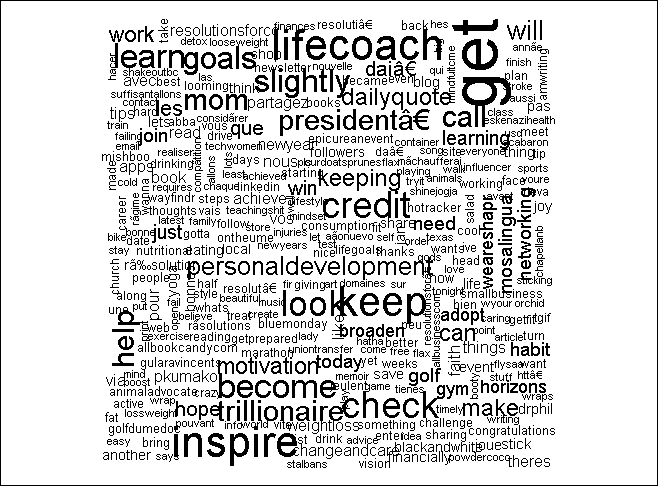

一个词云，描述了推特子集中的常用词

### 树形图

为了表示高维度的数据，通常不可能同时可视化所有维度。树形图就是这样一种可视化类型，它将所有维度划分为子集，并以分层的方式呈现它们。具体来说，treemaps 将维度划分为一组嵌套的矩形。一个被广泛引用的树形图的例子是 newsmap，它将谷歌新闻聚合的新闻可视化，并用不同的颜色显示在不同的类别中；颜色梯度表示文章的外观(在时间尺度上)，而矩形的大小表示新闻项目的受欢迎程度。

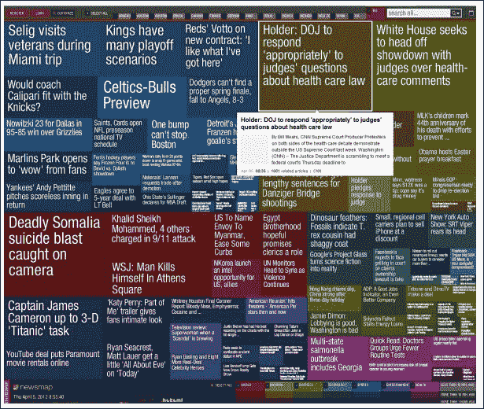

显示由谷歌新闻聚合的新闻的树形图

图片来源:[http://newsmap.jp/](http://newsmap.jp/)

### 面向像素的地图

可视化不仅使结果更容易理解，而且非常实用。大多数时候，分析过程的结果是多维的。在二维屏幕/纸上用图形表示这些数据是一个挑战。这就是面向像素的可视化的用武之地。对于一个 *n 维*数据集，面向像素的可视化将每个 *n 维*数据点映射到 *n* 不同子窗口中的单个像素。因此，每个数据点被分割成 n 个 T21 窗口，每个维度一个。这些帮助我们在单个可视化中映射大量数据。面向像素的可视化如下所示:

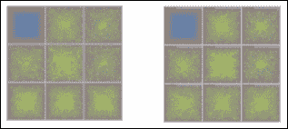

面向像素的地图示例

图片来源:[http://bib.dbvis.de/uploadedFiles/163.pdf](http://bib.dbvis.de/uploadedFiles/163.pdf)

### 其他可视化效果

除了已经提到的可视化之外，还有许多其他有趣的可视化，它们对于不同的用例非常有用。例如，箱线图等可视化工具对于理解数据分布和异常值检测非常有用。类似地，还有一些可视化工具，如 Chernoff 面、散点图、网络图等等，它们都有自己的优点和使用案例。

请注意，可视化本身就是一个研究领域，这一部分只是试图触及冰山一角。我们敦促读者浏览本章*参考文献*部分分享的书籍/在线内容，以了解更多相关信息。

<title>Getting started with Twitter APIs</title> 

# 【Twitter APIs 入门

Twitter 对于 tweeple(使用 Twitter 发微博的人)和数据科学家来说都是一种享受。API 和文档都得到了很好的更新，并且易于使用。让我们从 API 开始吧。

## 概述

Twitter 拥有所有社交网络中最简单最强大的 API。Twitter 本身和数据科学家已经使用这些 API 来了解 Twitter 世界的动态。Twitter APIs 使用四种不同的对象，即:

*   推文:推文是定义 Twitter 本身的核心实体。正如上一节所讨论的，一条推文包含的信息(元数据)远不止是推文的内容/消息。
*   **用户**:任何可以发微博、关注或执行任何 Twitter 行为的人或事物都是用户。Twitter 在用户定义上是独一无二的，用户不一定是人类。就是这样一个非人类的受欢迎的 Twitter 账号，拥有超过 200 万粉丝！
*   **实体**:这些是从 tweet 对象本身提取的结构化信息。这些信息可能包括 URL、标签、用户提及等等。这些对象可以在不解析 tweet 文本的情况下实现更快的处理。
*   **地点**:一条推文也可能附带位置。这些信息可能用于各种目的，例如显示您附近的*趋势话题*或有针对性的营销。

Twitter APIs 中的上述对象已经在 https://dev.twitter.com/网站上详细解释过了。我们敦促读者通读它，以便更好地理解对象和 API。

Twitter 拥有所有主流编程语言/平台的库。我们将利用 Twitter，也就是 TwitteR 的 r 库。

### 提示

**Twitter 最佳实践**

Twitter 在其开发者网站[https://dev.twitter.com/](https://dev.twitter.com/)上有一套*最佳实践*和一系列明确规定的该做和不该做的事情，该网站讨论了安全/认证、隐私等等。由于 Twitter 以高可用性支持庞大的客户群，它还跟踪其 API 的使用情况，以保持系统健康。他们的 API 被查询的次数有一个规定的速率限制。请浏览最佳实践并成为一名`#gooddeveloper`！

## 注册应用程序

既然我们已经有了足够的关于 Twitter 和它的 API 对象的背景知识，让我们开始动手吧。开始使用 API 的第一步是通知 Twitter 你的应用程序。Twitter 使用标准的**开放认证** ( **OAuth** )协议来授权第三方应用。OAuth 使用应用程序的消费者密钥、消费者秘密、访问令牌和访问令牌秘密来允许它使用 API 和所连接服务的数据。

以下快速步骤将为我们的游戏做好准备:

1.  去 https://apps.twitter.com/的 Twitter 应用管理控制台用你的证书登录，如果你没有的话，创建一个账户。
2.  点击**创建新应用**，填写应用名称、网站等详细信息。出于我们的目的，我们将把我们的应用程序命名为`TwitterAnalysis_rmre`。对于回调 URL，使用`http://127.0.0.1:1410`来指向您的本地系统。您也可以选择任何其他端口号。
3.  点击**创建您的 Twitter 应用程序**以完成该过程。你的应用管理控制台看起来会像下面的截图: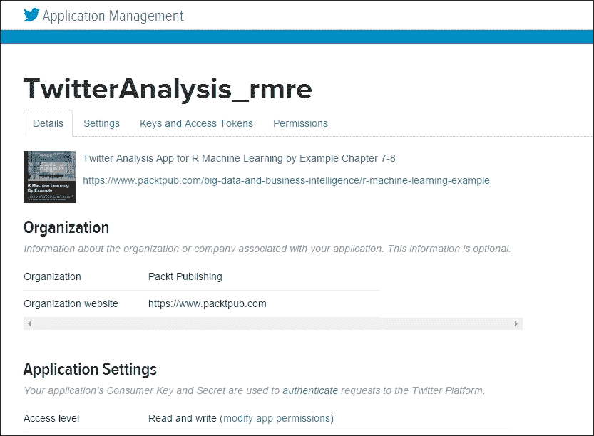

    Twitter 应用页面

恭喜您，您的应用程序已创建并注册到 Twitter。但是在我们使用它之前，还有一个环节。我们需要创建访问令牌，为此我们执行以下步骤。

1.  转到 Twitter 应用程序详细信息页面上的链接**密钥和访问令牌**。
2.  向下滚动并点击**创建我的访问令牌**为您的个人资料生成一个访问令牌。
3.  完成上述步骤后，**密钥和访问令牌**页面如下图所示: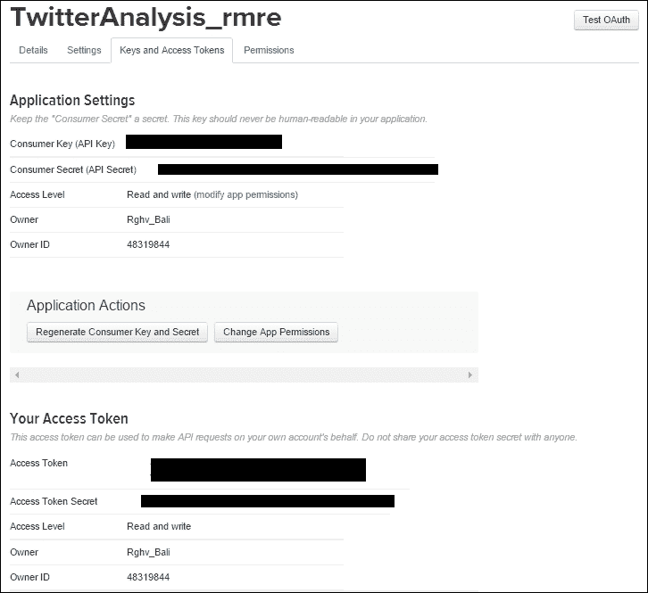

    应用密钥和访问令牌

我们将在这一章以及下一章中使用相同的应用程序。记下消费者密钥、消费者秘密、访问令牌和访问秘密；我们将需要这些在我们的应用程序中。

### 注意

为 OAuth 生成的密钥和秘密是敏感的信息。它们使你的应用程序能够访问 Twitter 的数据。请像保管密码一样保管好它们(甚至更安全)。`#SafetyFirst`。

## 连接/认证

现在我们已经在 Twitter 端准备好了一切，让我们也在 R 端设置一些东西。在我们开始处理来自 Twitter 的数据之前，第一步是通过我们刚刚使用 r 创建的应用程序连接和验证我们自己。

我们将利用杰夫·金特里的 R 的 TwitteR 库。这个库或客户端允许我们通过 r 使用 Twitter 的 web APIs。我们将使用方法`setup_twitter_oauth()`使用我们应用程序的凭证(密钥和访问令牌)连接到 Twitter。请将以下代码中的`XXXX`替换为您在上一步中生成的访问密钥/令牌:

```

> # load library

> library(twitteR)

> # set credentials

> consumerSecret = "XXXXXXXXXXXXX"

> consumerKey = "XXXXXXXXXXXXXXXXXXXXXXXXXx"

```

在执行前面的代码片段时，它会提示您是否使用本地文件来缓存凭证。现在，我们将对它说`No`:


这将打开您的浏览器，并要求您使用您的 Twitter 凭据登录并授权此应用程序，如以下屏幕截图所示:

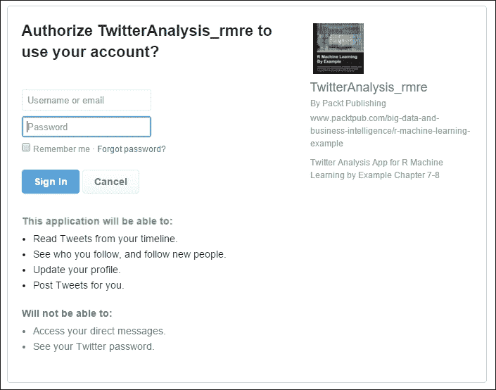

授权应用程序获取数据

一旦授权，浏览器将被重定向到我们在 Twitter 上创建应用程序时提到的回调 URL。您也可以为用户使用信息更丰富的 URL。

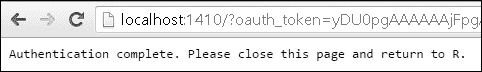

恭喜你，你现在已经连接到推文的海洋了。

## 提取样本推文

现在我们已经使用 R 连接到 Twitter，是时候提取一些最新的 tweets 并分析我们得到的信息了。为了提取推文，我们将使用 Twitter 的帐户 001 (Twitter 的创始人和第一个用户)，杰克·多西，`@jack`的句柄。以下代码片段摘录了他最近的 300 条推文:

```

> twitterUser <- getUser("jack")

> # extract jack's tweets

> tweets <- userTimeline(twitterUser, n = 300)

> tweets

```

由于 Twitter 的内容丰富的数据，输出包含文本以及不可打印的字符和 URL。我们稍后将查看一条推文的元数据，但在此之前，提取的信息如下所示:

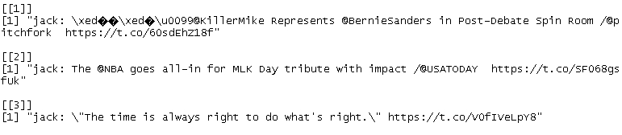

样本推文

要查看可用于分析和操作每条 tweet 的属性和函数，请使用如下的`getClass`方法:

```

> # get tweet attributes

> tweets[[1]]$getClass()

>

> # get retweets count

> tweets[[1]]$retweetCount

>

> # get favourite count

> tweets[[1]]$favoriteCount

```

将生成以下输出:

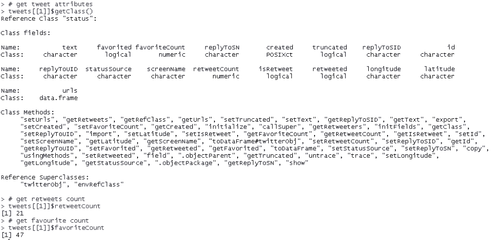<title>Twitter data mining</title> 

# 推特数据挖掘

既然我们已经测试了我们的工具、库和与 Twitter APIs 的连接，是时候开始寻找 Twitter 土地上隐藏的宝藏了。让我们戴上数据矿工帽，开始挖掘吧！

在这一部分，我们将处理从搜索关键词(或 Twitter 词汇表中的标签)和用户时间表中收集的 Twitter 数据。利用这些数据，我们将在使用 TwitteR 和其他 R 包的不同功能和实用程序时发现一些有趣的见解。

### 注意

请注意，我们的过程将隐含地遵循数据挖掘概述的步骤。本着简洁的精神，我们可能会冒昧地不明确提到每一个步骤。我们在挖掘一些*镀金*的真知灼见；请放心，没有遗漏任何内容！

每一年，我们都怀着新的热情去完成伟大的壮举，并改进我们的缺点。我们大多数人都以新年决心的形式对自己做出承诺。让我们一起来探索 tweeple 在 2016 年都在做些什么吧！

### 注意

**注意** : Twitter 数据变化非常快，您的结果/图表可能与本章描述的有所不同。

我们将使用同一个应用程序及其凭证来连接并接入 Twitter 获取数据。以下代码的工作方式与我们在上一节中提取的样本 tweets 完全相同:

```

library(twitteR)

library(ggplot2)

library(stringr)

library(tm)

library(wordcloud)

consumerSecret = "XXXXXXXXX"

consumerKey = "XXXXXXXXXXXXXXXXXXXXXXXXXXXXXX"

setup_twitter_oauth(consumer_key = consumerKey,consumer_secret = consumerSecret)

```

除了连接 Twitter，我们还加载了所需的包，如`ggplot`、`stringr`、`tm`和`wordcloud`。随着我们的继续，我们将看到这些包在哪里以及如何有用。

一旦连接到我们的数据源，我们就可以开始收集所需的数据。由于我们计划了解 tweeple 和他们的新年决心，我们将为标签`#ResolutionsFor2016`提取数据。我们也可以使用任何标签，比如`#NewYearResolutions`、`#2016Resolutions`，或者标签的组合来获取相关的推文。下面这段代码不仅提取 tweet，还将 tweet/status 对象的列表转换成 R 数据帧。我们还将每条推文转换成 UTF 8，以处理不同语言的文本。

### 注意

惊人的事实:Twitter 有 48 种不同的语言版本，而且还在增加！

```

# trending tweets

trendingTweets = searchTwitter("#ResolutionsFor2016",n=1000)

trendingTweets.df = twListToDF(trendingTweets)

trendingTweets.df$text <- sapply(trendingTweets.df$text,function(x) iconv(x,to='UTF-8'))

```

正如我们在上一节中看到的，一条 tweet 包含的信息远不止文本。各种属性之一是状态源。状态源表示发出推文的设备。可能是手机，平板，等等。在应用主要转换和清理 tweet 对象之前，我们应用一个快速转换将状态源转换为有意义的形式:

```

trendingTweets.df$tweetSource = sapply(trendingTweets.df$statusSource,function(sourceSystem) enodeSource(sourceSystem))

```

前面的代码将`statusSource`从值`<a href=\"http://twitter.com/download/android\" rel=\"nofollow\">Twitter for Android</a>`转换为简单的 Android，并将其赋给一个名为`tweetSource`的新属性。

一旦我们有了数据，数据挖掘过程的下一步就是清理数据。我们使用文本挖掘包`tm`来执行转换和清理。特别是`Corpus`函数帮助我们将 tweet/status 对象作为文档集合进行处理。然后，我们使用同一个包中的`tm_map`实用程序来应用/映射转换，例如将所有文本转换为小写，删除标点符号、数字和停用词。停用字词是最常用字词的列表，如 a、an、the 等，在分析文本时可以安全地将其删除，而不会失去意义。

```

# transformations

tweetCorpus <- Corpus(VectorSource(trendingTweets.df$text))

tweetCorpus <- tm_map(tweetCorpus, tolower)

tweetCorpus <- tm_map(tweetCorpus, removePunctuation)

tweetCorpus <- tm_map(tweetCorpus, removeNumbers)

# remove URLs

removeURL <- function(x) gsub("http[[:alnum:]]*", "", x)

tweetCorpus <- tm_map(tweetCorpus, removeURL) 

# remove stop words

twtrStopWords <- c(stopwords("english"),'resolution','resolutions','resolutionsfor','resolutionsfor2016','2016','new','year','years','newyearresolution')

tweetCorpus <- tm_map(tweetCorpus, removeWords, twtrStopWords)

tweetCorpus <- tm_map(tweetCorpus, PlainTextDocument)

```

在我们继续下一步分析隐藏模式/见解的数据之前，最后的转换是一个术语-文档矩阵。顾名思义，术语-文档矩阵是一种矩阵表示，其中术语作为行，而列由文档表示。该矩阵中的每个条目代表一个术语在给定文档中出现的次数。更正式地说，术语-文档矩阵是描述术语在文档集合中的频率的矩阵表示。这种表示在自然语言处理应用程序中非常有用。它是一种优化的数据结构，支持快速搜索、主题建模等等。可以使用下面的简单例子来解释数据结构，其中我们有两个文本文档， **TD1** 和 **TD2** :

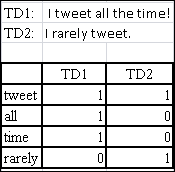

样本术语-文档矩阵

tm 包为我们提供了另一个简单易用的工具，叫做 term-document matrix ( `TermDocumentMatrix`也是可用的)，我们用它将`Corpus`对象转换成所需的形式:

```

# Term Document Matrix

> twtrTermDocMatrix <- TermDocumentMatrix(tweetCorpus, control = list(minWordLength = 1))

```

## 常用词和联想

这样准备的术语-文档矩阵以行的形式包含了来自每条 tweet(发布清理和转换)的单词，而列代表 tweet 本身。

作为快速检查，让我们看看哪些单词在我们的数据集中使用得最频繁。将阈值设置为`30`次或更多次。我们使用 apply 实用程序迭代术语文档矩阵中的每个术语，并对其出现次数求和。该函数帮助我们筛选出出现 30 次或更多次的术语。

```

# Terms occuring in more than 30 times

> which(apply(twtrTermDocMatrix,1,sum)>=30)

```

结果将如下面的截图所示:

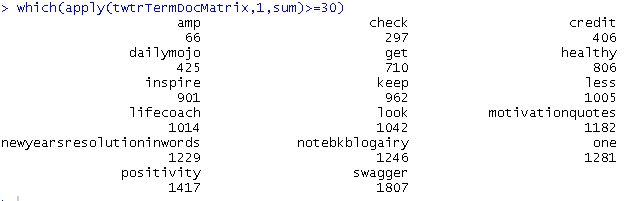

在推文中出现 30 次或更多的术语

如前面的屏幕截图所示，单词列表中出现了 30 个或更多的单词，如健康、激励和积极。谈到年度目标，我们都有很多共同点，不是吗？

前面的操作是一个快速检查，看看我们是否真的有 tweets 来帮助我们发现一些关于新年决心的有趣事情。现在让我们采取一种正式的方法，并确定我们的数据集中的常用术语。我们还将尝试以一种有创意且易于理解的方式展示信息。为了获得数据集中最常见的术语，我们再次使用了来自`tm`包的函数`findFreqTerms`。这个函数为我们提供了快速破解的抽象，比如我们之前使用的那个。`findFreqTerms`还让我们为术语频率设置最小和最大阈值。对于我们的情况，我们将只提及下限并查看结果:

```

# print the frequent terms from termdocmatrix

> (frequentTerms<-findFreqTerms(twtrTermDocMatrix,lowfreq = 10))

```

结果类似于下面的截图:

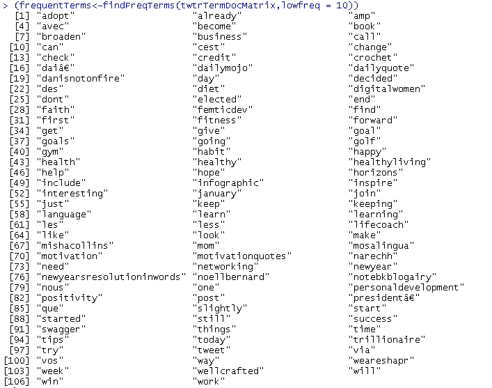

我们得到大约 107 个词，最少出现 10 个。如果你仔细观察，我们看到的出现频率至少为 30 的术语也出现在这个列表中，这是理所当然的。

既然我们已经确定有出现次数超过 10 次的术语/单词，那么让我们创建一个数据框，并按照我们之前的决定绘制术语与其频率的关系图。我们使用`rowSums`函数来计算每个术语/单词的总出现次数。然后我们选择出现次数超过 10 次的术语子集，并使用`ggplot`绘制它们:

```

# calculate frequency of each term

term.freq <- rowSums(as.matrix(twtrTermDocMatrix))

# picking only a subset

subsetterm.freq <- subset(term.freq, term.freq >= 10)

# create data frame from subset of terms

frequentTermsSubsetDF <- data.frame(term = names(subsetterm.freq), freq = subsetterm.freq)

# create data frame with all terms

frequentTermsDF <- data.frame(term = names(term.freq), freq = term.freq)

# sort by subset DataFrame frequency

frequentTermsSubsetDF <- frequentTermsSubsetDF[with(frequentTermsSubsetDF, order(-frequentTermsSubsetDF$freq)), ]

# sort by complete DataFrame frequency

frequentTermsDF <- frequentTermsDF[with(frequentTermsDF, order(-frequentTermsDF$freq)), ]

# words by frequency from subset data frame

ggplot(frequentTermsSubsetDF, aes(x = reorder(term,freq), y = freq)) + geom_bar(stat = "identity") +xlab("Terms") + ylab("Frequency") + coord_flip()

```

前面的代码生成了下面的频率图:

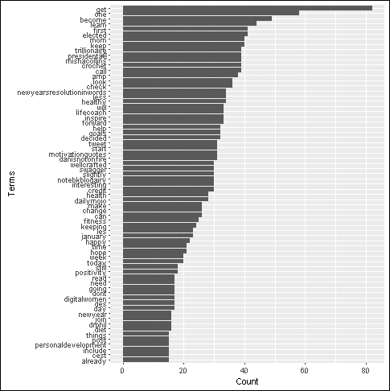

通过分析上图，我们可以很快发现一些有趣的地方:

*   **妈妈**、**当选**、**总统**、**万亿美元**这几个词出现在前 10 名中。奇怪的场景，但很有趣。稍后会有更多的介绍。
*   健康在列表中排名很高，但没有进入前 10 名。所以，看起来健康是有可能的，但不是很高。这同样适用于**健身**和**饮食**。
*   这个列表中的大多数单词本质上都是积极的。像**快乐**、**希望**、**积极**、**改变**等等词汇都指向在做新年决定时的乐观情绪！

尽管前面的图表在一个漂亮的布局中给了我们相当多的关于单词及其频率的信息，但它仍然没有向我们展示全貌。还记得在生成此图之前，我们从数据集中精心制作了一个项目子集吗？我们是故意这样做的，否则图表会变得太长，出现频率较低的单词会使整个事情变得混乱。这张图漏掉的另一点是频率的相对差异。

如果我们的目标是看到频率之间的相对差异，我们需要一个完全不同的可视化。word cloud 来拯救我们了。使用`wordcloud`库，我们可以很容易地使用一行代码从数据帧生成单词云:

```

# wordcloud

> wordcloud(words=frequentTermsDF$term, freq=frequentTermsDF$freq,random.order=FALSE)

```

使用完整数据框架的单词云看起来像这样:


前面的单词云以频率递减的顺序呈现单词。每个单词的大小强调了它的频率。您可以使用`wordcloud`函数来生成一些有趣的可视化效果，甚至是艺术！

在前面的图表中出现了很多单词，但是看到单词万亿出现在前 10 名中不是很有趣吗？原因可能是什么？是一个机器人发的垃圾邮件，还是某个名人的推文迅速传播，还是完全不同的东西？让我们来看看这个列表中最热门的推文，看看它是否包含单词万亿美元:

```

# top retweets

> head(subset(trendingTweets.df$text, grepl("trillionaire",trendingTweets.df$text) ),n=1)

```

下面的截图是你得到的:

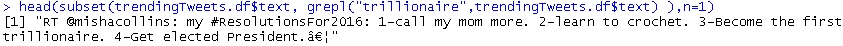

事实证明，我们的预感是正确的。这是一个名人的新年决心推特，在网上疯传。在 Twitter 上快速搜索会发现这条推文:

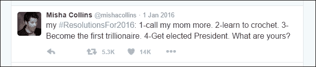

图片来源:【https://twitter.com/mishacollins?lang=en 

进一步搜索发现米沙·克林斯是电视剧《超自然》中的著名演员。我们还可以看到上面的决议被转发了惊人的 5k 次！有趣的是，点赞数为 14k，超过了转发数。我们能推断出 tweeple 更喜欢喜欢/心而不是转发吗？还可以看出，像妈妈、学习、万亿美元、当选和总统这样的词毫无疑问都是出现频率最高的词。我们还可以间接推断出《超自然》在 Twitter 上拥有大量粉丝，卡西迪奥(米莎在电视剧中的角色)是该剧的热门角色。有点令人惊讶的是他决心学习钩针编织，不是吗？

离开超自然的东西，让我们回到健康的辩论。健康对我们大多数人来说都很重要。在一年的最初几个月/几周，锻炼或去健身房等活动会激增。让我们看看推特上的朋友们有多注重健康吧！

既然很多词如健康、饮食、健身、健身房等等都指向健康的生活方式，那么让我们试着找到与单词健身相关的词。`findAssocs`是一个方便的功能，它可以帮助我们从一个术语文档矩阵中找到与给定单词至少有特定相关性的单词。我们将使用这个函数的输出来准备一个使用`ggplot`的术语关联(相关性)图。该过程类似于我们如何准备前面的频率图:

```

# Associatons

(fitness.associations <- findAssocs(twtrTermDocMatrix,"fitness",0.25))

fitnessTerm.freq <- rowSums(as.matrix(fitness.associations$fitness))

fitnessDF <- data.frame(term=names(fitnessTerm.freq),freq=fitnessTerm.freq)

fitnessDF <- fitnessDF[with(fitnessDF, order(-fitnessDF$freq)), ]

ggplot(fitnessDF,aes(x=reorder(term,freq),y=freq))

+geom_bar(stat = "identity") +xlab("Terms")

+ ylab("Associations")

+ coord_flip()

```

与单词 fitness 密切相关的单词 most 如下:

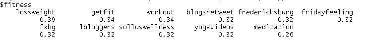

同样的数据以图形的形式更具可读性，如下所示:

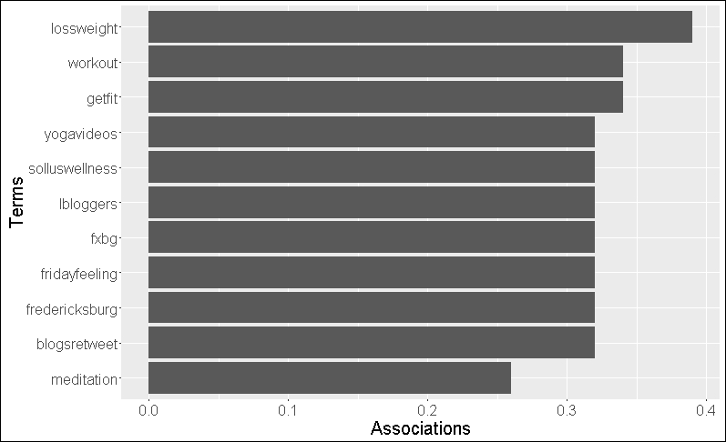

从上图可以明显看出，诸如**减肥**、**健身**、**健身**等术语。证明我们的观点，十二个人和我们一样关心健康。有趣的是，在这个列表中出现了术语 *yogavideos* 。2016 年，瑜伽似乎正在赶上其他保持健康的技巧。名单上还有冥想。

## 流行设备

到目前为止，我们已经用处理了一条 tweet 的可见组件，比如文本、retweet 计数等等，我们能够提取许多有趣的见解。让我们拿出我们的精密工具，更深入地挖掘我们的数据。

正如上面几节中多次提到的，一条推文包含的信息远比看上去的要多。一条这样的信息是关于推文的来源。Twitter 诞生于短信时代，它的许多特征，比如 140 个字符的字数限制，都让人想起那个时代。看看 tweeple 是如何使用 Twitter 的会很有趣，也就是经常用什么设备访问和在 Twitter 上发帖。尽管这个世界已经从短信时代走了很长一段路，但手机无处不在。为了获得这个信息，我们将利用数据帧`trendingTweets.df`中的属性`tweetSource`。我们从已经存在于`tweet`对象中的`statusSource`属性中创建了这个附加属性(参见本节开头的快速回顾)。

为了清楚起见，我们将使用基于转发计数的数据帧`trendingTweets.df`的子集。我们将再次使用`ggplot`来可视化我们的结果。

```

# Source by retweet count

trendingTweetsSubset.df <- subset(trendingTweets.df, trendingTweets.df$retweetCount >= 5000 )

ggplot(trendingTweetsSubset.df, aes(x =tweetSource, y =retweetCount/100)) + geom_bar(stat = "identity") +xlab("Source") + ylab("Retweet Count")

```

以下情节是你的结果:

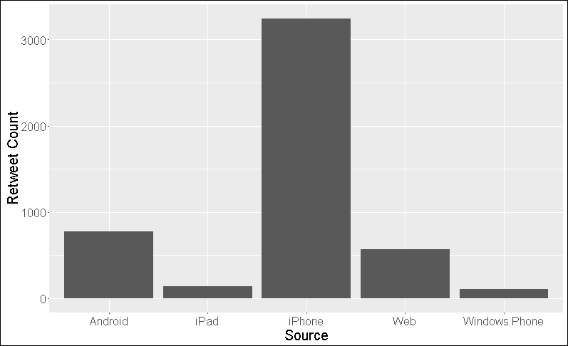

毫无疑问，iPhone 是最受欢迎的设备，其次是 Android 和网络。有趣的是，人们使用网络/网站转发的次数超过了 iPad！Windows Phone 显然有一些严重的问题需要解决。我们还能推断出 iPhone 是十二人中的首选设备吗？还是说 iPhone 为 Twitter 提供了比其他设备更好的体验？或者我们甚至可以更深入地说，iPhone 上的 Twitter 有一个比任何其他设备都更容易访问的“转发”按钮。诸如此类的推论需要更多的挖掘，但所有这些都有很多知识/潜力，可以被管理层、UX 团队等用来改善和改变周围的事情。

## 层次聚类

我们已经在之前的章节中看到了聚类和分类(参见[第二章](ch02.html "Chapter 2. Let's Help Machines Learn")、*让我们帮助机器学习*)，并揭示了一些关于手头数据的有趣事实。对于我们当前的用例，即使我们的推文都与 2016 年的决议相关，我们也永远无法确定 tweeple 做出的决议的类型。这使得它成为分层集群的一个非常合适的用例。与 k-means 或其他需要在计算前预设聚类数的聚类算法不同，层次聚类算法独立工作。

在将层次聚类应用于我们的数据之前，让我们借此机会了解一下层次聚类。与任何其他聚类算法一样，层次聚类帮助我们将相似的项目分组在一起。该算法的确切细节通常可以解释如下:

*   **Initialize** :这是第一步，每个元素都被分配到自己的集群中。对于包含 *n* 个元素的数据集，该算法创建 *n* 个不同的聚类，每个聚类中有一个元素。在这一步确定距离/相似性度量。
*   **合并**:在这个步骤中，根据所选择的距离/相似性度量，最接近的一对聚类被识别并合并成单个聚类。这一步产生的聚类比目前的总聚类少一个。
*   **计算** / **重新计算**:我们计算/重新计算在合并步骤中形成的新聚类和现有聚类之间的距离/相似度。

重复**合并**和**计算**步骤，直到我们剩下包含所有 *n* 项的单个集群。顾名思义，这种算法生成一个层次结构，叶子表示单个元素，当我们走向树根时，根据相似性/距离组合成簇。输出树通常被称为 **树状图**。

合并步骤是该算法的变体所在。有几种方法可以识别最接近的聚类。从简单的方法(如单链法，该方法将两个聚类中任意两个元素之间的最短距离作为距离度量)到复杂的方法(如 Ward 的方法，该方法使用方差来寻找最紧密的聚类),有多种方法可供使用，具体取决于使用情况。

回到 Twitter 世界，让我们使用层次聚类来看看哪些术语/推文是最接近的。对于我们当前的用例，我们将使用单一方法作为我们的合并标准。您可以尝试不同的算法并观察其差异。

为了执行层次聚类，为了清楚起见，我们首先处理我们的数据集以去除稀疏项。为此，`removeSparseTerms`函数帮助我们删除稀疏度低于指定限制的数据行。然后我们使用`hclust`工具来形成集群。该实用程序的输出可直接绘图。让我们为此编写一些代码:

```

# remove sparse terms

twtrTermDocMatrix2 <- removeSparseTerms(twtrTermDocMatrix, sparse = 0.98)

tweet_matrix <- as.matrix(twtrTermDocMatrix2)

# cluster terms

distMatrix <- dist(scale(tweet_matrix))

fit <- hclust(distMatrix,method="single")

plot(fit)

```

输出的*树状图*非常简单易懂:

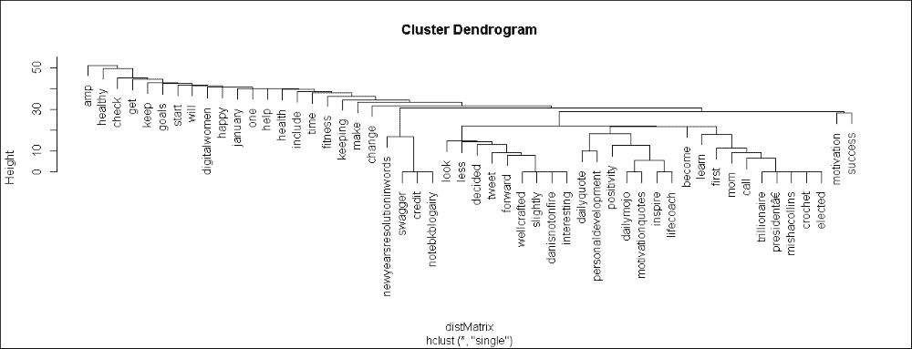

如果您观察右侧的第二个集群，它包含术语**万亿元**、**当选**、**妈妈**、**调用**等等。映射回米莎·柯林斯转发量最高的推文，所有这些术语都在那条推文中提到，我们的算法正确地将它们聚集在一起。很聪明，不是吗？作为一个小练习，观察其他集群，看看这些术语在包含它们的推文中是如何出现的。这里要做的一个重要观察是*树状图*正确地将所有常用术语映射到一个根下，这再次证明了所有这些术语都指向我们 2016 年决议的中心主题！

## 主题建模

到目前为止，我们的分析是关于来自世界各地用户的与新年决心相关的推文。我们分析了与我们选择的主题相关的推文。忽略垃圾邮件和其他嘈杂的推文，我们的数据或多或少符合一个主题。这个主题本身由一组词(比如健康、万亿美元、健康、饮食、妈妈等等)组成，这些词概括地描述了不同的解决方案。为了扩大我们的分析范围和发现更多的见解，让我们来谈谈主题建模的概念。

主题建模是在代表语料库要点的未标记文本语料库中发现模式的过程。一个主题本身可以被描述为一组出现在一起的单词来描述一个大的文本。

另一个定义是在一次主题建模会议上发布的:

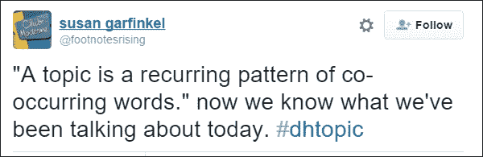

图片来源:[https://Twitter . com/footnotes rising/status/264823621799780353](https://twitter.com/footnotesrising/status/264823621799780353)

主题建模的目的是自动识别语料库的潜在主题，从而在需要基于主题但缺乏已知关键字(与我们当前使用的搜索引擎完全相反)的信息检索的应用中有用。例如，通过使用主题*国家一和国家二*之间的关系，而不是搜索一个关键字，然后跟随一个又一个链接，从报纸的档案中了解两个国家之间的关系，这难道不令人惊讶吗？请注意，通过以下链接来发现信息也同样有效，但仍有许多不足之处。

进行主题建模的方式之一是通过**潜在狄利克雷分配**(**LDA**)；它是最强大和最广泛使用的模型之一。

LDA 是由 David M Blie 在 2003 年的论文*概率主题模型简介*中提出的。正如他的论文所言，LDA 可以被定义为一种生成模型，它允许未被观察到的群体解释观察集，从而解释为什么数据的某些部分是相似的。LDA 的工作基于文档展示多个主题的假设。

LDA 是一个概率模型，它的数学相当复杂，超出了本书的范围。以非数学的方式，LDA 可以被解释为一种模型/过程，其帮助识别已经导致文档集合的生成的主题。

### 注意

如需进一步阅读，请参考 Blei 的论文。

[https://www.cs.princeton.edu/~blei/papers/Blei2011.pdf](https://www.cs.princeton.edu/~blei/papers/Blei2011.pdf)

用简单的语言解释一切的博客:

[http://tedunderwood . com/2012/04/07/topic-modeling-made-just-simple-after](http://tedunderwood.com/2012/04/07/topic-modeling-made-just-simple-enough/)

对于我们的目的/用例，我们可以假设 LDA 是一个模型/过程，它帮助我们从未标记文本的语料库中识别潜在的(隐藏的/潜在的)主题。幸运的是，R 以名为`topicmodels`的库的形式抽象了大部分数学细节。

出于主题建模的目的，我们将使用一组新的 tweets。**国际太空** **站** ( **ISS** )有多个 Twitter 句柄，其中一个是`@ISS_Research`，专门迎合来自 ISS 的研究相关推文。让我们通过分析时间线上的推文来探究一下`@ISS_Research`最近在做什么。我们将分析这些推文，以确定国际空间站潜在的研究主题。为此，我们将使用与之前相同的流程来提取推文并执行转换/清理。以下代码片段实现了这一点:

```

# set user handle

atISS <- getUser("ISS_Research")

# extract iss_research tweets

tweets <- userTimeline(atISS, n = 1000)

tweets.df=twListToDF(tweets)

tweets.df$text <- sapply(tweets.df$text,function(x) iconv(x,to='UTF-8'))

#Document Term Matrix

twtrDTM <- DocumentTermMatrix(twtrCorpus, control = list(minWordLength = 1))

```

请注意，前面的代码片段准备了一个*文档-术语矩阵*，不像上次我们准备了一个*术语-文档矩阵*。

一旦我们有了所需格式的推文，来自`topicmodels`包的`LDA`实用程序可以帮助我们发现隐藏的主题/模式。LDA 实用程序需要输入主题的数量以及文档术语矩阵。现在我们将尝试八个主题。下面的代码使用`LDA`为八个主题中的每一个提取六个术语:

```

#topic modeling

# find 8 topics

ldaTopics <- LDA(twtrDTM, k = 8) 

#first 6 terms of every topic

ldaTerms <- terms(ldaTopics, 6) 

# concatenate terms

(ldaTerms <- apply(ldaTerms, MARGIN = 2, paste, collapse = ", "))

```

使用 LDA 生成的主题列表如下:

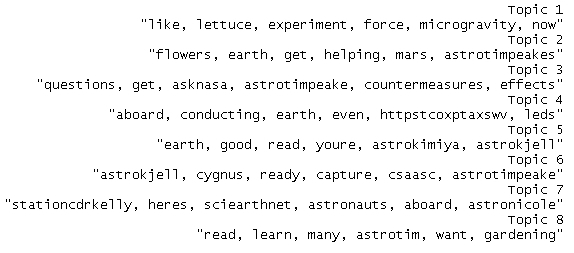

视觉表现会更容易理解。我们可以利用`qplot`在面积图上快速绘制不同时间的主题，如下所示:

```

# first topic identified for every tweet

firstTopic <- topics(ldaTopics, 1)

topics <- data.frame(date=as.Date(tweets.df$created), firstTopic)

qplot(date, ..count.., data=topics, geom="density",fill=ldaTerms[firstTopic], position="stack")+scale_fill_grey()

```

生成的图表如下图所示:

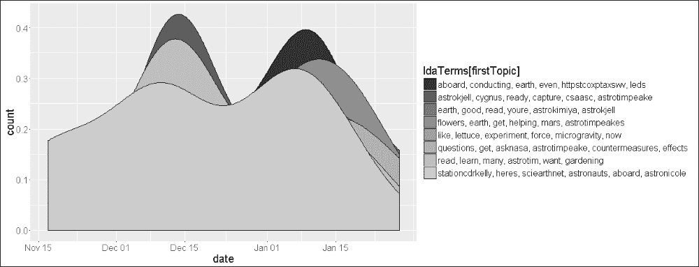

现在让我们分析输出。LDA 生成的每个主题的术语列表似乎让我们很好地了解了 ISS 正在进行的工作/研究。诸如火星、微重力、花、天鹅座等术语告诉我们研究的主要领域，或者至少是国际空间站上的科学家/宇航员正在谈论的主题。stationcdrkelly 和 astrotimpeake 等术语看起来更像 Twitter 的句柄。

### 注

一个快速的练习是使用当前的`@ISS_Research`时间线数据并挖掘句柄，例如`stationcdrkelly`，以发现更多信息。谁知道呢，这可能会是一个很好的宇航员名单！

`qplot`输出将时间维度添加到我们的普通主题列表中。跨时间维度分析主题有助于我们理解何时讨论了某个特定的研究主题，或何时宣布了令人惊讶的事情。列表中的主题二，或者图形图例中从顶部数第四个主题包括单词 flower。由于科学家们最近成功地在太空中开放了一些橙色的花朵，上面的图表帮助我们了解到这条消息是在 1 月 15 日^(左右)在 Twitter 上首次爆出的。在 Twitter/新闻网站上快速浏览一下，证实了这条消息是在 2016 年 1 月 18 日^(通过 tweet 爆料的……够接近了！)

### 提示

**彩色面积图**

试着从`qplot`中去掉选项`scale_fill_grey()`，得到一些比普通灰度更容易阅读的漂亮图表。

因此，最终我们了解了使用 LDA 对来自国际空间站的数据进行主题建模，并发现了科学家和宇航员在外太空正在做的惊人的事情。

<title>Challenges with social network data mining</title> 

# 社交网络数据挖掘的挑战

在我们结束第章之前，让我们看看社交网络对数据挖掘过程提出的不同挑战。以下几点提出了一些论点、问题和挑战:

*   毫无疑问，社交网络产生的数据在各个方面都属于大数据。它拥有压倒任何系统的所有容量、速度和多样性。然而，有趣的是，如此庞大的数据源面临的挑战是足够细粒度数据的可用性。如果我们放大我们的数据集，并尝试在每个用户的基础上使用数据，我们会发现没有足够的数据来完成一些最常见的任务，如提出建议！
*   Twitter 等社交网络每秒处理数百万用户创建和共享的大量数据。为了让他们的系统一直保持运行，他们对可以使用他们的 API 挖掘的数据量进行了限制(尽管安全性也是这些限制背后的一个主要原因)。这些限制使数据科学工作陷入困境，因为很难获得足够的数据样本来正确/完整地代表总体。样本不足可能导致不正确的模式或完全错过模式。
*   结果的预处理和评估也是社交网络分析的一个挑战。在对数据进行预处理时，我们去除了噪声内容。随着数据以各种形状和大小出现，确定有噪声的内容比简单地删除停用词更具挑战性。对结果的评估是另一个挑战，因为在大多数情况下没有地面实况，并且由于这里和其他地方提出的限制，很难有把握地确定结果的有效性。

上面提出的论点/挑战要求数据科学家设计出创新和创造性的方法，这使得他们的工作有趣且回报丰厚。

<title>References</title> 

# 参考文献

一些关于可视化的知名书籍如下:

*   [http://www . Amazon . in/Information-Dashboard-Design-At-Glance/DP/1938377001](http://www.amazon.in/Information-Dashboard-Design-At-Glance/dp/1938377001)
*   [http://www . Amazon . com/Visual-Display-Quantitative-Information/DP/096139210 x](http://www.amazon.com/Visual-Display-Quantitative-Information/dp/096139210X)
*   [http://www . Amazon . com/Information-Visualization-Second-Interactive-Technologies/DP/1558608192](http://www.amazon.com/Information-Visualization-Second-Interactive-Technologies/dp/1558608192)

一些著名的博客如下:

*   **画面** **具体**:[http://www.jewelloree.com/](http://www.jewelloree.com/)
*   [http://flowingdata.com/](http://flowingdata.com/)
*   [http://www.informationisbeautiful.net/](http://www.informationisbeautiful.net/)
*   [http://infosthetics.com/](http://infosthetics.com/)
*   [http://www.visualisingdata.com/](http://www.visualisingdata.com/)
*   [https://eagereyes.org/](https://eagereyes.org/)
*   [http://thedailyviz.com/](http://thedailyviz.com/)
*   **D3**:https://d3js.org/

<title>Summary</title> 

# 总结

社会网络分析是数据科学领域的热门话题之一。正如我们在本章中所看到的，这些平台不仅为我们提供了联系的方式，也为我们提供了在全球范围内研究人类动态的独特机会。通过这一章，我们学到了一些有趣的技巧。我们从理解社交网络环境中的数据挖掘开始，接着是可视化的重要性。我们专注于 Twitter，理解不同的对象和 API 来操纵它们。我们使用来自 R 的各种包，比如`TwitteR`和`TM`，来连接、收集和操作数据，以便进行分析。我们使用 Twitter 上的数据来了解整个过程中的频率。最后，我们介绍了社交网络词汇和联想、tweeple 使用的流行设备、层次聚类以及话题建模带来的一些挑战。我们使用`ggplot2`和`wordcloud`将我们的结果可视化到一般的数据挖掘过程中。在结束这一章的时候，我们确信现在你可以欣赏这些平台背后惊人的动态和 R 分析这一切的能力。我们还没有结束`@Twitter`，抓紧你的`#sentiments`！