# 五、批发数据的客户细分

在当今竞争激烈的世界中，一个组织的成功很大程度上取决于它对客户行为的理解程度。单独了解每个客户以更好地使组织努力适应个人需求是一项非常昂贵的任务。基于组织的规模，这项任务也可能非常具有挑战性。作为一种替代方案，组织依赖于一种叫做**细分**的东西，它试图根据确定的相似性将客户分类。客户细分的这一关键方面允许组织将其努力扩展到各种客户子集的个体需求(如果不是迎合个体需求)，从而获得更大的利益。

在本章中，我们将了解客户细分的概念和重要性。然后我们将深入学习各种**机器学习** ( **ML** )方法，根据客户特征识别客户子群。我们将使用批发数据集实现几个项目，以理解用于分割的 ML 技术。在下一节中，我们将从学习客户细分的基础和对 ML 技术实现细分的需求开始。随着我们的进展，我们将涉及以下主题:

*   了解客户细分
*   了解批发客户数据集和细分问题
*   使用 DIANA 识别批发客户数据中的客户群
*   使用 AGNES 识别批发客户数据中的客户群


# 了解客户细分

基本上，客户细分或市场细分是将给定市场中广泛的潜在客户划分为特定的客户子群，其中每个子群包含具有某些相似性的客户。下图描述了客户细分的正式定义，其中客户被分为三组:


描述客户细分定义的图示

客户细分需要组织收集有关客户的数据，并对其进行分析，以确定可用于确定子群的模式。客户的细分可以通过与客户相关的多个数据点来实现。以下是一些数据点:

*   **人口统计**:该数据点包括种族、民族、年龄、性别、宗教、教育水平、收入、人生阶段、婚姻状况、职业
*   心理特征:这个数据点包括生活方式、价值观、社会经济地位、个性
*   **行为**:这个数据点包括产品使用、忠诚度、认知度、场合、知识、喜好和购买模式

世界上有数十亿人，有效利用客户细分将帮助组织缩小范围，只接触对其业务有意义的人，最终推动转化和收入。以下是一些组织试图通过识别客户群来实现的具体目标:

*   确定销售团队可以追求的更高比例的机会
*   识别对产品有较高兴趣的客户群，并根据高兴趣客户的需求定制产品
*   针对特定的客户群开发非常有针对性的营销信息，以提高客户对产品的兴趣
*   为不同的细分市场选择最佳的沟通渠道，可能是电子邮件、社交媒体、广播或其他方式，具体取决于细分市场
*   专注于最赚钱的客户
*   追加销售和交叉销售其他产品和服务
*   测试定价选项
*   识别新产品或服务机会

当一个组织需要执行细分时，它通常可以寻找共同的特征，如共同的需求、共同的兴趣、相似的生活方式，甚至相似的人口统计特征，并在客户数据中得出细分。不幸的是，创建细分市场并不那么简单。随着大数据的出现，组织现在可以查看数百种客户特征，以便进行细分。对于一个人或组织中的少数人来说，浏览数百种类型的数据，找到它们之间的关系，然后根据每个数据点可能的几个不同值建立细分是不可行的。这就是被称为**聚类**的无监督人工智能的用武之地。

聚类是使用 ML 算法来识别不同类型数据中的关系的机制，从而基于这些关系产生新的分段。简而言之，聚类发现数据点之间的关系，因此可以对它们进行分段。

术语**聚类分析**和**客户细分**密切相关，并被 ML 从业者交替使用。然而，这些术语之间有一个重要的区别。

聚类是一种工具，可以帮助组织根据相似性和统计联系将数据放在一起。聚类非常有助于引导开发合适的客户群。它还提供了潜在目标客户的有用的统计措施。虽然组织的目标是从数据中识别有效的客户群，但简单地对数据应用聚类技术并将数据本身分组可能会也可能不会提供有效的客户群。这实质上意味着从聚类中获得的输出，即**个聚类**，需要进一步分析以深入了解每个聚类的含义，然后确定哪些聚类可以用于下游活动，如商业促销。下面的流程图有助于我们理解聚类在客户细分过程中的作用:

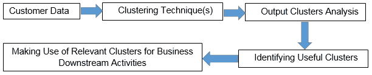

聚类在客户细分中的作用

既然我们已经了解了聚类是执行客户细分的基础，在本章的剩余部分，我们将讨论各种聚类技术，并围绕这些技术实施项目以创建客户细分。对于我们的项目，我们利用批发客户数据集。在深入研究项目之前，让我们了解数据集并执行**探索性数据分析** ( **EDA** )以更好地理解数据。

了解批发客户数据集和细分问题

https://archive.ics.uci.edu/ml/datasets/wholesale+customers[的 UCI 机器学习库提供批发客户数据集。数据集指的是批发分销商的客户。它包括以**货币单位** ( **m.u.** )表示的不同产品类别的年度支出。这些项目的目标是应用聚类技术来识别与某些业务活动相关的细分市场，如开展营销活动。在我们实际使用聚类算法来获得聚类之前，让我们首先读取数据，并使用以下代码块执行一些 EDA 来理解数据:](https://archive.ics.uci.edu/ml/datasets/wholesale+customers)


# Understanding the wholesale customer dataset and the segmentation problem

The UCI Machine Learning Repository offers the wholesale customer dataset at [https://archive.ics.uci.edu/ml/datasets/wholesale+customers](https://archive.ics.uci.edu/ml/datasets/wholesale+customers). The dataset refers to clients of a wholesale distributor. It includes the annual spending in **monetary units** (**m.u.**) on diverse product categories. The goal of these projects is to apply clustering techniques to identify segments that are relevant for certain business activities, such as rolling out a marketing campaign. Before we actually use the clustering algorithms to get clusters, let's first read the data and perform some EDA to understand the data using the following code block:

这将产生以下输出:

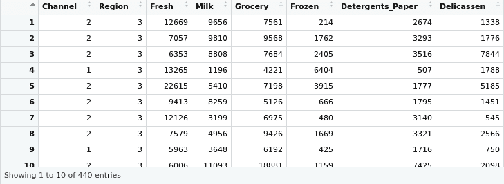

```r
# setting the working directory to a folder where dataset is located
setwd('/home/sunil/Desktop/chapter5/')
# reading the dataset to cust_data dataframe
cust_data = read.csv(file='Wholesale_customers_ data.csv', header = TRUE)
# knowing the dimensions of the dataframe
print(dim(cust_data))
Output : 
440 8
# printing the data structure
print(str(cust_data))
'data.frame': 440 obs. of 8 variables:
 $ Channel : int 2 2 2 1 2 2 2 2 1 2 ...
 $ Region : int 3 3 3 3 3 3 3 3 3 3 ...
 $ Fresh : int 12669 7057 6353 13265 22615 9413 12126 7579...
 $ Milk : int 9656 9810 8808 1196 5410 8259 3199 4956...
 $ Grocery : int 7561 9568 7684 4221 7198 5126 6975 9426...
 $ Frozen : int 214 1762 2405 6404 3915 666 480 1669...
 $ Detergents_Paper: int 2674 3293 3516 507 1777 1795 3140 3321...
 $ Delicassen : int 1338 1776 7844 1788 5185 1451 545 2566...
# Viewing the data to get an intuition of the data 
View(cust_data)
```

现在让我们检查数据集中是否有任何条目缺少字段:

这将产生以下输出:

从 EDA 中，我们看到在这个数据集中有`440`个可用的观察值，并且有八个变量。数据集没有任何缺失值。后六个变量是分销商从批发商处带来的货物，前两个变量是代表购买地点和渠道的因素(分类变量)。在我们的项目中，我们打算根据不同产品的销售额来确定细分市场，因此，数据中的位置和渠道变量不是很有用。让我们使用以下代码将它们从数据集中删除:

```r
# checking if there are any NAs in data
print(apply(cust_data, 2, function (x) sum(is.na(x))))
Output :
Channel Region Fresh Milk 
0 0 0 0 
Grocery Frozen Detergents_Paper Delicassen
```

这为我们提供了以下输出:

我们看到只保留了六列，这表明删除不需要的列是成功的。从 EDA 代码的摘要输出中，我们还可以观察到所有保留列的比例都是相同的，因此我们不必显式地对数据进行规范化。

```r

0 0 0 0 
# printing the summary of the dataset 
print(summary(cust_data))
```

This will give the following output:

```r
Channel Region Fresh Milk 
 Min. :1.000 Min. :1.000 Min. : 3 Min. : 55 
 1st Qu.:1.000 1st Qu.:2.000 1st Qu.: 3128 1st Qu.: 1533 
 Median :1.000 Median :3.000 Median : 8504 Median : 3627 
 Mean :1.323 Mean :2.543 Mean : 12000 Mean : 5796 
 3rd Qu.:2.000 3rd Qu.:3.000 3rd Qu.: 16934 3rd Qu.: 7190 
 Max. :2.000 Max. :3.000 Max. :112151 Max. :73498 
 Grocery Frozen Detergents_Paper Delicassen 
 Min. : 3.0 Min. : 3.0 Min. : 3 Min. : 25.0 
 1st Qu.: 256.8 1st Qu.: 408.2 1st Qu.: 2153 1st Qu.: 742.2
 Median : 816.5 Median : 965.5 Median : 4756 Median : 1526.0
 Mean : 2881.5 Mean : 1524.9 Mean : 7951 Mean : 3071.9
 3rd Qu.: 3922.0 3rd Qu.: 1820.2 3rd Qu.:10656 3rd Qu.: 3554.2
 Max. :40827.0 Max. :47943.0 Max. :92780 Max. :60869.0
```

From the EDA, we see that there are `440` observations available in this dataset and there are eight variables. The dataset does not have any missing values. While the last six variables are goods that were brought by distributors from the wholesaler, the first two variables are factors (categorical variables) representing the location and channel of purchase. In our projects, we intend to identify the segments based on the sales into different products, therefore, the location and channel variables in the data are not very useful. Let's delete them from the dataset using the following code:

```r
# excluding the non-useful columns from the dataset
cust_data<-cust_data[,c(-1,-2)]
# verifying the dataset post columns deletion
dim(cust_data)
```

值得注意的是，大多数聚类算法涉及某种形式的距离计算(如欧几里德、曼哈顿、Grower)。重要的是跨数据集中的列对数据进行缩放，以确保某个变量不会因为缩放比例高而成为距离计算中的主导变量。如果在数据列中观察到不同的比例，我们将依赖 z 变换或最小-最大变换等技术。对数据应用这些技术之一可以确保数据集的列得到适当的缩放，因此不会在数据集中留下用于聚类算法的主要变量。幸运的是，我们没有这个问题，所以我们可以继续使用数据集。

```r
440 6
```

即使不存在聚类，聚类算法也会对输入数据集中的子组进行识别。为了确保我们从聚类算法的输出中获得有意义的聚类，检查数据中是否存在聚类是很重要的。**聚类倾向**，或者说聚类分析的可行性，是识别数据集中是否存在聚类的过程。给定一个输入数据集，该过程确定它是否具有非随机或非均匀的数据结构分布，这将导致有意义的聚类。霍普金斯统计测量用于确定聚类趋势。它采用 0 到 1 之间的值，如果 Hopkins 统计值接近 0(远低于 0.5)，则表明数据集中存在有效的聚类。接近 1 的 Hopkins 值表示数据集中的随机结构。

`factoextra`库有一个内置的`get_clust_tendency()`函数，用于计算输入数据集的霍普金斯统计数据。让我们将这个函数应用于我们的批发数据集，以确定该数据集对于聚类是否有效。以下代码完成霍普金斯统计数据的计算:

It may be noted that most clustering algorithms involve computation of distance of some form (such as Euclidean, Manhattan, Grower). It is important that data is scaled across the columns in the dataset so as to ensure a variable does not end up as a dominating one in distance computation just because of high scale. In case of different scales observed in columns of the data, we will rely on techniques such as Z-transform or min-max transform. Applying one of these techniques on the data ensures that the columns of the dataset are scaled appropriately therefore leaving no dominating variables in the dataset to be used with clustering algorithms. Fortunately, we do not have this issue so we can continue with the dataset as it is.

这将产生以下输出:

我们数据集的 Hopkins 统计输出非常接近 0，因此我们可以得出结论，我们有一个数据集是我们聚类练习的良好候选。

```r
# setting the working directory to a folder where dataset is located
setwd('/home/sunil/Desktop/chapter5/')
# reading the dataset to cust_data dataframe
cust_data = read.csv(file='Wholesale_customers_ data.csv', header = TRUE)
# removing the non-required columns
cust_data<-cust_data[,c(-1,-2)]
# inlcuding the facto extra library 
library(factoextra)
# computing and printing the hopikins statistic
print(get_clust_tendency(cust_data, graph=FALSE,n=50,seed = 123))
```

聚类算法的类别

r 中有许多现成的聚类算法。但是，所有这些算法都可以归为两类:

**平面或分区算法**:这些算法依赖于一个输入参数，该参数定义了要在数据集中识别的聚类数。输入参数有时直接作为业务输入出现，或者可以通过某些统计方法建立。例如，**肘**法。

```r
$hopkins_stat
[1] 0.06354846
```

**分级算法**:在这类算法中，聚类不是在一个步骤中识别的。它们涉及多个步骤，从包含所有数据点的单个聚类运行到包含单个数据点的 *n* 个聚类。分层算法可以进一步分为以下两种类型:


# **分裂型**:一种自上而下的聚类方法，所有点最初被分配到一个单独的聚类中。在下一步中，该聚类被分成两个最不相似的聚类。分割聚类的过程是递归进行的，直到每个点都有自己的聚类，例如，**分裂分析** ( **DIANA** )聚类算法。

**凝聚型**:一种自下而上的方法，在最初的运行中，数据集中的每个点被分配 *n 个*唯一的聚类，其中 *n* 等于数据集中的观察数量。在下一次迭代中，最相似的聚类被合并(基于聚类之间的距离)。合并聚类的递归过程继续，直到我们只剩下一个聚类，例如，**凝聚嵌套** ( **AGNES** )算法。

*   正如前面所讨论的，有许多可用的聚类算法，我们将集中于对每种类型的聚类使用一种算法来实现项目。我们将使用 k-means 实现项目，k-means 是一种平面或分区类型的聚类算法。然后，我们将对 DIANA 和 AGNES 进行客户细分，分别是分裂型和凝聚型。
*   **Hierarchical algorithms**: In these kinds of algorithms, the clusters are not identified in a single step. They involves multiple steps that run from a single cluster containing all the data points to *n* clusters containing single data point. Hierarchical algorithms can be further divided into the following two types:

k-means 算法可能是分区聚类类型中最流行和最常用的聚类方法。虽然我们通常称聚类算法为 k-means，但该算法有多种实现方式，即 **MacQueen** 、 **Lloyd and Forgy** 和 **Hartigan-Wong** 算法。研究发现，在大多数情况下，Hartigan-Wong 算法的性能优于其他两种算法。默认情况下，R 中的 K-means 使用 Hartigan-Wong 实现。

k-means 算法要求将 k 值作为参数传递。该参数指示使用输入数据进行聚类的数量。对于从业者来说，确定最佳 k 值通常是一个挑战。有时，我们可以去一家企业，问他们希望数据中有多少个聚类。来自企业的答案直接转化为要提供给算法的 *k* 参数值。然而在大多数情况下，企业对集群的数量一无所知。在这种情况下，确定 k 值的责任将落在 ML 从业者身上。幸运的是，有几种方法可以确定这个值。这些方法可以分为以下两类:

**直接方法**:这些方法依赖于优化一个标准，例如*在聚类平方和*或*平均轮廓*内。这种方法的例子包括 **V 肘法**和 **V 剪影法**。


# **测试方法**:这些方法包括将证据与无效假设进行比较。间隙统计是这种方法的一个流行的例子。

除了肘、剪影和间隙统计方法之外，还有 30 多种其他指数和方法已经发表，用于确定最佳聚类数。我们将不深究这些方法的理论细节，因为在一章中涵盖 30 种方法是不切实际的。然而，R 提供了一个很好的库函数，叫做`NbClust`,它让我们很容易一次性实现所有这些方法。`NbClust`函数非常强大，它可以通过改变所有的聚类数量、距离度量和聚类方法的组合来确定最佳的聚类，并且一次完成！一旦库函数计算了所有 30 个索引，就在输出上应用*多数规则*来确定最佳的聚类数，即用作算法输入的 k 值。让我们使用以下代码块为我们的批发数据集实现`NbClust`,以确定最佳 k 值:

The k-means algorithm requires the k-value to be passed as a parameter. The parameter indicates the number of clusters to be made with the input data. It is often a challenge for practitioners to determine the optimal k-value. Sometimes, we can go to a business and ask them how many clusters they would expect in the data. The answer from the business directly translates to be the *k* parameter value to be fed to the algorithm. In most cases though, the business is clueless as to the number of clusters. In such a case, the onus will be on the ML practitioner to determine the k-value. Fortunately, there are several methods available to determine this value. These methods can be classified into the following two categories:

*   **Direct methods**: These methods rely on optimizing a criterion, such as *within cluster sums of squares* or *the average silhouette*. Examples of this method include the **V Elbow method** and the **V Silhouette method**.
*   这将产生以下输出:

根据结论，我们看到可能用于我们问题的 k 值是`3`。此外，在 k-means 解决方案中，绘制组内平方和与聚类数的肘形曲线有助于确定最佳聚类数。K-means 由目标函数定义，该目标函数试图最小化所有聚类的聚类内所有平方距离的总和(聚类内距离)。在肘曲线绘制方法中，我们计算具有不同 k 值的类内距离，并且将具有不同 k 值的类内距离绘制为图形。肘形曲线中的弯曲表示数据集的最佳 k 值。可以使用以下代码块在 R 内获得肘形曲线:

这将产生以下输出:

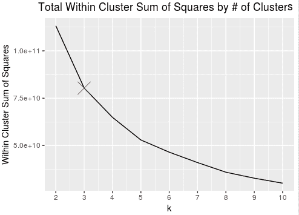

```r
# setting the working directory to a folder where dataset is located
setwd('/home/sunil/Desktop/chapter5/')
# reading the dataset to cust_data dataframe
cust_data = read.csv(file='Wholesale_customers_ data.csv', header = TRUE)
# removing the non-required columns
cust_data<-cust_data[,c(-1,-2)]
# including the NbClust library
library(NbClust)
# Computing the optimal number of clusters through the NbClust function with distance as euclidean and using kmeans 
NbClust(cust_data,distance="euclidean", method="kmeans")
```

即使使用肘曲线方法输出，我们也可以看到数据集的最佳聚类数是`3`。

```r
******************************************************************* 
* Among all indices: 
* 1 proposed 2 as the best number of clusters 
* 11 proposed 3 as the best number of clusters 
* 2 proposed 4 as the best number of clusters 
* 1 proposed 5 as the best number of clusters 
* 4 proposed 8 as the best number of clusters 
* 1 proposed 10 as the best number of clusters 
* 1 proposed 12 as the best number of clusters 
* 1 proposed 14 as the best number of clusters 
* 1 proposed 15 as the best number of clusters 
                   ***** Conclusion ***** 
* According to the majority rule, the best number of clusters is 3 
******************************************************************* 
```

我们从`NbClust`函数中看到，我们已经使用了欧几里德距离作为距离。有许多距离类型(`euclidean`、`maximum`、`manhattan`、`canberra`、`binary`、`minkowski`)我们可以在`NbClust`函数中用作该距离参数的值。让我们来理解这个距离实际上意味着什么。我们已经知道，数据集中的每个观察值都是由表示要素的值构成的。这实质上意味着数据集的每个观察值都可以表示为多维空间中的点。如果我们必须说两个观察值是相似的，我们会期望多维空间中的两个点之间的距离更小，也就是说，多维空间中的这两个点彼此靠近。两点之间的大距离值表示它们非常不相似。

```r
# computing the the intra-cluster distance with Ks ranging from 2 to 10
library(purrr)
tot_withinss <- map_dbl(2:10, function(k){
  model <- kmeans(cust_data, centers = k, nstart = 50)
  model$tot.withinss
})
# converting the Ks and computed intra-cluster distances to a dataframe
screeplot_df <- data.frame(k = 2:10,
```

```r

                           tot_withinss = tot_withinss)
# plotting the elbow curve
library(ggplot2)
print( ggplot(screeplot_df, aes(x = k, y = tot_withinss)) + 
         geom_line() + 
         scale_x_continuous(breaks = 1:10) + 
         labs(x = "k", y = "Within Cluster Sum of Squares") + 
         ggtitle("Total Within Cluster Sum of Squares by # of Clusters (k)") +
         geom_point(data = screeplot_df[2,], aes(x = k, y = tot_withinss),
                    col = "red2", pch = 4, size = 7))
```

This will give the following output:


欧几里德、曼哈顿和其他类型的距离度量是在多维空间中给定两点的情况下可以测量距离的各种方式。每种距离测量都涉及一种特定的技术来计算两点之间的距离。Manhattan 和 Euclidean 中涉及的技术以及它们的度量之间的差异在下面的屏幕截图中进行了说明:

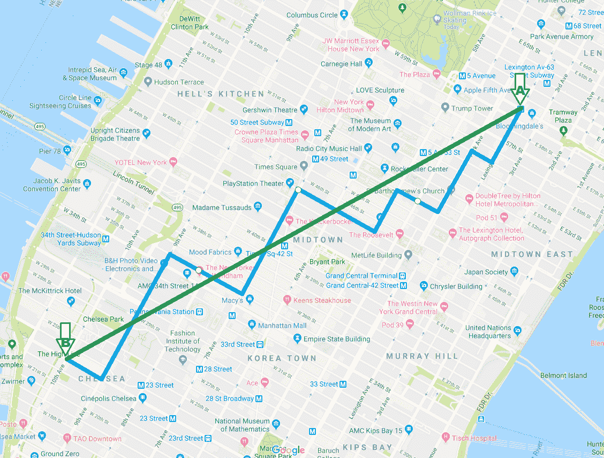

曼哈顿距离度量和欧几里德距离度量之间的差异

欧几里得距离度量的是平面中最短的距离，而曼哈顿度量是允许水平或垂直移动的最短路径。

The Euclidean, Manhattan, and other types of distance measures are various ways in which distance can be measured given two points in a multidimensional space. Each of the distance measures involves a specific technique to compute the distance between the two points. The techniques involved in Manhattan and Euclidean, and the difference between their measures, are illustrated in the following screenshot:


例如，如果`a`和`b`是`a= (0,0)`、`b = (3,4)`所在的两个点，那么看看下面的情况:

`dist_euclid (a,b) = sqrt(3^2+4^2) = 5`

`dist_manhattan(a,b) = 3+4 = 7`

`a=(a1,...,an), b=(b1,...,bn)`(在 *n* 尺寸和点中)

`dist_euclid (a,b) = sqrt((a1-b1)^2 + ... + (an-bn)^2)`

*   `dist_manhattan(a,b) = sum(abs(a1-b1) + ... + abs(an-bn))`
*   两者都测量最短路径，但是欧几里得度量没有任何限制，而曼哈顿度量只允许路径在除一维之外的所有维度上保持不变。
*   同样，其他的距离度量也涉及到某种独特的给定点之间的相似性的度量。在本章中，我们不会详细讨论每一种技术，但我们要了解的是，距离度量基本上定义了给定观测值之间的相似程度。值得注意的是，距离度量不仅用于`NbClust`，也用于多种最大似然算法，包括 k-means。
*   现在，我们已经了解了确定 k 值的各种方法，并实现了这些方法来确定批发数据集的最佳聚类数，让我们使用以下代码实现 k-means 算法:
*   这将导致以下输出:

Both measure the shortest paths, but the Euclidean metric doesn't have any restrictions while the Manhattan metric only allows paths constant in all but one dimension.

Likewise, the other distance measures also involve a certain unique to measure the similarity between given points. We will not be going through each one of the techniques in detail in this chapter, but the idea to get is that a distance measure basically defines the level of similarity between given observations. It may be noted that a distance measure is not just used in `NbClust` but in multiple ML algorithms, including k-means.

从输出 k-means，我们可以观察和推断关于输出集群的一些事情。显然，形成了三个集群，这与传递给算法的 k 参数一致。我们看到第一个聚类有 330 个观察值，第二和第三个聚类很小，只有 50 和 60 个观察值。k-means 输出也为我们提供了聚类质心。**质心**代表特定集群中的所有点。由于研究分配给一个聚类的每个单独的观察值并确定该聚类的商业特征是不可行的，所以该聚类质心可被用作该聚类中的点的伪。聚类质心帮助我们根据聚类内容的定义快速得出结论。k-means 输出也产生了每个观察值的聚类分配。我们的批发数据集中的每个观察值被分配到三个聚类(1，2，3)中的一个。

```r
library(cluster)
# runing kmeans in cust_data dataset to obtain 3 clusters
kmeansout <- kmeans(cust_data, centers = 3, nstart = 50) 
print (kmeansout)
```

可以使用`factoextra`库中的`fviz_cluster()`函数查看聚类结果。该函数很好地展示了集群。如果有两个以上的维度(变量)，`fviz_cluster`将执行**主成分分析** ( **PCA** )并根据解释大部分方差的前两个主成分绘制观察值。可以通过以下代码创建集群可视化:

```r
> kmeansout
K-means clustering with 3 clusters of sizes 330, 50, 60
Cluster means:
     Fresh Milk Grocery Frozen Detergents_Paper Delicassen
1 8253.47 3824.603 5280.455 2572.661 1773.058 1137.497
2 8000.04 18511.420 27573.900 1996.680 12407.360 2252.020
3 35941.40 6044.450 6288.617 6713.967 1039.667 3049.467
Clustering vector:
  [1] 1 1 1 1 3 1 1 1 1 2 1 1 3 1 3 1 1 1 1 1 1 1 3 2 3 1 1 1 2 3 1 1 1 3 1 1 3 1 2 3 3 1 1 2 1 2 2 2 1 2 1 1 3 1
 [55] 3 1 2 1 1 1 1 2 1 1 1 2 1 1 1 1 1 1 1 1 1 1 1 2 1 1 1 1 1 1 1 2 2 3 1 3 1 1 2 1 1 1 1 1 1 1 1 1 1 3 1 1 1 1
[109] 1 2 1 2 1 1 1 1 1 1 1 1 1 1 1 1 3 3 1 1 1 3 1 1 1 1 1 1 1 1 1 1 1 3 3 1 1 2 1 1 1 3 1 1 1 1 1 2 1 1 1 1 1 1
[163] 1 2 1 2 1 1 1 1 1 2 1 2 1 1 3 1 1 1 1 3 1 3 1 1 1 1 1 1 1 1 1 1 1 1 3 1 1 1 2 2 3 1 1 2 1 1 1 2 1 2 1 1 1 1
```

```r
[217] 2 1 1 1 1 1 1 1 1 1 1 1 1 1 1 1 3 1 1 1 1 1 1 3 3 3 1 1 1 1 1 1 1 1 1 2 1 3 1 3 1 1 3 3 1 1 3 1 1 2 2 1 2 1
[271] 1 1 1 3 1 1 3 1 1 1 1 1 3 3 3 3 1 1 1 3 1 1 1 1 1 1 1 1 1 1 1 2 1 1 2 1 2 1 1 2 1 3 2 1 1 1 1 1 1 2 1 1 1 1
[325] 3 3 1 1 1 1 1 2 1 2 1 3 1 1 1 1 1 1 1 2 1 1 1 3 1 2 1 2 1 2 1 1 1 1 1 1 1 1 1 1 1 1 1 1 1 1 3 1 1 1 1 1 1 3
[379] 1 1 3 1 3 1 2 1 1 1 1 1 1 1 1 3 1 1 1 1 1 1 1 3 3 3 1 1 3 2 1 1 1 1 1 1 1 1 1 1 2 1 1 1 3 1 1 1 1 3 1 1 1 1
[433] 1 1 1 3 3 2 1 1
```

这将给出下图作为输出:


```r
library(factoextra)
fviz_cluster(kmout,data=cust_data)
```

k-means 算法的工作机制

k-means 算法的执行包括以下步骤:

从数据集中随机选择 *k 个*观测值作为初始聚类质心。

对于数据集中的每个观察值，执行以下操作:


# 计算观测值和每个簇形心之间的距离。

识别与观测值距离最小的聚类质心。

1.  将观测值指定给这样的最近质心。
2.  将所有点指定给一个簇形心后，计算新的簇形心。这可以通过取分配给一个聚类的所有点的平均值来实现。
    1.  重复执行*步骤 2* 和*步骤 3* ，直到聚类质心(平均值)不变或达到用户定义的迭代次数。
    2.  在 k-means 中需要注意的一点是，初始步骤中的聚类质心是随机选择的，初始聚类分配是基于实际观察值和随机选取的聚类质心之间的距离来完成的。这实质上意味着，如果我们在初始步骤中选择不同于所选观测值的观测值作为聚类质心，我们将获得与我们已经获得的聚类不同的聚类。在技术术语中，这被称为**非全局最优解**或**局部最优解**。`cluster`库的 k-means 函数有`nstart`选项，它解决了 k-means 算法遇到的非全局最优解的问题。
    3.  `nstart`选项使算法能够通过从数据集中提取多个中心观察值来尝试几次随机开始(而不是一次)。然后，它检查聚类平方和，并以最佳开始继续，从而产生更稳定的输出。在我们的例子中，我们将`nstart`的值设置为`50`，因此通过 k-means post 使用 50 个随机初始聚类质心集对其进行检查来选择最佳开始。下图描述了 k-means 聚类分析算法中涉及的高级步骤:

3.  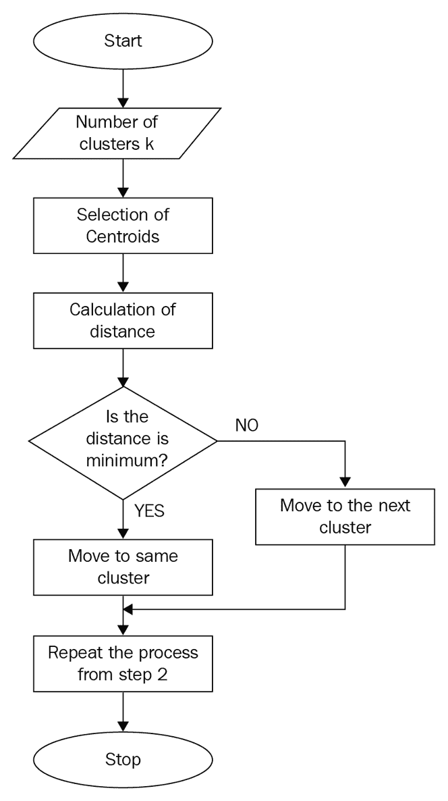
4.  k 均值聚类的步骤

在监督的 ML 方法中，例如分类，我们有基础事实，因此，我们将能够将我们的预测与基础事实进行比较，并测量以报告我们分类的性能。与监督最大似然法不同，在聚类中，我们没有任何基础事实。因此，计算关于集群的性能度量是一个挑战。

作为性能测量的替代方法，我们使用一个叫做**集群质量**的伪测量。聚类质量通常通过称为类内距离和类间距离的度量来计算，如下图所示:

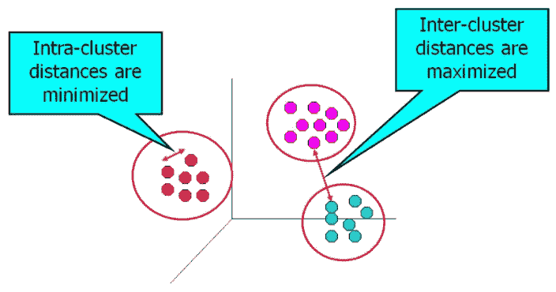

定义了类内距离和类间距离

聚类任务的目标是获得高质量的聚类。如果观测值内的距离最小，而聚类本身之间的距离最大，则聚类被称为**高质量聚类**。

有多种方法可以测量群集间和群集内的距离:

**簇内**:该距离可测量为簇中所有点对之间的(绝对/平方)距离(总和、最小值、最大值或平均值)*直径*–质心和簇中所有点之间的两个最远点(or)。

**聚类间**:该距离是所有聚类对之间的(平方)距离之和，其中两个聚类之间的距离本身计算如下:

它们的质心之间的距离

最远一对点之间的距离

*   属于聚类的最近的一对点之间的距离
*   不幸的是，没有办法精确定位优选的簇间距离和簇内距离值。**轮廓指数**是一种基于簇间距离和簇内距离的度量，可以很容易地计算和解释。
    *   对于参与聚类练习的每个观察值，使用平均组内距离 *a* 和平均最近组距离 *b* 来计算轮廓指数。观察的轮廓指数由以下公式给出:
    *   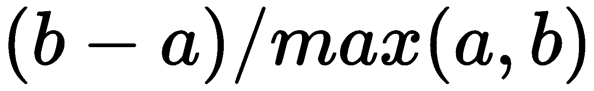
    *   这里， *b* 是观测值和该观测值不属于的最近簇之间的距离。

轮廓指数值的范围在[-1，1]之间。观察值为+1 表示该观察远离其相邻的聚类，而非常接近其所分配到的聚类。类似地，值-1 告诉我们，观察值更接近其相邻的簇，而不是它被分配到的簇。值为 0 意味着它位于两个簇之间距离的边界。+1 是理想值，而-1 是最不理想的值。因此，该值越高，聚类的质量越好。

`cluster`库提供了 Silhouette 函数，可以很容易地在我们的 k-means 聚类输出中使用，以了解所形成的聚类的质量。下面的代码计算我们的三个集群的轮廓指数:

这将为我们提供以下输出:

正如我们所见，轮廓指数的范围可以从-1 到+1，后者是首选。从输出中，我们看到这些簇都是高质量的簇，因为平均宽度是一个更接近于 1 而不是-1 的正数。


事实上，轮廓指数不仅可以用来测量所形成的聚类的质量，还可以用来计算 k 值。类似于 Elbow 方法，我们可以迭代 k 的多个值，然后识别跨聚类产生最大轮廓指数值的 k。然后可以使用所识别的 k 来执行聚类。

文献中描述了许多聚类质量度量。轮廓指数只是我们在本章中讨论的一个度量，因为它在 ML 社区中很受欢迎。`clusterCrit`库提供了广泛的指数来衡量集群的质量。这里我们不打算探究其他集群质量指标，但是感兴趣的读者应该参考这个库，以获得关于如何计算集群质量的更多信息。

到目前为止，我们已经介绍了用于识别聚类的 k-means 聚类算法，但是我们开始的原始分割任务并没有到此结束。细分进一步延伸到理解从聚类练习中形成的每个聚类对企业意味着什么的任务。例如，我们采用从 k-means 获得的聚类质心，并尝试识别这些质心是什么:

```r
# computing the silhouette index for the clusters
si <- silhouette(kmout$cluster, dist(cust_data, "euclidean"))
# printing the summary of the computed silhouette index 
print(summary(si))
```

以下是对每个集群的一些样本分析:

```r
Silhouette of 440 units in 3 clusters from silhouette.default(x = kmout$cluster, dist = dist(cust_data, from "euclidean")) :
 Cluster sizes and average silhouette widths:
       60 50 330 
0.2524346 0.1800059 0.5646307 
Individual silhouette widths:
   Min. 1st Qu. Median Mean 3rd Qu. Max. 
-0.1544 0.3338 0.5320 0.4784 0.6743 0.7329 
```

第 1 类是低消费人群(平均消费:22，841.744 英镑)，大部分消费都集中在生鲜类

第二类是高消费人群(平均消费:70，741.42 英镑)，大部分消费在食品杂货类

第三组是中等支出者(平均支出:59，077.568 英镑)，大部分支出属于新鲜品类

现在，基于业务目标，可以选择一个或多个集群作为目标。例如，如果目标是让高消费人群消费更多，则促销可以推广到在`Frozen`和`Delicatessen`产品上的消费小于质心值(即`Frozen` : `1,996.680`和`Delicatessen` : `2,252.020`)的集群 2 个人。

So far, we have covered the k-means clustering algorithm to identify the clusters, but the original segmentation task we started with does not end here. Segmentation further spans to the task of understanding what each of the clusters formed from the clustering exercise mean to businesses. For example, we take our cluster centroids obtained from k-means and an attempt is made to identify what these are:

```r
Fresh Milk Grocery Frozen Detergents_Paper Delicatessen
1 8253.47 3824.603 5280.455 2572.661 1773.058 1137.497
2 8000.04 18511.420 27573.900 1996.680 12407.360 2252.020
3 35941.40 6044.450 6288.617 6713.967 1039.667 3049.467
```

Here are some sample insights into each cluster:

*   使用 DIANA 识别批发客户数据中的客户细分
*   当我们在数据中不一定有圆形(或超球面)聚类，并且我们本质上事先不知道聚类的数量时，层次聚类算法是一个很好的选择。与平面或分区算法不同，分层聚类算法不需要在对数据集应用该算法之前决定和传递要形成的聚类数。
*   分层聚类产生一个树状图(树形图)，可以直观地验证该树状图，从而容易地确定聚类的数量。视觉验证使我们能够在树状图的适当位置进行切割。

由这种类型的聚类算法产生的结果是可再现的，因为该算法对距离度量的选择不敏感。换句话说，不管选择的距离度量是多少，我们都会得到相同的结果。这种类型的聚类也适用于更高复杂性(二次)的数据集，尤其适用于探索聚类之间存在的层次关系。

分裂层次聚类，也称为**分裂分析** ( **戴安娜**)，是一种层次聚类算法，遵循自上而下的方法来识别给定数据集中的聚类。以下是 DIANA 中识别集群的步骤:

数据集的所有观测值都被分配给根，因此在初始步骤中只形成一个单独的聚类。


# 在每次迭代中，最异构的集群被分成两个。

**重复步骤 2** 直到所有的观察值都在它们自己的聚类中:

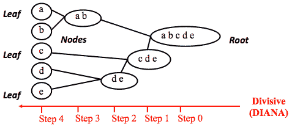

分裂式层次聚类算法的工作原理

Divisive hierarchical clustering, also known as **DIvisive ANAlysis** (**DIANA**), is a hierarchical clustering algorithm that follows a top-down approach to identify clusters in a given dataset. Here are the steps in DIANA to identify the clusters:

1.  一个显而易见的问题是，该算法使用什么技术将集群一分为二。答案是，它是根据某种(不)相似性度量来执行的。欧几里德距离用于测量两个给定点之间的距离。该算法的工作原理是根据数据点之间所有成对距离的最远距离度量来分割数据。链接定义了数据点距离的具体细节。下图说明了 DIANA 在划分集群时考虑的各种联系。以下是一些被认为是分组的距离:
2.  **单连杆**:最近距离或单连杆
3.  **完全联动**:最远距离或完全联动

**平均连杆**:平均距离或平均连杆

**质心-连杆**:质心距离

**沃德方法**:距离的平方和`euclidean`最小

请看下图，以便更好地理解前面的距离:

*   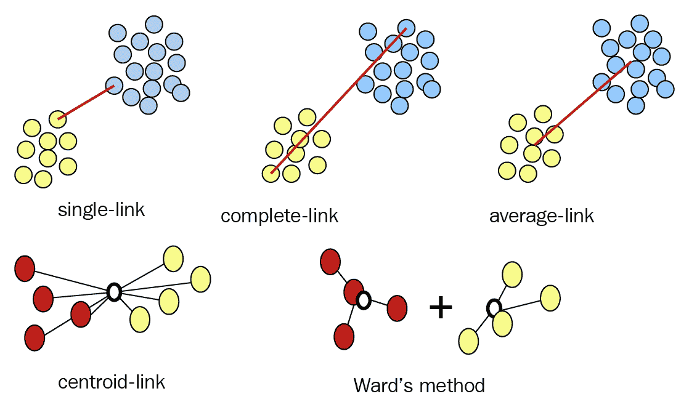
*   描述 DIANA 使用的各种链接类型的插图
*   通常，要使用的链接类型作为参数传递给聚类算法。`cluster`库提供了`diana`函数来执行集群。让我们用下面的代码将它应用于我们的批发数据集:
*   这将为我们提供以下输出:
*   看一下下面的输出:

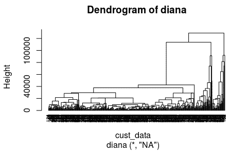


`plot.hclust()`和`plot.dendrogram()`功能也可用于 DIANA 聚类输出。`plot.dendrogram()`产生树状图，该树状图遵循由 DIANA 算法完成的分裂的自然结构。使用以下代码生成树图:

这将产生以下输出:

```r
# setting the working directory to a folder where dataset is located
setwd('/home/sunil/Desktop/chapter5/')
# reading the dataset to cust_data dataframe
cust_data = read.csv(file='Wholesale_customers_ data.csv', header = TRUE)
# removing the non-required columns
cust_data<-cust_data[,c(-1,-2)]
# including the cluster library so as to make use of diana function
library(cluster)
# Compute diana()
cust_data_diana<-diana(cust_data, metric = "euclidean",stand = FALSE)
# plotting the dendogram from diana output
pltree(cust_data_diana, cex = 0.6, hang = -1,
       main = "Dendrogram of diana")
# Divise coefficient; amount of clustering structure found
print(cust_data_diana$dc)
```

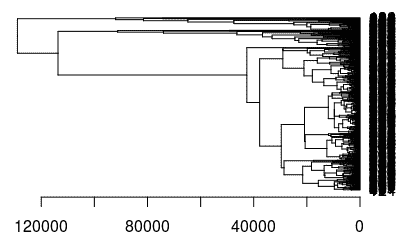

```r
> print(cust_data_diana$dc)
[1] 0.9633628
```

在树状图输出中，出现在右侧的每个叶子都与数据集中的每个观察值相关。当我们从右向左遍历时，彼此相似的观察结果被分组到一个分支中，该分支本身在更高的级别上被融合。

在水平轴上提供的较高融合水平指示两个观察之间的相似性。融合度越高，观测值越相似。可以注意到，关于两个观察值的接近性的结论只能基于包含这两个观察值的分支首次被融合的水平来得出。为了识别聚类，我们可以在一定的层次上切割树状图。进行切割的级别定义了获得的聚类数。

我们可以利用`cutree()`函数来获得数据集中每个观察值的聚类分配。执行以下代码以获取分类并查看分类输出:

这将产生以下输出:

```r
plot(as.dendrogram(cust_data_diana), cex = 0.6,horiz = TRUE)
```

This will give the following output:


我们还可以通过`factoextra`库中的`fviz_cluster`函数来可视化聚类输出。使用以下代码获得所需的可视化效果:

这将为您提供以下输出:

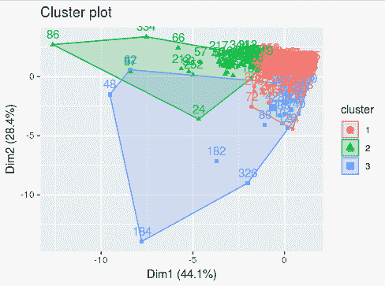

```r
# obtain the clusters through cuttree
# Cut tree into 3 groups
grp <- cutree(cust_data_diana, k = 3)
# Number of members in each cluster
table(grp)
# Get the observations of cluster 1
rownames(cust_data)[grp == 1]
```

还可以对树突图本身内的簇进行颜色编码。这可以通过下面的代码来实现:

```r
> table(grp)
grp
  1 2 3 
364 44 32 
> rownames(cust_data)[grp == 1]
  [1] "1" "2" "3" "4" "5" "6" "7" "8" "9" "11" "12" "13" "14" "15" "16"
```

这将产生以下输出:

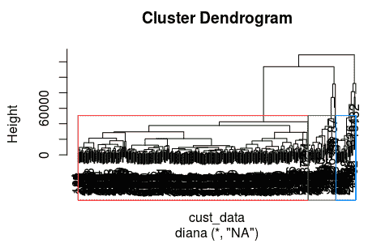

```r
"17" "18" "19" 
 [19] "20" "21" "22" "25" "26" "27" "28" "31" "32" "33" "34" "35" "36" "37" "38" "41" "42" "43" 
 [37] "45" "49" "51" "52" "54" "55" "56" "58" "59" "60" "61" "63" "64" "65" "67" "68" "69" "70" 
 [55] "71" "72" "73" "74" "75" "76" "77" "79" "80" "81" "82" "83" "84" "85" "89" "90" "91" "92" 
 [73] "94" "95" "96" "97" "98" "99" "100" "101" "102" "103" "105" "106" "107" "108" "109" "111" "112" "113"
 [91] "114" "115" "116" "117" "118" "119" "120" "121" "122" "123" "124" "127" "128" "129" "131" "132" "133" "134"
[109] "135" "136" "137" "138" "139" "140" "141" "142" "144" "145" "147" "148" "149" "151" "152" "153" "154" "155"
[127] "157" "158" "159" "160" "161" "162" "163" "165" "167" "168" "169" "170" "171" "173" "175" "176" "178" "179"
[145] "180" "181" "183" "185" "186" "187" "188" "189" "190" "191" "192" "193" "194" "195" "196" "198" "199" "200"
[163] "203" "204" "205" "207" "208" "209" "211" "213" "214" "215" "216" "218" "219" "220" "221" "222" "223" "224"
[181] "225" "226" "227" "228" "229" "230" "231" "232" "233" "234" "235" "236" "237" "238" "239" "241" "242" "243"
[199] "244" "245" "246" "247" "248" "249" "250" "251" "253" "254" "255" "257" "258" "261" "262" "263" "264" "265"
[217] "266" "268" "269" "270" "271" "272" "273" "275" "276" "277" "278" "279" "280" "281" "282" "284" "287" "288"
[235] "289" "291" "292" "293" "294" "295" "296" "297" "298" "299" "300" "301" "303" "304" "306" "308" "309" "311"
[253] "312" "314" "315" "316" "317" "318" "319" "321" "322" "323" "324" "325" "327" "328" "329" "330" "331" "333"
[271] "335" "336" "337" "338" "339" "340" "341" "342" "343" "345" "346" "347" "348" "349" "351" "353" "355" "356"
[289] "357" "358" "359" "360" "361" "362" "363" "364" "365" "366" "367" "368" "369" "370" "372" "373" "374" "375"
[307] "376" "377" "379" "380" "381" "382" "384" "385" "386" "387" "388" "389" "390" "391" "392" "393" "394" "395"
[325] "396" "397" "398" "399" "400" "401" "402" "403" "404" "405" "406" "407" "409" "410" "411" "412" "413" "414"
[343] "415" "416" "417" "418" "420" "421" "422" "423" "424" "425" "426" "427" "429" "430" "431" "432" "433" "434"
[361] "435" "436" "439" "440"
```

We can also visualize the clustering output through the `fviz_cluster` function in the `factoextra` library. Use the following code to get the required visualization:

```r
library(factoextra)
fviz_cluster(list(data = cust_data, cluster = grp))
```

This will give you the following output:

既然识别了聚类，我们讨论的评估聚类质量(通过轮廓指数)的步骤也适用于此。因为我们已经在 k-means 聚类算法中讨论过这个主题，所以我们不打算在这里重复这些步骤。输出的代码和解释与 k-means 中讨论的一样。

如前所述，聚类的结果并不是我们手头的客户细分练习的最终结果。类似于我们在 k-means 算法下进行的讨论，我们可以分析 DIANA 聚类输出，以识别有意义的细分，从而将业务目标扩展到那些具体识别的细分。

```r
plot(as.hclust(cust_data_diana))
rect.hclust(cust_data_diana, k = 4, border = 2:5)
```

使用 AGNES 识别批发客户数据中的客户群

AGNES 与 DIANA 相反，它遵循自下而上的方法对数据集进行聚类。下图说明了 AGNES 聚类算法的工作原理:

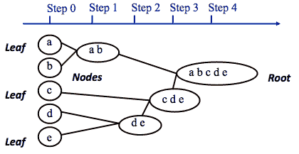

凝聚层次聚类算法的工作原理

除了 AGNES 遵循的自底向上的方法，算法背后的实现细节与 DIANA 相同；因此，这里不再重复对概念的讨论。以下代码块使用 AGNES 将我们的批发数据集聚类为三个聚类；它还创建了这样形成的集群的可视化:

这是您将获得的输出:


# 看一下下面的截图:

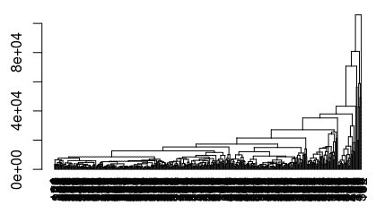

看一下下面的代码块:

执行以下命令:

上述命令会生成以下输出:

```r
# setting the working directory to a folder where dataset is located
setwd('/home/sunil/Desktop/chapter5/')
# reading the dataset to cust_data dataframe
cust_data = read.csv(file='Wholesale_customers_ data.csv', header = TRUE)
# removing the non-required columns
cust_data<-cust_data[,c(-1,-2)]
# including the cluster library so as to make use of agnes function
library(cluster)
# Compute agnes()
cust_data_agnes<-agnes(cust_data, metric = "euclidean",stand = FALSE)
# plotting the dendogram from agnes output
pltree(cust_data_agnes, cex = 0.6, hang = -1,
       main = "Dendrogram of agnes")
# agglomerative coefficient; amount of clustering structure found
print(cust_data_agnes$ac)
plot(as.dendrogram(cust_data_agnes), cex = 0.6,horiz = TRUE)
# obtain the clusters through cuttree
# Cut tree into 3 groups
grp <- cutree(cust_data_agnes, k = 3)
# Number of members in each cluster
table(grp)
# Get the observations of cluster 1
rownames(cust_data)[grp == 1]
# visualization of clusters
library(factoextra)
fviz_cluster(list(data = cust_data, cluster = grp))
library(factoextra)
fviz_cluster(list(data = cust_data, cluster = grp))
plot(as.hclust(cust_data_agnes))
rect.hclust(cust_data_agnes, k = 3, border = 2:5)
```

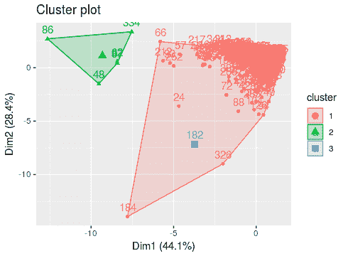

```r
[1] 0.9602911
> plot(as.dendrogram(cust_data_agnes), cex = 0.6,horiz = FALSE)
```

看看下面的命令:

上述命令会生成以下输出:

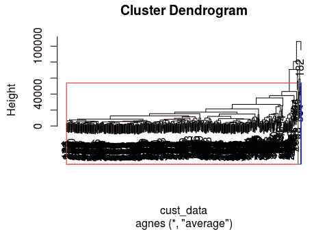

```r
> grp <- cutree(cust_data_agnes, k = 3)
> # Number of members in each cluster
> table(grp)
grp
  1 2 3
434 5 1 
> rownames(cust_data)[grp == 1]
  [1] "1" "2" "3" "4" "5" "6" "7" "8" "9" "10" "11" "12" "13" "14" "15" "16" "17" "18" 
 [19] "19" "20" "21" "22" "23" "24" "25" "26" "27" "28" "29" "30" "31" "32" "33" "34" "35" "36" 
 [37] "37" "38" "39" "40" "41" "42" "43" "44" "45" "46" "47" "49" "50" "51" "52" "53" "54" "55" 
 [55] "56" "57" "58" "59" "60" "61" "63" "64" "65" "66" "67" "68" "69" "70" "71" "72" "73" "74" 
 [73] "75" "76" "77" "78" "79" "80" "81" "82" "83" "84" "85" "88" "89" "90" "91" "92" "93" "94" 
 [91] "95" "96" "97" "98" "99" "100" "101" "102" "103" "104" "105" "106" "107" "108" "109" "110" "111" "112"
[109] "113" "114" "115" "116" "117" "118" "119" "120" "121" "122" "123" "124" "125" "126" "127" "128" "129" "130"
[127] "131" "132" "133" "134" "135" "136" "137" "138" "139" "140" "141" "142" "143" "144" "145" "146" "147" "148"
[145] "149" "150" "151" "152" "153" "154" "155" "156" "157" "158" "159" "160" "161" "162" "163" "164" "165" "166"
[163] "167" "168" "169" "170" "171" "172" "173" "174" "175" "176" "177" "178" "179" "180" "181" "183" "184" "185"
[181] "186" "187" "188" "189" "190" "191" "192" "193" "194" "195" "196" "197" "198" "199" "200" "201" "202" "203"
```

```r
[199] "204" "205" "206" "207" "208" "209" "210" "211" "212" "213" "214" "215" "216" "217" "218" "219" "220" "221"
[217] "222" "223" "224" "225" "226" "227" "228" "229" "230" "231" "232" "233" "234" "235" "236" "237" "238" "239"
[235] "240" "241" "242" "243" "244" "245" "246" "247" "248" "249" "250" "251" "252" "253" "254" "255" "256" "257"
[253] "258" "259" "260" "261" "262" "263" "264" "265" "266" "267" "268" "269" "270" "271" "272" "273" "274" "275"
[271] "276" "277" "278" "279" "280" "281" "282" "283" "284" "285" "286" "287" "288" "289" "290" "291" "292" "293"
[289] "294" "295" "296" "297" "298" "299" "300" "301" "302" "303" "304" "305" "306" "307" "308" "309" "310" "311"
[307] "312" "313" "314" "315" "316" "317" "318" "319" "320" "321" "322" "323" "324" "325" "326" "327" "328" "329"
[325] "330" "331" "332" "333" "335" "336" "337" "338" "339" "340" "341" "342" "343" "344" "345" "346" "347" "348"
[343] "349" "350" "351" "352" "353" "354" "355" "356" "357" "358" "359" "360" "361" "362" "363" "364" "365" "366"
[361] "367" "368" "369" "370" "371" "372" "373" "374" "375" "376" "377" "378" "379" "380" "381" "382" "383" "384"
[379] "385" "386" "387" "388" "389" "390" "391" "392" "393" "394" "395" "396" "397" "398" "399" "400" "401" "402"
[397] "403" "404" "405" "406" "407" "408" "409" "410" "411" "412" "413" "414" "415" "416" "417" "418" "419" "420"
[415] "421" "422" "423" "424" "425" "426" "427" "428" "429" "430" "431" "432" "433" "434" "435" "436" "437" "438"
[433] "439" "440"
```

我们可以从 AGNES 聚类输出中看到，数据集中的大量观察值被分配给一个聚类，而很少的观察值被分配给其他聚类。对于我们的细分下游练习来说，这不是一个很好的输出。为了获得更好的聚类分配，除了 AGNES 算法当前使用的默认平均链接方法之外，您可以尝试使用其他聚类链接方法。

```r
> fviz_cluster(list(data = cust_data, cluster = grp))
```

摘要

在这一章中，我们学习了分割的概念及其与聚类的关系，聚类是一种 ML 无监督学习技术。我们利用了 UCI 数据库中的大规模数据集，并使用 k-means、DIANA 和 AGNES 算法实现了聚类。在本章的过程中，我们还学习了与聚类相关的各个方面，如聚类趋势、距离、关联度量、确定正确聚类数的方法以及度量聚类的输出。我们还探索了如何利用聚类输出进行客户细分。

计算机能像人类一样看到和识别物体和生物吗？让我们在下一章探索这个问题的答案。

```r
> plot(as.hclust(cust_data_agnes))
> rect.hclust(cust_data_agnes, k = 3, border = 2:5)
```

The preceding commands generate the following output:


We can see from the AGNES clustering output that a large number of observations from the dataset are assigned to one cluster and very few observations were assigned to the other clusters. This is not a great output for our segmentation downstream exercise. To obtain better cluster assignments, you could try using other cluster-linkage methods aside from the default average linkage method currently used by the AGNES algorithm.


# Summary

In this chapter, we learned about the concept of segmentation and its association with clustering, an ML unsupervised learning technique. We made use of the wholesale dataset available from the UCI repository and implemented clustering using the k-means, DIANA, and AGNES algorithms. During the course of this chapter, we also studied various aspects related to clustering, such as tendency to cluster, distance, linkage measures, and methods to identify the right number of clusters, and measuring the output of clustering. We also explored making use of the clustering output for customer-segmentation purposes.

Can computers see and identify objects and living creatures like humans do? Let's explore the answer to this question in the next chapter.