# 九、通过强化学习赢得赌场老虎机

如果你一直在关注**机器学习** ( **ML** )新闻，我相信你一定遇到过这种头条:*计算机在各种比赛中表现超过世界冠军*。如果你还没有，下面是我在谷歌上快速搜索到的一些新闻片段，值得你花时间去阅读以了解情况:

*   看看这个:[https://www . the verge . com/2017/10/18/16495548/deep mind-ai-go-alpha go-zero-自学/](https://www.theverge.com/2017/10/18/16495548/deepmind-ai-go-alphago-zero-self-taught/) :

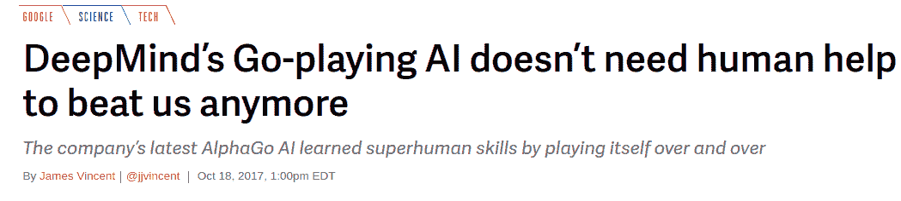

*   看到这个:[https://www . makeuseof . com/tag/ais-winning-5-times-computers-beat-humans/](https://www.makeuseof.com/tag/ais-winning-5-times-computers-beat-humans/):

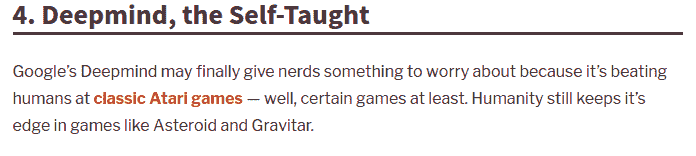

**强化学习** ( **RL** )是**人工智能** ( **AI** )的一个子领域，它为能够在 Atari Breakout 和 Go 等游戏中表现得比人类玩家更好的计算机系统提供动力。

在本章中，我们将探讨以下主题:

*   RL 的概念
*   多臂强盗问题
*   解决多臂老虎机问题的方法
*   RL 的实际应用
*   使用 RL 技术实现一个项目，以最大化我们在多臂强盗机器上获胜的机会


# 了解 RL

RL 是一个非常重要的领域，但在解决复杂的现实世界问题时，有时会被实践者忽略。不幸的是，即使大多数 ML 教科书只关注监督和非监督学习，而完全忽略了 RL。

RL 作为一个领域，近年来发展势头强劲；然而，它的起源可以追溯到 1980 年。它是由里奇·萨顿和里奇的博士论文导师安德鲁·巴尔托发明的。甚至在 20 世纪 80 年代，它就被认为是过时的。然而，里奇相信 RL 及其承诺，认为它最终会被认可。

用 RL 这个词在 Google 上快速搜索显示，RL 方法经常被用在游戏中，比如跳棋和国际象棋。博弈问题是需要随着时间的推移采取行动以找到动态问题的长期最优解决方案的问题。它们是动态的，因为条件在不断变化，有时是对其他因素的反应，而这些因素可能是对抗性的。

虽然 RL 的成功在游戏领域得到了证明，但它也是一个新兴领域，越来越多地应用于其他领域，如金融、经济和其他跨学科领域。在人工智能和运筹学领域有许多独立发展的方法。因此，这是一个 ML 从业者学习的关键领域。

简单来说，RL 是一个主要专注于创建从错误中学习的模型的领域。想象一个人被放在一个新的环境中。起初，他们会犯错误，但他们会从中吸取教训，以便将来出现同样的情况时，他们不会再犯同样的错误。RL 使用相同的技术来训练模型，如下所示:

环境->尝试和失败->从失败中学习->达成目标

从历史上看，你不能使用 ML 让一个算法学习如何在执行某项任务时变得比人更好。我们所能做的就是模仿人类的行为来模拟机器的行为，也许这样计算机会运行得更快。然而，RL 可以创造出比人类更擅长完成某些任务的模型。

SYBBIO 的首席执行官兼联合创始人 Isaac Abhadu 在 Quora 上做了精彩的解释，详细介绍了与监督学习相比的 RL 的工作方式。他表示，简而言之，RL 框架与监督学习非常相似。

假设我们试图让一个算法在乒乓游戏中表现出色。我们有输入帧，我们将通过模型运行，让它产生一些随机输出动作，就像我们在监督学习设置中一样。然而，不同之处在于，在 RL 的情况下，我们自己不知道目标标签是什么，因此我们不会告诉机器在每种特定情况下做什么更好。相反，我们应用了一种叫做**政策梯度**的方法。

所以，我们从一个随机网络开始，给它一个输入帧，这样它就会产生一个随机的输出动作来对这个帧做出反应。这个动作然后被发送回游戏引擎，让它产生另一帧。这个循环一遍又一遍地继续。它给出的唯一反馈是游戏的记分牌。每当我们的代理做对了什么——也就是说，它产生了一些成功的序列——它就会得到一分，通常称为**奖励**。每当它产生一个失败的序列，它就会被扣掉一分——这是一个**惩罚**。

代理人追求的最终目标是不断更新其政策，以获得尽可能多的回报。所以，随着时间的推移，它会想出如何在游戏中打败人类。

RL 不快。代理一开始会亏很多。但是我们会不断地给它输入帧，这样它就会不断地产生随机的输出动作，并且它会偶然发现成功的动作。它会不断积累知识，知道哪些动作是成功的，过一段时间，就会变得不可战胜。


# RL 与其他 ML 算法的比较

RL 涉及一个**环境**，也就是要解决的问题集，和一个**代理**，也就是简单的 AI 算法。代理将执行某个动作，该动作的结果将是代理的**状态**的变化。这种改变导致代理人获得奖励，这是一个积极的奖励，或者惩罚，这是一个消极的奖励，因为他做了一个不正确的动作。通过重复动作和奖励过程，代理了解环境。它理解各种状态和各种可取和不可取的行动。这个执行行动并从奖励中学习的过程就是 RL。下图显示了 RL 中代理和环境之间的关系:

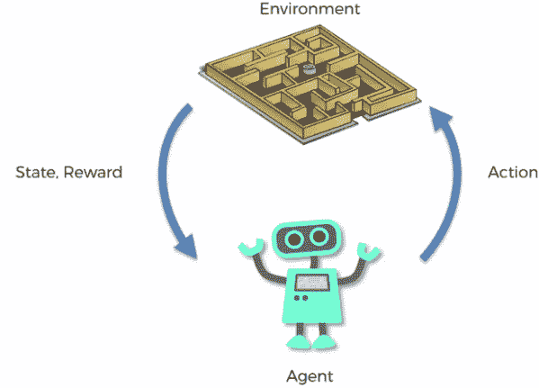

逆向物流中主体与环境的关系

RL、**深度学习** ( **DL** )和 ML 都以这样或那样的方式支持自动化。所有这些都涉及到从给定的数据中进行某种学习。然而，RL 与其他人的区别在于，RL 通过试错来学习正确的行为，而其他人则专注于通过在现有数据中寻找模式来学习。另一个关键的区别是，为了让 DL 和 ML 算法学习得更好，我们需要给它们大的带标签的数据集，而 RL 不是这样。

我们拿家里训练宠物来类比一下，更好的理解 RL。想象一下，我们正在教我们的宠物狗桑蒂一些新把戏。不幸的是，桑蒂不懂英语；因此，我们需要找到一种替代的方法来训练他。我们模拟了一种情况，桑蒂试图以许多不同的方式做出反应。对于任何令人满意的回应，我们都会奖励 Santy 一块骨头。这对宠物狗灌输的是，下次他遇到类似的情况时，他会表现出想要的行为，因为他知道有奖励。所以，这是从积极的反应中学习；如果他得到消极的回应，比如皱眉，他就会被劝阻做出不良行为。


# RL 术语

让我们用我们的宠物狗训练类比来理解 RL 关键术语——代理、环境、状态、政策、奖励和惩罚:

*   我们的宠物狗桑蒂就是暴露在环境中的病原体。
*   环境是房子还是游戏区，取决于我们想教给桑蒂什么。
*   遇到的每一种情况都称为状态。例如，桑蒂在床下爬行或奔跑可以被解释为状态。
*   代理 Santy 通过执行从一种状态改变到另一种状态的动作来做出反应。
*   在状态改变后，我们根据执行的动作给代理奖励或惩罚。
*   政策指的是选择行动以寻求更好结果的策略。

现在我们已经了解了每个 RL 术语，让我们更正式地定义这些术语，并在下面的图表中可视化代理的行为:

*   **状态**:世界的完整描述被称为状态。我们不抽象世界上存在的任何信息。状态可以是位置、常数或动态的。状态通常记录在数组、矩阵或高阶张量中。
*   **动作**:环境一般定义了可能的动作；也就是说，基于代理，不同的环境导致不同的动作。代理的有效动作被记录在称为动作空间的空间中。环境中可能的有效动作在数量上是有限的。
*   **环境**:这是智能体生活和互动的空间。对于不同类型的环境，我们使用不同的奖励和政策。
*   **奖励和回报**:奖励功能是 RL 中必须时刻跟踪的功能。它在调整、优化算法和停止算法训练方面起着至关重要的作用。奖励是基于世界的当前状态、刚刚采取的行动以及世界的下一个状态来计算的。
*   **策略**:RL 中的策略是代理用来选择下一个动作的规则；政策也被称为代理人的大脑。

请看下面的流程图，以便更好地理解这个过程:


RL 中的代理行为

在每个步骤 *t* ，代理执行以下任务:

1.  执行动作*a[t]*
2.  接收观察值*s[t]*
3.  获得标量奖励*r[t]*

该环境执行以下任务:

1.  动作变化*a[t]*
2.  放出观察*s[t+1]*
3.  放出标量奖励*r[t+1]*

时间步长 *t* 在每次迭代后递增。


# 多臂强盗问题

我先打个比方，更好的理解这个话题。你喜欢比萨饼吗？我很喜欢！我在班加罗尔最喜欢的餐厅供应美味的披萨。我几乎每次想吃披萨的时候都会去这个地方，而且我几乎可以肯定我会得到最好的披萨。然而，每次去同一家餐馆都让我担心我会错过镇上其他地方供应的更好的披萨！

一个可行的选择是一个接一个地尝试餐馆，品尝那里的披萨，但这意味着我很有可能最终会吃到不太好吃的披萨。然而，这是我找到一家比我目前所知的比萨店更好的比萨店的唯一方法。我知道你一定想知道为什么我在谈论比萨饼，而我应该谈论 RL。让我说重点。

这项任务的困境源于不完整的信息。换句话说，要完成这项任务，必须收集足够的信息来制定最佳的总体战略，然后探索新的行动。这将最终导致总体糟糕体验的最小化。这种情况也可以称为**勘探**对**开采**的困境；


探索与开发的困境

上图恰当地总结了我的 best-pizza 问题。

多臂强盗问题是披萨类比的简化形式。它被用来表示类似的问题，找到一个好的策略来解决这些问题已经帮助了很多行业。

一个**强盗**被定义为偷你钱的人！独臂强盗是一个简单的吃角子老虎机。我们在赌场里发现了这种机器:你将一枚硬币投入老虎机，拉动杠杆，向幸运之神祈祷立即得到奖励。但百万美元的问题是，为什么老虎机被称为老虎机？原来所有赌场都是这样配置老虎机的，所有赌客最后都输钱！

多臂 bandit 是一种假想但复杂的吃角子老虎机，其中我们有一排以上的吃角子老虎机。一个赌徒可以拉几个杠杆，每个杠杆给出不同的回报。下图描述了相应奖励的概率分布，每一层的奖励不同，游戏者也不知道:

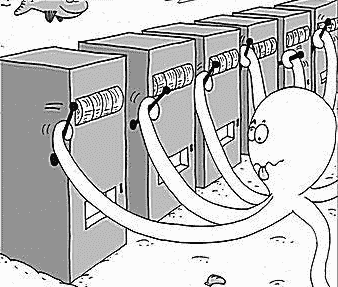

多臂强盗

给定这些吃角子老虎机，并经过一系列初步试验后，任务是确定拉什么杠杆才能获得最大回报。换句话说，拉任何一只手臂都会给我们一个随机奖励，要么 R=+1 表示成功，要么 R=0 表示失败；这叫做**即时奖励**。发出 1 或 0 奖励的多臂老虎机称为**伯努利**。目标是在收集信息的同时，按顺序一个接一个地拉动武器，以使长期总支出最大化。形式上，伯努利 MABP 可以被描述为(A，R)的元组，其中以下适用:

*   我们有报酬概率为{θ1，…，θK}的 KK 机器。
*   在每个时间步， *t* ，我们在一台老虎机上采取行动， *a* ，并获得奖励， *r* 。
*   *A* 是一组动作，每个动作指的是与一台老虎机的交互。行动的价值*一*是预期的奖励， [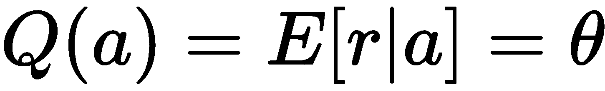] 。如果时间步 *t* 的动作 *a* 在第 *i* 台机器上，则 [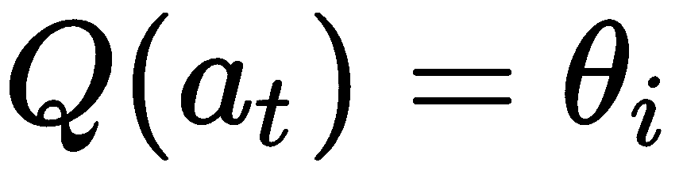] 。Q(a)通常被称为动作值函数。
*   *R* 是奖励函数。在伯努利强盗的例子中，我们以随机的方式观察到一个奖励， *r* 。在时间步 *t* ， [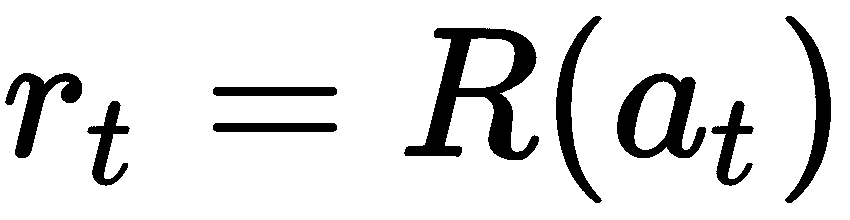] 可能以概率 [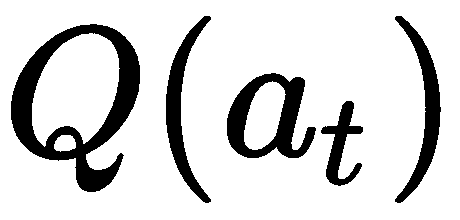，]或 0 返回奖励 1。

我们可以用多种策略解决 MABP 问题。我们将在本节中简要回顾一些策略。为了决定最佳策略和比较不同的策略，我们需要一个定量的方法。一种方法是在某个预定次数的尝试后直接计算累积奖励。比较每种策略的累积回报给了我们一个机会来确定解决问题的最佳策略。

有时，我们可能已经知道对于给定的老虎机问题的最佳行动。在那些情况下，看看后悔的概念可能是有趣的。

让我们想象一下，我们知道解决给定的强盗问题的最佳方法的细节。假设通过反复拉这个最佳臂，我们得到了一个最大的预期回报，在下图中显示为一条水平线:

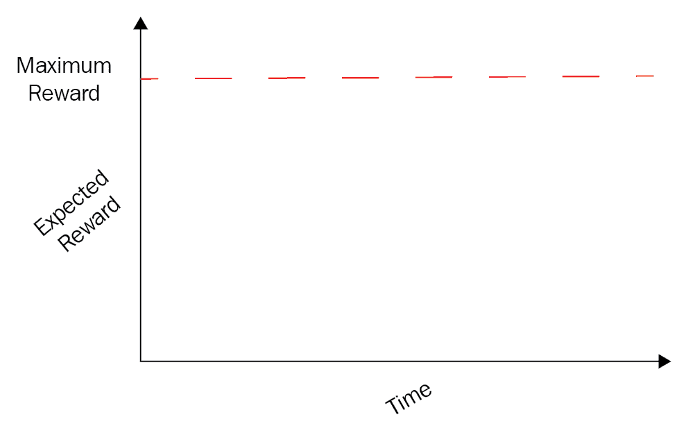

拉 MABP 最佳手臂获得最大奖励

根据问题陈述，我们需要通过拉动多臂强盗的不同臂来进行重复试验，直到我们大致确定在时间 *t* 拉动哪个臂来获得最大平均回报。当我们探索和决定最好的手臂的时候，有许多回合涉及。回合数，也称为**审判**，也招致一些损失，这被称为**遗憾**。换句话说，即使在学习阶段，我们也希望回报最大化。遗憾可以总结为量化我们后悔没有选择最佳手臂的程度。

下图显示了为寻找最佳手臂而进行的尝试所带来的遗憾:

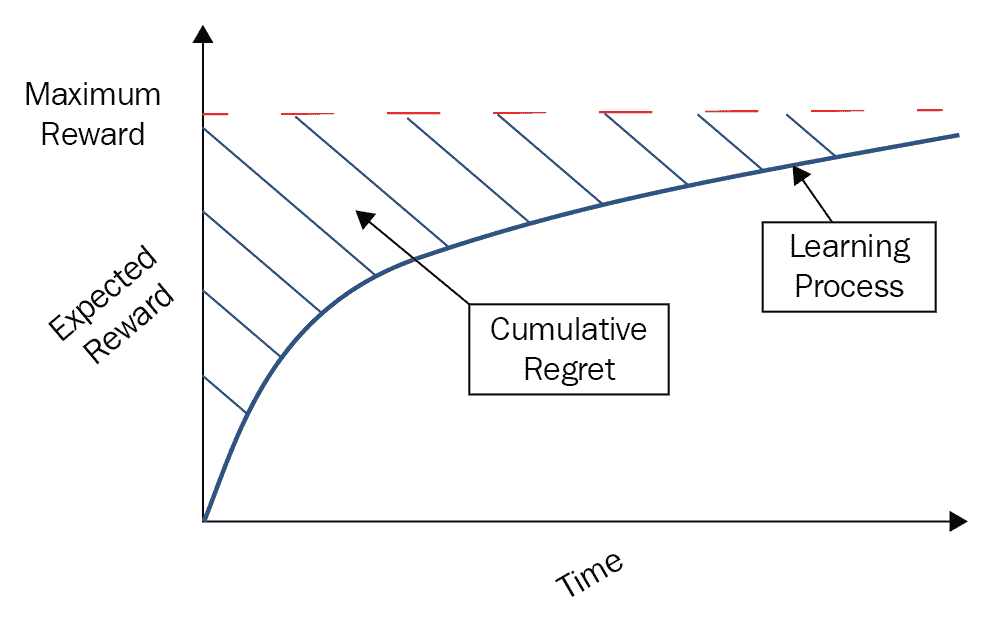

MAB 的后悔概念


# 解决 MABP 问题的策略

根据探索的方式，解决 MABP 的策略可以分为以下几种类型:

*   没有探索
*   随意探索
*   聪明地探索，偏爱不确定性

让我们深入研究属于每种策略类型的一些算法的细节。

让我们考虑一个非常天真的方法，它涉及长时间只玩一台老虎机。在这里，我们不做任何探索，只是随机选择一只手臂反复拉，以最大化长期回报。你一定想知道这是怎么回事！我们来探索一下。

在概率论中，大数定律是一个描述多次进行相同实验的结果的定理。根据这一定律，从大量试验中获得的结果的平均值应该接近预期值，并且随着进行更多的试验，将趋于变得更接近。

我们可以用一台机器进行大量回合的游戏，以根据大数定律最终估算出真实的奖励概率。

然而，这种策略存在一些问题。首先，我们不知道大量子弹的价值。第二，大量重复播放同一个插槽是超级资源密集型的。而且，最重要的是，不能保证我们会用这种策略获得最好的长期回报。


# ε-贪婪算法

RL 中的贪婪算法是一个完全的剥削算法，不在乎探索。贪婪算法总是选择具有最高估计动作值的动作。行动价值是根据过去的经验，通过对迄今为止观察到的与目标行动相关联的奖励进行平均来估计的。

然而，如果我们能够成功地估计预期动作值的动作值，使用贪婪算法可能是一个聪明的方法；如果我们知道真实的分布，我们就可以选择最佳的行动。ε-贪婪算法是贪婪和随机方法的简单组合。

Epsilon 帮助进行这一估算。它将探索作为贪婪算法的一部分。为了对抗总是选择最佳行动的逻辑，根据估计的行动值，偶尔，ε概率为了探索而选择随机行动；其余时间，它的行为与最初的贪婪算法一样，并选择已知的最佳动作。

该算法中的ε是一个可调参数，它决定了采取随机而非有原则的行动的概率。也可以在训练期间调整ε值。通常，在训练过程开始时，ε值通常被初始化为大概率。由于环境未知，大的ε值鼓励探索。然后，该值逐渐减小到一个小常数(通常设置为 0.1)。这将增加剥削选择率。

由于算法的简单性，该方法已经成为大多数最近的 RL 算法的事实上的技术。尽管该算法被广泛使用，但这种方法远非最佳，因为它只考虑了行动是否最有价值。


# 玻尔兹曼或 softmax 探索

玻尔兹曼探索也被称为 **softmax 探索**。与始终采取最优行动或始终采取随机行动相反，这种探索通过加权概率支持两者。这是通过 softmax 对每个动作的网络估计值来完成的。在这种情况下，虽然不能保证，但代理估计为最优的动作最有可能被选择。

玻尔兹曼探索比ε贪婪有最大的优势。这个方法有关于其他动作的可能值的信息。换句话说，让我们想象一个代理有五个可用的动作。通常，在ε-贪婪方法中，四个动作被估计为非最优的，并且它们都被同等地考虑。然而，在玻尔兹曼探索中，四个次优选择是通过它们的相对价值来衡量的。这使得代理能够忽略被估计为在很大程度上是次优的动作，并且给予潜在有希望但不一定是理想的动作更多的关注。

温度参数( *τ* )控制 softmax 分布的扩散，以便在训练开始时平等地考虑所有动作，并且在训练结束时稀疏地分布动作。该参数随时间退火。


# 腐朽的贪婪的ε

ε的值是确定ε-贪婪算法对于给定问题的工作情况的关键。我们可以让ε依赖于时间，而不是一开始就设置这个值，然后再减小它。例如，ε可以保持等于 1 / log(t + 0.00001)。久而久之，ε值会不断减小。这种方法的工作原理是，随着时间的推移，ε减小，我们对最佳行动变得更有信心，并且需要更少的探索。

随机选择动作的问题是，在足够的时间步骤后，即使我们知道一些 arm 是坏的，该算法也会以概率*ε/n*继续选择。本质上，我们是在探索一个不好的动作，听起来不是很有效率。解决这一问题的方法可能是支持勘探具有强大潜力的武器，以获得最佳价值。


# 置信上限算法

**置信上限** ( **UCB** )算法是 MABPs 最流行和最广泛使用的解决方案。这种算法基于面对不确定性时的乐观原则。这实质上意味着，我们对一条手臂的不确定性越小，探索这条手臂就变得越重要。

假设我们有两条可以试用的手臂。如果我们已经尝试了第一只手臂 100 次，但是第二只手臂只尝试了一次，那么我们可能对第一只手臂的回报有相当的信心。然而，我们对第二只手的收益非常不确定。这就产生了 UCB 算法家族。这可以通过下图进一步解释:

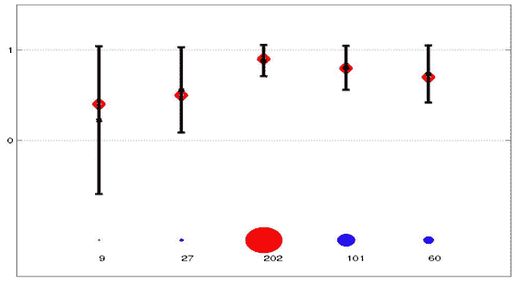

解释置信上限算法的图示

在上图中，每个条代表不同的手臂或动作。红点是真实的预期回报，条形的中心代表观察到的平均回报。条形的宽度代表置信区间。我们已经知道，根据大数定律，我们的样本越多，观察到的平均值就越接近真实平均值，棒线就收缩得越多。

UCB 算法背后的思想是总是选择具有最高上限的手臂或动作，这是观察到的平均值和置信区间的单侧宽度之和。这就平衡了对未经多次试验的武器的探索和对经过多次试验的武器的开发。


# 汤普森取样

汤普森抽样是最古老的启发式算法之一。它是一种基于贝叶斯思想的随机算法，最近在几项研究表明它与其他方法相比具有更好的经验性能后，引起了人们的极大兴趣。

我在[https://stats . stack exchange . com/questions/187059/can-any one-explain-Thompson-sampling-in-simple-terms](https://stats.stackexchange.com/questions/187059/could-anyone-explain-thompson-sampling-in-simplest-terms)上找到了一个很漂亮的解释。我不认为我能比这更好地解释汤普森抽样。你可以参考这个做进一步的参考。


# 多臂老虎机–真实使用案例

在现实世界中，我们会遇到许多与我们在本章中讨论的 MABP 相似的情况。我们可以将 RL 策略应用于所有这些情况。以下是一些与 MABP 相似的真实使用案例:

*   在众多可供选择的药物中寻找最佳药物
*   在可能推出的产品中确定最佳产品
*   决定流量(用户)的数量，我们需要为每个网站分配
*   确定推出产品的最佳营销策略
*   确定最佳股票投资组合以实现利润最大化
*   找出投资的最佳股票
*   在给定的地图中找出最短路径
*   广告和文章的点击率预测
*   基于文章的内容预测将被缓存在路由器上的最有益的内容
*   为一个组织的不同部门分配资金
*   在给定有限时间和任意选择阈值的情况下，从一群学生中挑选出表现最好的运动员

到目前为止，我们已经涵盖了几乎所有的基本细节，我们需要知道进展到 RL 到 MABP 的实际实施。让我们在下一节开始 MABP 的编码解决方案。


# 用 UCB 和汤姆逊采样算法求解 MABP

在这个项目中，我们将使用置信上限和 Thompson 采样算法来求解 MABP。我们将比较他们在三种不同情况下的表现和策略——标准奖励，标准但更不稳定的奖励，以及有些混乱的奖励。让我们准备模拟数据，一旦准备好数据，我们将使用以下代码查看模拟数据:

```
# loading the required packages
library(ggplot2)
library(reshape2)
# distribution of arms or actions having normally distributed
# rewards with small variance
# The data represents a standard, ideal situation i.e.
# normally distributed rewards, well seperated from each other.
mean_reward = c(5, 7.5, 10, 12.5, 15, 17.5, 20, 22.5, 25, 26)
reward_dist = c(function(n) rnorm(n = n, mean = mean_reward[1], sd = 2.5),
                function(n) rnorm(n = n, mean = mean_reward[2], sd = 2.5),
                function(n) rnorm(n = n, mean = mean_reward[3], sd = 2.5),
                function(n) rnorm(n = n, mean = mean_reward[4], sd = 2.5),
                function(n) rnorm(n = n, mean = mean_reward[5], sd = 2.5),
                function(n) rnorm(n = n, mean = mean_reward[6], sd = 2.5),
                function(n) rnorm(n = n, mean = mean_reward[7], sd = 2.5),
                function(n) rnorm(n = n, mean = mean_reward[8], sd = 2.5),
                function(n) rnorm(n = n, mean = mean_reward[9], sd = 2.5),
                function(n) rnorm(n= n, mean = mean_reward[10], sd = 2.5))
#preparing simulation data
dataset = matrix(nrow = 10000, ncol = 10)
for(i in 1:10){
  dataset[, i] = reward_dist[[i]](n = 10000)
}
# assigning column names
colnames(dataset) <- 1:10
# viewing the dataset that is just created with simulated data
View(dataset)
```

这将产生以下输出:

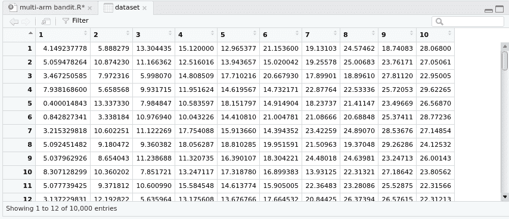

现在，创建一个融合了 arm 和 reward 组合的数据集，然后使用以下代码将 arm 列转换为 nominal 类型:

```
# creating a melted dataset with arm and reward combination
dataset_p = melt(dataset)[, 2:3]
colnames(dataset_p) <- c("Bandit", "Reward")
# converting the arms column in the dataset to nominal type
dataset_p$Bandit = as.factor(dataset_p$Bandit)
# viewing the dataset that is just melted
View(dataset_p)
```

这将为我们提供以下输出:

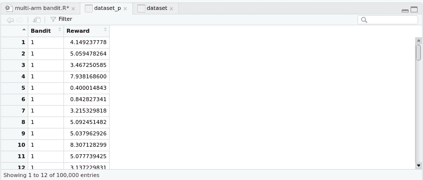

现在，使用以下代码绘制强盗的奖励分布图:

```
#ploting the distributions of rewards from bandits
ggplot(dataset_p, aes(x = Reward, col = Bandit, fill = Bandit)) +
  geom_density(alpha = 0.3) +
  labs(title = "Reward from different bandits")
```

这将为我们提供以下输出:


现在，让我们使用以下代码在具有正态分布的假设 arm 上实现 UCB 算法:

```
# implementing upper confidence bound algorithm
UCB <- function(N = 1000, reward_data){
  d = ncol(reward_data)
  bandit_selected = integer(0)
  numbers_of_selections = integer(d)
  sums_of_rewards = integer(d)
  total_reward = 0
  for (n in 1:N) {
    max_upper_bound = 0
    for (i in 1:d) {
      if (numbers_of_selections[i] > 0){
        average_reward = sums_of_rewards[i] / numbers_of_selections[i]
        delta_i = sqrt(2 * log(1 + n * log(n)^2) /
numbers_of_selections[i])
        upper_bound = average_reward + delta_i
      } else {
        upper_bound = 1e400
      }
      if (upper_bound > max_upper_bound){
        max_upper_bound = upper_bound
        bandit = i
      }
    }
    bandit_selected = append(bandit_selected, bandit)
    numbers_of_selections[bandit] = numbers_of_selections[bandit] + 1
    reward = reward_data[n, bandit]
    sums_of_rewards[bandit] = sums_of_rewards[bandit] + reward
    total_reward = total_reward + reward
  }
  return(list(total_reward = total_reward, bandit_selected bandit_selected, numbers_of_selections = numbers_of_selections, sums_of_rewards = sums_of_rewards))
}
# running the UCB algorithm on our
# hypothesized arms with normal distributions
UCB(N = 1000, reward_data = dataset)
```

您将获得以下结果输出:

```
$total_reward
       1
25836.91
$numbers_of_selections
 [1]   1   1   1   1   1   1   2   1  23 968
$sums_of_rewards
 [1]     4.149238    10.874230     5.998070    11.951624    18.151797    21.004781    44.266832    19.370479   563.001692
[10] 25138.139942
```

接下来，我们将使用以下代码，使用**正态伽马**先验和正态似然来实现 Thompson 采样算法，以估计后验分布:

```
# Thompson sampling algorithm
rnormgamma <- function(n, mu, lambda, alpha, beta){
  if(length(n) > 1)
    n <- length(n)
  tau <- rgamma(n, alpha, beta)
  x <- rnorm(n, mu, 1 / (lambda * tau))
  data.frame(tau = tau, x = x)
}
T.samp <- function(N = 500, reward_data, mu0 = 0, v = 1, alpha = 2,
beta = 6){
  d = ncol(reward_data)
  bandit_selected = integer(0)
  numbers_of_selections = integer(d)
  sums_of_rewards = integer(d)
  total_reward = 0
  reward_history = vector("list", d)
  for (n in 1:N){
    max_random = -1e400
    for (i in 1:d){
      if(numbers_of_selections[i] >= 1){
        rand = rnormgamma(1,
                          (v * mu0 + numbers_of_selections[i] * mean(reward_history[[i]])) / (v + numbers_of_selections[i]),
                          v + numbers_of_selections[i],
                          alpha + numbers_of_selections[i] / 2,
                          beta + (sum(reward_history[[i]] - mean(reward_history[[i]])) ^ 2) / 2 + ((numbers_of_selections[i] * v) / (v + numbers_of_selections[i])) * (mean(reward_history[[i]]) - mu0) ^ 2 / 2)$x
      }else {
        rand = rnormgamma(1, mu0, v, alpha, beta)$x
      }
      if(rand > max_random){
        max_random = rand
        bandit = i
      }
    }
    bandit_selected = append(bandit_selected, bandit)
    numbers_of_selections[bandit] = numbers_of_selections[bandit] + 1
    reward = reward_data[n, bandit]
    sums_of_rewards[bandit] = sums_of_rewards[bandit] + reward
    total_reward = total_reward + reward
    reward_history[[bandit]] = append(reward_history[[bandit]], reward)
  }
  return(list(total_reward = total_reward, bandit_selected = bandit_selected, numbers_of_selections = numbers_of_selections, sums_of_rewards = sums_of_rewards))
}
# Applying Thompson sampling using normal-gamma prior and Normal likelihood to estimate posterior distributions
T.samp(N = 1000, reward_data = dataset, mu0 = 40)
```

您将获得以下结果输出:

```
$total_reward
      10
24434.24
$numbers_of_selections
 [1]  16  15  15  14  14  17  16  19  29 845
$sums_of_rewards
 [1]    80.22713   110.09657   141.14346   171.41301   212.86899   293.30138   311.12230   423.93256   713.54105 21976.59855
```

从结果中，我们可以推断，UCB 算法很快识别出第 10 个^(臂产生的奖励最多。我们还观察到，汤普森抽样在找到最好的臂之前尝试了更多次最差的臂。)

现在，让我们模拟具有较大方差的正态分布奖励的强盗数据，并使用以下代码绘制奖励的分布:

```
# Distribution of bandits / actions having normally distributed rewards with large variance
# This data represents an ideal but more unstable situation: normally distributed rewards with much larger variance,
# thus not well separated from each other.
mean_reward = c(5, 7.5, 10, 12.5, 15, 17.5, 20, 22.5, 25, 26)
reward_dist = c(function(n) rnorm(n = n, mean = mean_reward[1], sd = 20),
                function(n) rnorm(n = n, mean = mean_reward[2], sd = 20),
                function(n) rnorm(n = n, mean = mean_reward[3], sd = 20),
                function(n) rnorm(n = n, mean = mean_reward[4], sd = 20),
                function(n) rnorm(n = n, mean = mean_reward[5], sd = 20),
                function(n) rnorm(n = n, mean = mean_reward[6], sd = 20),
                function(n) rnorm(n = n, mean = mean_reward[7], sd = 20),]
                function(n) rnorm(n = n, mean = mean_reward[8], sd = 20),
                function(n) rnorm(n = n, mean = mean_reward[9], sd = 20),
                function(n) rnorm(n = n, mean = mean_reward[10], sd = 20))
#preparing simulation data
dataset = matrix(nrow = 10000, ncol = 10)
for(i in 1:10){
  dataset[, i] = reward_dist[[i]](n = 10000)
}
colnames(dataset) <- 1:10
dataset_p = melt(dataset)[, 2:3]
colnames(dataset_p) <- c("Bandit", "Reward")
dataset_p$Bandit = as.factor(dataset_p$Bandit)
#plotting the distributions of rewards from bandits
ggplot(dataset_p, aes(x = Reward, col = Bandit, fill = Bandit)) +
  geom_density(alpha = 0.3) +
  labs(title = "Reward from different bandits")
```

您将得到下图作为结果输出:

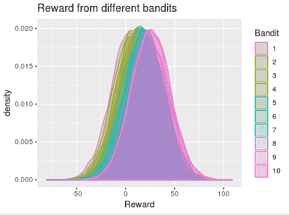

使用以下代码对差异较大的奖励应用 UCB:

```
# Applying UCB on rewards with higher variance
UCB(N = 1000, reward_data = dataset)
```

您将获得以下输出:

```
$total_reward
       1
25321.39
$numbers_of_selections
 [1]   1   1   1   3   1   1   2   6 903  81
$sums_of_rewards
 [1]     2.309649    -6.982907   -24.654597    49.186498     8.367174   -16.211632    31.243270   104.190075 23559.216706  1614.725305
```

接下来，通过使用以下代码，对具有较高方差的奖励应用 Thompson 采样:

```
# Applying Thompson sampling on rewards with higher variance
T.samp(N = 1000, reward_data = dataset, mu0 = 40)
```

您将获得以下输出:

```
$total_reward
       2
24120.94
$numbers_of_selections
 [1]  16  15  14  15  15  17  20  21 849  18
$sums_of_rewards
 [1]    94.27878    81.42390   212.00717   181.46489   140.43908   249.82014   368.52864   397.07629 22090.20740 305.69191
```

从结果中，我们可以推断，当回报的波动越大，UCB 算法就越容易陷入次优选择，永远找不到最优的老虎机。Thompson 采样通常更加稳健，能够在各种情况下找到最佳的 bandit。

现在，让我们模拟更混乱的强盗分布数据，并使用以下代码绘制强盗的奖励分布:

```
# Distribution of bandits / actions with rewards of different distributions
# This data represents an more chaotic (possibly more realistic) situation:
# rewards with different distribution and different variance.
mean_reward = c(5, 7.5, 10, 12.5, 15, 17.5, 20, 22.5, 25, 26)
reward_dist = c(function(n) rnorm(n = n, mean = mean_reward[1], sd = 20),
                function(n) rgamma(n = n, shape = mean_reward[2] / 2, rate
                 = 0.5),
                function(n) rpois(n = n, lambda = mean_reward[3]),
                function(n) runif(n = n, min = mean_reward[4] - 20, max = mean_reward[4] + 20),
                function(n) rlnorm(n = n, meanlog = log(mean_reward[5]) - 0.25, sdlog = 0.5),
                function(n) rnorm(n = n, mean = mean_reward[6], sd = 20),
                function(n) rexp(n = n, rate = 1 / mean_reward[7]),
                function(n) rbinom(n = n, size = mean_reward[8] / 0.5, prob = 0.5),
                function(n) rnorm(n = n, mean = mean_reward[9], sd = 20),
                function(n) rnorm(n = n, mean = mean_reward[10], sd = 20))
#preparing simulation data
dataset = matrix(nrow = 10000, ncol = 10)
for(i in 1:10){
  dataset[, i] = reward_dist[[i]](n = 10000)
}
colnames(dataset) <- 1:10
dataset_p = melt(dataset)[, 2:3]
colnames(dataset_p) <- c("Bandit", "Reward")
dataset_p$Bandit = as.factor(dataset_p$Bandit)
#plotting the distributions of rewards from bandits
ggplot(dataset_p, aes(x = Reward, col = Bandit, fill = Bandit)) +
  geom_density(alpha = 0.3) +
  labs(title = "Reward from different bandits")
```

您将得到下图作为结果输出:

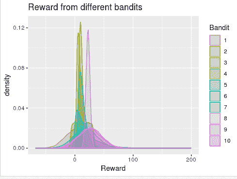

使用以下代码将 UCB 应用于不同分配的奖励:

```
# Applying UCB on rewards with different distributions
UCB(N = 1000, reward_data = dataset)
```

您将获得以下输出:

```
$total_reward
       1
22254.18
$numbers_of_selections
 [1]   1   1   1   1   1   1   1 926  61   6
$sums_of_rewards
 [1]     6.810026     3.373098     8.000000    12.783859    12.858791    11.835287     1.616978 20755.000000 1324.564987   117.335467
```

接下来，使用以下代码对不同分布的奖励应用 Thompson 抽样:

```
# Applying Thompson sampling on rewards with different distributions
T.samp(N = 1000, reward_data = dataset, mu0 = 40)
```

您将获得以下结果输出:

```
$total_reward
       2
24014.36
$numbers_of_selections
 [1]  16  14  14  14  14  15  14  51 214 634
$sums_of_rewards
 [1]    44.37095   127.57153   128.00000   142.66207   191.44695   169.10430   150.19486  1168.00000  5201.69130 16691.32118
```

从前面的结果中，我们看到这两种算法的性能是相似的。Thompson 采样算法在选择它认为最好的一个之前尝试所有老虎机几次的主要原因是因为我们在这个项目中选择了一个具有相对较高均值的先验分布。由于先验具有较大的均值，算法在开始时倾向于**探索而不是**利用。只有当算法变得非常确信它已经找到了最佳选择时，它才会重视开发而不是探索。如果我们降低先验的平均值，开发将具有更高的值，并且算法将更快地停止探索。通过改变所使用的先验分布，可以调整勘探相对于开发的重要性，以适应当前的特定问题。这进一步证明了汤普森采样算法的灵活性。


# 摘要

在本章中，我们学习了 RL。我们从定义 RL 和它与其他 ML 技术的区别开始这一章。然后，我们回顾了 MABP 的详细情况，并研究了可用于解决这一问题的各种策略。讨论了与 MABP 相似的用例。最后，使用 UCB 和汤普森采样算法实施了一个项目，以使用三个不同的模拟数据集来求解 MABP。

我们几乎已经到了这本书的结尾。这本书的附录，*前面的路*，顾名思义，是一个指导章节，建议从这里开始成为一个更好的 R 数据科学家的细节。我非常兴奋，因为我现在是 R 项目旅程的最后一站。你也同意我的观点吗？