# 一、为索赔分析保险严重程度

预测保险公司索赔的成本以及严重性是一个现实生活中的问题，需要以一种准确的方式来解决。在本章中，我们将向您展示如何使用一些最广泛使用的回归算法开发一个预测模型来分析保险理赔。

我们将从简单的**线性回归** ( **LR** )开始，我们将看到如何使用一些集成技术来提高性能，例如**梯度提升树** ( **GBT** )回归器。然后我们将看看如何用随机森林回归器来提高性能。最后，我们将向您展示如何选择最佳模型并将其部署到生产就绪环境中。此外，我们将提供一些关于机器学习工作流程、超参数调整和交叉验证的背景研究。

对于实现，我们将使用 **Spark ML** API 来获得更快的计算速度和巨大的可伸缩性。简而言之，在这个端到端项目中，我们将学习以下主题:

*   机器学习和学习工作流
*   ML 模型的超参数调整和交叉验证
*   用于分析保险严重程度索赔的 LR
*   利用梯度增强回归器提高性能
*   使用随机森林回归提高性能
*   模型部署


# 机器学习和学习工作流

**机器学习** ( **ML** )是关于使用一组统计和数学算法来执行诸如概念学习、预测建模、聚类和挖掘有用模式等任务，可以执行。最终目标是以这样一种方式改进学习，即它变得自动化，从而不再需要人类的交互，或者尽可能地减少人类交互的水平。

我们现在参考汤姆·m·米切尔**(*机器学习*，*汤姆·米切尔*，麦格劳·希尔，1997 **)** 对 ML 的一个著名定义，他从计算机科学的角度解释了学习的真正含义:**

如果一个计算机程序在某类任务 T 和性能测量 P 上的性能(由 P 测量)随着经验 E 而提高，则称它从经验 E 中学习。

基于前面的定义，我们可以得出结论，计算机程序或机器可以做到以下几点:

*   从数据和历史中学习
*   随着经验而提高
*   交互式增强可用于预测结果的模型

典型的 ML 函数可以公式化为凸优化问题，用于寻找凸函数 *f* 的极小值，该凸函数依赖于变量向量 *w* (权重)，该变量向量具有 *d* 条记录。在形式上，我们可以把它写成下面的优化问题:

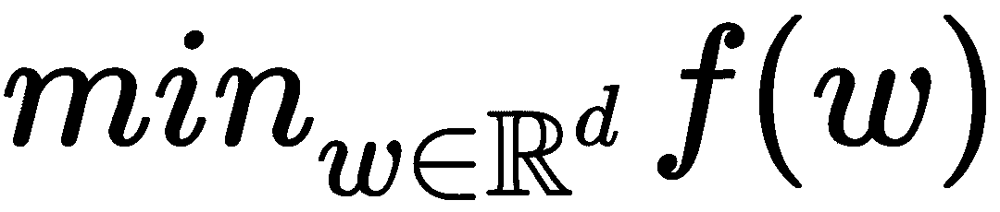

这里，目标函数的形式为:

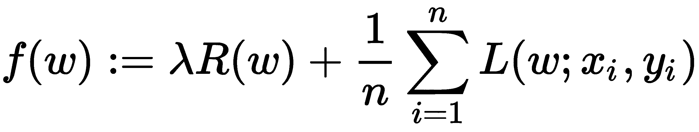

这里的矢量是 *1≤i≤n* 的训练数据点，是我们最终要预测的它们对应的标签。如果*L(w；x，y)* 可以表示为 *wTx* 和 *y* 的函数。

目标函数 *f* 有两个分量:

*   控制模型复杂性的正则化子
*   度量模型在训练数据上的误差的损失

损失函数*L(w；)*是典型的 *w* 中的凸函数。固定的正则化参数*λ≥0 定义了最小化训练误差损失和最小化模型复杂度以避免过拟合这两个目标之间的折衷。在整个章节中，我们将详细了解不同的学习类型和算法。*

另一方面，**深度神经网络** ( **DNN** )通过提供对数据中复杂和高级抽象进行建模的算法，形成了**深度学习** ( **DL** )的核心，可以更好地利用大规模数据集来建立复杂的模型

有一些广泛使用的基于人工神经网络的深度学习架构:DNNs、胶囊网络、受限玻尔兹曼机器、深度信念网络、因式分解机器和循环神经网络。

这些架构已经广泛应用于计算机视觉、语音识别、自然语言处理、音频识别、社交网络过滤、机器翻译、生物信息学和药物设计。在本章中，我们将看到几个使用这些架构实现一流预测精度的真实例子。


# 典型的机器学习工作流程

一个典型的 ML 应用包括几个处理步骤，从输入到输出，形成一个科学的工作流程，如图*图 1，ML 工作流程*所示。典型的 ML 应用程序包括以下步骤:

1.  加载数据
2.  将数据解析为算法的输入格式
3.  预处理数据并处理缺失值
4.  将数据分为三组，一组用于训练、测试和验证(分别为训练组和验证组)，另一组用于测试模型(测试数据集)
5.  运行算法来构建和训练您的 ML 模型
6.  使用训练数据进行预测，并观察结果
7.  使用测试数据测试和评估模型，或者使用第三个数据集**验证数据集**使用交叉验证技术验证模型
8.  调整模型以获得更好的性能和准确性
9.  扩大模型规模，使其能够在未来处理大量数据集
10.  在生产中部署 ML 模型:

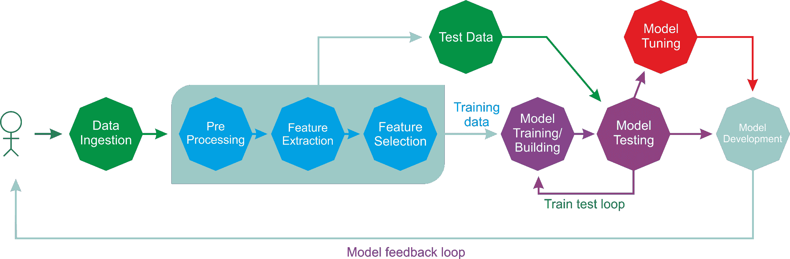

图 1: ML 工作流程

前面的工作流程代表了解决 ML 问题的几个步骤。其中，ML 任务可以大致分为监督、非监督、半监督、强化和推荐系统。下面的*图 2，行动中的监督学习*，展示了监督学习的示意图。在算法找到所需的模式后，这些模式可用于对未标记的测试数据进行预测:

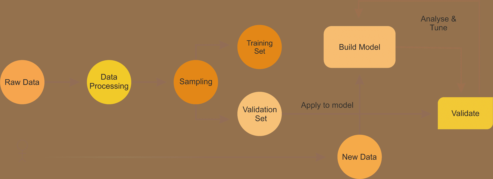

图 2:行动中的监督学习

示例包括用于解决监督学习问题的分类和回归，以便可以基于它们为预测分析构建预测模型。在接下来的章节中，我们将提供几个监督学习的例子，如 LR、逻辑回归、随机森林、决策树、朴素贝叶斯、多层感知器等等。

回归算法意味着产生连续的输出。输入可以是离散的也可以是连续的:

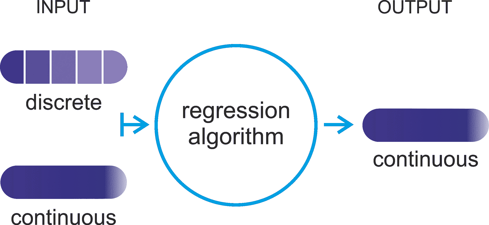

图 3:回归算法意味着产生连续的输出

另一方面，分类算法意味着从一组离散或连续值的输入中产生离散输出。了解这一区别非常重要，因为离散值输出通过分类可以更好地处理，这将在接下来的章节中讨论:

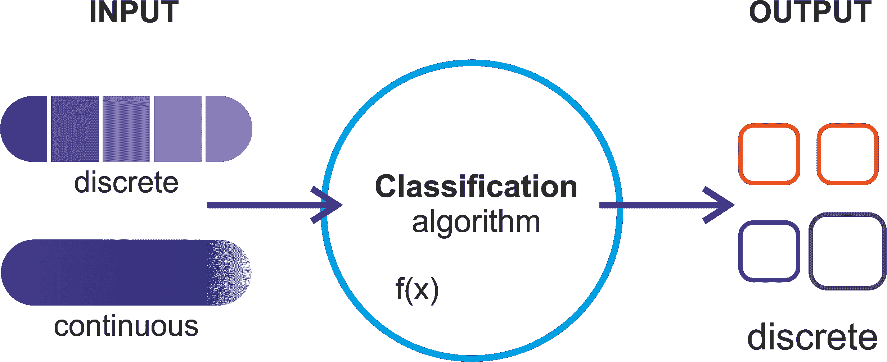

图 4:分类算法意味着产生离散的输出

在本章中，我们将主要关注监督回归算法。我们将从描述问题陈述开始，然后继续讨论非常简单的 LR 算法。通常，使用超参数调整和交叉验证技术来优化这些 ML 模型的性能。因此，简单地说，了解它们是强制性的，这样我们就可以在以后的章节中很容易地使用它们。


# 超参数调整和交叉验证

调整一个算法只是一个过程，通过这个过程可以使算法在运行时和内存使用方面达到最佳性能。在贝叶斯统计中，超参数是先验分布的参数。在 ML 方面，术语超参数是指那些不能从常规训练过程中直接学习到的参数。

超参数通常在实际训练过程开始前就已确定。这是通过为这些超参数设置不同的值，训练不同的模型，并通过测试确定哪些模型效果最好来实现的。以下是此类参数的一些典型示例:

*   树叶的数量、箱数或树的深度
*   迭代次数
*   矩阵分解中潜在因子的个数
*   学习率
*   深层神经网络中的隐藏层数
*   k-means 聚类中的聚类数等等

简而言之，超参数调优是一种根据提供的数据的性能选择正确的超参数组合的技术。这是在实践中从最大似然算法获得有意义和精确结果的基本要求之一。下图显示了模型调整过程、需要考虑的事项和工作流程:

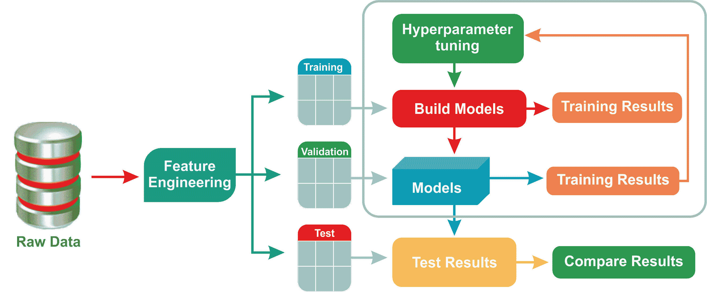

图 5:模型调优过程

交叉验证(也称为**旋转估计**)是一种模型验证技术，用于评估统计分析和结果的质量。目标是使模型向独立的测试集推广。如果您希望在将预测模型部署为 ML 应用程序时，评估它在实践中的准确表现，这将很有帮助。在交叉验证过程中，通常用已知类型的数据集来训练模型。

相反，它使用未知类型的数据集进行测试。在这方面，交叉验证有助于描述数据集，以便在训练阶段使用验证集测试模型。有两种类型的交叉验证，如下所示:

*   **穷举交叉验证**:包括留 p 交叉验证和留 1 交叉验证
*   **非穷举交叉验证**:包括 K 重交叉验证和重复随机二次抽样交叉验证

在大多数情况下，研究人员/数据科学家/数据工程师使用 10 重交叉验证，而不是在验证集上进行测试(详见*图 6* 、 *10 重交叉验证技术*)。这是跨所有用例及问题类型的最广泛使用的交叉验证技术，如下图所示。

基本上，使用这种技术，您的完整训练数据被分割成许多折叠。可以指定该参数。然后，整个流水线对于每个折叠运行一次，并且对于每个折叠训练一个 ML 模型。最后，通过用于分类器的投票方案或通过用于回归的平均，将获得的不同 ML 模型结合起来:

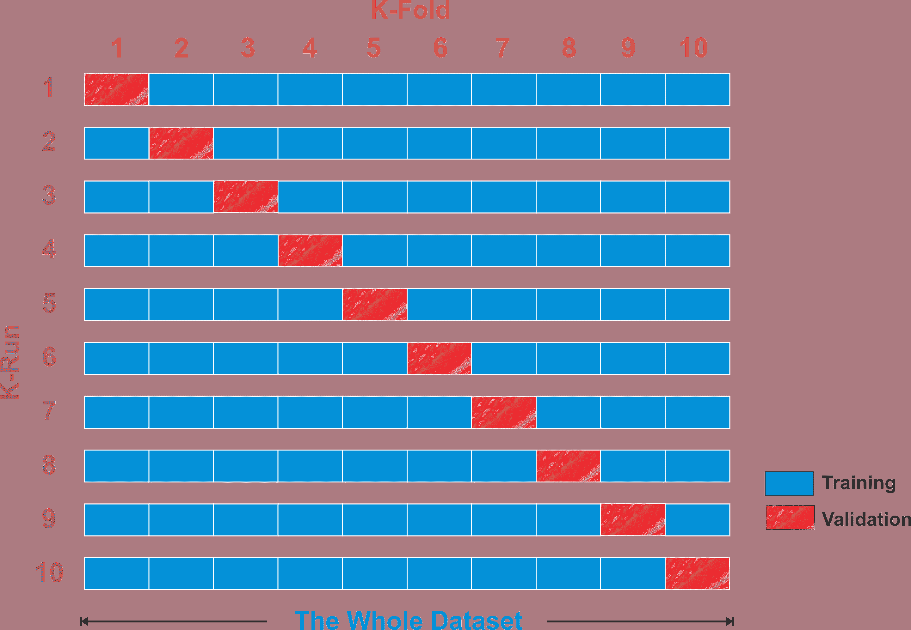

图 6: 10 重交叉验证技术

此外，为了减少可变性，使用不同的分区来执行交叉验证的多次迭代；最后，对各轮验证结果进行平均。


# 分析和预测保险严重程度索赔

预测保险公司索赔的成本和严重性是一个现实生活中的问题，需要以更准确和自动化的方式来解决。我们将在这个例子中做一些类似的事情。

我们将从简单的逻辑回归开始，并学习如何使用一些集成技术来提高性能，如随机森林回归。然后，我们将看看如何提高梯度增强回归的性能。最后，我们将展示如何选择最佳模型并将其部署到生产就绪环境中。


# 动机

当一个人被严重的车祸摧毁时，他关注的是他的生活、家庭、孩子、朋友和所爱的人。但是，一旦提交了保险索赔文件，计算严重程度索赔的整个基于纸面的过程将是一项需要完成的繁琐任务。

这就是为什么保险公司不断寻求新的想法，以自动化的方式改善他们为客户提供的理赔服务。因此，预测分析是一种可行的解决方案，可以根据可用的历史数据预测索赔的成本和严重性。


# 数据集的描述

将使用来自 Allstate Insurance company 的数据集，该数据集由超过 300，000 个带有屏蔽和匿名数据的示例组成，并由超过 100 个分类和数字属性组成，因此符合保密约束，足以构建和评估各种 ML 技术。

数据集从位于 https://www.kaggle.com/c/allstate-claims-severity/data[的 Kaggle 网站](https://www.kaggle.com/c/allstate-claims-severity/data)下载。数据集中的每一行代表一项保险索赔。现在，任务是预测`loss`列的值。以`cat`开头的变量是分类变量，而以`cont`开头的变量是连续变量。

值得注意的是，好事达公司是美国第二大保险公司，成立于 1931 年。我们正试图使整个事情自动化，以预测成本，从而预测事故和损害索赔的严重性。


# 数据集的探索性分析

让我们看看一些数据属性(为此使用`EDA.scala`文件)。首先，我们需要读取训练集来查看可用的属性。首先，让我们将您的训练集放在项目目录或其他地方，并相应地指向它:

```scala
val train = "data/insurance_train.csv"
```

我希望你的机器上已经安装并配置了 Java、Scala 和 Spark。如果没有，请这样做。无论如何，我假设他们是。因此，让我们创建一个活动的 Spark 会话，它是任何 Spark 应用程序的网关:

```scala
val spark = SparkSessionCreate.createSession()
import spark.implicits._
```

**Spark session alias on Scala REPL**:
If you are inside Scala REPL, the Spark session alias `spark` is already defined, so just get going.

这里，我在类`SparkSessionCreate`下有一个名为`createSession()`的方法，如下所示:

```scala
import org.apache.spark.sql.SparkSession 

object SparkSessionCreate { 
  def createSession(): SparkSession = { 
    val spark = SparkSession 
      .builder 
      .master("local[*]") // adjust accordingly 
      .config("spark.sql.warehouse.dir", "E:/Exp/") //change accordingly 
      .appName("MySparkSession") //change accordingly 
      .getOrCreate() 
    return spark 
    }
} 
```

由于这将在本书中频繁使用，我决定创建一个专用的方法。因此，让我们使用`read.csv`方法加载、解析并创建一个 DataFrame，但是使用 Databricks `.csv`格式(也称为`com.databricks.spark.csv`)，因为我们的数据集带有`.csv`格式。

在这一点上，我不得不打断你通知一些非常有用的东西。因为我们也将在接下来的章节中使用 Spark MLlib 和 ML APIs。因此，修复之前的一些问题是值得的。如果你是 Windows 用户，那么让我告诉你一个你在使用 Spark 时会遇到的非常奇怪的问题。

事情是这样的，Spark 可以在 **Windows** 、 **Mac OS** 和 **Linux** 上运行。在 Windows 上使用`Eclipse`或`IntelliJ IDEA`开发 Spark 应用程序(或通过 Spark 本地作业 sumit)时，您可能会面临 I/O 异常错误，因此您的应用程序可能无法成功编译或被中断。

原因是 Spark 期望在 Windows 上有一个`Hadoop`的运行时环境。不幸的是，**Spark****v 2 . 2 . 0 例如**发布的**二进制**发行版并不包含一些 Windows 原生组件(例如，`winutils.exe`，`hadoop.dll`等等)。然而，这些是在 Windows 上运行`Hadoop`所必需的(不是可选的)。因此，如果您不能确保运行时环境，I/O 异常会显示如下内容:

```scala
24/01/2018 11:11:10 
ERROR util.Shell: Failed to locate the winutils binary in the hadoop binary path
java.io.IOException: Could not locate executable null\bin\winutils.exe in the Hadoop binaries.
```

现在有两种方法可以解决 Windows 上的这个问题:

1.  **从 Eclipse、IntelliJ IDEA 等 IDE**:从[https://github . com/steveloughran/winutils/tree/master/Hadoop-2 . 7 . 1/bin/](https://github.com/steveloughran/winutils/tree/master/hadoop-2.7.1/bin/)下载`winutls.exe`。然后下载并复制到 Spark 发行版的`bin`文件夹中—例如，`spark-2.2.0-bin-hadoop2.7/bin/`。然后选择项目|运行配置...| Environment | New |创建一个名为`HADOOP_HOME`的变量，并将路径放入 value 字段—例如，`c:/spark-2.2.0-bin-hadoop2.7/bin/` | OK | Apply | Run。那你就完了！
2.  **使用本地 Spark** **作业提交**:使用系统设置属性将`winutils.exe`文件路径添加到 hadoop 主目录—例如，在 Spark 代码`System.setProperty("hadoop.home.dir", "c:\\\spark-2.2.0-bin-hadoop2.7\\\bin\winutils.exe")`中

好吧，让我们回到你最初的讨论。如果您看到前面的代码块，那么我们设置读取 CSV 文件的头，它直接应用于所创建的 DataFrame 的列名，并且`inferSchema`属性设置为`true`。如果不明确指定`inferSchema`配置，浮点值将被视为`strings` *。*这可能导致`VectorAssembler`引发异常，如`java.lang.IllegalArgumentException: Data type StringType is not supported`:

```scala
 val trainInput = spark.read 
    .option("header", "true") 
    .option("inferSchema", "true") 
    .format("com.databricks.spark.csv") 
    .load(train) 
    .cache 
```

现在让我们打印刚刚创建的 DataFrame 的模式。我对输出进行了删节，只显示了几列:

```scala
Println(trainInput.printSchema()) 
root 
 |-- id: integer (nullable = true) 
 |-- cat1: string (nullable = true) 
 |-- cat2: string (nullable = true) 
 |-- cat3: string (nullable = true) 
  ... 
 |-- cat115: string (nullable = true) 
 |-- cat116: string (nullable = true)
  ... 
 |-- cont14: double (nullable = true) 
 |-- loss: double (nullable = true) 
```

您可以看到分类特征有 116 个分类列。此外，还有 14 个数字特征列。现在让我们使用`count()`方法来看看数据集中有多少行:

```scala
println(df.count())
>>>
 188318 
```

前面的数字对于训练一个 ML 模型来说是相当高的。好了，现在让我们来看看使用`show()`方法的数据集的快照，但是只选择了一些列，这样更有意义。随意使用`df.show()`查看所有栏目:

```scala
df.select("id", "cat1", "cat2", "cat3", "cont1", "cont2", "cont3", "loss").show() 
>>> 
```

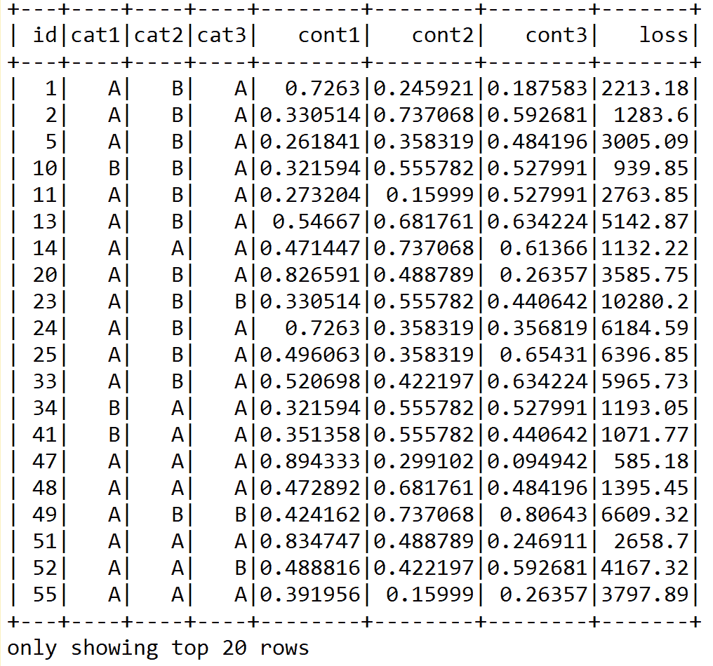

然而，如果您使用`df.show()`查看所有的行，您将会看到一些包含太多类别的分类列。更具体地说，类别列`cat109`到`cat116`包含太多类别，如下所示:

```scala
df.select("cat109", "cat110", "cat112", "cat113", "cat116").show() 
>>> 
```

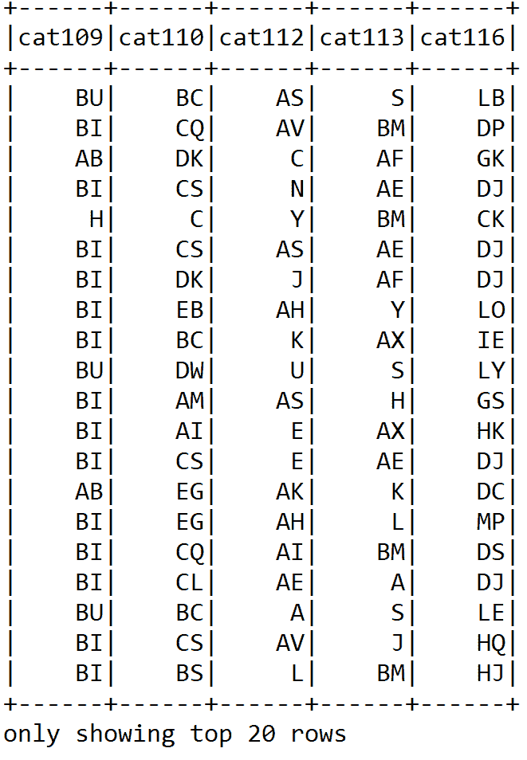

在后面的阶段，删除这些列以消除数据集中的偏斜是值得的。需要注意的是，在统计学中，偏斜度是实值随机变量的概率分布相对于平均值的不对称性的度量。

现在我们已经看到了数据集的快照，值得使用 Spark SQL 查看一些其他统计数据，如平均索赔或损失、最小、最大损失等等。但在此之前，让我们将最后一列从`loss`重命名为`label`，因为 ML 模型会抱怨它。即使在回归模型上使用了`setLabelCol`之后，它仍然会查找名为`label`的列。这导致一个令人厌恶的错误，显示`org.apache.spark.sql.AnalysisException: cannot resolve 'label' given input columns`:

```scala
val newDF = df.withColumnRenamed("loss", "label") 
```

现在，由于我们想要执行一个 SQL 查询，我们需要创建一个临时视图，以便可以在内存中执行操作:

```scala
newDF.createOrReplaceTempView("insurance") 
```

现在让我们平均一下客户索赔的损失:

```scala
spark.sql("SELECT avg(insurance.label) as AVG_LOSS FROM insurance").show()
>>>
+------------------+
| AVG_LOSS |
+------------------+
|3037.3376856699924|
+------------------+
```

同样，让我们看看目前为止最低的索赔:

```scala
spark.sql("SELECT min(insurance.label) as MIN_LOSS FROM insurance").show() 
>>>  
+--------+
|MIN_LOSS|
+--------+
| 0.67|
+--------+
```

让我们看看目前为止最高的索赔:

```scala
spark.sql("SELECT max(insurance.label) as MAX_LOSS FROM insurance").show() 
>>> 
+---------+
| MAX_LOSS|
+---------+
|121012.25|
+---------+
```

由于 Scala 或 Java 没有一个方便的可视化库，我不能做别的，但现在让我们在准备训练集之前，先关注数据预处理。


# 数据预处理

既然我们已经查看了一些数据属性，接下来的任务就是在获取训练集之前做一些预处理，比如清理。对于该零件，使用`Preprocessing.scala`文件。对于这一部分，需要以下导入:

```scala
import org.apache.spark.ml.feature.{ StringIndexer, StringIndexerModel}
import org.apache.spark.ml.feature.VectorAssembler
```

然后，我们加载训练集和测试集，如以下代码所示:

```scala
var trainSample = 1.0 
var testSample = 1.0 
val train = "data/insurance_train.csv" 
val test = "data/insurance_test.csv" 
val spark = SparkSessionCreate.createSession() 
import spark.implicits._ 
println("Reading data from " + train + " file") 

 val trainInput = spark.read 
        .option("header", "true") 
        .option("inferSchema", "true") 
        .format("com.databricks.spark.csv") 
        .load(train) 
        .cache 

    val testInput = spark.read 
        .option("header", "true") 
        .option("inferSchema", "true") 
        .format("com.databricks.spark.csv") 
        .load(test) 
        .cache 
```

下一个任务是为我们要学习的 ML 模型准备训练和测试集。在训练数据集的前面的数据帧中，我们将`loss`重命名为`label`。然后将`train.csv`的内容拆分成训练和(交叉)验证数据，分别为 75%和 25%。

`test.csv`的内容用于评估 ML 模型。还对两个原始数据帧进行采样，这对于在本地机器上运行快速执行特别有用:

```scala
println("Preparing data for training model") 
var data = trainInput.withColumnRenamed("loss", "label").sample(false, trainSample) 
```

我们还应该进行空值检查。这里，我使用了一种简单的方法。事实是，如果训练数据帧包含任何空值，我们就完全删除这些行。这是有道理的，因为 188，318 行中的几行没有什么害处。但是，可以随意采用另一种方法，如空值插补:

```scala
var DF = data.na.drop() 
if (data == DF) 
  println("No null values in the DataFrame")     
else{ 
  println("Null values exist in the DataFrame") 
  data = DF 
} 
val seed = 12345L 
val splits = data.randomSplit(Array(0.75, 0.25), seed) 
val (trainingData, validationData) = (splits(0), splits(1)) 
```

然后，我们缓存这两个集合以实现更快的内存访问:

```scala
trainingData.cache 
validationData.cache 
```

此外，我们应该对评估步骤中需要的测试集进行采样:

```scala
val testData = testInput.sample(false, testSample).cache 
```

由于训练集包含数值和分类值，我们需要分别识别和处理它们。首先，让我们只确定分类列:

```scala
def isCateg(c: String): Boolean = c.startsWith("cat") 
def categNewCol(c: String): String = if (isCateg(c)) s"idx_${c}" else c 
```

然后，使用下面的方法来删除包含太多类别的分类列，这一点我们已经在上一节中讨论过了:

```scala
def removeTooManyCategs(c: String): Boolean = !(c matches "cat(109$|110$|112$|113$|116$)")
```

现在，下面的方法仅用于选择特性列。因此，本质上，我们应该删除 ID(因为 ID 只是客户端的标识号，它不携带任何重要的信息)和标签列:

```scala
def onlyFeatureCols(c: String): Boolean = !(c matches "id|label") 
```

到目前为止，我们已经处理了一些无关紧要或者根本不需要的坏列。现在，下一个任务是构建最终的特性列集:

```scala
val featureCols = trainingData.columns 
    .filter(removeTooManyCategs) 
    .filter(onlyFeatureCols) 
    .map(categNewCol) 
```

`StringIndexer` encodes a given string column of labels to a column of label indices. If the input column is numeric in nature, we cast it to string using the `StringIndexer` and index the string values. When downstream pipeline components such as Estimator or Transformer make use of this string-indexed label, you must set the input column of the component to this string-indexed column name. In many cases, you can set the input column with `setInputCol`.

现在我们需要对分类列使用`StringIndexer()`:

```scala
val stringIndexerStages = trainingData.columns.filter(isCateg) 
      .map(c => new StringIndexer() 
      .setInputCol(c) 
      .setOutputCol(categNewCol(c)) 
      .fit(trainInput.select(c).union(testInput.select(c)))) 
```

请注意，这不是一个有效的方法。另一种方法是使用 OneHotEncoder 估计器。

OneHotEncoder 将一列标签索引映射到一列二进制向量，最多只有一个值。这种编码允许期望连续特征的算法(如逻辑回归)利用分类特征。

现在让我们使用`VectorAssembler()`将一个给定的列列表转换成一个向量列:

```scala
val assembler = new VectorAssembler() 
    .setInputCols(featureCols) 
    .setOutputCol("features")
```

`VectorAssembler` is a transformer. It combines a given list of columns into a single vector column. It is useful for combining the raw features and features generated by different feature transformers into one feature vector, in order to train ML models such as logistic regression and decision trees.

在我们开始训练回归模型之前，这就是我们所需要的。首先，我们开始训练 LR 模型并评估性能。


# LR 用于预测保险索赔的严重程度

正如您已经看到的，要预测的损失包含连续值，也就是说，这将是一个回归任务。因此，在这里使用回归分析时，目标是预测一个连续的目标变量，而另一个称为分类的领域是从有限的集合中预测一个标签。

**Logistic 回归** ( **LR** )属于回归算法家族。回归的目标是找到变量之间的关系和依赖关系。它使用线性函数对连续标量因变量 *y* (即标签或目标)和一个或多个(D 维向量)解释变量(自变量、输入变量、特征、观察数据、观察值、属性、维度和数据点)之间的关系进行建模，表示为 *x* :

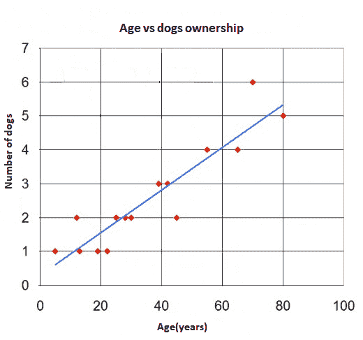

图 9:回归图分隔数据点(红点),蓝线代表回归

LR 对因变量 *y，*之间的关系进行建模，这涉及到相互依赖的变量*x[I]的线性组合。字母 *A* 和 *B* 分别代表描述 *y* 轴截距和直线斜率的常数；*

*y = A+Bx*

*图 9* ，*回归图将数据点(红点)分开，蓝线表示回归*显示了一个简单 LR 的例子，其中有一个独立变量，即一组数据点和一条**最佳拟合**线，这是回归分析本身的结果。可以观察到，这条线实际上并不通过所有的点。

任何数据点(测量的)和直线(预测的)之间的距离称为回归误差。误差越小，预测未知值的结果越准确。当误差降低到可能的最小水平时，为最终回归误差创建最佳拟合线。注意，在回归误差方面没有单一的度量标准；有如下几种:

*   **均方误差** ( **MSE** ):这是一个拟合线与数据点接近程度的度量。MSE 越小，拟合越接近数据。
*   **均方根误差** ( **RMSE** ):它是 MSE 的平方根，但可能是最容易解释的统计数据，因为它与纵轴上绘制的量具有相同的单位。
*   **R 平方** : R 平方是数据与拟合回归线接近程度的统计度量。r 平方始终介于 0 和 100%之间。R 平方越高，模型就越符合您的数据。
*   **平均绝对误差** ( **MAE** ): MAE 测量一组预测中误差的平均大小，不考虑它们的方向。它是预测和实际观察之间的绝对差异的测试样本的平均值，其中所有个体差异都具有相同的权重。
*   **解释方差** : 在统计学中，**解释方差**衡量的是一个数学模型占给定数据集变化的比例。


# 利用 LR 建立保险理赔预测模型

在这一小节中，我们将开发一个预测分析模型，根据客户的严重程度索赔来预测意外损失。我们从导入所需的库开始:

```scala
import org.apache.spark.ml.regression.{LinearRegression, LinearRegressionModel} 
import org.apache.spark.ml.{ Pipeline, PipelineModel } 
import org.apache.spark.ml.evaluation.RegressionEvaluator 
import org.apache.spark.ml.tuning.ParamGridBuilder 
import org.apache.spark.ml.tuning.CrossValidator 
import org.apache.spark.sql._ 
import org.apache.spark.sql.functions._ 
import org.apache.spark.mllib.evaluation.RegressionMetrics 
```

然后，我们创建一个活动的 Spark 会话作为应用程序的入口点。此外，隐式转换需要导入`implicits__`，比如将 rdd 转换为 DataFrames。

```scala
val spark = SparkSessionCreate.createSession() 
import spark.implicits._ 
```

然后，我们定义一些超参数，如交叉验证的折叠次数、最大迭代次数、回归参数值、容差值和弹性网络参数，如下所示:

```scala
val numFolds = 10 
val MaxIter: Seq[Int] = Seq(1000) 
val RegParam: Seq[Double] = Seq(0.001) 
val Tol: Seq[Double] = Seq(1e-6) 
val ElasticNetParam: Seq[Double] = Seq(0.001) 
```

现在我们创建一个 LR 估计器:

```scala
val model = new LinearRegression()
        .setFeaturesCol("features")
        .setLabelCol("label") 
```

现在，让我们通过链接转换器和 LR 估计器来构建流水线估计器:

```scala
println("Building ML pipeline") 
val pipeline = new Pipeline()
         .setStages((Preproessing.stringIndexerStages  
         :+ Preproessing.assembler) :+ model)
```

Spark ML 管道包含以下组件:

*   **DataFrame** :用作存储所有原始数据和中间结果的中央数据存储器。

*   **转换器**:转换器通过添加额外的特性列将一个数据帧转换成另一个数据帧。变压器是无状态的，这意味着它们没有任何内存，每次使用时的行为完全相同。

*   估计器:估计器是某种 ML 模型。与转换器相反，估计器包含内部状态表示，并且高度依赖于它已经看到的数据的历史。

*   **Pipeline** :将前面的组件、数据帧、转换器和估计器链接在一起。

*   **参数** : ML 算法有很多旋钮可以调整。这些被称为**超参数**，由 ML 算法学习以拟合数据的值被称为**参数**。

在我们开始执行交叉验证之前，我们需要一个 paramgrid。因此，让我们通过指定最大迭代次数、回归参数值、容差值和弹性网络参数来开始创建 paramgrid，如下所示:

```scala
val paramGrid = new ParamGridBuilder() 
      .addGrid(model.maxIter, MaxIter) 
      .addGrid(model.regParam, RegParam) 
      .addGrid(model.tol, Tol) 
      .addGrid(model.elasticNetParam, ElasticNetParam) 
      .build() 
```

现在，为了获得更好、更稳定的性能，让我们准备 K 倍交叉验证和网格搜索，作为模型调整的一部分。正如你可能猜到的，我将执行 10 重交叉验证。根据您的设置和数据集随意调整折叠次数:

```scala
println("Preparing K-fold Cross Validation and Grid Search: Model tuning") 
val cv = new CrossValidator() 
      .setEstimator(pipeline) 
      .setEvaluator(new RegressionEvaluator) 
      .setEstimatorParamMaps(paramGrid) 
      .setNumFolds(numFolds) 
```

太棒了——我们创造了交叉验证估计量。现在是时候训练 LR 模型了:

```scala
println("Training model with Linear Regression algorithm") 
val cvModel = cv.fit(Preproessing.trainingData) 
```

现在我们有了合适的模型，这意味着它现在能够做出预测。因此，让我们开始在训练集和验证集上评估模型，并计算 RMSE、MSE、MAE、R 平方等等:

```scala
println("Evaluating model on train and validation set and calculating RMSE") 
val trainPredictionsAndLabels = cvModel.transform(Preproessing.trainingData)
                .select("label", "prediction")
                .map { case Row(label: Double, prediction: Double) 
                => (label, prediction) }.rdd 

val validPredictionsAndLabels = cvModel.transform(Preproessing.validationData)
                                .select("label", "prediction")
                                .map { case Row(label: Double, prediction: Double) 
                                => (label, prediction) }.rdd 

val trainRegressionMetrics = new RegressionMetrics(trainPredictionsAndLabels) 
val validRegressionMetrics = new RegressionMetrics(validPredictionsAndLabels) 
```

太好了！我们已经在训练和测试集上计算出了原始预测。让我们寻找最佳模型:

```scala
val bestModel = cvModel.bestModel.asInstanceOf[PipelineModel] 
```

一旦我们有了最佳拟合和交叉验证的模型，我们可以期待良好的预测准确性。现在，让我们观察训练和验证集的结果:

```scala
val results = "n=====================================================================n" + s"Param trainSample: ${Preproessing.trainSample}n" + 
      s"Param testSample: ${Preproessing.testSample}n" + 
      s"TrainingData count: ${Preproessing.trainingData.count}n" + 
      s"ValidationData count: ${Preproessing.validationData.count}n" + 
      s"TestData count: ${Preproessing.testData.count}n" +      "=====================================================================n" +   s"Param maxIter = ${MaxIter.mkString(",")}n" + 
      s"Param numFolds = ${numFolds}n" +      "=====================================================================n" +   s"Training data MSE = ${trainRegressionMetrics.meanSquaredError}n" + 
      s"Training data RMSE = ${trainRegressionMetrics.rootMeanSquaredError}n" + 
      s"Training data R-squared = ${trainRegressionMetrics.r2}n" + 
      s"Training data MAE = ${trainRegressionMetrics.meanAbsoluteError}n" + 
      s"Training data Explained variance = ${trainRegressionMetrics.explainedVariance}n" +      "=====================================================================n" +   s"Validation data MSE = ${validRegressionMetrics.meanSquaredError}n" + 
      s"Validation data RMSE = ${validRegressionMetrics.rootMeanSquaredError}n" + 
      s"Validation data R-squared = ${validRegressionMetrics.r2}n" + 
      s"Validation data MAE = ${validRegressionMetrics.meanAbsoluteError}n" + 
      s"Validation data Explained variance = ${validRegressionMetrics.explainedVariance}n" + 
      s"CV params explained: ${cvModel.explainParams}n" + 
      s"LR params explained: ${bestModel.stages.last.asInstanceOf[LinearRegressionModel].explainParams}n" +      "=====================================================================n" 
```

现在，我们将前面的结果打印如下:

```scala
println(results)
>>> 
Building Machine Learning pipeline 
Reading data from data/insurance_train.csv file 
Null values exist in the DataFrame 
Training model with Linear Regression algorithm
===================================================================== 
Param trainSample: 1.0 
Param testSample: 1.0 
TrainingData count: 141194 
ValidationData count: 47124 
TestData count: 125546 
===================================================================== 
Param maxIter = 1000 
Param numFolds = 10 
===================================================================== 
Training data MSE = 4460667.3666198505 
Training data RMSE = 2112.0292059107164 
Training data R-squared = -0.1514435541595276 
Training data MAE = 1356.9375609756164 
Training data Explained variance = 8336528.638733305 
===================================================================== 
Validation data MSE = 4839128.978963534 
Validation data RMSE = 2199.802031766389 
Validation data R-squared = -0.24922962724089603 
Validation data MAE = 1356.419484419514 
Validation data Explained variance = 8724661.329105612 
CV params explained: estimator: estimator for selection (current: pipeline_d5024480c670) 
estimatorParamMaps: param maps for the estimator (current: [Lorg.apache.spark.ml.param.ParamMap;@2f0c9855) 
evaluator: evaluator used to select hyper-parameters that maximize the validated metric (current: regEval_00c707fcaa06) 
numFolds: number of folds for cross validation (>= 2) (default: 3, current: 10) 
seed: random seed (default: -1191137437) 
LR params explained: aggregationDepth: suggested depth for treeAggregate (>= 2) (default: 2) 
elasticNetParam: the ElasticNet mixing parameter, in range [0, 1]. For alpha = 0, the penalty is an L2 penalty. For alpha = 1, it is an L1 penalty (default: 0.0, current: 0.001) 
featuresCol: features column name (default: features, current: features) 
fitIntercept: whether to fit an intercept term (default: true) 
labelCol: label column name (default: label, current: label) 
maxIter: maximum number of iterations (>= 0) (default: 100, current: 1000) 
predictionCol: prediction column name (default: prediction) 
regParam: regularization parameter (>= 0) (default: 0.0, current: 0.001) 
solver: the solver algorithm for optimization. If this is not set or empty, default value is 'auto' (default: auto) 
standardization: whether to standardize the training features before fitting the model (default: true) 
tol: the convergence tolerance for iterative algorithms (>= 0) (default: 1.0E-6, current: 1.0E-6) 
weightCol: weight column name. If this is not set or empty, we treat all instance weights as 1.0 (undefined) 
===================================================================== 
```

因此，我们的预测模型显示训练集和测试集的 MAE 都大约为`1356.419484419514`。然而，在 Kaggle 公共和私人排行榜上，MAE 要低得多(转到:[https://www . ka ggle . com/c/allstate-claims-severity/leader board](https://www.kaggle.com/c/allstate-claims-severity/leaderboard))，MAE 分别为 1096.92532 和 1109.70772。

等等！我们还没完。我们仍然需要对测试集进行预测:

```scala
println("Run prediction on the test set") 
cvModel.transform(Preproessing.testData) 
      .select("id", "prediction") 
      .withColumnRenamed("prediction", "loss") 
      .coalesce(1) // to get all the predictions in a single csv file 
      .write.format("com.databricks.spark.csv")
      .option("header", "true") 
      .save("output/result_LR.csv")
```

前面的代码应该生成一个名为`result_LR.csv`的 CSV 文件。如果我们打开文件，我们应该观察每个 ID 的损失，即索赔。我们将在本章末尾看到左声道、右声道和 GBT 的内容。然而，通过调用`spark.stop()`方法来停止 Spark 会话总是一个好主意。

集成方法是一种学习算法，它创建一个由一组其他基础模型组成的模型。Spark ML 支持两种主要的集成算法，称为 GBT 和基于决策树的随机森林。我们现在将看看我们是否能通过使用 GBT 显著降低 MAE 误差来提高预测精度。


# 预测保险索赔严重程度的 GBT 回归量

为了最小化一个`loss`函数，**梯度提升树** ( **GBTs** )迭代训练多个决策树。在每次迭代中，该算法使用当前集合来预测每个训练实例的标签。

然后将原始预测与真实标签进行比较。因此，在下一次迭代中，如果数据集被重新标记以更加强调具有较差预测的训练实例，决策树将有助于纠正先前的错误。

既然我们在讨论回归，那么讨论 GBTs 的回归强度及其损失计算将更有意义。假设我们有以下设置:

*   *N 个*数据实例
*   *y[I]=实例 *i* 的标签*
*   *x[I]=实例 *i* 的特征*

那么 *F(x [i] )* 函数就是模型的预测标签；例如，它试图最小化误差，即损失:

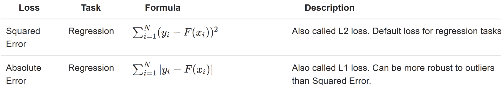

现在，与决策树类似，GBTs 也:

*   处理分类特征(当然还有数字特征)
*   扩展到多类分类设置
*   执行二元分类和回归(尚不支持多类分类)
*   不需要特征缩放
*   捕捉非线性和特征交互，这在 LR 中是非常缺乏的，例如线性模型

**Validation while training**: Gradient boosting can overfit, especially when you have trained your model with more trees. In order to prevent this issue, it is useful to validate while carrying out the training.

因为我们已经准备好了数据集，所以我们可以直接开始实现一个基于 GBT 的预测模型来预测保险严重程度索赔。让我们从导入必要的包和库开始:

```scala
import org.apache.spark.ml.regression.{GBTRegressor, GBTRegressionModel} 
import org.apache.spark.ml.{Pipeline, PipelineModel} 
import org.apache.spark.ml.evaluation.RegressionEvaluator 
import org.apache.spark.ml.tuning.ParamGridBuilder 
import org.apache.spark.ml.tuning.CrossValidator 
import org.apache.spark.sql._ 
import org.apache.spark.sql.functions._ 
import org.apache.spark.mllib.evaluation.RegressionMetrics 
```

现在，让我们定义并初始化训练 gbt 所需的超参数，例如树的数量、最大箱的数量、交叉验证期间要使用的折叠数量、迭代训练的最大迭代次数，以及最后的最大树深度:

```scala
val NumTrees = Seq(5, 10, 15) 
val MaxBins = Seq(5, 7, 9) 
val numFolds = 10 
val MaxIter: Seq[Int] = Seq(10) 
val MaxDepth: Seq[Int] = Seq(10) 
```

然后，我们再次实例化一个 Spark 会话，隐含如下:

```scala
val spark = SparkSessionCreate.createSession() 
import spark.implicits._ 
```

既然我们关心一个估计量算法，那就是 GBT:

```scala
val model = new GBTRegressor()
                .setFeaturesCol("features")
                .setLabelCol("label") 
```

现在，我们通过将转换和预测器链接在一起来构建管道，如下所示:

```scala
val pipeline = new Pipeline().setStages((Preproessing.stringIndexerStages :+ Preproessing.assembler) :+ model) 
```

在我们开始执行交叉验证之前，我们需要一个 paramgrid。因此，让我们通过指定最大迭代次数、最大树深度和最大箱数开始创建 paramgrid，如下所示:

```scala
val paramGrid = new ParamGridBuilder() 
      .addGrid(model.maxIter, MaxIter) 
      .addGrid(model.maxDepth, MaxDepth) 
      .addGrid(model.maxBins, MaxBins) 
      .build() 
```

现在，为了获得更好、更稳定的性能，让我们准备 K 倍交叉验证和网格搜索，作为模型调整的一部分。如你所料，我将进行 10 次交叉验证。根据您的设置和数据集，随意调整折叠次数:

```scala
println("Preparing K-fold Cross Validation and Grid Search") 
val cv = new CrossValidator() 
      .setEstimator(pipeline) 
      .setEvaluator(new RegressionEvaluator) 
      .setEstimatorParamMaps(paramGrid) 
      .setNumFolds(numFolds) 
```

太棒了，我们创造了交叉验证估计量。现在是时候训练 GBT 模式了:

```scala
println("Training model with GradientBoostedTrees algorithm ") 
val cvModel = cv.fit(Preproessing.trainingData) 
```

现在我们有了合适的模型，这意味着它现在能够做出预测。因此，让我们开始评估训练集和验证集上的模型，并计算 RMSE、MSE、MAE、R 平方等:

```scala
println("Evaluating model on train and test data and calculating RMSE") 
val trainPredictionsAndLabels = cvModel.transform(Preproessing.trainingData).select("label", "prediction").map { case Row(label: Double, prediction: Double) => (label, prediction) }.rdd 

val validPredictionsAndLabels = cvModel.transform(Preproessing.validationData).select("label", "prediction").map { case Row(label: Double, prediction: Double) => (label, prediction) }.rdd 

val trainRegressionMetrics = new RegressionMetrics(trainPredictionsAndLabels) 
val validRegressionMetrics = new RegressionMetrics(validPredictionsAndLabels) 
```

太好了！我们已经在训练和测试集上计算出了原始预测。让我们寻找最佳模型:

```scala
val bestModel = cvModel.bestModel.asInstanceOf[PipelineModel] 
```

如前所述，通过使用 GBT，可以测量特征的重要性，以便在稍后阶段，我们可以决定哪些特征将被使用，哪些特征将从数据帧中删除。让我们找出我们之前刚刚创建的最佳模型的特征重要性，对于所有特征按升序排列如下:

```scala
val featureImportances = bestModel.stages.last.asInstanceOf[GBTRegressionModel].featureImportances.toArray 
val FI_to_List_sorted = featureImportances.toList.sorted.toArray  
```

一旦我们有了最佳拟合和交叉验证的模型，我们可以期待良好的预测准确性。现在，让我们观察训练和验证集的结果:

```scala
val output = "n=====================================================================n" + s"Param trainSample: ${Preproessing.trainSample}n" + 
      s"Param testSample: ${Preproessing.testSample}n" + 
      s"TrainingData count: ${Preproessing.trainingData.count}n" + 
      s"ValidationData count: ${Preproessing.validationData.count}n" + 
      s"TestData count: ${Preproessing.testData.count}n" +      "=====================================================================n" +   s"Param maxIter = ${MaxIter.mkString(",")}n" + 
      s"Param maxDepth = ${MaxDepth.mkString(",")}n" + 
      s"Param numFolds = ${numFolds}n" +      "=====================================================================n" +   s"Training data MSE = ${trainRegressionMetrics.meanSquaredError}n" + 
      s"Training data RMSE = ${trainRegressionMetrics.rootMeanSquaredError}n" + 
      s"Training data R-squared = ${trainRegressionMetrics.r2}n" + 
      s"Training data MAE = ${trainRegressionMetrics.meanAbsoluteError}n" + 
      s"Training data Explained variance = ${trainRegressionMetrics.explainedVariance}n" +      "=====================================================================n" +    s"Validation data MSE = ${validRegressionMetrics.meanSquaredError}n" + 
      s"Validation data RMSE = ${validRegressionMetrics.rootMeanSquaredError}n" + 
      s"Validation data R-squared = ${validRegressionMetrics.r2}n" + 
      s"Validation data MAE = ${validRegressionMetrics.meanAbsoluteError}n" + 
      s"Validation data Explained variance = ${validRegressionMetrics.explainedVariance}n" +      "=====================================================================n" +   s"CV params explained: ${cvModel.explainParams}n" + 
      s"GBT params explained: ${bestModel.stages.last.asInstanceOf[GBTRegressionModel].explainParams}n" + s"GBT features importances:n ${Preproessing.featureCols.zip(FI_to_List_sorted).map(t => s"t${t._1} = ${t._2}").mkString("n")}n" +      "=====================================================================n" 
```

现在，我们将前面的结果打印如下:

```scala
println(results)
 >>> 
===================================================================== 
Param trainSample: 1.0 
Param testSample: 1.0 
TrainingData count: 141194 
ValidationData count: 47124 
TestData count: 125546 
===================================================================== 
Param maxIter = 10 
Param maxDepth = 10 
Param numFolds = 10 
===================================================================== 
Training data MSE = 2711134.460296872 
Training data RMSE = 1646.5522950385973 
Training data R-squared = 0.4979619968485668 
Training data MAE = 1126.582534126603 
Training data Explained variance = 8336528.638733303 
===================================================================== 
Validation data MSE = 4796065.983773314 
Validation data RMSE = 2189.9922337244293 
Validation data R-squared = 0.13708582379658474 
Validation data MAE = 1289.9808960385383 
Validation data Explained variance = 8724866.468978886 
===================================================================== 
CV params explained: estimator: estimator for selection (current: pipeline_9889176c6eda) 
estimatorParamMaps: param maps for the estimator (current: [Lorg.apache.spark.ml.param.ParamMap;@87dc030) 
evaluator: evaluator used to select hyper-parameters that maximize the validated metric (current: regEval_ceb3437b3ac7) 
numFolds: number of folds for cross validation (>= 2) (default: 3, current: 10) 
seed: random seed (default: -1191137437) 
GBT params explained: cacheNodeIds: If false, the algorithm will pass trees to executors to match instances with nodes. If true, the algorithm will cache node IDs for each instance. Caching can speed up training of deeper trees. (default: false) 
checkpointInterval: set checkpoint interval (>= 1) or disable checkpoint (-1). E.g. 10 means that the cache will get checkpointed every 10 iterations (default: 10) 
featuresCol: features column name (default: features, current: features) 
impurity: Criterion used for information gain calculation (case-insensitive). Supported options: variance (default: variance) 
labelCol: label column name (default: label, current: label) 
lossType: Loss function which GBT tries to minimize (case-insensitive). Supported options: squared, absolute (default: squared) 
maxBins: Max number of bins for discretizing continuous features. Must be >=2 and >= number of categories for any categorical feature. (default: 32) 
maxDepth: Maximum depth of the tree. (>= 0) E.g., depth 0 means 1 leaf node; depth 1 means 1 internal node + 2 leaf nodes. (default: 5, current: 10) 
maxIter: maximum number of iterations (>= 0) (default: 20, current: 10) 
maxMemoryInMB: Maximum memory in MB allocated to histogram aggregation. (default: 256) 
minInfoGain: Minimum information gain for a split to be considered at a tree node. (default: 0.0) 
minInstancesPerNode: Minimum number of instances each child must have after split. If a split causes the left or right child to have fewer than minInstancesPerNode, the split will be discarded as invalid. Should be >= 1\. (default: 1) 
predictionCol: prediction column name (default: prediction) 
seed: random seed (default: -131597770) 
stepSize: Step size (a.k.a. learning rate) in interval (0, 1] for shrinking the contribution of each estimator. (default: 0.1) 
subsamplingRate: Fraction of the training data used for learning each decision tree, in range (0, 1]. (default: 1.0) 
GBT features importance: 
   idx_cat1 = 0.0 
   idx_cat2 = 0.0 
   idx_cat3 = 0.0 
   idx_cat4 = 3.167169394850417E-5 
   idx_cat5 = 4.745749854188828E-5 
... 
   idx_cat111 = 0.018960701085054904 
   idx_cat114 = 0.020609596772820878 
   idx_cat115 = 0.02281267960792931 
   cont1 = 0.023943087007850663 
   cont2 = 0.028078353534251005 
   ... 
   cont13 = 0.06921704925937068 
   cont14 = 0.07609111789104464 
===================================================================== 
```

因此，我们的预测模型显示，训练集和测试集的 MAE 分别约为`1126.582534126603`和`1289.9808960385383`。最后一个结果对于理解特性的重要性很重要(前面的列表是为了节省空间而删减的，但是您应该会看到完整的列表)。特别是，我们可以看到前三个特征根本不重要，因此我们可以放心地将它们从数据帧中删除。我们将在下一节提供更多的见解。

最后，让我们对测试集进行预测，并为客户的每项索赔生成预测损失:

```scala
println("Run prediction over test dataset") 
cvModel.transform(Preproessing.testData) 
      .select("id", "prediction") 
      .withColumnRenamed("prediction", "loss") 
      .coalesce(1) 
      .write.format("com.databricks.spark.csv") 
      .option("header", "true") 
      .save("output/result_GBT.csv") 
```

前面的代码应该生成一个名为`result_GBT.csv`的 CSV 文件。如果我们打开文件，我们应该观察每个 ID 的损失，即索赔。我们将在本章末尾看到左声道、右声道和 GBT 的内容。然而，通过调用`spark.stop()`方法来停止 Spark 会话总是一个好主意。


# 使用随机森林回归器提高性能

在前面的章节中，我们没有经历预期的 MAE 值，尽管我们预测了每种情况下的严重程度损失。在本节中，我们将开发一个更强大的预测分析模型用于相同的目的，但使用随机森林回归。然而，在深入研究它的正式实现之前，需要对随机森林算法做一个简短的概述。


# 用于分类和回归的随机森林

随机森林是一种用于解决监督学习任务(如分类和回归)的集成学习技术。随机森林的一个有利特征是，它可以克服其训练数据集的过拟合问题。随机森林中的一个森林通常由几十万棵树组成。这些树实际上是在同一个训练集的不同部分进行训练的。

更专业地说，一棵长得很深的树倾向于从高度不可预测的模式中学习。这在训练集上产生了过度拟合的问题。此外，低偏差会使分类器表现不佳，即使数据集质量在所呈现的特征方面很好。另一方面，随机森林有助于对多个决策树进行平均，目的是通过计算事例对之间的近似度来减少方差以确保一致性。

**GBT** or **Random Forest**? Although both GBT and Random Forest are ensembles of trees, the training processes are different. There are several practical trade-offs that exist, which often poses the dilemma of which one to choose. However, Random Forest would be the winner in most cases. Here are some justifications:

*   gbt 一次训练一棵树，但是随机森林可以并行训练多棵树。所以射频的训练时间更短。然而，在某些特殊情况下，使用 GBTs 训练和使用少量的树会更容易和更快。
*   在大多数情况下，RF 不太容易过度拟合，因此它降低了过度拟合的可能性。换句话说，随机森林减少了更多树的方差，但是 gbt 减少了更多树的偏差。
*   最后，随机森林更容易调整，因为性能随着树的数量单调提高，但是随着树的数量增加，GBT 的性能很差。

然而，这略微增加了偏差，并使解释结果变得更加困难。但最终，最终模型的性能会显著提高。使用随机森林作为分类器时，有一些参数设置:

*   如果树的数量是 1，那么根本不使用自举；但是，如果树的数量> 1，则需要自举。支持的值有`auto`、`all`、`sqrt`、`log2`、`onethird`。
*   支持的数值有*(0.0-1.0)**【1-n】*。但是，如果选择`featureSubsetStrategy`作为`auto`，算法会自动选择最佳特征子集策略。
*   如果是`numTrees == 1`，则`featureSubsetStrategy`被设置为`all`。但如果是`numTrees > 1`(即森林)，则`featureSubsetStrategy`设置为`sqrt`进行分类。
*   此外，如果在 *(0，1.0)* 的范围内设置真实值`n`，将使用`n*number_of_features`。但是，如果设置的整数值`n`在范围(1，特征数)内，则只交替使用`n`特征。
*   参数`categoricalFeaturesInfo`是用于存储任意或分类特征的映射。条目 *(n - > k)* 指示特征`n`是分类的，具有从 *0: (0，1，...，k-1)* 。
*   杂质标准用于信息增益计算。分类和回归支持的值分别为`gini`和`variance`。
*   `maxDepth`是树的最大深度(例如，深度 0 表示一个叶节点，深度 1 表示一个内部节点加上两个叶节点)。
*   `maxBins`表示用于分割要素的最大箱数，建议值为 100 以获得更好的结果。
*   最后，随机种子用于引导和选择特征子集，以避免结果的随机性。

如前所述，由于随机森林对于大规模数据集来说足够快速和可伸缩，Spark 是实现 RF 和实现这种大规模可伸缩性的合适技术。但是，如果计算邻近度，存储需求也会呈指数级增长。

好了，射频就讲到这里。现在是动手的时候了，让我们开始吧。我们从导入所需的库开始:

```scala
import org.apache.spark.ml.regression.{RandomForestRegressor, RandomForestRegressionModel} 
import org.apache.spark.ml.{ Pipeline, PipelineModel } 
import org.apache.spark.ml.evaluation.RegressionEvaluator 
import org.apache.spark.ml.tuning.ParamGridBuilder 
import org.apache.spark.ml.tuning.CrossValidator 
import org.apache.spark.sql._ 
import org.apache.spark.sql.functions._ 
import org.apache.spark.mllib.evaluation.RegressionMetrics 
```

然后，我们创建一个活动的 Spark 会话并导入隐含:

```scala
val spark = SparkSessionCreate.createSession() 
import spark.implicits._ 
```

然后，我们定义一些超参数，如交叉验证的折叠次数、最大迭代次数、回归参数值、容差值和弹性网络参数，如下所示:

```scala
val NumTrees = Seq(5,10,15)  
val MaxBins = Seq(23,27,30)  
val numFolds = 10  
val MaxIter: Seq[Int] = Seq(20) 
val MaxDepth: Seq[Int] = Seq(20) 
```

注意，对于基于决策树的随机森林，我们要求`maxBins`至少与每个分类特征中的值的数量一样大。在我们的数据集中，我们有 110 个具有 23 个不同值的分类特征。考虑到这一点，我们必须将`MaxBins`设置为至少 23。尽管如此，也可以随意使用前面的参数。好了，现在是时候创建一个 LR 估计器了:

```scala
val model = new RandomForestRegressor().setFeaturesCol("features").setLabelCol("label")
```

现在，让我们通过链接转换器和 LR 估计器来构建流水线估计器:

```scala
println("Building ML pipeline") 
val pipeline = new Pipeline().setStages((Preproessing.stringIndexerStages :+ Preproessing.assembler) :+ model) 
```

在我们开始执行交叉验证之前，我们需要一个 paramgrid。因此，让我们通过指定树的数量、最大树深度的数量和最大箱参数的数量来开始创建 paramgrid，如下所示:

```scala
val paramGrid = new ParamGridBuilder() 
      .addGrid(model.numTrees, NumTrees) 
      .addGrid(model.maxDepth, MaxDepth) 
      .addGrid(model.maxBins, MaxBins) 
      .build() 
```

现在，为了获得更好、更稳定的性能，让我们准备 K-fold 交叉验证和网格搜索，作为模型调优的一部分。正如你可能猜到的，我将执行 10 重交叉验证。根据您的设置和数据集随意调整折叠次数:

```scala
println("Preparing K-fold Cross Validation and Grid Search: Model tuning") 
val cv = new CrossValidator() 
      .setEstimator(pipeline) 
      .setEvaluator(new RegressionEvaluator) 
      .setEstimatorParamMaps(paramGrid) 
      .setNumFolds(numFolds) 
```

太棒了，我们创造了交叉验证估计量。现在是时候训练 LR 模型了:

```scala
println("Training model with Random Forest algorithm")  
val cvModel = cv.fit(Preproessing.trainingData) 
```

现在我们有了合适的模型，这意味着它现在能够做出预测。因此，让我们开始在训练集和验证集上评估模型，并计算 RMSE、MSE、MAE、R-squared 等等:

```scala
println("Evaluating model on train and validation set and calculating RMSE") 
val trainPredictionsAndLabels = cvModel.transform(Preproessing.trainingData).select("label", "prediction").map { case Row(label: Double, prediction: Double) => (label, prediction) }.rdd 

val validPredictionsAndLabels = cvModel.transform(Preproessing.validationData).select("label", "prediction").map { case Row(label: Double, prediction: Double) => (label, prediction) }.rdd 

val trainRegressionMetrics = new RegressionMetrics(trainPredictionsAndLabels) 
val validRegressionMetrics = new RegressionMetrics(validPredictionsAndLabels) 
```

太好了！我们已经在训练和测试集上计算出了原始预测。让我们寻找最佳模型:

```scala
val bestModel = cvModel.bestModel.asInstanceOf[PipelineModel]
```

如前所述，通过使用 RF，可以测量特征的重要性，以便在稍后的阶段，我们可以决定哪些特征应该被使用，哪些应该从数据帧中删除。让我们从刚刚为所有要素创建的最佳模型中按升序找出要素重要性，如下所示:

```scala
val featureImportances = bestModel.stages.last.asInstanceOf[RandomForestRegressionModel].featureImportances.toArray 
val FI_to_List_sorted = featureImportances.toList.sorted.toArray  
```

一旦我们有了最佳拟合和交叉验证的模型，我们可以期待一个良好的预测精度。现在，让我们观察训练和验证集的结果:

```scala
val output = "n=====================================================================n" + s"Param trainSample: ${Preproessing.trainSample}n" + 
      s"Param testSample: ${Preproessing.testSample}n" + 
      s"TrainingData count: ${Preproessing.trainingData.count}n" + 
      s"ValidationData count: ${Preproessing.validationData.count}n" + 
      s"TestData count: ${Preproessing.testData.count}n" +      "=====================================================================n" +   s"Param maxIter = ${MaxIter.mkString(",")}n" + 
      s"Param maxDepth = ${MaxDepth.mkString(",")}n" + 
      s"Param numFolds = ${numFolds}n" +      "=====================================================================n" +   s"Training data MSE = ${trainRegressionMetrics.meanSquaredError}n" + 
      s"Training data RMSE = ${trainRegressionMetrics.rootMeanSquaredError}n" + 
      s"Training data R-squared = ${trainRegressionMetrics.r2}n" + 
      s"Training data MAE = ${trainRegressionMetrics.meanAbsoluteError}n" + 
      s"Training data Explained variance = ${trainRegressionMetrics.explainedVariance}n" +      "=====================================================================n" +   s"Validation data MSE = ${validRegressionMetrics.meanSquaredError}n" + 
      s"Validation data RMSE = ${validRegressionMetrics.rootMeanSquaredError}n" + 
      s"Validation data R-squared = ${validRegressionMetrics.r2}n" + 
      s"Validation data MAE = ${validRegressionMetrics.meanAbsoluteError}n" + 
      s"Validation data Explained variance =
${validRegressionMetrics.explainedVariance}n" +      "=====================================================================n" +   s"CV params explained: ${cvModel.explainParams}n" + 
      s"RF params explained: ${bestModel.stages.last.asInstanceOf[RandomForestRegressionModel].explainParams}n" + 
      s"RF features importances:n ${Preproessing.featureCols.zip(FI_to_List_sorted).map(t => s"t${t._1} = ${t._2}").mkString("n")}n" +      "=====================================================================n" 
```

现在，我们将前面的结果打印如下:

```scala
println(results)
>>>Param trainSample: 1.0
 Param testSample: 1.0
 TrainingData count: 141194
 ValidationData count: 47124
 TestData count: 125546
 Param maxIter = 20
 Param maxDepth = 20
 Param numFolds = 10
 Training data MSE = 1340574.3409399686
 Training data RMSE = 1157.8317412042081
 Training data R-squared = 0.7642745310548124
 Training data MAE = 809.5917285994619
 Training data Explained variance = 8337897.224852404
 Validation data MSE = 4312608.024875177
 Validation data RMSE = 2076.6819749001475
 Validation data R-squared = 0.1369507149716651"
 Validation data MAE = 1273.0714382935894
 Validation data Explained variance = 8737233.110450774
```

因此，我们的预测模型显示，训练集和测试集的 MAE 分别约为`809.5917285994619`和`1273.0714382935894`。最后一个结果对于理解特性的重要性很重要(前面的列表是为了节省空间而删减的，但是您应该会看到完整的列表)。

我已经在 Python 中画出了分类特征和连续特征，以及它们各自的重要性，所以这里我不展示代码，只展示图表。让我们看看显示特征重要性的分类特征以及相应的特征号:

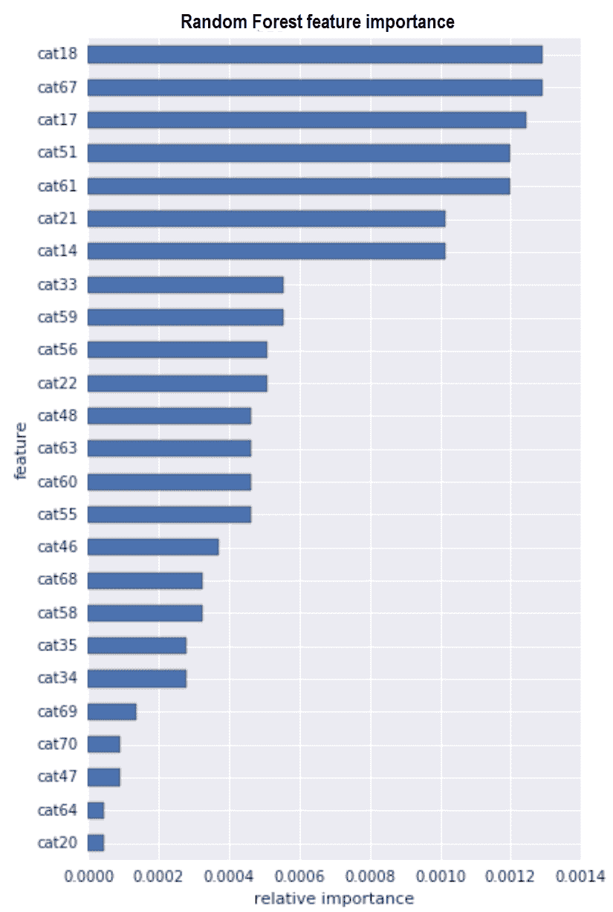

图 11:随机森林分类特征重要性

从上图可以清楚地看出，分类特征`cat20`、`cat64`、`cat47`和`cat69`不太重要。因此，删除这些功能并重新训练随机森林模型以观察更好的性能是有意义的。

现在让我们来看看连续特征是如何相互关联并对损失列有所贡献的。从下图可以看出，所有的连续特征都与亏损列正相关。这也表明，与我们在前图中看到的分类特征相比，这些连续特征并不那么重要:

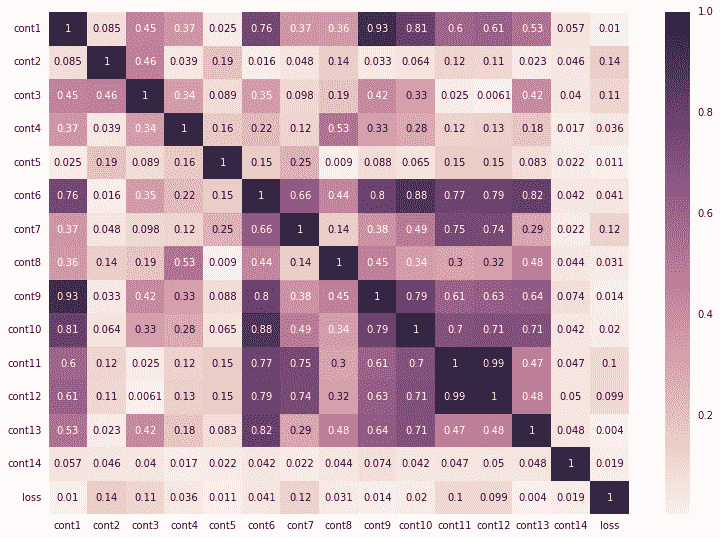

图 12:连续特征和标签之间的相关性

从这两个分析中我们可以了解到，我们可以天真地删除一些不重要的列，并训练随机森林模型，以观察训练集和验证集的 MAE 值是否有任何减少。最后，让我们对测试集做一个预测:

```scala
println("Run prediction on the test set") 
cvModel.transform(Preproessing.testData) 
      .select("id", "prediction") 
      .withColumnRenamed("prediction", "loss") 
      .coalesce(1) // to get all the predictions in a single csv file                 
      .write.format("com.databricks.spark.csv") 
      .option("header", "true") 
      .save("output/result_RF.csv") 
```

同样，与 LR 类似，您可以通过调用`stop()`方法来停止 Spark 会话。现在生成的`result_RF.csv`文件应该包含针对每个 ID 的损失，即索赔。


# 对比分析和模型部署

您已经看到，LR 模型对于小的训练数据集来说更容易训练。然而，与 GBT 和随机森林模型相比，我们还没有体验到更好的准确性。然而，LR 模型的简单性是一个非常好的起点。另一方面，我们已经说过，出于几个原因，兰登森林将会是 GBT 的赢家。让我们来看看表格中的结果:

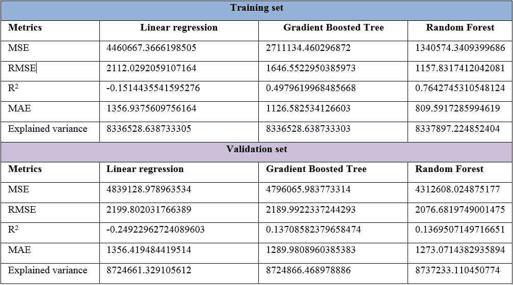

现在让我们看看每个模型对 20 起事故或损害索赔的预测结果如何:

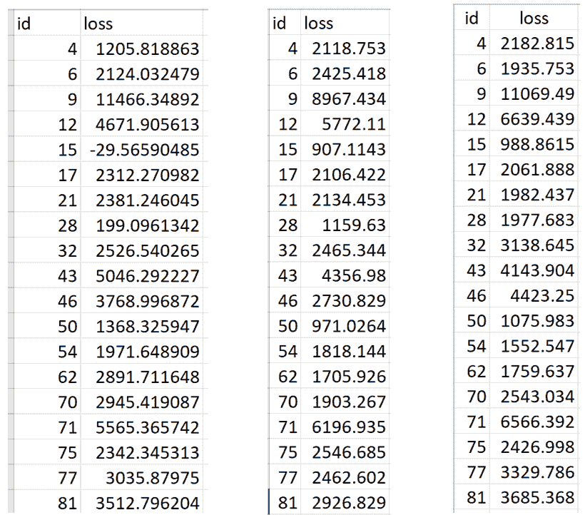

图 13:I)LR、ii) GBT 和 iii)随机森林模型的损失预测

因此，根据表 2，很明显，我们应该使用随机森林回归变量，不仅预测保险索赔损失，而且预测其产量。现在，我们将快速了解如何将我们的最佳模型，即随机森林回归器投入生产。这个想法是，作为一名数据科学家，您可能已经制作了一个 ML 模型，并将其交给您公司的一个工程团队，以便部署在一个生产就绪的环境中。

在这里，我提供了一个天真的方法，尽管 IT 公司必须有他们自己的方式来部署模型。尽管如此，在这个主题的结尾将有一个专门的部分。通过使用模型持久性 Spark 提供的保存和加载模型的能力，这种场景很容易成为现实。使用 Spark，您可以:

*   保存并加载单个模型
*   保存并加载完整的管道

单一模型非常简单，但效率较低，主要用于基于 Spark MLlib 的模型持久性。由于我们更感兴趣的是保存最佳模型，即随机森林回归器模型，首先我们将使用 Scala 拟合一个随机森林回归器，保存它，然后使用 Scala 加载回同一个模型:

```scala
// Estimator algorithm 
val model = new RandomForestRegressor() 
                    .setFeaturesCol("features") 
                    .setLabelCol("label") 
                    .setImpurity("gini") 
                    .setMaxBins(20) 
                    .setMaxDepth(20) 
                    .setNumTrees(50) 
fittedModel = rf.fit(trainingData) 
```

我们现在可以简单地调用`write.overwrite().save()`方法将这个模型保存到本地存储，HDFS 或 S3，并调用 load 方法将它加载回来以备将来使用:

```scala
fittedModel.write.overwrite().save("model/RF_model")  
val sameModel = CrossValidatorModel.load("model/RF_model") 
```

现在我们需要知道的是如何使用恢复的模型进行预测。答案如下:

```scala
sameModel.transform(Preproessing.testData) 
    .select("id", "prediction") 
    .withColumnRenamed("prediction", "loss") 
    .coalesce(1) 
    .write.format("com.databricks.spark.csv") 
    .option("header", "true") 
    .save("output/result_RF_reuse.csv") 
```

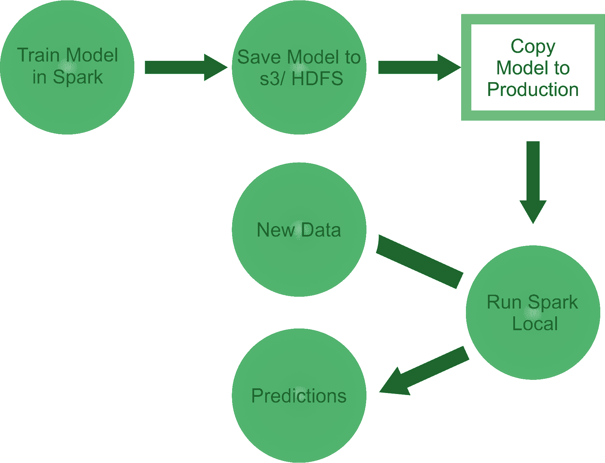

图 14:用于生产的 Spark 模型部署

到目前为止，我们只查看了保存和加载单个 ML 模型，而没有查看经过调优或稳定的模型。它甚至可能给你提供许多错误的预测。因此，现在第二种方法可能更有效。

事实是，在实践中，ML 工作流由许多阶段组成，从特征提取和转换到模型拟合和调整。Spark ML 提供了管道来帮助用户构建这些工作流。类似地，具有交叉验证模型的管道可以像我们在第一种方法中所做的那样被保存和恢复。

我们用训练集来拟合交叉验证的模型:

```scala
val cvModel = cv.fit(Preproessing.trainingData)   
```

然后我们保存工作流/管道:

```scala
cvModel.write.overwrite().save("model/RF_model") 
```

请注意，前面的代码行将使用以下目录结构将模型保存在您的首选位置:

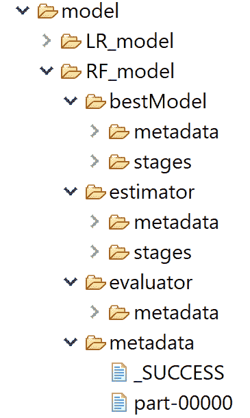

图 15:保存的模型目录结构

```scala
//Then we restore the same model back:
val sameCV = CrossValidatorModel.load("model/RF_model") 
Now when you try to restore the same model, Spark will automatically pick the best one. Finally, we reuse this model for making a prediction as follows:
sameCV.transform(Preproessing.testData) 
      .select("id", "prediction") 
      .withColumnRenamed("prediction", "loss") 
      .coalesce(1) 
      .write.format("com.databricks.spark.csv") 
      .option("header", "true") 
      .save("output/result_RF_reuse.csv")  
```


# 基于 Spark 的大规模数据集模型部署

在生产就绪环境中，我们通常需要大规模部署预训练模型。特别是，如果我们需要处理大量的数据。因此，我们的 ML 模型必须面对这个可伸缩性问题，以持续执行和更快的响应。为了解决这个问题，Spark 为我们带来的主要大数据范例之一是内存计算(尽管它支持基于 dis 的操作)和缓存抽象的引入。

这使得 Spark 成为大规模数据处理的理想选择，并使计算节点能够通过在计算集群或云计算基础设施(例如，Amazon AWS、DigitalOcean、Microsoft Azure 或 Google Cloud)中的多个节点上访问相同的输入数据来执行多个操作。为此，Spark 支持四个集群管理器(不过最后一个仍然是试验性的):

*   **Standalone**:Spark 附带的一个简单的集群管理器，可以轻松设置集群。
*   **Apache Mesos** :通用集群管理器，也可以运行 Hadoop MapReduce 和服务应用。
*   **Hadoop YARN**:Hadoop 2 中的资源管理器。
*   **Kubernetes(实验)**:除了以上，还有对 Kubernetes 的实验支持。Kubernetes 是一个开源平台，用于提供以容器为中心的基础设施。更多见[https://spark.apache.org/docs/latest/cluster-overview.html](https://spark.apache.org/docs/latest/cluster-overview.html)。

您可以在 **Hadoop 分布式文件系统** ( **HDFS** )或 **S3** 存储上上传您的输入数据集，以实现高效计算和廉价存储大数据。然后 Spark 的 bin 目录中的`spark-submit`脚本用于在任何集群模式下启动应用程序。它可以通过一个统一的接口使用所有的集群管理器，因此您不必为每个集群管理器专门配置您的应用程序。

但是，如果您的代码依赖于其他项目，您将需要将它们与您的应用程序一起打包，以便将代码分发到 Spark 集群。为此，创建一个包含您的代码及其依赖项的程序集 jar(也称为`fat`或`uber` jar)。然后将代码发送到数据所在的位置，并执行 Spark 作业。`SBT`和`Maven`都有装配插件，可以帮助你准备罐子。

创建汇编 jar 时，也要将 Spark 和 Hadoop 列为依赖项。这些不需要捆绑，因为它们是由集群管理器在运行时提供的。一旦有了组装好的 jar，就可以通过如下方式传递 jar 来调用脚本:

```scala
  ./bin/spark-submit \
      --class <main-class> \
      --master <master-url> \
      --deploy-mode <deploy-mode> \
      --conf <key>=<value> \
       ... # other options
       <application-jar> \
       [application-arguments]
```

在前面的命令中，列出了一些常用选项，如下所示:

*   `--class`:应用程序的入口点(例如，`org.apache.spark.examples.SparkPi`)。
*   `--master`:集群的主 URL(例如，`spark://23.195.26.187:7077`)。
*   `--deploy-mode`:是将驱动程序部署在工作节点(集群)上，还是作为外部客户端部署在本地。
*   `--conf`:key = value 格式的任意火花配置属性。
*   `application-jar`:包含应用程序和所有依赖项的捆绑 jar 的路径。URL 必须在集群内部全局可见，例如，所有节点上都存在的`hdfs://`路径或`file://`路径。
*   `application-arguments`:传递给主类的 main 方法的参数，如果有的话。

例如，您可以在客户机部署模式下在 Spark 独立集群上运行`AllstateClaimsSeverityRandomForestRegressor`脚本，如下所示:

```scala
./bin/spark-submit \
   --class com.packt.ScalaML.InsuranceSeverityClaim.AllstateClaimsSeverityRandomForestRegressor\
   --master spark://207.184.161.138:7077 \
   --executor-memory 20G \
   --total-executor-cores 100 \
   /path/to/examples.jar
```

欲了解更多信息，请访问 Spark 网站:https://Spark . Apache . org/docs/latest/submitting-applications . html。然而，你可以从在线博客或书籍中找到有用的信息。对了，我在最近出版的一本书中详细讨论过这个话题:Md. Rezaul Karim，斯里达尔·阿拉，**Scala and Spark for Big Data Analytics**，Packt Publishing Ltd. 2017。更多信息请访问[https://www . packtpub . com/big-data-and-business-intelligence/Scala-and-spark-big-data-analytics](https://www.packtpub.com/big-data-and-business-intelligence/scala-and-spark-big-data-analytics)。

无论如何，我们将在接下来的章节中学习更多关于在生产中部署 ML 模型的知识。因此，这就是我为这一章所要写的。


# 摘要

在这一章中，我们已经看到了如何使用一些最广泛使用的回归算法来开发一个用于分析保险严重程度索赔的预测模型。我们从简单的 LR 开始。然后，我们看到了如何使用 GBT 回归器来提高性能。然后，我们体验了使用集成技术(如随机森林回归器)提高的性能。最后，我们查看了这些模型之间的性能比较分析，并选择了最佳模型来部署生产就绪环境。

在下一章，我们将关注一个名为*的新的端到端项目，分析和预测电信流失*。客户流失预测对企业至关重要，因为它可以帮助您发现可能会取消订阅、产品或服务的客户。这也最大限度地减少了客户流失。它通过预测哪些客户更有可能取消服务订阅来做到这一点。