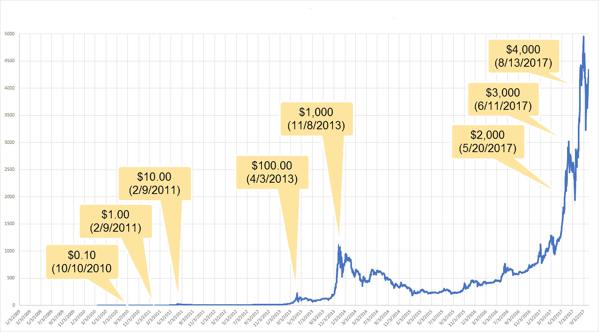
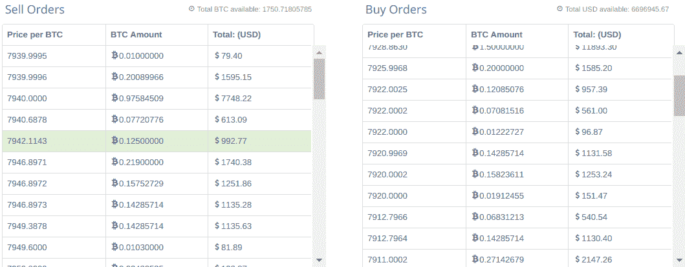
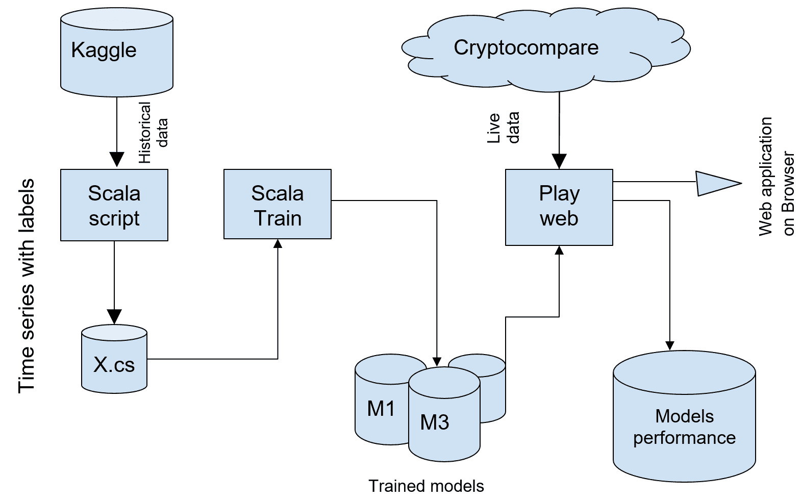
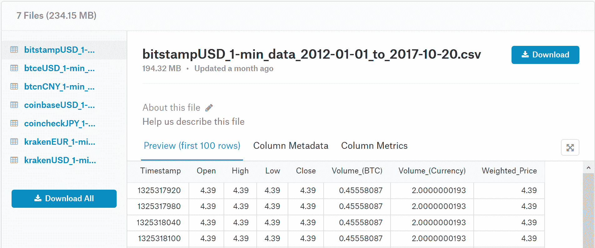
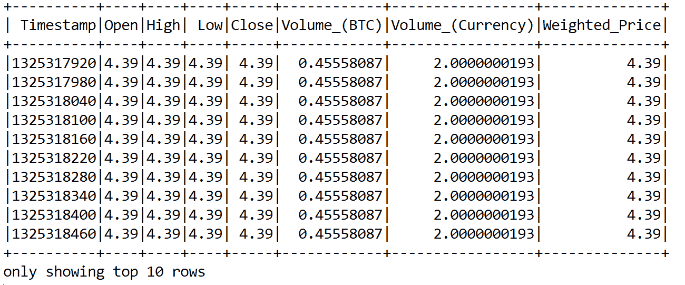
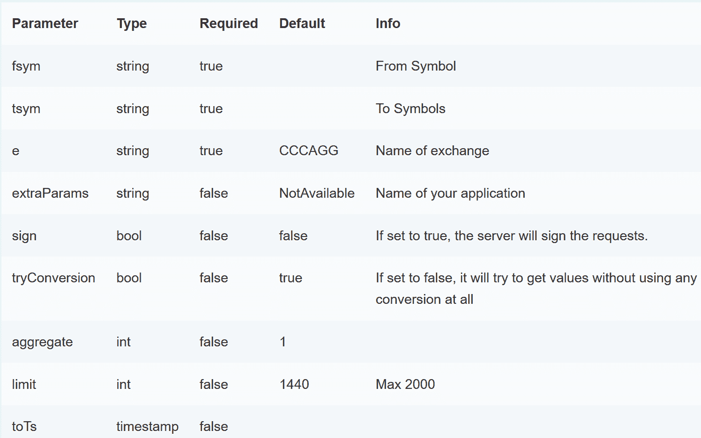
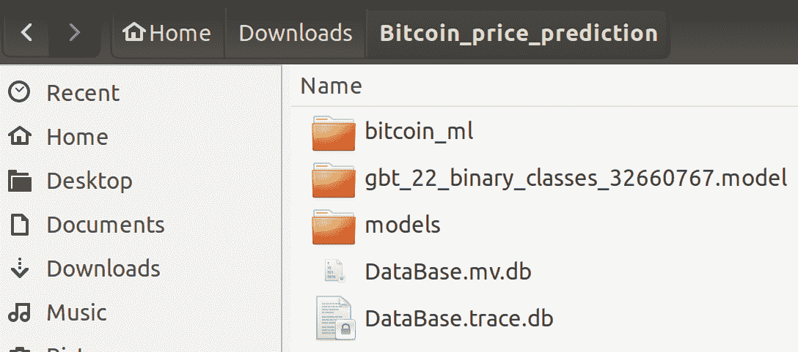
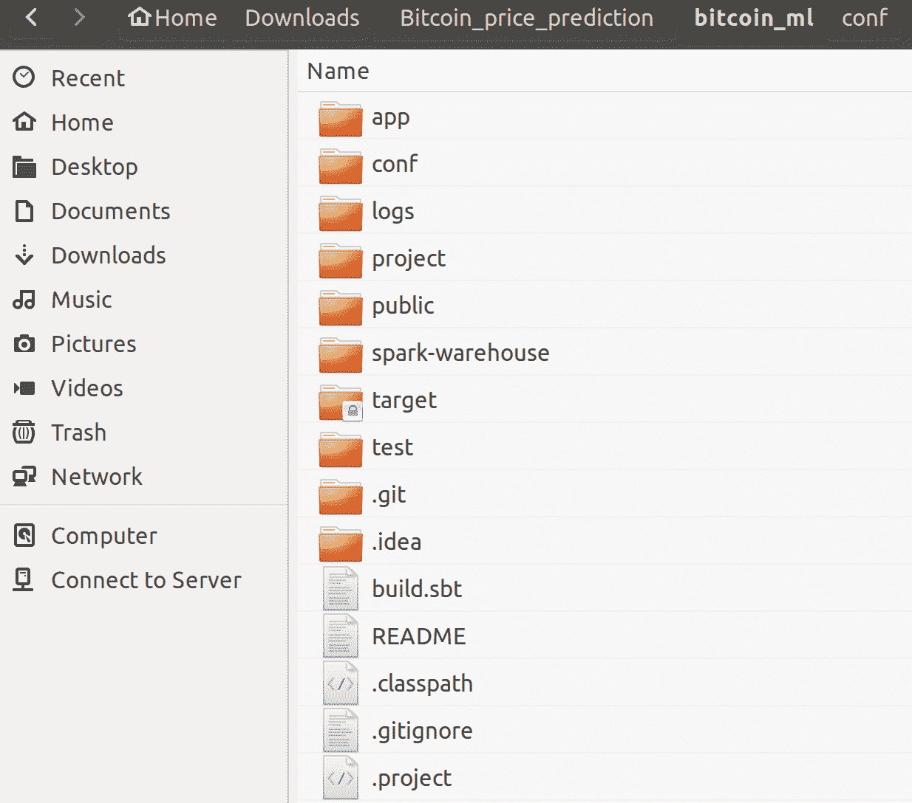
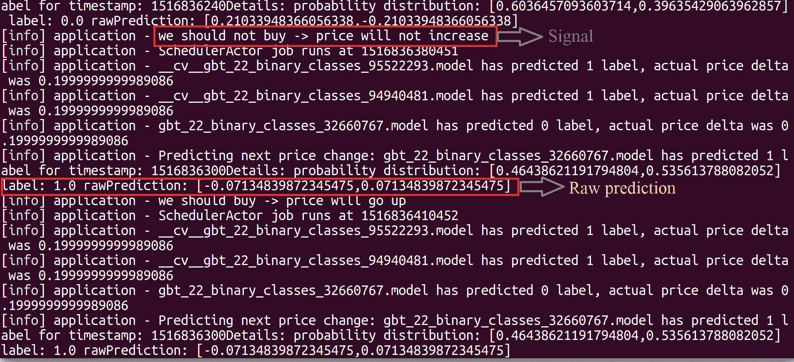
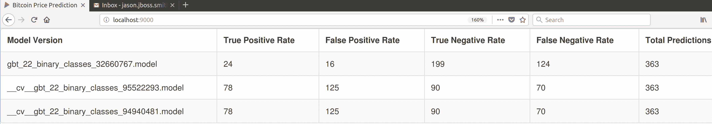

# 三、基于历史和实时数据的高频比特币价格预测

比特币是一种全球性的加密货币和数字支付系统，被认为是第一种去中心化的数字货币，因为该系统没有中央存储库或单一管理员。近年来，它在世界各地的人们中受到了广泛的欢迎和关注。

在本章中，我们将了解如何使用 Scala、Spark ML、Cryptocompare API 和比特币历史(和实时)数据来开发一个真实项目，以预测未来一周、一个月等的价格，帮助我们对在线加密货币做出自动化决策。除此之外，我们将看到如何为在线比特币交易生成一个简单的信号。

简而言之，我们将在这个端到端项目中学习以下主题:

*   比特币、加密货币和在线交易
*   历史和实时价格数据收集
*   原型的高层管道
*   用于比特币价格预测的梯度增强树回归
*   使用 Scala play 框架进行演示预测和信号生成
*   未来展望—对其他数据集使用相同的技术


# 比特币、加密货币和在线交易

按发行日期和市值(截至 2017 年 12 月)计算，比特币是第一种加密货币，它吸引了投资者和交易者，因为它易于开始交易，能够保持伪匿名，当然，在其历史上也有显著增长(一些统计数据见*表 1* 和*图 1* )。这吸引了长期投资者；它的高波动性也吸引了日内交易者。

然而，很难预测比特币的长期价值，因为比特币背后的价值不太明显。价格主要反映市场看法，并高度依赖于新闻、监管、政府和银行的合作、平台的技术问题(如交易费用和区块大小)、机构投资者将比特币纳入其投资组合的兴趣等:



图 1:比特币及其大幅涨价

尽管如此，从短期角度来看，比特币价格是通常发生在一个平台上的市场活动的副产品，该平台被称为**交易所** (Bitstamp、比特币基地、北海巨妖和 Bitfinex 是最知名的**交易所**)。用户在注册并通过 **KYC** ( **了解你的客户**)程序后，可以用比特币交易法定货币，如美元和欧元，以及其他加密货币，称为**替代硬币**或替代硬币(以太币、莱特币和 Dash 是众所周知的):

**表 1–比特币历史价格变动**

| **日期** | **美元:1 BTC** |
| 2009 年 1 月至 2010 年 3 月 | 基本没有 |
| 2010 年 3 月 | $0.003 |
| 2010 年 5 月 | 少于 0.01 美元 |
| 2010 年 7 月 | 0.08 美元 |
| 2011 年 2 月至 4 月 | 1.00 美元 |
| 2011 年 7 月 8 日 | 31.00 美元 |
| 2011 年 12 月 | 2.00 美元 |
| 2012 年 12 月 | $13.00 |
| 2013 年 4 月 11 日 | 266 美元 |
| 2013 年 5 月 | 130 美元 |
| 2013 年 6 月 | 100 美元 |
| 2013 年 11 月 | 350 美元到 1，242 美元 |
| 2013 年 12 月 | 600 美元到 1000 美元 |
| 2014 年 1 月 | 750 美元到 1000 美元 |
| 2014 年 2 月 | 550 美元到 750 美元 |
| 2014 年 3 月 | 450 美元到 700 美元 |
| 2014 年 4 月 | 340 美元到 530 美元 |
| 2014 年 5 月 | 440 美元到 630 美元 |
| 2015 年 3 月 | 200 美元到 300 美元 |
| 2015 年 11 月初 | 395 美元到 504 美元 |
| 2016 年 5 月至 6 月 | 450 美元到 750 美元 |
| 2016 年 7 月至 9 月 | 600 美元到 630 美元 |
| 2016 年 10 月至 11 月 | 600 美元到 780 美元 |
| 2017 年 1 月 | 800 美元到 1，150 美元 |
| 2017 年 1 月 5 日至 12 日 | 750 美元到 920 美元 |
| 2017 年 3 月 2 日至 3 日 | 1，290 美元+  |
| 2017 年 4 月 | 1，210 美元至 1，250 美元 |
| 2017 年 5 月 | 2000 美元 |
| 2017 年 5 月至 6 月 | 2，000 美元至 3，200 美元+  |
| 2017 年 8 月 | 4400 美元 |
| 2017 年 9 月 | 5000 美元 |
| 2017 年 9 月 12 日 | 2900 美元 |
| 2017 年 10 月 13 日 | 5600 美元 |
| 2017 年 10 月 21 日 | 6180 美元 |
| 2017 年 11 月 6 日 | 7300 美元 |
| 2017 年 11 月 12 日 | 5519 美元兑 6295 美元 |
| 2017 年 11 月 17 日至 20 日 | 7，600 美元到 8，100 美元 |
| 2017 年 12 月 15 日 | 17900 |

交易所维护订单簿——所有买卖订单的列表，包括数量和价格——并在发现有人买有人卖时执行。此外，交易所还保存并提供有关交易状态的统计数据，通常以交易商 pai 的两种货币的 OCHL 和交易量的形式捕获。对于这个项目，我们将使用 BTC/美元加密货币对。

这些数据是按周期汇总的，从几秒到几天，甚至几个月。有专门的服务器为专业交易员和机构收集比特币数据。虽然不能指望所有的订单数据都是免费的，但其中一些数据是公众可以访问和使用的。


# 最先进的比特币自动化交易

在传统的证券领域，比如一家公司的股票，过去是由人来进行分析、预测股票价格和交易。今天，**机器学习** ( **ML** )的发展和数据的日益可用，几乎已经将人类从高频交易中淘汰，作为一个普通人无法捕捉和处理所有数据，情绪影响一个人的决策；所以它被投资机构的自动交易系统所主导。

目前，与传统交易所相比，比特币交易量相对较低；传统上谨慎和规避风险的金融机构还没有涉足比特币交易(至少，它不是众所周知的)。原因之一是加密货币监管的高费用和不确定性。

所以今天，主要是个人买卖比特币，所有非理性行为的后果都与此相关，但已经有人尝试自动化比特币交易。最著名的是麻省理工学院的一篇论文，另一篇是斯坦福大学的研究人员在 2014 年发表的。许多事情都变了，考虑到这三年期间比特币价格的大幅上涨，任何购买并持有的人都会对结果感到足够满意:



图 2:比特币买卖单(截至 2017 年 11 月)

毫无疑问，一些交易者使用 ML 进行交易，这样的应用看起来很有前景。到目前为止，从研究论文中确定的最佳可能方法如下。


# 培养

使用订单簿数据，而不是派生的 OHLC +量数据。因此，对于定型和预测，请使用如下所示的数据:

*   将数据拆分成某个`size`(T1 是要调的参数)的时间序列。
*   将时间序列数据聚类到`K`聚类中(`K`是一个要调整的参数)。假设具有一些自然趋势的集群将会出现(价格的急剧下降/上升等等)。
*   对于每个分类，训练回归和分类器分别预测价格和价格变化。


# 预言；预测；预告

这种方法考虑具有特定窗口大小的最近时间序列，并训练模型。然后，它将数据分类如下:

*   采用最近的时间序列和用于训练的窗口大小
*   对其进行分类-它属于哪个聚类？
*   使用该分类的 ML 模型来预测价格或价格变化

这个解决方案可以追溯到 2014 年，但它仍然提供了一定程度的鲁棒性。在这个项目中，由于需要识别许多参数，并且不容易获得订单簿历史数据，所以我们使用了一种更简单的方法和数据集。


# 原型的高级数据管道

本章的目标是开发一个系统原型，该系统将预测比特币价格的短期变化，使用历史数据来训练算法，使用实时数据来预测和选择性能更好的算法。在这个项目的范围内，没有试图预测美元的实际价格，而只是预测它是否会增加。这是因为比特币价格在某种程度上实际上与价格无关，而是与市场预期有关。这可以被看作是交易者行为的模式，在更高的层面上，是由先前的价格本身所代表的。



图 3:原型的高级数据管道

当然，比特币伴随着一个客观的价格；矿工愿意出售比特币获利。因此，可以通过了解所有矿工为他们开采的比特币支付的所有账单来估计基价，但这不在本项目的范围内。

从这个角度来看，与其试图预测美元价格，不如寻找价格上涨、下跌或保持不变的趋势，并据此采取行动。第二个目标是建立一个实验工具，允许我们尝试不同的方法来预测价格，并根据现实生活中的数据轻松进行评估。代码必须灵活、健壮、易于扩展。

因此，概括地说，该系统有三个主要组成部分:

*   用于将历史数据预处理成所需格式的 Scala 脚本
*   Scala 应用程序训练 ML 模型
*   预测未来价格的 Scala web 服务


# 历史和实时价格数据收集

如前所述，我们将利用历史数据和实时数据。我们将使用 Kaggle 的比特币历史价格数据。对于实时数据，将使用 Cryptocompare API。


# 历史数据收集

为了训练 ML 算法，Kaggle(版本 10)上有一个`Bitcoin Historical Price Data`数据集可供公众使用。数据集可以从 https://www.kaggle.com/mczielinski/bitcoin-historical-data/的[下载。它有几个交易所的 BTC 美元对的 1 分钟 OHLC 数据。](https://www.kaggle.com/mczielinski/bitcoin-historical-data/)

在项目初期，对他们中的大多数人来说，数据是从 2012 年 1 月 1 日到 2017 年 5 月 31 日；但对于 Bitstamp exchange，它的可用时间截止到 2017 年 10 月 20 日(对于比特币基地也是如此，但该数据集后来才可用):



图 Kaggle 上的比特币历史数据集

请注意，您需要成为注册用户并登录才能下载该文件。我们正在使用的文件是`bitstampUSD_1-min_data_2012-01-01_to_2017-10-20.csv` *。现在，让我们得到现有的数据。它有八列:*

*   **时间戳**:从 1970 年 1 月 1 日开始经过的时间，以秒为单位。第一行是 1，325，317，920，第二行是 1，325，317，920。(理智检查！相差 60 秒)。
*   **开盘**:时段开盘时的价格。一共是 4.39 美元。因此，这是在**时间戳**之后发生的第一笔交易的价格(在第一行的情况下为 1，325，317，920)。
*   **收盘**:时段收盘时的价格。
*   **高**:区间内执行的所有订单的最高价格。
*   **低**:与**高**相同，但为最低价。
*   **Volume_(BTC)** :该时间间隔内被转移的所有比特币的总和。因此，取所选时间间隔内发生的所有交易，并对每笔交易的 BTC 值求和。
*   **Volume_(Currency)** :所有转出美元的总和。
*   **加权价格**:来源于 BTC 和美元的交易量。将所有交易的美元除以所有比特币，我们可以得到这一分钟内 BTC 的加权平均价格。所以`Weighted_Price=Volume_(Currency)/Volume_(BTC)`。

数据科学管道中仅次于数据收集的最重要的部分之一(从某种意义上说是外包的；我们使用他人收集的数据)是数据预处理——清除数据集并转换它以适应我们的需要。


# 将历史数据转换为时间序列

从我们的目标出发——预测价格变化的方向——我们可能会问自己，*用美元计算实际价格有助于实现这一目标吗？从历史上看，比特币的价格通常是上涨的，因此如果我们试图拟合线性回归，它将显示出进一步的指数增长(从长远来看这是否属实还有待观察)。*


# 假设和设计选择

这个项目的一个假设如下:无论我们在考虑 2016 年 11 月价格约为 700 美元的比特币交易，还是 2017 年 11 月价格在 6500-7000 美元范围内的交易，人们交易的模式都是相似的。现在，我们还有其他几个假设，如以下几点所述:

*   假设一:从前面所说的，我们可以忽略实际价格，而是看它的变化。为了衡量这一点，我们可以采用开盘价和收盘价之间的差值。如果是正数，意味着价格在那一分钟上涨；如果是负数，价格下降，如果 delta = 0，价格保持不变。
    下图我们可以看到，观测到的第一分钟 Delta 为-1.25，第二分钟为-12.83，第三分钟为-0.23。有时，开盘价可能与前一分钟的收盘价相差很大(尽管 Delta 在观察的三分钟内都是负的，但第三分钟显示的价格实际上比第二分钟的收盘价高)。但这种事情并不常见，通常开盘价与前一分钟的收盘价相比不会有明显变化。
*   **假设二**:接下来需要考虑的...在**黑箱**环境中预测价格变化。我们不使用其他来源的信息，如新闻、Twitter 信息和其他信息来预测市场对这些信息的反应。这是一个更高级的话题。我们使用的唯一数据是价格和数量。为了简化原型，我们可以只关注价格并构建时间序列数据。
    时间序列预测是根据一个参数过去的值对该参数进行预测。最常见的例子之一是温度预测。虽然有许多超级计算机使用卫星和传感器数据来预测天气，但简单的时间序列分析可以得出一些有价值的结果。例如，我们预测 T+60 秒的价格，基于 T、T-60 秒、T-120 秒的价格等等。
*   **假设三**:数据集中并非所有数据都有价值。最初的 600，000 条记录信息不足，因为价格变化很少，交易量也很小。这可能会影响我们正在训练的模型，从而使最终结果变得更糟。这就是为什么前 600，000 行将从数据集中删除。
*   **假设四**:我们需要`Label` 我们的数据，以便我们可以使用监督的 ML 算法。这是最简单的方法，不用担心交易费用。


# 数据预处理

考虑到数据准备的目标，Scala 被选为操作数据的一种简单和交互式的方式:

```
val priceDataFileName: String = "bitstampUSD_1-min_data_2012-01-01_to_2017-10-20.csv"

val spark = SparkSession
    .builder()
    .master("local[*]")
    .config("spark.sql.warehouse.dir", "E:/Exp/")
    .appName("Bitcoin Preprocessing")
    .getOrCreate()

val data = spark.read.format("com.databricks.spark.csv").option("header", "true").load(priceDataFileName)
data.show(10)
>>>
```



图 5:比特币历史价格数据集一瞥

```
println((data.count(), data.columns.size))
```

>>>

```
(3045857, 8)
```

在前面的代码中，我们从 Kaggle 下载的文件中加载数据，并查看里面的内容。如前所述，数据集中有`3045857`行和`8`列。然后我们创建`Delta`列，包含收盘价和开盘价之间的差异(也就是说，只考虑有意义的交易已经开始发生的数据):

```
val dataWithDelta = data.withColumn("Delta", data("Close") - data("Open"))
```

下面的代码通过将 1 赋给`Delta`值为正的行来标记我们的数据；否则分配`0`:

```
import org.apache.spark.sql.functions._
import spark.sqlContext.implicits._

val dataWithLabels = dataWithDelta.withColumn("label", when($"Close" - $"Open" > 0, 1).otherwise(0))
rollingWindow(dataWithLabels, 22, outputDataFilePath, outputLabelFilePath)
```

这段代码将原始数据集转换成时间序列数据。它获取`WINDOW_SIZE`行的 Delta 值(在本实验中为`22`),并从中创建一个新行。这样，第一行具有从`t0`到`t21`的`Delta`值，第二行具有从`t1`到`t22`的值。然后我们用标签(`1`或`0`)创建相应的数组。

最后，我们将`X`和`Y`保存到文件中，其中`612000`行是从原始数据集中截取的；`22`表示滚动窗口大小，2 类表示标签为二进制`0`和`1`:

```
val dropFirstCount: Int = 612000

def rollingWindow(data: DataFrame, window: Int, xFilename: String, yFilename: String): Unit = {
 var i = 0
 val xWriter = new BufferedWriter(new FileWriter(new File(xFilename)))
 val yWriter = new BufferedWriter(new FileWriter(new File(yFilename)))
 val zippedData = data.rdd.zipWithIndex().collect()
    System.gc()
 val dataStratified = zippedData.drop(dropFirstCount)//slice 612K

 while (i < (dataStratified.length - window)) {
 val x = dataStratified
                .slice(i, i + window)
                    .map(r => r._1.getAs[Double]("Delta")).toList
 val y = dataStratified.apply(i + window)._1.getAs[Integer]("label")
 val stringToWrite = x.mkString(",")
        xWriter.write(stringToWrite + "n")
        yWriter.write(y + "n")
        i += 1

 if (i % 10 == 0) {
            xWriter.flush()
            yWriter.flush()
            }
        }
    xWriter.close()
    yWriter.close()
}
```

在前面的代码段中:

```
val outputDataFilePath: String = "output/scala_test_x.csv"
val outputLabelFilePath: String = "output/scala_test_y.csv"
```


# 通过 Cryptocompare API 的实时数据

对于实时数据，使用 crypto compare API([https://www.cryptocompare.com/api/#](https://www.cryptocompare.com/api/))，更具体地说是 histo minute([https://www.cryptocompare.com/api/#-api-data-histominute-](https://www.cryptocompare.com/api/#-api-data-histominute-))，它让我们最多可以访问过去七天的 OHLC 数据。API 的细节将在专门讨论实现的章节中讨论，但是 API 响应与我们的历史数据集非常相似，并且该数据是使用常规 HTTP 请求检索的。例如，来自 https://min-api.cryptocompare.com/data/histominute?fsym=BTC 的简单 JSON 响应具有以下结构:

```
{
    "Response":"Success",
    "Type":100,
    "Aggregated":false,
    "Data":
    [{"time":1510774800,"close":7205,"high":7205,"low":7192.67,"open":7198,                                             "volumefrom":81.73,"volumeto":588726.94},
        {"time":1510774860,"close":7209.05,"high":7219.91,"low":7205,"open":7205,                                 "volumefrom":16.39,"volumeto":118136.61},
        ... (other price data)
        ],
    "TimeTo":1510776180,
    "TimeFrom":1510774800,
    "FirstValueInArray":true,
    "ConversionType":{"type":"force_direct","conversionSymbol":""}
}
```

通过 Cryptocompare HistoMinute，我们可以从每一分钟的历史数据中得到`open`、`high`、`low`、`close`、`volumefrom`、`volumeto`。该数据仅存储 7 天；如果需要更多，请使用每小时或每天的路径。如果由于硬币不是以指定的货币进行交易而导致数据不可用，则使用 BTC 换算:



图 6:通过 Cryptocompare HistoMinute 的开盘、盘高、盘低、收盘和成交量值

现在，下面的方法获取 Cryptocompare API 的正确格式的 URL([https://www.cryptocompare.com/api/#-api-data-histominute-](https://www.cryptocompare.com/api/#-api-data-histominute-))，这是一个完整格式的 URL，包含所有参数，比如指定的货币、限额和聚合。它最终返回 future，该 future 将有一个解析到数据模型中的响应主体，价格列表将在较高的级别进行处理:

```
import javax.inject.Inject
import play.api.libs.json.{JsResult, Json}
import scala.concurrent.Future
import play.api.mvc._
import play.api.libs.ws._
import processing.model.CryptoCompareResponse

class RestClient @Inject() (ws: WSClient) {
 def getPayload(url : String): Future[JsResult[CryptoCompareResponse]] = {
        val request: WSRequest = ws.url(url)
        val future = request.get()
        implicit val context = play.api.libs.concurrent.Execution.Implicits.defaultContext
        future.map {
            response => response.json.validate[CryptoCompareResponse]
            }
        }
    }
```

在前面的代码段中，`CryptoCompareResponse`类是 API 的模型，它采用以下参数:

*   `Response`
*   `Type`
*   `Aggregated`
*   `Data`
*   `FirstValueInArray`
*   `TimeTo`
*   `TimeFrom`

现在，它有以下签名:

```
case class CryptoCompareResponse(Response : String,
    Type : Int,
    Aggregated : Boolean,
    Data : List[OHLC],
    FirstValueInArray : Boolean,
    TimeTo : Long,
    TimeFrom: Long)

object CryptoCompareResponse {
    implicit val cryptoCompareResponseReads = Json.reads[CryptoCompareResponse]
    }
```

同样，前面的两个代码段**开盘-盘高-盘低-收盘**(也称为 **OHLC** )，是用于映射 CryptoAPI 响应`data`数组内部的模型类。它采用这些参数:

*   `Time`:以秒为单位的时间戳，例如`1508818680`。
*   `Open`:给定分钟间隔的开盘价。
*   `High`:最高价。
*   `Low`:最低价格。
*   `Close`:区间收盘价格。
*   `Volumefrom`:以`from`币种计算的交易量。在我们的例子中是 BTC。
*   `Volumeto`:以`to`货币表示的交易量，本例中为美元。
*   用`Volumeto`除以`Volumefrom`得到 BTC 的加权价格。

现在，它有以下签名:

```
case class OHLC(time: Long,
    open: Double,
    high: Double,
    low: Double,
    close: Double,
    volumefrom: Double,
    volumeto: Double)

    object OHLC {
    implicit val implicitOHLCReads = Json.reads[OHLC]
        }
```


# 用于预测的模型训练

在项目内部，包文件夹`prediction.training`中，有一个名为`TrainGBT.scala`的 Scala 对象。在启动之前，您必须指定/更改四项内容:

*   在代码中，您需要在计算机上的某个实际位置设置`spark.sql.warehouse.dir`，该位置有几千兆字节的空闲空间:`set("spark.sql.warehouse.dir", "/home/user/spark")`
*   `RootDir`是主文件夹，所有的文件和火车模型都在这里`stored:rootDir = "/home/user/projects/btc-prediction/"`
*   确保`x`文件名与上一步中 Scala 脚本生成的文件名相匹配:`x = spark.read.format("com.databricks.spark.csv ").schema(xSchema).load(rootDir + "scala_test_x.csv")`
*   确保`y`文件名与 Scala 脚本生成的文件名相匹配:`y_tmp=spark.read.format("com.databricks.spark.csv").schema(ySchema).load(rootDir + "scala_test_y.csv")`

用于训练的代码使用 Apache Spark ML 库(以及它所需的库)来训练分类器，这意味着它们必须存在于您的`class`路径中才能运行它。最简单的方法(因为整个项目都使用 SBT)是通过键入`sbt` `run-main prediction.training.TrainGBT`从项目根文件夹中运行它，这将解析所有的依赖项并启动培训。

根据迭代次数和深度，训练模型可能需要几个小时。现在让我们看看如何在梯度增强树模型的例子上执行训练。首先，我们需要创建一个`SparkSession`对象:

```
val spark = SparkSession
        .builder()
        .master("local[*]")
        .config("spark.sql.warehouse.dir", ""/home/user/spark/")
        .appName("Bitcoin Preprocessing")
        .getOrCreate()
```

然后，我们为`x`和`y`定义一个数据模式。我们将这些列重命名为`t0` - `t21,`，以表明这是一个时间序列:

```
val xSchema = StructType(Array(
    StructField("t0", DoubleType, true),
    StructField("t1", DoubleType, true),
    StructField("t2", DoubleType, true),
    StructField("t3", DoubleType, true),
    StructField("t4", DoubleType, true),
    StructField("t5", DoubleType, true),
    StructField("t6", DoubleType, true),
    StructField("t7", DoubleType, true),
    StructField("t8", DoubleType, true),
    StructField("t9", DoubleType, true),
    StructField("t10", DoubleType, true),
    StructField("t11", DoubleType, true),
    StructField("t12", DoubleType, true),
    StructField("t13", DoubleType, true),
    StructField("t14", DoubleType, true),
    StructField("t15", DoubleType, true),
    StructField("t16", DoubleType, true),
    StructField("t17", DoubleType, true),
    StructField("t18", DoubleType, true),
    StructField("t19", DoubleType, true),
    StructField("t20", DoubleType, true),
    StructField("t21", DoubleType, true))
    )
```

然后，我们读取为模式定义的文件。在 Scala 中为数据和标签生成两个独立的文件更方便，所以这里我们必须将它们合并成一个数据帧:

```
import spark.implicits._
val y = y_tmp.withColumn("y", 'y.cast(IntegerType))
import org.apache.spark.sql.functions._

val x_id = x.withColumn("id", monotonically_increasing_id())
val y_id = y.withColumn("id", monotonically_increasing_id())
val data = x_id.join(y_id, "id")
```

Spark 要求的下一步是—我们需要对特征进行矢量化:

```
val featureAssembler = new VectorAssembler()
        .setInputCols(Array("t0", "t1", "t2", "t3",
                            "t4", "t5", "t6", "t7",
                            "t8", "t9", "t10", "t11",
                            "t12", "t13", "t14", "t15",
                            "t16", "t17", "t18", "t19",
                            "t20", "t21"))
        .setOutputCol("features")
```

我们按照 75%比 25%的比例将数据随机分为训练集和测试集。我们设置了种子，以便在我们运行训练的所有时间中分割是相等的:

```
val Array(trainingData,testData) = dataWithLabels.randomSplit(Array(0.75, 0.25), 123)
```

然后我们定义模型。它指出哪些列是要素，哪些是标注。它还设置参数:

```
val gbt = new GBTClassifier()
        .setLabelCol("label")
        .setFeaturesCol("features")
        .setMaxIter(10)
        .setSeed(123)
```

创建一个`pipeline`步骤——矢量组装特征并运行 GBT:

```
val pipeline = new Pipeline()
            .setStages(Array(featureAssembler, gbt))
```

定义评估函数-模型如何知道它做得好不好。因为我们只有两个不平衡的类，所以准确性是一个不好的度量；ROC 曲线下的面积更好:

```
val rocEvaluator = new BinaryClassificationEvaluator()
        .setLabelCol("label")
        .setRawPredictionCol("rawPrediction")
        .setMetricName("areaUnderROC")
```

使用 k 倍交叉验证来避免过度拟合；它在每次迭代中取出五分之一的数据，在剩余的数据上训练模型，然后在这五分之一上进行测试:

```
val cv = new CrossValidator()
        .setEstimator(pipeline)
        .setEvaluator(rocEvaluator)
        .setEstimatorParamMaps(paramGrid)
        .setNumFolds(numFolds)
        .setSeed(123)
val cvModel = cv.fit(trainingData)
```

在我们得到训练好的模型后(根据我们想要迭代的迭代次数和参数，可能需要一个小时或更长时间，在`paramGrid`中指定)，我们然后计算测试数据的预测:

```
val predictions = cvModel.transform(testData)
```

此外，评估预测的质量:

```
val roc = rocEvaluator.evaluate(predictions)
```

已训练的模型被保存以供预测服务以后使用:

```
val gbtModel = cvModel.bestModel.asInstanceOf[PipelineModel]
gbtModel.save(rootDir + "__cv__gbt_22_binary_classes_" + System.nanoTime() / 1000000 + ".model")
```

总之，模型训练的代码如下所示:

```
import org.apache.spark.{ SparkConf, SparkContext }
import org.apache.spark.ml.{ Pipeline, PipelineModel }

import org.apache.spark.ml.classification.{ GBTClassificationModel, GBTClassifier, RandomForestClassificationModel, RandomForestClassifier}
import org.apache.spark.ml.evaluation.{BinaryClassificationEvaluator, MulticlassClassificationEvaluator}
import org.apache.spark.ml.feature.{IndexToString, StringIndexer, VectorAssembler, VectorIndexer}
import org.apache.spark.ml.tuning.{CrossValidator, ParamGridBuilder}
import org.apache.spark.sql.types.{DoubleType, IntegerType, StructField, StructType}
import org.apache.spark.sql.SparkSession

object TrainGradientBoostedTree {
    def main(args: Array[String]): Unit = {
        val maxBins = Seq(5, 7, 9)
        val numFolds = 10
        val maxIter: Seq[Int] = Seq(10)
        val maxDepth: Seq[Int] = Seq(20)
        val rootDir = "output/"
        val spark = SparkSession
            .builder()
            .master("local[*]")
            .config("spark.sql.warehouse.dir", ""/home/user/spark/")
            .appName("Bitcoin Preprocessing")
            .getOrCreate()

        val xSchema = StructType(Array(
            StructField("t0", DoubleType, true),
            StructField("t1", DoubleType, true),
            StructField("t2", DoubleType, true),
            StructField("t3", DoubleType, true),
            StructField("t4", DoubleType, true),
            StructField("t5", DoubleType, true),
            StructField("t6", DoubleType, true),
            StructField("t7", DoubleType, true),
            StructField("t8", DoubleType, true),
            StructField("t9", DoubleType, true),
            StructField("t10", DoubleType, true),
            StructField("t11", DoubleType, true),
            StructField("t12", DoubleType, true),
            StructField("t13", DoubleType, true),
            StructField("t14", DoubleType, true),
            StructField("t15", DoubleType, true),
            StructField("t16", DoubleType, true),
            StructField("t17", DoubleType, true),
            StructField("t18", DoubleType, true),
            StructField("t19", DoubleType, true),
            StructField("t20", DoubleType, true),
            StructField("t21", DoubleType, true)))

        val ySchema = StructType(Array(StructField("y", DoubleType,
        true)))
        val x = spark.read.format("csv").schema(xSchema).load(rootDir +
        "scala_test_x.csv")
        val y_tmp =
        spark.read.format("csv").schema(ySchema).load(rootDir +
        "scala_test_y.csv")

        import spark.implicits._
        val y = y_tmp.withColumn("y", 'y.cast(IntegerType))

        import org.apache.spark.sql.functions._
        //joining 2 separate datasets in single Spark dataframe
        val x_id = x.withColumn("id", monotonically_increasing_id())
        val y_id = y.withColumn("id", monotonically_increasing_id())
        val data = x_id.join(y_id, "id")
        val featureAssembler = new VectorAssembler()
            .setInputCols(Array("t0", "t1", "t2", "t3", "t4", "t5", 
                                "t6", "t7", "t8", "t9", "t10", "t11", 
                                "t12", "t13", "t14", "t15", "t16",
                                "t17","t18", "t19", "t20", "t21"))
            .setOutputCol("features")
        val encodeLabel = udf[Double, String] { case "1" => 1.0 case
                                                "0" => 0.0 }
        val dataWithLabels = data.withColumn("label",
                                encodeLabel(data("y")))

        //123 is seed number to get same datasplit so we can tune
        params
        val Array(trainingData, testData) =
        dataWithLabels.randomSplit(Array(0.75, 0.25), 123)
        val gbt = new GBTClassifier()
            .setLabelCol("label")
            .setFeaturesCol("features")
            .setMaxIter(10)
            .setSeed(123)
        val pipeline = new Pipeline()
            .setStages(Array(featureAssembler, gbt))
        // ***********************************************************
        println("Preparing K-fold Cross Validation and Grid Search")
        // ***********************************************************
        val paramGrid = new ParamGridBuilder()
            .addGrid(gbt.maxIter, maxIter)
            .addGrid(gbt.maxDepth, maxDepth)
            .addGrid(gbt.maxBins, maxBins)
            .build()
        val cv = new CrossValidator()
            .setEstimator(pipeline)
            .setEvaluator(new BinaryClassificationEvaluator())
            .setEstimatorParamMaps(paramGrid)
            .setNumFolds(numFolds)
            .setSeed(123)
        // ************************************************************
        println("Training model with GradientBoostedTrees algorithm")
        // ************************************************************
        // Train model. This also runs the indexers.
        val cvModel = cv.fit(trainingData)
        cvModel.save(rootDir + "cvGBT_22_binary_classes_" +
        System.nanoTime() / 1000000 + ".model")
        println("Evaluating model on train and test data and
        calculating RMSE")
        // **********************************************************************
        // Make a sample prediction
        val predictions = cvModel.transform(testData)

        // Select (prediction, true label) and compute test error.
        val rocEvaluator = new BinaryClassificationEvaluator()
            .setLabelCol("label")
            .setRawPredictionCol("rawPrediction")
            .setMetricName("areaUnderROC")
        val roc = rocEvaluator.evaluate(predictions)
        val prEvaluator = new BinaryClassificationEvaluator()
            .setLabelCol("label")
            .setRawPredictionCol("rawPrediction")
            .setMetricName("areaUnderPR")
        val pr = prEvaluator.evaluate(predictions)
        val gbtModel = cvModel.bestModel.asInstanceOf[PipelineModel]
        gbtModel.save(rootDir + "__cv__gbt_22_binary_classes_" +
        System.nanoTime()/1000000 +".model")

        println("Area under ROC curve = " + roc)
        println("Area under PR curve= " + pr)
        println(predictions.select().show(1))
        spark.stop()
    }
}
```

现在让我们看看训练进行得如何:

```
>>> 
Area under ROC curve = 0.6045355104779828
Area under PR curve= 0.3823834607704922
```

因此，我们没有获得非常高的准确性，因为 ROC 只有最好的 GBT 模型的 60.50%。然而，如果我们调整超参数，我们将获得更好的精度。

然而，由于我没有足够的时间，我没有迭代训练很长时间，但你一定要试试。


# Scala Play web 服务

作为一个应用程序框架，Play2 被选为易于配置且健壮的框架。相比 Spring(另一个流行的框架)，从零开始做一个小 app 需要的时间更少。该剧由 Guice 负责依赖注入，SBT 担任包经理:

*   **Spark ML**:Spark ML 库被选中是因为它是 Java 世界中维护得最好的库之一。许多库中没有的算法是由第三方开发人员实现的，可以在 Spark 上进行训练。Spark 的一个缺点是它非常慢，因为根据设计，它应该是分布式的；所以它使用 Hadoop，并在文件系统中写入大量内容。
*   **Akka** :这允许实现 actor 的模式——拥有几个独立对象的实例，并发地互相传递消息，这增加了健壮性。
*   Anorm :在 JDBC 之上使用 SQL 的库。Slick 是另一个选择，它更强大，但是 Akka 和 Slick 所需的库之间的兼容性问题使得选择另一个库是值得的。
*   **H2**:Play 和 Ruby-on-Rails 的默认数据库，易于启动，可以将数据存储在本地数据库文件中，而无需安装 DB 服务器。这提供了可移植性并提高了开发速度。在以后的阶段，它可以被另一个替代，因为 Scala 代码不依赖于任何特定的数据库；所有这些都是在配置级别上完成的。


# 通过 Akka actors 实现并发

并发是通过使用 Akka Scala 库的`actor`模型来实现的。参与者作为独立的实体，可以将异步消息传递给其他参与者。在这个项目中，有三个角色:`SchedulerActor`、`PredictionActor`和`TraderActor`:

*   `SchedulerActor`:请求价格数据，将它们存储到 DB 中，向`PredictionActor`发送带有价格的消息，接收回答，并将其传递给`TraderActor`。
*   `PredictionActor`:收到价格信息后，它会使用现有的最佳模型预测下一个价格(这必须在`application.conf`中选择)；我们将在后面看到细节)。它将带有预测的消息传递回`SchedulerActor`，使用`model`文件夹中的其余模式对以前的数据进行预测，并使用最新的价格来评估预测。这种预测的结果存储在数据库中。
*   `TraderActor`:在收到一条关于预测的消息后，使用`rules`(此时就像*如果预测价格上涨* *则买入，否则不做任何事情*)将其决定写入日志。它可以向一个 URL 发送一个 HTTP 请求来触发这个决定。


# Web 服务工作流

现在让我们更深入地看看代码是如何执行预测的。如前所示，每 60 秒，该应用程序被触发从 Cryptocompare 获取数据，将价格存储到数据库中，并运行预测，保存关于质量预测的回溯测试结果。

在这一节中，我们将深入探讨哪些 Scala 类在这个项目中扮演了重要的角色，以及它们是如何通信的。


# 作业模块

当应用程序启动时，一切都从`JobModule`开始。它配置`Scheduler`的创建，它以`application.conf`速率向`SchedulerActor`发送消息:

```
class JobModule extends AbstractModule with AkkaGuiceSupport {
    def configure(): Unit = {
        //configuring launch of price-fetching Actor
        bindActor[SchedulerActor]("scheduler-actor")
        bind(classOf[Scheduler]).asEagerSingleton()
    }
}
```

要启用此模块，在`application.conf`内，需要以下行:

```
play.modules.enabled += "modules.jobs.JobModule"
```


# 调度程序

`Scheduler`从`application.conf`获取频率常数，并使用`Actor`系统发送`update`消息(内容无关紧要；`SchedulerActor`对任何消息作出反应)到`SchedulerActor`每 X 秒:

```
class Scheduler @Inject()
    (val system: ActorSystem, @Named("scheduler-actor") val schedulerActor: ActorRef, configuration:     Configuration)(implicit ec: ExecutionContext) {
    //constants.frequency is set in conf/application.conf file
    val frequency = configuration.getInt("constants.frequency").get
    var actor = system.scheduler.schedule(
    0.microseconds, //initial delay: whether execution starts immediately after app launch
    frequency.seconds, //every X seconds, specified above
    schedulerActor,
    "update")
}
```


# 调度器

代码的相关部分被显示和解释。现在让我们看看如何获得价格数据:

```
def constructUrl(exchange: String): String =
{
 "https://min-api.cryptocompare.com/data/histominute?fsym=BTC&tsym=USD&limit=23&aggregate=1&e=" + exchange
 }
```

`ConstructUrl`向 Cryptocompare API 返回完整格式的请求 URL。更多详情见 API 相关章节:

```
final val predictionActor = system.actorOf(Props(new PredictionActor(configuration, db)))
final val traderActor = system.actorOf(Props(new TraderActor(ws)))
```

创建`PredictionActor`和`TraderActor`的实例:

```
override def receive: Receive = {
```

`Receive`方法在`actor`特征中定义，并且必须被实现。当有人向这个`actor`(在我们的例子中是`Scheduler`)传递消息时，它被触发:

```
case _ =>
    val futureResponse=restClient.getPayload(constructUrl(exchange))
```

在前面的代码中，`case _ =>`表示我们对任何类型和内容的任何消息做出反应。首先通过之前指定的 URL 异步调用 Cryptocompare API。这是在`RestClient`的帮助下完成的，T1 用响应 JSON 返回`Future`。收到响应后(在完成回调的`futureResponse`内)，`.json`被映射到自定义案例类`CryptoCompareResponse`:

```
case class CryptoCompareResponse(Response: String, Type: Int, Aggregated: Boolean, Data: List[OHLC],     FirstValueInArray: Boolean, TimeTo: Long,TimeFrom: Long)
```

case 类类似于 **POJO** ( **普通老式 Java 对象**)不需要编写构造函数和 getter/setter:

```
object CryptoCompareResponse {
 implicit val cryptoCompareResponseReads = Json.reads[CryptoCompareResponse]
            }
```

将 JSON 映射到这个类需要这个伴随对象。`CryptocompareResponse`对象存储 API 的输出——一列 OHLC 数据、数据的时间范围以及其他与我们无关的内容。`OHLC`类对应实际价格数据:

```
case class OHLC(time: Long, open: Double, 
                high: Double, 
                low: Double, 
                close: Double, 
                volumefrom: Double, 
                volumeto: Double)
```

数据准备好之后，通过调用`storePriceData(cryptoCompareResponse)`将价格存储在数据库中。首先，它将(使用 Anorm 的 **BatchSQL** )批量插入到`PRICE_STAGING`表中，并根据时间戳通过重复数据删除重新插入到`PRICE`中，因为我们正在接收重叠的价格数据:

```
val batch = BatchSql(
        """|INSERT INTO PRICE_STAGING(TIMESTAMP,EXCHANGE,PRICE_OPEN,PRICE_CLOSED,VOLUME_BTC,             
            VOLUME_USD)| VALUES({timestamp}, {exchange}, {priceOpen}, {priceClosed}, {volumeBTC},                   {volumeUSD})""".stripMargin,transformedPriceDta.head,transformedPriceDta.tail:_*)
val res: Array[Int] = batch.execute() // array of update count
val reInsert = SQL(
        """
          |INSERT INTO PRICE(TIMESTAMP, EXCHANGE, PRICE_OPEN, PRICE_CLOSED, VOLUME_BTC, VOLUME_USD)
          |SELECT  TIMESTAMP, EXCHANGE, PRICE_OPEN, PRICE_CLOSED, VOLUME_BTC, VOLUME_USD
          |FROM PRICE_STAGING AS s
          |WHERE NOT EXISTS (
          |SELECT *
          |FROM PRICE As t
          |WHERE t.TIMESTAMP = s.TIMESTAMP
          |)
        """.stripMargin).execute()
      Logger.debug("reinsert " + reInsert)
```

存储到数据库后，`SchedulerActor`将 OHLC 数据转换为(timestamp，delta)元组，其中 delta 为(`closePrice` - `openPrice`)。所以这种格式适合 ML 模型。转换后的数据作为消息传递给`PredictionActor`,并明确等待响应。这通过使用`?`操作符来完成。我们问预测`actor`:

```
(predictionActor ? CryptoCompareDTOToPredictionModelTransformer.tranform(cryptoCompareResponse)).mapTo[CurrentDataWithShortTermPrediction].map {
```

它的响应被映射到`CurrentDataWithShortTermPrediction`类，并使用`!`操作符传递给`TraderActor`。与`?`不同，`!`操作器不需要响应:

```
predictedWithCurrent =>
traderActor ! predictedWithCurrent}
```

这是`SchedulerActor`的基本演练。我们从 Cryptocompare API 中读取数据，将其存储到数据库中，发送到`PredictionActor`并等待其响应。然后我们将它的响应转发给`TraderActor`。

现在我们来看看`PredictionActor`内部发生了什么。


# 预测因子和预测步骤

Scala web 应用程序每分钟从 Cryptocompare API 获取 Bitstamp exchange 上最新的比特币价格数据，使用经过训练的 ML 分类器来预测下一分钟的价格变化方向。它通知用户这个决定。

现在，从项目类型为`sbt run`(或`$ sudo sbt run`的目录中启动它。现在让我们看看`application.conf`文件的内容:

```
# This is the main configuration file for the application.
# Secret key
# The secret key is used to secure cryptographics functions.
# If you deploy your application to several instances be sure to use the same key!
application.secret="%APPLICATION_SECRET%"
# The application languages
application.langs="en"
# Global object class
# Define the Global object class for this application.
# Default to Global in the root package.sb
# application.global=Global
# Router
# Define the Router object to use for this application.
# This router will be looked up first when the application is starting up,
# so make sure this is the entry point.
# Furthermore, it's assumed your route file is named properly.
# So for an application router like `my.application.Router`,
# you may need to define a router file `conf/my.application.routes`.
# Default to Routes in the root package (and conf/routes)
# application.router=my.application.Routes
# Database configuration
# You can declare as many datasources as you want.
# By convention, the default datasource is named `default`
rootDir = "<path>/Bitcoin_price_prediction/"
db.default.driver = org.h2.Driver
db.default.url = "jdbc:h2: "<path>/Bitcoin_price_prediction/DataBase"
db.default.user = user
db.default.password = ""
play.evolutions.db.default.autoApply = true
# Evolutions
# You can disable evolutions if needed
# evolutionplugin=disabled
# Logger
# You can also configure logback (http://logback.qos.ch/),
# by providing an application-logger.xml file in the conf directory.
# Root logger:
logger.root=ERROR
# Logger used by the framework:
logger.play=INFO
# Logger provided to your application:
logger.application=DEBUG
#Enable JobModule to run scheduler
play.modules.enabled += "modules.jobs.JobModule"
#Frequency in seconds to run job. Might make sense to put 30 seconds, for recent data
constants.frequency = 30
ml.model_version = "gbt_22_binary_classes_32660767.model"
```

现在您可以理解，根据您的平台和选择，还有几个变量需要配置/更改:

*   将`rootDir`目录更改为您在`TrainGBT`中使用过的目录:

```
rootDir = "<path>/ Bitcoin_price_prediction"
```

*   指定数据库文件的名称:

```
db.default.url = "jdbc:h2: "<path>/Bitcoin_price_prediction/DataBase"
```

*   指定用于实际预测的模型版本:

```
ml.model_version = "gbt_22_binary_classes_32660767.model"
```

注意，具有这样名称的文件夹必须在`rootDir`中。所以在`rootDir`里面，创建一个名为`models`的文件夹，把所有训练过的模型的文件夹复制到那里。

这个类还实现了`actor`特征并覆盖了 receive 方法。它的最佳实践是在伴随对象中定义可以被`actor`接收的类型，从而为其他类建立一个接口:

```
object PredictionActor {
    def props = Props[PredictionActor]
    case class PriceData(timeFrom: Long,
                        timeTo: Long, 
                        priceDelta: (Long, Double)*)
        }
```

首先，`PredictionActor`从`models`文件夹加载模型列表，并加载`etalon`模型:

```
val models: List[(Transformer, String)] =
            SubDirectoryRetriever.getListOfSubDirectories(modelFolder)
            .map(modelMap => (PipelineModel.load(modelMap("path")),modelMap("modelName")))
        .toList
```

首先，我们提取`models`文件夹中的子目录列表，并从每个子目录中加载训练好的`PipeLine`模型。以类似的方式，加载了`etalon`模型，但是我们已经知道了它的目录。下面是在`receive`方法中如何处理`PriceData`类型的消息:

```
override def receive: Receive = {
    case data: PriceData =>
        val priceData = shrinkData(data, 1, 22)
        val (predictedLabelForUnknownTimestamp, details) =             
            predictionService.predictPriceDeltaLabel(priceData,productionModel)
```

预测的标签(字符串)和分类细节被记录，所以是否可以看到每个类的概率分布？如果`actor`接收到另一种类型的消息，则显示一个错误，并且不执行任何操作。然后，结果被发送回`SchedulerActor`并在变量`predictedWithCurrent`中发送，如前面的代码所示:

```
sender() ! CurrentDataWithShortTermPrediction(predictedLabelForUnknownTimestamp, data)
```

`sender`是对一个对象的`ActorRef`引用，该对象发送了我们目前正在处理的消息，因此我们可以用`!`操作符将消息传回。然后，对于我们在开始时加载的每个模型，我们预测 1 分钟前的数据的标签(总共 23 行中的第 0-21 行),并获得我们知道的最近一分钟的实际价格增量:

```
models.foreach { mlModel =>
    val (predictedLabel, details) =predictionService.predictPriceDeltaLabel(shrinkData(data, 0, 21),     mlModel._1)
    val actualDeltaPoint = data.priceDelta.toList(22)
```

对于每个模型，我们在模型的 DB 名称中存储以下内容:每个测试预测的时间戳、模型预测的标签以及实际的增量。这些信息稍后将用于生成模型性能报告:

```
storeShortTermBinaryPredictionIntoDB( mlModel._2, actualDeltaPoint._1,
predictedLabel, actualDeltaPoint._2)
```


# 贸易商

`TraderActor`接收预测，并根据标签写入日志消息。它可以触发对指定端点的 HTTP 请求:

```
override def receive: Receive = {
    case data: CurrentDataWithShortTermPrediction =>
        Logger.debug("received short-term prediction" + data)
        data.prediction match {
            case "0" => notifySellShortTerm()
            case "1" => notifyHoldShortTerm()
    }
```


# 预测价格和评估模型

`ShortTermPredictionServiceImpl`是用给定的模型和数据实际执行预测的类。首先，通过调用`transformPriceData(priceData: PriceData)` *将`PriceData`转换成一个火花数据帧，其方案与用于训练的方案相对应。*然后，调用`model.transform(dataframe)`方法；我们提取我们需要的变量，写入调试器日志并返回给调用者:

```
override def predictPriceDeltaLabel(priceData: PriceData, mlModel: org.apache.spark.ml.Transformer): (String, Row) = {
        val df = transformPriceData(priceData)
        val prediction = mlModel.transform(df)
        val predictionData = prediction.select("probability", "prediction", "rawPrediction").head()
        (predictionData.get(1).asInstanceOf[Double].toInt.toString, predictionData)
        }
```

运行时，应用程序收集关于预测输出的数据:预测标签和实际价格增量。这些信息用于构建根网页，显示统计数据，如前面描述的 **TPR** ( **真阳性率**)**FPR**(**假阳性率**)**TNR**(**真阴性率**)和 **FNR** ( **假阴性率**)。

这些统计数据是从`SHORT_TERM_PREDICTION_BINARY`表中即时计算出来的。基本上，通过使用`CASE-WHEN`结构，我们添加了新的列:TPR、FPR、TNR 和 FNR。它们的定义如下:

*   如果预测标签为 1，价格增量为> `0`，则 TPR 值为`1`，否则为`0`
*   如果预测标签为 1 且价格增量为< = `0`，则 FPR 值为`1`，否则值为`0`
*   如果预测标签为 0 且价格增量为< = `0`，则 TNR 值为`1`，否则值为`0`
*   如果预测标签为 0，价格差为> `0`，则 FNR 值为`1`，否则为 0

然后，所有记录按车型名称分组，并将 TPR、FPR、TNR 和 FNR 相加，得出每个车型的总数量。下面是负责这项工作的 SQL 代码:

```
SELECT MODEL, SUM(TPR) as TPR, SUM(FPR) as FPR, SUM(TNR) as TNR, 
    SUM(FNR) as FNR, COUNT(*) as TOTAL FROM (SELECT *,
    case when PREDICTED_LABEL='1' and ACTUAL_PRICE_DELTA > 0
        then 1 else 0 end as TPR,
    case when PREDICTED_LABEL='1' and ACTUAL_PRICE_DELTA <=0
        then 1 else 0 end as FPR,
    case when PREDICTED_LABEL='0' and ACTUAL_PRICE_DELTA <=0
        then 1 else 0 end as TNR,
    case when PREDICTED_LABEL='0' and ACTUAL_PRICE_DELTA > 0
        then 1 else 0 end as FNR
FROM SHORT_TERM_PREDICTION_BINARY)
GROUP BY MODEL
```


# 使用 Scala Play 框架进行演示预测

现在我们已经看到了这个项目的所有步骤，是时候看看现场演示了。我们将把整个应用程序包装成 Scala Play web 应用程序。嗯，在看演示之前，让我们启动并运行我们的项目。然而，了解一些使用 Scala Play 的 RESTful 架构的基础知识会有所帮助。


# 为什么选择 RESTful 架构？

嗯，Play 的架构默认是 RESTful 的。其核心是，Play 基于模型-视图-控制器模式。每个入口点与一个 HTTP 动词配对，映射到一个控制器函数。控制器使视图可以是网页、JSON、XML 或其他任何东西。

Play 的无状态架构支持水平扩展，非常适合服务许多传入请求，而不必在它们之间共享资源(如会话)。它处于反应式编程趋势的最前沿，在这种趋势下，服务器是基于事件的，并行处理被用来满足现代网站不断增长的需求。

在某些配置中，Play 可以在整个应用程序中实现完全异步和无阻塞的 I/O。目的是通过高效的线程管理和并行处理，在 web 的可伸缩性方面达到新的高度，同时避免基于 JavaScript 的解决方案倾向于产生的**回调地狱**。

AngularJs 是一个基于 JavaScript 的开源前端 web 应用程序框架，主要由 Google 和一个由个人和公司组成的社区维护，以解决开发单页面应用程序时遇到的许多挑战。

现在的问题是为什么是 AngularJS？嗯，HTML 对于声明静态文档来说很棒，但是当我们试图在 web 应用程序中使用它来声明动态视图时，它就变得不稳定了。AngularJS 允许你为你的应用程序扩展 HTML 词汇。由此产生的环境非常具有表现力、可读性和开发速度。

另一个问题是，没有其他选择吗？好的**，**其他框架通过抽象 HTML、CSS 和/或 JavaScript 或者通过提供一种操作 DOM 的强制性方法来处理 HTML 的缺点。这些都没有解决 HTML 不是为动态视图设计的这个根本问题。

最后，扩展性是什么？AngularJS 是一个工具集，用于构建最适合您的应用程序开发的框架。它是完全可扩展的，并且与其他库配合良好。每个功能都可以修改或替换，以适应您独特的开发工作流程和功能需求。请继续阅读，找出方法。


# 项目结构

打包的 Scala web ML 应用程序具有以下目录结构:



图 7: Scala ML web app 目录结构

在前面的结构中，`bitcoin_ml`文件夹有所有的后端和前端代码。`models`文件夹中有所有训练好的模型。在`gbt_22_binary_classes_32660767`文件夹中给出了一个示例训练模型。最后，数据库文件和跟踪分别在`DataBase.mv.db`和`DataBase.trace.db`文件中。

然后让我们看看包含实际代码的`bitcoin_ml`文件夹的子文件夹结构:



图 8:比特币 ml 目录结构

在上图中，`conf`文件夹中有 Scala web app 配置文件，`application.conf`包含必要的配置(如上所示)。所有的依赖关系都在`build.sbt`文件中定义，如下图 *:*

```
libraryDependencies ++= Seq(jdbc, evolutions,
 "com.typesafe.play" %% "anorm" % "2.5.1",
 cache, ws, specs2 % Test, ws)

unmanagedResourceDirectories in Test <+= baseDirectory(_ / "target/web/public/test")
resolvers += "scalaz-bintray" at "https://dl.bintray.com/scalaz/releases"

resolvers ++= Seq(
     "apache-snapshots" at "http://repository.apache.org/snapshots/")
    routesGenerator := InjectedRoutesGenerator
    val sparkVersion = "2.2.0"
    libraryDependencies += "org.apache.spark" %% "spark-mllib" % sparkVersion
    libraryDependencies += "org.apache.hadoop" % "hadoop-mapreduce-client-core" % "2.7.2"
    libraryDependencies += "org.apache.hadoop" % "hadoop-common" % "2.7.2"
    libraryDependencies += "commons-io" % "commons-io" % "2.4"
    libraryDependencies += "org.codehaus.janino" % "janino" % "3.0.7" //fixing     "java.lang.ClassNotFoundException: de.unkrig.jdisasm.Disassembler" exception

    libraryDependencies ++= Seq(
     "com.typesafe.slick" %% "slick" % "3.1.1",
     "org.slf4j" % "slf4j-nop" % "1.6.4"
)
```

坦率地说，在写作之初，我没有想到将这个应用程序包装成 Scala Play web 应用程序。因此，事情变得有点混乱。但是，不要担心去了解更多关于后端和前端的知识，参考[第七章](c4a322da-d64b-4c40-a5b8-7ffec8381b41.xhtml)中的期权交易应用，*使用 Q-Learning 和 Scala Play 框架的期权交易*。


# 运行 Scala Play web 应用

要运行该应用程序，只需遵循以下步骤:

1.  从[https://www.kaggle.com/mczielinski/bitcoin-historical-data](https://www.kaggle.com/mczielinski/bitcoin-historical-data)下载历史比特币数据。然后解压并提取`.csv`文件。
2.  打开您喜欢的 IDE(例如，Eclipse/IntelliJ)并创建 Maven 或 SBT 项目。

3.  运行`Preprocess.scala`脚本，将历史数据转换成时间序列。这个脚本应该生成两个`.csv`文件(即`scala_test_x.csv`和`scala_test_y.csv`)。
4.  然后使用之前生成的文件训练`GradientBoostedTree`模型(使用`TrainGBT.scala`脚本)。
5.  保存包含所有管道步骤的最佳(即交叉验证的)`Pipeline`模型。
6.  然后从 Packt 资源库或者 GitHub 下载 Scala Play app 和所有文件(也就是`Bitcoin_price_prediction`)(详见书中)。
7.  然后把训练好的模型复制到`Bitcoin_price_prediction/models/`。
8.  然后:`$ cd Bitcoin_price_prediction/bitcoin_ml/conf/`并更新`application.conf`中的参数值，如前所示。
9.  最后，使用`$ sudo sbt run`命令运行项目。

使用`$ sudo sbt run`启动后，应用程序将从`models`文件夹中读取所有型号，其中`etalon`型号由`ml.model_version`指定。每隔 30 秒(在`application.conf`的`constants.frequency = 30`中指定)，从 Cryptocompare API 中检索最新的价格数据。使用`etalon`模型进行预测，并在控制台中以日志消息的形式向用户显示结果，有可能触发对指定端点的 HTTP 请求。

之后，`models`文件夹中的所有模型用于对之前的 22 分钟数据进行预测，并使用当前一分钟的最新价格数据作为检查预测质量的方法。每个模型做出的所有预测都存储在数据库文件中。当用户访问`http://localhost:9000`时，向用户显示一个带有预测汇总的表格:

*   型号名称
*   TPR，(实际上不是评级，在这种情况下，只是原始计数)——有多少次模型预测价格会上涨，有多少次是真
*   FPR，有多少次模型预测价格上涨，但价格下降或保持不变
*   TNR，有多少次模型预测价格不会上涨并且是正确的
*   FNR，有多少次模型预测价格不会上涨并且是错误的
*   模型所做预测的总数

好了，在使用`$` sudo sbt `run`(在终端上)启动应用程序后，我们开始了:



图 9:基于历史价格和实时数据的模型生成的示例信号

上图显示了我们的模型基于历史价格和实时数据生成的一些样本信号。此外，我们可以看到模型的原始预测。当您尝试在`http://localhost:9000`从浏览器访问该应用程序时，您应该会看到以下内容(尽管数量会随着时间的推移而增加):



图 10:使用 Scala Play2 框架模拟性能

在上图中，性能并不令人满意，但我建议您使用最合适的超参数来训练模型，并进行更多次迭代，例如 10，000 次。此外，在下一节中，我试图提供更多的见解和改进指南。

最后，如果您计划在进行一些扩展(如果有的话)后部署该应用程序，那么我建议快速浏览一下第七章[的最后一节，使用 Q-Learning 和 Scala Play 框架的*期权交易，在那里您将找到在服务器上作为 web app 公开的部署指南。*](c4a322da-d64b-4c40-a5b8-7ffec8381b41.xhtml)


# 摘要

在这一章中，实施了一个完整的 ML 管道，从收集历史数据，到将其转换为适合测试假设、训练 ML 模型和对`Live`数据进行预测的格式，并且可以评估许多不同的模型并选择最佳模型。

测试结果表明，如在原始数据集中一样，240 万分钟中的大约 600，000 分钟可以被分类为**涨价**(收盘价高于开盘价)；数据集可以被认为是不平衡的。尽管随机森林通常在不平衡数据集上表现良好，但 ROC 曲线下 0.74 的区域并不是最好的。由于我们需要更少的假阳性(当我们触发**购买**并且价格下降时，次数更少)，我们可能会考虑以更严格的方式对此类错误进行惩罚。

虽然分类器的结果不能用于盈利交易，但有一个基础，在此基础上可以相对快速地测试新方法。这里列出了进一步发展的一些可能方向:

*   实现开始时讨论的管道:将您的时间序列数据转换成几个聚类，并为每个聚类训练回归模型/分类器；然后将最近的数据分类到其中一个分类中，并使用为该分类训练的预测模型。根据定义，ML 是从数据中导出模式的**，可能不会只有一种模式适合比特币的所有历史；这就是为什么我们需要理解一个市场可以处于不同的阶段，每个阶段都有自己的模式。**
*   比特币价格预测的一个主要挑战可能是，在随机分割成训练测试集的过程中，训练数据(历史数据)与测试数据不属于同一分布。由于价格模式在 2013 年和 2016 年期间发生了变化，它们可能属于完全不同的分布。这可能需要手动检查数据和一些信息图表。大概，已经有人做过这个研究了。
*   尝试的主要事情之一是训练两个**一对一**分类器:例如，一个被训练预测价格何时超过 20 美元。另一个预测价格下降 20 美元；所以分别做多/做空是有意义的。
*   也许，预测下一分钟的 delta 不是我们需要的；我们宁愿预测平均价格。由于开盘价可能远高于上一分钟的收盘价，而下一分钟的收盘价可能略低于开盘价，但仍高于当前价，这将使它成为有利可图的交易。因此，如何准确标记数据也是一个悬而未决的问题。
*   使用 ARIMA 时间序列预测模型尝试不同的时间序列窗口大小(甚至 50 分钟也可能适合)，因为它是使用最广泛的算法之一。然后试着预测价格变化，不是下一分钟，而是接下来的 2-3 分钟。另外，试着把交易量也考虑进去。
*   如果价格在接下来的至少三分钟内上涨了 20 美元，将数据标记为**价格上涨**，这样我们就可以从交易中获利。
*   目前，`Scheduler`与 Cryptocompare 分钟数不同步。这意味着我们可以在下一分钟的任何时间点(12:01:00 或 12:01:59)获得 12:00:00 - 12:00:59 分钟间隔的数据。在后一种情况下，进行交易是没有意义的，因为我们是基于已经**的旧**数据进行预测的。
*   与其每分钟对旧的数据进行预测来累积对 T1 的预测结果，不如获取最大可用的 HistoMinute 数据(七天)，使用用于历史数据的 Scala 脚本将其拆分为时间序列数据，并预测七天的数据。每天将此作为计划作业运行一次；它应该会减少 DB 和`PredictionActor`上的负载。
*   与行的顺序无关紧要的普通数据集相比，在比特币中，历史数据行按日期的升序排序，这意味着:
    *   最新数据可能与今天的价格更相关，越少越好；采用较小的数据子集可能会获得更好的性能
    *   二次采样数据的方式很重要(分成训练测试集)
    *   最后，尝试用 LSTM 网络获得更好的预测准确性(参见第 10 章的一些线索)

对基因组序列变异的理解有助于我们识别易患常见疾病的人群，解决罕见疾病，并从更大的人群中找到相应的人群。尽管经典的最大似然技术允许研究人员识别相关变量的组(簇),但是对于大型和高维数据集，例如整个人类基因组，这些方法的准确性和有效性会降低。另一方面，深度神经网络架构(深度学习的核心)可以更好地利用大规模数据集来建立复杂的模型。

在下一章中，我们将看到如何将 K-means 算法应用于来自 1，000 基因组项目的大规模基因组数据，该项目旨在在群体规模上聚类基因型变异。然后我们将训练一个基于 H2O 的深度学习模型来预测地理种族。最后，使用基于火花的随机森林来提高预测精度。