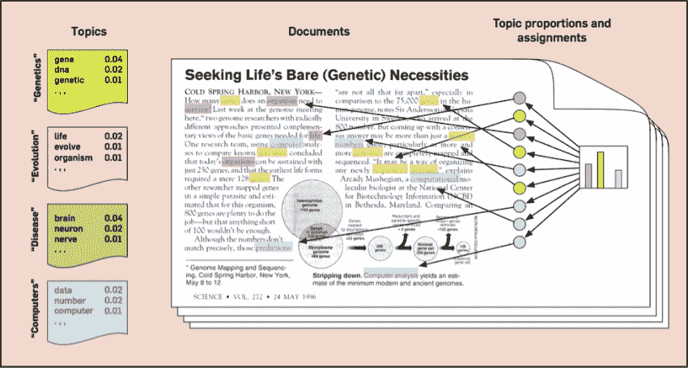
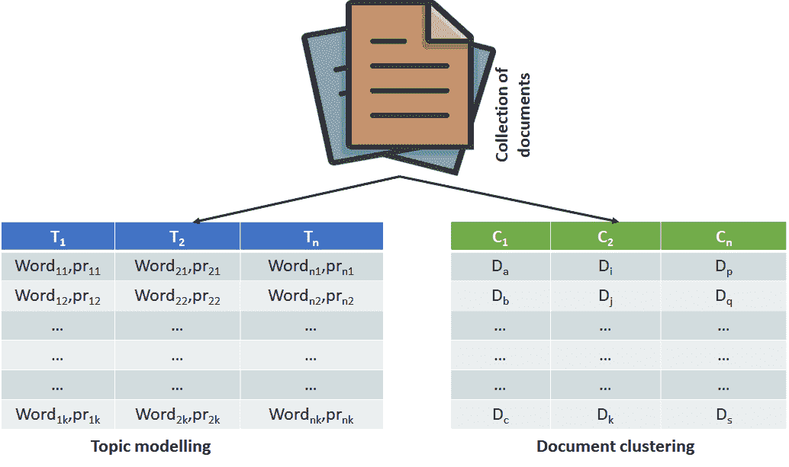
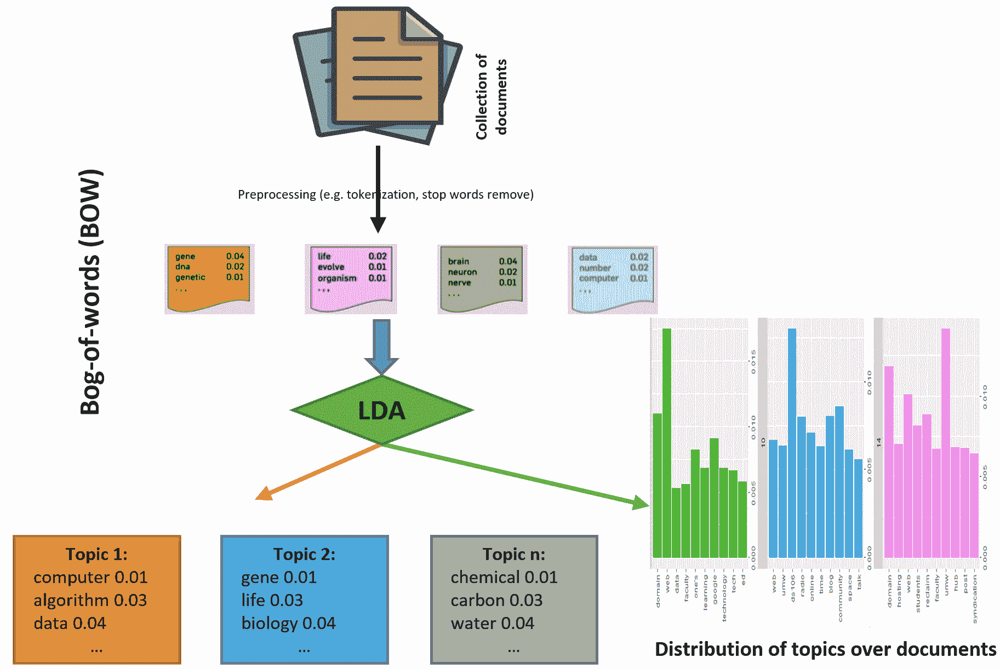
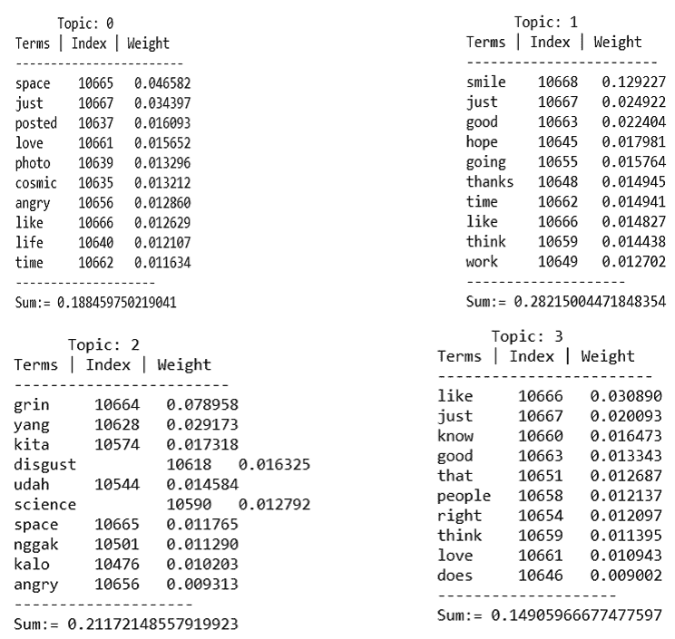
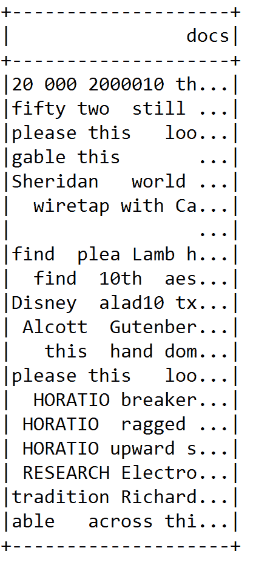
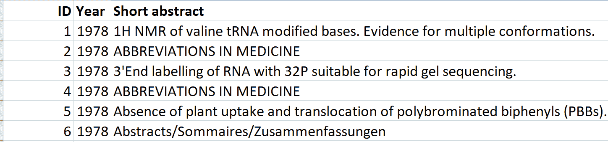
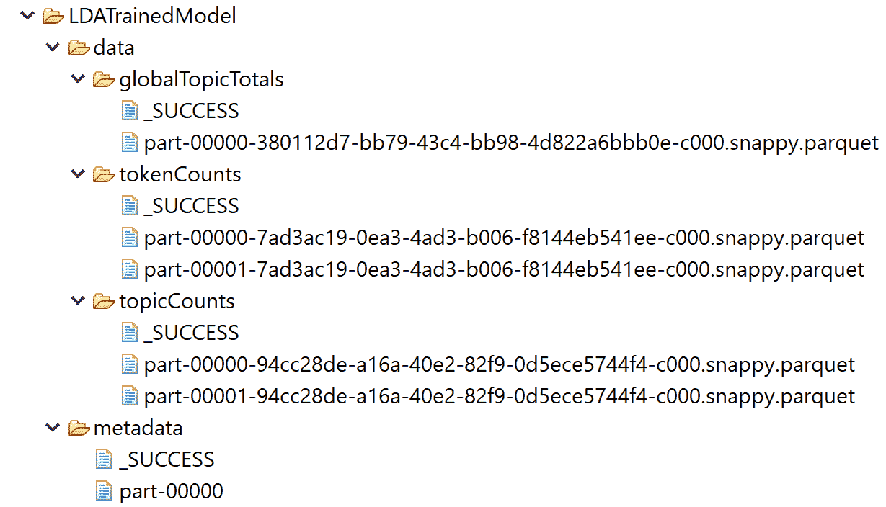

<title>Topic Modeling - A Better Insight into Large-Scale Texts</title> 

# 主题建模——对大规模文本的更好理解

主题建模是一种广泛用于从大量文档中挖掘文本的技术。然后，这些主题可以用于总结和组织包含主题术语及其相对权重的文档。这个项目将使用的数据集只是普通的非结构化文本格式。

我们将看到如何有效地使用**潜在狄利克雷分配** ( **LDA** )算法在数据中寻找有用的模式。我们将比较其他 TM 算法和 LDA 的可伸缩性。此外，我们将利用**自然语言处理** ( **NLP** )库，比如斯坦福 NLP。

简而言之，在这个端到端项目中，我们将学习以下主题:

*   主题建模和文本聚类
*   LDA 算法是如何工作的？
*   使用 LDA、Spark MLlib 和标准 NLP 进行主题建模
*   其他主题模型和 LDA 的可扩展性测试
*   模型部署

<title>Topic modeling and text clustering</title> 

# 主题建模和文本聚类

在 TM 中，主题由词的簇定义，簇中的每个词具有给定主题的出现概率，并且不同的主题具有它们各自的词簇以及相应的概率。不同的主题可以共享一些单词，一个文档可以有多个相关的主题。简而言之，我们有一个文本数据集的集合，也就是一组文本文件。现在具有挑战性的部分是使用 LDA 找到有用的数据模式。

有一种流行的基于 LDA 的 TM 方法，其中每个文档被认为是主题的混合，并且文档中的每个单词被认为是从文档的主题中随机抽取的。主题被认为是隐藏的，必须通过分析联合分布来揭示，以计算隐藏变量(主题)的条件分布，给定文档中观察到的变量和单词。TM 技术广泛用于从大量文档中挖掘文本的任务中。这些主题可用于总结和组织包含主题术语及其相对权重的文档(参见*图 1* ):



图 1:简明的 TM(资料来源:Blei，D.M .等人，概率主题模型，ACM 通讯，55(4(，77-84，2012))

由于上图中可以看到的主题数量远小于与文档集合相关联的词汇表，因此主题空间表示也可以视为一个降维过程:



图 2: TM 与文本聚类

与 TM 相反，在文档聚类中，基本思想是基于众所周知的相似性度量将文档分组到不同的组中。为了执行分组，每个文档由表示分配给文档中单词的权重的向量来表示。

通常使用术语频率-逆文档频率来执行加权(也称为 **TF-IDF** 方案)。聚类的最终结果是一个聚类列表，每个文档都出现在其中一个聚类中。下图说明了 TM 和文本聚类之间的基本区别:

<title>How does LDA algorithm work?</title> 

# LDA 算法是如何工作的？

LDA 是一个主题模型，它从一组文本文档中推断出主题。LDA 可以被认为是一种聚类算法，其中主题对应于聚类中心，文档对应于数据集中的示例(行)。主题和文档都存在于特征空间中，其中特征向量是单词计数(单词包)的向量。LDA 不是使用传统的距离来估计聚类，而是使用基于文本文档如何生成的统计模型的函数(参见图 3 ):



图 LDA 算法在一组文档上的工作原理

特别是，我们想从大量的文本中讨论人们谈论最多的话题。自从 Spark 1.3 发布以来，MLlib 支持 LDA，这是在文本挖掘和 NLP 领域最成功使用的 TM 技术之一。

而且 LDA 也是第一个采用 Spark GraphX 的 MLlib 算法。在我们正式开始 TM 应用之前，以下术语值得了解:

*   词汇的一个元素
*   `"token"`:出现在文档中的术语的实例
*   `"topic"`:代表一些概念的词的多项式分布

Spark 中开发的基于 RDD 的 LDA 算法是为文本文档设计的主题模型。它基于 LDA 的原始论文(期刊版):Blei，Ng 和 Jordan，*潜在狄利克雷分配*，JMLR，2003 年。

这个实现通过`setOptimizer`函数支持不同的推理算法。`EMLDAOptimizer`使用对似然函数的**期望最大化** ( **EM** )来学习聚类，并产生综合结果，而`OnlineLDAOptimizer`使用迭代小批量采样进行在线变分推断，并且通常是记忆友好的。

EM 是一种逼近最大似然函数的迭代方法。在实际中，当输入数据不完整，有缺失数据点，或者有隐藏的潜在变量时，ML 估计可以找到`best fit`模型。

LDA 将文档集合作为字数和以下参数的向量(使用构建器模式设置):

*   `K`:主题数(即聚类中心)(默认为 10)。
*   `ldaOptimizer`:用于学习 LDA 模型的优化器，可以是`EMLDAOptimizer`或`OnlineLDAOptimizer`(默认为`EMLDAOptimizer`)。
*   `Seed`:再现性随机种子(可选)。
*   `docConcentration` : Drichilet 参数，用于主题上的优先文档分布。值越大，推断分布越平滑(默认值为- `Vectors.dense(-1)`)。
*   `topicConcentration` : Drichilet 参数，用于先验主题在术语(词)上的分布。较大的值确保推断的分布更平滑(默认值为-1)。
*   `maxIterations`:迭代次数限制(默认为 20)。
*   `checkpointInterval`:如果使用检查点(在 Spark 配置中设置)，该参数指定创建检查点的频率。如果`maxIterations`很大，使用检查点可以帮助减少磁盘上的随机文件大小，并有助于故障恢复(默认为 10)。



图 4:主题分布及其外观

让我们看一个例子。假设篮子里有 *n* 个球，它们有 *w* 种不同的颜色。现在还假设词汇表中的每个术语都有一种颜色。现在还假设词汇项分布在 *m* 个主题中。现在，篮子中每种颜色的出现频率与主题中相应术语的权重 *φ* 成正比。

然后，LDA 算法通过使每个球的大小与其对应项的权重成比例来结合项加权方案。在*图 4* 中， *n* 项拥有一个主题的总权重，例如，主题 0 到 3。图 4 显示了随机生成的推文文本的主题分布。

现在我们已经看到，通过使用 TM，我们可以在非结构化的文档集合中找到结构。一旦**发现**构造，如图*图 4* 所示，我们可以回答如下几个问题:

*   文档 X 是关于什么的？
*   文档 X 和 Y 有多相似？
*   如果我对题目 Z 感兴趣，应该先看哪些文档？

在下一节中，我们将看到一个使用基于 Spark MLlib 的 LDA 算法来回答前面问题的 TM 示例。

<title>Topic modeling with Spark MLlib and Stanford NLP</title> 

# 用 Spark MLlib 和 Stanford NLP 进行主题建模

在这一小节中，我们将介绍一种使用 Spark 的半自动 TM 技术。使用其他选项作为默认，我们在[https://GitHub . com/minghui/Twitter-LDA/tree/master/data/data 4 model/test](https://github.com/minghui/Twitter-LDA/tree/master/data/Data4Model/test)从 GitHub 下载的数据集上训练 LDA。然而，在本章后面的模型重用和部署阶段，我们将使用更多众所周知的文本数据集。

<title>Implementation</title> 

# 履行

以下步骤显示了从数据读取到打印主题的 TM，以及它们的术语权重。下面是 TM 管道的简短工作流程:

```
object topicmodelingwithLDA {
 def main(args: Array[String]): Unit = {
 val lda = 
 new LDAforTM() 
// actual computations are done here
 val defaultParams = Params().copy(input = "data/docs/") //Loading parameters for training
        lda.run(defaultParams) 
// Training the LDA model with the default parameters.
      }
}
```

我们还需要导入一些相关的包和库:

```
import edu.stanford.nlp.process.Morphology
import edu.stanford.nlp.simple.Document
import org.apache.log4j.{Level, Logger}
import scala.collection.JavaConversions._
import org.apache.spark.{SparkConf, SparkContext}
import org.apache.spark.ml.Pipeline
import org.apache.spark.ml.feature._
import org.apache.spark.ml.linalg.{Vector => MLVector}
import org.apache.spark.mllib.clustering.{DistributedLDAModel, EMLDAOptimizer, LDA, OnlineLDAOptimizer, LDAModel}
import org.apache.spark.mllib.linalg.{ Vector, Vectors }
import org.apache.spark.rdd.RDD
import org.apache.spark.sql.{Row, SparkSession}
```

对 TM 的实际计算是在`LDAforTM`类中完成的。`Params`是一个 case 类，用于加载参数来训练 LDA 模型。最后，我们使用通过`Params`类设置的参数来训练 LDA 模型。现在，我们将通过分步源代码来广泛解释每个步骤:

<title>Step 1 - Creating a Spark session</title> 

# 步骤 1 -创建 Spark 会话

让我们通过定义计算核心的数量、SQL 仓库和应用程序名称来创建一个 Spark 会话，如下所示:

```
val spark = SparkSession
    .builder
    .master("local[*]")
    .config("spark.sql.warehouse.dir", "C:/data/")
    .appName(s"LDA")
    .getOrCreate()
```

<title>Step 2 - Creating vocabulary and tokens count to train the LDA after text pre-processing</title> 

# 步骤 2 -在文本预处理之后，创建词汇和标记计数来训练 LDA

`run()`方法采用`params`,比如输入文本、预定义的词汇大小和停用词文件:

```
def run(params: Params)
```

然后，它开始对 LDA 模型进行文本预处理，如下所示(即在`run`方法内):

```
// Load documents, and prepare them for LDA.
val preprocessStart = System.nanoTime()
val (corpus, vocabArray, actualNumTokens) = preprocess(params.input, params.vocabSize, params.stopwordFile)  
```

`Params` case 类用于定义训练 LDA 模型的参数。这是这样的:

```
//Setting the parameters before training the LDA model
case class Params(var input: String = "", var ldaModel: LDAModel = null,
    k: Int = 5,
    maxIterations: Int = 100,
    docConcentration: Double = 5,
    topicConcentration: Double = 5,
    vocabSize: Int = 2900000,
    stopwordFile: String = "data/docs/stopWords.txt",
    algorithm: String = "em",
    checkpointDir: Option[String] = None,
    checkpointInterval: Int = 100)
```

为了获得更好的结果，可以在试错的基础上设置这些参数。或者，您应该使用交叉验证来获得更好的性能。现在，如果要对当前参数进行检查点检查，会使用以下代码行:

```
if (params.checkpointDir.nonEmpty) {
    spark.sparkContext.setCheckpointDir(params.checkpointDir.get)
     }
```

`preprocess`方法用于处理原始文本。首先，让我们使用`wholeTextFiles()`方法阅读全文，如下所示:

```
val initialrdd = spark.sparkContext.wholeTextFiles(paths).map(_._2) 
initialrdd.cache()  
```

在前面的代码中，`paths`是文本文件的路径。然后，我们需要根据`lemma`文本从原始文本中准备形态 RDD，如下所示:

```
val rdd = initialrdd.mapPartitions { partition =>
 val morphology = new Morphology()
    partition.map { value => helperForLDA.getLemmaText(value, morphology) }
}.map(helperForLDA.filterSpecialCharacters)
```

这里，`helperForLDA`类中的`getLemmaText()`方法使用`filterSpaecialChatacters()`方法过滤特殊字符后提供`lemma`文本，如(`"""[! @ # $ % ^ & * ( ) _ + - − , " ' ; : . ` ? --]`)作为正则表达式。该方法如下进行:

```
def getLemmaText(document: String, morphology: Morphology) = {
 val string = 
 new StringBuilder()
 val value = 
 new Document(document).sentences().toList.flatMap { 
        a =>
 val words = a.words().toList
 val tags = a.posTags().toList
        (words zip tags).toMap.map { 
        a =>
 val newWord = morphology.lemma(a._1, a._2)
 val addedWoed = 
 if (newWord.length > 3) {
        newWord
            }
 else { "" }
        string.append(addedWoed + " ")
        }
        }
    string.toString()
} 
```

需要注意的是，`Morphology()`类通过只去除词形变化(不是派生词形)来计算英语单词的基本形式。也就是说，它只处理名词复数、代词格和动词词尾，而不处理比较级形容词或派生名词。`getLemmaText()`方法获取文档和相应的词法，并最终返回已词条化的文本。

这来自斯坦福大学 NLP 小组。要使用它，您应该在主类文件中有以下导入:`edu.stanford.nlp.process.Morphology`。在`pom.xml`文件中，您必须包含以下条目作为依赖项:

```
<dependency>
    <groupId>edu.stanford.nlp</groupId>
    <artifactId>stanford-corenlp</artifactId>
    <version>3.6.0</version>
</dependency>
<dependency>
    <groupId>edu.stanford.nlp</groupId>
    <artifactId>stanford-corenlp</artifactId>
    <version>3.6.0</version>
    <classifier>models</classifier>
</dependency>
```

`filterSpecialCharacters()`如下所示:

```
def filterSpecialCharacters(document: String) = document.replaceAll("""[! @ # $ % ^ & * ( ) _ + - − , " ' ; : . ` ? --]""", " ")
```

移除特殊字符的 RDD 后，我们可以创建一个数据框架来构建文本分析管道:

```
rdd.cache()
initialrdd.unpersist()
val df = rdd.toDF("docs")
df.show() 
```

DataFrame 只包含文档标签。数据帧的快照如下:


Figure 5: Raw texts from the input dataset

现在，如果你仔细观察前面的数据帧，你会发现我们仍然需要对它们进行标记。此外，数据帧中还有停用词，比如 this、with 等等，所以我们也需要删除它们。首先，让我们使用`RegexTokenizer` API 来标记它们，如下所示:

```
val tokenizer = new RegexTokenizer()
                .setInputCol("docs")
                .setOutputCol("rawTokens")
```

现在让我们删除所有停用词，如下所示:

```
val stopWordsRemover = new StopWordsRemover()
                        .setInputCol("rawTokens")
                        .setOutputCol("tokens")
stopWordsRemover.setStopWords(stopWordsRemover.getStopWords ++ customizedStopWords)
```

此外，我们还需要应用计数向量来从标记中只找到重要的特征。这将有助于使管道链成为管道阶段。让我们这样做:

```
val countVectorizer = new CountVectorizer()
                    .setVocabSize(vocabSize)
                    .setInputCol("tokens")
                    .setOutputCol("features")
```

当先验字典不可用时，`CountVectorizer`可以用作估计器来提取词汇并生成`CountVectorizerModel`。换句话说，`CountVectorizer`用于将一组文本文档转换成令牌(即术语)计数的向量。`CountVectorizerModel`为词汇表中的文档生成稀疏表示，然后可以将它提供给 LDA。从技术上讲，当调用`fit()`方法进行拟合时，`CountVectorizer`将选择语料库中按词频排序的前`vocabSize`个单词。

现在，通过链接转换器(tokenizer、`stopWordsRemover`和`countVectorizer`)来创建管道，如下所示:

```
val pipeline = new Pipeline().setStages(Array(tokenizer, stopWordsRemover, countVectorizer)) 
```

现在，让我们针对词汇和令牌数量来调整和转换管道:

```
val model = pipeline.fit(df)
val documents = model.transform(df).select("features").rdd.map {
 case Row(features: MLVector) => Vectors.fromML(features)
    }.zipWithIndex().map(_.swap) 
```

最后，返回词汇表和令牌计数对，如下所示:

```
(documents, model.stages(2).asInstanceOf[CountVectorizerModel].vocabulary, documents.map(_._2.numActives).sum().toLong) Now let's see the statistics of the training data: 

println() println("Training corpus summary:") 
println("-------------------------------")
println("Training set size: " + actualCorpusSize + " documents")
println("Vocabulary size: " + actualVocabSize + " terms")
println("Number of tockens: " + actualNumTokens + " tokens")
println("Preprocessing time: " + preprocessElapsed + " sec")
println("-------------------------------")
println()
>>>
Training corpus summary:
-------------------------------
Training set size: 19 documents
Vocabulary size: 21611 terms
Number of tockens: 75784 tokens
Preprocessing time: 46.684682086 sec
```

<title>Step 3 - Instantiate the LDA model before training</title> 

# 步骤 3 -在训练之前实例化 LDA 模型

在开始使用以下代码训练 LDA 模型之前，让我们先实例化它:

```
val lda = new LDA() 
```

<title>Step 4 - Set the NLP optimizer</title> 

# 步骤 4 -设置 NLP 优化器

为了从 LDA 模型获得更好和优化的结果，我们需要设置包含 LDA 算法的优化器，并执行存储内部数据结构(例如，图或矩阵)和算法的其他参数的实际计算。

这里我们使用了`EMLDAOPtimizer`优化器。您也可以使用`OnlineLDAOptimizer()`优化器。`EMLDAOPtimizer`存储一个*数据+参数*图，加上算法参数。底层实现使用 EM。

首先，让我们通过将`(1.0 / actualCorpusSize)`和一个非常低的学习率(即 0.05)添加到`MiniBatchFraction`来实例化`EMLDAOptimizer`，以在一个像我们这样的小数据集上收敛训练，如下所示:

```
val optimizer = params.algorithm.toLowerCase 
 match {
 case "em" => 
 new EMLDAOptimizer
// add (1.0 / actualCorpusSize) to MiniBatchFraction be more robust on tiny datasets.
 case "online" => 
 new OnlineLDAOptimizer().setMiniBatchFraction(0.05 + 1.0 / actualCorpusSize)
 case _ => 
 thrownew IllegalArgumentException("Only em, online are supported but got 
            ${params.algorithm}.")
    } 
```

现在，使用 LDA API 中的`setOptimizer()`方法设置优化器，如下所示:

```
lda.setOptimizer(optimizer)
    .setK(params.k)
    .setMaxIterations(params.maxIterations)
    .setDocConcentration(params.docConcentration)
    .setTopicConcentration(params.topicConcentration)
    .setCheckpointInterval(params.checkpointInterval)
```

<title>Step 5 - Training the LDA model</title> 

# 步骤 5 -训练 LDA 模型

让我们使用训练语料库开始训练 LDA 模型，并如下跟踪训练时间:

```
val startTime = System.nanoTime()
ldaModel = lda.run(corpus)

val elapsed = (System.nanoTime() - startTime) / 1e9
println("Finished training LDA model. Summary:")
println("Training time: " + elapsed + " sec")
```

此外，现在我们可以保存训练好的模型，以备将来重复使用，如下所示:

```
//Saving the model for future use
params.ldaModel.save(spark.sparkContext, "model/LDATrainedModel")
```

请注意，一旦您完成了训练并获得了最佳的训练，在部署模型之前取消对前面一行的注释。否则，它会在模型重用阶段抛出一个异常而停止。

对于我们现有的文本，LDA 模型花了 6.309715286 秒来训练。注意这些时间代码是可选的。在此，我们提供这些数据仅供参考，以便了解培训时间:

<title>Step 6 - Prepare the topics of interest</title> 

# 步骤 6 -准备感兴趣的话题

准备前 5 个主题，每个主题有 10 个术语。包括术语及其相应的权重:

```
val topicIndices = ldaModel.describeTopics(maxTermsPerTopic = 10)
println(topicIndices.length)
val topics = topicIndices.map {
 case (terms, termWeights) => terms.zip(termWeights).map {
 case (term, weight) => (vocabArray(term.toInt), weight) 
   }
}
```

<title>Step 7 - Topic modelling </title> 

# 步骤 7 -主题建模

打印前 10 个主题，显示每个主题的权重最高的术语。此外，包括每个主题的总重量，如下所示:

```
var sum = 0.0
println(s"${params.k} topics:")
topics.zipWithIndex.foreach {
 case (topic, i) =>
        println(s"TOPIC $i")
        println("------------------------------")
        topic.foreach {
 case (term, weight) =>
        term.replaceAll("\s", "")
        println(s"$termt$weight")
        sum = sum + weight
    }
println("----------------------------")
println("weight: " + sum)
println()
```

现在让我们来看看我们的 LDA 模型对主题建模的输出:

```
 5 topics:
 TOPIC 0
 ------------------------------
 come 0.0070183359426213635
 make 0.006893251344696077
 look 0.006629265338364568
 know 0.006592594912464674
 take 0.006074234442310174
 little 0.005876330712306203
 think 0.005153843469004155
 time 0.0050685675513282525
 hand 0.004524837827665401
 well 0.004224698942533204
 ----------------------------
 weight: 0.05805596048329406
 TOPIC 1
 ------------------------------
 thus 0.008447268016707914
 ring 0.00750959344769264
 fate 0.006802070476284118
 trojan 0.006310545607626158
 bear 0.006244268350438889
 heav 0.005479939900136969
 thro 0.005185211621694439
 shore 0.004618008184651363
 fight 0.004161178536600401
 turnus 0.003899151842042464
 ----------------------------
 weight: 0.11671319646716942
 TOPIC 2
 ------------------------------
 aladdin 7.077183389325728E-4
 sultan 6.774311890861097E-4
 magician 6.127791175835228E-4
 genie 6.06094509479989E-4
 vizier 6.051618911188781E-4
 princess 5.654756758514474E-4
 fatima 4.050749957608771E-4
 flatland 3.47788388834721E-4
 want 3.4263963705536023E-4
 spaceland 3.371784715458026E-4
 ----------------------------
 weight: 0.1219205386824187
 TOPIC 3
 ------------------------------
 aladdin 7.325869707607238E-4
 sultan 7.012354862373387E-4
 magician 6.343184784726607E-4
 genie 6.273921840260785E-4
 vizier 6.264266945018852E-4
 princess 5.849046214967484E-4
 fatima 4.193089052802858E-4
 flatland 3.601371993827707E-4
 want 3.5398019331108816E-4
 spaceland 3.491505202713831E-4
 ----------------------------
 weight: 0.12730997993615964
 TOPIC 4
 ------------------------------
 captain 0.02931475169407467
 fogg 0.02743105575940755
 nautilus 0.022748371008515483
 passepartout 0.01802140608022664
 nemo 0.016678258146358142
 conseil 0.012129894049747918
 phileas 0.010441664411654412
 canadian 0.006217638883315841
 vessel 0.00618937301246955
 land 0.00615311666365297
 ----------------------------
 weight: 0.28263550964558276
```

从前面的输出中，我们可以看到输入文档的主题 5 在`0.28263550964558276`处最重要。本主题讨论诸如`captain`、`fogg`、`nemo`、`vessel`和`land`等术语。

<title>Step 8 - Measuring the likelihood of two documents</title> 

# 步骤 8 -测量两个文档的可能性

现在要获得更多的统计数据，比如文档的最大似然或对数似然，我们可以使用下面的代码:

```
if (ldaModel.isInstanceOf[DistributedLDAModel]) {
 val distLDAModel = ldaModel.asInstanceOf[DistributedLDAModel]
 val avgLogLikelihood = distLDAModel.logLikelihood / actualCorpusSize.toDouble
    println("The average log likelihood of the training data: " +
avgLogLikelihood)
    println()
}
```

前面的代码计算 LDA 模型的平均对数似然，作为 LDA 模型的分布式版本的实例:

```
The average log likelihood of the training data: -209692.79314860413
```

有关可能性测量的更多信息，感兴趣的读者应该参考[https://en.wikipedia.org/wiki/Likelihood_function](https://en.wikipedia.org/wiki/Likelihood_function)。

现在假设我们已经为文档 X 和 y 计算了前面的度量，那么我们可以回答下面的问题:

*   文档 X 和 Y 有多相似？

问题是，我们应该尝试从所有的训练文档中获取最低的可能性，并将其作为之前比较的阈值。最后，回答第三个也是最后一个问题:

*   如果我对题目 Z 感兴趣，应该先看哪些文档？

一个简单的答案:仔细看看主题分布和相对术语权重，我们可以决定我们应该首先阅读哪个文档。

<title>Other topic models versus the scalability of LDA</title> 

# 其他主题模型与 LDA 的可伸缩性

在这个端到端项目中，我们使用了 LDA，它是用于文本挖掘的最流行的 TM 算法之一。我们可以使用更健壮的 TM 算法，例如**概率潜在情感分析** ( **pLSA** )、**弹球分配模型** ( **PAM** )和**分级 Drichilet 过程** ( **HDP** )算法。

然而，pLSA 存在过拟合问题。另一方面，HDP 和 PAM 都是用于复杂文本挖掘的更复杂的 TM 算法，例如从高维文本数据或非结构化文本的文档中挖掘主题。最后，非负矩阵分解是在文档集合中查找主题的另一种方法。不管采用哪种方法，所有 TM 算法的输出都是带有相关单词簇的主题列表。

前面的示例显示了如何使用 LDA 算法作为独立的应用程序来执行 TM。LDA 的并行化并不简单，已经有许多研究论文提出了不同的策略。这方面的主要障碍是所有方法都涉及大量的通信。

根据 Databricks 网站上的博客([https://data bricks . com/blog/2015/03/25/topic-modeling-with-LDA-ml lib-meets-graphx . html](https://databricks.com/blog/2015/03/25/topic-modeling-with-lda-mllib-meets-graphx.html))，以下是实验期间使用的数据集和相关训练和测试集的统计数据:

*   **训练集规模**:460 万文档
*   **词汇量**:110 万个词汇
*   **训练集规模**:11 亿令牌(~239 字/文档)
*   100 个话题
*   16-worker EC2 集群，例如 M4 .大型或 M3 .中型，具体取决于预算和要求

对于前面的设置，10 次迭代的计时结果平均为 176 秒/迭代。从这些统计数据中，很明显 LDA 对于大量的语料库也是相当可扩展的。

<title>Deploying the trained LDA model</title> 

# 部署训练好的 LDA 模型

对于这个迷你部署，让我们使用一个真实的数据集:PubMed。包含 PubMed 术语的样本数据集可以从:[https://NLP . Stanford . edu/software/TMT/TMT-0.4/examples/PubMed-OA-subset . CSV](https://nlp.stanford.edu/software/tmt/tmt-0.4/examples/pubmed-oa-subset.csv)下载。这个链接实际上包含一个 CSV 格式的数据集，但是有一个奇怪的名字，`4UK1UkTX.csv`。

更具体地说，数据集包含一些生物学文章的摘要、它们的出版年份和序列号。下图给出了大概情况:



图 6:样本数据集的快照

在下面的代码中，我们已经保存了训练好的 LDA 模型以供将来使用，如下所示:

```
params.ldaModel.save(spark.sparkContext, "model/LDATrainedModel")
```

训练好的模型将被保存到前面提到的位置。该目录将包括有关模型和培训本身的数据和元数据，如下图所示:



图 7:训练和保存的 LDA 模型的目录结构

正如预期的那样，data 文件夹中有一些 parquet 文件，其中包含全局主题、它们的计数、令牌和它们的计数，以及主题和它们各自的计数。现在，下一个任务将是恢复相同的模型，如下所示:

```
//Restoring the model for reuse
val savedLDAModel = DistributedLDAModel.load(spark.sparkContext, "model/LDATrainedModel/")

//Then we execute the following workflow:
val lda = new LDAforTM() 
// actual computations are done here 

 // Loading the parameters to train the LDA model 
val defaultParams = Params().copy(input = "data/4UK1UkTX.csv", savedLDAModel)
lda.run(defaultParams) 
// Training the LDA model with the default parameters.
spark.stop()
```

```
>>>
 Training corpus summary:
 -------------------------------
 Training set size: 1 documents
 Vocabulary size: 14670 terms
 Number of tockens: 14670 tokens
 Preprocessing time: 12.921435786 sec
 -------------------------------
 Finished training LDA model.
 Summary:
 Training time: 23.243336895 sec
 The average log likelihood of the training data: -1008739.37857908
 5 topics:
 TOPIC 0
 ------------------------------
 rrb 0.015234818404037585
 lrb 0.015154125349208018
 sequence 0.008924621534990771
 gene 0.007391453509409655
 cell 0.007020265462594214
 protein 0.006479622004524878
 study 0.004954523307983932
 show 0.0040023453035193685
 site 0.0038006126784248945
 result 0.0036634344941610534
 ----------------------------
 weight: 0.07662582204885438
 TOPIC 1
 ------------------------------
 rrb 1.745030693927338E-4
 lrb 1.7450110447001028E-4
 sequence 1.7424254444446083E-4
 gene 1.7411236867642102E-4
 cell 1.7407234230511066E-4
 protein 1.7400587965300172E-4
 study 1.737407317498879E-4
 show 1.7347354627656383E-4
 site 1.7339989737227756E-4
 result 1.7334522348574853E-4
 ---------------------------
 weight: 0.07836521875668061
 TOPIC 2
 ------------------------------
 rrb 1.745030693927338E-4
 lrb 1.7450110447001028E-4
 sequence 1.7424254444446083E-4
 gene 1.7411236867642102E-4
 cell 1.7407234230511066E-4
 protein 1.7400587965300172E-4
 study 1.737407317498879E-4
 show 1.7347354627656383E-4
 site 1.7339989737227756E-4
 result 1.7334522348574853E-4
 ----------------------------
 weight: 0.08010461546450684
 TOPIC 3
 ------------------------------
 rrb 1.745030693927338E-4
 lrb 1.7450110447001028E-4
 sequence 1.7424254444446083E-4
 gene 1.7411236867642102E-4
 cell 1.7407234230511066E-4
 protein 1.7400587965300172E-4
 study 1.737407317498879E-4
 show 1.7347354627656383E-4
 site 1.7339989737227756E-4
 result 1.7334522348574853E-4
 ----------------------------
 weight: 0.08184401217233307
 TOPIC 4
 ------------------------------
 rrb 1.745030693927338E-4
 lrb 1.7450110447001028E-4
 sequence 1.7424254444446083E-4
 gene 1.7411236867642102E-4
 cell 1.7407234230511066E-4
 protein 1.7400587965300172E-4
 study 1.737407317498879E-4
 show 1.7347354627656383E-4
 site 1.7339989737227756E-4
 result 1.7334522348574853E-4
 ----------------------------
 weight: 0.0835834088801593
```

干得好！我们成功地重复使用了这个模型，并做了同样的预测。但是，可能由于数据的随机性，我们观察到了一个略有不同的预测。让我们看看完整的代码，以便获得更清晰的视图:

```
package com.packt.ScalaML.Topicmodeling
import org.apache.spark.sql.SparkSession
import org.apache.spark.mllib.clustering.{DistributedLDAModel, LDA}

object LDAModelReuse {
 def main(args: Array[String]): Unit = {
 val spark = SparkSession
                    .builder
                    .master("local[*]")
                    .config("spark.sql.warehouse.dir", "data/")
                    .appName(s"LDA_TopicModelling")
                    .getOrCreate()

//Restoring the model for reuse
 val savedLDAModel = DistributedLDAModel.load(spark.sparkContext, "model/LDATrainedModel/")
 val lda = new LDAforTM() 
// actual computations are done here
 val defaultParams = Params().copy(input = "data/4UK1UkTX.csv", savedLDAModel) 
//Loading params 
    lda.run(defaultParams) 
// Training the LDA model with the default parameters.
    spark.stop()
        }
    }
```

<title>Summary</title> 

# 摘要

在这一章中，我们已经看到了如何有效地使用和结合 LDA 算法和 NLP 库，如斯坦福大学的 NLP，从大规模文本中寻找有用的模式。我们已经看到了 TM 算法和 LDA 的可伸缩能力之间的比较分析。

最后，对于现实生活中的例子和用例，感兴趣的读者可以参考位于[https://blog . code centric . de/en/2017/01/topic-modeling-code centric-blog-articles/](https://blog.codecentric.de/en/2017/01/topic-modeling-codecentric-blog-articles/)的博客文章。

**网飞**是一家美国娱乐公司，由雷德·哈斯汀斯和马克·伦道夫于 1997 年 8 月 29 日在加利福尼亚州的斯科茨谷创立。它专门从事，提供，流媒体和视频点播，在线和 DVD 邮寄。2013 年，网飞进军电影和电视制作以及在线发行领域。网飞使用基于模型的协同过滤方法为其用户提供实时电影推荐。

在下一章中，我们将看到两个端到端的项目:一个基于项目的**协同过滤**用于电影相似性测量，一个基于模型的电影推荐引擎使用 Spark 向新用户推荐电影。我们将看到如何在这两个可伸缩的电影推荐引擎的 **ALS** 和**矩阵分解**之间进行互操作。