# 七、使用 Q 学习和 Scala Play 框架的期权交易

作为人类，我们从经验中学习。我们变得如此迷人并非偶然。多年来积极的赞美和消极的批评都帮助我们塑造了今天的我们。我们通过尝试不同的肌肉运动来学习如何骑自行车，直到它发出咔嗒声。当你采取行动时，你有时会立即得到回报。这都是关于**强化学习** ( **RL** )。

这一章是关于设计一个由批评和奖励驱动的机器学习系统。我们将看到如何将 RL 算法应用于现实数据集上的预测模型。

从交易的角度来看，期权是一种赋予其所有者在固定日期(到期日)或之前以固定价格(执行价格)购买(看涨期权)或出售(看跌期权)金融资产(标的)的权利的合同。

我们将看到如何使用一种叫做 **QLearning** 的 RL 算法来开发这种期权交易的现实应用。更准确地说，我们将解决期权交易中计算最佳策略的问题，我们希望在给定一些市场条件和交易数据的情况下交易某些类型的期权。

IBM 股票数据集将用于设计一个由批评和奖励驱动的机器学习系统。我们将从 RL 及其理论背景开始，这样概念更容易掌握。最后，我们将使用 Scala Play 框架将整个应用程序包装成一个 web 应用程序。

简而言之，在这个端到端项目中，我们将学习以下主题:

*   使用 Q 学习——一种 RL 算法
*   期权交易——到底是怎么回事？
*   技术概述
*   在期权交易中实施 Q 学习
*   使用 Scala Play 框架将应用包装成 web 应用
*   模型部署


# 强化与监督和非监督学习

监督学习和非监督学习出现在光谱的两端，而 RL 存在于中间。它不是监督学习，因为训练数据来自于在探索和利用之间做出决定的算法。此外，它不是无监督的，因为算法从环境中接收反馈。只要你处于在一个状态下执行一个动作产生奖励的情况下，你就可以使用 RL 来发现一个好的动作序列，以获得最大的预期奖励。

RL 代理的目标是最大化它最终获得的总回报。第三个主要子元素是`value`函数。虽然奖励决定了状态的即时可取性，但是值指示了状态的长期可取性，考虑了可能跟随的状态以及这些状态中的可用奖励。根据所选的策略指定`value`功能。在学习阶段，代理尝试确定具有最高值的状态的动作，因为这些动作最终将获得最佳数量的奖励。


# 使用 RL

*图 1* 显示一个人做出到达目的地的决定。此外，假设在你从家开车去上班的路上，你总是选择相同的路线。然而，有一天你的好奇心占了上风，你决定尝试一条不同的道路，希望缩短通勤距离。这种尝试新路线或坚持最知名路线的困境是探索与开发的一个例子:

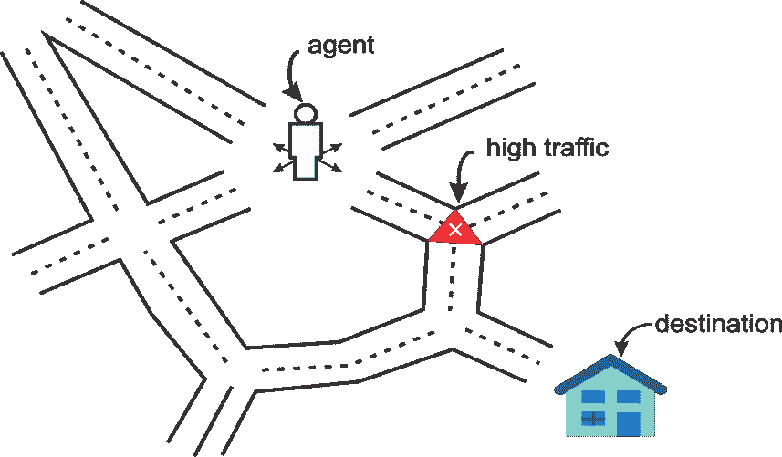

图 1:代理总是试图通过路线到达目的地

RL 技术正在许多领域得到应用。目前正在追求的一个普遍想法是创建一个除了任务描述之外不需要任何东西的算法。当这种性能实现后，它将被应用到几乎所有地方。


# RL 中的符号、策略和效用

你可能会注意到，RL 的行话包括将算法具体化为在某些情况下采取行动以获得奖励。事实上，算法通常被称为与环境一起行动的代理。你可以把它想象成一个智能硬件代理，它通过传感器进行感知，并使用其执行器与环境进行交互。因此，许多 RL 理论应用于机器人领域并不令人惊讶。现在，为了进一步扩展我们的讨论，我们需要了解一些术语:

*   **环境**:环境是任何具有状态和在不同状态之间转换的机制的系统。例如，机器人的环境就是它工作的环境或设施。
*   代理:代理是一个与环境交互的自动化系统。
*   **状态**:环境或系统的状态是完全描述环境的变量或特征的集合。
*   **目标**:目标是提供比任何其他状态更高的折扣累积奖励的状态。高累积奖励防止最佳策略依赖于训练期间的初始状态。
*   **动作**:动作定义了状态之间的转换，其中代理负责执行或者至少建议一个动作。在执行一个动作时，代理从环境中收集奖励(或惩罚)。
*   **策略**:策略定义了对于环境的任何状态要执行和执行的动作。
*   **奖励**:奖励量化了代理与环境的积极或消极的相互作用。奖励本质上是学习引擎的训练集。
*   **插曲 *(*** 也称为**试炼**):这定义了从一个初始状态达到目标状态所需的步数。

我们将在本节稍后讨论更多关于策略和效用的内容。*图 2* 展示了**状态**、**动作**和**奖励**之间的相互作用。如果你从状态**s[1]开始，你可以执行动作**a[1]获得奖励 **r (s [1] ，a [1] )** 。箭头代表**动作**，圆圈代表**状态**:****

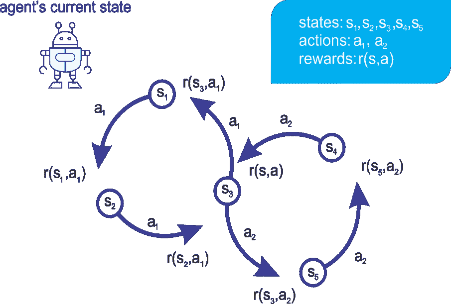

图 2:一个代理对一个状态执行一个动作，产生一个奖励

机器人执行动作以在不同状态之间改变。但是它如何决定采取哪种行动呢？嗯，这都是关于使用不同的或具体的政策。


# 政策

在 RL 的行话中，我们称一个策略为**策略**。RL 的目标是发现一个好的策略。解决这个问题的一个最常见的方法是观察每个州的行动的长期后果。短期后果很容易计算:这只是回报。尽管执行一项行动会立即产生回报，但贪婪地选择回报最高的行动并不总是一个好主意。这也是生活中的一课，因为从长远来看，最直接的最佳做法可能并不总是最令人满意的。可能的最佳策略称为最优策略，它通常是 RL 的圣杯，如图*图 3* 所示，它显示了给定任何状态下的最优操作:

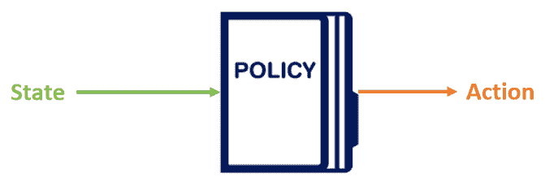

图 3:策略定义了在给定状态下要采取的动作

我们已经看到一种策略，其中代理人总是选择具有最大即时回报的行动，称为**贪婪策略**。策略的另一个简单例子是任意选择一个动作，称为**随机策略**。如果你想出一个策略来解决一个 RL 问题，仔细检查你所学的策略是否比随机策略和贪婪策略表现得更好通常是一个好主意。

此外，我们将看到如何开发另一种称为**策略梯度**的稳健策略，其中神经网络通过使用来自环境的反馈通过梯度下降调整其权重来学习拣选动作的策略。我们将会看到，尽管两种方法都被使用，政策梯度更加直接和乐观。


# 效用

长期回报被称为**效用**。事实证明，如果我们知道对一个状态执行一个动作的效用，那么就很容易求解 RL。例如，要决定采取哪种行动，我们只需选择产生最高效用的行动。然而，揭示这些效用价值是困难的。在状态 *s* 执行动作 *a* 的效用被写成函数 *Q(s，a)* ，称为**效用函数**。这预测了预期的即时回报，以及在给定状态-行动输入的情况下遵循最优策略的回报，如图*图 4* 所示:

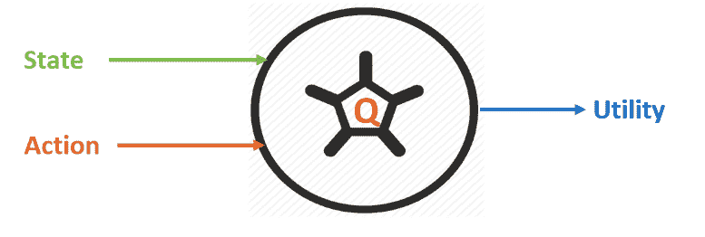

图 4:使用一个效用函数

大多数 RL 算法归结为三个主要步骤:推断、执行和学习。在第一步中，算法使用迄今为止的知识选择给定状态( *s* )的最佳动作( *a* )。接下来，它执行动作以找出奖励( *r* )以及下一个状态(*s’*)。然后，它利用新获得的知识 *(s，r，a，s’)*提高对世界的理解。然而，我想你会同意，这只是一种计算效用的幼稚方法。

现在的问题是:有什么更可靠的方法来计算它呢？我们可以通过递归地考虑未来动作的效用来计算特定状态-动作对 *(s，a)* 的效用。你当前行动的效用不仅受到直接回报的影响，还受到下一个最佳行动的影响，如下式所示:

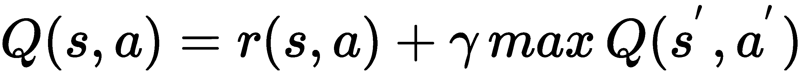

*s'* 表示下一个状态， *a'* 表示下一个动作。在状态 *s* 中采取行动 *a* 的回报由 *r(s，a)* 表示。这里， *γ* 是一个你可以选择的超参数，叫做折现因子。如果 *γ* 为 *0* ，那么代理人选择最大化即时奖励的行动。较高的 *γ* 值将使代理更加重视考虑长期后果。实际上，我们有更多这样的超参数需要考虑。例如，如果期望真空吸尘器机器人快速学习解决任务，但不一定是最优的，我们可能希望设置更快的学习速率。

或者，如果允许机器人有更多的时间去探索和利用，我们可能会降低学习速度。让我们称学习率为 *α* ，并如下改变我们的效用函数(注意，当 *α = 1* 时，两个等式是相同的):

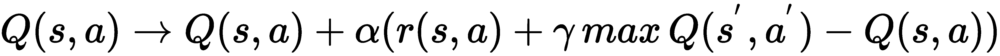

总之，如果我们知道这个 *Q(s，a)* 函数，就可以解决一个 RL 问题。这里有一个算法叫做 Q-learning。


# 一个简单的 Q 学习实现

Q-learning 是一种算法，可用于金融和市场交易应用，如期权交易。一个原因是最好的政策是通过训练产生的。也就是说，RL 定义了 Q-learning 中随时间变化的模型，并且随着任何新的情节而不断更新。Q-learning 是一种优化(累积)折扣奖励的方法，使远未来的奖励不如近期奖励优先；Q-learning 是一种无模型 RL 形式。也可以看作是异步**动态编程** ( **DP** )的一种方法。

它为代理人提供了通过体验行动的后果来学习在马尔可夫域中最优行动的能力，而不需要他们建立域的地图。简而言之，Q-learning 是一种 RL 技术，因为它不严格要求标记数据和训练。此外，Q 值不必是连续的、可微的函数。

另一方面，马尔可夫决策过程提供了一个数学框架，用于在结果部分是随机的，部分在决策者控制下的情况下对决策进行建模。其中，随机变量在未来时间点的概率仅取决于当前时间点的信息，而不取决于任何历史值。换句话说，概率与历史状态无关。


# Q 学习算法的组成部分

这个实现的灵感很大程度上来源于一本书中的 Q-learning 实现，作者 Patrick R. Nicolas，*Scala for Machine Learning-Second Edition*，Packt Publishing Ltd .，2017 年 9 月。感谢作者和 Packt Publishing Ltd .源代码可在[https://github . com/Packt Publishing/Scala-for-Machine-Learning-Second-Edition/tree/master/src/main/Scala/org/Scala ml/reinforcement](https://github.com/PacktPublishing/Scala-for-Machine-Learning-Second-Edition/tree/master/src/main/scala/org/scalaml/reinforcement)获得。

感兴趣的读者可以看看原始实现的扩展版本，当然可以从本书的 Packt repository 或 GitHub repo 下载。Q-learning 算法实现的关键组件是几个类— `QLearning`、`QLSpace`、`QLConfig`、`QLAction`、`QLState`、`QLIndexedState`和`QLModel`—如下所述:

*   `QLearning`:实现训练和预测方法。它使用类型`QLConfig`的配置定义了类型`ETransform`的数据转换。
*   `QLConfig`:这个参数化类定义了 Q-learning 的配置参数。更具体地说，它用于保存来自用户的显式配置。
*   `QLAction` **:** 这是一个定义在源状态和多个目的状态之间的动作的类。
*   `QLPolicy`:这是一个枚举器，用于定义在 Q-learning 模型训练过程中用于更新策略的参数类型。
*   `QLSpace`:这有两个组成部分:一个`QLState`类型的状态序列和序列中一个或多个目标状态的标识符`id`。
*   `QLState`:包含一系列`QLAction`实例，帮助从一种状态转换到另一种状态。它还用作要评估和预测其状态的对象或实例的参考。
*   `QLIndexedState`:这个类返回一个索引状态，它将搜索中的一个状态索引到目标状态。
*   `QLModel`:用于通过训练过程生成模型。最终，它包含了最佳策略和模型的准确性。

注意，除了前面的组件之外，可选的约束函数限制了从当前状态搜索下一个最有价值的动作的范围。下图显示了 Q-learning 算法的关键组件及其交互:

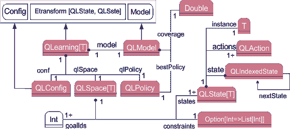

图 QLearning 算法的组件及其交互


# 学习中的状态和行为

`QLAction`类指定从一种状态到另一种状态的转换。它有两个参数，即 from 和 to。它们都有自己的整数标识符，需要大于 0:

*   `from`:动作的来源
*   `to`:动作目标

签名如下所示:

```scala
case class QLAction(from: Int, to: Int) {
    require(from >= 0, s"QLAction found from: 
    $from required: >=0")require(to >= 0, s"QLAction found to: 
    $to required: >=0")

override def toString: String = s"n
    Action: state 
    $from => state $to"
}
```

`QLState`类定义了 Q 学习中的状态。它需要三个参数:

*   `id`:唯一识别状态的标识符
*   `actions`:从该状态到其他状态的转换的动作列表，
*   `instance`:状态可能具有`T`类型的属性，独立于状态转换

下面是该类的签名:

```scala
case class QLState[T](id: Int, actions: Seq[QLAction] = List.empty, instance: T) {
 import QLState._check(id)
 final def isGoal: Boolean = actions.nonEmpty
 override def toString: String =s"state: $id ${actions.mkString(" ")
        }
    nInstance: ${instance.toString}"
}
```

在前面的代码中，`toString()`方法用于 Q-learning 中状态的文本表示。状态由它的 ID 和它可能触发的动作列表来定义。

国家可能没有任何行动。这通常是目标或吸收状态的情况。在这种情况下，列表是空的。参数化实例是对为其计算状态的对象的引用。

现在我们知道了要执行的状态和操作。然而，`QLearning`代理需要知道表单的搜索空间(States *x* Actions)。下一步是创建图形或搜索空间。


# 搜索空间

搜索空间是负责任何状态序列的容器。`QLSpace`类定义了 Q 学习算法的搜索空间(状态 *x* 动作)，如下图所示:

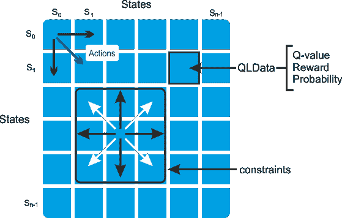

图 6:带 QLData 的状态转移矩阵(Q 值、回报、概率)

搜索空间可以由终端用户提供状态和动作的列表，或者通过采用以下参数提供状态的数量来自动创建:

*   `States`:在 Q 学习搜索空间中定义的所有可能状态的序列
*   `goalIds`:作为目标的状态的标识符列表

现在让我们看看这个类的实现。这是一个相当大的代码块。所以让我们从生成名为`statesMap`的地图的构造函数开始。它使用它的`id`和目标数组`goalStates`检索状态:

```scala
private[scalaml] class QLSpace[T] protected (states: Seq[QLState[T]], goalIds: Array[Int]) {
 import QLSpace._check(states, goalIds)
```

然后，它创建一个状态映射，作为状态 ID 和状态实例的不可变映射:

```scala
private[this] val statesMap: immutable.Map[Int, QLState[T]] = states.map(st => (st.id, st)).toMap
```

现在我们有了一个策略和一个动作的状态，下一个任务是计算给定状态和策略的最大值:

```scala
final def maxQ(state: QLState[T], policy: QLPolicy): Double = {
 val best=states.filter(_ != state).maxBy(st=>policy.EQ(state.id, st.id))policy.EQ(state.id, best.id)
    }
```

此外，我们需要通过访问搜索空间中的状态数来了解状态数:

```scala
final def getNumStates: Int = states.size
```

然后，`init`方法选择用于训练剧集的初始状态。如果`state0`参数无效，则随机选择状态:

```scala
def init(state0: Int): QLState[T] =
 if (state0 < 0) {
 val r = new Random(System.currentTimeMillis 
                + Random.nextLong)states(r.nextInt(states.size - 1))
        } 
 else states(state0)
```

最后，`nextStates`方法检索与该状态相关的所有动作的执行所产生的状态列表。搜索空间`QLSpace`由`QLSpace`伴随对象中定义的工厂方法`apply`创建，如下所示:

```scala
final def nextStates(st: QLState[T]): Seq[QLState[T]] =
 if (st.actions.isEmpty)Seq.empty[QLState[T]]
 else st.actions.flatMap(ac => statesMap.get(ac.to))
```

此外，您如何知道当前状态是否是目标状态？嗯，`isGoal()`方法可以达到这个目的。

它接受一个名为`state` *，*的参数，该参数是针对目标测试的*状态，如果该状态是目标状态，则返回`Boolean: true`；否则，它返回 false:*

```scala
final def isGoal(state: QLState[T]): Boolean = goalStates.contains(state.id)
```

apply 方法使用实例集、目标和约束函数`constraints`作为输入来创建状态列表。每个状态创建它的动作列表。从这个状态到任何其他状态都会产生动作:

```scala
def apply[T](goal: Int,instances: Seq[T],constraints: Option[Int => List[Int]]): QLSpace[T] =             
    apply(Array[Int](goal), instances, constraints)
```

功能约束限制了可以从任何给定状态触发的动作的范围，如图 x 所示。


# 政策和行动价值

`QLData` 类通过创建一个`QLData`记录或实例来封装 Q-learning 算法中的策略属性，该记录或实例具有在训练期间计算和更新的给定奖励、概率和 Q 值。概率变量用于为要执行的动作的干预条件建模。

如果该动作没有任何外部约束，则概率为 1(即最高)，否则为零(即无论如何不允许该动作)。签名如下所示:

```scala
final private[scalaml] class QLData(
 val reward: Double, 
 val probability: Double = 1.0) {

 import QLDataVar._
 var value: Double = 0.0
    @inline final def estimate: Double = value * probability

 final def value(varType: QLDataVar): Double = varType 
 match {
 case REWARD => reward
 case PROB => probability
 case VALUE => value
            }
override def toString: String = s"nValue= $value Reward= $reward Probability= $probability"}
```

在前面的代码块中，Q 值在训练期间使用 Q-learning 公式进行更新，但总体值是通过使用其奖励来计算的，并根据其概率进行调整，然后返回调整后的值。然后,`value()`方法使用 Q-learning 策略的类型选择其元素的属性。它获取属性的`varType`(即`REWARD`、`PROBABILITY`和`VALUE`)并返回该属性的值。

最后，`toString()`方法有助于表示价值、回报和概率。既然我们知道了数据将如何操作，下一个任务就是创建一个简单的模式，初始化与每个动作相关的回报和概率。下面的 Scala 案例是一个名为`QLInput`的类；它输入到 Q 学习搜索空间(`QLSpace`)和策略(`QLPolicy`):

```scala
case class QLInput(from: Int, to: Int, reward: Double = 1.0, prob: Double = 1.0)
```

在前面的签名中，构造函数为 Q-learning 创建了一个动作输入。它需要四个参数:

*   `from`，源状态的标识符
*   `to`，目标或目的状态的标识符
*   `reward`，这是从 id 为`from`的状态转换到 id 为`to`的状态的积分或罚分
*   prob，从状态`from`转换到状态`to`的概率

在前面的类中，`from`和`to`参数用于特定的动作，但最后两个参数分别是完成动作时收集的奖励及其概率。这两个动作都有奖励，默认情况下概率为 1。简而言之，我们只需要为具有较高回报或较低概率的行动创建一个输入。

状态的数量和输入的顺序定义了类型`QLPolicy`的策略，它是一个数据容器。一个动作有一个 Q 值(也称为**动作值**)、一个奖励和一个概率。该实现在三个独立的矩阵中定义了这三个值——动作值用 *Q* ，奖励用 *R* ，概率用*P*——以便与数学公式保持一致。以下是该课程的工作流程:

1.  使用输入概率和奖励初始化策略(见`qlData`变量)。

2.  根据输入大小计算状态数(见`numStates`变量)。
3.  为从状态`from`到状态`to`的动作设置 Q 值(参见`setQ`方法)，并使用`get()`方法获取 Q 值。

4.  检索从状态`from`到状态`to`的状态转换动作的 Q 值(参见 Q 方法)。

5.  检索从状态`from`到状态`to`的状态转换动作的估计值(参见`EQ`方法)，并在`double`中返回值。
6.  检索从状态`from`到状态`to`的状态转换动作的奖励(参见 R 方法)。
7.  检索从状态`from`到状态`to`的状态转换动作的概率(参见`P`方法)。
8.  计算`Q`的最小值和最大值(参见`minMaxQ`方法)。
9.  检索转换为正值的对(索引源状态，索引目标状态)。状态的索引被转换为双精度值(见`EQ: Vector[DblPair]`方法)。
10.  使用第一种`toString()`方法获得此政策的奖励矩阵的文字描述。
11.  使用第二种`toString()`方法的以下任何一种的文本表示:Q 值、奖励或概率矩阵。
12.  使用`check()`方法验证`from`和`to`值。

现在让我们看看由前面的工作流组成的类定义:

```scala
final private[scalaml] class QLPolicy(val input: Seq[QLInput]) {
 import QLDataVar._QLPolicy.check(input)
 private[this] val qlData = input.map(qlIn => new QLData(qlIn.reward, qlIn.prob))
 private[this] val numStates = Math.sqrt(input.size).toInt

 def setQ(from: Int, to: Int, value: Double): Unit = 
        {check(from, to, "setQ")qlData(from * numStates + to).value = value}

 final def get(from: Int, to: Int, varType: QLDataVar): String
    {f"${qlData(from * numStates + to).value(varType)}%2.2f"}

 final def Q(from: Int, to: Int): Double = {check(from, to, "Q") qlData(from * numStates + to).value}
 final def EQ(from: Int, to: Int): Double = {check(from, to, "EQ") qlData(from * numStates + to).estimate}
 final def R(from: Int, to: Int): Double = {check(from, to, "R") qlData(from * numStates + to).reward}
 final def P(from: Int, to: Int): Double = {check(from, to, "P") qlData(from * numStates + to).probability}

 final def minMaxQ: DblPair = {
 val r = Range(0, numStates)
 val _min = r.minBy(from => r.minBy(Q(from, _)))
 val _max = r.maxBy(from => r.maxBy(Q(from, _)))(_min, _max)}

 final def EQ: Vector[DblPair] = {
 import scala.collection.mutable.ArrayBuffer
 val r = Range(0, numStates)r.flatMap(from =>r.map(to => (from, to, Q(from, to)))).map { 
 case (i, j, q) => 
 if (q > 0.0) (i.toDouble, j.toDouble) 
 else (0.0, 0.0) }.toVector}

override def toString: String = s"Rewardn${toString(REWARD)}"

def toString(varType: QLDataVar): String = {
 val r = Range(1, numStates)r.map(i => r.map(get(i, _, varType)).mkString(",")).mkString("n")}
 private def check(from: Int, to: Int, meth: String): Unit = {require(from >= 0 && from <                         numStates,s"QLPolicy.
            $meth Found from:
            $from required >= 0 and < 
            $numStates")require(to >= 0 && to < numStates,s"QLPolicy.
            $meth Found to: $to required >= 0 and < $numStates")
}
```


# q 学习模型创建和培训

`QLearning`类封装了 Q 学习算法，更具体地说是动作值更新方程。这是一个类型为`ETransform`的数据转换(我们将在后面看到)，带有类型为`QLConfig`的显式配置。这个类是一个实现`QLearning`算法的通用参数化类。Q-learning 模型在类的实例化期间被初始化和训练，因此它可以处于运行时预测的正确状态。

因此，类实例只有两种状态:成功训练和失败训练(我们将在后面看到)。

该实现并不假设每一集(或训练周期)都会成功。在训练完成时，计算标签与初始训练集的比率。客户端代码负责通过测试比率来评估模型的质量(参见模型评估部分)。

构造器采用算法的配置(即`config`)、搜索空间(即`qlSpace`)和策略(即`qlPolicy`)参数，并创建一个 Q 学习算法:

```scala
final class QLearning[T](conf: QLConfig,qlSpace: QLSpace[T],qlPolicy: QLPolicy)
 extends ETransform[QLState[T], QLState[T]](conf) with Monitor[Double]
```

如果在类的实例化过程中达到(或训练)最小覆盖，则该模型被有效地自动创建，这本质上是 Q 学习模型。

下面的`train()`方法应用于随机生成初始状态的每一集。然后，它计算覆盖率(基于由`conf`对象提供的`minCoverage`配置值)作为达到每个目标状态的剧集数:

```scala
private def train: Option[QLModel] = Try {
 val completions = Range(0, conf.numEpisodes).map(epoch => 
 if (heavyLiftingTrain (-1)) 1 else 0)
        .sum
        completions.toDouble / conf.numEpisodes
        }
    .filter(_ > conf.minCoverage).map(new QLModel(qlPolicy, _)).toOption;
```

在前面的代码块中，`heavyLiftingTrain(state0: Int)`方法在每一集(或时期)执行繁重的工作。如果`state0`为< 0，则通过选择初始状态 state 0 或具有新种子的随机发生器 *r* 来触发搜索。

首先，它获取与当前状态相邻的所有状态，然后选择相邻状态列表中最有价值的状态。如果下一个最有回报的状态是目标状态，我们就完成了。否则，它将使用奖励矩阵(即`QLPolicy.R`)重新计算状态转换的策略值。

对于重新计算，它通过更新策略的 Q 值来应用 Q 学习更新公式；然后，它调用带有新状态和递增迭代器的搜索方法。让我们看看这个方法的主体:

```scala
private def heavyLiftingTrain(state0: Int): Boolean = {
    @scala.annotation.tailrec
 def search(iSt: QLIndexedState[T]): QLIndexedState[T] = {
 val states = qlSpace.nextStates(iSt.state)
 if (states.isEmpty || iSt.iter >= conf.episodeLength)
            QLIndexedState(iSt.state, -1)
 else {
 val state = states.maxBy(s => qlPolicy.EQ(iSt.state.id, s.id))
 if (qlSpace.isGoal(state))
                QLIndexedState(state, iSt.iter)

 else {
 val fromId = iSt.state.id
 val r = qlPolicy.R(fromId, state.id)
 val q = qlPolicy.Q(fromId, state.id)
 val nq = q + conf.alpha * (r + conf.gamma * qlSpace.maxQ(state, qlPolicy) - q)
                count(QVALUE_COUNTER, nq)
                qlPolicy.setQ(fromId, state.id, nq)
                search(QLIndexedState(state, iSt.iter + 1))
                }
            }
        }

val finalState = search(QLIndexedState(qlSpace.init(state0), 0))
if (finalState.iter == -1)
 false else
    qlSpace.isGoal(finalState.state)
    }
}
```

由于给出了策略和培训覆盖范围的列表，让我们得到经过培训的模型:

```scala
private[this] val model: Option[QLModel] = train
```

注意，前面的模型是使用输入数据(见类`QLPolicy`)训练的，该输入数据用于使用内联`getInput()`方法训练 Q 学习算法:

```scala
def getInput: Seq[QLInput] = qlPolicy.input
```

现在，我们需要完成期权交易应用程序中最重要的步骤之一。因此，我们需要检索 Q-learning 的模型作为选项:

```scala
@inline
finaldef getModel: Option[QLModel] = model
```

如果没有定义模型，整个应用程序会失败(参见`validateConstraints()`方法进行验证):

```scala
@inline
finaldef isModel: Boolean = model.isDefined
override def toString: String = qlPolicy.toString + qlSpace.toString
```

然后，使用 Scala 尾递归执行下一个最有价值的状态的递归计算。其思想是在所有州中搜索，并递归地选择因最佳政策而获得最多奖励的州。

```scala
@scala.annotation.tailrec
private def nextState(iSt: QLIndexedState[T]): QLIndexedState[T] = {
 val states = qlSpace.nextStates(iSt.state)
 if (states.isEmpty || iSt.iter >= conf.episodeLength)
                iSt
 else {
 val fromId = iSt.state.id
 val qState = states.maxBy(s => model.map(_.bestPolicy.EQ(fromId, s.id)).getOrElse(-1.0))
                nextState(QLIndexedState[T](qState, iSt.iter + 1))
        }
}
```

在前面的代码块中，`nextState()`方法检索可以从当前状态转换到的合格状态。然后，它通过递增迭代计数器来提取具有最佳回报策略的状态`qState`。最后，如果没有更多的状态，或者如果方法没有在由`config.episodeLength`参数提供的最大允许迭代次数内收敛，它将返回状态。

**Tail recursion**: In Scala, tail recursion is a very effective construct used to apply an operation to every item of a collection. It optimizes the management of the function stack frame during recursion. The annotation triggers a validation of the condition necessary for the compiler to optimize function calls.

最后，Q 学习算法`QLConfig`的配置指定:

*   学习率，`alpha`
*   贴现率，`gamma`
*   一集的最大状态数(或长度)，`episodeLength`
*   训练中使用的片段(或时期)数量，`numEpisodes`
*   选择最佳策略所需的最小覆盖范围，`minCoverage`

这些显示如下:

```scala
case class QLConfig(alpha: Double,gamma: Double,episodeLength: Int,numEpisodes: Int,minCoverage: Double) 
extends Config {
import QLConfig._check(alpha, gamma, episodeLength, numEpisodes, minCoverage)}
```

现在我们差不多完成了，除了验证还没有完成。然而，让我们首先看看 Q 学习算法的配置的伴随对象。这个单例定义了`QLConfig`类的构造函数并验证了它的参数:

```scala
private[scalaml] object QLConfig {
 private val NO_MIN_COVERAGE = 0.0
 private val MAX_EPISODES = 1000

 private def check(alpha: Double,gamma: Double,
                          episodeLength: Int,numEpisodes: Int,
                          minCoverage: Double): Unit = {
                    require(alpha > 0.0 && alpha < 1.0,s"QLConfig found alpha: $alpha required 
                            > 0.0 and < 1.0")
                    require(gamma > 0.0 && gamma < 1.0,s"QLConfig found gamma $gamma required 
                           > 0.0 and < 1.0")
                    require(numEpisodes > 2 && numEpisodes < MAX_EPISODES,s"QLConfig found 
                            $numEpisodes $numEpisodes required > 2 and < $MAX_EPISODES")
                    require(minCoverage >= 0.0 && minCoverage <= 1.0,s"QLConfig found $minCoverage 
                            $minCoverage required > 0 and <= 1.0")
        }
```

太棒了。我们已经看到了如何在 Scala 中实现`QLearning`算法。然而，正如我所说的，实现是基于公开可用的资源，培训可能并不总是一致的。这种在线模型的一个重要考虑是验证。一个商业应用程序(甚至是一个漂亮的 Scala web 应用程序，我们将在下一节讨论)可能需要多种类型的验证机制，包括状态转换、奖励、概率和 Q 值矩阵。


# 学习模型验证

一个关键的验证是验证用户定义的约束函数不会在 Q-learning 的搜索或训练中产生死胡同。功能约束建立了可以通过动作从给定状态访问的状态列表。如果约束太紧，一些可能的搜索路径可能达不到目标状态。下面是约束函数的一个简单验证:

```scala
def validateConstraints(numStates: Int, constraint: Int => List[Int]): Boolean = {require(numStates > 1,         s"QLearning validateConstraints found $numStates states should be >1")!Range(0,                 
        numStates).exists(constraint(_).isEmpty)
}
```


# 使用训练好的模型进行预测

现在，我们可以递归地选择最佳策略奖励最多的州(参见下面代码中的`nextState`方法)，例如，可以为期权交易执行 Q-learning 算法的在线训练方法。

因此，一旦使用所提供的数据训练了 Q-学习模型，就可以通过用状态到预测目标状态的转换来覆盖数据转换方法(`PipeOperator`，即`|`)来使用 Q-学习模型预测下一个状态:

```scala
override def |> : PartialFunction[QLState[T], Try[QLState[T]]] = {
 case st: QLState[T] 
 if isModel =>
            Try(
 if (st.isGoal) st 
 else nextState(QLIndexedState[T](st, 0)).state)
    }
```

我想这已经够拗口的了，尽管对这个模型进行评估会更好。但在真实数据集上进行评估会更好，因为在虚假数据上运行和评估模型的性能就像买了一辆新车却从未驾驶过一样。因此，我想结束实现部分，并使用这个 Q-learning 实现继续学习期权交易应用程序。


# 使用 Q-learning 开发期权交易 web 应用程序

交易算法是使用计算机的过程，该计算机被编程为遵循一组定义的指令来进行交易，以便以人类交易者不可能的速度和频率产生利润。定义的规则集基于时间、价格、数量或任何数学模型。


# 问题描述

通过这个项目，我们将根据从到期时间、证券价格和波动性得出的当前一组观察特征，预测未来 *N* 天的证券期权价格。问题是:对于这样的期权定价模型，我们应该使用什么模型？答案是，其实有很多；Black-Scholes 随机**偏微分方程** ( **PDE** )是最被认可的一种。

在数理金融学中，布莱克-斯科尔斯方程必然是一个偏微分方程，它覆盖了布莱克-斯科尔斯模型下的欧式看涨期权或欧式看跌期权的价格演变。对于不支付股息的欧式看涨或看跌期权，等式为:
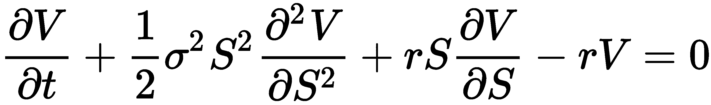
其中 *V* 是期权价格与股价 *S* 和时间 *t* 的函数， *r* 是无风险利率，*σ**σ*(display style sigma)是股票的波动率。该等式背后的一个关键金融见解是，任何人都可以通过以正确的方式无风险地买卖基础资产来完美对冲期权。这种对冲意味着期权只有一个正确的价格，正如布莱克-斯科尔斯公式所返回的那样。

考虑一个行使价为 95 美元的 IBM 月到期看涨期权。你卖出一份一月份的 IBM 看跌期权，行使价为 85 美元。让我们考虑并集中在一个给定的证券，IBM 的看涨期权。下图描绘了 2014 年 5 月 IBM 股票及其衍生看涨期权的每日价格，执行价格为 190 美元:

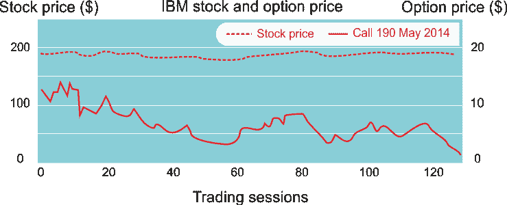

图 7:2013 年 5 月至 10 月 IBM 股票和 2014 年 5 月 190 美元看涨期权的定价

现在，如果 IBM 在期权到期日以 87 美元卖出，这个头寸的盈亏是多少？或者，如果 IBM 的售价是 100 美元呢？计算或预测答案并不容易。然而，在期权交易中，期权的价格取决于几个参数，如时间衰减、价格和波动性:

*   期权到期的时间(时间衰减)
*   基础证券的价格
*   标的资产回报的波动性

定价模型通常不考虑基础证券交易量的变化。因此，一些研究者将其纳入期权交易模型。正如我们所描述的，任何基于 RL 的算法都应该有一个显式状态(或多个状态)，因此让我们使用以下四个规范化特征来定义选项的状态:

*   **时间衰减** ( `timeToExp`):这是在(0，1)范围内归一化后的到期时间。
*   **相对波动率** ( `volatility`):在一个交易时段内，这是标的证券价格的相对变化。例如，它不同于布莱克-斯科尔斯模型中定义的更复杂的回报率波动性。
*   **相对于交易量的波动率** ( `vltyByVol`):这是根据交易量调整后的证券价格的相对波动率。
*   **相对** **现价与执行价之差** ( `priceToStrike`):衡量价格与执行价之差与执行价之比。

下图显示了可以用于 IBM option 策略的四个标准化特性:

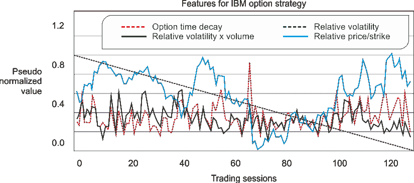

图 IBM 股票的标准化相对股价波动性、相对交易量的波动性以及相对执行价的价格

现在让我们看看股票和期权价格数据集。有两个文件`IBM.csv`和`IBM_O.csv`分别包含 IBM 股票价格和期权价格。股票价格数据集包含日期、开盘价、最高价和最低价、收盘价、交易量和调整后的收盘价。下图给出了数据集的快照:

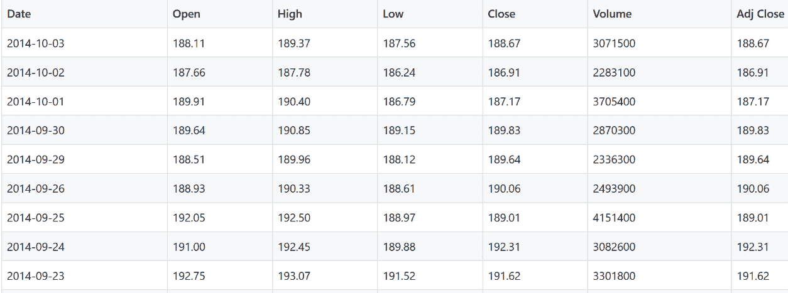

图 9: IBM 股票数据

另一方面，`IBM_O.csv`在 2014 年 10 月 18 日有 127 个 IBM Call 190 期权价格。一些值是 1.41、2.24、2.42、2.78、3.46、4.11、4.51、4.92、5.41、6.01 等等。到目前为止，我们能否使用`QLearning`算法开发一个预测模型来帮助我们回答前面提到的问题:它能否告诉我们 IBM 如何通过利用所有可用的功能来获取最大利润？

嗯，我们知道如何实施`QLearning`，我们也知道什么是期权交易。另一件好事是，这个项目将使用的技术，如 Scala、Akka、Scala Play 框架和 RESTful 服务，已经在第三章[中讨论过](51e66c26-e12b-4764-bbb7-444986c05870.xhtml)、*根据历史数据进行高频比特币价格预测*。所以，有可能。然后我们尝试开发一个 Scala web 项目，帮助我们实现利润最大化。


# 实现期权交易 web 应用程序

这个项目的目标是创建一个期权交易 web 应用程序，它从 IBM 股票数据中创建一个学习模型。然后，应用程序将从模型中提取输出作为 JSON 对象，并将结果显示给用户。*图 10* ，显示了整体工作流程:

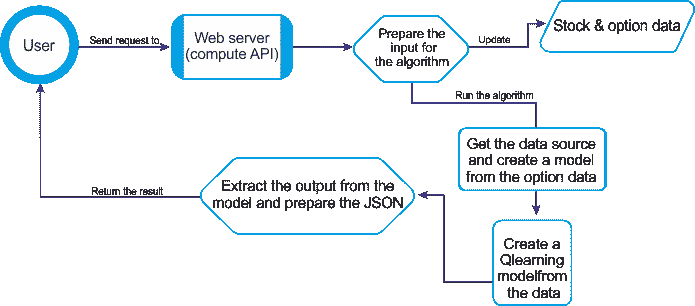

图 10:期权交易 Scala web 的工作流程

compute API 为 Q-learning 算法准备输入，该算法首先从文件中提取数据来构建期权模型。然后，它对数据执行操作，如标准化和离散化。它将所有这些传递给 Q 学习算法来训练模型。之后，compute API 从算法中获取模型，提取最佳策略数据，并将其放到 JSON 上以返回给 web 浏览器。使用 Q-learning 的期权交易策略的实施包括以下步骤:

*   描述选项的属性
*   定义函数近似值
*   指定状态转换的约束


# 创建选项属性

考虑到市场波动，我们需要更现实一点，因为任何长期预测都是相当不可靠的。原因是它将落在离散马尔可夫模型的约束之外。因此，假设我们想要预测未来两天的价格，即 *N= 2* 。这意味着两天后期权的价格就是收益或损失的价值。因此，让我们概括以下四个参数:

*   `timeToExp`:到期前的剩余时间，占期权总期限的百分比
*   波动率给定交易时段内标的证券的归一化相对波动率
*   `vltyByVol`:给定交易时段的基础证券相对于该时段交易量的波动性
*   `priceToStrike`:给定交易时段内基础证券相对于执行价格的价格

`OptionProperty`类定义了证券交易期权的属性。构造函数为选项创建属性:

```scala
class OptionProperty(timeToExp: Double,volatility: Double,vltyByVol: Double,priceToStrike: Double) {
 val toArray = Array[Double](timeToExp, volatility, vltyByVol, priceToStrike)
        require(timeToExp > 0.01, s"OptionProperty time to expiration found $timeToExp required 0.01")
    }
```


# 创建期权模型

现在我们需要创建一个`OptionModel`,作为选项属性的容器和工厂。它接受以下参数，并通过访问前面描述的四个特性的数据源来创建选项属性列表`propsList`:

*   安全的象征。
*   执行价格为`option`、`strikePrice`。
*   `data`、`src`的来源。
*   最小时间衰减或到期时间，`minTDecay`。价外期权会无价值地到期，而价内期权在临近到期时会有非常不同的价格行为。因此，到期日之前的最后`minTDecay`交易时段不会用于培训过程。
*   步骤(或桶)的数量`nSteps`用于估算每个特性的值。例如，四个步骤的近似值创建了四个存储桶:(0，25)，(25，50)，(50，75)和(75，100)。

然后，它组合`OptionProperties`并计算到期权到期的标准化最小时间。然后，它通过将期权价格数组中的实际价值离散化为多个级别来计算期权价值的近似值；最后，它返回期权价格和精度的一系列级别的映射。下面是该类的构造函数:

```scala
class OptionModel(
    symbol: String,
    strikePrice: Double,
    src: DataSource,
    minExpT: Int,
    nSteps: Int
    )
```

在这个类实现中，首先使用`check()`方法通过检查以下内容进行验证:

*   `strikePrice`:需要一个正价格
*   `minExpT`:该值必须介于 2 和 16 之间
*   `nSteps`:最少需要两步

下面是这个方法的调用:

```scala
check(strikePrice, minExpT, nSteps)
```

下面的代码显示了上述方法的签名:

```scala
def check(strikePrice: Double, minExpT: Int, nSteps: Int): Unit = {
    require(strikePrice > 0.0, s"OptionModel.check price found $strikePrice required > 0")
    require(minExpT > 2 && minExpT < 16,s"OptionModel.check Minimum expiration time found $minExpT                     required ]2, 16[")
    require(nSteps > 1,s"OptionModel.check, number of steps found $nSteps required > 1")
    }
```

一旦满足前面的约束，名为`propsList`的选项属性列表创建如下:

```scala
val propsList = (for {
    price <- src.get(adjClose)
    volatility <- src.get(volatility)
    nVolatility <- normalize[Double](volatility)
    vltyByVol <- src.get(volatilityByVol)
    nVltyByVol <- normalize[Double](vltyByVol)
    priceToStrike <- normalize[Double](price.map(p => 1.0 - strikePrice / p))
    } 
 yield {
        nVolatility.zipWithIndex./:(List[OptionProperty]()) {
 case (xs, (v, n)) =>
 val normDecay = (n + minExpT).toDouble / (price.size + minExpT)
 new OptionProperty(normDecay, v, nVltyByVol(n), priceToStrike(n)) :: xs
        }
     .drop(2).reverse
    }).get
```

在前面的代码块中，工厂使用`zipWithIndex` Scala 方法来表示交易会话的索引。所有特征值都在区间(0，1)上进行归一化，包括`normDecay`选项的时间衰减(或到期时间)。

`OptionModel`类的`quantize()`方法将特性的每个选项属性的规范化值转换成一个存储桶索引数组。它根据时段索引数组返回每个时段的盈亏图:

```scala
def quantize(o: Array[Double]): Map[Array[Int], Double] = {
 val mapper = new mutable.HashMap[Int, Array[Int]]
 val acc: NumericAccumulator[Int] = propsList.view.map(_.toArray)
    map(toArrayInt(_)).map(ar => {
 val enc = encode(ar)
        mapper.put(enc, ar)
        enc
            })
    .zip(o)./:(
 new NumericAccumulator[Int]) {
 case (_acc, (t, y)) => _acc += (t, y); _acc
            }
        acc.map {
 case (k, (v, w)) => (k, v / w) }
            .map { 
 case (k, v) => (mapper(k), v) }.toMap
    }
```

该方法还创建一个映射器实例来索引桶数组。类型为`NumericAccumulator`的累加器`acc`扩展了`Map[Int, (Int, Double)]`并计算这个元组*(每个存储桶上特征出现的次数，期权价格增加或减少的总和)*。

`toArrayInt`方法将每个选项属性(`timeToExp`、`volatility`等)的值转换成适当存储桶的索引。然后对索引数组进行编码，以生成状态的 id 或索引。该方法用期权的交易时段的出现次数和总损益来更新累加器。它最后通过平均每个桶的利润和损失来计算每个行动的回报。`encode()`、`toArrayInt()`的签名在下面的代码中给出:

```scala
private def encode(arr: Array[Int]): Int = arr./:((1, 0)) { 
 case ((s, t), n) => (s * nSteps, t + s * n) }._2
 private def toArrayInt(feature: Array[Double]): Array[Int] = feature.map(x => (nSteps *         
            x).floor.toInt)

final class NumericAccumulator[T] 
 extends mutable.HashMap[T, (Int, Double)] {
 def +=(key: T, x: Double): Option[(Int, Double)] = {
 val newValue = 
 if (contains(key)) (get(key).get._1 + 1, get(key).get._2 + x) 
 else (1, x)
 super.put(key, newValue)
    }
}
```

最后，也是最重要的，如果满足前面的约束(您可以修改这些约束),并且一旦构造函数成功，那么`OptionModel`类的实例化就会生成一个`OptionProperty`元素的列表；否则，它会生成一个空列表。


# 放在一起

因为我们已经实现了 Q-learning 算法，所以我们现在可以使用 Q-learning 开发期权交易应用程序。然而，首先，我们需要使用`DataSource`类加载数据(稍后我们将看到它的实现)。然后，我们可以从给定股票的数据中创建一个期权模型，使用`OptionModel`，它定义了一个证券的交易期权的模型。然后我们必须建立一个模型，在给定基础证券的情况下，计算期权的损益。

调整损益以产生正值。它实例化了 Q-learning 类的一个实例，即实现 Q-learning 算法的通用参数化类。Q-learning 模型在类的实例化期间被初始化和训练，因此它可以处于运行时预测的正确状态。

因此，类实例只有两种状态:成功训练和失败训练 Q-learning 值动作。然后返回模型进行处理和可视化。

因此，让我们创建一个 Scala 对象，并将其命名为`QLearningMain`。然后，在`QLearningMain`对象中，定义并初始化以下参数:

*   `Name`:用于表示强化算法的名称(在我们的例子中，是 Q-learning)
*   `STOCK_PRICES`:包含股票数据的文件
*   `OPTION_PRICES`:包含可用选项数据的文件
*   `STRIKE_PRICE`:期权执行价
*   `MIN_TIME_EXPIRATION`:记录的期权最短到期时间
*   `QUANTIZATION_STEP`:证券价值离散化或近似化的步骤
*   `ALPHA`:Q 学习算法的学习率
*   `DISCOUNT`(gamma):Q 学习算法的折扣率
*   `MAX_EPISODE_LEN`:每集访问的州的最大数量
*   `NUM_EPISODES`:训练时使用的集数
*   `MIN_COVERAGE`:Q-learning 模型训练期间允许的最小覆盖率
*   `NUM_NEIGHBOR_STATES`:可从任何其他状态访问的状态数
*   `REWARD_TYPE`:最高奖励或随机

下面的代码给出了每个参数的试探性初始化:

```scala
val name: String = "Q-learning"// Files containing the historical prices for the stock and option
val STOCK_PRICES = "/static/IBM.csv"
val OPTION_PRICES = "/static/IBM_O.csv"// Run configuration parameters
val STRIKE_PRICE = 190.0 // Option strike price
val MIN_TIME_EXPIRATION = 6 // Min expiration time for option recorded
val QUANTIZATION_STEP = 32 // Quantization step (Double => Int)
val ALPHA = 0.2 // Learning rate
val DISCOUNT = 0.6 // Discount rate used in Q-Value update equation
val MAX_EPISODE_LEN = 128 // Max number of iteration for an episode
val NUM_EPISODES = 20 // Number of episodes used for training.
val NUM_NEIGHBHBOR_STATES = 3 // No. of states from any other state
```

现在，`run()`方法接受奖励类型(在我们的例子中是`Maximum reward`)、量化步长(在我们的例子中是`QUANTIZATION_STEP`)、alpha(学习率，在我们的例子中是`ALPHA`)和 gamma(在我们的例子中是`DISCOUNT`，Q 学习算法的贴现率)作为输入。它显示模型中值的分布。此外，它还在散点图上显示了最佳策略的估计 Q 值(我们将在后面看到)。以下是上述方法的工作流程:

1.  首先，它从`IBM.csv`文件中提取股票价格
2.  然后，它使用股票价格和量化创建一个期权模型`createOptionModel`，`quantizeR`(更多信息见`quantize`方法，后面是主要方法调用)
3.  期权价格提取自`IBM_o.csv`文件
4.  之后，使用期权模型创建另一个模型`model`，以对期权价格`oPrices`进行评估
5.  最后，使用`display`方法在散点图上显示估计的 Q 值(即 *Q 值=值*概率*)

通过合并前面的步骤，这里是`run()`方法的签名:

```scala
private def run(rewardType: String,quantizeR: Int,alpha: Double,gamma: Double): Int = {
 val sPath = getClass.getResource(STOCK_PRICES).getPath
 val src = DataSource(sPath, false, false, 1).get
 val option = createOptionModel(src, quantizeR)

 val oPricesSrc = DataSource(OPTION_PRICES, false, false, 1).get
 val oPrices = oPricesSrc.extract.get

 val model = createModel(option, oPrices, alpha, gamma)model.map(m => {if (rewardType != "Random")
    display(m.bestPolicy.EQ,m.toString,s"$rewardType with quantization order             
            $quantizeR")1}).getOrElse(-1)
}
```

现在这里是创建选项模型的`createOptionModel()`方法的签名(参见`OptionModel`类):

```scala
private def createOptionModel(src: DataSource, quantizeR: Int): OptionModel =
 new OptionModel("IBM", STRIKE_PRICE, src, MIN_TIME_EXPIRATION, quantizeR)
```

然后，`createModel()`方法为给定基础证券的期权的损益创建一个模型。请注意，期权价格是使用前面定义的`quantize()`方法量化的。然后使用约束方法来限制任何给定状态下可用的动作数量。这个简单的实现计算这个州半径内的所有州的列表。然后，它识别预定义半径内的相邻状态。

最后，它使用输入数据来训练 Q-learning 模型，以计算利润的最小值，即损失，因此最大损失被转换为零利润。请注意，损益被调整以产生正值。现在让我们看看这个方法的签名:

```scala
def createModel(ibmOption: OptionModel,oPrice: Seq[Double],alpha: Double,gamma: Double): Try[QLModel] = {
 val qPriceMap = ibmOption.quantize(oPrice.toArray)
 val numStates = qPriceMap.size
 val neighbors = (n: Int) => {
def getProximity(idx: Int, radius: Int): List[Int] = {
 val idx_max =
 if (idx + radius >= numStates) numStates - 1 
 else idx + radius
 val idx_min = 
 if (idx < radius) 0 
 else idx - radiusRange(idx_min, idx_max + 1).filter(_ != idx)./:(List[Int]())((xs, n) => n :: xs)}getProximity(n, NUM_NEIGHBHBOR_STATES)
        }
 val qPrice: DblVec = qPriceMap.values.toVector
 val profit: DblVec = normalize(zipWithShift(qPrice, 1).map {
 case (x, y) => y - x}).get
 val maxProfitIndex = profit.zipWithIndex.maxBy(_._1)._2
 val reward = (x: Double, y: Double) => Math.exp(30.0 * (y - x))
 val probabilities = (x: Double, y: Double) => 
 if (y < 0.3 * x) 0.0 
 else 1.0println(s"$name Goal state index: $maxProfitIndex")
 if (!QLearning.validateConstraints(profit.size, neighbors))
 thrownew IllegalStateException("QLearningEval Incorrect states transition constraint")
 val instances = qPriceMap.keySet.toSeq.drop(1)
 val config = QLConfig(alpha, gamma, MAX_EPISODE_LEN, NUM_EPISODES, 0.1)
 val qLearning = QLearning[Array[Int]](config,Array[Int](maxProfitIndex),profit,reward,probabilities,instances,Some(neighbors))    val modelO = qLearning.getModel
 if (modelO.isDefined) {
 val numTransitions = numStates * (numStates - 1)println(s"$name Coverage ${modelO.get.coverage} for $numStates states and $numTransitions transitions")
 val profile = qLearning.dumpprintln(s"$name Execution profilen$profile")display(qLearning)Success(modelO.get)} 
 else Failure(new IllegalStateException(s"$name model undefined"))
}
```

请注意，如果前面的调用无法创建选项模型，代码将不会显示模型创建失败的消息。尽管如此，请记住，考虑到我们使用的小数据集(因为算法会很快收敛)，下面一行中使用的`minCoverage`很重要:

```scala
val config = QLConfig(alpha, gamma, MAX_EPISODE_LEN, NUM_EPISODES, 0.0)
```

尽管我们已经声明不能保证模型的创建和训练会成功，但是一个简单的线索是在`0.0`和`0.22`之间使用一个非常小的`minCoverage`值。现在，如果前面的调用成功，那么模型就被训练好了，可以进行预测了。如果是，则使用显示方法在散点图中显示估计的 *Q 值=值*概率*。下面是该方法的签名:

```scala
private def display(eq: Vector[DblPair],results: String,params: String): Unit = {
 import org.scalaml.plots.{ScatterPlot, BlackPlotTheme, Legend}
 val labels = Legend(name, s"Q-learning config: $params", "States", "States")ScatterPlot.display(eq, 
        labels, new BlackPlotTheme)
}
```

坚持下去，不要失去耐心！我们终于准备好看到一个简单的`rn`并检查结果。因此，让我们这样做:

```scala
def main(args: Array[String]): Unit = {
 run("Maximum reward",QUANTIZATION_STEP, ALPHA, DISCOUNT)
 } 
>>> 
Action: state 71 => state 74
Action: state 71 => state 73
Action: state 71 => state 72
Action: state 71 => state 70
Action: state 71 => state 69
Action: state 71 => state 68...Instance: [I@1f021e6c - state: 124
Action: state 124 => state 125
Action: state 124 => state 123
Action: state 124 => state 122
Action: state 124 => state 121Q-learning Coverage 0.1 for 126 states and 15750 transitions
Q-learning Execution profile
Q-Value -> 5.572310105096295, 0.013869013819834967, 4.5746487300071825, 0.4037703812585325, 0.17606260549479869, 0.09205272504875522, 0.023205692430068765, 0.06363082458984902, 50.405283888218435... 6.5530411130514015
Model: Success(Optimal policy: Reward - 1.00,204.28,115.57,6.05,637.58,71.99,12.34,0.10,4939.71,521.30,402.73, with coverage: 0.1)
```


# 评估模型

前面的输出显示了从一个状态到另一个状态的转换，对于 **0.1** 覆盖率，`QLearning`模型有 126 个状态的 15，750 次转换，以达到目标状态 37 并获得最佳回报。因此，训练集非常小，只有几个桶有实际值。所以我们可以理解，训练集的大小对状态数有影响。`QLearning`对于一个小的训练集来说收敛太快(就像我们在这个例子中所做的)。

但是，对于更大的训练集，`QLearning`需要时间收敛；它将为近似创建的每个存储桶提供至少一个值。此外，通过查看这些值，很难理解 Q 值和状态之间的关系。

那么，如果我们可以看到每个状态的 Q 值呢？为什么不呢！我们可以在散点图上看到它们:


图 11:每个状态的 Q 值

现在让我们显示 Q 值(`QLData.value`)的日志的轮廓，作为不同事件或时期的递归搜索(或训练)过程。该测试使用学习率 *α = 0.1* 和贴现率 *γ = 0.9* (详见部署部分):

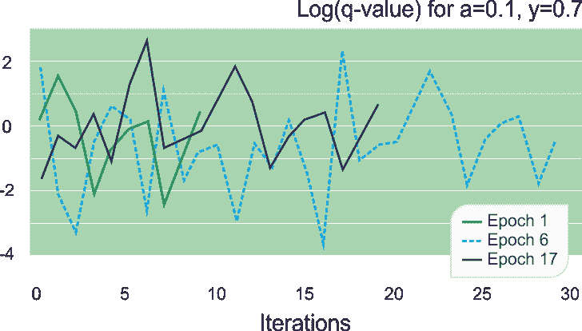

图 12:Q 学习训练期间不同时期的对数 Q 值的分布图

前面的图表说明了这样一个事实，即每个轮廓的 Q 值与训练期间的历元顺序无关。然而，在这个例子中，达到目标状态的迭代次数取决于随机选择的初始状态。要获得更多信息，请检查编辑器上的输出或访问位于`http://localhost:9000/api/compute`的 API 端点(见下文)。现在，如果我们显示模型中值的分布，并在散点图上显示给定配置参数的最佳策略的估计 Q 值，会怎么样？

*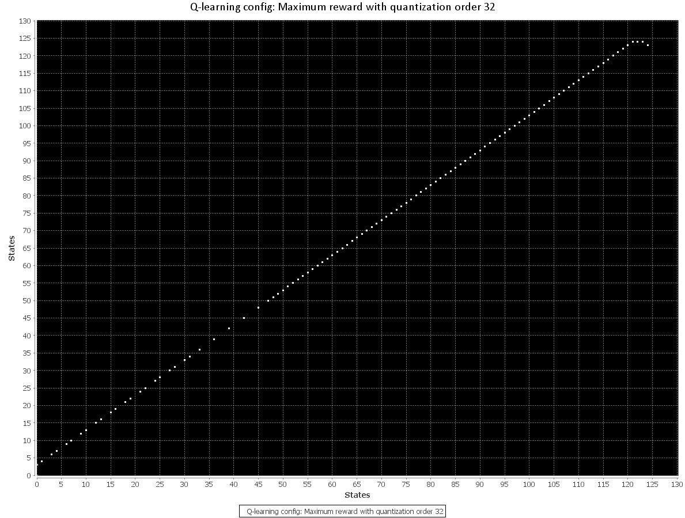*

图 13:量化 32 和 QLearning 的最大回报

最终评估包括评估学习率和折扣率对培训覆盖面的影响:

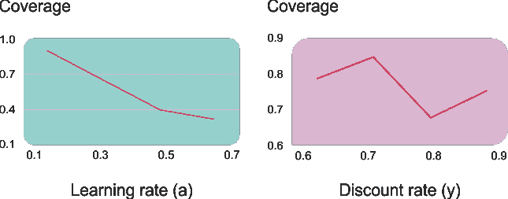

图 14:学习率和折扣率对培训覆盖面的影响

覆盖率随着学习率的提高而降低。这个结果印证了使用*学习率* *< 0.2* 的一般规律。一个类似的测试来评估贴现率对覆盖率的影响是不确定的。我们可能有数千个这样的配置参数，它们有不同的选择和组合。那么，如果我们可以将整个应用包装成一个 Scala web app，就像我们在[第 3 章](51e66c26-e12b-4764-bbb7-444986c05870.xhtml)、*根据历史数据进行高频比特币价格预测*中所做的那样，会怎么样呢？我想这不是个坏主意。所以让我们深入研究一下。


# 将期权交易应用包装成 Scala web 应用

其思想是获得训练好的模型，并为最大回报情况构造最佳策略 JSON 输出。`PlayML`是一个 web 应用程序，它使用期权交易 Q-learning 算法来提供计算 API 端点，该端点采用输入数据集和一些期权来计算 Q 值，并以 JSON 格式返回它们以在前端建模。

打包的 Scala web ML 应用程序具有以下目录结构:

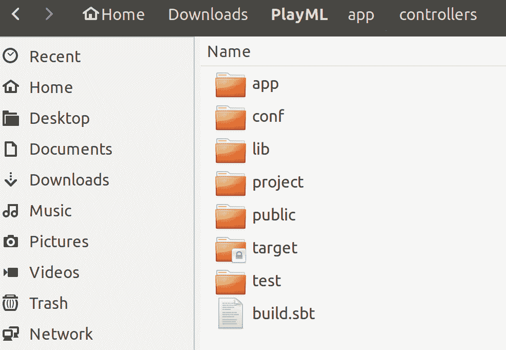

图 15: Scala ML web app 目录结构

在前面的结构中，app 文件夹既有原始的 QLearning 实现(参见`ml`文件夹)也有一些额外的后端代码。`controller`子文件夹中有一个名为`API.scala`的 Scala 类，用作 Scala 控制器，从前端控制模型行为。最后，`Filters.scala`充当`DefaultHttpFilters`:

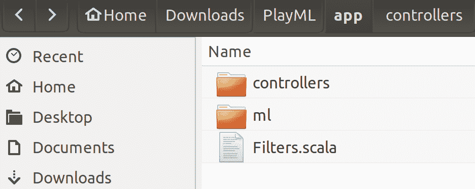

图 16:ml 目录结构

`conf`文件夹中有 Scala web app 配置文件`application.conf`，包含必要的配置。所有的依赖关系都在`build.sbt`文件中定义，如下面的代码 *:* 所示

```scala
name := "PlayML"version := "1.0"
lazy val `playml` = (project in file(".")).enablePlugins(PlayScala)
resolvers += "scalaz-bintray" 
scalaVersion := "2.11.11"
libraryDependencies ++= Seq(filters, cache, ws, "org.apache.commons" % "commons-math3" %                 
        "3.6","com.typesafe.play" %% "play-json" % "2.5",
        "org.jfree" % "jfreechart" % "1.0.17",
        "com.typesafe.akka" %% "akka-actor" % "2.3.8",
        "org.apache.spark" %% "spark-core" % "2.1.0",
        "org.apache.spark" %% "spark-mllib" % "2.1.0",
        "org.apache.spark" %% "spark-streaming" % "2.1.0")
```

`lib`文件夹中有一些`.jar`文件被用作在`build.sbt`文件*中定义的外部依赖。*`public`文件夹包含用户界面中使用的静态页面。此外，数据文件`IBM.csv`和`IBM_O.csv`也在那里。最后，目标文件夹包含打包的应用程序(如果有)。


# 后端

在后端，我封装了前面的 Q-learning 实现，另外创建了一个 Scala 控制器，从前端控制模型行为。结构如下所示:

```scala
import java.nio.file.Paths
import org.codehaus.janino.Java
import ml.stats.TSeries.{normalize, zipWithShift}
import ml.workflow.data.DataSource
import ml.trading.OptionModel
import ml.Predef.{DblPair, DblVec}
import ml.reinforcement.qlearning.{QLConfig, QLModel, QLearning}
import scala.util.{Failure, Success, Try}
import play.api._
import play.api.data.Form
import play.api.libs.json._
import play.api.mvc._
import scala.util.{Failure, Success, Try}

class API extends Controller {
 protected val name: String = "Q-learning"
 private var sPath = Paths.get((s"${"public/data/IBM.csv"}")).toAbsolutePath.toString
 private var oPath = Paths.get((s"${"public/data/IBM_O.csv"}")).toAbsolutePath.toString

   // Run configuration parameters
 private var STRIKE_PRICE = 190.0 // Option strike price
 private var MIN_TIME_EXPIRATION = 6 // Minimum expiration time for the option recorded
 private var QUANTIZATION_STEP = 32 // Quantization step (Double => Int)
 private var ALPHA = 0.2 // Learning rate
 private var DISCOUNT = 0.6 // Discount rate used in the Q-Value update equation
 private var MAX_EPISODE_LEN = 128 // Maximum number of iteration for an episode
 private var NUM_EPISODES = 20 // Number of episodes used for training.
 private var MIN_COVERAGE = 0.1
 private var NUM_NEIGHBOR_STATES = 3 // Number of states accessible from any other state
 private var REWARD_TYPE = "Maximum reward"
 private var ret = JsObject(Seq())
 private var retry = 0

 private def run(REWARD_TYPE: String,quantizeR: Int,alpha: Double,gamma: Double) = {
 val maybeModel = createModel(createOptionModel(DataSource(sPath, false, false, 1).get, quantizeR),             DataSource(oPath, false, false, 1).get.extract.get, alpha, gamma)
 if (maybeModel != None) {
 val model = maybeModel.get
 if (REWARD_TYPE != "Random") {
 var value = JsArray(Seq())
 var x = model.bestPolicy.EQ.distinct.map(x => {value = value.append(JsObject(Seq("x" ->                     JsNumber(x._1), "y" -> JsNumber(x._2))))})ret = ret.+("OPTIMAL", value)
                }
            }
        }
/** Create an option model for a given stock with default strike and minimum expiration time parameters.
*/
 privatedef createOptionModel(src: DataSource, quantizeR: Int): OptionModel =
 new OptionModel("IBM", STRIKE_PRICE, src, MIN_TIME_EXPIRATION, quantizeR)
/** Create a model for the profit and loss on an option given
* the underlying security. The profit and loss is adjusted to
* produce positive values.
*/
 privatedef createModel(ibmOption: OptionModel,oPrice: Seq[Double],alpha: Double,gamma: Double): Option[QLModel] = {
 val qPriceMap = ibmOption.quantize(oPrice.toArray)
 val numStates = qPriceMap.size
 val neighbors = (n: Int) => {
 def getProximity(idx: Int, radius: Int): List[Int] = {
 val idx_max = if (idx + radius >= numStates) numStates - 1
            else idx + radius
 val idx_min = if (idx < radius) 0 
                        else idx - radiusscala.collection.immutable.Range(idx_min, idx_max + 1)
                            .filter(_ != idx)./:(List[Int]())((xs, n) => n :: xs)
                        }
                getProximity(n, NUM_NEIGHBOR_STATES)
            }
       // Compute the minimum value for the profit, loss so the maximum loss is converted to a null profit
 val qPrice: DblVec = qPriceMap.values.toVector
 val profit: DblVec = normalize(zipWithShift(qPrice, 1).map {
        case (x, y) => y - x }).get
 val maxProfitIndex = profit.zipWithIndex.maxBy(_._1)._2
 val reward = (x: Double, y: Double) => Math.exp(30.0 * (y - x))

 val probabilities = (x: Double, y: Double) =>
             if (y < 0.3 * x) 0.0 else 1.0ret = ret.+("GOAL_STATE_INDEX", JsNumber(maxProfitIndex))
 if (!QLearning.validateConstraints(profit.size, neighbors)) {ret = ret.+("error",                             JsString("QLearningEval Incorrect states transition constraint"))

 thrownew IllegalStateException("QLearningEval Incorrect states transition constraint")}

 val instances = qPriceMap.keySet.toSeq.drop(1)
 val config = QLConfig(alpha, gamma, MAX_EPISODE_LEN, NUM_EPISODES, MIN_COVERAGE)
 val qLearning = QLearning[Array[Int]](config,Array[Int]                
                (maxProfitIndex),profit,reward,probabilities,instances,Some(neighbors))    
            val modelO = qLearning.getModel

 if (modelO.isDefined) {
 val numTransitions = numStates * (numStates - 1)ret = ret.+("COVERAGE",             
                JsNumber(modelO.get.coverage))ret = ret.+("COVERAGE_STATES", JsNumber(numStates))
                ret = ret.+("COVERAGE_TRANSITIONS", JsNumber(numTransitions))
 var value = JsArray()
 var x = qLearning._counters.last._2.distinct.map(x => {value = value.append(JsNumber(x))
                })    
                ret = ret.+("Q_VALUE", value)modelO
                } 
 else {
                if (retry > 5) {ret = ret.+("error", JsString(s"$name model undefined"))
 return None
                 }
                retry += 1Thread.sleep(500)
 return createModel(ibmOption,oPrice,alpha,gamma)
            }        
        }
def compute = Action(parse.anyContent) { request =>
 try {
        if (request.body.asMultipartFormData != None) {
 val formData = request.body.asMultipartFormData.get
 if (formData.file("STOCK_PRICES").nonEmpty && formData.file("STOCK_PRICES").get.filename.nonEmpty)sPath = formData.file("STOCK_PRICES").get.ref.file.toString
 if (formData.file("OPTION_PRICES").nonEmpty && formData.file("OPTION_PRICES").get.filename.nonEmpty)oPath = formData.file("OPTION_PRICES").get.ref.file.toString
 val parts = formData.dataParts
 if (parts.get("STRIKE_PRICE") != None)STRIKE_PRICE = parts.get("STRIKE_PRICE").get.mkString("").toDouble
 if (parts.get("MIN_TIME_EXPIRATION") != None)MIN_TIME_EXPIRATION = parts.get("MIN_TIME_EXPIRATION").get.mkString("").toInt
 if (parts.get("QUANTIZATION_STEP") != None)QUANTIZATION_STEP = parts.get("QUANTIZATION_STEP").get.mkString("").toInt
 if (parts.get("ALPHA") != None)ALPHA = parts.get("ALPHA").get.mkString("").toDouble
 if (parts.get("DISCOUNT") != None)DISCOUNT = parts.get("DISCOUNT").get.mkString("").toDouble
 if (parts.get("MAX_EPISODE_LEN") != None)MAX_EPISODE_LEN = parts.get("MAX_EPISODE_LEN").get.mkString("").toInt
 if (parts.get("NUM_EPISODES") != None)NUM_EPISODES = parts.get("NUM_EPISODES").get.mkString("").toInt
 if (parts.get("MIN_COVERAGE") != None)MIN_COVERAGE = parts.get("MIN_COVERAGE").get.mkString("").toDouble
 if (parts.get("NUM_NEIGHBOR_STATES") != None)NUM_NEIGHBOR_STATES = parts.get("NUM_NEIGHBOR_STATES").get.mkString("").toInt
 if (parts.get("REWARD_TYPE") != None)REWARD_TYPE = parts.get("REWARD_TYPE").get.mkString("")
            }
        ret = JsObject(Seq("STRIKE_PRICE" ->
        JsNumber(STRIKE_PRICE),"MIN_TIME_EXPIRATION" -> JsNumber(MIN_TIME_EXPIRATION),
        "QUANTIZATION_STEP" -> 
JsNumber(QUANTIZATION_STEP),
        "ALPHA" -> JsNumber(ALPHA),
        "DISCOUNT" -> JsNumber(DISCOUNT),
        "MAX_EPISODE_LEN" -> 
JsNumber(MAX_EPISODE_LEN),
        "NUM_EPISODES" -> JsNumber(NUM_EPISODES),
        "MIN_COVERAGE" -> JsNumber(MIN_COVERAGE),
        "NUM_NEIGHBOR_STATES" -> 
JsNumber(NUM_NEIGHBOR_STATES),
        "REWARD_TYPE" -> JsString(REWARD_TYPE)))
        run(REWARD_TYPE, QUANTIZATION_STEP, ALPHA, DISCOUNT)
    }
 catch {
        case e: Exception => {
            ret = ret.+("exception", JsString(e.toString))
                }
            }
```

```scala
       Ok(ret)
    }
}
```

仔细看看前面的代码；它与`QLearningMain.scala`文件的结构大致相同。这里只有两件重要的事情，如下:

*   Compute 是作为一个动作完成的，它从 UI 获取输入并计算值
*   然后使用`JsObject()`方法将结果作为 JSON 对象返回，并显示在 UI 上(见下文)


# 前端

该应用程序由两个主要部分组成:使用 play 框架构建的 API 端点和使用`Angular.js`构建的前端单页面应用程序。前端应用程序将数据发送给 API 进行计算，然后使用`chart.js`显示结果。为此，我们需要采取以下步骤:

*   初始化表单
*   与 API 通信
*   用覆盖率数据和图表填充视图

该算法的 JSON 输出应该如下所示:

*   将返回所有配置参数
*   `GOAL_STATE_INDEX`、最大利润指标
*   `COVERAGE`，达到预定义目标状态的训练试验或时期的比率
*   `COVERAGE_STATES`，量化选项值的大小
*   `COVERAGE_TRANSITIONS`，状态数的平方
*   `Q_VALUE`，所有状态的 q 值
*   `OPTIMAL`，如果奖励类型不是随机的，返回最多奖励的州

**前端代码**通过`chart.js`模块启动`Angular.js` app，如下所示(参见`PlayML/public/assets/js/main.js`文件):

```scala
angular.module("App", ['chart.js']).controller("Ctrl", ['$scope', '$http', function ($scope, $http) {
// First we initialize the form:
$scope.form = {REWARD_TYPE: "Maximum reward",NUM_NEIGHBOR_STATES: 3,STRIKE_PRICE: 190.0,MIN_TIME_EXPIRATION: 6,QUANTIZATION_STEP: 32,ALPHA: 0.2,DISCOUNT: 0.6,MAX_EPISODE_LEN: 128,NUM_EPISODES: 20,MIN_COVERAGE: 0.1
};
```

然后，运行按钮操作准备好要发送给 API 的表单数据，并将数据发送给后端。接下来，它将返回的数据传递给前端使用的结果变量。然后，它清除图表并重新创建它们；如果找到一个最佳，它初始化最佳图表。最后，如果发现 Q 值被初始化，则 Q 值图表被初始化:

```scala
$scope.run = function () {
    var formData = new FormData(document.getElementById('form'));
    $http.post('/api/compute', formData, {
    headers: {'Content-Type': undefined}}).then(function successCallback(response) {
    $scope.result = response.data;
    $('#canvasContainer').html('');

    if (response.data.OPTIMAL) {
        $('#canvasContainer').append('<canvas id="optimalCanvas"></canvas>')
        Chart.Scatter(document.getElementById("optimalCanvas").getContext("2d"), {data: { datasets:             [{data: response.data.OPTIMAL}] }, options: {...}});}if (response.data.Q_VALUE) {
        $('#canvasContainer').append('<canvas id="valuesCanvas"></canvas>')
        Chart.Line(document.getElementById("valuesCanvas").getContext("2d"), {
        data: { labels: new Array(response.data.Q_VALUE.length), datasets: [{
        data: response.data.Q_VALUE }] }, options: {...}});}});}}]
    );
```

然后将前面的前端代码嵌入 HTML(见`PlayML/public/index.html`)中，以使 UI 在`http://localhost:9000/`作为一个别致的应用程序在网络上被访问。请根据您的要求随意编辑内容。我们很快就会看到细节。


# 运行和部署说明

正如在[第三章](51e66c26-e12b-4764-bbb7-444986c05870.xhtml)、*从历史数据进行高频比特币价格预测*中已经说过的，你需要 Java 1.8+和 SBT 作为依赖。然后按照以下说明操作:

*   下载应用程序。我把这个代码命名为`PlayML.zip`。
*   解压文件，你会得到文件夹`ScalaML`。
*   转到 PlayML 项目文件夹。
*   运行`$ sudo sbt run`下载所有的依赖项并运行应用程序。

然后可以在`http://localhost:9000/`访问该应用程序，在这里我们可以上传 IBM 股票和期权价格，当然，还可以提供其他配置参数:

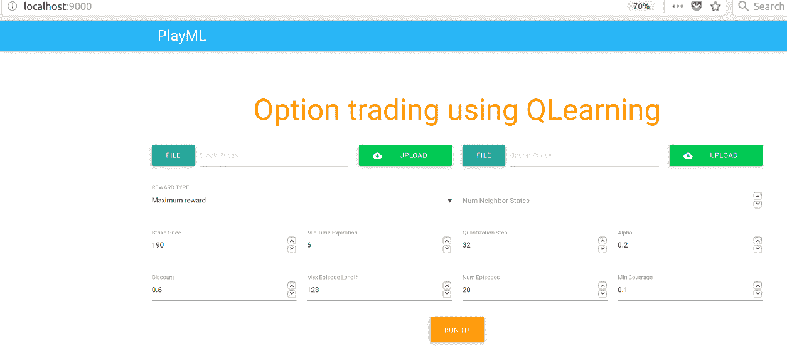

图 17:使用 QLearning 进行期权交易的用户界面

现在，如果您上传股票价格和期权价格数据并单击 run 按钮，将会生成一个图表，如下所示:

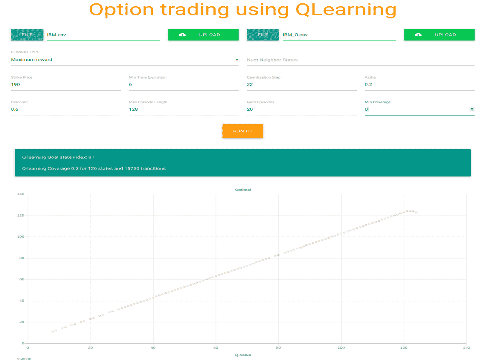

图 18: QLearning 达到目标状态 81，覆盖 126 个状态和 15，750 个转换，覆盖率为 0.2

另一方面，可以在[http://localhost:9000/API/compute](http://localhost:9000/api/compute)访问 API 端点。

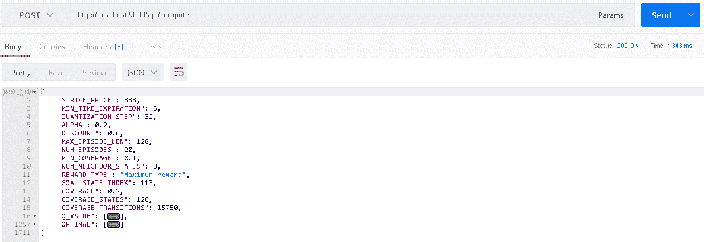

图 19:API 端点(简略)


# 模型部署

通过将应用程序 HTTP 端口设置为 9000，可以轻松地将应用程序部署为独立服务器，例如:

```scala
$ /path/to/bin/<project-name> -Dhttp.port=9000
```

请注意，您可能需要 root 权限才能将进程绑定到此端口。下面是一个简短的工作流程:

*   运行`$ sudo sbt dist`来构建应用程序二进制文件。输出可以在`PlayML /target/universal/APP-NAME-SNAPSHOT.zip`找到。在我们这里是`playml-1.0.zip`。
*   现在，要运行应用程序，解压文件，然后运行`bin`目录中的脚本:

```scala
$ unzip APP-NAME-SNAPSHOT.zip$ APP-NAME-SNAPSHOT /bin/ APP-NAME -Dhttp.port=9000
```

然后，您需要配置您的 web 服务器，以映射到应用程序端口配置。不过，通过将应用程序 HTTP 端口设置为`9000`，您可以轻松地将应用程序部署为独立的服务器:

```scala
$ /path/to/bin/<project-name> -Dhttp.port=9000
```

但是，如果您计划在同一台服务器上托管几个应用程序，或者为了可伸缩性或容错性而对应用程序的几个实例进行负载平衡，那么您可以使用前端 HTTP 服务器。请注意，使用前端 HTTP 服务器很少会比直接使用播放服务器给你带来更好的性能。

然而，HTTP 服务器非常擅长处理 HTTPS、条件 GET 请求和静态资产，许多服务都假设前端 HTTP 服务器是您的架构的一部分。更多信息可以在[https://www . play framework . com/documentation/2.6 . x/http server](https://www.playframework.com/documentation/2.6.x/HTTPServer)找到。


# 摘要

在本章中，我们学习了如何使用称为 Q-learning 的 RL 算法开发一个名为 options trading 的实际应用程序。IBM 股票数据集被用来设计一个由批评和奖励驱动的机器学习系统。此外，我们学习了一些理论背景。最后，我们学习了如何使用 Scala Play 框架将一个 Scala 桌面应用程序包装成一个 web 应用程序，并将其部署到生产环境中。

在下一章中，我们将看到两个在银行营销数据集上使用 H2O 构建非常稳健和准确的预测模型进行预测分析的示例。在本例中，我们将使用银行营销数据集。该数据与一家葡萄牙银行机构的直接营销活动相关。营销活动以电话为基础。这个端到端项目的目标是预测客户将认购定期存款。*