# 十、基于循环神经网络的人体行为识别

一个**循环神经网络** ( **RNN** )是一类人工神经网络，其中单元之间的连接形成一个有向循环。rnn 利用过去的信息。这样，他们可以对具有高度时间依赖性的数据进行预测。这创建了网络的内部状态，允许它展示动态的时间行为。

RNN 接受许多输入向量来处理它们并输出其他向量。与经典方法相比，使用具有**长短期记忆**细胞的 RNN(**lstm**)不需要或者很少需要特征工程。数据可以直接输入神经网络，神经网络就像一个黑匣子，正确地模拟问题。这里的方法在预处理多少数据方面相当简单。

在这一章中，我们将看到如何使用 RNN 实现来开发一个机器学习项目，该项目使用智能手机数据集，称为 LSTM，用于**人类活动识别** ( **HAR** )。简而言之，我们的 ML 模型将能够从六个类别对运动类型进行分类:行走、上楼、下楼、坐着、站着和躺着。

简而言之，在这个端到端项目中，我们将学习以下主题:

*   使用循环神经网络
*   RNN 的长期依赖性和缺点
*   开发用于人类活动识别的 LSTM 模型
*   调谐 LSTM 和 RNN
*   摘要


# 使用 rnn

在本节中，我们将首先提供一些关于 RNNs 的上下文信息。然后，我们将强调经典 RNNs 的一些潜在缺点。最后，我们将看到称为 LSTM 的 RNNs 的改进变体来解决这些缺点。


# 上下文信息和 RNNs 的体系结构

人类不是从零开始思考；人类大脑具有所谓的记忆持久性，即把过去和最近的信息联系起来的能力。相反，传统的神经网络忽略过去的事件。例如，在电影场景分类器中，神经网络不可能使用过去的场景来分类当前的场景。开发 rnn 是为了尝试解决这个问题:

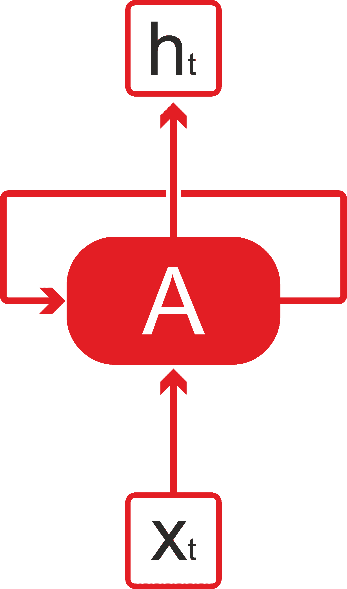

图 1:rnn 有环路

与传统的神经网络相比，RNNs 是一种具有环路的网络，允许信息保持不变(*图 1* )。在一个神经网络中比方说， **A** :在某个时刻 **t** ，输入**x[t]，输出一个值 **h [t]** 。因此，从图 1 中，我们可以把 RNN 想象成同一个网络的多个副本，每个副本都向后继者传递信息。现在，如果我们展开之前的网络，我们会收到什么？下图给了你一些启示:**

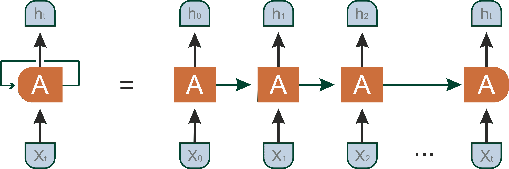

图 2:图 1 所示的同一 RNN 的展开图

然而，前面展开的图没有提供关于 rnn 的详细信息。相反，RNN 不同于传统的神经网络，因为它引入了一个转换权重 **W** 来在时间之间传递信息。RNNs 一次处理一个顺序输入，更新一种包含序列中所有过去元素信息的向量状态。下图显示了一个神经网络，它将值 **X(t)** 作为输入，然后输出值 **Y(t)** :

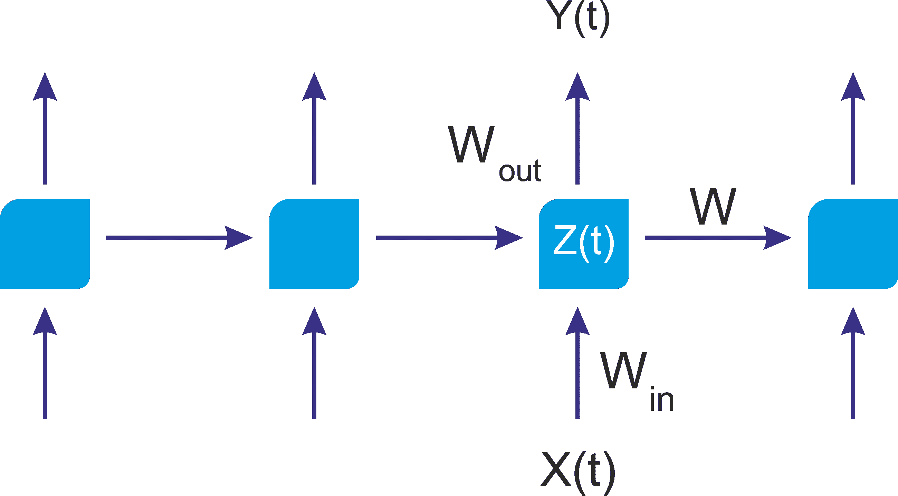

图 3:RNN 体系结构可以利用网络的先前状态

如图*图 1* 所示，神经网络的前半部分用函数 *Z (t) = X (t) * W [in]* 表示，神经网络的后半部分取形式为*Y(t)= Z(t)* W[out]*。如果你愿意，整个神经网络只是函数*Y(t)=(X(t)* W*[in]*)* W*[out]。

每次 *t* 调用学习模型时，该架构不考虑关于先前运行的知识。这就像只看当天的数据来预测股市趋势一样。更好的办法是从一周或几个月的数据中挖掘总体模式:

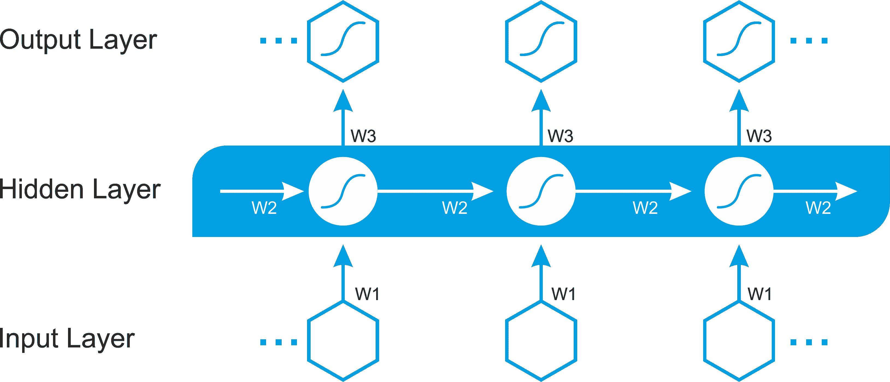

图 4:一个 RNN 架构，其中所有层中的所有权重都必须随时间学习

在图 4 中可以找到更明确的架构，其中除了 **w1** (用于输入层)和 **w3** (用于输出层)之外，还必须学习时间共享权重 **w2** (用于隐藏层)。

令人难以置信的是，在过去的几年里，RNNs 已经被用于各种各样的问题，例如语音识别、语言建模、翻译和图像字幕。


# RNN 和长期依赖问题

rnn 也非常强大和受欢迎。然而，通常，我们只需要查看最近的信息来执行当前的任务，而不是很久以前存储的信息。这在语言建模的 NLP 中很常见。让我们看一个常见的例子:

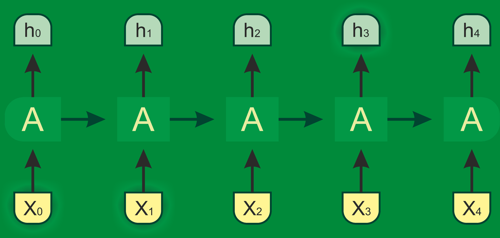

图 5:如果相关信息和需要它的地方之间的差距很小，RNNs 可以学习使用过去的信息

假设一个语言模型正试图根据前面的单词预测下一个单词。作为一个人，如果我们试图预测*天空是蓝色*中的最后一个词，在没有进一步上下文的情况下，我们最有可能预测的下一个词是*蓝色*。在这种情况下，相关信息和地方之间的差距很小。因此，RNNs 可以很容易地学会使用过去的信息。

但是考虑一个更长的句子:阿西夫在孟加拉国长大...他在韩国学习过...他说一口流利的孟加拉语，而我们需要更多的语境。在这个句子中，最近的信息告诉我们，下一个单词可能是一种语言的名称。然而，如果我们想缩小哪种语言的范围，我们需要从前面的单词中了解*孟加拉*的上下文:

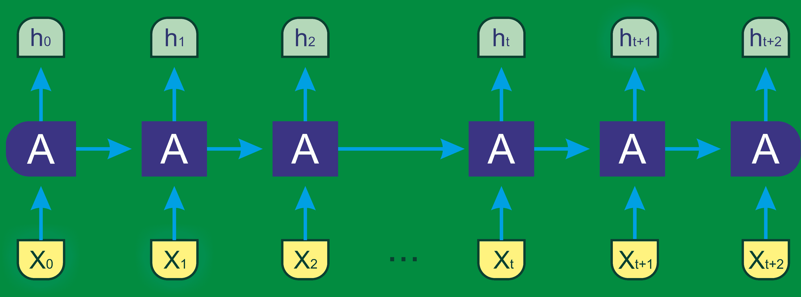

图 6:如果相关信息和需要它的地方之间的差距越来越大，RNNs 就不能学习使用过去的信息

这里，差距更大，所以 rnn 变得无法学习信息。这是 RNN 的一个严重缺点。然而，LSTM 前来救援。


# LSTM 网络公司

一种类型的 RNN 模型是 **LSTM** 。LSTM 的精确实现细节不在本书讨论范围之内。LSTM 是一种特殊的 RNN 建筑，最初由 Hochreiter 和 Schmidhuber 于 1997 年构思。这种类型的神经网络最近在深度学习的背景下被重新发现，因为它没有消失梯度的问题，并且提供了出色的结果和性能。基于 LSTM 的网络是预测和分类时间序列的理想选择，正在取代许多传统的深度学习方法。

这是一个搞笑的名字，但它的意思正是它听起来的意思。这个名字意味着短期模式不会被长期遗忘。LSTM 网络由相互链接的单元(LSTM 块)组成。每个 LSTM 模块包含三种类型的门:输入门、输出门和遗忘门，分别实现写、读和复位单元存储器的功能。这些门不是二元的，而是类比的(通常由映射在范围(0，1)中的 s 形激活函数管理，其中 0 表示完全抑制，1 表示完全激活)。

如果你认为 LSTM 电池是一个黑盒，它可以像基本电池一样使用，除了它会表现得更好；训练将更快地收敛，并且它将检测数据中的长期依赖性。那么 LSTM 细胞是如何工作的呢？基本 LSTM 单元的架构如图 7 所示:

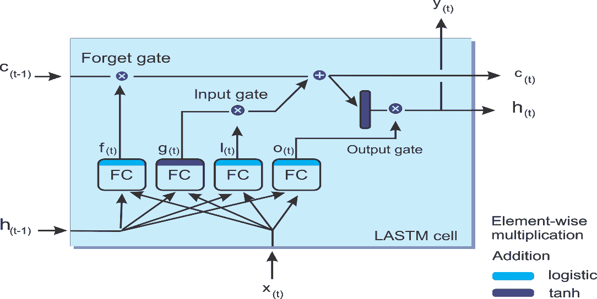

图 7:LSTM 单元的框图

现在，让我们看看这个架构背后的数学符号。如果我们不看 LSTM 盒子里面的东西，LSTM 细胞本身看起来就像一个普通的记忆细胞，除了它的状态被分成两个向量， **h(t)** 和 **c(t)** :

*   **c** 是单元格
*   **h(t)** 是短期状态
*   **c(t)** 是长期状态

现在让我们打开盒子！关键思想是网络可以学习在长期状态下存储什么，扔掉什么，从中读取什么。当长期状态 **c [(t-1)]** 从左到右遍历网络时，可以看到它首先经过一个遗忘门，丢弃一些记忆，然后通过加法运算添加一些新的记忆(该运算添加由输入门选择的记忆)。产生的 **c(t)** 被直接发送出去，没有任何进一步的转换。

因此，在每个时间戳，一些内存被删除，一些内存被添加。而且加法运算后，长项状态被复制并通过 **tanh** 函数传递，然后结果被输出门过滤。这产生了短期状态 **h(t)** (等于该时间步 **y(t)** 的单元输出)。现在让我们看看新的记忆从何而来，以及门是如何工作的。首先，当前输入向量 **x(t)** 和先前的短期状态 **h(t-1)** 被馈送到四个不同的全连接层。

这些门的存在允许 LSTM 细胞无限期地记忆信息；如果输入门低于激活阈值，单元将保留先前的状态，如果当前状态被启用，它将与输入值合并。顾名思义，遗忘门复位单元的当前状态(当其值清零时)，输出门决定单元的值是否必须执行。以下等式用于对单个实例的单元的长期状态、短期状态以及每个时间步长的输出进行 LSTM 计算:

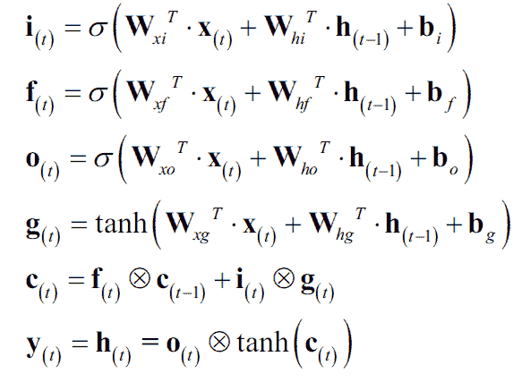

在上式中， *W [xi]* ， *W [xf]* ， *W [xo]* ， *W [xg]* 是四层中每一层与输入向量 *x [(t)]* 连接的权重矩阵。另一方面， *W [hi]* ， *W [hf]* ， *W [ho]* ， *W [hg]* 是四层中的每一层与前一个短期状态 *h [(t-1)]* 的连接的权重矩阵。最后， *b [i]*

现在我们知道了所有这些，RNN 和 LSTM 网络是如何工作的呢？是时候动手了。我们将开始为 HAR 实现一个基于 MXNet 和 Scala 的 LSTM 模型。


# 基于 LSTM 模型的人体活动识别

**人类活动识别** ( **HAR** )数据库是根据 30 名研究参与者进行日常生活 ( **ADL** )的**活动的记录建立的，同时携带一部嵌入惯性传感器的腰部安装智能手机。目标是将活动分类为六个已执行活动中的一个。**


# 数据集描述

这些实验是由年龄在 19 - 48 岁之间的 30 名志愿者进行的。每个人通过在腰间佩戴一部三星 Galaxy S II 智能手机来完成六项活动，即行走、上楼、下楼、坐着、站着和躺着。使用加速度计和陀螺仪，作者以 50 Hz 的恒定速率捕获了三轴线性加速度和三轴角速度。

只使用了两个传感器，即加速度计和陀螺仪。传感器信号通过应用噪声滤波器进行预处理，然后在 2.56 秒和 50%重叠的固定宽度滑动窗口中采样。这给出了 128 个读数/窗口。来自传感器加速度信号的重力和身体运动分量通过巴特沃兹低通滤波器被分离成身体加速度和重力。

欲了解更多信息，请参考本文:Davide Anguita、Alessandro Ghio、Luca Oneto、Xavier Parra 和 Jorge L. Reyes-Ortiz。使用智能手机进行*人类活动识别的公共领域数据集*。*第 21 届欧洲人工神经网络、计算智能和机器学习研讨会，ESANN* 2013。2013 年 4 月 24 日至 26 日，比利时布鲁日。

为简单起见，假设重力只有很少的低频分量。因此，使用 0.3 Hz 截止频率的滤波器。从每个窗口，通过计算来自时域和频域的变量找到特征向量。

实验已被录像，以手动标记数据。获得的数据集被随机分成两组，其中 70%的志愿者被选择用于生成训练数据，30%的志愿者被选择用于生成测试数据。现在，当我研究数据集时，训练集和测试集都具有以下文件结构:

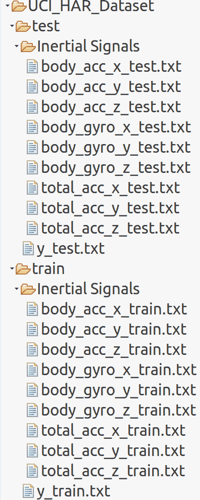

图 8: HAR 数据集文件结构

对于数据集中的每条记录，提供以下信息:

*   来自加速度计的三轴加速度和估计的身体加速度
*   陀螺仪传感器的三轴角速度
*   具有时域和频域变量的 561 特征向量
*   它的活动标签
*   进行实验的受试者的标识符

现在我们知道了需要解决的问题，是时候探索技术和相关的挑战了。正如我已经说过的，我们将使用基于 MXNet 的 LSTM 实现。你可能会问:为什么我们不使用 H2O 或 DeepLearning4j？嗯，答案是它们要么没有基于 LSTM 的实现，要么不能被应用来解决这个问题。


# 为 Scala 设置和配置 MXNet

Apache MXNet 是一个灵活高效的深度学习库。构建高性能深度学习库需要很多系统级的设计决策。在本设计笔记中，我们分享了设计 MXNet 时所做具体选择的基本原理。我们设想这些见解可能对深度学习实践者和其他深度学习系统的构建者都有用。

对于这个项目，我们将需要不同的包和库:Scala，Java，OpenBLAS，ATLAS，OpenCV，以及总的来说，MXNet。现在让我们开始逐一配置这些工具。对于 Java 和 Scala，我假设您已经配置了 Java 和 Scala。现在下一个任务是安装构建工具和`git`,因为我们将使用来自 GitHub 库的 MXNet。为此，只需在 Ubuntu 上执行以下命令:

```scala
$ sudo apt-get update 
$ sudo apt-get install -y build-essential git 
```

然后我们需要安装 OpenBLAS 和 ATLAS。MXNet 执行的线性代数运算需要这些。要安装这些，只需执行以下命令:

```scala
$ sudo apt-get install -y libopenblas-dev 
$ sudo apt-get install -y libatlas-base-dev 
```

我们还需要安装 OpenCV 进行图像处理。让我们通过执行以下命令来安装它:

```scala
 $ sudo apt-get install -y libopencv-dev 
```

最后，我们需要生成预构建的 MXNet 二进制文件。为此，我们需要为 Scala 克隆和构建 MXNet:

```scala
$ git clone --recursive https://github.com/apache/incubator-mxnet.git mxnet --branch 0.12.0 
$ cd mxnet 
$ make -j $(nproc) USE_OPENCV=1 USE_BLAS=openblas 
$ make scalapkg 
$ make scalainsta 
```

现在，如果前面的步骤进展顺利，MXNet 的预构建二进制文件将在`/home/$user_name/mxnet/scala-package/assembly/linux-x86_64-cpu`(或者在 Linux 上配置了 GPU 的`linux-x86_64-gpu`，以及在 macOS 上的`osx-x86_64-cpu`)中生成。看看下面 Ubuntu 上的 CPU 截图:

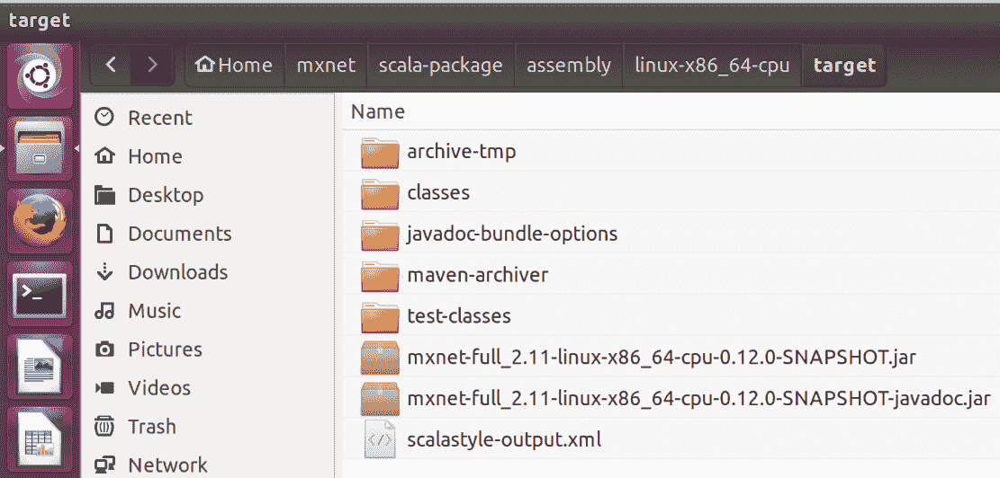

图 9: MXNet 预构建的二进制生成

现在，在作为 Maven(或 SBT)项目开始在 Eclipse(或 IntelliJ)上编写 Scala 代码之前，下一个任务是将这个 JAR 包含在构建路径中。此外，我们需要 Scala 图和`args4j`的一些额外依赖:

```scala
<dependency>
    <groupId>org.sameersingh.scalaplot</groupId>
    <artifactId>scalaplot</artifactId>
    <version>0.0.4</version>
</dependency>
<dependency>
    <groupId>args4j</groupId>
    <artifactId>args4j</artifactId>
    <version>2.0.29</version>
</dependency>
```

干得好！一切就绪，我们准备出发了！开始编码吧。


# 为 HAR 实施 LSTM 模式

总体算法(`HumanAR.scala`)有如下工作流程:

*   加载数据
*   定义超参数
*   使用命令式编程和超参数建立 LSTM 模型
*   应用分批训练，即挑选批量数据，将其输入模型，然后在一些迭代中评估模型并打印批次损失和准确度
*   输出训练和测试错误的图表

可以通过流水线的方式遵循和构建前面的步骤:

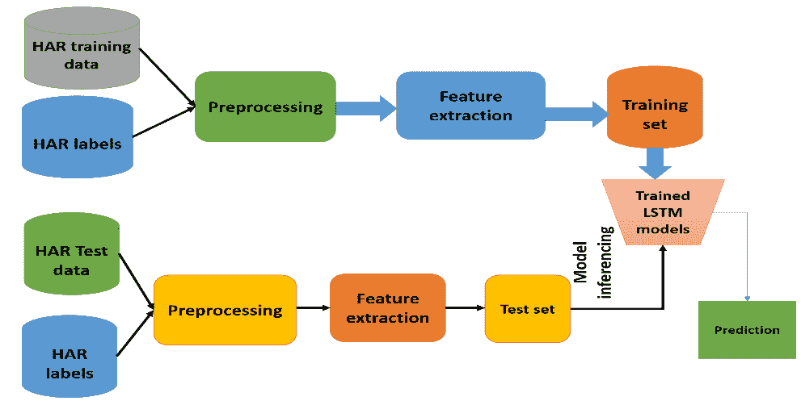

图 10: MXNet 预构建的二进制生成

现在让我们一步一步地开始实现。确保你理解每一行代码，然后在 Eclipse 或 SBT 中导入给定的项目。


# 步骤 1 -导入必要的库和包

让我们现在开始编码。我们从头开始，即通过导入库和包:

```scala
package com.packt.ScalaML.HAR 

import ml.dmlc.mxnet.Context 
import LSTMNetworkConstructor.LSTMModel 
import scala.collection.mutable.ArrayBuffer 
import ml.dmlc.mxnet.optimizer.Adam 
import ml.dmlc.mxnet.NDArray 
import ml.dmlc.mxnet.optimizer.RMSProp 
import org.sameersingh.scalaplot.MemXYSeries 
import org.sameersingh.scalaplot.XYData 
import org.sameersingh.scalaplot.XYChart 
import org.sameersingh.scalaplot.Style._ 
import org.sameersingh.scalaplot.gnuplot.GnuplotPlotter 
import org.sameersingh.scalaplot.jfreegraph.JFGraphPlotter  
```


# 步骤 2 -创建 MXNet 上下文

然后，我们为基于 CPU 的计算创建一个 MXNet 上下文。因为我是按 CPU 做的，所以我为 CPU 实例化。如果您已经通过提供设备 ID 进行了配置，请随意使用 GPU:

```scala
// Retrieves the name of this Context object 
val ctx = Context.cpu() 
```


# 步骤 3 -加载和解析训练和测试集

现在让我们加载数据集。我假设您已经将数据集复制到了`UCI_HAR_Dataset/`目录中。然后，如前所述放置其他数据文件:

```scala
val datasetPath = "UCI_HAR_Dataset/" 
val trainDataPath = s"$datasetPath/train/Inertial Signals" 
val trainLabelPath = s"$datasetPath/train/y_train.txt" 
val testDataPath = s"$datasetPath/test/Inertial Signals" 
val testLabelPath = s"$datasetPath/test/y_test.txt" 
```

现在是时候分别加载训练集和测试集了。为了做到这一点，我写了两个名为`loadData()`和`loadLabels()`的方法，它们在`Utils.scala`文件中。这两种方法及其签名将很快提供:

```scala
val trainData = Utils.loadData(trainDataPath, "train") 
val trainLabels = Utils.loadLabels(trainLabelPath) 
val testData = Utils.loadData(testDataPath, "test") 
val testLabels = Utils.loadLabels(testLabelPath) 
```

`loadData()`方法根据`INPUT_SIGNAL_TYPES`数组定义的输入信号类型以`Array[Array[Array[Float]]]`格式加载并映射来自每个`.txt`文件的数据:

```scala
def loadData(dataPath: String, name: String): Array[Array[Array[Float]]] = { 
    val dataSignalsPaths = INPUT_SIGNAL_TYPES.map( signal => s"$dataPath/${signal}${name}.txt" ) 
    val signals = dataSignalsPaths.map { path =>  
      Source.fromFile(path).mkString.split("n").map { line =>  
        line.replaceAll("  ", " ").trim().split(" ").map(_.toFloat) } 
    } 

    val inputDim = signals.length 
    val numSamples = signals(0).length 
    val timeStep = signals(0)(0).length   

    (0 until numSamples).map { n =>  
      (0 until timeStep).map { t => 
        (0 until inputDim).map( i => signals(i)(n)(t) ).toArray 
      }
    .toArray 
    }
    .toArray 
  } 
```

如前所述，`INPUT_SIGNAL_TYPES`包含一些有用的常数:它们是神经网络的独立的、标准化的输入特征:

```scala
private val INPUT_SIGNAL_TYPES = Array( 
    "body_acc_x_", 
    "body_acc_y_", 
    "body_acc_z_", 
    "body_gyro_x_", 
    "body_gyro_y_", 
    "body_gyro_z_", 
    "total_acc_x_", 
    "total_acc_y_", 
    "total_acc_z_") 
```

另一方面，`loadLabels()`也是一个用户定义的方法，用于仅加载训练和测试集中的标签:

```scala
def loadLabels(labelPath: String): Array[Float] = {          
       Source.fromFile(labelPath).mkString.split("n").map(_.toFloat - 1)
            } 
```

标签在另一个数组中定义，如下面的代码所示:

```scala
// Output classes: used to learn how to classify 
private val LABELS = Array( 
    "WALKING",  
    "WALKING_UPSTAIRS",  
    "WALKING_DOWNSTAIRS",  
    "SITTING",  
    "STANDING",  
    "LAYING") 
```


# 步骤 4 -数据集的探索性分析

现在让我们来看一些关于训练系列的数量(如前所述，每个系列之间有 50%的重叠)、测试系列的数量、每个系列的时间步长的数量以及每个时间步长的输入参数的数量的统计数据:

```scala
val trainingDataCount = trainData.length // No. of training series  
val testDataCount = testData.length // No. of testing series 
val nSteps = trainData(0).length // No. of timesteps per series 
val nInput = trainData(0)(0).length // No. of input parameters per timestep 

println("Number of training series: "+ trainingDataCount) 
println("Number of test series: "+ testDataCount) 
println("Number of timestep per series: "+ nSteps) 
println("Number of input parameters per timestep: "+ nInput) 
>>>
```

输出是:

```scala
Number of training series: 7352
Number of test series: 2947
Number of timestep per series: 128
Number of input parameters per timestep: 9
```


# 步骤 5 -定义内部 RNN 结构和 LSTM 超参数

现在，让我们为 LSTM 网络定义内部神经网络结构和超参数:

```scala
val nHidden = 128 // Number of features in a hidden layer  
val nClasses = 6 // Total classes to be predicted  

val learningRate = 0.001f 
val trainingIters = trainingDataCount * 100  // iterate 100 times on trainset: total 7352000 iterations 
val batchSize = 1500 
val displayIter = 15000  // To show test set accuracy during training 
val numLstmLayer = 3 
```


# 第六步- LSTM 网络建设

现在，让我们用前面的参数和结构建立一个 LSTM 模型:

```scala
val model = LSTMNetworkConstructor.setupModel(nSteps, nInput, nHidden, nClasses, batchSize, ctx = ctx) 
```

在前面的一行中，`setupModel()`是实现这个技巧的方法。`getSymbol()`方法实际上构建了 LSTM 单元。稍后我们也会看到它的签名。它接受序列长度、输入数、隐藏层数、标签数、批量大小、LSTM 层数、漏失 MXNet 上下文，并使用 case 类`LSTMModel`构建类型的 LSTM 模型:

```scala
case class LSTMModel(exec: Executor, symbol: Symbol, data: NDArray, label: NDArray, argsDict: Map[String,                     NDArray], gradDict: Map[String, NDArray]) 
```

下面是`setupModel()`的签名:

```scala
def setupModel(seqLen: Int, nInput: Int, numHidden: Int, numLabel: Int, batchSize: Int, numLstmLayer: Int = 1, dropout: Float = 0f, ctx: Context = Context.cpu()): LSTMModel = { 
//get the symbolic model 
    val sym = LSTMNetworkConstructor.getSymbol(seqLen, numHidden, numLabel, numLstmLayer = numLstmLayer) 
    val argNames = sym.listArguments() 
    val auxNames = sym.listAuxiliaryStates() 
// defining the initial argument and binding them to the model 
    val initC = for (l <- 0 until numLstmLayer) yield (s"l${l}_init_c", (batchSize, numHidden)) 
    val initH = for (l <- 0 until numLstmLayer) yield (s"l${l}_init_h", (batchSize, numHidden)) 
    val initStates = (initC ++ initH).map(x => x._1 -> Shape(x._2._1, x._2._2)).toMap 
    val dataShapes = Map("data" -> Shape(batchSize, seqLen, nInput)) ++ initStates 
    val (argShapes, outShapes, auxShapes) = sym.inferShape(dataShapes) 

    val initializer = new Uniform(0.1f) 
    val argsDict = argNames.zip(argShapes).map { case (name, shape) => 
       val nda = NDArray.zeros(shape, ctx) 
       if (!dataShapes.contains(name) && name != "softmax_label") { 
         initializer(name, nda) 
       } 
       name -> nda 
    }.toMap 

    val argsGradDict = argNames.zip(argShapes) 
         .filter(x => x._1 != "softmax_label" && x._1 != "data") 
         .map( x => x._1 -> NDArray.zeros(x._2, ctx) ).toMap 

    val auxDict = auxNames.zip(auxShapes.map(NDArray.zeros(_, ctx))).toMap 
    val exec = sym.bind(ctx, argsDict, argsGradDict, "write", auxDict, null, null) 
    val data = argsDict("data") 
    val label = argsDict("softmax_label")  
    LSTMModel(exec, sym, data, label, argsDict, argsGradDict)
} 
```

在前面的方法中，我们使用`getSymbol()`方法获得了深层 RNN 的符号模型，如下所示。我已经提供了详细的注释，相信这将足以理解代码的工作流程:

```scala
 private def getSymbol(seqLen: Int, numHidden: Int, numLabel: Int, numLstmLayer: Int = 1, 
                        dropout: Float = 0f): Symbol = {  
                //symbolic training and label variables 
                var inputX = Symbol.Variable("data") 
                val inputY = Symbol.Variable("softmax_label") 

                //the initial parameters and cells 
                var paramCells = Array[LSTMParam]() 
                var lastStates = Array[LSTMState]() 
                //numLstmLayer is 1  
                for (i <- 0 until numLstmLayer) { 
                    paramCells = paramCells :+ LSTMParam(i2hWeight =
                    Symbol.Variable(s"l${i}_i2h_weight"), 
                    i2hBias = Symbol.Variable(s"l${i}_i2h_bias"),                                                                                     
                    h2hWeight = Symbol.Variable(s"l${i}_h2h_weight"),                                                                                                                                   
                    h2hBias = Symbol.Variable(s"l${i}_h2h_bias")) 
                    lastStates = lastStates :+ LSTMState(c =
                    Symbol.Variable(s"l${i}_init_c"),                                                                      
                    h = Symbol.Variable(s"l${i}_init_h")) 
            } 
            assert(lastStates.length == numLstmLayer) 
            val lstmInputs = Symbol.SliceChannel()(inputX)(Map("axis" 
            > 1, "num_outputs" -> seqLen,       
            "squeeze_axis" -> 1)) 

            var hiddenAll = Array[Symbol]() 
            var dpRatio = 0f 
            var hidden: Symbol = null 

//for each one of the 128 inputs, create a LSTM Cell 
            for (seqIdx <- 0 until seqLen) { 
                  hidden = lstmInputs.get(seqIdx) 
// stack LSTM, where numLstmLayer is 1 so the loop will be executed only one time 
                  for (i <- 0 until numLstmLayer) { 
                        if (i == 0) dpRatio = 0f else dpRatio = dropout 
//for each one of the 128 inputs, create a LSTM Cell 
                        val nextState = lstmCell(numHidden, inData = hidden, 
                          prevState = lastStates(i), 
                          param = paramCells(i), 
                          seqIdx = seqIdx, layerIdx = i, dropout =
                        dpRatio) 
                    hidden = nextState.h // has no effect 
                    lastStates(i) = nextState // has no effect 
              } 
// adding dropout before softmax has no effect- dropout is 0 due to numLstmLayer == 1 
              if (dropout > 0f) hidden = Symbol.Dropout()()(Map("data" -> hidden, "p" -> dropout)) 
// store the lstm cells output layers 
                  hiddenAll = hiddenAll :+ hidden
    } 
```

总之，该算法并行使用 128 个 LSTM 单元，我将所有 128 个单元连接起来，并将其馈送到输出激活层。让我们连接细胞，输出:

```scala
val finalOut = hiddenAll.reduce(_+_) 
```

然后，我们将它们连接到对应于 6 标签的输出层:

```scala
 val fc = Symbol.FullyConnected()()(Map("data" -> finalOut, "num_hidden" -> numLabel)) 
 //softmax activation against the label 
 Symbol.SoftmaxOutput()()(Map("data" -> fc, "label" -> inputY)) 
```

在前面的代码段中，`LSTMState`和`LSTMParam`是两个 case 类，用于定义每个 LSTM 单元的状态，后者接受构建 LSTM 单元所需的参数。结案类`LSTMState(c: Symbol, h: Symbol)`结案类`LSTMParam(i2hWeight: Symbol, i2hBias: Symbol, h2hWeight: Symbol, h2hBias: Symbol)`。

现在该讨论最重要的一步了，那就是 LSTM 细胞的构建。我们将使用一些图表和图例，如下图所示:

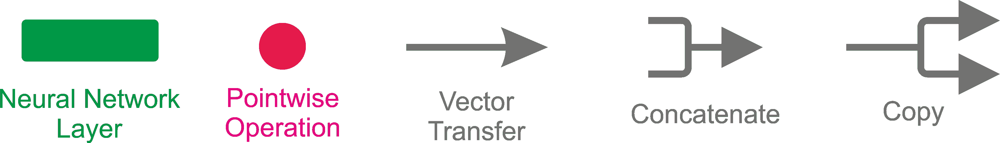

图 11:下面用来描述 LSTM 细胞的图例

LSTM 中的重复模块包含四个交互层，如下图所示:

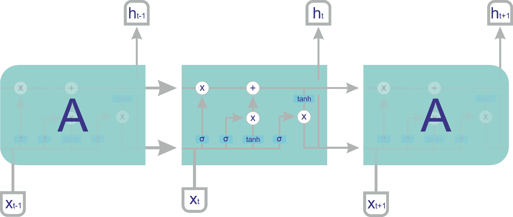

图 12:在 LSTM 单元中，也就是说，LSTM 中的重复模块包含四个相互作用的层

LSTM 单元由其统计数据和参数定义，如前两个 case 类所定义的:

*   **LSTM 状态** : **c** 是在训练期间使用的单元状态(其记忆知识),而 **h** 是输出
*   **LSTM 参数**:由训练算法优化
*   **i2hWeight** :输入隐藏重量
*   **i2hBias** :隐藏偏置的输入
*   **h2hwweight**:隐藏到隐藏重量
*   **h2hBias** :隐藏到隐藏偏置
*   **i2h** :输入数据的神经网络
*   **h2h** :前一个 **h** 的 NN

在代码中，两个完全连接的层被创建、连接，并通过以下代码转换为四个副本。让我们添加一个大小为`numHidden * 4` ( `numHidden`设置为 28)的隐藏层，它将`inputdata`作为输入:

```scala
val i2h = Symbol.FullyConnected(s"t${seqIdx}_l${layerIdx}_i2h")()(Map("data" -> inDataa, "weight" ->                 param.i2hWeight, "bias" -> param.i2hBias, "num_hidden" -> numHidden * 4)) 
```

然后，我们添加一个大小为`numHidden * 4` ( `numHidden`设置为 28)的隐藏层，它将单元格的先前输出作为输入:

```scala
val h2h = Symbol.FullyConnected(s"t${seqIdx}_l${layerIdx}_h2h")()(Map("data" -> prevState.h,"weight" ->             param.h2hWeight,"bias" -> param.h2hBias,"num_hidden" -> numHidden * 4)) 
```

现在让我们将它们连接在一起:

```scala
val gates = i2h + h2h 
```

那么，在计算门之前，让我们复制四份门:

```scala
val sliceGates = Symbol.SliceChannel(s"t${seqIdx}_l${layerIdx}_slice")(gates)(Map("num_outputs" -> 4)) 
```

然后我们计算门:

```scala
val sliceGates = Symbol.SliceChannel(s"t${seqIdx}_l${layerIdx}_slice")(gates)(Map("num_outputs" -> 4)) 
```

现在，遗忘门的激活由以下代码表示:

```scala
val forgetGate = Symbol.Activation()()(Map("data" -> sliceGates.get(2), "act_type" -> "sigmoid")) 
```

我们可以在下图中看到这一点:

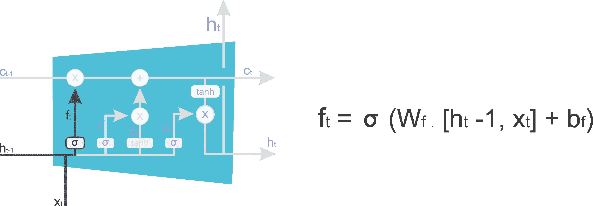

图 13:忘记 LSTM 牢房中的门

现在，in 门和 in 转换的激活由以下代码表示:

```scala
val ingate = Symbol.Activation()()(Map("data" -> sliceGates.get(0), "act_type" -> "sigmoid"))   
val inTransform = Symbol.Activation()()(Map("data" -> sliceGates.get(1), "act_type" -> "tanh")) 
```

我们也可以在*图 14 中看到这一点:*

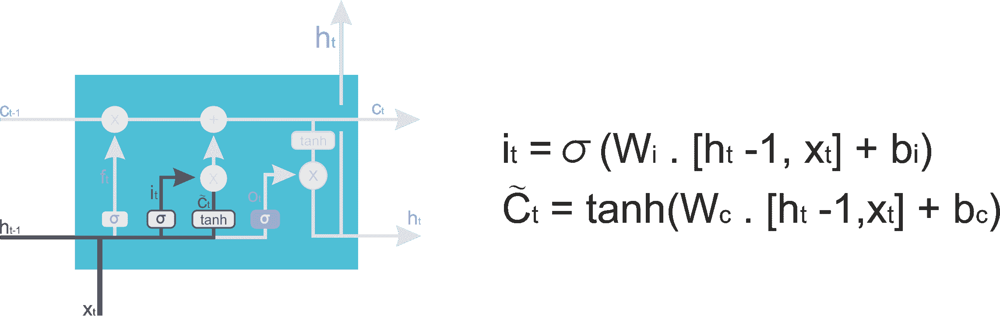

图 14:LSTM 单元中的输入门和转换门

下一个状态由以下代码定义:

```scala
val nextC = (forgetGate * prevState.c) + (ingate * inTransform) 
```

上述代码也可以用下图表示:

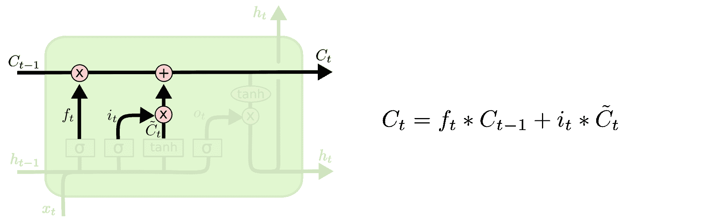

图 15:LSTM 单元中的下一个或传输门

最后，输出门可以用以下代码表示:

```scala
val nextH = outGate * Symbol.Activation()()(Map("data" -> nextC, "act_type" -> "tanh")) 
```

上述代码也可以用下图表示:

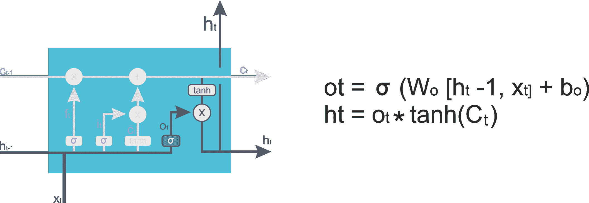

图 16:LSTM 单元中的输出门

太多了吗？别担心，这里我提供了这个方法的完整代码:

```scala
  // LSTM Cell symbol 
  private def lstmCell( numHidden: Int, inData: Symbol, prevState: LSTMState, param: LSTMParam, 
                        seqIdx: Int, layerIdx: Int, dropout: Float = 0f): LSTMState = { 
        val inDataa = { 
              if (dropout > 0f) Symbol.Dropout()()(Map("data" -> inData, "p" -> dropout)) 
              else inData 
                } 
        // add an hidden layer of size numHidden * 4 (numHidden set //to 28) that takes as input) 
        val i2h = Symbol.FullyConnected(s"t${seqIdx}_l${layerIdx}_i2h")()(Map("data" -> inDataa,"weight"                             -> param.i2hWeight,"bias" -> param.i2hBias,"num_hidden" -> numHidden * 4)) 
        // add an hidden layer of size numHidden * 4 (numHidden set to 28) that takes output of the cell  
        val h2h = Symbol.FullyConnected(s"t${seqIdx}_l${layerIdx}_h2h")()(Map("data" ->                                    prevState.h,"weight" -> param.h2hWeight,"bias" -> param.h2hBias,"num_hidden" -> numHidden * 4)) 

        //concatenate them                                        
        val gates = i2h + h2h  

        //make 4 copies of gates 
        val sliceGates=Symbol.SliceChannel(s"t${seqIdx}_l${layerIdx}_slice")(gates)(Map("num_outputs" 
       -> 4)) 
        // compute the gates 
        val ingate = Symbol.Activation()()(Map("data" -> sliceGates.get(0), "act_type" -> "sigmoid")) 
        val inTransform = Symbol.Activation()()(Map("data" -> sliceGates.get(1), "act_type" -> "tanh")) 
        val forgetGate = Symbol.Activation()()(Map("data" -> sliceGates.get(2), "act_type" -> "sigmoid")) 
        val outGate = Symbol.Activation()()(Map("data" -> sliceGates.get(3), "act_type" -> "sigmoid")) 
        // get the new cell state and the output 
        val nextC = (forgetGate * prevState.c) + (ingate * inTransform) 
        val nextH = outGate * Symbol.Activation()()(Map("data" -> nextC, "act_type" -> "tanh")) 
        LSTMState(c = nextC, h = nextH) 
  } 
```


# 步骤 7 -设置优化器

正如许多研究人员建议的那样，`RMSProp`优化器有助于 LSTM 网络快速收敛。因此，我决定在这里也使用它:

```scala
val opt = new RMSProp(learningRate = learningRate) 
```

此外，要优化的模型参数是其参数，除了训练数据和标签(权重和偏差):

```scala
val paramBlocks = model.symbol.listArguments() 
      .filter(x => x != "data" && x != "softmax_label") 
      .zipWithIndex.map { case (name, idx) => 
        val state = opt.createState(idx, model.argsDict(name)) 
        (idx, model.argsDict(name), model.gradDict(name), state, name) 
      }
    .toArray 
```


# 步骤 8 -训练 LSTM 网络

现在我们将开始训练 LSTM 网络。但是，在开始之前，让我们尝试定义一些变量来跟踪培训的表现:

```scala
val testLosses = ArrayBuffer[Float]() 
val testAccuracies = ArrayBuffer[Float]() 
val trainLosses = ArrayBuffer[Float]() 
val trainAccuracies = ArrayBuffer[Float]()     
```

然后，我们开始执行训练步骤，在每个循环中进行`batch_size`次迭代:

```scala
var step = 1 
while (step * batchSize <= trainingIters) { 
    val (batchTrainData, batchTrainLabel) = { 
        val idx = ((step - 1) * batchSize) % trainingDataCount 
        if (idx + batchSize <= trainingDataCount) { 
          val datas = trainData.drop(idx).take(batchSize) 
          val labels = trainLabels.drop(idx).take(batchSize) 
          (datas, labels) 
        } else { 
          val right = (idx + batchSize) - trainingDataCount 
          val left = trainingDataCount - idx 
          val datas = trainData.drop(idx).take(left) ++ trainData.take(right) 
          val labels = trainLabels.drop(idx).take(left) ++ trainLabels.take(right) 
          (datas, labels) 
    }  
} 
```

不要偏离主题，而是快速浏览一下*步骤 6* ，之前，我们已经实例化了 LSTM 模型。现在是向 RNN 提供输入和标签的时候了:

```scala
model.data.set(batchTrainData.flatten.flatten) 
model.label.set(batchTrainLabel) 
```

然后我们向前和向后传球:

```scala
model.exec.forward(isTrain = true) 
model.exec.backward() 
```

此外，我们需要使用在*步骤 7* 中定义的`RMSProp`优化器来更新参数:

```scala
paramBlocks.foreach { 
 case (idx, weight, grad, state, name) => opt.update(idx, weight, grad, state) 
    } 
```

获得训练错误等指标也很好，即训练数据的损失和准确性:

```scala
val (acc, loss) = getAccAndLoss(model.exec.outputs(0), batchTrainLabel) 
      trainLosses += loss / batchSize 
      trainAccuracies += acc / batchSize 
```

在前面的代码段中，`getAccAndLoss()`是一种计算损失和精度的方法，如下所示:

```scala
def getAccAndLoss(pred: NDArray, label: Array[Float], dropNum: Int = 0): (Float, Float) = { 
    val shape = pred.shape 
    val maxIdx = NDArray.argmax_channel(pred).toArray 
    val acc = { 
      val sum = maxIdx.drop(dropNum).zip(label.drop(dropNum)).foldLeft(0f){ case (acc, elem) =>  
        if (elem._1 == elem._2) acc + 1 else acc 
      } 
      sum 
    } 
    val loss = pred.toArray.grouped(shape(1)).drop(dropNum).zipWithIndex.map { case (array, idx) => 
        array(maxIdx(idx).toInt)   
      }.map(-Math.log(_)).sum.toFloat    
 (acc, loss)  
} 
```

此外，在某些步骤中只评估网络以加快培训速度也是令人兴奋的:

```scala
if ( (step * batchSize % displayIter == 0) || (step == 1) || (step * batchSize > trainingIters) ) { 
        println(s"Iter ${step * batchSize}, Batch Loss = ${"%.6f".format(loss / batchSize)}, 
        Accuracy = ${acc / batchSize}") 
    }
Iter 1500, Batch Loss = 1.189168, Accuracy = 0.14266667
 Iter 15000, Batch Loss = 0.479527, Accuracy = 0.53866667
 Iter 30000, Batch Loss = 0.293270, Accuracy = 0.83933336
 Iter 45000, Batch Loss = 0.192152, Accuracy = 0.78933334
 Iter 60000, Batch Loss = 0.118560, Accuracy = 0.9173333
 Iter 75000, Batch Loss = 0.081408, Accuracy = 0.9486667
 Iter 90000, Batch Loss = 0.109803, Accuracy = 0.9266667
 Iter 105000, Batch Loss = 0.095064, Accuracy = 0.924
 Iter 120000, Batch Loss = 0.087000, Accuracy = 0.9533333
 Iter 135000, Batch Loss = 0.085708, Accuracy = 0.966
 Iter 150000, Batch Loss = 0.068692, Accuracy = 0.9573333
 Iter 165000, Batch Loss = 0.070618, Accuracy = 0.906
 Iter 180000, Batch Loss = 0.089659, Accuracy = 0.908
 Iter 195000, Batch Loss = 0.088301, Accuracy = 0.87333333
 Iter 210000, Batch Loss = 0.067824, Accuracy = 0.9026667
 Iter 225000, Batch Loss = 0.060650, Accuracy = 0.9033333
 Iter 240000, Batch Loss = 0.045368, Accuracy = 0.93733335
 Iter 255000, Batch Loss = 0.049854, Accuracy = 0.96
 Iter 270000, Batch Loss = 0.062839, Accuracy = 0.968
 Iter 285000, Batch Loss = 0.052522, Accuracy = 0.986
 Iter 300000, Batch Loss = 0.060304, Accuracy = 0.98733336
 Iter 315000, Batch Loss = 0.049382, Accuracy = 0.9993333
 Iter 330000, Batch Loss = 0.052441, Accuracy = 0.9766667
 Iter 345000, Batch Loss = 0.050224, Accuracy = 0.9546667
 Iter 360000, Batch Loss = 0.057141, Accuracy = 0.9306667
 Iter 375000, Batch Loss = 0.047664, Accuracy = 0.938
 Iter 390000, Batch Loss = 0.047909, Accuracy = 0.93333334
 Iter 405000, Batch Loss = 0.043014, Accuracy = 0.9533333
 Iter 420000, Batch Loss = 0.054124, Accuracy = 0.952
 Iter 435000, Batch Loss = 0.044272, Accuracy = 0.95133334
 Iter 450000, Batch Loss = 0.058916, Accuracy = 0.96066666
 Iter 465000, Batch Loss = 0.072512, Accuracy = 0.9486667
 Iter 480000, Batch Loss = 0.080431, Accuracy = 0.94733334
 Iter 495000, Batch Loss = 0.072193, Accuracy = 0.9726667
 Iter 510000, Batch Loss = 0.068242, Accuracy = 0.972
 Iter 525000, Batch Loss = 0.057797, Accuracy = 0.964
 Iter 540000, Batch Loss = 0.063531, Accuracy = 0.918
 Iter 555000, Batch Loss = 0.068177, Accuracy = 0.9126667
 Iter 570000, Batch Loss = 0.053257, Accuracy = 0.9206667
 Iter 585000, Batch Loss = 0.058263, Accuracy = 0.9113333
 Iter 600000, Batch Loss = 0.054180, Accuracy = 0.90466666
 Iter 615000, Batch Loss = 0.051008, Accuracy = 0.944
 Iter 630000, Batch Loss = 0.051554, Accuracy = 0.966
 Iter 645000, Batch Loss = 0.059238, Accuracy = 0.9686667
 Iter 660000, Batch Loss = 0.051297, Accuracy = 0.9713333
 Iter 675000, Batch Loss = 0.052069, Accuracy = 0.984
 Iter 690000, Batch Loss = 0.040501, Accuracy = 0.998
 Iter 705000, Batch Loss = 0.053661, Accuracy = 0.96066666
 ter 720000, Batch Loss = 0.037088, Accuracy = 0.958
 Iter 735000, Batch Loss = 0.039404, Accuracy = 0.9533333
```


# 步骤 9 -评估模型

干得好！我们已经完成了训练。现在评估测试集怎么样:

```scala
 val (testLoss, testAcc) = test(testDataCount, batchSize, testData, testLabels, model)         
  println(s"TEST SET DISPLAY STEP:  Batch Loss = ${"%.6f".format(testLoss)}, Accuracy = $testAcc") 
        testAccuracies += testAcc 
        testLosses += testLoss 
      } 
      step += 1 
    }     
  val (finalLoss, accuracy) = test(testDataCount, batchSize, testData, testLabels, model) 
  println(s"FINAL RESULT: Batch Loss= $finalLoss, Accuracy= $accuracy") 
```

```scala
TEST SET DISPLAY STEP: Batch Loss = 0.065859, Accuracy = 0.9138107
 TEST SET DISPLAY STEP: Batch Loss = 0.077047, Accuracy = 0.912114
 TEST SET DISPLAY STEP: Batch Loss = 0.069186, Accuracy = 0.90566677
 TEST SET DISPLAY STEP: Batch Loss = 0.059815, Accuracy = 0.93043774
 TEST SET DISPLAY STEP: Batch Loss = 0.064162, Accuracy = 0.9192399
 TEST SET DISPLAY STEP: Batch Loss = 0.063574, Accuracy = 0.9307771
 TEST SET DISPLAY STEP: Batch Loss = 0.060209, Accuracy = 0.9229725
 TEST SET DISPLAY STEP: Batch Loss = 0.062598, Accuracy = 0.9290804
 TEST SET DISPLAY STEP: Batch Loss = 0.062686, Accuracy = 0.9311164
 TEST SET DISPLAY STEP: Batch Loss = 0.059543, Accuracy = 0.9250085
 TEST SET DISPLAY STEP: Batch Loss = 0.059646, Accuracy = 0.9263658
 TEST SET DISPLAY STEP: Batch Loss = 0.062546, Accuracy = 0.92941976
 TEST SET DISPLAY STEP: Batch Loss = 0.061765, Accuracy = 0.9263658
 TEST SET DISPLAY STEP: Batch Loss = 0.063814, Accuracy = 0.9307771
 TEST SET DISPLAY STEP: Batch Loss = 0.062560, Accuracy = 0.9324737
 TEST SET DISPLAY STEP: Batch Loss = 0.061307, Accuracy = 0.93518835
 TEST SET DISPLAY STEP: Batch Loss = 0.061102, Accuracy = 0.93281305
 TEST SET DISPLAY STEP: Batch Loss = 0.054946, Accuracy = 0.9375636
 TEST SET DISPLAY STEP: Batch Loss = 0.054461, Accuracy = 0.9365456
 TEST SET DISPLAY STEP: Batch Loss = 0.050856, Accuracy = 0.9290804
 TEST SET DISPLAY STEP: Batch Loss = 0.050600, Accuracy = 0.9334917
 TEST SET DISPLAY STEP: Batch Loss = 0.057579, Accuracy = 0.9277231
 TEST SET DISPLAY STEP: Batch Loss = 0.062409, Accuracy = 0.9324737
 TEST SET DISPLAY STEP: Batch Loss = 0.050926, Accuracy = 0.9409569
 TEST SET DISPLAY STEP: Batch Loss = 0.054567, Accuracy = 0.94027823
 FINAL RESULT: Batch Loss= 0.0545671,
 Accuracy= 0.94027823
```

雅虎！我们已经达到了 94%的准确率，这真的很了不起。在前面的代码中，`test()`是用于评估模型性能的方法。模型的签名在下面的代码中给出:

```scala
def test(testDataCount: Int, batchSize: Int, testDatas: Array[Array[Array[Float]]], 
      testLabels: Array[Float], model: LSTMModel): (Float, Float) = { 
    var testLoss, testAcc = 0f 
    for (begin <- 0 until testDataCount by batchSize) { 
      val (testData, testLabel, dropNum) = { 
        if (begin + batchSize <= testDataCount) { 
          val datas = testDatas.drop(begin).take(batchSize) 
          val labels = testLabels.drop(begin).take(batchSize) 
          (datas, labels, 0) 
        } else { 
          val right = (begin + batchSize) - testDataCount 
          val left = testDataCount - begin 
          val datas = testDatas.drop(begin).take(left) ++ testDatas.take(right) 
          val labels = testLabels.drop(begin).take(left) ++ testLabels.take(right) 
          (datas, labels, right) 
        } 
      } 
      //feed the test data to the deepNN 
      model.data.set(testData.flatten.flatten) 
      model.label.set(testLabel) 

      model.exec.forward(isTrain = false) 
      val (acc, loss) = getAccAndLoss(model.exec.outputs(0), testLabel) 
      testLoss += loss 
      testAcc += acc 
    } 
    (testLoss / testDataCount, testAcc / testDataCount) 
  } 
```

完成后，销毁模型以释放资源是一个很好的实践:

```scala
model.exec.dispose() 
```

我们之前看到，我们在测试集上实现了高达 93%的准确率。在图表中查看以前的精度和误差如何:

```scala
    // visualize 
    val xTrain = (0 until trainLosses.length * batchSize by batchSize).toArray.map(_.toDouble) 
    val yTrainL = trainLosses.toArray.map(_.toDouble) 
    val yTrainA = trainAccuracies.toArray.map(_.toDouble) 

    val xTest = (0 until testLosses.length * displayIter by displayIter).toArray.map(_.toDouble) 
    val yTestL = testLosses.toArray.map(_.toDouble) 
    val yTestA = testAccuracies.toArray.map(_.toDouble) 
    var series = new MemXYSeries(xTrain, yTrainL, "Train losses") 
    val data = new XYData(series)       
    series = new MemXYSeries(xTrain, yTrainA, "Train accuracies") 
    data += series 
    series = new MemXYSeries(xTest, yTestL, "Test losses") 
    data += series     
    series = new MemXYSeries(xTest, yTestA, "Test accuracies") 
    data += series 
    val chart = new XYChart("Training session's progress over iterations!", data) 
    chart.showLegend = true 
    val plotter = new JFGraphPlotter(chart)
    plotter.gui() 
>>>
```

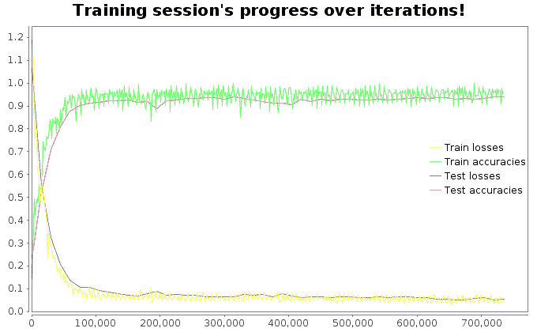

图 17:每次迭代的训练和测试损失和准确性

从上图可以清楚地看出，只需几次迭代，我们的 LSTM 就能很好地收敛，并产生非常好的分类精度。


# 调谐 LSTM 超参数和 GRU

尽管如此，我仍然相信有更多的 LSTM 层可以达到 100%的精确度。以下是我仍然会尝试调整以查看准确性的超参数:

```scala
// Hyper parameters for the LSTM training
val learningRate = 0.001f
val trainingIters = trainingDataCount * 1000 // Loop 1000 times on the dataset
val batchSize = 1500 // I would set it 5000 and see the performance
val displayIter = 15000 // To show test set accuracy during training
val numLstmLayer = 3 // 5, 7, 9 etc.
```

LSTM 细胞还有许多其他的变种。一个特别受欢迎的变体是**门控循环单元** ( **GRU** )细胞，这是 LSTM 上的一个略微引人注目的变体。它还合并了单元格状态和隐藏状态，并进行一些其他更改。由此产生的模型比标准的 LSTM 模型更简单，并且越来越受欢迎。该单元由 Kyunghyun Cho 等人在 2014 年的一篇论文中提出，该论文还介绍了我们前面提到的编码器-解码器网络。

对于这种类型的 LSTM，感兴趣的读者应该参考以下出版物:

*   *使用用于统计机器翻译的 RNN 编码器-解码器学习短语表示*，K. Cho 等人(2014)。
*   Klaus Greff 等人在 2015 年发表的一篇论文 *LSTM:太空探索之旅*，似乎表明所有 LSTM 变体的表现大致相同。

从技术上讲，GRU 单元是 LSTM 单元的简化版本，其中两个状态向量合并成一个称为 **h(t)** 的向量。单个门控制器控制遗忘门和输入门。如果门控制器输出 1，输入门打开，遗忘门关闭:

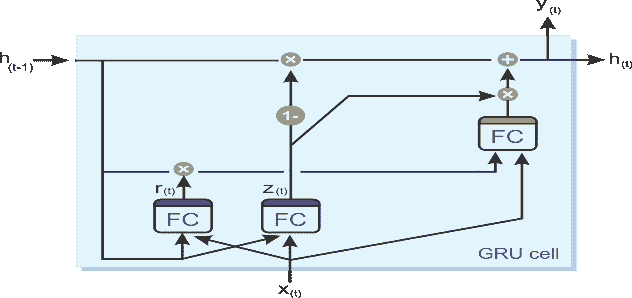

图 18:GRU 细胞的内部结构

另一方面，如果它输出 0，则会发生相反的情况。每当必须存储一个存储器时，它将被存储的位置首先被擦除，这实际上是 LSTM 单元本身的一个常见变体。第二个简化是，由于在每个时间步长都输出完整的状态向量，因此没有输出门。但是，引入了一个新的门控制器，它控制先前状态的哪一部分将显示给主层。以下等式用于对单个实例的单元的长期状态、短期状态以及每个时间步长的输出进行 GRU 计算:

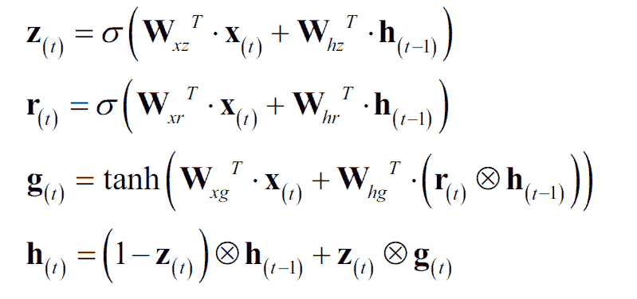

LSTM 和 GRU 细胞是近年来 RNNs 成功的主要原因之一，特别是在 NLP 中的应用。


# 摘要

在这一章中，我们已经看到了如何使用 RNN 实现开发一个 ML 项目，并使用智能手机数据集为 HAR 调用 LSTM。我们的 LSTM 模型已经能够将运动类型分为六类:行走、上楼、下楼、坐着、站着和躺着。特别是，我们已经达到了高达 94%的准确率。随后，我们讨论了利用 GRU 池进一步提高精度的一些可能的方法。

一个**卷积神经网络** ( **CNN** )是一种前馈神经网络，其神经元之间的连接模式受到动物视觉皮层的启发。在过去的几年里，CNN 在复杂的视觉任务中表现出了超人的性能，如图像搜索服务、自动驾驶汽车、自动视频分类、语音识别和**自然语言处理** ( **NLP** )。

考虑到这些，在下一章我们将看到如何开发一个端到端的项目，在真实的 Yelp 图像数据集上使用基于 Scala 和 Deeplearning4j 框架的 CNN 来处理多标签(即每个实体可以属于多个类)图像分类问题。在开始之前，我们还将讨论 CNN 的一些理论方面。此外，我们将讨论如何调整超参数以获得更好的分类结果。