# 十一、基于卷积神经网络的图像分类

到目前为止，我们还没有开发出任何针对图像处理任务的**机器学习** ( **ML** )项目。线性 ML 模型和其他常规的**深度神经网络** ( **DNN** )模型，如**多层感知器** ( **MLPs** )或**深度信念网络** ( **DBNs** )无法从图像中学习或建模非线性特征。

另一方面，**卷积神经网络** ( **CNN** )是一种前馈神经网络，其中其神经元之间的连接模式受到动物视觉皮层的启发。在过去的几年里，CNN 在复杂的视觉任务中表现出了超人的性能，如图像搜索服务、自动驾驶汽车、自动视频分类、语音识别和**自然语言处理** ( **NLP** )。

在这一章中，我们将看到如何使用基于 Scala 和**deep learning 4j**(**DL4j**)框架的 CNN 和真实的 **Yelp** 图像数据集开发一个端到端的项目来处理多标签(即每个实体可以属于多个类别)图像分类问题。我们还将讨论 CNN 的一些理论方面，以及在开始之前如何调整超参数以获得更好的分类结果。

简而言之，在这个端到端项目中，我们将学习以下主题:

*   常规 dnn 的缺点
*   CNN 架构:卷积运算和池层
*   基于细胞神经网络的图像分类
*   调谐 CNN 超参数


# 图像分类及 DNNs 的缺陷

在我们开始开发使用 CNN 进行图像分类的端到端项目之前，我们需要一些背景研究，例如常规 DNNs 的缺点、CNN 相对于 DNNs 用于图像分类的适用性、CNN 的构造、CNN 的不同操作等等。虽然常规的 dnn 对于小图像(例如 MNIST、CIFAR-10)工作良好，但是对于较大的图像就不行了，因为它需要大量的参数。例如，一个 100 x 100 的图像有 10000 个像素，如果第一层只有 1000 个神经元(这已经严重限制了传输到下一层的信息量)，这意味着总共有 1000 万个连接。这只是第一层。

CNN 使用部分连接的层来解决这个问题。因为连续层仅部分连接，并且因为它大量重用其权重，所以 CNN 具有比完全连接的 DNN 少得多的参数，这使得训练更快，降低了过度拟合的风险，并且需要更少的训练数据。此外，当 CNN 已经学习了可以检测特定特征的核时，它可以在图像的任何地方检测该特征。相比之下，当 DNN 在一个位置学习一个特征时，它只能在那个特定的位置检测到它。由于图像通常具有非常重复的特征，对于图像处理任务，例如分类，使用较少的训练样本，CNN 能够比 DNNs 更好地概括。

重要的是，DNN 事先不知道像素是如何组织的；它不知道附近的像素是接近的。CNN 的架构嵌入了这种先验知识。较低层通常识别图像的小区域中的特征，而较高层将较低层的特征组合成较大的特征。这对于大多数自然图像都很有效，与 DNNs 相比，这给了 CNN 决定性的优势:

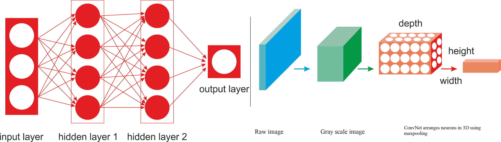

图 1:普通 DNN 与 CNN

比如在*图 1* 中，左边可以看到一个规则的三层神经网络。在右边，一个 ConvNet 在三维空间(宽度、高度和深度)排列它的神经元，就像在一个层中可视化的那样。ConvNet 的每一层都将 3D 输入体积转换为神经元激活的 3D 输出体积。红色输入层保存图像，因此它的宽度和高度是图像的尺寸，深度是三个(红色、绿色和蓝色通道)。

因此，我们研究的所有多层神经网络都有由一长串神经元组成的层，我们必须在将输入图像或数据馈送到神经网络之前，将它们展平到 1D。然而，一旦你试图直接向他们灌输 2D 形象，会发生什么呢？答案是，在 CNN 中，每一层都用 2D 表示，这样更容易将神经元与其相应的输入匹配起来。我们将在接下来的章节中看到它的例子。

另一个重要的事实是，特征图中的所有神经元共享相同的参数，因此它极大地减少了模型中的参数数量，但更重要的是，这意味着一旦 CNN 学会了在一个位置识别模式，它就可以在任何其他位置识别它。相比之下，一旦一只普通的 DNN 学会了在一个位置识别模式，它就只能在那个特定的位置识别它。


# CNN 架构

在多层网络中，例如 MLP 或 DBN，输入层的所有神经元的输出都连接到隐藏层中的每个神经元，因此输出将再次充当全连接层的输入。在 CNN 网络中，定义卷积层的连接方案明显不同。卷积层是 CNN 的主要层类型，其中每个神经元都连接到输入区的某个区域，称为**感受野**。

在典型的 CNN 架构中，几个卷积层以级联方式连接，其中每一层后面是一个**整流线性单元** ( **ReLU** )层，然后是一个汇集层，然后是几个卷积层(+ReLU)，然后是另一个汇集层，依此类推。

每个卷积层的输出是由单个内核过滤器生成的一组称为**特征图**的对象。然后，可以使用特征地图来定义下一层的新输入。CNN 网络中的每个神经元产生一个输出，后跟一个激活阈值，该阈值与输入成比例且不受限制:

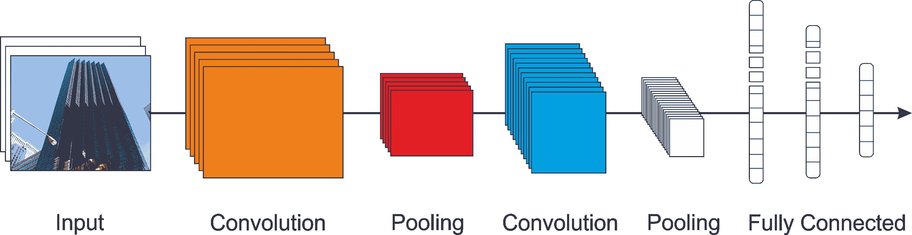

图 CNN 的概念架构

正如您在*图 2* 中看到的，池层通常位于卷积层之后。卷积区域然后被汇集层分成子区域。然后，使用最大池或平均池技术选择单个代表值，以减少后续层的计算时间。

这样，该特征相对于其空间位置的鲁棒性也得到提高。更具体地说，当作为特征地图的图像属性穿过图像时，它们随着穿过网络而变得越来越小，但是它们也通常变得越来越深，因为将添加更多的特征地图。在堆栈的顶部，添加了一个常规前馈神经网络，就像 MLP 一样，它可能由几个完全连接的层(+relu)组成，最后一层输出预测，例如，softmax 层输出多类分类的估计类概率。


# 卷积运算

卷积是一种数学运算，它将一个函数滑过另一个函数，并测量它们逐点相乘的积分。它与傅立叶变换和拉普拉斯变换有很深的联系，在信号处理中被大量使用。卷积层实际上使用互相关，这与卷积非常相似。

因此，CNN 最重要的组成部分是卷积层:第一个卷积层中的神经元并不连接到输入图像中的每个像素(如前几章所述)，而是只连接到其感受野中的像素——参见*图 3* 。反过来，第二卷积层中的每个神经元仅连接到位于第一层中的小矩形内的神经元:

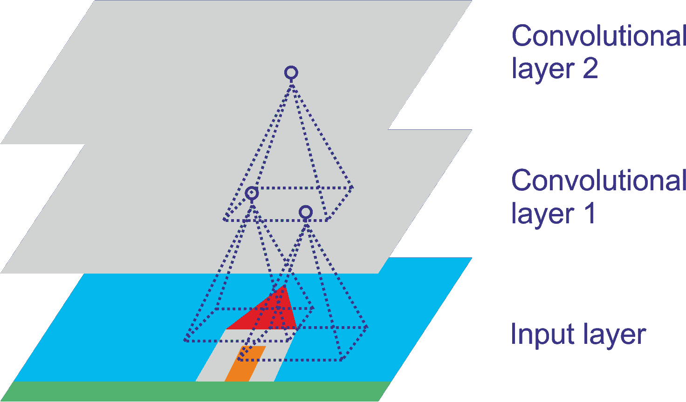

图 3:具有矩形局部感受野的 CNN 层

这种架构允许网络集中于第一个隐藏层中的低级特征，然后将它们组装成下一个隐藏层中的更高级特征，以此类推。这种层次结构在现实世界的图像中很常见，这也是 CNN 在图像识别方面如此出色的原因之一。


# 池层和填充操作

一旦理解了卷积层的工作原理，池层就很容易理解了。池层通常独立作用于每个输入通道，因此输出深度与输入深度相同。您也可以选择在深度维度上进行合并，我们将在下面看到，在这种情况下，图像的空间维度(高度和宽度)保持不变，但通道的数量减少了。让我们来看一个来自著名 TensorFlow 网站的池化图层的正式定义:

“汇集运算在输入张量上扫描矩形窗口，计算每个窗口的归约运算(平均值、最大值或具有 argmax 的最大值)。每个池操作使用大小为 ksize 的矩形窗口，由偏移步幅分隔。例如，如果步幅都是 1，则使用每个窗口，如果步幅都是 2，则在每个维度中使用每隔一个窗口，以此类推。”

因此，就像在卷积层中一样，汇集层中的每个神经元都连接到位于一个小矩形感受野内的前一层中有限数量的神经元的输出。您必须像前面一样定义它的大小、步幅和填充类型。然而，汇集的神经元没有权重；它所做的只是使用聚合函数(如最大值或平均值)来聚合输入。

使用池的目的是对输入图像进行二次采样，以减少计算量、内存使用量和参数数量。这有助于避免在训练阶段过度适应。减小输入图像尺寸也使得神经网络能够容忍一点点图像偏移。在下面的例子中，我们使用一个 2 x 2 的池化内核，步幅为 2，没有填充。只有每个内核中的最大输入值进入下一层，因为其他输入都被丢弃:

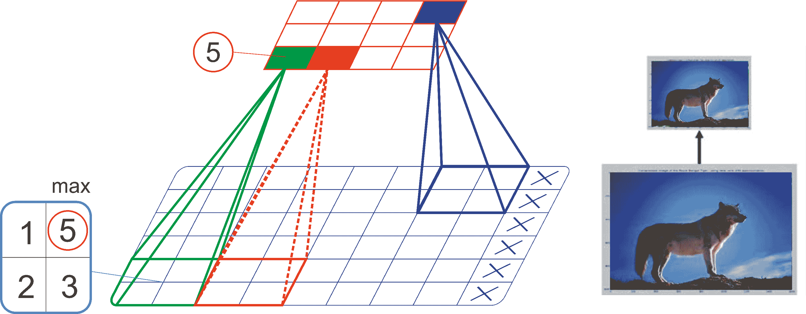

图 4:使用最大池的例子，即二次抽样

通常大多数基于 CNN 的网络开发推荐使用*(stride _ length)* x+filter _ size<= input _ layer _ size*。


# 子采样操作

如前所述，位于给定层的神经元连接到前一层神经元的输出。现在，为了使一个图层与前一个图层具有相同的高度和宽度，通常要在输入周围添加零，如图所示。这叫做**同**或**补零**。

术语“相同”表示输出要素地图与输入要素地图具有相同的空间维度。引入零填充是为了根据需要使形状匹配，在输入贴图的每一侧都相等。另一方面，VALID 意味着没有填充，只删除最右边的列(或最下面的行):

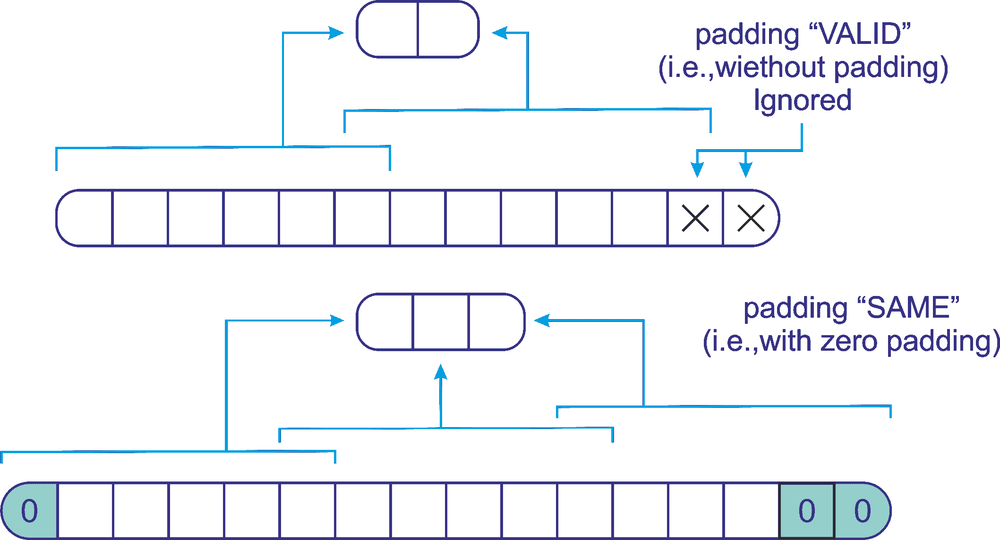

图 5:使用 CNN 的相同和有效填充

现在我们已经有了关于 CNN 及其架构的最基本的理论知识，是时候做一些实际工作，并使用 Deeplearning4j(又名。DL4j)，这是第一个为 Java 和 Scala 编写的商业级分布式开源深度学习库之一。它还提供了对 Hadoop 和 Spark 的集成支持。DL4j 设计用于分布式 GPU 和 CPU 上的业务环境。


# DL4j 中的卷积和子采样操作

在开始之前，设置我们的编程环境是一个先决条件。所以让我们先这样做。


# 配置 DL4j、ND4s 和 ND4j

以下库可以与 DL4j 集成。无论您是用 Java 还是 Scala 开发 ML 应用程序，它们都将使您的 JVM 体验更加轻松:

*   **DL4j** :神经网络平台
*   **ND4J**:JVM 的 NumPy
*   **data vec**:ML ETL 操作的工具
*   **JavaCPP**:Java 和原生 C++之间的桥梁
*   **仲裁器**:ML 算法的评估工具
*   **RL4J**:JVM 的深度强化学习

ND4j 就像 JVM 的 NumPy 一样。它附带了线性代数的一些基本操作，如矩阵创建、加法和乘法。另一方面，ND4S 是一个用于线性代数和矩阵操作的科学计算库。基本上，它支持基于 JVM 的语言的 n 维数组。

如果您在 Eclipse(或任何其他编辑器——即 IntelliJ IDEA)上使用 Maven，请在`pom.xml`文件中(在`<dependencies>`标记内)使用以下依赖项来解析 DL4j、ND4s 和 ND4j 的依赖项:

```
<dependency>
    <groupId>org.deeplearning4j</groupId>
    <artifactId>deeplearning4j-core</artifactId>
    <version>0.4-rc3.9</version>
</dependency>
<dependency>
    <artifactId>canova-api</artifactId>
    <groupId>org.nd4j</groupId>
    <version>0.4-rc3.9</version>
</dependency>
<dependency>
    <groupId>org.nd4j</groupId>
    <artifactId>nd4j-native</artifactId>
    <version>0.4-rc3.9</version>
</dependency>
<dependency>
    <groupId>org.nd4j</groupId>
    <artifactId>canova-api</artifactId>
    <version>0.0.0.17</version>
</dependency>
```

我使用旧版本，因为我面临一些兼容性问题，它仍在积极开发中。但请放心采用最新的升级。相信读者可以做到事半功倍。

此外，如果您的计算机上没有配置本机系统 BLAS，ND4j 的性能将会降低。一旦执行用 Scala 编写的简单代码，您将会遇到一个警告:

```
****************************************************************
WARNING: COULD NOT LOAD NATIVE SYSTEM BLAS
ND4J performance WILL be reduced
****************************************************************
```

但是，安装配置 OpenBLAS 或 IntelMKL 等 BLAS 并没有那么难；你可以投入一些时间去做。详情请参考以下网址:[http://nd4j.org/getstarted.html#open](http://nd4j.org/getstarted.html#open)。还应注意，使用 DL4j 时，以下是先决条件:

*   Java(开发人员版本)1.8+(仅支持 64 位版本)
*   用于自动构建和依赖管理器的 Apache Maven
*   IntelliJ IDEA 或 Eclipse
*   饭桶

干得好！我们的编程环境已经为简单的深度学习应用开发做好了准备。现在是时候使用一些示例代码了。让我们看看如何使用 CIFAR-10 数据集构建和训练一个简单的 CNN。CIFAR-10 是最受欢迎的基准数据集之一，拥有成千上万张带标签的图像。


# DL4j 中的卷积和子采样操作

在这一小节中，我们将看到一个如何为 MNIST 数据分类构建 CNN 的例子。该网络将具有两个卷积层、两个子采样层、一个密集层以及作为全连接层的输出层。第一层是卷积层，后面是二次采样层，再后面是另一个卷积层。然后，二次采样层之后是密集层，密集层之后是输出层。

让我们看看使用 DL4j 时这些层会是什么样子。以 ReLU 为激活函数的第一卷积层:

```
val layer_0 = new ConvolutionLayer.Builder(5, 5)
    .nIn(nChannels)
    .stride(1, 1)
    .nOut(20)
    .activation("relu")
    .build()
```

DL4j 目前支持以下激活功能:

*   热卢
*   泄漏 ReLU
*   双曲正切
*   乙状结肠的
*   硬鞣
*   Softmax
*   身份
*   **ELU** ( **指数线性单位**)
*   软设计
*   Softplus

第二层(即第一子采样层)是具有池类型`MAX`的子采样层，具有 2×2 的内核大小和 2×2 的步幅大小，但是没有激活函数:

```
val layer_1 = new SubsamplingLayer.Builder(SubsamplingLayer.PoolingType.MAX)
    .kernelSize(2, 2)
    .stride(2, 2)
    .build()
```

第三层(第二卷积层)是以 ReLU 为激活函数的卷积层，1*1 步距:

```

val layer_2 = new ConvolutionLayer.Builder(5, 5)
    .nIn(nChannels)
    .stride(1, 1)
    .nOut(50)
    .activation("relu")
    .build()
```

第四层(即第二个子采样层)是具有池类型`MAX`的子采样层，具有 2×2 的内核大小和 2×2 的步长大小，但是没有激活函数:

```
val layer_3 = new SubsamplingLayer.Builder(SubsamplingLayer.PoolingType.MAX)
    .kernelSize(2, 2)
    .stride(2, 2)
    .build()
```

第五层是具有 ReLU 作为激活函数的密集层:

```
val layer_4 = new DenseLayer.Builder()
    .activation("relu")
    .nOut(500)
    .build()
```

第六层(即，最终且完全连接的层)将 Softmax 作为激活函数，其具有要预测的类的数量(即，10):

```
val layer_5 = new OutputLayer.Builder(LossFunctions.LossFunction.NEGATIVELOGLIKELIHOOD)
    .nOut(outputNum)
    .activation("softmax")
    .build()
```

一旦构建了这些层，下一个任务就是通过链接所有层来构建 CNN。使用 DL4j，过程如下:

```
val builder: MultiLayerConfiguration.Builder = new NeuralNetConfiguration.Builder()
    .seed(seed)
    .iterations(iterations)
    .regularization(true).l2(0.0005)
    .learningRate(0.01)
    .weightInit(WeightInit.XAVIER)
   .optimizationAlgo(OptimizationAlgorithm.STOCHASTIC_GRADIENT_DESCENT)
    .updater(Updater.NESTEROVS).momentum(0.9)
    .list()
        .layer(0, layer_0)
        .layer(1, layer_1)
        .layer(2, layer_2)
        .layer(3, layer_3)
        .layer(4, layer_4)
        .layer(5, layer_5)
    .backprop(true).pretrain(false) // feedforward and supervised so no pretraining
```

最后，我们设置所有卷积层，并按如下方式初始化网络:

```
new ConvolutionLayerSetup(builder, 28, 28, 1) //image size is 28*28
val conf: MultiLayerConfiguration = builder.build()
val model: MultiLayerNetwork = new MultiLayerNetwork(conf)
model.init()
```

传统上，为了训练 CNN，所有的图像需要具有相同的形状和大小。因此，为了简单起见，我在前面几行中将尺寸设为 28 x 28。现在，你可能在想，我们如何训练这样一个网络？好了，现在我们将看到这一点，但在此之前，我们需要准备 MNIST 数据集，使用`MnistDataSetIterator ()`方法，如下所示:

```
val nChannels = 1 // for grayscale image
val outputNum = 10 // number of class
val nEpochs = 10 // number of epoch
val iterations = 1 // number of iteration
val seed = 12345 // Random seed for reproducibility
val batchSize = 64 // number of batches to be sent
log.info("Load data....")
val mnistTrain: DataSetIterator = new MnistDataSetIterator(batchSize, true, 12345)
val mnistTest: DataSetIterator = new MnistDataSetIterator(batchSize, false, 12345)
```

现在让我们开始训练 CNN，使用训练集并对每个时期进行迭代:

```
log.info("Model training started...")
model.setListeners(new ScoreIterationListener(1))
var i = 0
while (i <= nEpochs) {
    model.fit(mnistTrain);
    log.info("*** Completed epoch {} ***", i)
    i = i + 1
    }
var ds: DataSet = null var output: INDArray = null
```

一旦我们训练了 CNN，下一个任务是在测试集上评估模型，如下所示:

```
log.info("Model evaluation....")
val eval: Evaluation = new Evaluation(outputNum)
while (mnistTest.hasNext()) {
    ds = mnistTest.next()
    output = model.output(ds.getFeatureMatrix(), false)
    }
eval.eval(ds.getLabels(), output)
```

最后，我们计算一些性能矩阵，如`Accuracy`、`Precision`、`Recall`和`F1 measure`，如下所示:

```
println("Accuracy: " + eval.accuracy())
println("F1 measure: " + eval.f1())
println("Precision: " + eval.precision())
println("Recall: " + eval.recall())
println("Confusion matrix: " + "n" + eval.confusionToString())
log.info(eval.stats())
mnistTest.reset()
>>>
==========================Scores=======================================
 Accuracy: 1
 Precision: 1
 Recall: 1
 F1 Score: 1
=======================================================================
```

为了方便起见，我在这里提供了这个简单图像分类器的完整源代码:

```
package com.example.CIFAR

import org.canova.api.records.reader.RecordReader
import org.canova.api.split.FileSplit
import org.canova.image.loader.BaseImageLoader
import org.canova.image.loader.NativeImageLoader
import org.canova.image.recordreader.ImageRecordReader
import org.deeplearning4j.datasets.iterator.DataSetIterator
import org.canova.image.recordreader.ImageRecordReader
import org.deeplearning4j.datasets.canova.RecordReaderDataSetIterator
import org.deeplearning4j.datasets.iterator.impl.MnistDataSetIterator
import org.deeplearning4j.eval.Evaluation
import org.deeplearning4j.nn.api.OptimizationAlgorithm
import org.deeplearning4j.nn.conf.MultiLayerConfiguration
import org.deeplearning4j.nn.conf.NeuralNetConfiguration
import org.deeplearning4j.nn.conf.Updater
import org.deeplearning4j.nn.conf.layers.ConvolutionLayer
import org.deeplearning4j.nn.conf.layers.DenseLayer
import org.deeplearning4j.nn.conf.layers.OutputLayer
import org.deeplearning4j.nn.conf.layers.SubsamplingLayer
import org.deeplearning4j.nn.conf.layers.setup.ConvolutionLayerSetup
import org.deeplearning4j.nn.multilayer.MultiLayerNetwork
import org.deeplearning4j.nn.weights.WeightInit
import org.deeplearning4j.optimize.listeners.ScoreIterationListener
import org.nd4j.linalg.api.ndarray.INDArray
import org.nd4j.linalg.api.rng.Random
import org.nd4j.linalg.dataset.DataSet
import org.nd4j.linalg.dataset.SplitTestAndTrain
import org.nd4j.linalg.lossfunctions.LossFunctions
import org.slf4j.Logger
import org.slf4j.LoggerFactory
import java.io.File
import java.util.ArrayList
import java.util.List

object MNIST {
 val log: Logger = LoggerFactory.getLogger(MNIST.getClass)
 def main(args: Array[String]): Unit = {
 val nChannels = 1 // for grayscale image
 val outputNum = 10 // number of class
 val nEpochs = 1 // number of epoch
 val iterations = 1 // number of iteration
 val seed = 12345 // Random seed for reproducibility
 val batchSize = 64 // number of batches to be sent

    log.info("Load data....")
 val mnistTrain: DataSetIterator = new MnistDataSetIterator(batchSize, true, 12345)
 val mnistTest: DataSetIterator = new MnistDataSetIterator(batchSize, false, 12345)

    log.info("Network layer construction started...")
    //First convolution layer with ReLU as activation function
 val layer_0 = new ConvolutionLayer.Builder(5, 5)
        .nIn(nChannels)
        .stride(1, 1)
        .nOut(20)
        .activation("relu")
        .build()

    //First subsampling layer
 val layer_1 = new SubsamplingLayer.Builder(SubsamplingLayer.PoolingType.MAX)
        .kernelSize(2, 2)
        .stride(2, 2)
        .build()

    //Second convolution layer with ReLU as activation function
 val layer_2 = new ConvolutionLayer.Builder(5, 5)
        .nIn(nChannels)
        .stride(1, 1)
        .nOut(50)
        .activation("relu")
        .build()

    //Second subsampling layer
 val layer_3 = new SubsamplingLayer.Builder(SubsamplingLayer.PoolingType.MAX)
        .kernelSize(2, 2)
        .stride(2, 2)
        .build()

    //Dense layer
 val layer_4 = new DenseLayer.Builder()
        .activation("relu")
        .nOut(500)
        .build()

    // Final and fully connected layer with Softmax as activation function
 val layer_5 = new OutputLayer.Builder(LossFunctions.LossFunction.NEGATIVELOGLIKELIHOOD)
        .nOut(outputNum)
        .activation("softmax")
        .build()

    log.info("Model building started...")
 val builder: MultiLayerConfiguration.Builder = new NeuralNetConfiguration.Builder()
        .seed(seed)
        .iterations(iterations)
        .regularization(true).l2(0.0005)
        .learningRate(0.01)
        .weightInit(WeightInit.XAVIER)
        .optimizationAlgo(OptimizationAlgorithm.STOCHASTIC_GRADIENT_DESCENT)
        .updater(Updater.NESTEROVS).momentum(0.9)
        .list()
            .layer(0, layer_0)
            .layer(1, layer_1)
            .layer(2, layer_2)
            .layer(3, layer_3)
            .layer(4, layer_4)
            .layer(5, layer_5)
    .backprop(true).pretrain(false) // feedforward so no backprop

// Setting up all the convlutional layers and initialize the network
new ConvolutionLayerSetup(builder, 28, 28, 1) //image size is 28*28
val conf: MultiLayerConfiguration = builder.build()
val model: MultiLayerNetwork = new MultiLayerNetwork(conf)
model.init()

log.info("Model training started...")
model.setListeners(new ScoreIterationListener(1))
 var i = 0
 while (i <= nEpochs) {
        model.fit(mnistTrain);
        log.info("*** Completed epoch {} ***", i)
        i = i + 1
 var ds: DataSet = null
 var output: INDArray = null
        log.info("Model evaluation....")
 val eval: Evaluation = new Evaluation(outputNum)

 while (mnistTest.hasNext()) {
            ds = mnistTest.next()
            output = model.output(ds.getFeatureMatrix(), false)
                }
        eval.eval(ds.getLabels(), output)
        println("Accuracy: " + eval.accuracy())
        println("F1 measure: " + eval.f1())
        println("Precision: " + eval.precision())
        println("Recall: " + eval.recall())
        println("Confusion matrix: " + "n" + eval.confusionToString())
        log.info(eval.stats())
        mnistTest.reset()
                }
    log.info("****************Example finished********************")
            }
    }
```


# 基于 CNN 的大规模图像分类

在本节中，我们将展示一个为图像分类开发真实 ML 项目的分步示例。然而，我们首先需要知道问题的描述，了解需要做什么样的图像分类。此外，在开始之前，必须了解数据集。


# 问题描述

如今，食物自拍和以照片为中心的社交故事正在成为社交趋势。美食爱好者愿意将大量与食物和餐厅照片一起拍摄的自拍照上传到社交媒体和各自的网站。当然，他们还会提供一份书面评论，大大提升餐厅的知名度:

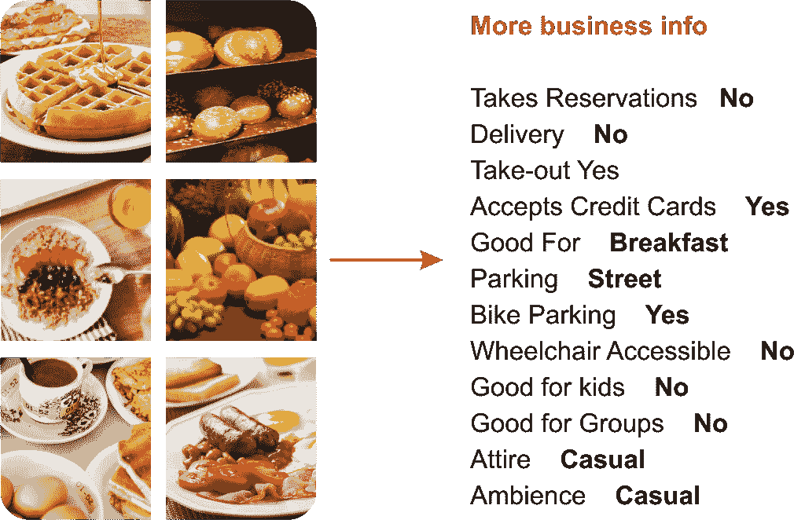

图 6:从 Yelp 数据集中挖掘一些商业见解

例如，数百万独立访问者访问 Yelp，并撰写了超过 1.35 亿条评论。有很多照片和很多上传照片的用户。企业主可以张贴照片并给他们的顾客发信息。通过这种方式，Yelp 通过向当地企业出售广告来赚钱。一个有趣的事实是，这些照片提供了丰富的跨类别的当地商业信息。因此，训练计算机理解这些照片的背景不是一件小事，也不是一件容易的任务(参见*图 6* 以获得洞察力)。

现在，这个项目的想法是一个挑战:我们如何把这些图片变成文字？让我们试一试。更具体地说，给你的照片属于一个企业。现在我们需要建立一个模型，这样它就可以用用户提交的照片的多个标签自动标记餐馆——也就是说，预测业务属性。


# 图像数据集的描述

面对这样的挑战，我们需要一个真实的数据集。不要担心，有几个平台公开提供这样的数据集，或者可以根据一些条款和条件下载。一个这样的平台是 **Kaggle** ，它为数据分析和 ML 从业者提供了一个尝试 ML 挑战并赢得奖品的平台。Yelp 数据集和描述可以在:[https://www . ka ggle . com/c/Yelp-restaurant-photo-classification](https://www.kaggle.com/c/yelp-restaurant-photo-classification)找到。

Yelp 用户在提交评论时会手动选择餐厅的标签。数据集中关联的 Yelp 社区标注了九个不同的标签:

*   `0: good_for_lunch`
*   `1: good_for_dinner`
*   `2: takes_reservations`
*   `3: outdoor_seating`
*   `4: restaurant_is_expensive`
*   `5: has_alcohol`
*   `6: has_table_service`
*   `7: ambience_is_classy`
*   `8: good_for_kids`

所以我们需要尽可能准确地预测这些标签。需要注意的一点是，由于 Yelp 是一个社区驱动的网站，由于多种原因，数据集中有重复的图像。例如，用户可能会不小心将同一张照片多次上传到同一家企业，或者连锁企业可能会将同一张照片上传到不同的分店。数据集中有六个文件，如下所示:

*   `train_photos.tgz`:用作训练集的照片(234545 张)
*   `test_photos.tgz`:作为测试集的照片(500 张)
*   `train_photo_to_biz_ids.csv`:提供照片 ID 到业务 ID 的映射(234，545 行)
*   `test_photo_to_biz_ids.csv`:提供照片 ID 到业务 ID 的映射(500 行)
*   `train.csv`:这是主要的训练数据集，包括业务 id 及其相应的标签(1996 行)
*   `sample_submission.csv`:样本提交—参考您的预测的正确格式，包括`business_id`和相应的预测标签


# 整个项目的工作流程

在这个项目中，我们将看到如何在 Scala 中将图片从`.jpg`格式读入矩阵表示。然后，我们将进一步处理和准备 CNN 提供的图像。在我们对图像应用灰度滤镜之前，我们将看到一些图像操作，例如将所有图像平方并将每个图像调整到相同的尺寸:

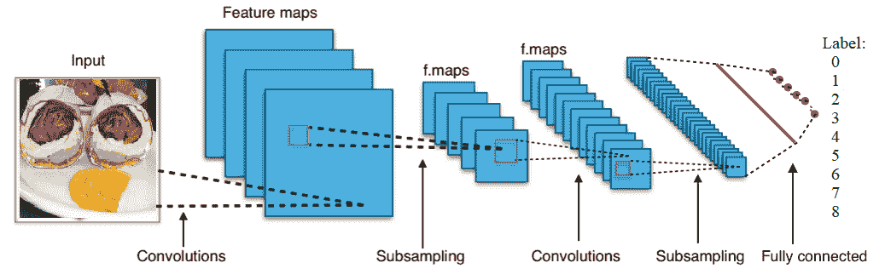

图 7:用于图像分类 CNN 的概念化视图

然后我们用每个班的训练数据训练 9 个 CNN。训练完成后，我们保存训练好的模型、CNN 配置和参数，以便以后可以恢复它们，然后我们应用一个简单的聚合函数来为每个餐馆分配类别，其中每个餐馆都有多个相关联的图像，每个图像都有自己的九个类别的概率向量。然后，我们对测试数据进行评分，最后，使用测试图像对模型进行评估。

现在我们来看看每个 CNN 的结构。每个网络都有两个卷积层、两个子采样层、一个密集层和作为全连接层的输出层。第一层是卷积层，后面是二次采样层，再后面是另一个卷积层，然后是二次采样层，然后是密集层，再后面是输出层。稍后我们将看到每一层的结构。


# 实现用于图像分类的细胞神经网络

包含`main()`方法的 Scala 对象有以下工作流程:

1.  我们从`train.csv`文件中读取所有的商业标签
2.  我们读取并创建一个从图片 ID 到业务 ID 的映射，格式为`imageID` → `busID`
3.  我们从`photoDir`目录中获取一个要加载和处理的图像列表，最后，获取 10，000 个图像的图像 id(随意设置范围)
4.  然后，我们读取图像并将其处理成`photoID` →矢量图
5.  我们将*步骤 3* 和*步骤 4* 的输出链接起来，以对齐业务特征、图像 id 和标签 id，从而为 CNN 提取特征
6.  我们构建了九个 CNN。
7.  我们训练所有的 CNN 并指定模型保存位置
8.  然后我们重复*步骤 2* 到*步骤 6* 从测试集中提取特征
9.  最后，我们评估模型并将预测保存在 CSV 文件中

现在，让我们看看前面的步骤在高级图表中会是什么样子:

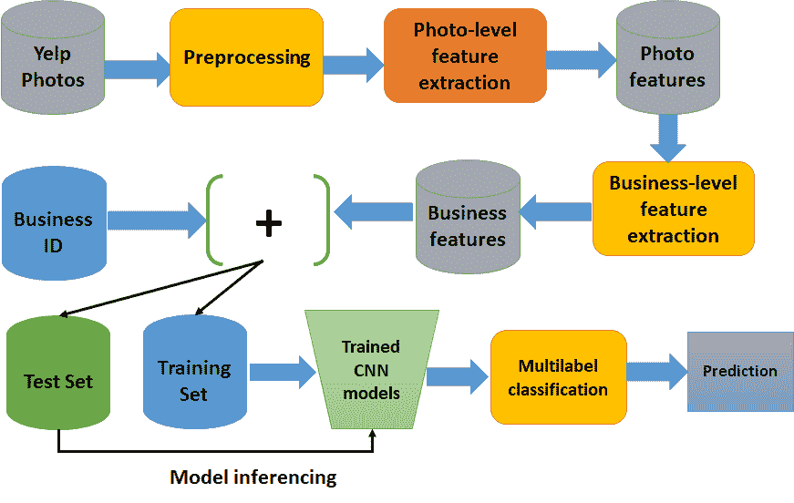

图 8:用于图像分类的 DL4j 图像处理管道

以编程方式，前面的步骤可以表示如下:

```
val labelMap = readBusinessLabels("data/labels/train.csv")
val businessMap = readBusinessToImageLabels("data/labels/train_photo_to_biz_ids.csv")
val imgs = getImageIds("data/images/train/", businessMap, businessMap.map(_._2).toSet.toList).slice(0,100) // 20000 images

println("Image ID retreival done!")
val dataMap = processImages(imgs, resizeImgDim = 128)
println("Image processing done!")
val alignedData = new featureAndDataAligner(dataMap, businessMap, Option(labelMap))()

println("Feature extraction done!")
val cnn0 = trainModelEpochs(alignedData, businessClass = 0, saveNN = "models/model0")
val cnn1 = trainModelEpochs(alignedData, businessClass = 1, saveNN = "models/model1")
val cnn2 = trainModelEpochs(alignedData, businessClass = 2, saveNN = "models/model2")
val cnn3 = trainModelEpochs(alignedData, businessClass = 3, saveNN = "models/model3")
val cnn4 = trainModelEpochs(alignedData, businessClass = 4, saveNN = "models/model4")
val cnn5 = trainModelEpochs(alignedData, businessClass = 5, saveNN = "models/model5")
val cnn6 = trainModelEpochs(alignedData, businessClass = 6, saveNN = "models/model6")
val cnn7 = trainModelEpochs(alignedData, businessClass = 7, saveNN = "models/model7")
val cnn8 = trainModelEpochs(alignedData, businessClass = 8, saveNN = "models/model8")

val businessMapTE = readBusinessToImageLabels("data/labels/test_photo_to_biz.csv")

val imgsTE = getImageIds("data/images/test//", businessMapTE, businessMapTE.map(_._2).toSet.toList)

val dataMapTE = processImages(imgsTE, resizeImgDim = 128) // make them 128*128

val alignedDataTE = new featureAndDataAligner(dataMapTE, businessMapTE, None)()
val Results = SubmitObj(alignedDataTE, "results/ModelsV0/")
val SubmitResults = writeSubmissionFile("kaggleSubmitFile.csv", Results, thresh = 0.9)
```

太多了吗？不要担心，我们现在将详细了解每个步骤。如果你仔细观察前面的步骤，你会看到*步骤 1* 到*步骤 5* 基本上都是图像处理和特征构造。


# 图像处理

当我试图开发这个应用程序时，我发现照片的大小和形状都不一样:有些图像很高，有些很宽，有些在外面，有些在里面，大多数都是食物的图片。然而，有些也是其他随机的事情。另一个重要的方面是，虽然训练图像在纵向/横向和像素数量方面有所不同，但大多数图像大致都是方形的，其中许多图像的大小正好是 500 x 375:

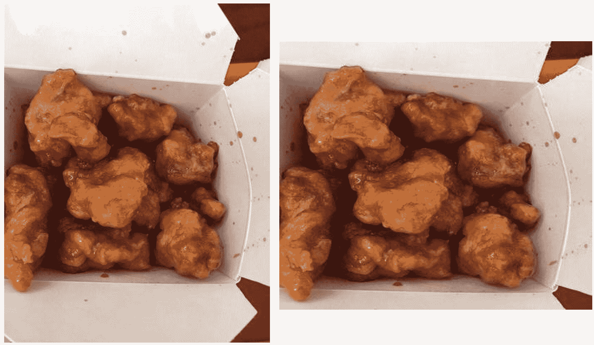

图 9:调整后的图(左边是原来的高图，右边是方形图)

正如我们已经看到的，CNN 不能处理不同大小和形状的图像。有许多鲁棒且有效的图像处理技术来仅提取感兴趣的**区域** ( **ROI** )。但是，老实说，我不是图像处理专家，所以我决定保持这个调整大小的步骤更简单。

CNN 有严重的局限性，因为它不能处理方位和相对空间关系。因此，这些组件对于 CNN 来说并不重要。简而言之，CNN 不太适合具有不同形状和方向的图像。为什么，人们现在在谈论胶囊网络。在[https://arxiv.org/pdf/1710.09829v1.pdf](https://arxiv.org/pdf/1710.09829v1.pdf)和[https://openreview.net/pdf?id=HJWLfGWRb](https://openreview.net/pdf?id=HJWLfGWRb)查看更多原文。

天真地，我把所有的图像都做成方形，但我仍然试图保持质量。在大多数情况下，感兴趣区域位于中心，因此只捕捉每幅图像最中心的正方形并不那么简单。然而，我们还需要将每张图像转换成灰度图像。让我们把不规则形状的图像做成正方形。看看下图，左边是原图，右边是方形图(见*图 9)* 。

现在我们已经生成了一个正方形，我们是如何实现的呢？嗯，我首先检查了高度和宽度是否相同，如果是这样，就不会调整大小。在另外两个例子中，我裁剪了中心区域。下面的方法实现了这个技巧(但是可以随意执行`SquaringImage.scala`脚本来查看输出):

```
def makeSquare(img: java.awt.image.BufferedImage): java.awt.image.BufferedImage = {
 val w = img.getWidth
 val h = img.getHeight
 val dim = List(w, h).min
    img match {
 case x 
 if w == h => img // do nothing and returns the original one
 case x 
 if w > h => Scalr.crop(img, (w - h) / 2, 0, dim, dim)
 case x 
 if w < h => Scalr.crop(img, 0, (h - w) / 2, dim, dim)
        }
    }
```

干得好！既然我们所有的训练图像都是正方形的，下一个导入预处理任务就是调整它们的大小。我决定让所有的图像大小为 128 x 128。让我们看看调整大小后前一个(原始)是什么样子:

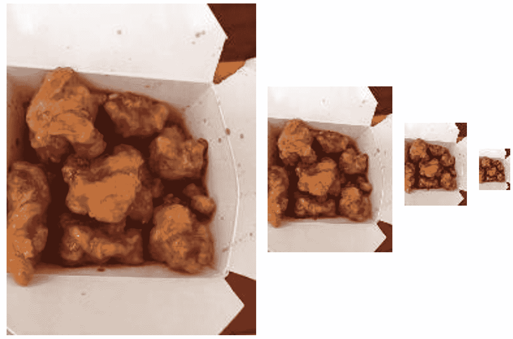

图 10:调整图像大小(分别为 256 x 256、128 x 128、64 x 64 和 32 x 32)

下面的方法成功了(但是可以随意执行`ImageResize.scala`脚本来观看演示):

```
def resizeImg(img: java.awt.image.BufferedImage, width: Int, height: Int) = {
    Scalr.resize(img, Scalr.Method.BALANCED, width, height) 
}
```

顺便说一下，对于图像大小调整和平方，我使用了一些内置的包来读取图像，使用了一些第三方的包来处理:

```
import org.imgscalr._
import java.io.File
import javax.imageio.ImageIO
```

要使用前面的包，请在一个 Maven 友好的`pom.xml`文件中添加以下依赖项:

```
<dependency>
    <groupId>org.imgscalr</groupId>
    <artifactId>imgscalr-lib</artifactId>
    <version>4.2</version>
</dependency>
<dependency>
    <groupId>org.datavec</groupId>
    <artifactId>datavec-data-image</artifactId>
    <version>0.9.1</version>
</dependency>
<dependency>
    <groupId>com.sksamuel.scrimage</groupId>
    <artifactId>scrimage-core_2.10</artifactId>
    <version>2.1.0</version>
</dependency>
```

虽然基于 DL4j 的 CNN 可以处理彩色图像，但最好用灰度图像来简化计算。虽然彩色图像更令人兴奋和有效，但这样我们可以使整体表现更简单，空间更有效。

让我们举一个上一步的例子。我们将每幅图像的大小调整为 256 x 256 像素的图像，由 16，384 个特征表示，而不是 16，384 x 3 的具有三个 RGB 通道的彩色图像(执行`GrayscaleConverter.scala`查看演示)。让我们看看转换后的图像会是什么样子:

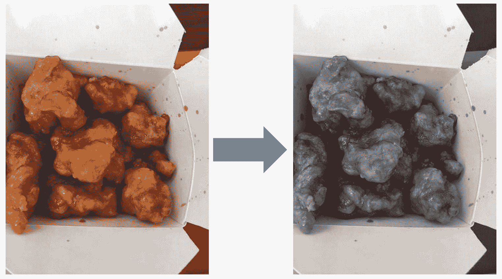

图 11:左为原始图像，右为灰度 RGB 平均值

前面的转换使用两种方法完成，称为`pixels2Gray()`和`makeGray()`:

```
def pixels2Gray(R: Int, G: Int, B: Int): Int = (R + G + B) / 3
def makeGray(testImage: java.awt.image.BufferedImage): java.awt.image.BufferedImage = {
 val w = testImage.getWidth
 val h = testImage.getHeight
 for { 
        w1 <- (0 until w).toVector
        h1 <- (0 until h).toVector
        } 
 yield 
    {
 val col = testImage.getRGB(w1, h1)
 val R = (col & 0xff0000) / 65536
 val G = (col & 0xff00) / 256
 val B = (col & 0xff)
 val graycol = pixels2Gray(R, G, B)
testImage.setRGB(w1, h1, new Color(graycol, graycol, graycol).getRGB)
    }
testImage
}
```

引擎盖下发生了什么？我们将前面的三个步骤串联起来:将所有的图像变成正方形，然后将它们全部转换为 25 x 256，最后将调整大小后的图像转换为灰度图像:

```
val demoImage = ImageIO.read(new File(x))
    .makeSquare
    .resizeImg(resizeImgDim, resizeImgDim) // (128, 128)
    .image2gray
```

因此，总的来说，我们现在有所有的图像在平方和调整大小后都是灰色的。下图给出了转换步骤的一些概念:

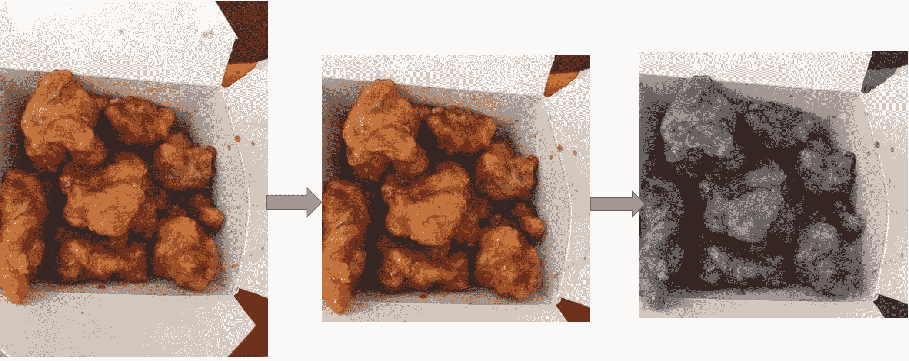

图 12:调整后的图形(左边是原来的高的，右边是方形的)

下面的链接也需要一些额外的努力。现在，我们将这三个步骤放在代码中，最终可以准备好所有的图像:

```
import scala.Vector
import org.imgscalr._

object imageUtils {
 implicitclass imageProcessingPipeline(img: java.awt.image.BufferedImage) {
    // image 2 vector processing
 def pixels2gray(R: Int, G:Int, B: Int): Int = (R + G + B) / 3
 def pixels2color(R: Int, G:Int, B: Int): Vector[Int] = Vector(R, G, B)
 private def image2vec[A](f: (Int, Int, Int) => A ): Vector[A] = {
 val w = img.getWidth
 val h = img.getHeight
 for {
            w1 <- (0 until w).toVector
            h1 <- (0 until h).toVector
            } 
 yield {
 val col = img.getRGB(w1, h1)
 val R = (col & 0xff0000) / 65536
 val G = (col & 0xff00) / 256
 val B = (col & 0xff)
        f(R, G, B)
                }
            }

 def image2gray: Vector[Int] = image2vec(pixels2gray)
 def image2color: Vector[Int] = image2vec(pixels2color).flatten

    // make image square
 def makeSquare = {
 val w = img.getWidth
 val h = img.getHeight
 val dim = List(w, h).min
        img match {
 case x     
 if w == h => img
 case x 
 if w > h => Scalr.crop(img, (w-h)/2, 0, dim, dim)
 case x 
 if w < h => Scalr.crop(img, 0, (h-w)/2, dim, dim)
              }
            }

    // resize pixels
 def resizeImg(width: Int, height: Int) = {
        Scalr.resize(img, Scalr.Method.BALANCED, width, height)
            }
        }
    }
```


# 提取图像元数据

到目前为止，我们已经加载并预处理了原始图像，但我们不知道需要让 CNN 学习的图像元数据。因此，是时候加载包含每个图像元数据的 CSV 文件了。

我编写了一个方法来读取 CSV 格式的元数据，这个方法叫做`readMetadata()`，稍后会被另外两个叫做`readBusinessLabels`和`readBusinessToImageLabels`的方法使用。这三种方法在`CSVImageMetadataReader.scala`脚本中定义。下面是`readMetadata()`方法的签名:

```
def readMetadata(csv: String, rows: List[Int]=List(-1)): List[List[String]] = {
 val src = Source.fromFile(csv)

 def reading(csv: String): List[List[String]]= {
        src.getLines.map(x => x.split(",").toList)
            .toList
            }
 try {
 if(rows==List(-1)) reading(csv)
 else rows.map(reading(csv))
            } 
 finally {
            src.close
            }
        }
```

`readBusinessLabels()`方法从业务 ID 映射到形式为`businessID` → Set (labels)的标签:

```
def readBusinessLabels(csv: String, rows: List[Int]=List(-1)): Map[String, Set[Int]] = {
 val reader = readMetadata(csv)
    reader.drop(1)
        .map(x => x match {
 case x :: Nil => (x(0).toString, Set[Int]())
 case _ => (x(0).toString, x(1).split(" ").map(y => y.toInt).toSet)
        }).toMap
}
```

`readBusinessToImageLabels ()`方法以`imageID` → `businessID`的形式从图像 ID 映射到业务 ID:

```
def readBusinessToImageLabels(csv: String, rows: List[Int] = List(-1)): Map[Int, String] = {
 val reader = readMetadata(csv)
    reader.drop(1)
        .map(x => x match {
 case x :: Nil => (x(0).toInt, "-1")
 case _ => (x(0).toInt, x(1).split(" ").head)
        }).toMap
}
```


# 图像特征提取

到目前为止，我们已经看到了如何预处理图像，以便从这些图像中提取特征并输入到 CNN 中。此外，我们还看到了如何提取和映射元数据，并将其与原始图像链接起来。现在是时候从那些预处理过的图像中提取特征了。

我们还需要记住每张图片的元数据的出处。正如您所猜测的，我们需要三个地图操作来提取特征。基本上，我们有三张地图。详情参见`imageFeatureExtractor.scala`脚本:

1.  格式为`imageID` → `businessID`的业务映射
2.  表格数据图`imageID` →图像数据
3.  表单的标签图`businessID` →标签

我们首先定义一个正则表达式模式，从 CSV `ImageMetadataReader`类中提取`.jpg`名称，用于匹配训练标签:

```
val patt_get_jpg_name = new Regex("[0-9]")
```

然后，我们提取与其各自的业务 ID 相关联的所有图像 ID:

```
def getImgIdsFromBusinessId(bizMap: Map[Int, String], businessIds: List[String]): List[Int] = {
    bizMap.filter(x => businessIds.exists(y => y == x._2)).map(_._1).toList 
    }
```

现在，我们需要加载和处理所有已经预处理的图像，通过映射从业务 id 中提取的 id 来提取图像 id，如前面所示:

```
def getImageIds(photoDir: String, businessMap: Map[Int, String] = Map(-1 -> "-1"), businessIds:         
    List[String] = List("-1")): List[String] = {
 val d = new File(photoDir)
 val imgsPath = d.listFiles().map(x => x.toString).toList
 if (businessMap == Map(-1 -> "-1") || businessIds == List(-1)) {
        imgsPath
    } 
 else {
 val imgsMap = imgsPath.map(x => patt_get_jpg_name.findAllIn(x).mkString.toInt -> x).toMap
 val imgsPathSub = getImgIdsFromBusinessId(businessMap, businessIds)
        imgsPathSub.filter(x => imgsMap.contains(x)).map(x => imgsMap(x))
        } 
    }
```

到目前为止，我们已经能够提取与至少一个企业有某种关联的所有图像 id。下一步是读取这些图像并将其处理成`imageID` →矢量图:

```
def processImages(imgs: List[String], resizeImgDim: Int = 128, nPixels: Int = -1): Map[Int,Vector[Int]]= {
    imgs.map(x => patt_get_jpg_name.findAllIn(x).mkString.toInt -> {
 val img0 = ImageIO.read(new File(x))
        .makeSquare
        .resizeImg(resizeImgDim, resizeImgDim) // (128, 128)
        .image2gray
 if(nPixels != -1) img0.slice(0, nPixels)
 else img0
        }
    ).filter( x => x._2 != ())
    .toMap
    }
```

干得好！我们只差一步就能提取出训练我们 CNN 所需的信息。特征提取的最后一步是提取像素数据:

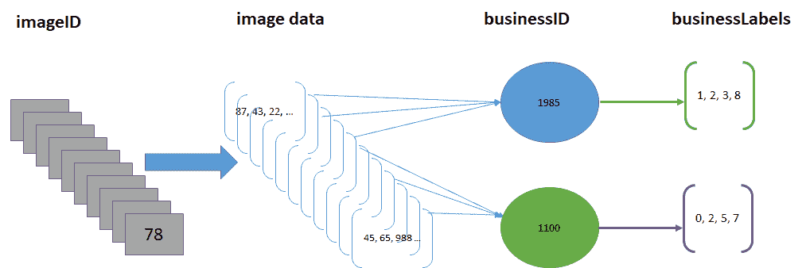

图 13:图像数据表示

总之，我们需要跟踪每幅图像的四个对象部分，即`imageID`、`businessID`、标签和像素数据。因此，如上图所示，主数据结构由四种数据类型(四元组)构成— `imgID`、`businessID`、像素数据向量和标签:

```
List[(Int, String, Vector[Int], Set[Int])]
```

因此，我们应该有一个包含所有这些对象的类。别担心，我们需要的一切都在`featureAndDataAligner.scala`脚本中定义了。一旦我们使用`Main.scala`脚本中的以下代码行实例化了`featureAndDataAligner`的实例(在`main`方法下)，就会提供`businessMap`、`dataMap`和`labMap`:

```
val alignedData = new featureAndDataAligner(dataMap, businessMap, Option(labelMap))()
```

这里使用了`labMap`的选项类型，因为我们在对测试数据评分时没有这个信息——也就是说，`None`用于那个调用:

```
class featureAndDataAligner(dataMap: Map[Int, Vector[Int]], bizMap: Map[Int, String], labMap: Option[Map[String, Set[Int]]])(rowindices: List[Int] = dataMap.keySet.toList) {
 def this(dataMap: Map[Int, Vector[Int]], bizMap: Map[Int, String])(rowindices: List[Int]) =         this(dataMap, bizMap, None)(rowindices)

 def alignBusinessImgageIds(dataMap: Map[Int, Vector[Int]], bizMap: Map[Int, String])
        (rowindices: List[Int] = dataMap.keySet.toList): List[(Int, String, Vector[Int])] = {
 for { 
            pid <- rowindices
 val imgHasBiz = bizMap.get(pid) 
            // returns None if img doe not have a bizID
 val bid = if(imgHasBiz != None) imgHasBiz.get 
 else "-1"
 if (dataMap.keys.toSet.contains(pid) && imgHasBiz != None)
            } 
 yield {
        (pid, bid, dataMap(pid))
           }
        }
def alignLabels(dataMap: Map[Int, Vector[Int]], bizMap: Map[Int, String], labMap: Option[Map[String,     Set[Int]]])(rowindices: List[Int] = dataMap.keySet.toList): List[(Int, String, Vector[Int], Set[Int])] = {
 def flatten1[A, B, C, D](t: ((A, B, C), D)): (A, B, C, D) = (t._1._1, t._1._2, t._1._3, t._2)
 val al = alignBusinessImgageIds(dataMap, bizMap)(rowindices)
 for { p <- al
        } 
 yield {
 val bid = p._2
 val labs = labMap match {
 case None => Set[Int]()
 case x => (if(x.get.keySet.contains(bid)) x.get(bid) 
        else Set[Int]())
            }
            flatten1(p, labs)
        }
    }
 lazy val data = alignLabels(dataMap, bizMap, labMap)(rowindices)
   // getter functions
 def getImgIds = data.map(_._1)
 def getBusinessIds = data.map(_._2)
 def getImgVectors = data.map(_._3)
 def getBusinessLabels = data.map(_._4)
 def getImgCntsPerBusiness = getBusinessIds.groupBy(identity).mapValues(x => x.size) 
}
```

太棒了。到目前为止，我们已经成功地提取了特征来训练我们的 CNN。然而，当前形式的特征仍然不适合馈入 CNN，因为我们只有没有标签的特征向量。因此，我们需要一个中间转换。


# 准备 ND4j 数据集

正如我所说的，我们需要一个中间转换和预处理来使训练集包含特征向量和标签。转换非常简单:我们需要特征向量和业务标签。

为此，我们有了`makeND4jDataSets`类(详见`makeND4jDataSets.scala`)。该类从来自`alignLables`函数的数据结构中以`List[(imgID, bizID, labels, pixelVector)]`的形式创建一个 ND4j 数据集对象。首先，我们使用`makeDataSet()`方法准备数据集:

```
def makeDataSet(alignedData: featureAndDataAligner, bizClass: Int): DataSet = {
 val alignedXData = alignedData.getImgVectors.toNDArray
 val alignedLabs = alignedData.getBusinessLabels.map(x => 
 if (x.contains(bizClass)) Vector(1, 0) 
    else Vector(0, 1)).toNDArray
 new DataSet(alignedXData, alignedLabs)
    }
```

然后我们需要将前面的数据结构进一步转换成`INDArray`，然后 CNN 可以使用它:

```
def makeDataSetTE(alignedData: featureAndDataAligner): INDArray = {
    alignedData.getImgVectors.toNDArray
    }
```


# 训练 CNN 并保存训练好的模型

到目前为止，我们已经看到了如何准备训练集；现在我们面临着一个挑战。我们要训练 234545 张图片。虽然测试阶段只有 500 张图像，但最好使用 DL4j 的`MultipleEpochsIterator`以批处理模式训练每个 CNN。以下是重要超参数及其详细信息的列表:

*   **层**:正如我们已经观察到的简单的 5 层 MNIST，我们获得了出色的分类精度，这是非常有希望的。在这里，我将尝试构建一个类似的网络。
*   **样本数量**:如果你在训练所有的图像，这将花费很长时间。如果你使用 CPU 而不是 GPU 进行训练，将需要几天时间。当我尝试处理 50，000 张图像时，一台配备 i7 处理器和 32 GB 内存的机器需要一整天的时间。现在，您可以想象整个数据集需要多长时间。此外，即使您在批处理模式下进行培训，也需要至少 256 GB 的 RAM。
*   **历元数**:这是所有训练记录的迭代次数。
*   **输出特征地图的数量(即 nOut)** :这是特征地图的数量。仔细看看 DL4j GitHub 库中的其他例子。
*   **学习率**:从类似 TensorFlow 的框架中，我得到了一些感悟。在我看来，把学习率定在 0.01，0.001 就太好了。
*   **批次号**:每批记录的数量——32、64、128 等。我用了 128。

现在，有了前面的超参数，我们可以开始训练我们的 CNN。下面的代码完成了这个任务。首先，我们准备训练集，然后我们定义所需的超参数，然后我们归一化数据集，以便对 ND4j 数据帧进行编码，任何被认为是真的标签都是 1，其余的是 0。然后，我们洗牌的行和编码数据集的标签。

现在我们需要分别使用`ListDataSetIterator`和`MultipleEpochsIterator`为数据集迭代器创建历元。一旦数据集被转换成批量模型，我们就准备好训练构建的 CNN:

```
def trainModelEpochs(alignedData: featureAndDataAligner, businessClass: Int = 1, saveNN: String = "") = {
 val ds = makeDataSet(alignedData, businessClass)
 val nfeatures = ds.getFeatures.getRow(0).length // Hyperparameter
 val numRows = Math.sqrt(nfeatures).toInt //numRows*numColumns == data*channels
 val numColumns = Math.sqrt(nfeatures).toInt //numRows*numColumns == data*channels
 val nChannels = 1 // would be 3 if color image w R,G,B
 val outputNum = 9 // # of classes (# of columns in output)
 val iterations = 1
 val splitTrainNum = math.ceil(ds.numExamples * 0.8).toInt // 80/20 training/test split
 val seed = 12345
 val listenerFreq = 1
 val nepochs = 20
 val nbatch = 128 // recommended between 16 and 128

    ds.normalizeZeroMeanZeroUnitVariance()
    Nd4j.shuffle(ds.getFeatureMatrix, new Random(seed), 1) // shuffles rows in the ds.
    Nd4j.shuffle(ds.getLabels, new Random(seed), 1) // shuffles labels accordingly

 val trainTest: SplitTestAndTrain = ds.splitTestAndTrain(splitTrainNum, new Random(seed))

    // creating epoch dataset iterator
 val dsiterTr = new ListDataSetIterator(trainTest.getTrain.asList(), nbatch)
 val dsiterTe = new ListDataSetIterator(trainTest.getTest.asList(), nbatch)
 val epochitTr: MultipleEpochsIterator = new MultipleEpochsIterator(nepochs, dsiterTr)

 val epochitTe: MultipleEpochsIterator = new MultipleEpochsIterator(nepochs, dsiterTe)
    //First convolution layer with ReLU as activation function
 val layer_0 = new ConvolutionLayer.Builder(6, 6)
        .nIn(nChannels)
        .stride(2, 2) // default stride(2,2)
        .nOut(20) // # of feature maps
        .dropOut(0.5)
        .activation("relu") // rectified linear units
        .weightInit(WeightInit.RELU)
        .build()

    //First subsampling layer
 val layer_1 = new SubsamplingLayer.Builder(SubsamplingLayer.PoolingType.MAX)
        .kernelSize(2, 2)
        .stride(2, 2)
        .build()

    //Second convolution layer with ReLU as activation function
 val layer_2 = new ConvolutionLayer.Builder(6, 6)
        .nIn(nChannels)
        .stride(2, 2)
        .nOut(50)
        .activation("relu")
        .build()

    //Second subsampling layer
 val layer_3 = new SubsamplingLayer.Builder(SubsamplingLayer.PoolingType.MAX)
        .kernelSize(2, 2)
        .stride(2, 2)
        .build()

    //Dense layer
 val layer_4 = new DenseLayer.Builder()
        .activation("relu")
        .nOut(500)
        .build()

    // Final and fully connected layer with Softmax as activation function
 val layer_5 = new OutputLayer.Builder(LossFunctions.LossFunction.MCXENT)
        .nOut(outputNum)
        .weightInit(WeightInit.XAVIER)
        .activation("softmax")
        .build()
 val builder: MultiLayerConfiguration.Builder = new NeuralNetConfiguration.Builder()
        .seed(seed)
        .iterations(iterations)
        .miniBatch(true)
        .optimizationAlgo(OptimizationAlgorithm.STOCHASTIC_GRADIENT_DESCENT)
        .regularization(true).l2(0.0005)
        .learningRate(0.01)
        .list(6)
            .layer(0, layer_0)
            .layer(1, layer_1)
            .layer(2, layer_2)
            .layer(3, layer_3)
            .layer(4, layer_4)
            .layer(5, layer_5)
    .backprop(true).pretrain(false)

 new ConvolutionLayerSetup(builder, numRows, numColumns, nChannels)
 val conf: MultiLayerConfiguration = builder.build()
 val model: MultiLayerNetwork = new MultiLayerNetwork(conf)

    model.init()
    model.setListeners(Seq[IterationListener](new ScoreIterationListener(listenerFreq)).asJava)
    model.fit(epochitTr)

 val eval = new Evaluation(outputNum)
 while (epochitTe.hasNext) {
 val testDS = epochitTe.next(nbatch)
 val output: INDArray = model.output(testDS.getFeatureMatrix)
        eval.eval(testDS.getLabels(), output)
        }
 if (!saveNN.isEmpty) {
        // model config
        FileUtils.write(new File(saveNN + ".json"), model.getLayerWiseConfigurations().toJson())
        // model parameters
 val dos: DataOutputStream = new DataOutputStream(Files.newOutputStream(Paths.get(saveNN + ".bin")))
        Nd4j.write(model.params(), dos)
        }
    }
```

在前面的代码中，我们还保存了一个包含所有网络配置的`.json`文件和一个保存所有 CNN 的所有权重和参数的`.bin`文件。这是通过两种方法完成的；即`NeuralNetwok.scala`脚本中定义的`saveNN()`和`loadNN()`。首先，让我们看看`saveNN()`方法的签名，如下所示:

```
def saveNN(model: MultiLayerNetwork, NNconfig: String, NNparams: String) = {
    // save neural network config
    FileUtils.write(new File(NNconfig), model.getLayerWiseConfigurations().toJson())
    // save neural network parms
 val dos: DataOutputStream = new DataOutputStream(Files.newOutputStream(Paths.get(NNparams)))
    Nd4j.write(model.params(), dos)
}
```

这个想法既有远见又很重要，因为正如我所说，你不会第二次训练你的整个网络来评估一个新的测试集——也就是说，假设你只想测试一个图像。我们还有另一个名为`loadNN()`的方法，它将我们之前创建的`.json`和`.bin`文件读回到一个`MultiLayerNetwork`中，并用于对新的测试数据进行评分。该方法如下进行:

```
def loadNN(NNconfig: String, NNparams: String) = {
    // get neural network config
 val confFromJson: MultiLayerConfiguration =                     
    MultiLayerConfiguration.fromJson(FileUtils.readFileToString(new File(NNconfig)))

    // get neural network parameters
 val dis: DataInputStream = new DataInputStream(new FileInputStream(NNparams))
 val newParams = Nd4j.read(dis)

    // creating network object
 val savedNetwork: MultiLayerNetwork = new MultiLayerNetwork(confFromJson)
    savedNetwork.init()
    savedNetwork.setParameters(newParams)
    savedNetwork 
    }
```


# 评估模型

我们将要使用的评分方法非常简单。它通过平均图像级预测来分配业务级标签。我知道我做得很幼稚，但你可以尝试更好的方法。我所做的是，如果一个企业的所有图像中属于类别`0`的概率平均值大于 0.5，则为该企业分配标签`0`:

```
def scoreModel(model: MultiLayerNetwork, ds: INDArray) = {
    model.output(ds)
}
```

然后我们收集来自`scoreModel()`方法的模型预测，并与`alignedData`合并:

```

def aggImgScores2Business(scores: INDArray, alignedData: featureAndDataAligner ) = {
    assert(scores.size(0) == alignedData.data.length, "alignedData and scores length are different. They     must be equal")

def getRowIndices4Business(mylist: List[String], mybiz: String): List[Int] = mylist.zipWithIndex.filter(x     => x._1 == mybiz).map(_._2)

def mean(xs: List[Double]) = xs.sum / xs.size
    alignedData.getBusinessIds.distinct.map(x => (x, {
 val irows = getRowIndices4Business(alignedData.getBusinessIds, x)
 val ret = 
 for(row <- irows) 
 yield scores.getRow(row).getColumn(1).toString.toDouble
        mean(ret)
        }))
    }
```

最后，我们可以恢复训练好的和保存好的模型，恢复回来，为 Kaggle 生成提交文件。问题是，我们需要将每个模型的形象预测汇总到业务得分中。


# 通过执行 main()方法结束

让我们通过观看模型的性能来总结整个讨论。下面的代码是一个大概:

```
package Yelp.Classifier
import Yelp.Preprocessor.CSVImageMetadataReader._
import Yelp.Preprocessor.featureAndDataAligner
import Yelp.Preprocessor.imageFeatureExtractor._
import Yelp.Evaluator.ResultFileGenerator._
import Yelp.Preprocessor.makeND4jDataSets._
import Yelp.Evaluator.ModelEvaluation._
import Yelp.Trainer.CNNEpochs._
import Yelp.Trainer.NeuralNetwork._

object YelpImageClassifier {
 def main(args: Array[String]): Unit = {
        // image processing on training data
 val labelMap = readBusinessLabels("data/labels/train.csv")
 val businessMap = readBusinessToImageLabels("data/labels/train_photo_to_biz_ids.csv")
 val imgs = getImageIds("data/images/train/", businessMap, 
        businessMap.map(_._2).toSet.toList).slice(0,20000) // 20000 images

        println("Image ID retreival done!")
 val dataMap = processImages(imgs, resizeImgDim = 256)
        println("Image processing done!")

 val alignedData = 
 new featureAndDataAligner(dataMap, businessMap, Option(labelMap))()
        println("Feature extraction done!")

        // training one model for one class at a time. Many hyperparamters hardcoded within
 val cnn0 = trainModelEpochs(alignedData, businessClass = 0, saveNN = "models/model0")
 val cnn1 = trainModelEpochs(alignedData, businessClass = 1, saveNN = "models/model1")
 val cnn2 = trainModelEpochs(alignedData, businessClass = 2, saveNN = "models/model2")
 val cnn3 = trainModelEpochs(alignedData, businessClass = 3, saveNN = "models/model3")
 val cnn4 = trainModelEpochs(alignedData, businessClass = 4, saveNN = "models/model4")
 val cnn5 = trainModelEpochs(alignedData, businessClass = 5, saveNN = "models/model5")
 val cnn6 = trainModelEpochs(alignedData, businessClass = 6, saveNN = "models/model6")
 val cnn7 = trainModelEpochs(alignedData, businessClass = 7, saveNN = "models/model7")
 val cnn8 = trainModelEpochs(alignedData, businessClass = 8, saveNN = "models/model8")

    // processing test data for scoring
 val businessMapTE = readBusinessToImageLabels("data/labels/test_photo_to_biz.csv")
 val imgsTE = getImageIds("data/images/test//", businessMapTE,     
        businessMapTE.map(_._2).toSet.toList)

 val dataMapTE = processImages(imgsTE, resizeImgDim = 128) // make them 256x256
 val alignedDataTE = new featureAndDataAligner(dataMapTE, businessMapTE, None)()

        // creating csv file to submit to kaggle (scores all models)
 val Results = SubmitObj(alignedDataTE, "results/ModelsV0/")
 val SubmitResults = writeSubmissionFile("kaggleSubmitFile.csv", Results, thresh = 0.9)
        }
    }
>>>
==========================Scores======================================
 Accuracy: 0.6833
 Precision: 0.53
 Recall: 0.5222
 F1 Score: 0.5261
======================================================================
```

那么，你的印象是什么？的确，我们还没有获得突出的分类准确性。但是我们仍然可以用调整过的超参数来尝试。下一节提供了一些见解。


# 调整和优化 CNN 超参数

以下超参数非常重要，必须进行调整才能获得最佳结果。

*   **遗漏**:用于随机遗漏特征检测器，防止过拟合
*   **稀疏度**:用于强制激活稀疏/稀有输入
*   **阿达格勒**:用于特定特征学习率优化
*   **正规化** : L1 和 L2 正规化
*   **权重变换**:适用于深度自编码器
*   **概率分布操作**:用于初始权重生成
*   渐变标准化和裁剪

另一个重要的问题是:什么时候要添加一个 max pooling 层而不是一个相同步幅的卷积层？最大池层没有任何参数，而卷积层有很多参数。有时，添加一个局部响应标准化层，使激活最强烈的神经元抑制同一位置但在相邻特征图中的神经元，鼓励不同的特征图进行专业化，并将它们推开，迫使它们探索更大范围的特征。它通常用于较低的层，以获得较大的底层功能池，较高的层可以在此基础上进行构建。

在大型神经网络的训练过程中观察到的主要优点之一是过拟合，也就是说，对训练数据产生非常好的近似，但是对单点之间的区域发出噪声。在过度拟合的情况下，模型会专门针对训练数据集进行调整，因此不会用于泛化。因此，尽管它在训练集上表现良好，但在测试数据集和后续测试上的性能很差，因为它缺乏泛化属性:

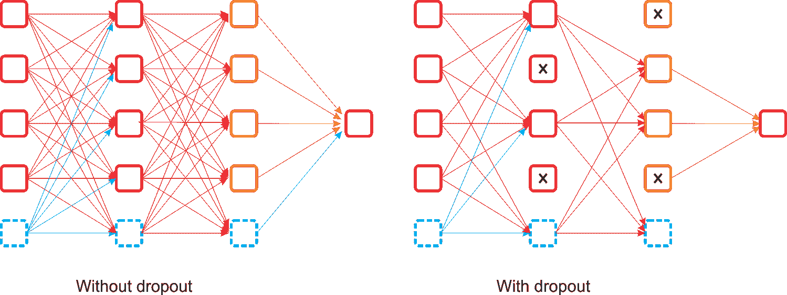

图 14:辍学与未辍学的对比

这种方法的主要优点是避免了一层中的所有神经元同步优化它们的权重。在随机组中进行的这种自适应避免了所有的神经元都集中在相同的目标上，从而使自适应的权重去相关。在 dropout 应用中发现的第二个特性是隐藏单元的激活变得稀疏，这也是一个期望的特性。

因为在 CNN 中，目标函数之一是最小化评估成本，所以我们必须定义一个优化器。DL4j 支持以下优化器:

*   新币(仅学习率)
*   内斯特洛夫动量
*   阿达格拉德
*   RMSProp
*   圣经》和《古兰经》传统中）亚当（人类第一人的名字
*   阿达德尔塔

在大多数情况下，如果性能不令人满意，我们可以采用实现的 RMSProp，这是梯度下降的一种高级形式。RMSProp 的性能更好，因为它将学习率除以梯度平方的指数衰减平均值。衰减参数的建议设置值为 0.9，而学习率的较好默认值为 0.001。

从技术上来说，通过使用最常见的优化器，如**随机梯度下降** ( **SGD** )，学习率必须与 1/T 成比例才能收敛，其中 T 是迭代次数。RMSProp 试图通过调整步长来自动克服这一限制，使步长与梯度的比例相同。因此，如果你正在训练一个神经网络，但计算梯度是强制性的，使用 RMSProp 将是在小批量设置中更快的学习方法。研究人员还建议在训练深度 CNN 或 DNN 时使用动量优化器。

从分层架构的角度来看，CNN 不同于 CNN 它有不同的要求和调整标准。CNN 的另一个问题是卷积层需要大量的 RAM，尤其是在训练期间，因为反向传播的反向传递需要在正向传递期间计算的所有中间值。在推断过程中(也就是对新实例进行预测时)，一个层占用的 RAM 可以在下一层计算完成后立即释放，因此您只需要两个连续层所需的 RAM。

然而，在训练期间，在正向传递期间计算的所有内容都需要为反向传递保留，因此所需的 RAM 量(至少)是所有层所需的 RAM 总量。如果你的 GPU 在训练 CNN 时耗尽了内存，你可以尝试以下五种方法来解决这个问题(除了购买一个内存更大的 GPU):

*   减少小批量
*   在一层或多层中使用更大的步幅来减少维度
*   移除一个或多个层
*   使用 16 位浮点而不是 32 位浮点
*   在多个设备上分发 CNN


# 摘要

在本章中，我们已经看到了如何使用 CNN 来使用和构建现实生活中的应用程序，CNN 是一种前馈人工神经网络，其中神经元之间的连接模式受到动物视觉皮层组织的启发。我们使用 CNN 的图像分类器应用程序可以以可接受的准确度对现实生活中的图像进行分类，尽管我们没有达到更高的准确度。但是，我们鼓励读者调整代码中的超参数，并对另一个数据集尝试相同的方法。

然而，重要的是，由于卷积神经网络的内部数据表示没有考虑简单和复杂对象之间的重要空间层次，CNN 对于某些情况有一些严重的缺点和限制。因此，我建议你在[https://github.com/topics/capsule-network](https://github.com/topics/capsule-network)看看 GitHub 上最近围绕胶囊网络的活动。希望你能从那里得到一些有用的东西

这或多或少是我们使用 Scala 和不同开源框架开发 ML 项目的小小旅程的结束。在整个章节中，我试图为您提供几个例子来说明如何有效地使用这些美妙的技术来开发 ML 项目。在写这本书的过程中，我不得不在脑海中保留许多约束，例如，页数、API 可用性和我的专业知识。但我试图让这本书或多或少简单一些，我也试图避免理论上的细节，因为你可以在 Apache Spark、DL4j 和 H2O 本身的许多书籍、博客和网站上读到这一点。

我也会在我的 GitHub repo 上保持这本书的代码更新:[https://GitHub . com/packt publishing/Scala-Machine-Learning-Projects](https://github.com/PacktPublishing/Scala-Machine-Learning-Projects)。随时打开一个新的问题或任何拉要求改善这本书，并保持关注。

最后，我写这本书不是为了赚钱，而是版税的主要部分将用于我家乡孟加拉国农村地区的儿童教育。我想说谢谢，并对购买和欣赏这本书表示诚挚的感谢！