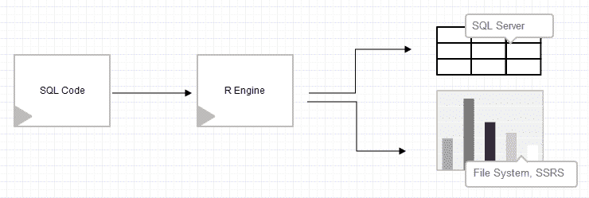

# 一、R 和 SQL Server 简介

SQL Server 2016 提供了出色的新功能，其中包括与 SQL Server 的集成，部分是高级分析，部分是新的可编程能力。Microsoft R Services for SQL Server 是高度可扩展和并行高级分析新扩展系列的一部分。R Services 允许您对数据库中存储的大量数据执行高级分析(统计、多元统计、预测分析、机器学习和深度学习)。微软将 R 服务作为**微软 R 服务器** ( **MRS** )的一部分发布，这是专门为在相同的 SQL Server 计算上下文中直接从 SQL Server 数据库读取数据而设计的。

我们将在本章中讨论以下几个方面:

*   使用 SQL Server 2016 之前的 R
*   微软对开源 R 语言的承诺
*   通过 SQL Server R 集成提升分析能力
*   这本书的大纲


# 使用 SQL Server 2016 之前的 R

自 90 年代以来，R 语言就出现在社区中(尽管它是在十年前开发的)。凭借其开源 GNU 许可证，R 因其简单的安装和调用任何可用的包来实现额外的统计学习功能的能力而广受欢迎。这对于 R 来说是一个明显的优势，因为在 80 年代和 90 年代市场上没有那么多的统计程序；此外，他们中的大多数人并不自由。除了强大的统计分析和预测建模能力之外，核心 R 引擎的新包的可扩展性为更广泛的社区和用户提供了越来越多的将 R 语言用于多种目的的能力。

SQL Server 2005 引入了**SQL Server Analysis Services**(**SSAS**)数据挖掘功能，这些功能将应用于存储在 SQL Server 和 SSAS OLAP 多维数据集中的客户现有丰富数据。该特性允许用户使用**数据挖掘表达式** ( **DMX** )来创建预测查询。在接下来的几年里，SQL 论坛、博客和社区网站上出现了一些关于其他统计和预测方法和途径的问题、请求和想法。

早在 2011 年，我就开始致力于借助开源的 R 语言来扩展 SQL Server 2008 R2 中的统计分析功能。做出这一决定的一个原因是为了能够灵活地运行统计分析(从数据供应到多元分析),而无需先将数据输入 OLAP 立方体，另一个原因是更加面向业务，需要从所有参与数据准备、数据管理和数据清理的人员那里获得更快的统计洞察。

我开始着手开发一个基于 T-SQL 存储过程和 R 包 RODBC([https://cran.r-project.org/web/packages/RODBC](https://cran.r-project.org/web/packages/RODBC))组合的框架。这个想法很简单；获取事务性或 OLAP 数据，选择要对其执行分析的列，以及分析本身(从简单分析到预测分析，这将超越 SSAS、T-SQL 或 CLR 功能):



图 1:框架的过程流

该框架远非简单，调用该过程需要考虑调用 R 代码、T-SQL select 语句和 R 引擎配置的混合。

存储过程及其所有参数如下所示:

```r
EXECUTE AdventureWorks2012.dbo.sp_getStatistics
 @TargetTable = '[vStoreWithAddresses]'
 ,@Variables = 'Name'
 ,@Statistics = '8'
 ,@ServerName = 'WORKSTATION-31'
 ,@DatabaseName = 'AdventureWorks2012'
            ,@WorkingDirectory = 'C:\DataTK'
            ,@RPath = 'C:\Program Files\R\R-3.0.3\bin'; 
```

螺母和螺栓的解释超出了本书的范围，在:[http://www.sqlservercentral.com/articles/R+Language/106760/](http://www.sqlservercentral.com/articles/R+Language/106760/)有很好的记录。

回顾这个框架以及来自社区和论坛上的人们的反馈，它得到了积极的接受，许多人评论说他们的日常业务需要类似的东西。

总的来说，这个框架除了开创了这个想法并使 R engine 离 SQL Server 更近了一步之外，还有许多缺陷。最大的问题是安全。因为它需要访问一个工作的本地目录来生成由 vanilla R 引擎运行的 R 文件，所以它需要启用`xp_cmdshell`。以下重新配置是强制性的，许多系统管理员不会批准它:

```r
EXECUTE SP_CONFIGURE 'xp_cmdshell', 1;
GO
RECONFIGURE;
GO

EXECUTE SP_CONFIGURE 'Ole Automation Procedures', 1;
GO
RECONFIGURE;
GO  
```

此外，框架需要访问 R 引擎安装，以及 R 包来执行所需的代码。安装开放源码程序和提供读/写访问在安全性和公司软件决策方面也是一个缺点。然而，一个更大的问题是性能和内存问题——后来所有东西都安装好并投入生产。r 是基于内存的，这意味着所有的计算都在内存中完成。因此，如果数据集大于可用内存的大小，得到的唯一结果将是错误消息。性能问题的另一个方面也是速度。由于没有并行和分布式计算，这个框架只能依赖于软件包作者的技巧。例如，如果软件包是用 C 或 C++编写的，而不是用 Fortran，那么框架的性能会更好。

这个框架的最大优点是能够更快地交付统计分析或预测建模的结果，因为它可以获取 OLTP 或任何其他需要统计分析的数据。此外，统计学家和数据科学家可以准备存储在表中的 R 代码，这些代码随后由数据管理者、数据分析师或数据管理员运行。因此，维护了一个真实版本，因为不需要移动数据或复制数据，并且所有用户都在读取相同的数据源。在预测建模方面，该框架还使用户能够利用各种额外的预测算法(例如，决策森林、glm、CNN、SVM 和词云)，这些算法当时不属于 SSAS 数据挖掘的一部分。

除了优点和缺点之外，该框架还是一个成功的初步尝试，通过在 SQL Server Reporting Services 中推动可视化，可以获得更多可以在不同业务部门之间轻松分发的数据洞察。在 SQL Server 2016 发布之前的几年里，我遇到过开发类似框架的 SQL Server 社区的人，他们将预测推送到 SQL Server 数据库，以支持业务应用程序和解决方案。借助 SQL Server 2016，许多类似的解决方案被内部化，并更接近 SQL Server 引擎，以实现更好的性能，并解决许多问题和缺点。


# 微软对开源 R 语言的承诺

随着知名度和社区的不断增长，R 已经成为并将继续成为高级分析和数据可视化领域的重要参与者。r 和机器学习服务器(或服务)不仅仅是 SQL Server 下一个周期会被遗忘的时髦词，它正越来越多地渗透到开源和企业软件的不同层面。在过去的五年中，由于 R 语言的实用性、可用性、跨学科性和开源性，许多大型分析公司已经为 R 语言引入了 R 集成、解释器和包装器。随着微软向开源友好迈出大胆的战略性一步，在 SQL Server 中集成 R 的用例越来越多，这使得这一步变得更加自然和及时。这一举措得到了 SQL 社区和企业的高度赞赏。

与其他大型分析工具相比，微软非常重视集成。它解决了语言本身的许多问题和限制，并创建了 R 与 SQL Server 的完全集成，以提供最佳的用户体验。许多竞争对手(如 SAS、IBM、SAP 和 Oracle)已经进行了类似的集成，但未能考虑到有助于整体用户体验的许多方面。微软已经宣布加入 R 联盟将使他们有能力帮助 R 语言的发展并支持未来的发展。此外，微软已经创建了自己的软件包库，名为 MRAN(来自 CRAN，其中 M 代表微软),并为 R 提供支持和 SLA 协议，尽管语言和引擎是基于 Open R(一个免费的开源版本)。所有这些步骤都告诉我们，微软是如何致力于将一种开放源代码的统计和编程语言引入 SQL Server 环境的。

我们只能期待更多的 R 集成到其他服务中。比如 Power BI 从 2016 年 10 月开始支持原生 R 视觉([https://Power BI . Microsoft . com/en-us/blog/R-powered-custom-visual s](https://powerbi.microsoft.com/en-us/blog/r-powered-custom-visuals))，从 2015 年 12 月开始支持 R 语言。因此，我坚信 R 将很快成为整个 SQL Server 生态系统的一部分，比如 SSAS、SSIS 和 SSRS。有了 Azure Analysis Services，R 离分析服务又近了一步。


# 通过 SQL Server R 集成提升分析能力

数据科学处于 SQL Server 和 R 集成的前沿。DBA、sysadmin、分析师、管理者或任何其他使用 SQL server 的角色所执行的每项任务都可以得到任何类型的统计、数据关联、数据分析或数据预测的支持。r 集成不应仅限于数据科学领域。相反，应该在所有任务中探索和使用它。DBA 可以从 R 集成中获益，方法是从监视任务切换到理解和预测接下来可能会发生什么。同样，这个想法也可以应用于系统管理员、数据管理者等等。r 集成还使不同角色的人更接近理解统计、度量、测量，并学习如何通过使用统计分析和预测来改进它们。

除了将孤立的个人团队带入更加一致和有凝聚力的团队之外，R 集成还带来了更少的数据移动，因为不同的用户现在可以——在 R 代码的帮助下——执行、钻取和感受数据，而不是等待首先准备、导出和再次导入数据。无论是简单的报告、预测模型还是分析，工作流程越顺畅，部署时间就越快。这使得数据所有权的界限转变为洞察力所有权，这是对业务需求做出更快反应的积极方面。

在过去的一年里，我们也看到了微软堆栈对数据科学的更大兴趣。通过 R 集成、Azure 机器学习和 Power BI，所有想要学习新技能和美德的用户都可以从可用的产品中获得很好的起点。


# 摘要

从 SQL Server 2016 开始，R 集成成为 SQL Server 平台非常重要的一部分。自 SQL server 2016 公开发布以来，直到 2018 年 2 月(撰写本文时)，社区已经非常好地接受了 R 和 Python，使数据探索和数据分析成为一般数据库任务的一部分。微软解决了许多问题，并扩展了 SQL Server 产品。在 SQL Server 2017 中，Python 被添加为第二种分析语言，覆盖了更广泛的社区和企业，同时也考虑到了数据的可扩展性、性能和安全性。

在下一章中，我们将介绍不同的 R 发行版和 IDE 工具，用于独立使用 R 或在 SQL Server 中使用 R，以及在决定选择哪一个时它们之间的区别。