# 三、为 SQL Server 2017 和 R 管理机器学习服务

本章将介绍 R 服务的管理以及从 SQL Server 数据库运行 R 服务的必要步骤。具体而言，本章将涵盖以下主题:

*   安装带有 R 服务的 SQL Server
*   为 Visual Studio ( **RTVS** )配置环境和安装 **R 工具**
*   资源调控器
*   安全性
*   会话和日志
*   安装新的 R 包
*   使用 PowerShell 管理 SQL Server R 服务
*   了解`sp_execute_external_script`外部程序

与最初引入 R 时 SQL Server 2016 的运行方式相比，SQL Server 2017 的安装、配置和设置工作环境并没有太大的不同。如果版本之间有差异，将会指出来。

使用 SQL Server 2016 和 2017 安装带有 machine learning R Services 的 SQL Server 具有最低硬件要求，具体取决于您将安装的 SQL Server 版本。SQL Server 有几个版本。有关更多信息，请访问 Microsoft 网页:

[https://www . Microsoft . com/en-us/SQL-server/SQL-server-2017-editions](https://www.microsoft.com/en-us/sql-server/sql-server-2017-editions)


# 最低要求

基本的 R 集成在几乎所有的 SQL Server 版本中都可用，除了 Express 版(除非它是带有高级服务的 Express 版)。这意味着一个标准的 SQL Server 将支持 R 服务到使用普通的和本地的 R 代码的程度，但是没有高级的 R 集成或者将计算推到其他计算环境。相同的逻辑将适用于 SQL Server 2017(在撰写本文时)，并且版本和功能已经在以下 URL 公开:

[https://docs . Microsoft . com/en-us/SQL/SQL-server/editions-and-components-of-SQL-server-2017](https://docs.microsoft.com/en-us/sql/sql-server/editions-and-components-of-sql-server-2017)

在操作系统方面，支持许多微软操作系统版本(如 Windows Server 2012 及更高版本、Windows 8 及更高版本)，并且从 SQL Server 2016 及更高版本开始，还支持 Linux。要运行 R 服务，最少需要 1 GB，但推荐 4 GB，2.0 GHz 或更快的处理器(x64 处理器类型)速度可以完成这项工作。此外，6 GB 硬盘空间可用于主要安装，但根据任何附加功能或 SQL Server 服务，将需要更多磁盘空间。


# 选择版本

SQL Server 不再仅仅是一个数据库，它已经成长为一个数据库平台——一个生态系统——由许多附加服务(如 SSRS、SSAS 和 SSIS)组成，支持并扩展了现代数据库的功能。当安装机器学习 R 服务(在数据库中)时，人们应该考虑生态系统环境以及哪些附加服务将与 R 服务一起使用。如果业务需要高级 R(或 Python)集成和分析，那么企业版是合适的。如果只需要基本的 R 集成，标准版本将满足需要。此外，如果您需要分析服务或报告服务，请按照其他分析工具的思路来考虑，以及为此还需要哪些开发工具(例如，基于 OLAP 多维数据集的 MDX 和对同一个数据集市运行 R 代码)。

决定好版本后，下载 SQL Server 2017(或 2016)的 ISO 或 CAB 安装文件，开始安装。我将安装 SQL Server 2017 的开发者版(从安装角度来看，与 2016 版几乎相同):


图 SQL Server 的安装类型

安装 SQL Server 的新安装将保证正确安装带有 R 的机器学习服务(或数据库内服务)。

在下一步中，必须安装安装功能。要安装 R 服务，必须在 SQL Server 服务(数据库内)的 R 上打勾，而对于 SQL Server 2017，必须在机器学习服务(数据库内)部分的 R 上打勾:

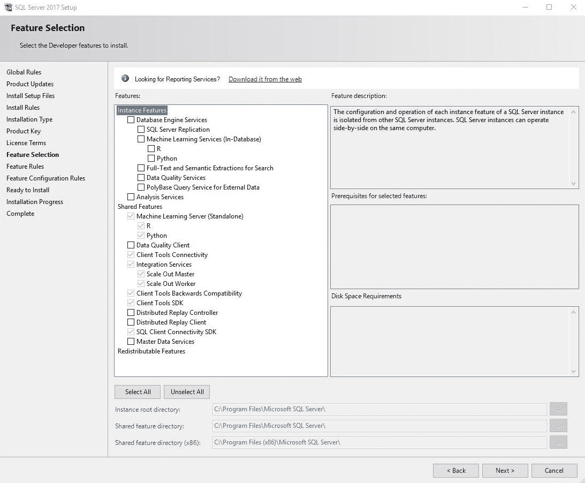

图 SQL Server 的功能选择

在下面的服务器配置步骤中，您必须检查有权访问服务的用户和帐户。对于 R 服务(数据库内)，将安装并自动启动 SQL Server Launchpad 服务。此服务可以在安装后通过 Windows 应用程序服务启动或停止:

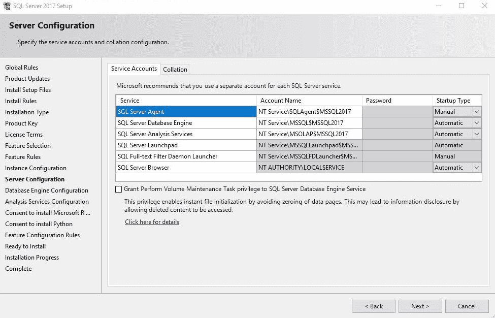

图 SQL Server 的服务器配置

配置数据库引擎后，将提示您接受安装 Microsoft R Open 的协议，确保您知道 R 受 GNU 许可。通过请求同意，Microsoft 只是想确保管理员同意，并且 R Open 版本的所有新更新和修补程序都将符合 SQL Server 更新首选项:

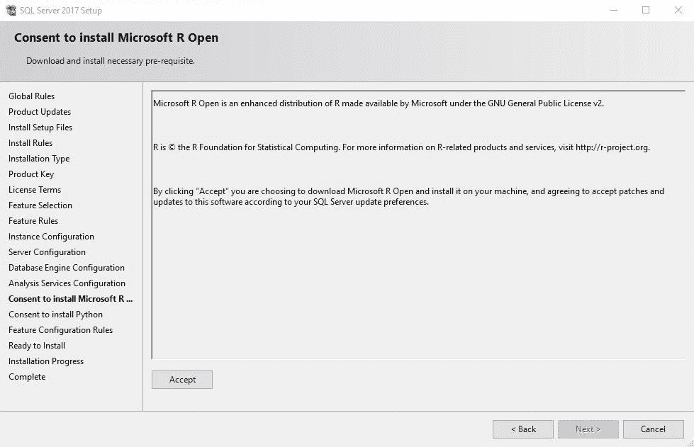

图 4:提示安装 Microsoft R Open 的内容

除了同意 R 的协议，请注意微软 R 服务器的生命周期是两年。如果 2016 年 1 月发布 MRS 8.0，2018 年 1 月官方支持结束；更准确地说，安全和关键更新将持续一年(直到 2017 年 1 月)，之后，只有安全更新将持续到 2018 年 1 月。在这一年中，还将收到升级。请注意，它与独立产品-微软机器学习服务器相关，但值得一提的是支持时间表将持续多久。

如果您也要安装 Python，也需要同样的许可:

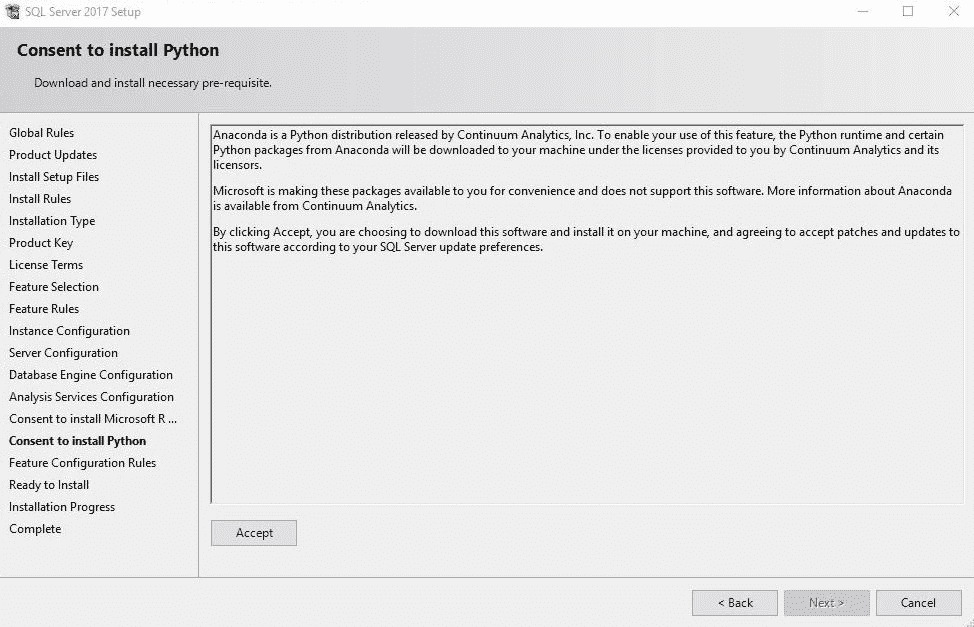

图 5:提示内容安装 Python

一旦您选择了所有功能、配置和许可，您将看到要安装的服务和功能的概述:

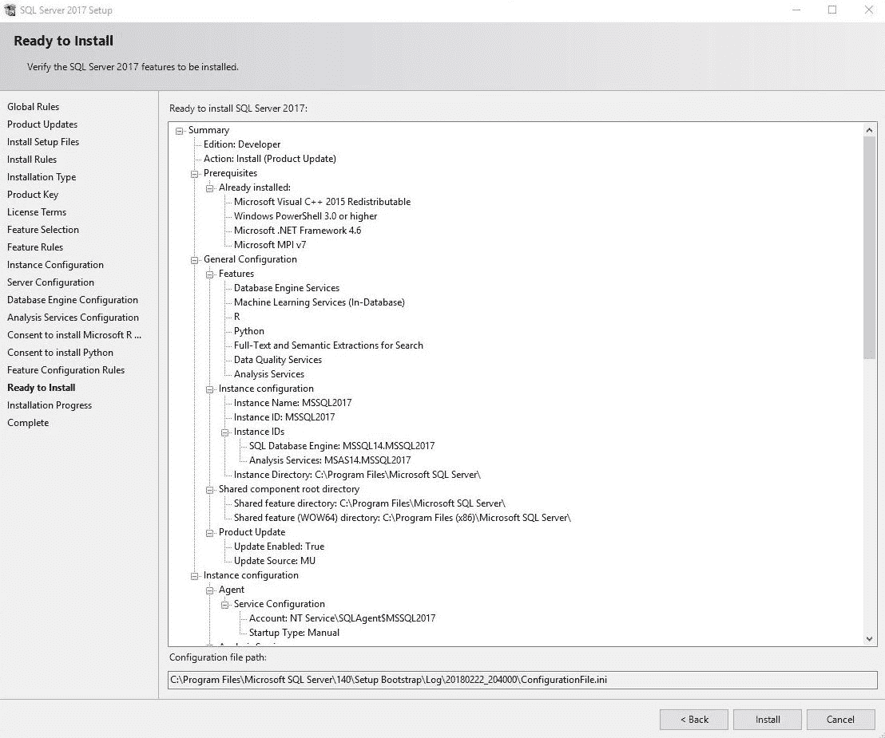

图 6:准备安装的选定特性

安装完成后，您将拥有 R Engine for Machine Learning Services 和安装了 R(如果选择)的 Microsoft Machine Learning Server。请注意，R Engine for R Services(in-database)将有一个不同的 R 安装，作为独立的 Microsoft R Server，并且所有安装的包也将不同，在不同的路径、权限和安全设置下。

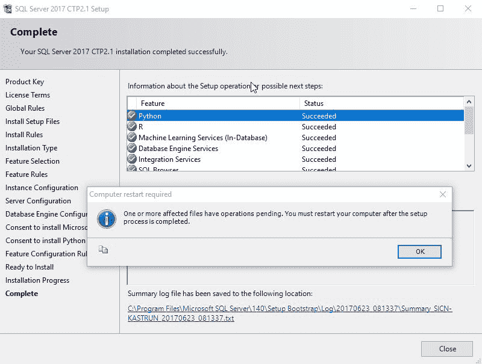

图 7:完成安装过程


# 配置数据库

在安装后过程中，数据库配置将是下一个任务。考虑一下数据库排序，因为 R 语言是区分大小写的，它关系到您将向 SQL Server 引擎提供什么样的数据，以及将什么样的数据推送到 Launchpad。一些语言区分大小写(例如，土耳其语；尤其是字母 L ),当 SQL Server 和 R 数据类型配对时，这可能是一个额外的挑战。此外，基于您的生态系统，身份验证也应该在设置环境中发挥重要作用。

随着 SQL Server 2016 提供实时数据评分，并在 SQL Server 2017 中得到改进，值得一试。此外，对于机器学习服务的任何扩展使用，文件数据库可能是一种非常有用和强大的方式来存储图形和结果以供以后分析，或者存储可以暴露给 Power BI、SSRS 或外部应用程序的结果。如果您的业务中包含用于处理非结构化数据的 filestream，这也是数据库配置需要额外关注的另一项服务。


# 为 Visual Studio 配置环境和安装 R Tools(RTVS)

安装完成后，需要执行一些安装后流程。

必须启用外部脚本服务器，以便存储过程可以调用外部脚本。为此，对您的 SQL Server 实例运行以下命令，在该实例中，您安装了 R 服务(在数据库中):

```
EXEC sp_configure 'show advanced options',1;
GO
RECONFIGURE;
GO
EXEC sp_configure 'external scripts enabled';
GO  
```

如果您是第一次运行它，默认情况下它是禁用的，因此必须启用它；否则，将无法运行`sp_execute_external_script`程序:

```
EXEC sp_configure 'external scripts enabled', 1;
GO
RECONFIGURE WITH OVERRIDE;
GO  
```

您可以随时检查启用的外部脚本的`run_value`是否设置为 1，如下所示:

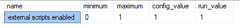

图 8:设置 sp_configure

如果服务器配置没有生效，您需要重新启动 SQL Server 服务。在服务下，找到您的`MSSQLSERVER`服务名并重启它(停止并启动):

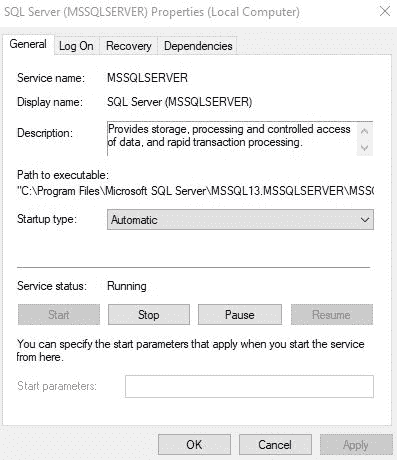

图 9:检查 MSSQLSERVER 服务

重启`MSSQLSERVER`服务将自动重启所有相关服务，以及`MSSQLLaunchpad`服务。服务器重启后，将启用外部脚本。

安装后过程完成后，可以设置安全性。它是可选的，因为默认的数据库读取器已经设置好了，但是，基于您公司的环境，建议您研究一下并正确设置它。

此外，您还需要安装用于 Visual Studio 的 **R 工具** ( **RTVS** )。为此，需要 Visual Studio 2015 或更高版本，一旦安装了 VS2015+，您需要从 Visual Studio 网站([https://www.visualstudio.com/vs/rtvs/](https://www.visualstudio.com/vs/rtvs/))下载 RTVS 本身。从那时起，安装过程非常简单，现在不需要任何进一步的说明。


# 安全性

在配置了数据库和您的生态系统中使用的任何其他设置之后，您将需要考虑安全性，即谁将有权运行`sp_execute_external_script`。

您可以直接在外部过程上创建安全设置。在这种情况下，您需要向用户添加执行外部脚本的数据库权限。

一个简单的 SQL 登录将如下所示:

```
USE [master]
GO
CREATE LOGIN [RR1] WITH PASSWORD=N'Read!2$17', DEFAULT_DATABASE=[SQLR], CHECK_EXPIRATION=ON, CHECK_POLICY=ON
GO
ALTER SERVER ROLE [sysadmin] ADD MEMBER [RR1]
GO
CREATE DATABASE SQLR;
GO

USE [SQLR]
GO
CREATE USER [RR1] FOR LOGIN [RR1]
GO
USE [SQLR]
GO
ALTER USER [RR1] WITH DEFAULT_SCHEMA=[dbo]
GO
```

现在，让我们开始外部程序:

```

EXECUTE AS USER = 'RR1';
GO

EXEC sp_execute_external_script
 @language = N'R'
 ,@script = N'OutputDataSet<- InputDataSet'
      ,@input_data_1 = N'SELECT 1 AS Numb UNION ALL SELECT 2;'
WITH RESULT SETS
((
 Res INT
))

REVERT;
GO
```

错误消息将是，用户`RR1`没有权限:

```
Msg 297, Level 16, State 101, Procedure sp_execute_external_script, Line 1 [Batch Start Line 34]
The user does not have permission to perform this action.
```

您还必须授予数据库一个 datareader 角色，以便执行`sp_execute_external_script`命令:

```
USE [SQLR]
GO
ALTER ROLE [db_datareader] ADD MEMBER [RR1]
GO 
```

您还应该检查是否启用了执行外部脚本:

```
GRANT EXECUTE ANY EXTERNAL SCRIPT TO [RR1];
GO  
```

设置数据库角色并授予执行权限后，重新运行`sp_execute_external_script`过程，执行外部脚本的结果应该如下:

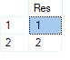

图 10:外部过程的结果

如何管理用户认证(Windows 或 SQL)和主要安全原则；应该使用本地 DBA、SysAdmin 和架构师来帮助您委派谁可以访问系统。

经验法则是准备存储过程来处理不同级别的数据操作，并在存储过程级别授予访问权限。使用以下命令清理数据:

```
DROP USER RR1; 
GO 
USE [master]; 
GO 
DROP LOGIN RR1; 
GO 
--DROP TABLE IF EXISTS SQLR; 
GO
```


# 资源调控器

资源调控器是 R Services (in-database)的一个非常受欢迎的特性，因为它可以通过一个简单的数据集来控制服务器的工作负载，这个数据集可以通过附带的代码数据库`RevoTestDB`获得，它需要首先被恢复 **:**

```
USE [master]
RESTORE DATABASE [RevoTestDB] FROM  DISK = N'C:\SQLServer2017MLServicesR\CH03\RevoTestDB.bak';
GO  
```

恢复后，我们将看到数据库的负载以及如何管理资源:

```
USE RevoTestDB;
GO

-- TEST query
EXECUTE  sp_execute_external_script
                 @language = N'R'
                 ,@script = N'
            library(RevoScaleR)
f <- formula(as.numeric(ArrDelay) ~ as.numeric(DayOfWeek) + CRSDepTime)
s <- system.time(mod <- rxLinMod(formula = f, data = AirLine))
            OutputDataSet <-  data.frame(system_time = s[3]);'
                ,@input_data_1 = N'SELECT * FROM AirlineDemoSmall'
                ,@input_data_1_name = N'AirLine'
WITH RESULT SETS ((Elapsed_time FLOAT));
```

在我的计算机上使用这个测试查询，整个运行时间为 21 秒，从 R 引擎返回的运行时间为 1.43 秒。

设置资源管理器来处理挑钉。为了在需要时或在运行大量数据时让执行操作运行得更快，我们需要配置外部资源池和资源池来授予资源:

```
-- Default value
ALTER EXTERNAL RESOURCE POOL [default] 
WITH (AFFINITY CPU = AUTO)
GO

CREATE EXTERNAL RESOURCE POOL RService_Resource_Pool
WITH (  
      MAX_CPU_PERCENT = 10  
      ,MAX_MEMORY_PERCENT = 5
);  

ALTER RESOURCE POOL [default] WITH (max_memory_percent = 60, max_cpu_percent=90);  
ALTER EXTERNAL RESOURCE POOL [default] WITH (max_memory_percent = 40, max_cpu_percent=10);  
ALTER RESOURCE GOVERNOR reconfigure;

ALTER RESOURCE GOVERNOR RECONFIGURE;  
GO 
```

在最后一步中，必须创建并重新配置分类功能:

```
CREATE FUNCTION RG_Class_function()
RETURNS sysname
WITH schemabinding
AS  
BEGIN  
    IF program_name() in ('Microsoft R Host', 'RStudio') RETURN 'R_workgroup';  
    RETURN 'default'
    END;  
GO  

ALTER RESOURCE GOVERNOR WITH  (classifier_function = dbo.RG_Class_function);  
ALTER RESOURCE GOVERNOR reconfigure;  
GO 
```

之后，我可以再次运行相同的查询:

```
-- TEST 2 - performance normal; with governor enabled
EXECUTE  sp_execute_external_script
 @language = N'R'
,@script = N'
library(RevoScaleR)
f <- formula(as.numeric(ArrDelay) ~ as.numeric(DayOfWeek) + CRSDepTime)
s <- system.time(mod <- rxLinMod(formula = f, data = AirLine))
OutputDataSet<-  data.frame(system_time = s[3]);'
,@input_data_1 = N'SELECT * FROM AirlineDemoSmall'
,@input_data_1_name = N'AirLine'
WITH RESULT SETS ((Elapsed_time FLOAT));  
```

最终在性能上的对比是显而易见的。在我的测试环境中，因为我将更多的 CPU 和 RAM 资源用于执行 R 代码，所以运行时间为 3 秒，R 运行时间为 0.63 秒。客户机上的结果可能不同，但是从默认资源调控器设置到新设置的变化应该非常明显。


# 安装新的 R 包

R 包是一个函数的容器，这些函数与相关的二进制源代码(通常是 C、C++或 Fortran)、文档和样本数据一起服务于特定的目的。包是位于库文件夹中的这些文件的集合。如果您导航到您的 R 库文件夹，您将看到为您的 R 引擎安装的所有包。根据操作系统的不同，软件包也可能被称为二进制软件包或 tarball。

包不等同于库，也不应该被误认为是库。在 R 语言中，当安装一个包时，使用命令`install.packages`。`library()`是一个将特定包中的函数加载到 R 环境中的函数。源自 Windows OS 的共享对象被称为**动态链接库**(**dll**)。因此，使用了库这个词，它指的是公共的和共享的对象。因此，要将一个包加载到您的 R 环境中，需要使用函数`library()`,用括号指定包的名称。

在 R 脚本中引用 R 库超级容易；只需添加库或使用`require()`方法。但是在系统中，首先必须安装库。

库是通过安装公共存储库中可用的软件包来安装的，例如 CRAN、Biocondutor、GitHub 和 MRAN(微软存储库)。在 R 语言中，通过调用以下命令来安装库:

```
install.packages("Package_Name")  
```

在 SQL Server 2016 中，无法通过运行带有外部存储过程的 R 脚本来安装此类包，并且代码返回错误，如下所示:

```
--Install Package using sp_execute_external_script
EXECUTE sp_execute_external_script
 @language = N'R'
,@script = N'install.packages("AUC")'  
```

这段 T-SQL 代码返回一个错误，说这个包不可用于我的 R 版本。但是，我们稍后将看到如何安装同一个软件包:


图 11:安装 AUC 包时的警告消息

因此，我们可以扩展原始存储过程，如下所示:

```
EXECUTE sp_execute_external_script
        @language = N'R'
,@script = N'   library(Hmisc)
               u <- unlist(rcorr(Customers_by_invoices$InvoiceV, Customers_by_invoices$CustCat, type="spearman"))
statistical_significance<-as.character(u[10])
OutputDataSet <- data.frame(statistical_significance)'

,@input_data_1 = N'SELECT
SUM(il.Quantity) AS InvoiceQ
,SUM(il.ExtendedPrice) AS InvoiceV
,c.CustomerID AS Customer
,c.CustomerCategoryID AS CustCat

                                         FROM sales.InvoiceLines AS il
                                         INNER JOIN sales.Invoices AS i
                                         ON il.InvoiceID = i.InvoiceID
                                         INNER JOIN sales.Customers AS c
                                         ON c.CustomerID = i.CustomerID
                                         GROUP BY
c.CustomerID
,c.CustomerCategoryID'

,@input_data_1_name = N'Customers_by_invoices'

WITH RESULT SETS (( statistical_significance FLOAT(20) ));
GO 
```

如果我们这样做，我们将能够计算两个变量之间相关性的统计显著性。这里的要点是，我们用适当的包名来引用 R 函数`library(Hmisc)`。以下是脚本的详细部分:

```
-- part of R script with reference to call method library
,@script = N'   library(Hmisc)
 u <- unlist(rcorr(Customers_by_invoices$InvoiceV, Customers_by_invoices$CustCat, type="spearman"))
statistical_significance <-as.character(u[10])
OutputDataSet <- data.frame(statistical_significance)'  
```

当提到一个库时，我们需要已经预装了这个包；否则，您将收到一条错误消息，指出该包不存在。如果您拼错了包名，将会收到同样的错误，并且由于 R 语言是区分大小写的，在`Hmisc`包的情况下，当错误地将其键入为`hmisc`(没有大写字母`H`)时，将会出现错误:

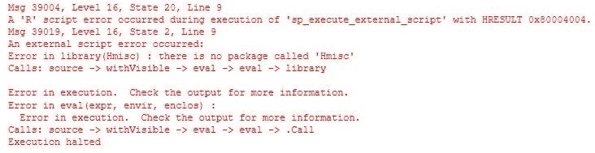

图 12


# 包装信息

包总是保存在`library`文件夹中，但是根据您的 R 版本(Open、Client 或 Server), SQL Server 实例名称和路径可能会有所不同。

通常，客户端或服务器版本会将库存储在主驱动器上。对于客户端版本，默认路径是`C:\Program Files\Microsoft\R Client\R_SERVER\library`。可以在下面的截图中看到文件夹内容:

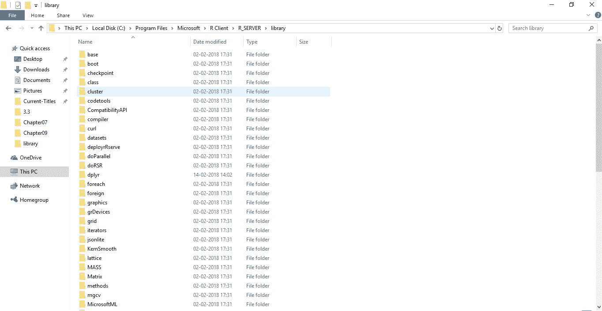

图 13

在 R Server 版本中，您将在默认 SQL Server 实例的路径中找到库:`C:\Program Files\Microsoft SQL Server\MSSQL14.MSSQLSERVER\R_SERVICES\library`。以下是服务器安装的内容:

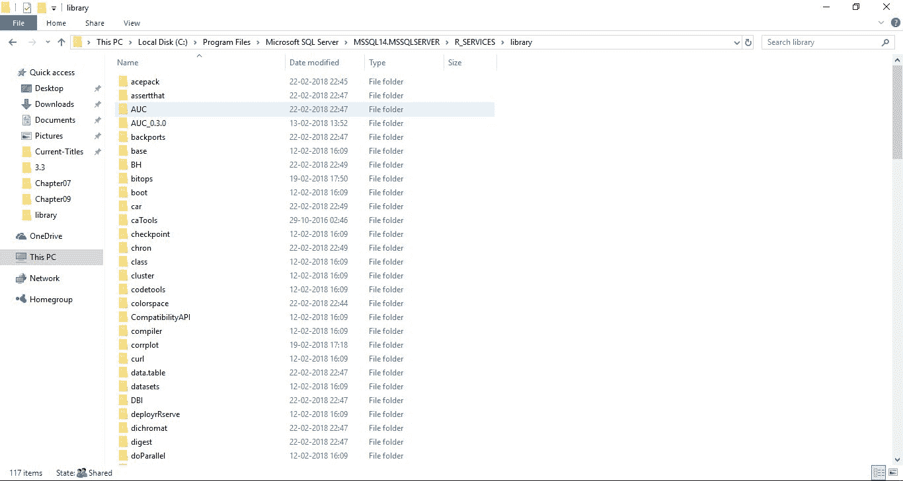

图 14

子文件夹代表已安装和可用的软件包的名称。要找到包的默认路径，可以执行以下代码:

```
-- Path to libraries on your computer/server
EXECUTE sp_execute_external_script
 @language = N'R'
,@script = N'OutputDataSet <- data.frame(.libPaths());'
WITH RESULT SETS (([DefaultLibraryName] VARCHAR(MAX) NOT NULL));
GO  
```

在我的例子中，下面是 R Server edition 中 R 包的默认路径:

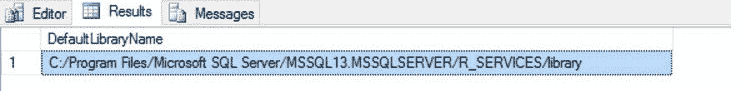

图 15

使用 R 函数`installed.packages()`可以检索更多的信息。在此示例中，我们提取了有关包的更多信息，并将这些信息插入到 SQL Server 表中:

```
-- You can create a table for libraries and populate all the necessary information
CREATE TABLE dbo.Libraries
       (
               ID INT IDENTITY NOT NULL CONSTRAINT PK_RLibraries PRIMARY KEY CLUSTERED
,Package NVARCHAR(50)
,LibPath NVARCHAR(200)
,[Version] NVARCHAR(20)
,Depends NVARCHAR(200)
,Imports NVARCHAR(200)
,Suggests NVARCHAR(200)
,Built NVARCHAR(20)
       )

INSERT INTO dbo.Libraries
EXECUTE sp_execute_external_script
              @language = N'R'
,@script=N'x <- data.frame(installed.packages())
OutputDataSet <- x[,c(1:3,5,6,8,16)]'

SELECT * FROM dbo.Libraries
DROP TABLE dbo.Libraries 
```

通过查询这个表，您可以在一次执行`sp_execute_external_script`中获得关于库依赖、版本、导入和构建的信息:

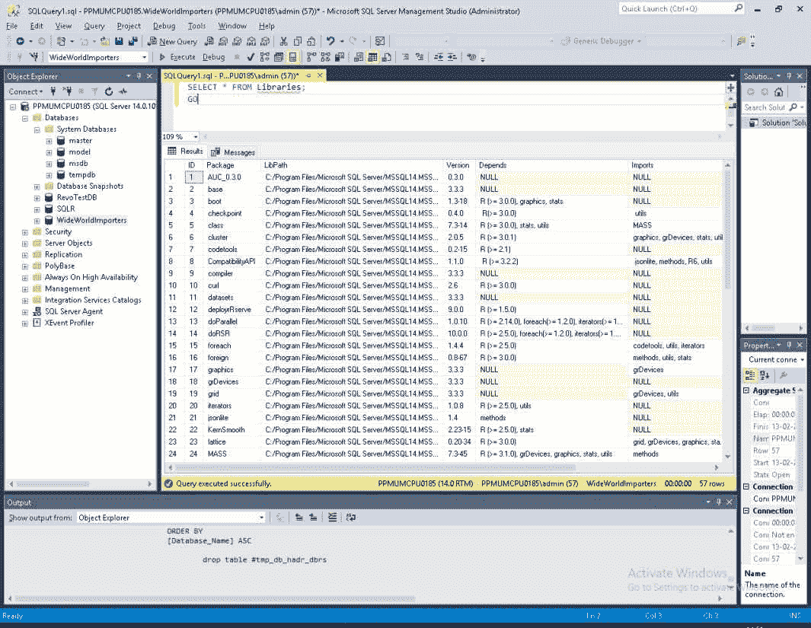

图 16

在下面，我们将探索如何安装缺失的 R 包。对于 SQL Server 2016，有几种方法(官方或非官方)可以解决这个问题，而对于 SQL Server 2017，我们有一种使用`rxInstall`包或创建外部库的优雅方式。SQL Server 2017 中引入的两种新方法都是更好、更安全、更快速的安装缺失包的方法。


# 使用 R Tools for Visual Studio(RTVS)2015 或更高版本

对于 SQL Server 2016，微软建议通过 RTVS 安装缺失的软件包。为了安装软件包，用户应该已经在客户端上安装了 RTVS([https://www.visualstudio.com/vs/rtvs/](https://www.visualstudio.com/vs/rtvs/))。检查默认路径:

```
sessionInfo()
.libPaths()  
```

这也返回了我机器上库文件夹的路径——对于 R 服务器(默认为`C:/Program Files/Microsoft SQL Server/MSSQL14.MSSQLSERVER/R_SERVICES/library`)和当前使用 RTVS 的用户(`C:/Users/Tomaz/Documents/R/win-library/3.2`):

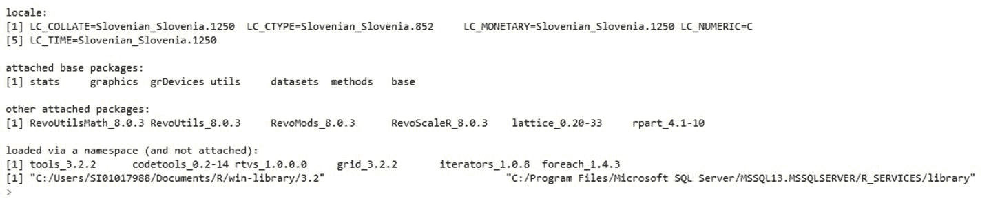

图 17

检查选项...部分:

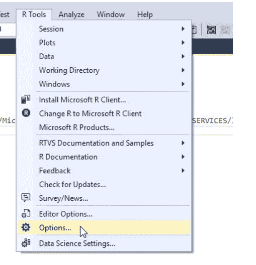

图 18

然后选择 R 工具|高级(如下所示):


图 19

您将看到 R 引擎已经定义了一个路径。这个路径是安装 R 包的根路径。r 包安装在子文件夹-library ( `C:\Program Files\Microsoft SQL Server\MSSQL14.MSSQLSERVER\R_SERVICES\Library`)下。

因此，通过运行`install.packages("AUC")`，我可以看到服务器路径被忽略，库被安装到用户指定的文件夹中:

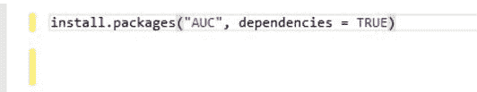

图 20

要在 R Server 文件夹中安装软件包，您需要拥有管理员级别的访问权限，或者让管理员为您完成这项工作。微软已经在 MSDN 上讨论了这个问题([https://docs . Microsoft . com/en-us/SQL/advanced-analytics/r/installing-and-managing-r-packages](https://docs.microsoft.com/en-us/sql/advanced-analytics/r/installing-and-managing-r-packages))。以管理员身份运行 Visual Studio 和 RTVS 不会改变结果。为了避免这个问题，您需要声明要安装软件包的 R 服务器的 library 文件夹的路径:

```
install.packages("AUC", dependencies = TRUE, lib = "C:/Program Files/Microsoft SQL Server/MSSQL14.MSSQLSERVER/R_SERVICES/library")  
```

该软件包将自动安装在 R Server repository 文件夹中:

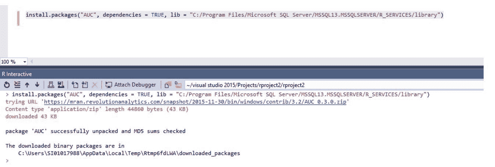

图 21


# 在 CMD 中使用 R.exe

在 R 服务器(`C:\Program Files\Microsoft SQL Server\MSSQL14.MSSQLSERVER\R_SERVICES\bin`)的二进制文件夹中以管理员身份执行`R.exe`时，会有一个命令窗口提示你:

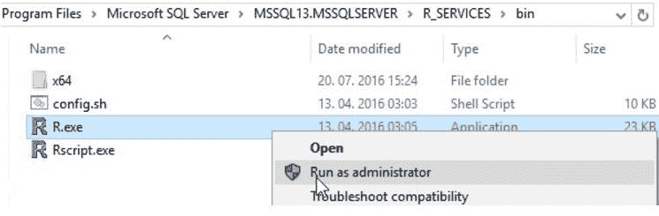

图 22

从那里，用户总是可以安装丢失的软件包。

```
install.packages("AUC")  
```


# 使用 XP_CMDSHELL

到目前为止，这种方法是最快的，在共享 T-SQL 代码时非常有用，但它会影响命令 shell 的使用，许多用户和 DBA 对此并不感兴趣。通过在配置中启用`xp_cmdshell`并使用这个存储过程，您可以安装任何缺失的包。使用带有`-e`开关的代码，您可以轻松安装库:

```
R cmd -e install.packages("Hmisc")  
```

以下代码将在 R 服务器上安装缺失的软件包:

```
-- enable xp_cmdshell
EXECUTE SP_CONFIGURE 'xp_cmdshell','1';
GO

RECONFIGURE;
GO 
EXEC xp_cmdshell '"C:\Program Files\Microsoft SQL Server\MSSQL14.MSSQLSERVER\R_SERVICES\bin\R.EXE"cmd -e
```

```
install.packages(''Hmisc'')'; 
GO  
```

运行 Vanilla R 并添加`install.packages()`函数可以在用户被授予权限的情况下完成。结果如下:

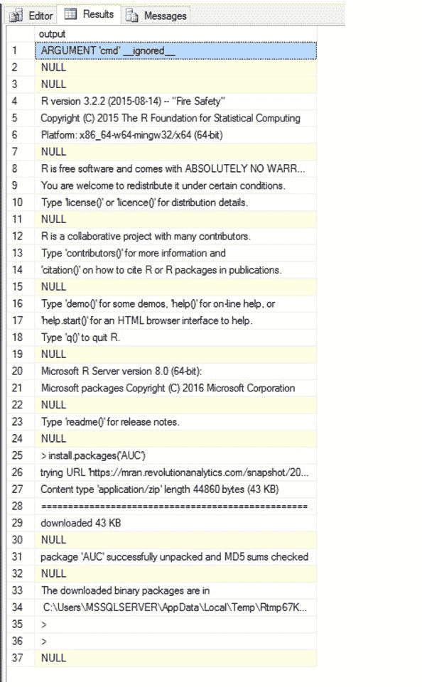

图 23

使用 CMD 和`-e`开关，可以执行和简化 R 代码的部署和计算，但由于这不是一种正式的方式，我不建议使用它，因为它会暴露安全问题。


# 复制文件

乍一看，复制文件可能听起来有点奇怪，但是对于大多数包来说，将整个库文件夹复制到目标文件夹也可以完成这项工作。想象一下，作为一名系统管理员，负责配置一个新的 R 环境或沙箱。在这种情况下，您不希望运行数百行代码来安装所有需要的包；因此，您只需从映像或备份中复制/粘贴文件夹。这会快一百倍，也方便得多。此外，这些包已经用 R 引擎测试过了。

使用简单的复制/粘贴、拖放操作，我在我的 R 客户机环境中复制并安装了`acepack`包(从 R 服务器复制):

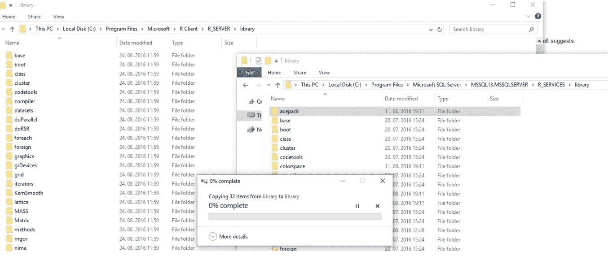

图 24


# 使用 rxInstallPackages 函数

随着 SQL Server R Services for SQL Server 2017 的新版本，一个非常需要的 R 函数——在`RevoScaleR`包中——已经公开可用。通过`rxInstallPackages`功能，用户将能够为所需的计算环境安装任何额外的 R 包。

使用下面的代码，可以真正加快软件包的安装速度，而不用担心变通方法、打开额外的工具或其他任何事情。

来自 RTVS 的运行代码如下所示:

```
RSQLServicesCC <- RxInSqlServer(connectionString = "Driver=SQL Server;Server=myServer;Database=TestDB;Trusted_Connection=True;")

rxInstallPackages("AUC", verbose = TRUE, scope = "private", computeContext = RSQLServicesCC)  
```

从 SQL Server 运行相同的代码如下:

```
EXECUTE sp_execute_external_script 
 @language = N'R' 
 ,@script = N'

 packagesToInstall <- c("caret","tree","party") library(MicrosoftML) 
 RSqlServerCC <- RxInSqlServer(connectionString = "Driver=SQL Server; +Server=SICN-KASTRUN\\SQLSERVER2017C2;Database=SQLR; +Trusted_Connection=True;") 
 rxInstallPackages(pkgs = packagesToInstall, owner = '', +scope = "shared", computeContext = "SqlServerCC");'; 
GO
```

这太容易了，不可能是真的，但它是真的。确保在运行这段代码之前做几件事情:

*   将计算环境设置为软件包的安装位置
*   设置正确的权限和访问
*   检查 TCP/IP 协议

在`rxInstallPackages`功能中，使用`computeContext`参数设置`Local`或您的`SqlServer`环境；您还可以将作用域作为共享或私有使用(区别在于，如果您将一个包作为共享安装，它可以由不同数据库中的不同用户使用)。如果您从`db_owner`角色运行这个命令，您也可以指定所有者。


# 使用 PowerShell 管理 SQL Server R 服务

PowerShell 对于管理远程机器、虚拟机甚至 Azure VM 机器非常有用。除了这种常见的行政工作，它还有许多其他积极和有益的好处。

用户可以列出、计划或处理任何任务计划的作业或 SQL Server 作业，具体取决于您需要运行什么作业，以及如何运行，比如说每天获取数据或重新计算和初始化预测模型，甚至运行模型。

PowerShell 的另一个非常有用的方面是不同环境和系统中的 API 通信。

对于系统管理员来说，PowerShell 对于在客户机之间甚至在 R Server 服务器之间分发和维护任何额外的 R 包将非常有用。


# 了解 sp_execute_external_script 外部过程

`SP_EXECUTE_EXTERNAL_SCRIPT`是一个存储过程，它将提供的脚本作为外部脚本的参数执行给提供的语言(在本例中是 R 语言)。SQL Server 2017 还支持 Python，据说将来还会支持其他语言，如 Java、C#和 C++(通过 Launchpad)。

`sp_execute_external_script`是一个系统过程，调用并向外部引擎发送传递的代码，并将结果以表格的形式返回给 SQL Server。脚本有一组参数，将导航到 T-SQL 代码和 R 引擎的数据，包括 R 代码。

以下是可用的参数:

```
sp_execute_external_script
 @language = N''
,@script = N'', 
,@input_data_1 =  'input_data_1'
,@input_data_1_name =  N'input_data_1_name'
,@output_data_1_name = 'output_data_1_name'
,@parallel = 0 | 1 
,@params =  N''
,@parameter1 = ''  
```


# 争论

*   `@language`:指定在外部程序中使用哪种语言。对于 SQL Server 2016，R 语言可用，对于 SQL Server 2017，Python 可用。该参数属于`sysname`内置数据类型，长度限制为 128 个 Unicode 字符。这就是为什么我们在值的前面使用 N，来表示`nvarchar`类型。
*   `@script`:原生 R 或 Python 代码通过这个参数传递给 Launchpad 服务。这个外部代码(SQL Server 外部的)必须经过验证和正确格式化(仅在 Python 的情况下)，因为 SSMS 或 RTVS 不会验证这个参数。因此，最简单的方法就是使用 Visual Studio，在 RTVS 中验证你的 R 代码，或者用**Python Tools for Visual Studio**(**PTVS**)验证你的 Python 代码。该字段属于`nvarchar`类型。
*   `@input_data_1`:这将您的 T-SQL 代码作为外部过程的数据源。该代码将由 SSMS 或 VS 进行验证和检查。该字段也是`nvarchar`类型，可以执行任何 T-SQL 代码。由于外部引擎(R 语言)的限制，可以输入的数据类型有一些限制。与 SQL Server 2016 相比，R 语言本身支持的数据类型更少。支持的数据类型有逻辑、数值、整数、复杂、字符和原始。因此，很快就可以看出，下面的数据类型(除非转换成 R 数据类型)会带来一些问题。让我们只陈述几个 SQL Server 数据类型:
    *   `Cursor`
    *   `Timestamp`(哈希格式不是日期时间格式)
    *   `Datetime2`、`datetimeoffset`、`time`
    *   所有 Unicode 文本数据类型:`nvarchar`、`nchar`、`ntext`
    *   `Sql_variant`
    *   `Text`，`image`
    *   `XML`(包括 JSON，因为它是 SQL Server 2017 中的 XML 数据类型格式)
    *   `Hierarchy`、`geometry`、`geography`
    *   使用。NET 框架或任何 Launchpad 服务支持的语言

除了一些数据类型的限制之外，还有一些 T-SQL 子句和语句不能用作输入数据参数的一部分。这些措施如下:

*   存储过程(UDF、表值函数)
*   逻辑`IF`和`WHILE`、`FOR`循环
*   临时变量或表
*   没有更新、插入或删除(仅选择)
*   `GO`语句或分号
*   `OUTPUT`来自和 DML 语句的子句
*   引用任何游标

可以使用以下语句(除了`SELECT`语句之外):

*   `SELECT`带多个`JOINS`
*   `WITH`常见表情
*   `UNION`、`UNIONALL`、`EXCEPT`、`INTERSECT`
*   任何`SET`、`STRING`、`LOGICAL`、`COMPARISON`、`BITWISE`、`ARITHMETIC`、`COMPOUND`操作员
*   `COLLATE`

正如已经提到的 DML 语句，`@input_data_1`自变量也不支持任何 DDL 语句或子句。

为了避免 T-SQL 语言和外部脚本之间的数据类型冲突，最佳实践是在将所需数据集放入参数之前，尽可能多地进行数据准备、争论和优化。此外，转换到 R closed 数据类型会损害许多限制。

*   `@input_data_1_name`:它保存了将在 R 脚本中用作输入数据集的数据集的名称。默认情况下，外部程序`sp_execute_external_script`将使用以下内容:- `InputDataSet`输入数据和- `OutputDataSet`返回结果数据(两者均为默认值)。请注意，R 语言是区分大小写的，所以在这个参数中提供的数据集名称也必须以相同的方式用 R 代码编写。
*   `@output_data_1_name`:该参数将外部脚本返回结果的定义保存为返回给任何存储过程的变量。返回的数据集必须是 R 语言中的`data.frame`格式。Data.frame 是一组向量，是表的一种表示形式，T-SQL Server 可以导入该表，并将其进一步用于任何其他 T-SQL 子句或语句:或者它可以将结果直接存储到 SQL Server 表中。该参数是一个`sysname`数据类型。
*   `@parallel`:这是一个显式地告诉 R 引擎在 R 中并行化计算的参数。该参数已在 SQL Server 2016 (SP/CU)的更高版本中引入，并且非常受任何类型的 R 代码、函数或包的欢迎，这些代码、函数或包不使用针对`RevoScaleR`计算函数的并行性。当然，对于琐碎的 R 脚本和大型输入数据集来说，这是正确的。如果特定 R 包本身是用 C++(而不是最初的 Fortran)编写的，并且如果 R 脚本不包括相对复杂的数据争论/咀嚼指令，特别是`plyr` / `dplyr`或`data.table`函数的 and，那么来自该包的 R 函数将提供更好的性能结果。记住越简单越好。

要检查工作负载是否可以并行分布，只需观察执行计划，并在运行 T-SQL 代码时查找计划中的并行度。另请注意，MAXDOP 的任何本地设置也会对所需的并行度产生影响。换句话说，如果 MAXDOP 关闭，并且您设置了您的参数`@parallel = 1`，不要期望太多的分布式工作负载，因为并行性在默认情况下是关闭的。

当运行和使用`RevoScaleR`包中可用的任何计算函数时，Launchpad 将使用 R Server 或 SQL Server R Services 中可用的 distribute R 函数自动处理并行性。

*   `@params`:这是一个参数，其中任何附加变量都可以声明并指定为可在 R 脚本中使用的变量。这些参数可以指定为输入或输出，在将预测模型输入到 R 代码中或从 R 代码中导出附加信息(除了指定的结果集)时非常方便。使用此参数作为输出可以返回单个值/列，而不是表。
*   `@parameter1`:这是一个参数，在 R 脚本中以输入或输出变量的形式指定和使用参数值。


# 摘要

本章介绍了机器学习服务(数据库内)的安装、服务的配置以及如何管理服务。它还探讨了缺失包的安装，并介绍了安全性和资源调控器。在最后一节，本章还解释了如何使用外部过程和带有所有参数的`sp_execute_external_script`。通过深入研究安全问题和缺失包的安装，已经讨论了几个例子。缺失包的安装严重依赖于 SQLServerCentral 中的项目。

对机器学习服务和使用外部过程的介绍将是所有后续章节的基础，这些章节在很大程度上依赖于对配置和使用该过程的良好理解。