# 四、数据探索和数据可视化

在实现预测建模之前，数据探索和数据可视化技术对于理解数据至关重要。有了现有的用于统计和数学算法的开源 R 包，数据专业人员可以轻松地研究他们的数据，发现在关系数据库中很难做到的模式/趋势。将 SQL Server **机器学习服务** ( **ML 服务**)与 R 一起使用意味着数据探索和数据可视化不再是孤立的工作，从而更快更容易地实现预测建模。

本章概述了开发人员必须知道的使用 R 进行数据探索和数据可视化的基本技巧和诀窍。您将学习如何在 T-SQL 中集成 R 进行数据探索和数据可视化，然后在 SSRS 和 Power BI 中整合这些技术。如果你已经熟悉了数据探索和数据可视化的 R 语言，可以直接跳到本章的最后一节。


# 了解 SQL 和 R 数据类型

在我们深入研究在 T-SQL 中使用 R 的数据之前，让我们先了解在 R 中存储数据的数据类型。在 T-SQL 中使用 R 时，要熟悉的第一个也是最重要的数据类型是数据帧。从 R 收发的 SQL Server 中的`sp_execute_external_script`的输入输出参数是数据帧。对于数据管理来说，了解与数据框非常相似的其他数据类型是矩阵和数据表，这超出了本章的范围。

除了数据帧，R 还支持有限数量的标量数据类型，如字符、复数、日期/时间、整数、逻辑、数字和原始数据。因此，当您在 R 脚本中提供来自 SQL Server 的数据时，必要时数据将被隐式转换为 R 中兼容的数据类型。下表提供了数据类型转换的简短示例。有关隐式数据类型转换的更多信息，请访问[https://docs . Microsoft . com/en-us/SQL/advanced-analytics/R/R-Libraries-and-Data-Types # changes-in-Data-Types-between-SQL-server-2016-及更早版本](https://docs.microsoft.com/en-us/sql/advanced-analytics/r/r-libraries-and-data-types#changes-in-data-types-between-sql-server-2016-and-earlier-versions)上的 *R 库和 R 数据类型*:

| **SQL Server 数据类型(sp_execute_external_script 的输入参数)** | **R 级** | **结果集数据类型(输出参数到 sp _ execute _ external _ script)** |
| `datetime` | `POSIXct` | `Datetime` |
| `numeric(p,s)` | `numeric` | `float` |
| `int` | `integer` | `int` |
| `varbinary(n)` | `raw` | `varbinary(max)` |
| `varchar(n)` | `character` | `varchar(max)` |


# R 中的数据帧

数据框包含行和列，就像 SQL Server 中的表一样，其中每一列都可以有不同的基本数据类型，例如整数、字符等。

Use `?` to learn more about a function:
`? [function]`

有关数据框的更多信息，您可以在 Visual Studio 的工具中键入以下命令:

```
> ? data.frame  
```

默认情况下，R 使用内存。所以一旦输入数据帧从`sp_execute_external_script`传递过来，R 会将输入数据存储在内存中。机器学习服务(数据库内)由 SQL Server 中的资源调控器管理，如[第 3 章](part0039.html#1565U0-e3f81285367248f4bbc6431bcd4f926d)、*为 SQL Server 2017 和 R* *管理机器学习服务中所述。*

一般的指导方针是努力在 SQL Server 和 R 中应该完成的计算类型之间取得平衡，这包括是否在 R 和 SQL Server 中进行数据管理/操作。

R 中有一些内置的数据帧可用，比如`mtcars`或者`iris`。

让我们来看看 r 中的一个数据帧。在 RTVS 运行以下代码:

```
> mtcars;

```

输出应该是这样的:

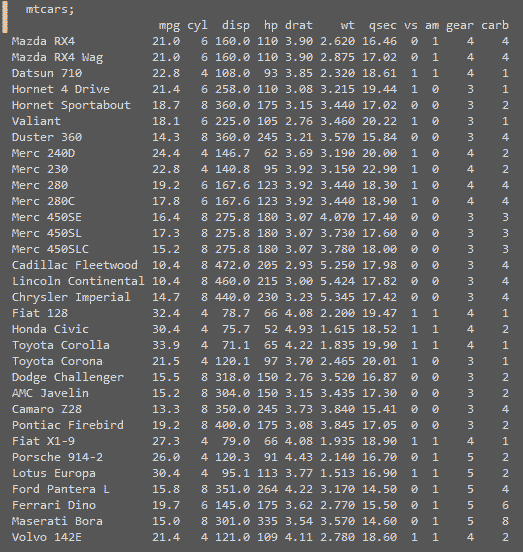

图 4.1 - mtcars 数据

要检查数据类型，可以对变量调用函数`call`:

```
> class(mtcars); 
[1] "data.frame" 
```


# 数据探索和数据管理

R 中的数据管理可以在不使用 SQL Server 的情况下独立完成。下图说明了开发人员在使用 SQL Server 和 R 时可以遵循的一个建议的高级过程。如果您以前使用过 R，您可能熟悉直接在 R 中执行的步骤 2、3 和 5。

请注意，步骤 3 和 4 是可选的，将在[第 6 章](part0096.html#2RHM00-e3f81285367248f4bbc6431bcd4f926d)、*预测建模*和[第 7 章](part0102.html#318PC0-e3f81285367248f4bbc6431bcd4f926d)、*操作 R 代码*中详细讨论:

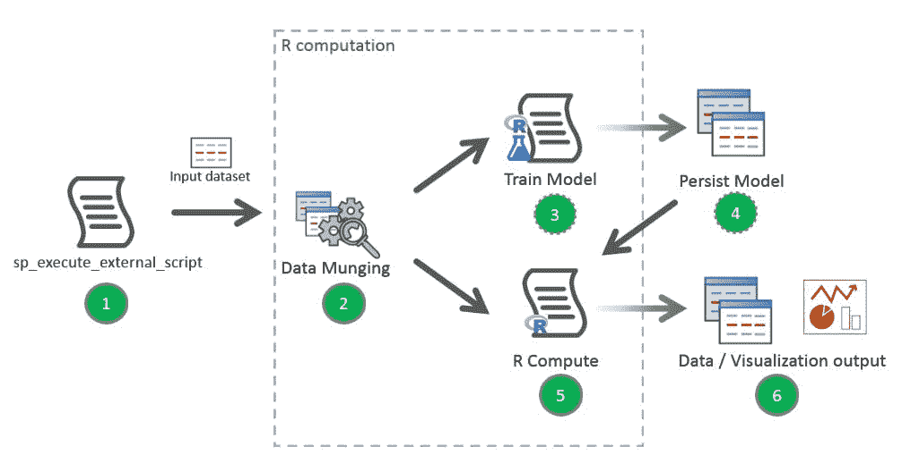

图 4.2-SQL Server 机器学习服务的高级开发过程

让我们从 R 中的*数据管理开始。具体来说，在这一节中，我们将使用 R 环境，以便在将它与 T-SQL 结合起来之前，我们知道它在 R 中是如何工作的。如果你熟悉 R，你可以跳过这一节。以下是本节的先决条件:*

1.  一个 IDE，例如作为 Visual Studio 2015 或 2017 的一部分的 RTVS。想了解更多关于 RTVS 的信息，请访问 http://aka.ms/rtvs。
2.  将`WideWorldImporters`数据库恢复到 SQL Server 2016 或更高版本。请参考[http://aka.ms/wwi](http://aka.ms/wwi)下载可以在您的环境中恢复的完整 SQL 备份文件。


# 将 SQL Server 数据导入 R

从 R 连接到 SQL Server 最常见的方式是使用 RODBC 包。请注意，在 SQL Server 2016 之前，这是您可能需要处理的步骤。

在下面的示例中，我们希望从 SQL Server 实例`MsSQLGirl`中检索与 2015 年销售人员月订单相关的数据集；和数据库，`WideWorldImporters`使用可信连接(Windows 身份验证)。

使用 RTVS，执行以下步骤:

1.  创建一个名为`Chapter04_01.R`的新脚本。通过键入以下命令，确保加载了`RODBC`库:

```
library(RODBC); 
```

2.  定义连接字符串并获取连接句柄:

```
connStr <- "Driver=SQL Server;Server=MsSQLGirl; 
  Database=WideWorldImporters;trusted_connection=true"; 
dbHandle <- odbcDriverConnect(connStr); 
```

3.  定义要在 SQL Server 中运行的查询。这也可以是调用存储过程、函数、视图等的查询。在此特定示例中，查询将按销售人员获取 2015 年的每月订单:

```
# Define the query to be run 
order_query =  
"SELECT DATEFROMPARTS(YEAR(o.[OrderDate]),  
      MONTH(o.[OrderDate]), 1) AS OrderMonth, 
    sp.[PreferredName] AS SalesPerson, 
    COUNT(DISTINCT o.[OrderID]) AS OrderCount, 
    SUM(ol.[Quantity] * ol.[UnitPrice]) AS TotalAmount 
FROM [Sales].[Orders] o 
    INNER JOIN[Sales] .[OrderLines] ol 
        ON ol.[OrderID] = o.[OrderID] 
    INNER JOIN[Application] .[People] sp 
        ON sp.[PersonID] = o.[SalespersonPersonID] 
WHERE sp.[ValidTo] >= GETDATE() 
    AND o.[OrderDate] BETWEEN '20150101' AND '20151231' 
GROUP BY 
DATEFROMPARTS(YEAR(o.[OrderDate]),  
MONTH(o.[OrderDate]), 1), 
    sp.[PreferredName];" 

```

4.  执行查询并将输出存储到`orders`变量中:

```
# Get the data set from SQL into the orders variable in R 
orders <- sqlQuery(dbHandle, order_query); 
```

5.  键入以下内容以查看`orders`中的数据集:

```
orders;  
```

或者在 RTVS 进入变量浏览器窗口，如图*图 4 - 2* 所示，展开订单查看变量的详细信息。使用放大镜工具(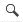)查看输出，如图*图 4 - 3* 所示:

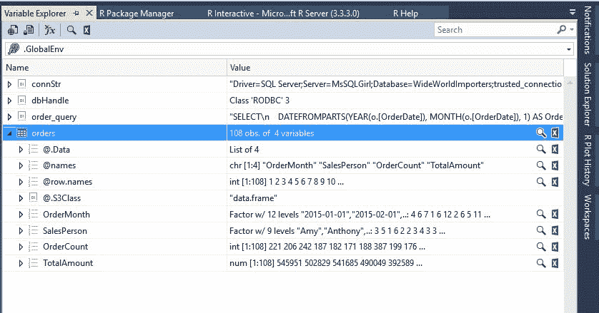

图 4-3 RTVS 变量浏览器

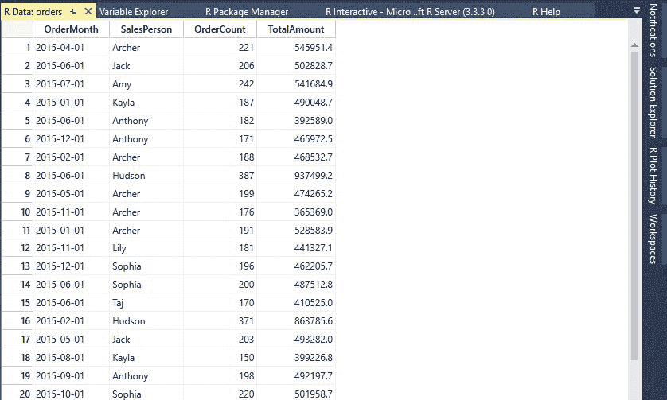

图 4 - 4 在变量浏览器中查看订单

这里是`orders`变量的数据字典。熟悉以下各列非常有用，因为我们将在本章中使用订单数据框及其派生变量:

| **列名** | **描述** |
| `OrderMonth` | 订单发生的月份 |
| `OrderCount` | 销售人员当月的订单数量。 |
| `TotalAmount` | 订单金额 |
| `SalesPerson` | 销售人员的姓名 |


# 探索 R 中的数据

在 R 中有很多方法可以探索数据:下面是一些有用的函数。`df`表示数据帧变量，`col`表示`df`中的列；

*   `head(df)`返回数据帧`df`的前几行，默认为 6。
*   `tail(df)`返回数据帧`df`的最后几行，默认为 6。
*   `summary(df)`提供数据框`df`中各列的基本汇总统计。
*   `names(df)`返回数据帧`df`的列名。
*   `str(df)`返回数据帧`df`的基本信息。
*   `describe(df$col)`描述`df`数据帧中一组`col`值的分布/偏斜度。这对于构建量表和项目分析非常有用。这需要首先安装`psych`包。
*   以下是对数据帧`orders`使用函数`str`的示例:

```
> str(orders) 
```

输出如下所示:

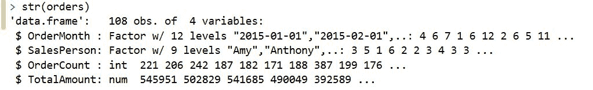

图 4-5 str 的输出(订单)

与 SQL Server 不同，R 对函数和变量都区分大小写。请确保输入正确。


# R 中的数据管理

数据管理是将一种*原始*格式转换为另一种格式的手动过程，以便它更容易被人或后续过程(如报告、数据可视化、统计分析、预测分析等)使用。

有许多 R 包可用于数据管理。r 预装了用于简单数据转换和可视化的包。在本节中，您将学习两个常用于数据管理的超级强大的软件包:`dplyr`、`reshape`和`lubridate`。


# 在数据框中添加/移除行/列

添加或删除行或列很容易实现。下面是一个例子列表，展示了如何使用 R 和`dplyr`来实现它:

1.  **添加新行**:让我们创建一个新的数据帧`orders_newrows`，它包含 2 个我们想要添加到`orders`末尾的新行。然后我们想使用`tail`函数查看`orders`的最后几行:

```
> orders_newrows <- data.frame( 
    OrderMonth = c("2015-12-01", "2015-12-01"), 
    SalesPerson = c("Julie", "Tomaz"), 
    OrderCount = c(201, 2017), 
    TotalAmount = c(340000, 370000)); 

> orders <- rbind(orders, orders_newrows); 
> tail(orders); 

```

这将触发以下输出:

```
    OrderMonth SalesPerson OrderCount TotalAmount 
105 2015-12-01        Lily        194    442645.5 
106 2015-03-01      Hudson        389   1020488.6 
107 2015-10-01         Taj        195    437388.4 
108 2015-08-01        Lily        182    517126.3 
109 2015-12-01       Julie        201    340000.0 
110 2015-12-01       Tomaz       2017    370000.0 
```

使用`dplyr`，可以调用`bind_rows`追加多个数据帧。例如，下面显示追加两次的`orders`和`orders_newrows`:

```
> bind_rows(orders, orders_newrows, orders_newrows);
```

2.  **添加新列**:为了进行说明，我们创建一个新的数据帧`orders_tax`，其中包含每行的序列 id 和总额的 10%销售税。我们使用`cbind`函数将订单变量与`orders_tax`变量绑定在一起:

```
> orders_discount <- data.frame( 
    Discount = orders$TotalAmount * 0.25) 
> orders <- cbind(orders, orders_ discount); 
> names(orders) 
```

这将为我们提供以下输出:

```
[1] "OrderMonth"  "SalesPerson" "OrderCount"  "TotalAmount" 
[5] "Discount"  
```

使用`dplyr`，您可以调用`bind_cols`来添加新列:

```
> orders_tax <- data.frame( 
    RowID = seq(1:nrow(orders)), 
    SalesTax = orders$TotalAmount * 0.1 
    ) 
> orders <- bind_cols(orders,data.frame(orders_tax)); 
> names(orders) 
```

输出如下所示:

```
[1] "OrderMonth"  "SalesPerson" "OrderCount"  "TotalAmount"  
[5] "Discount"   "RowID"       "SalesTax"    
```

或者您可以添加一个名为`TotalPlusTax`的新列:

```
> mutate(orders, TotalPlusTax = TotalAmount * 0.125); 
```

3.  **删除列**:现在让我们从`orders`中删除`RowID`:

```
> orders <- orders[, !names(orders) == "RowID"] 
```

命令`names(orders)`按顺序列出列名。所以，`!names(orders) == "RowID"`排除了列名`RowID`。

使用`dplyr`，可以调用`select`来选择一组列。例如，以下从`orders`中排除了`RowID`:

```
> select(orders, -RowID); 
```

您还可以轻松地按顺序选择列名以`Order`开头的列:

```
> select(orders, matches("Order"));  
```

让我们用从`J`开始的`SalesPerson`来展示`orders`。首先，要获得那些以`J`开头的索引，我们可以使用`grep`函数:

```
> grep("^J.*", orders$SalesPerson); 
[1]   2  17  21  25  28  37  43  45  52  71  78 102 109 
> orders[grep("^J.*", orders$SalesPerson),]; 
    OrderMonth SalesPerson OrderCount TotalAmount SalesTax 
2   2015-06-01        Jack        206    502828.7 50282.87 
17  2015-05-01        Jack        203    493282.0 49328.21 
21  2015-11-01        Jack        210    473676.4 47367.64 
25  2015-02-01        Jack        176    454979.3 45497.93 
28  2015-10-01        Jack        205    522954.2 52295.42 
37  2015-07-01        Jack        205    466244.0 46624.40 
43  2015-04-01        Jack        188    520575.8 52057.58 
45  2015-01-01        Jack        182    413761.0 41376.10 
52  2015-12-01        Jack        209    474157.7 47415.77 
71  2015-03-01        Jack        181    469591.0 46959.10 
78  2015-08-01        Jack        171    359710.5 35971.06 
102 2015-09-01        Jack        249    552961.4 55296.14 
109 2015-12-01       Julie        201    340000.0 34000.00 

```

使用`dplyr`，可以调用`select`来选择一组列。例如，以下内容将`RowID`从`orders`中排除:

```
> filter(orders, grepl("^J.*", SalesPerson)); 
```

您可能已经注意到在最近的几个`dplyr`例子中，`dplyr`有一个更友好的语法。例如，在`filter`函数中，不需要指定列所属的变量。

`  > orders[grep("^J.*", orders$SalesPerson),]; # base`

`> filter(orders, grepl("^J.*", SalesPerson)); # dplyr` 同样，选择功能也友好得多。

`  > orders <- orders[, !names(orders) == "RowID"] # base`


# 使用 dplyr 实现更多数据管理

以下是有用的数据管理活动、功能和示例的快速列表。`df`表示数据帧变量。

| **目的** | **功能** |
| 重命名列 | `rename(df, new_column_name = old_column_name)` |
| 分类/排序数据 | `arrange(df, col1)`通过`col1`命令数据帧`df`。 |
| 消除重复数据 | `distinct(df)``distinct(df, [column names])`为`[column names]`删除重复数据`df`(如果提供)。 |
| 平静的 | *x % > % f(y)*执行 *f(x，y)* 。您可以嵌套语法。例如:*x %>% f(y)**%>% g(z)*等价于 *x % > % g(f(x，y)，z)* 。 |


# 查找缺失值

r 有一个很短很简单的寻找缺失值的方法，就是`is.na(df)`。它返回`df`中带有缺失值的行索引。


# 转置数据

在 SQL Server 中，转置数据集不是一件简单的事情。使用 R 中的`t(df)`交换一个数据帧的行和列，`df`。


# 透视/取消透视数据

`reshape`包对于透视和反透视数据非常有用。

使用`cast`按如下方式旋转数据:

```
library(reshape) 
x <- data.frame(OrderMonth = orders$OrderMonth, 
                SalesPerson = orders$SalesPerson, 
                TotalAmount = orders$TotalAmount) 
x1 <- cast(x, OrderMonth ~ SalesPerson) 
names(x1) 
```

使用`melt`按如下方式取消数据透视:

```
melt(x1,id=c(OrderMonth)) 
```


# 示例-在 T-SQL 中使用 R 进行数据探索和管理

如前所述，r 中有非常好的数据管理和数据探索技术，现在让我们把它们用 T-SQL 连接起来。在下面的示例中，我们希望获得 2015 年每月销售人员订单计数和总金额的统计摘要，具体来说是 Min，Max，1 ^(st) Quartile，Median，3 ^(rd) Quartile，以了解每个销售人员每月订单的数据范围和分布情况:

```

USE WideWorldImporters 
GO 

-- Part 1: Get Monthly Order count and Order amount  
-- per Sales Person in Year 2015\. 
DECLARE @SQLScript NVARCHAR(MAX) 
SET @SQLScript = N'SELECT DATEFROMPARTS(YEAR(o.[OrderDate]),  
MONTH(o.[OrderDate]), 1) AS OrderMonth, 
    sp.[PreferredName] AS SalesPerson, 
    COUNT(DISTINCT o.[OrderID]) AS OrderCount, 
    SUM(ol.[Quantity] * ol.[UnitPrice]) AS TotalAmount 
FROM [Sales].[Orders] o 
    INNER JOIN [Sales].[OrderLines] ol 
        ON ol.[OrderID] = o.[OrderID] 
    INNER JOIN [Application].[People] sp 
        ON sp.[PersonID] = o.[SalespersonPersonID] 
WHERE sp.[ValidTo] >= GETDATE() 
    AND YEAR(o.[OrderDate]) = 2015 
GROUP BY 
DATEFROMPARTS(YEAR(o.[OrderDate]),  
MONTH(o.[OrderDate]), 1), 
    sp.[PreferredName];' 

-- Part 2: Prepare the R-script that will summarize the dataset. 
DECLARE @RScript NVARCHAR(MAX) 
SET @RScript = N'OutputDataSet <- as.data.frame(t(sapply(InputDataSet[, c("OrderCount", "TotalAmount")], summary))); 
OutputDataSet <- cbind(Column = row.names(OutputDataSet), OutputDataSet);' 

-- Part 3: Execute R in TSQL to get the monthly sales person's  
-- order count and total amount. 
EXECUTE sp_execute_external_script 
     @language = N'R' 
    ,@script = @RScript 
    ,@input_data_1 = @SQLScript 
WITH RESULT SETS (( 
            [Columns] NVARCHAR(30), [Min] FLOAT, 
            [Q1] FLOAT, [Median] FLOAT, 
            [Mean] FLOAT,  [Q3] FLOAT, 
            [Max] FLOAT)); 
GO 

```


# R 中的数据可视化

良好的数据可视化从大量数据中获得洞察力，并作为与受众交流的媒介。幸运的是，R 有强大的内置函数和包，可以帮助您创建良好的数据可视化。在这一节中，我们将通过一些内置的图形函数和 R 库来展示它们的能力。然后我们将通过一个例子演示如何用 T-SQL 将它缝合在一起。您还将学习如何在 SQL Operations Studio 中显示来自 R 的图形。与上一节类似，我们将使用`orders`数据集，并创建一个数据框 **d** 来缩小销售人员 Amy、Jack 和 Hudson 的分析范围。


# 情节

R 中的`plot()`函数绘制了一个简单的散点图，显示了两个变量和分布趋势/异常值之间的关系。

以下是一个脚本示例，它可视化了 2015 年`Amy`、`Jack`和`Hudson`的订单数量和月销售额之间的关系:

```
> d <- orders[orders$SalesPerson %in% c("Amy", "Jack", "Hudson"), ]; 
> plot(x = d$TotalAmount, y = d$OrderCount,  
main = "Monthly Orders", xlab = "Total Amount ($)",  
ylab = "Number of Orders", col = d$SalesPerson, pch = 19,  
xaxt = "n"); 
> axis(side = 1, at = x <- signif(seq(from = 0,  
to =  max(orders$TotalAmount), length.out = 6), 2), 
labels = paste(x / 1000, "k", sep = "")); 
```

下图显示了 2015 年每个销售人员的月金额和订单数量。使用这样的图，我们可以很容易地看出，有一个强大的销售人员用蓝点表示:

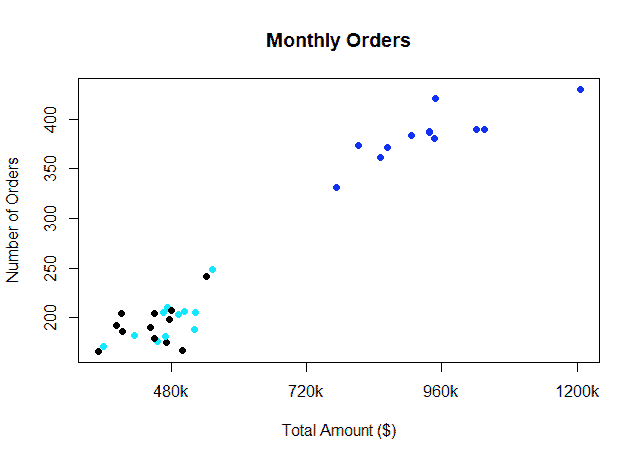

图 4-5 使用基本绘图功能的散点图

显然，前面的图表需要几个步骤来绘制，您还需要添加一个`legend()`调用来将颜色映射到销售人员。下面是一个简单的方法来绘制一个一次调用的曲线图。

`ggplot2`库提供了一种使用`qplot`函数创建类似图表的简单方法。以下脚本相当于前面的调用:

```
> library(ggplot2)  
>  qplot(x = TotalAmount, y = OrderCount, data = d,  
  color = SalesPerson, main = "Monthly Orders"); 
```

下图附有图例，有助于显示 Hudson 是表现最佳的销售人员:

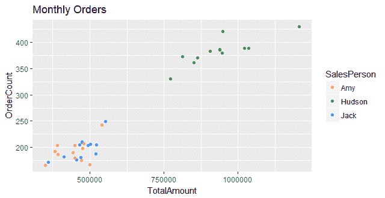

图 4-6 使用 ggplot 函数的散点图


# 柱状图

R 中的`hist()`函数绘制了一个直方图，表示数据集的频率分布。

下面的脚本绘制了 2015 年每月销售人员总数的频率分布:

```
> hist(orders$TotalAmount, main = "Monthly Orders",  
  xlab = "Total Amount ($)") 
```

使用下面的直方图，我们可以很容易地看到，最常见的每月总金额(每个销售人员)在每月 40 万美元到 50 万美元之间:

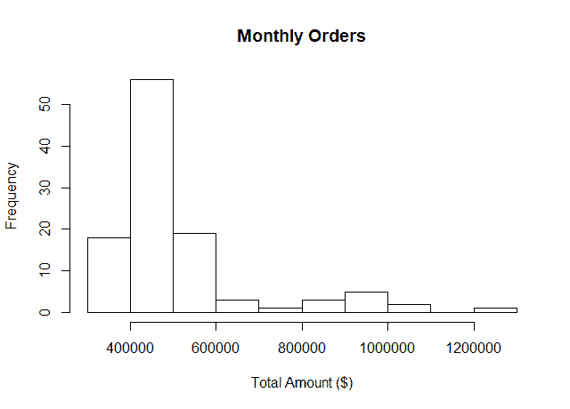

图 4-7 使用基本历史功能的直方图


# 箱线图

箱线图允许我们显示每个销售人员的异常值。这可以在 R 中使用`boxplot()`函数轻松实现。然而，`ggplot`功能非常易于使用和定制。这里有一个用`ggplot()`写箱线图的例子:

```
ggplot(orders,  
       aes( x = SalesPerson, 
            y = TotalAmount)) + 
      geom_boxplot(outlier.color = "red", outlier.size = 3) + 
      ggtitle(label = "Monthly Orders") + 
      xlab("Sales Person") + ylab("Total Amount ($)"); 
```

下图显示了每个销售人员在 2015 年的月订单分布情况:

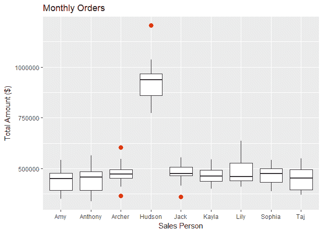

图 4-8 使用 ggplot 函数的箱线图


# 散点图

在 R 中，`scatterplot()`可以用来理解变量之间的关系/趋势。

以下是一个使用散点图来了解 Amy、Hudson 和 Jack 在 2015 年每月总额趋势的示例:

```
library(car) # For the scatterplot function 
library(RColorBrewer) # For choosing color palette more easily 

# Prepare d  
d$SalesPerson <- factor(d$SalesPerson); 
d$OrderMonth <- as.Date(d$OrderMonth); 

# Configure the palette to use 
my_colors <- brewer.pal(nlevels(as.factor(d$SalesPerson)), "Set2") 

# Map the monthly orders 
scatterplot(TotalAmount ~ OrderMonth | SalesPerson, data = d, 
    xlab = "Month", ylab = "Total Amount",  
    main = "Monthly Orders", col = my_colors, 
    cex = 1.5, lwd = 3) 
```

根据下面的图表，我们可以得出结论，Hudson 的每月总额略有下降，尽管总体上高于 Amy 和 Jack。我们还可以看到，艾米的每月总额下降得相当快:

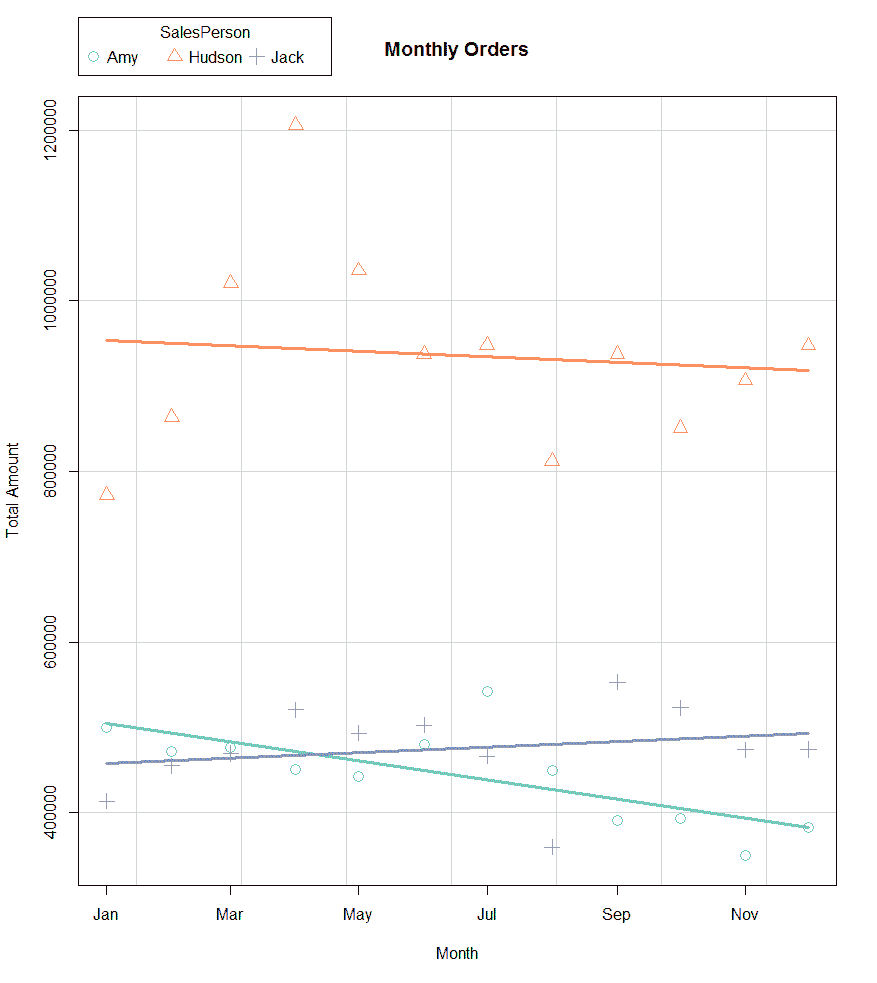

图 4-9 使用散点图功能的散点图

ggplot 函数也可用于创建散点图，并用平滑线覆盖散点图，显示销售人员的每月模式:

```
# Use the ggplot version 
ggplot(data = d, 
       aes(x = OrderMonth, y = TotalAmount, color = SalesPerson)) + 
    geom_point() + geom_smooth(method = "loess") + 
    scale_y_continuous(label = scales::dollar) + 
    scale_color_brewer(palette = "Set2") + 
    ggtitle(label = "Monthly Orders"); 
```

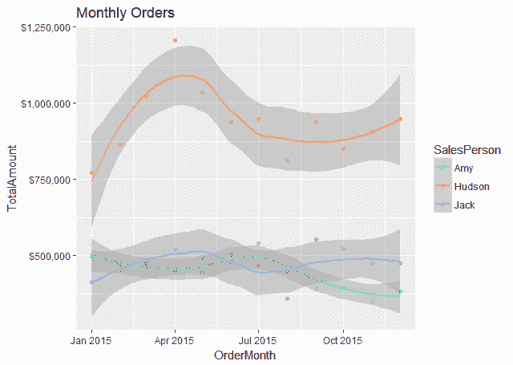

图 4-10 使用 ggplot 函数的散点图


# 树形图

预测建模的数据准备包括探索数据结构和可视化预测值的决策规则。这些值可以是分类的，也可以是连续的，分别表示为分类树和回归树。

下面是创建树形图的脚本示例，描述了预测给定销售人员和`OrderCount`的每月总金额的决策规则:

```
library(rpart) 
library(rpart) 
library(rattle) 
library(rpart.plot) 
fit <- rpart(TotalAmount ~ OrderCount + SalesPerson , data = d, method="anova"); 
fancyRpartPlot(fit, sub = "Monthly Sales Person") 

```

运行前面的脚本将给出一个整洁的树形图，节点上的第一行是月平均总金额(即， *619e+3* 在科学表示法中实际上是$619，000)，后面是 n 作为观察次数和构成节点的百分比:

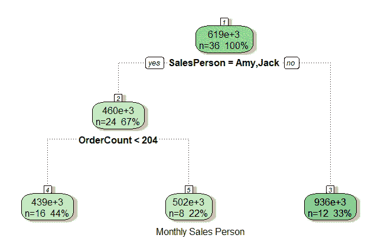

图 4-11 使用 rpart 函数的树形图


# 示例–T-SQL 中的 R 数据可视化

现在我们已经学习了一些使用 R 进行数据可视化的例子，让我们在 SQL Operations Studio 中将它们与 T-SQL 结合起来。请注意，SSMS 不会在 T-SQL 中呈现 R 生成的图像。

从[https://docs . Microsoft . com/en-us/SQL/SQL-Operations-Studio/download](https://docs.microsoft.com/en-us/sql/sql-operations-studio/download)下载 SQL Operations Studio。

执行以下步骤，在 T-SQL 中运行 R，以生成可以在 SQL Operations Studio 中可视化的图像。

1.  打开 SQL Operations Studio。
2.  在 SQL Operations Studio 中连接到服务器中的`WideWorldImporters`数据库。
3.  从示例中复制`Part 1`: T-SQL 中的数据可视化，因为我们想要重用`@SQLScript`变量定义:

```
-- Part 2: Prepare the R-script that will produce the visualization. 
DECLARE @RScript NVARCHAR(MAX) 
SET @RScript = N'library(ggplot2);  
    image_file = tempfile();  
    jpeg(filename = image_file, width=1000, height=400);  
    d <- InputDataSet[InputDataSet$SalesPerson %in% c("Amy", "Jack", "Hudson"), ]; 
    print(qplot(x = TotalAmount, y = OrderCount, data = d, color = SalesPerson, main = "Monthly Orders")); 
    dev.off() 
    OutputDataSet <- data.frame( 
            data=readBin(file(image_file,"rb"), 
            what=raw(),n=1e6));' 

-- Part 3: Execute R in TSQL to get the binary representation of the image. 
EXECUTE sp_execute_external_script 
     @language = N'R' 
    ,@script = @RScript 
    ,@input_data_1 = @SQLScript 
WITH RESULT SETS ((plot VARBINARY(MAX))); 
```

4.  在 SQL Operations Studio 中，执行前面的脚本，您将获得一个包含名为`plot`的列的结果集。
5.  点击图表查看器，然后从图表类型中选择图像:

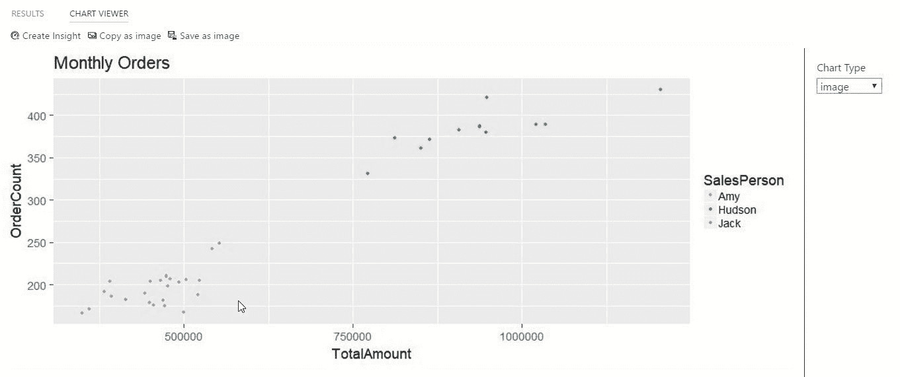

图 4-12 SQL Operations Studio 中 R 的数据可视化输出


# 在报告和可视化中集成 R 代码

在本节中，我们将深入探讨微软 BI 堆栈中提供的常见报告和可视化工具，如**SQL Server Reporting Services**(**SSRS**)、Power BI 和移动报告。

将 R graphics 与 SQL Server 集成有三个主要的用例。

1.  获取表示数据/统计分析、训练模型或预测模型的数据集输出:

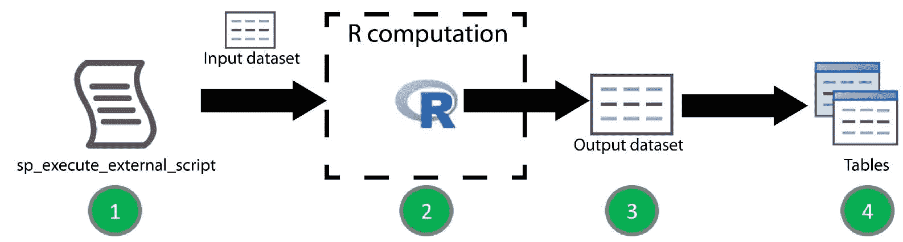

图 4-13 用于 R 中数据分析的 SQL Server 机器学习服务过程

执行`sp_execute_external_script`来运行 R 以产生数据集输出，如(1) + (2) + (3)所示。数据集输出(3)可以来自数据/统计分析、训练模型、预测输出等等。在 SQL Server 中，我们可以有选择地进一步处理输出(4)，例如，将它保存到一个表中，或者将它传递给另一个存储过程。

2.  获取包含 r 的图形输出的 varbinary 表示的数据集输出。

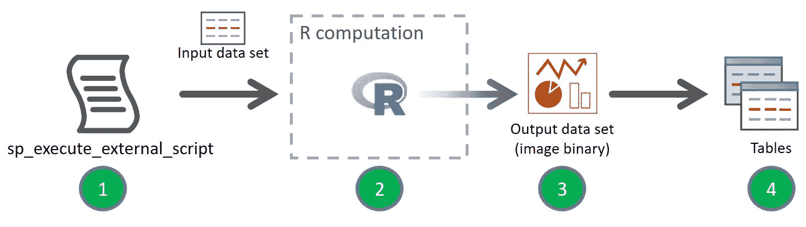

图 4-14 数据可视化的 SQL Server R 服务过程

执行`sp_execute_external_script`运行 R 以产生数据集输出，如(1) + (2) + (3)所示。在这种情况下，数据集输出(3)将具有图形输出的 varbinary (max)表示。在 SQL Server 中，我们可以进一步插入输出(4)，例如，将图像作为 varbinary (max)保存到表中。

3.  将 R 图形输出保存到文件中，并将文件路径存储在数据集输出中。当首选脱机渲染时，这是理想的:


图 4-17 将数据可视化到文件的 SQL Server 机器学习服务过程

执行`sp_execute_external_script`运行 R 以产生数据集输出，如(1) + (2) + (3)所示。在这种情况下，数据集输出(3)包含图形输出需要驻留的文件路径。在 SQL Server 中，我们可以选择进一步处理输出(4)。您还可以为该解决方案集成 Filestream，如*tomakatrun 的*博客中所述，此处:
[https://tomaztsql . WordPress . com/2016/09/25/file table-and-storing-graphs-from-Microsoft-r-server/](https://tomaztsql.wordpress.com/2016/09/25/filetable-and-storing-graphs-from-microsoft-r-server/)


# 将 R 纳入 SSRS 报告

SSRS 报表可以从查询或存储过程中读取数据集。从本质上说，这为我们提供了足够的灵活性，可以选择如何将 R 输出合并为 SSRS 的临时或操作报告的一部分。

现在，让我们来看几个在 SSRS 报告中整合 R 的例子。假设一名数据分析师想要进行快速统计分析，以了解销售人员和总金额之间的关系强度。使用 SSRS 很容易做到这一点。这里有一个例子来说明如何实现这一点。

1.  使用 **Visual Studio 2017** 或**SQL Server Management Studio**，连接到`WideWorldImporters`。
2.  创建一个名为`dbo.usp_AnalyzeOrdersUsingAnova`的新存储过程:

```
CREATE PROCEDURE dbo.usp_AnalyzeOrdersUsingAnova 
( 
  @StartDate DATE = '20150101', 
  @EndDate DATE = '20151231' 
) 
/********************************************************** 
 * Purpose: Determine if Monthly Orders (Total Amount in $)  
 *      has no dependency on Sales Person. 
 * Parameters:   
 *  @StartDate  - The start date of the Orders table 
 *  @EndDate  - The end date of Orders table 
 * Example on how to execute: 
 *  EXEC dbo.usp_AnalyzeOrdersUsingAnova 
 *     @StartDate = '20150101' 
 *    ,@EndDate = '20151231' 
 *****************************************************************/ 
AS 
BEGIN  

  DECLARE @input_query NVARCHAR(MAX);  
  DECLARE @RAOV NVARCHAR(MAX); 

  -- The SQL query representing Input data set. 
  -- Get the monthly orders from each Sales between  
  -- specific date and time. 
  SET @input_query = N' 
  SELECT 
    DATEFROMPARTS(YEAR(o.[OrderDate]),  
       MONTH(o.[OrderDate]), 1) AS OrderMonth, 
    sp.[PreferredName] AS SalesPerson, 
    COUNT(DISTINCT o.[OrderID]) AS OrderCount, 
    SUM(ol.[Quantity] * ol.[UnitPrice]) AS TotalAmount 
  FROM [Sales].[Orders] o 
    INNER JOIN[Sales] .[OrderLines] ol 
      ON ol.[OrderID] = o.[OrderID] 
    INNER JOIN[Application] .[People] sp 
      ON sp.[PersonID] = o.[SalespersonPersonID] 
  WHERE sp.[ValidTo] >= GETDATE() 
    AND o.[OrderDate] BETWEEN ''' +  
CAST(@StartDate AS VARCHAR(30)) + ''' AND ''' + 
CAST(@EndDate AS VARCHAR(30)) + ''' 
  GROUP BY 
    DATEFROMPARTS(YEAR(o.[OrderDate]),  
      MONTH(o.[OrderDate]), 1), 
    sp.[PreferredName];' 

  -- The R code that tests if Total Amount has no strong  
  -- dependency to Sales Person 
  -- Note: Null Hypothesis (H0) in this case is Total Amount  
  --    has no strong dependency to Sales Person. 
  --    The closer p-value to 0 we can reject the H0\. 
  SET @RAOV = N'a = aov(TotalAmount ~ SalesPerson, 
 data = InputDataSet); 
    m <- summary(a); 
    library(plyr); 
    x <- data.frame(RowID = 1:nrow(m[[1]]),  
      Attribute = rownames(m[[1]])); 
    OutputDataSet <- cbind(x, ldply(m, data.frame));' 

  -- Using R Services produce the output as a table 
  EXEC sp_execute_external_script @language = N'R' 
    ,@script = @RAOV  
    ,@input_data_1 = @input_query 
    ,@input_data_1_name = N'InputDataSet' 
    ,@output_data_1_name = N'OutputDataSet'  
    WITH RESULT SETS (([RowID]  INT, 
          [Attribute]  NVARCHAR(50),  
          [DF]    NUMERIC(20,10), 
          [SumSq]  NUMERIC(20,10), 
          [MeanSq]  NUMERIC(20,10), 
          [FValue]  FLOAT, 
          [Pr(>F)]  FLOAT 
          )); 

END 
```

3.  使用 Visual Studio 2017 或报表生成器创建新报表。
4.  通过按下 *Ctrl* + *S* 将该文件保存为`SQL+R_Chapter04_SSRS_Anova_01.rdl`，或者转到文件菜单点击保存。
5.  创建一个新的数据源，并将这个连接到服务器上的`WideWorldImporters`数据库的`WideWorldImporters`保存下来。
6.  然后使用以下查询定义创建一个新的数据集，然后单击刷新字段:

```
EXEC dbo.usp_AnalyzeOrdersUsingAnova 
```

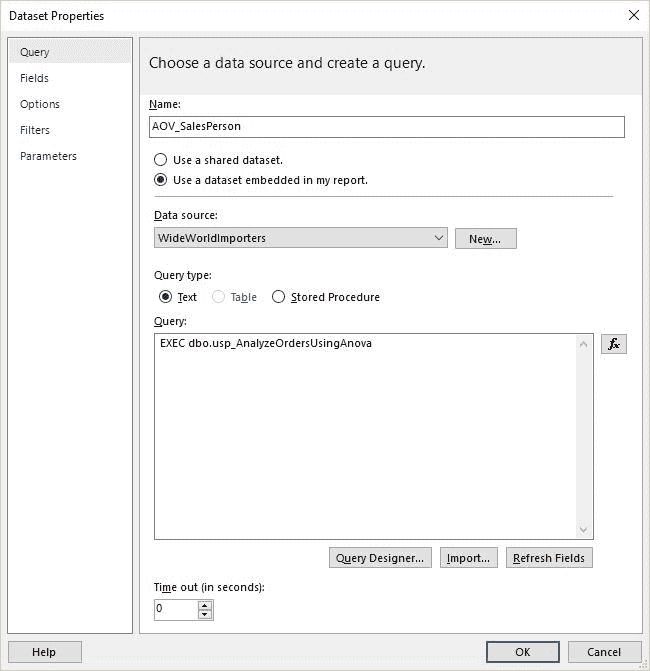

图 4-16 指定要执行的存储过程

7.  创建一个 **Tablix** 来代表`AOV_SalesPerson`列:

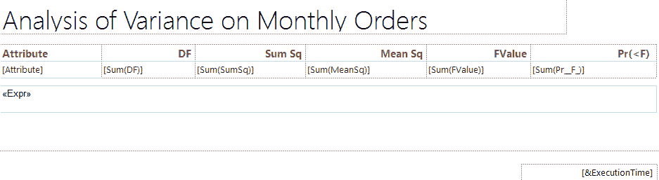

图 4-17 添加包含 AOV _ 销售人员中所有列的 Tablix

8.  可选地添加另一个 **Tablix** ，其中它的`DataSetName`映射到`AOV_SalesPerson`。在 **Tablix** 主体的第一个单元格上，用以下表达式描述如何解释分析:

```
="Since the p-value of " & Fields!Pr__F_.Value & " is " & IIf(Fields!Pr__F_.Value < 0.05, "less", "greater") & " than the .05 significance level, we " & IIf(Fields!Pr__F_.Value < 0.05, "reject", "accept") & " the null hypothesis that the mean of monthly Total Amount of " & Fields!Attribute.Value & " are all equal. This means that there is " &  IIf(Fields!Pr__F_.Value < 0.05, "", "no") & " dependency between " & First(Fields!Attribute.Value, "AOV_SalesPerson") & " and Monthly Orders Total Amount"
```

9.  单击运行查看报告预览:

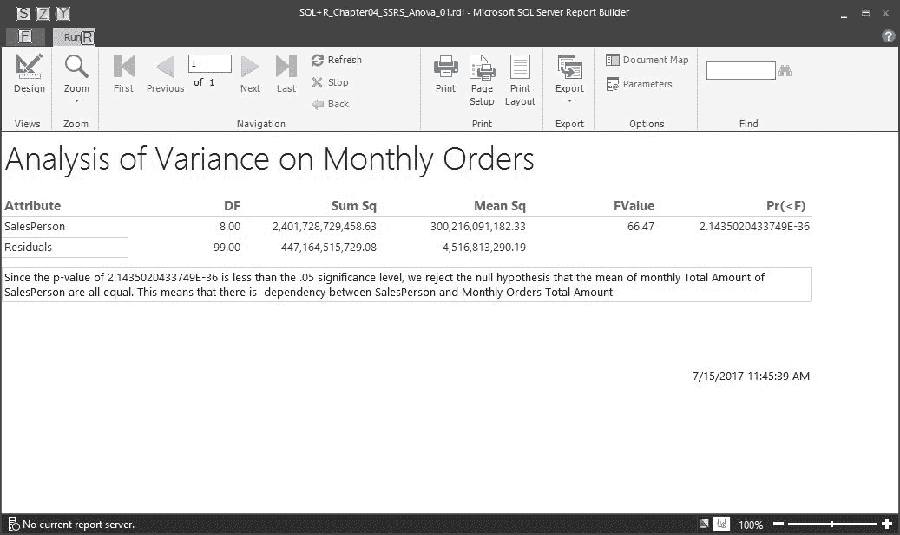

图 4-18 预览报告

使用 R 的另一个常见场景是绘制数据可视化。在以下示例中，我们将比较销售人员在 2015 年的表现。从这里，我们可以看到销售人员每月订单的趋势以及他们在 12 个月中的表现。

1.  使用 **Visual Studio 2017** 或**SQL Server Management Studio**，连接到`WideWorldImporters`。
2.  创建一个名为`dbo.usp_CreateMonthlySalesPlot`的新存储过程:

```
 CREATE PROCEDURE dbo.usp_CreateMonthlySalesPlot 
( 
  @StartDate DATE = '20150101', 
  @EndDate DATE = '20151231' 
) 
/********************************************************** 
 * Purpose: Determine if Monthly Orders (Total Amount in $)  
 *      has no dependency on Sales Person. 
 * Parameter:   
 *  @StartDate  - Observation start date in the Orders table 
 *  @EndDate  - Observation end date in the Orders table 
 * Example on how to execute: 
 *  EXEC dbo.usp_AnalyzeOrdersUsingAnova 
 *     @StartDate = '20150101' 
 *    ,@EndDate = '20151231' 
 **********************************************************/ 
AS 
BEGIN  

  DECLARE @input_query NVARCHAR(MAX);  
  DECLARE @RPlot NVARCHAR(MAX); 

  -- The SQL query representing Input data set. 
  -- Get the monthly orders from each Sales between  
    specfic date and time. 
  SET @input_query = N' 
  SELECT 
    DATEFROMPARTS(YEAR(o.[OrderDate]),  
      MONTH(o.[OrderDate]), 1) AS OrderMonth, 
    sp.[PreferredName] AS SalesPerson, 
    COUNT(DISTINCT o.[OrderID]) AS OrderCount, 
    SUM(ol.[Quantity] * ol.[UnitPrice]) AS TotalAmount 
  FROM [Sales].[Orders] o 
    INNER JOIN [Sales] .[OrderLines] ol 
      ON ol.[OrderID] = o.[OrderID] 
    INNER JOIN [Application] .[People] sp 
      ON sp.[PersonID] = o.[SalespersonPersonID] 
  WHERE sp.[ValidTo] >= GETDATE() 
    AND o.[OrderDate] BETWEEN ''' +  
      CAST(@StartDate AS VARCHAR(30)) +  
      ''' AND ''' +  
      CAST(@EndDate AS VARCHAR(30)) + ''' 
  GROUP BY 
    DATEFROMPARTS(YEAR(o.[OrderDate]), MONTH(o.[OrderDate]), 1), 
    sp.[PreferredName];' 

  -- The R code that produces the plot. 
  SET @RPlot = N'library(ggplot2);  
  image_file = tempfile();  
  jpeg(filename = image_file, width=600, height=800);  
  a <- qplot(y = TotalAmount, x = OrderMonth,  
        data = InputDataSet, 
        color = SalesPerson,  
        facets = ~SalesPerson, 
        main = "Monthly Orders"); 
  a + scale_x_date(date_labels = "%b");     
  plot(a); 
  dev.off();  
  OutputDataSet <-  data.frame( 
    data=readBin(file(image_file,"rb"), 
    what=raw(),n=1e6));   
' 
  EXEC sp_execute_external_script @language = N'R' 
    ,@script = @RPlot  
    ,@input_data_1 = @input_query 
    ,@input_data_1_name = N'InputDataSet' 
    ,@output_data_1_name = N'OutputDataSet'  
    WITH RESULT SETS (( [plot] VARBINARY(MAX))); 

END 
```

3.  在 Report Builder 中，打开之前的`SQL+R_Chapter04_SSRS_Anova_01.rdl`，使用以下查询定义创建一个新的数据集，然后单击 Refresh Fields。创建的字段称为`Plot`，应该有一行:

```
EXEC dbo.usp_CreateMonthlySalesPlot
```

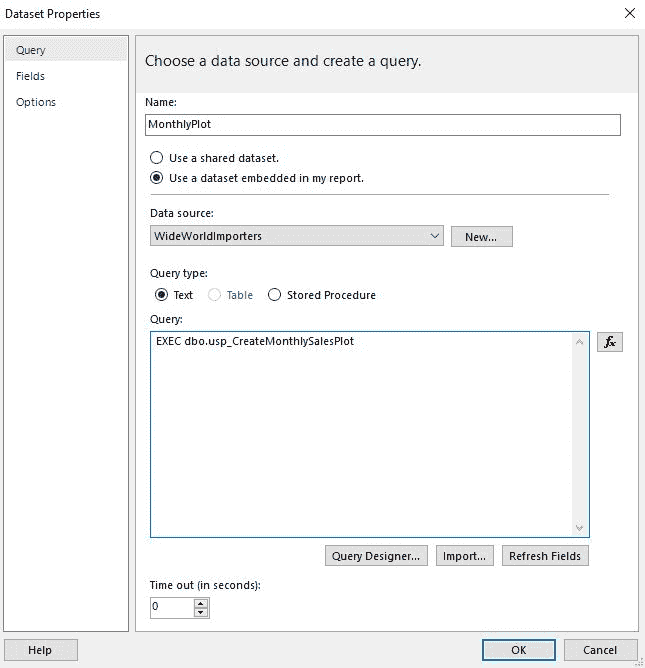

图 4-19 指定了要执行的存储过程

4.  插入具有以下常规属性的新图像:

选择图像源:数据库

使用该字段:`=First(Fields!plot.Value, "MonthlyPlot")`

使用此 MIME 类型:`image/jpeg`

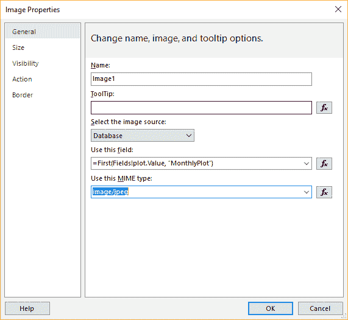

图 4-20 配置图像以渲染绘图

5.  或者，转到左侧窗格上的“大小”项目，将显示更改为原始大小。

6.  单击运行查看报告预览:

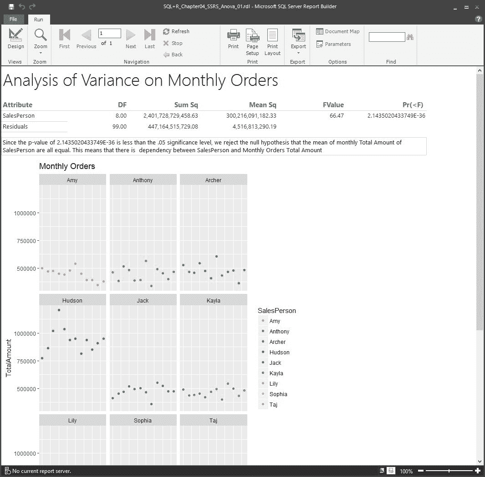

图 4-21 预览带有绘图的报告

这个 RDL 文件现在可以发布到一个 **SSRS 报告服务器**。

有关 SSRS 的更多信息，下面的 Microsoft Docs 网站非常有用:

[https://docs . Microsoft . com/SQL/reporting-services/create-deploy-and-manage-mobile-and-paginated-reports](https://docs.microsoft.com/sql/reporting-services/create-deploy-and-manage-mobile-and-paginated-reports)


# 在功率 BI 中集成 R

Power BI 是可视化数据的强大工具。与 R 一起，Power BI 可以呈现具有不折不扣的动态交互性的美丽图像。在本例中，您将了解如何创建类似于上一节我们在 SSRS 创建的数据可视化:

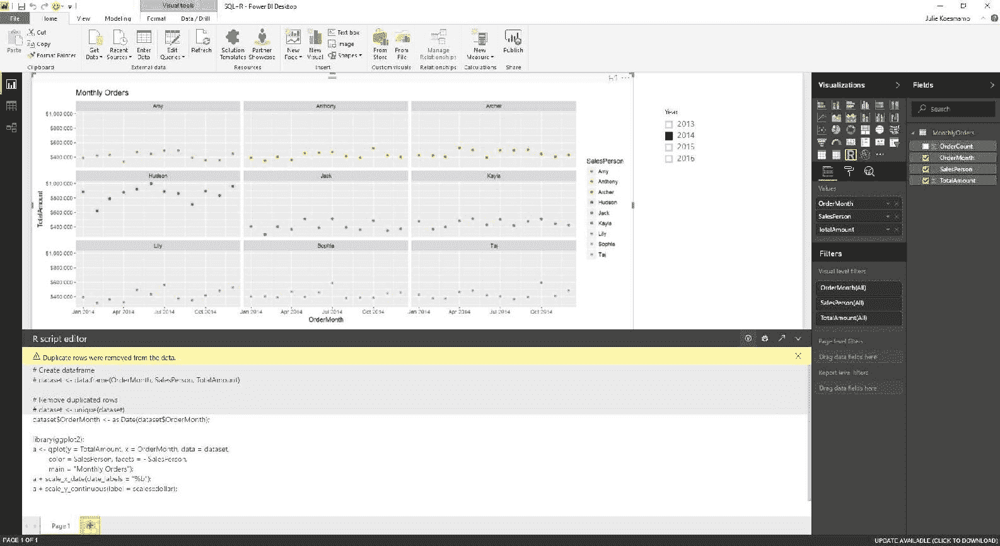

图 4-22 使用 R 脚本编辑器的 Power BI 可视化

为简单起见，我们将使用 Power BI desktop，但您也可以从在线[PowerBI.com](https://powerbi.microsoft.com/en-us/)版本创建一个:

1.  启动 **Power BI Desktop** 并创建一个新文件。
2.  从主页菜单中，单击获取数据| SQL Server。
3.  连接到拥有`WideWorldImporters`数据库的 SQL Server 实例。
4.  然后单击高级选项，在 SQL 语句字段中提供以下查询:

```
SELECT 
    DATEFROMPARTS(YEAR(o.[OrderDate]), 
    MONTH(o.[OrderDate]), 1) AS OrderMonth, 
    sp.[PreferredName] AS SalesPerson, 
    COUNT(DISTINCT o.[OrderID]) AS OrderCount, 
    SUM(ol.[Quantity] * ol.[UnitPrice]) AS TotalAmount 
FROM [Sales].[Orders] o 
    INNER JOIN[Sales] .[OrderLines] ol 
        ON ol.[OrderID] = o.[OrderID] 
    INNER JOIN[Application] .[People] sp 
        ON sp.[PersonID] = o.[SalespersonPersonID] 
WHERE sp.[ValidTo] >= GETDATE() 
GROUP BY 
    DATEFROMPARTS(YEAR(o.[OrderDate]), MONTH(o.[OrderDate]), 1), 
    sp.[PreferredName]; 
```

该对话框现在应该如下所示:

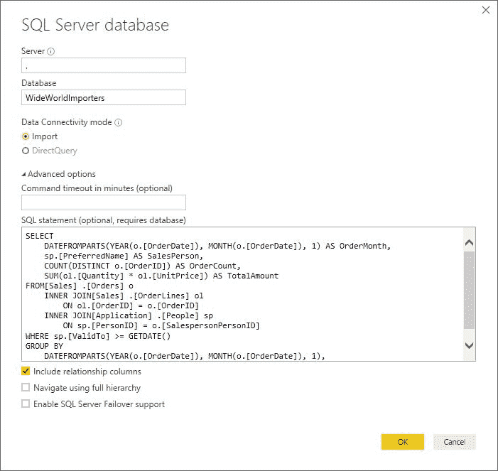

图 4-23 SQL Server 数据库数据源详细信息

5.  单击“确定”查看查询预览。
6.  然后在预览窗口中单击加载:

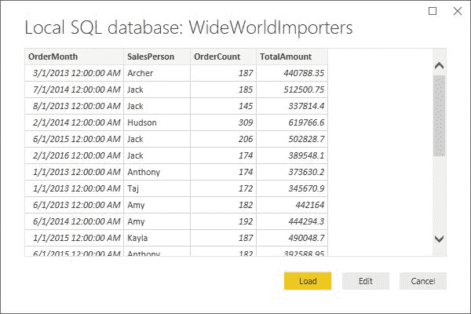

图 4-24 查询预览

7.  在可视化窗格中，单击 R Script 图标。
8.  将字段窗格中的`OrderMonth`、`SalesPerson`和`TotalAmount`列拖放到值框中。

请注意，您的表可能被命名为`Query1`，您可以将其重命名为更有意义的名称，如 MonthlyOrders，如下所示:

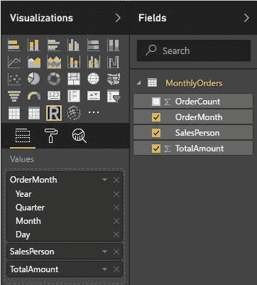

图 4-25 选择字段作为 R 的输入

9.  使用 OrderMonth，而不是默认的日期层次结构，从值字段的下拉列表中选择 OrderMonth:

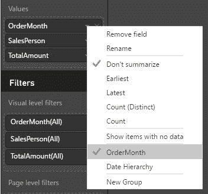

图 4-26 选择订单月份而不是数据层次结构来显示

10.  确保 R 脚本图形框仍处于焦点上。或者，您可以调整它的大小，使其更宽或更高:

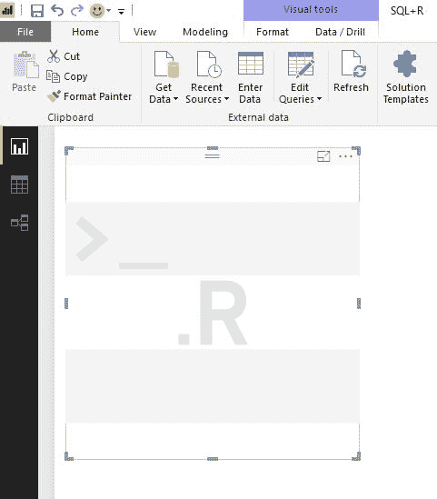

图 4-27r Power BI 桌面中的可视化框

11.  然后，在 Power BI 屏幕下半部的 **R 脚本编辑器**中，输入以下 R 代码:

```
dataset$OrderMonth <- as.Date(dataset$OrderMonth); 

library(ggplot2); 
a <- qplot(y = TotalAmount, x = OrderMonth, data = dataset, 
        color = SalesPerson, facets = ~SalesPerson, 
        main = "Monthly Orders"); 
a + scale_x_date(date_labels = "%b"); 
a + scale_y_continuous(label = scales::dollar);
```

12.  单击位于 R 脚本编辑器栏右侧的 Run Script 按钮。
13.  添加切片器，然后拖放 OrderMonth。
14.  通过在**值**字段中点击 OrderMonth 列表中的 X，取消选择除 Year 之外的所有 OrderMonth 层次结构:

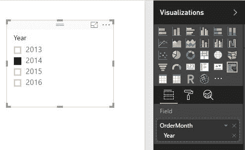

图 4-28 年度切片器

15.  现在，您的 Power BI 报告应该如下所示:

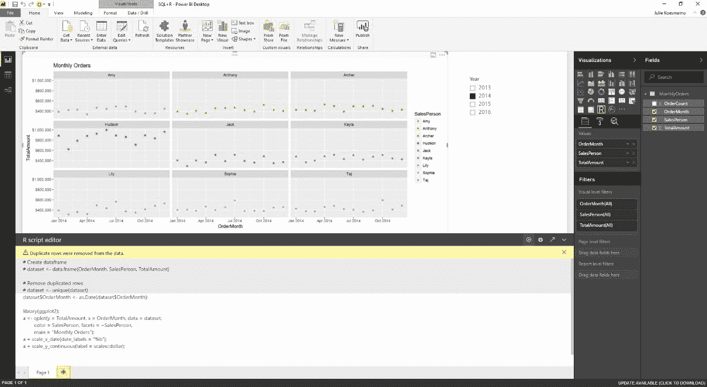

图 4-29 功率 BI 报告


# 摘要

在本章中，您已经学习了数据准备在预测建模中的重要性，预测建模包括数据探索和数据可视化练习。r 有许多对数据管理有用的开源包，例如`dplyr`、`reshape`等等。挑战在于在 SQL Server 和 r 中实现数据管理活动之间的平衡，SQL Server 机器学习服务的优点在于它允许与 SQL Server Reporting Services 轻松集成。此外，Power BI 还支持 R 可视化的交互式数据探索。在下一章，你将会学到更多关于可移植的、可伸缩的和可分发的 R 函数的`RevoScaleR`库。