# 九、面向数据库管理员的 R 机器学习服务

r 集成(以及 SQL Server 2017 中的 Python 集成)提供了广泛的可能性。并且目标人群在使用 R 服务的人群(工作角色或部门)方面刚刚有所增加。DBA(以及系统管理员)肯定会从中受益匪浅。R 和统计数据不仅给他们提供了额外的动力，让他们发现并获得对捕获数据的见解，还可能帮助他们找到一些以前可能错过的隐藏的金块。不同语言的混合——我不仅仅指 R，还包括其他语言——肯定会带来跟踪、捕获和分析捕获数据的新能力。

有一点很清楚，如果你有 R(任何 Python)那么接近数据库，几个人就可以从监控任务切换到预测任务。这实际上意味着，人们现在可以诊断和预测可能发生的事情，而不是在事情已经发生时采取行动。我并不是说这是一项简单的任务，因为我们都知道复杂性，例如，一个查询突然运行缓慢，可能有一个或多个隐藏的原因，可能不会立即看到，R in-database 肯定会帮助几乎实时地找到这个隐藏的原因。与 SSAS 的数据挖掘相反，我个人认为它仍然是一个非常强大的好工具，与通过 R Engine 发送和分析数据相比，可能会有更多的延迟。

本章将介绍如何帮助 DBA(或处理类似问题的其他角色)获得 R:

*   收集与数据库管理员相关的数据
*   探索和分析数据
*   使用 R 服务创建预测
*   通过预测改进监控


# 收集相关数据

收集数据——尽管可能很简单——是一项需要精心设计的任务。这有几个原因。首先也是最重要的是，我们希望以对生产环境影响最小或为零的方式收集数据。这意味着收集和存储数据的过程不应干扰任何正在进行的过程。第二重要的是存储。您希望在何处以及如何存储数据以及存储数据的保留策略？起初，这可能看起来是一个非常微不足道的情况，但随着时间的推移，存储本身将发挥重要作用。第三点也是最重要的一点是你想收集哪些数据。当然，我们都希望拥有智能数据，也就是说，拥有与解决或改进我们的业务流程相关的所有数据。但在现实中，收集智能既不是那么困难，也不是那么容易。首先，必须了解数据库功能的概念，此外，还必须了解如何获取相关指标以及这一特定功能将如何工作。

如果您知道在哪里以及如何寻找性能改进，让我们看看在哪里以及如何可以看到性能改进。

例如，延迟持久性是自 SQL Server 2014 以来就存在于 SQL Server 中的一项功能，但在某些情况下，它有助于提高性能以降低持久性(持久性是 ACID 首字母缩略词的一部分-原子、一致、隔离和持久性-并防止在失败或系统重启的情况下，提交的数据不被保存或以不正确的状态保存)。**预写日志** ( **WAL** )是 SQL Server 使用的一个系统，这意味着所有的更改都先写入日志，然后才允许提交到数据库表。

对于这个快速演示，我们将创建一个空数据库，并使用`NO_WAIT`将`DELAYED_DURABILITY`设置为 allowed。这个测试的另一个重要步骤是将数据库的备份设置为`NUL`，类似于命令`with truncate_only`。此语句丢弃所有非活动日志(当数据库处于完整或大容量日志恢复模式时；对于简单恢复模式，这是站不住脚的)，并且从数据库的完整备份完成时开始，任何非活动的日志记录都将被丢弃(删除)。这是可以模拟的。当检查点运行时，备份日志的尝试将导致错误消息。换句话说，数据库可以在简单恢复模式下运行。从本质上来说，`NUL`命令只是存储并丢弃日志:

```
USE [master];
GO
CREATE DATABASE [DelayedDurability];
GO

ALTER DATABASE [DelayedDurability] SET DELAYED_DURABILITY = ALLOWED    
WITH NO_WAIT;
GO
BACKUP DATABASE [DelayedDurability] TO DISK = N'nul'
GO  
```

我将创建一个样本表来进行插入:

```
USE [DelayedDurability];
GO

DROP TABLE IF EXISTS TestDDTable;
GO

CREATE TABLE TestDDTable
(ID INT IDENTITY(1,1) PRIMARY KEY
,R_num INT
,Class CHAR(10) 
,InsertTime DATETIME DEFAULT(GETDATE())
);
GO  
```

创建了一个表之后，我们现在可以测试两种类型的插入，有和没有延迟持久性:

```
EXECUTE sys.sp_flush_log;
GO

DECLARE @count INT = 0
DECLARE @start1 DATETIME = GETDATE()
WHILE (@count <= 250000)
          BEGIN
                BEGIN TRAN
                      INSERT INTO TestDDTable(R_num, class) VALUES(@count, 'WITHOUT_DD')
                      SET @count += 1
                COMMIT
          END

SET @count = 0
DECLARE @start2 DATETIME = GETDATE()
WHILE (@count <= 250000)
          BEGIN
                BEGIN TRAN
                      INSERT INTO TestDDTable(R_num, class) VALUES(@count, 'WITH_DD')
                      SET @count += 1
                COMMIT WITH (DELAYED_DURABILITY = ON)
          END

SELECT 
DATEDIFF(SECOND, @start1, GETDATE()) AS With_DD_OFF
,DATEDIFF(SECOND, @start2, GETDATE()) AS With_DD_ON
```

结果是显而易见的:当延迟持久性设置为 on 时，当进行如此多的插入时，可以提高性能:

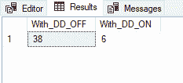

我还可以使用查询压力来模拟几个线程，每个线程执行相同数量的插入:

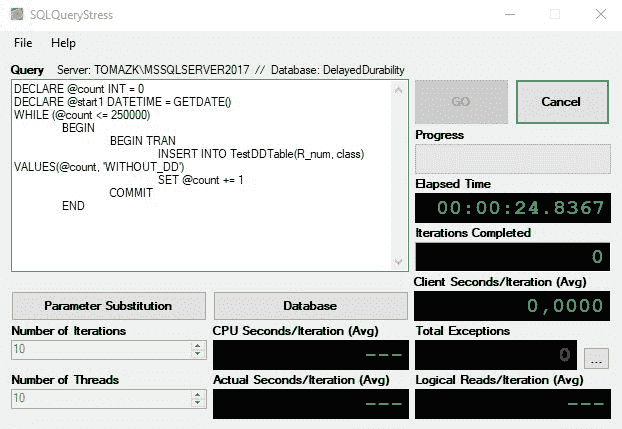

对于如此高压力的工具测试，问题是，我们如何监控和跟踪延迟耐久性的行为？可以使用性能监视器测试性能:


或者，您可以使用活动监视器测试性能:

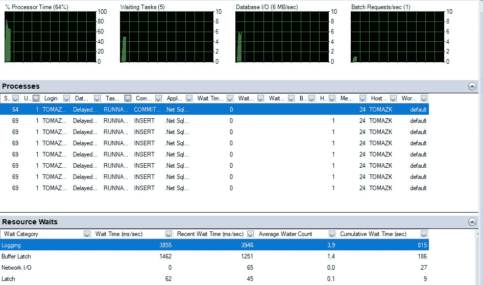

但是很快您就会意识到，要么您需要存储这些信息以供以后分析，要么您需要获得一些额外的知识，以了解在这种情况下哪些性能指针或扩展事件值得监控。

因此，在这种情况下，您需要在登录时检查等待资源:

```
SELECT * FROM sys.dm_os_wait_stats
WHERE wait_type IN ('WRITELOG');
GO 
```

您还需要添加一些机制来捕获表中的等待统计数据，以便以后进行分析，或者捕获性能监视器，或者使用 profiler、XE 等等。在运行时查询数据和捕获统计数据是相当繁琐的工作；想象一下合并来自`sys.dm_os_wait_stats`的统计数据，并将它们与`sys.dm_io_virtual_file_stats`组合。总而言之，您试图收集的数据越多，查询这些统计数据就可能变得越复杂。

使用性能监视器捕获前面的两个查询，图片如下图所示:


上面的屏幕截图在左侧(1)显示了延迟持久性是如何工作的，以及日志刷新是如何在一个连续的时间段内发生的。与右侧(2)相比，我们可以看到延迟持久性是如何关闭的，日志刷新是如何不活动的。

从性能监视器中提取原始数据可能不是正确的方法，但是通过扩展事件存储同一组数据对于系统和用户来说都要轻得多，以便于以后的分析。

您可以快速轻松地设置分析所需的扩展事件。但是，与其选择太多的事件，不如关注那些真正需要的事件，因为日志文件可能会很快变大:

```
-- creating extended event

IF EXISTS(SELECT * FROM sys.server_event_sessions WHERE name='DelayDurab_Log_flush') 
DROP EVENT session DelayDurab_Log_flush ON SERVER; 

-- Get DelayedDurability database ID
SELECT db_id()

CREATE EVENT SESSION DelayDurab_Log_flush ON SERVER
ADD EVENT sqlserver.log_flush_start
 (WHERE  (database_id=40)),
ADD EVENT sqlserver.databases_log_flush 
 (WHERE (database_id =40)),
ADD EVENT sqlserver.transaction_log
 (WHERE (database_id =40))
-- maybe add batchrequests/second

 ADD TARGET package0.event_file
(
 SET filename     ='C:\CH09\MonitorDelayDurability.xel'
 ,metadatafile ='C:\CH09\MonitorDelayDurability.xem'
)
WITH (MAX_MEMORY=4096KB
 ,EVENT_RETENTION_MODE=ALLOW_SINGLE_EVENT_LOSS
 ,MAX_DISPATCH_LATENCY=30 SECONDS
 ,MEMORY_PARTITION_MODE=NONE
 ,STARTUP_STATE=ON);
GO  
```

启动事件后，通过分解 XML 结构来读取文件的内容:

```
SELECT 
      CAST(event_data AS XML) AS event_data
FROM sys.fn_xe_file_target_read_file('C:\CH09\MonitorDelayDurability*.xel', 'C:\CH09\MonitorDelayDurability*.xem', null, null) 
```

此外，从 XML 中获取信息是正确处理扩展事件的另一项重要任务:

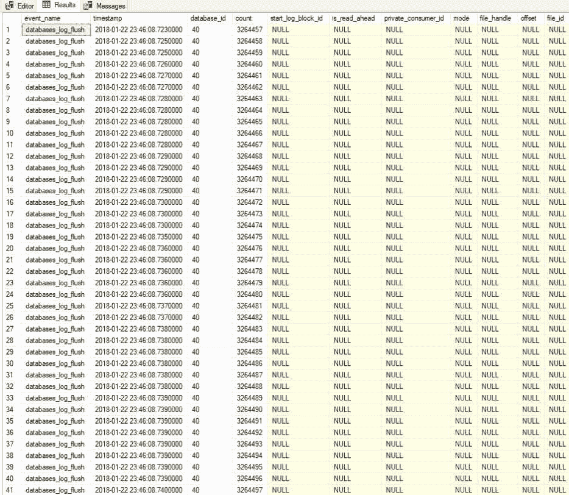

回到起点，为数据库管理员收集数据并进行进一步分析是最重要的。从这个例子中还可以看出一点:如果我们还增加了日志文件的增长，那么其中一个日志需要通过添加新的 VLF 文件来额外增长。与关闭延迟持久性的事务相比，添加延迟持久性可以提供更快的插入速度。有时添加新的`XE`或度量会极大地增加收集数据的日志文件。使用统计分析，我们可以优化度量选择，或者稍后发现它们给了我们额外的洞察信息。就工作量和收集的不同数据而言，致力于探索并在以后分析数据会给你带来巨大的回报。


# 探索和分析数据

同样，使用事件特性收集数据可以为您提供一种获取大量系统信息数据的丰富方式。通过下面的演示，我们将从上一个示例中了解如何将服务器的指标用于高级统计分析，以及如何帮助减少不同信息的数量，并确定相关指标。将创建特定的数据库和阶段表:

```
CREATE DATABASE ServerInfo;
GO

USE [ServerInfo]
GO

DROP TABLE IF EXISTS server_info;
GO

CREATE TABLE [dbo].[server_info]([XE01] [tinyint] NULL, [XE02] [tinyint] NULL,
 [XE03] [tinyint] NULL, [XE04] [tinyint] NULL, [XE05] [tinyint] NULL,
 [XE06] [tinyint] NULL, [XE07] [tinyint] NULL, [XE08] [tinyint] NULL,
      [XE09] [tinyint] NULL, [XE10] [tinyint] NULL, [XE11] [tinyint] NULL,
 [XE12] [tinyint] NULL, [XE13] [tinyint] NULL, [XE14] [tinyint] NULL,
 [XE15] [tinyint] NULL, [XE16] [tinyint] NULL, [XE17] [tinyint] NULL,
      [XE18] [tinyint] NULL, [XE19] [tinyint] NULL, [XE20] [tinyint] NULL,
 [XE21] [tinyint] NULL, [XE22] [tinyint] NULL, [XE23] [tinyint] NULL,
 [XE24] [tinyint] NULL, [XE25] [tinyint] NULL, [XE26] [tinyint] NULL,
 [XE27] [tinyint] NULL, [XE28] [tinyint] NULL, [XE29] [tinyint] NULL,
 [XE30] [tinyint] NULL, [XE31] [tinyint] NULL, [XE32] [tinyint] NULL
) ON [PRIMARY];
GO  
```

然后，导入可以在附带的代码文件中找到的度量。为了了解服务器及其环境设置，有来自 32 个不同扩展事件的 433 个测量点。

初始加载后，该表将填充不同扩展事件的度量值，这些度量值也已经过离散化和清理，以便进行进一步的数据分析:

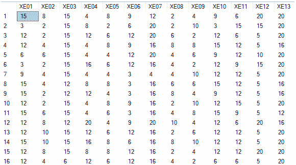

`boxplot`功能使用户能够探索每个测量值的分布，并找到潜在的异常值。仅使用 R 代码浏览数据:

```
dbConn <- odbcDriverConnect('driver={SQL Server};server=TOMAZK\\MSSQLSERVER2017;database=ServerInfo;trusted_connection=true') 
server.feature <- sqlQuery(dbConn, 'SELECT * FROM Server_info') 
close(dbConn) 
boxplot(server.feature) 
```

下图给出了一个快速概览:

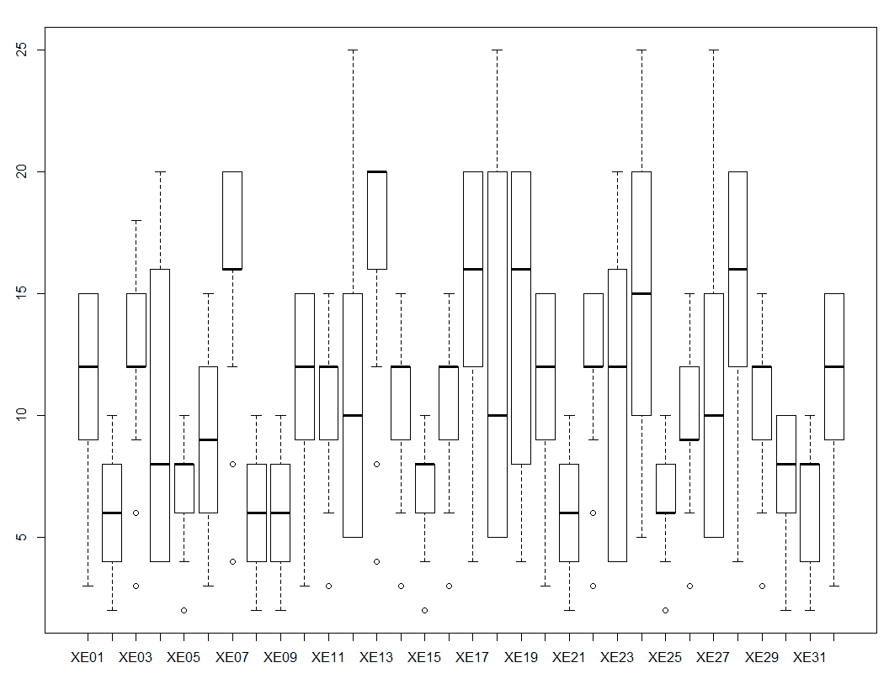

箱线图显示有四个事件，其值大大超过平均值和第三个四分位数。清除这些异常值将使数据更容易读取，并且不会导致异常分布和扭曲的结果。请注意，有一些处理异常值和搜索这些值的特殊分析。在本演示中，我们将把这些值重新编码为 N/A。

清理后，添加摘要统计信息和关联是查看所有事件如何相互关联的一种相关方式:

```
# replace value 25 with N/A
server.feature$XE12[server.feature$XE12=="25"]<-NA
server.feature$XE18[server.feature$XE18=="25"]<-NA
server.feature$XE24[server.feature$XE24=="25"]<-NA
server.feature$XE27[server.feature$XE27=="25"]<-NA

cor.plot(server.feature,numbers=TRUE,main="Server Features")  
```

服务器功能的关联矩阵是一种很好的方式来表示哪些事件相关，哪些不相关，以及如何相关:

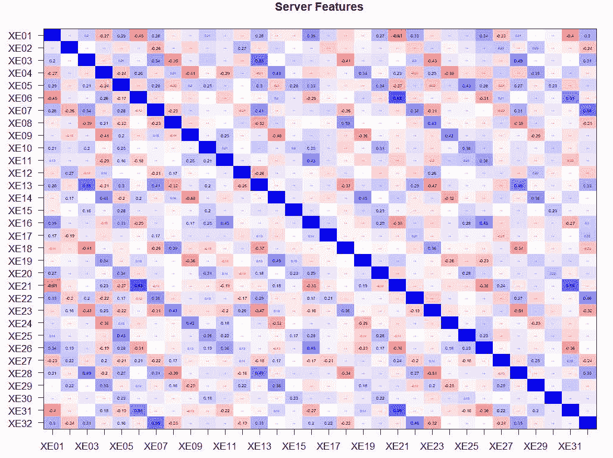

更进一步，让我们减少这些扩展的事件度量，因为很明显，并不是所有的都起着重要的作用，有些可能只是开销。从前面的热图中，很难看出某些指标的哪些相关性没有得到解决；因此，我们将使用因子分析。这种方法观察变量之间的相关性，以反映底层变量的较低数量。一个因素是一个潜在的变量，也就是说，一个潜在的变量，它是基于观察到的和相关的变量构建的。结构是由加载了相关变量响应的每个因素创建的。这意味着，例如，因子 1 可以用变量`A`加载 25%，用变量`B`加载 65%，用变量`C`加载 10%。因此因子 1 将从变量`A`中提取大部分(65%)特征，以此类推。

以这种方式，因素分析将试图减少原始相关变量(我们对扩展事件的测量)的数量，并试图创建新的结构化变量。

使用 R 代码探索数据，简单的探索性因素分析可以揭示许多因素:

```
fa.parallel(server.feature, fa="fa")  
```

以下屏幕图显示有七个因素可供提取:

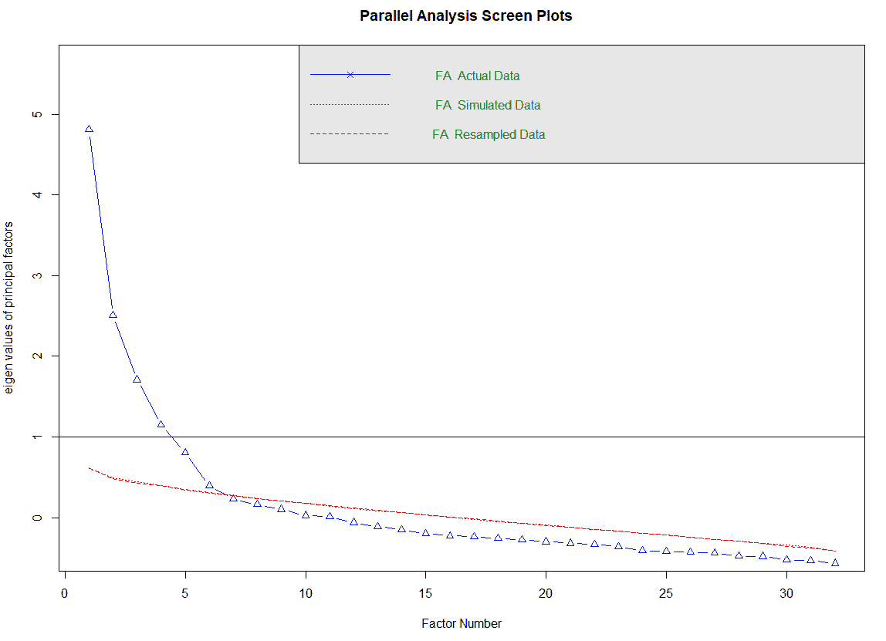

以下面的方式，这也将揭示因素本身的负荷；只需调用 R 函数:

```
fa.model <- fa(server.feature,7,n.obs = 459,fm="pa",scores="regression", use="pairwise",rotate="varimax") #can use WLS - weighted least squares
fa.model.r <- target.rot(fa.model)
fa.diagram(fa.model.r) 
```

下图显示了如何装载构造的每一个因子。：

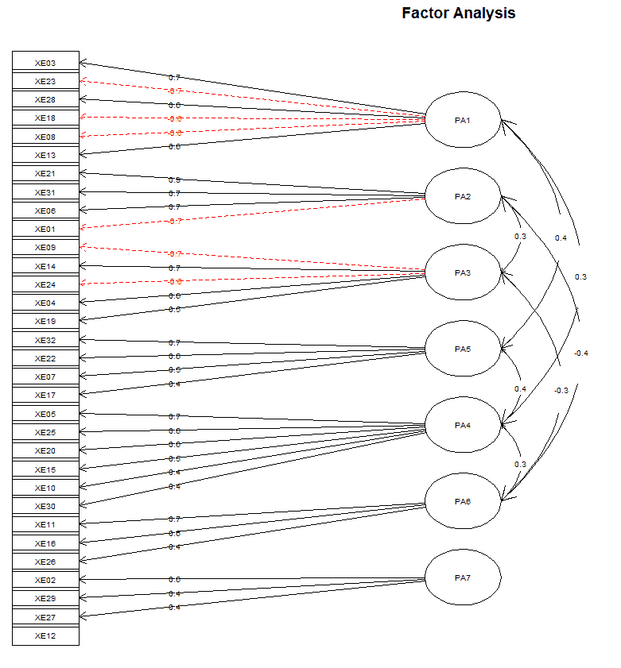

将载荷存储回数据库以供进一步分析和因子命名是一种常见的做法，并且能够将因子合并到任何进一步的分析中(例如:分类或聚类方法)。现在我们知道了因子的数量，我们可以将载荷存储到数据库中:

```
-- Factor Analysis
-- extract factor loadings

DECLARE @Rcode NVARCHAR(MAX)
SET @Rcode = N'
 ## with actual FA funcitons
 library(psych)
 library(Hmisc)
 ## for data munching and visualization
 library(ggplot2)
 library(plyr)
 library(pastecs)

 server.feature <- InputDataSet

 server.feature$XE12[server.feature$XE12=="25"]<-NA
 server.feature$XE18[server.feature$XE18=="25"]<-NA
 server.feature$XE24[server.feature$XE24=="25"]<-NA
 server.feature$XE27[server.feature$XE27=="25"]<-NA

 fa.model <- fa(server.feature
 ,7
 ,fm="pa"
               ,scores="regression"
 ,use="pairwise"
 ,rotate="varimax") #can use WLS - weighted least squares

 fa.loadings <- as.list.data.frame(fa.model$loadings)
      OutputDataSet <- data.frame(fa.loadings)'

 EXEC sp_execute_external_script
 @language = N'R'
 ,@script = @Rcode
      ,@input_data_1 = N'SELECT * FROM server_info'
WITH RESULT SETS
((
 PA1 NUMERIC(16,3)
 ,PA2 NUMERIC(16,3)
 ,PA3 NUMERIC(16,3)
 ,PA4 NUMERIC(16,3)
 ,PA5 NUMERIC(16,3)
 ,PA6 NUMERIC(16,3)
 ,PA7 NUMERIC(16,3)
 ))  
```

结果可以解释为:值(正的或负的)越高，特定测量与伴随因子的负载越大:

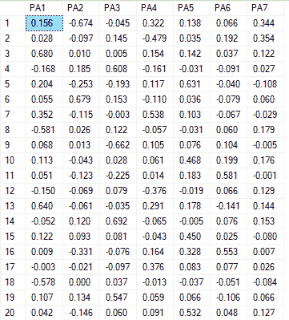

因子 1，`PA1`，大多装载了 XE03 ( `0.680`)，XE13 ( `0.640`)，XE18 ( `-0.578`，XE28 ( `0.652`)。所有四个都在测量查询的事务，如下图所示:

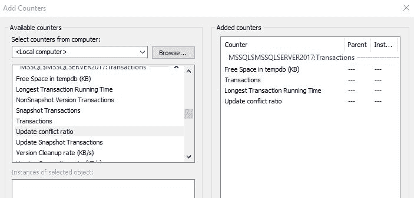

这里，负值是负负载的 tempdb (KB)中的可用空间，它仅表示与因子的关系。但是能够减少扩展事件的数量，并通过高级统计分析将它们组合起来，是解决潜在复杂问题的一种非常简洁的方法。

有了数据库中的负载，我还可以在散点图上显示这些因素是如何分布的。我已经将前面查询的结果导出到 Power BI，并使用了集群可视化。此外，你可以看到这些因素负荷的集群和那些相似的。红色组(左侧)也是数据库管理员和数据科学家应该一起查看以进行进一步检查的内容:

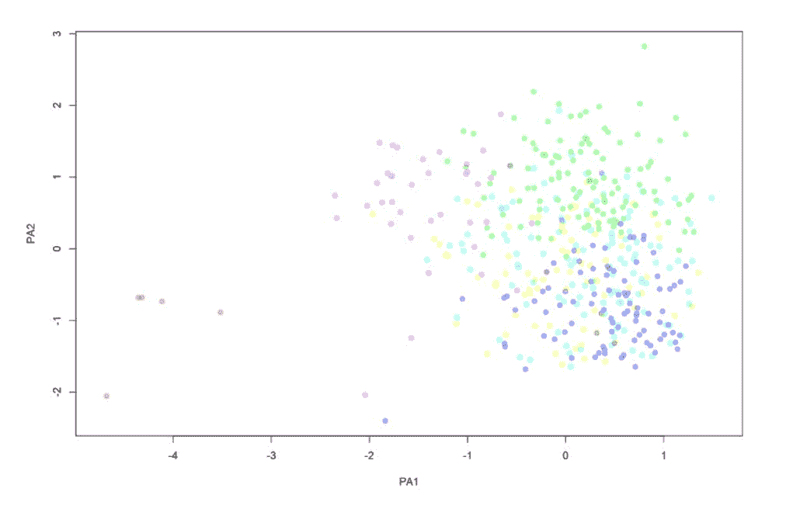

# 创建基线和工作负荷，并重放

假设您能够减少和创建新的措施，并根据您的特定服务器或环境进行定制和调整，现在我们希望了解系统在所有其他参数不变的情况下是如何运行的(在拉丁语中，*其他条件不变*)。这是基线。有了基线，我们就确定了什么是正常的，换句话说，就是在正常条件下的表现。基线用于比较什么可能或看起来不正常或不寻常。它还可以作为任何未来测试的控制组(这非常有用，尤其是在推出新的补丁程序时，需要执行特定环境/服务器的升级)。

一天(24 小时)内，典型的企业基线可以描述为来自用户或机器的数据库请求数量:

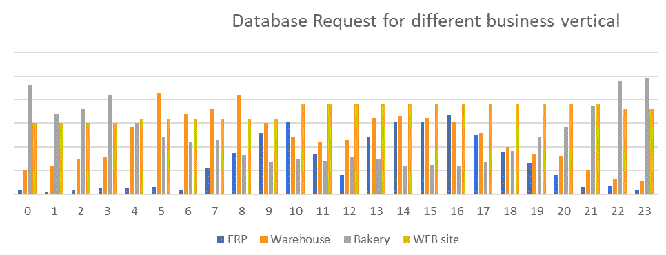

当所有请求都被表示为每个公司流程的分解时，可以看到即时的模式。

ERP 系统通常在人们在他们工作场所时达到峰值-在正常的一天中，在上午 8.00 和下午 5.00 之间，具有两个不同的峰值和从上午 11.00 到下午 1.00 的非常明显的午餐休息时间:


添加用于日常 ERP 系统维护的 ETL 作业，很明显，DBA 和系统管理员通常会在何时何地尝试压缩这些重要作业，以及这些作业如何受到日常 ERP 工作负载的限制和影响:

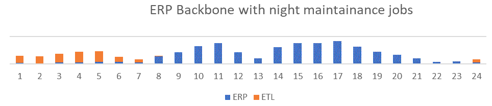

仓库具有完全不同的行为模式，这意味着它通常在早上 4.00 AM 和 5.00 AM 是最高的请求，并且在晚上之前保持稳定:

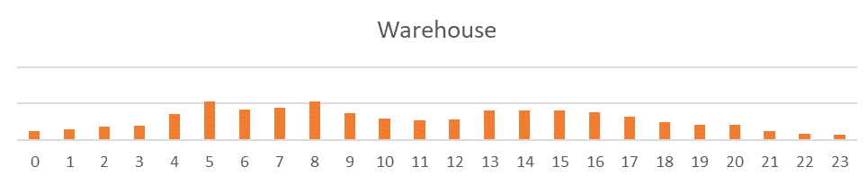

相反，面包店对数据库有相反的请求，因为他们的大部分活动是从晚上 9 点开始到凌晨 3 点完成的，所以顾客在早上可以得到新鲜的面包:

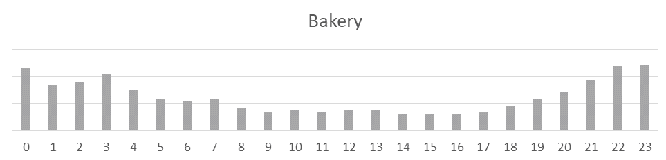

最后，可以将网站理解为一个持续的数据库请求资源，每天的变化相对较小:

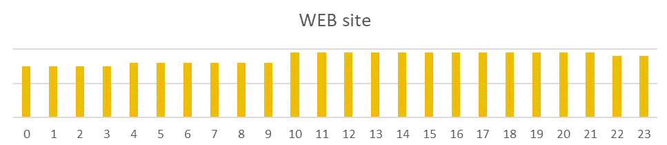

所有这些都可以理解为一个每日基线，当然，如果按月计划，事情会变得更加复杂。此外，模式会立即出现。在周末(第 7 天、第 14 天和第 21 天)，请求减少，到月底，财务周期需要结束；因此，数据库上有额外的负载:

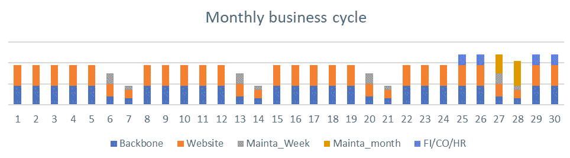

展示所有这些对于理解必须如何理解系统(或环境)的基线是至关重要的。可以使用性能计数器、许多 DMV、查询存储和其他工具来收集这些数据。我们通常收集的是我们以后要监控和预测的。因此明智地选择是最重要的任务，因为通过这些度量、计数器和值，您将定义您的系统何时健康，何时不健康。但是通常关于系统和数据库的一般信息是至关重要的。此外，还需要存储 SQL Server 信息、许多可配置的参数、与查询相关的信息、与数据库 I/O 和 RAM 相关的信息。

有了基线之后，我们需要创建工作负载。通常，在生产服务器中根据基线捕获工作负载，并在测试服务器/环境中重放捕获统计数据的恢复。通过在测试环境中重放从生产中捕获的工作负载，或者通过更改特定参数的值，可以交替进行数据库调优或配置更改。下一个演示是通过两个参数表示的工作负载，当相同的工作负载得到响应时，这两个参数发生了变化:

```
USE [master];
GO

CREATE DATABASE Workloads;
GO

USE Workloads;
GO  
```

查询表`[dbo].[WLD]`本质上就是重复相同的工作负载，改变一个或另一个参数:

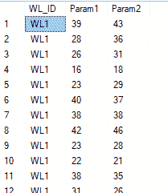

首先，我们需要在每次发生变化时对工作负载进行异常值分析。带有 R 的 T-SQL 代码可以提供一个 *Mahalanobis* 图，它清楚地显示了异常值在哪里:

```
EXEC sp_execute_external_script 
 @language = N'R' 
,@script = N' 
               library(car) 
               library(ggplot2) 
               dataset <- InputDataSet 
               dataset$WL_ID <- as.numeric(recode(dataset$WL_ID, "''WL1''=1; ''WL2''=2;''WL3''=3")) 
               dataset$Param1 <- as.numeric(dataset$Param1) 
               dataset$Param2 <- as.numeric(dataset$Param2) 

               m.dist <- mahalanobis(dataset, colMeans(dataset), cov(dataset)) 
               dataset$maha_dist <- round(m.dist) 

               # Mahalanobis Outliers - Threshold set to 7 
               dataset$outlier_mah <- "No" 
               dataset$outlier_mah[dataset$maha_dist > 7] <- "Yes" 

                image_file = tempfile();   
               jpeg(filename = image_file);   

               # Scatterplot for checking outliers using Mahalanobis  
               ggplot(dataset, aes(x = Param1, y = Param2, color = outlier_mah)) + 
                 geom_point(size = 5, alpha = 0.6) + 
                 labs(title = "Mahalanobis distances for multivariate regression outliers", 
                        subtitle = "Comparison on 1 parameter for three synthetic Workloads") + 
                 xlab("Parameter 1") + 
                 ylab("Parameter 2") + 
                 scale_x_continuous(breaks = seq(5, 55, 5)) + 
                 scale_y_continuous(breaks = seq(0, 70, 5))    + geom_abline(aes(intercept = 12.5607 , slope = 0.5727)) 

                 dev.off();  
               OutputDataSet <- data.frame(data=readBin(file(image_file, "rb"), what=raw(), n=1e6))' 
,@input_data_1 = N'SELECT * FROM WLD' 
```

该图被插入到 Power BI 中，其中工作负载可以根据这两个参数进行更改。因此，数据库管理员不仅可以更改工作负载，还可以在对恢复的工作负载执行重放时，查看哪些异常值导致了异常值并需要额外关注:

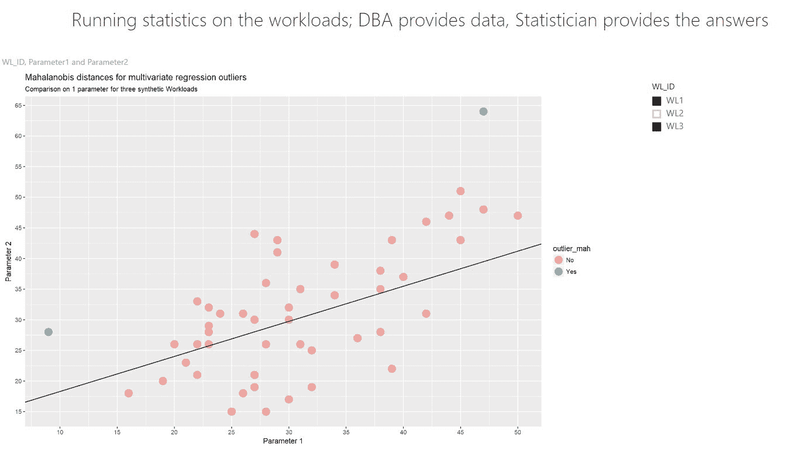

还可以执行 ANOVA 或 MANOVA 来查看工作负载之间的具体变化。r 代码可以做到这一点:

```
dataset$Param1 <- as.numeric(dataset$Param1)
dataset$Param2 <- as.numeric(dataset$Param2)
dataset$WL_ID <- as.numeric(recode(dataset$WL_ID, "'WL1'=1; 'WL2'=2;'WL3'=3"))

LM.man <- Anova(lm(cbind(Param1, Param2) ~ WL_ID, data=dataset))
summary(LM.man)    
```

ANOVA 统计显示了工作负载之间的差异及其参数设置的变化:

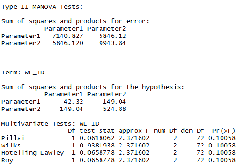

# 使用 R 磁盘使用情况创建预测

预测包括发现任何计划外和不想要的活动或异常的系统行为，尤其是在与基线比较时。以这种方式，发出红旗将导致更少的假阳性状态。

此外，我们总是会遇到磁盘大小的问题。基于这个问题，我们将演示数据库增长，存储数据，然后根据收集的数据运行预测，以便最终能够预测 DBA 何时会遇到磁盘空间问题。

为了说明这个场景，我将创建一个 8 MB 的小型数据库，并且没有增长的可能性。我将创建两个表。一个将作为基线，`DataPack_Info_SMALL`，另一个将作为所谓的每日日志，其中将存储所有内容以备意外情况或不良行为。这将保存在`DataPack_Info_LARGE`表中。

首先，创建一个数据库:

```
USE [master];
GO

CREATE DATABASE FixSizeDB
CONTAINMENT = NONE
ON  PRIMARY
( NAME = N'FixSizeDB', FILENAME = N'C:\Program Files\Microsoft SQL Server\MSSQL14.MSSQLSERVER2017\MSSQL\DATA\FixSizeDB_2.mdf' , 
SIZE = 8192KB , FILEGROWTH = 0)
LOG ON
( NAME = N'FixSizeDB_log', FILENAME = N'C:\Program Files\Microsoft SQL Server\MSSQL14.MSSQLSERVER2017\MSSQL\DATA\FixSizeDB_2_log.ldf',
SIZE = 8192KB , FILEGROWTH = 0)
GO
ALTER DATABASE [FixSizeDB] SET COMPATIBILITY_LEVEL = 140
GO
ALTER DATABASE [FixSizeDB] SET RECOVERY SIMPLE
GO  
```

`DataPack`表将作为所有生成的插入和后来的删除的存储位置:

```
CREATE TABLE DataPack
 (
 DataPackID BIGINT IDENTITY NOT NULL
 ,col1 VARCHAR(1000) NOT NULL
 ,col2 VARCHAR(1000) NOT NULL
 )  
```

填充`DataPack`表将通过以下简单的`WHILE`循环来完成:

```
DECLARE @i INT = 1;
BEGIN TRAN
 WHILE @i <= 1000
 BEGIN
 INSERT dbo.DataPack(col1, col2)
 SELECT
 REPLICATE('A',200)
 ,REPLICATE('B',300);
 SET @i = @i + 1;
 END
COMMIT;
GO  
```

使用以下查询捕获磁盘空间变化对于该任务非常重要:

```
SELECT
 t.NAME AS TableName
 ,s.Name AS SchemaName
 ,p.rows AS RowCounts
 ,SUM(a.total_pages) * 8 AS TotalSpaceKB
 ,SUM(a.used_pages) * 8 AS UsedSpaceKB
 ,(SUM(a.total_pages) - SUM(a.used_pages)) * 8 AS UnusedSpaceKB
FROM
 sys.tables t
INNER JOIN sys.indexes AS i
 ON t.OBJECT_ID = i.object_id
INNER JOIN sys.partitions AS p
 ON i.object_id = p.OBJECT_ID
 AND i.index_id = p.index_id
INNER JOIN sys.allocation_units AS a
 ON p.partition_id = a.container_id
LEFT OUTER JOIN sys.schemas AS s
 ON t.schema_id = s.schema_id
WHERE
 t.NAME NOT LIKE 'dt%'
 AND t.is_ms_shipped = 0
 AND i.OBJECT_ID > 255
 AND t.Name = 'DataPack'
GROUP BY t.Name, s.Name, p.Rows  
```

`Log`表将与`DataPack`表一起被填充，以便收集磁盘空间的即时变化:

```
DECLARE @nof_steps INT = 0
WHILE @nof_steps < 15
BEGIN
 BEGIN TRAN
 -- insert some data
 DECLARE @i INT = 1;
              WHILE @i <= 1000 -- step is 100 rows
 BEGIN
                                         INSERT dbo.DataPack(col1, col2)
 SELECT
                                                             REPLICATE('A',FLOOR(RAND()*200))
                                                            ,REPLICATE('B',FLOOR(RAND()*300));
 SET @i = @i + 1;
 END
 -- run statistics on table
 INSERT INTO dbo.DataPack
 SELECT
                     t.NAME AS TableName
                     ,s.Name AS SchemaName
                     ,p.rows AS RowCounts
                     ,SUM(a.total_pages) * 8 AS TotalSpaceKB
                     ,SUM(a.used_pages) * 8 AS UsedSpaceKB
                     ,(SUM(a.total_pages) - SUM(a.used_pages)) * 8 AS UnusedSpaceKB
 ,GETDATE() AS TimeMeasure
 FROM 
 sys.tables AS t
                     INNER JOIN sys.indexes AS i
                     ON t.OBJECT_ID = i.object_id
                     INNER JOIN sys.partitions AS p
                     ON i.object_id = p.OBJECT_ID
                     AND i.index_id = p.index_id
                     INNER JOIN sys.allocation_units AS a
                     ON p.partition_id = a.container_id
                     LEFT OUTER JOIN sys.schemas AS s
                     ON t.schema_id = s.schema_id
              WHERE
                            t.NAME NOT LIKE 'dt%'
                     AND t.is_ms_shipped = 0
                     AND t.name = 'DataPack'
                     AND i.OBJECT_ID > 255
              GROUP BY t.Name, s.Name, p.Rows
              WAITFOR DELAY '00:00:02'
       COMMIT;
END
```

这将作为我们比较结果的基线。当我们查询`DataPack_Log_Small`表时，结果如下:

```
DECLARE @RScript nvarchar(max)
SET @RScript = N'
 library(Hmisc) 
 mydata <- InputDataSet
 all_sub <- mydata[2:3]
 c <- cor(all_sub, use="complete.obs", method="pearson")
 t <- rcorr(as.matrix(all_sub), type="pearson")
 c <- cor(all_sub, use="complete.obs", method="pearson")
 c <- data.frame(c)
 OutputDataSet <- c'
DECLARE @SQLScript nvarchar(max)
SET @SQLScript = N'SELECT
 TableName
 ,RowCounts
 ,UsedSpaceKB
 ,TimeMeasure
 FROM DataPack_Info_SMALL'
EXECUTE sp_execute_external_script
 @language = N'R'
 ,@script = @RScript
 ,@input_data_1 = @SQLScript
 WITH result SETS ((RowCounts VARCHAR(100)
 ,UsedSpaceKB  VARCHAR(100)));
GO  
```

结果，我们得到了`RowCounts`和`UsedSpaceKB`列之间的强正相关。这可以很容易地解释为:当`RowCounts`的值上升时，`UsedSpaceKB`的值也上升。这是唯一合乎逻辑的解释。负相关有点奇怪。现在，我们将尝试模拟随机删除和插入，并使用以下代码观察类似的行为:

```
DECLARE @nof_steps INT = 0
WHILE @nof_steps < 15
BEGIN
 BEGIN TRAN
 -- insert some data
 DECLARE @i INT = 1;
 DECLARE @insertedRows INT = 0;
              DECLARE @deletedRows INT = 0;
 DECLARE @Rand DECIMAL(10,2) = RAND()*10
 IF @Rand < 5
 BEGIN
 WHILE @i <= 1000 -- step is 100 rows
 BEGIN
                                                                  INSERT dbo.DataPack(col1, col2)
                                                                         SELECT
                                                                                 REPLICATE('A',FLOOR(RAND()*200))  -- pages are filling up differently
                                                                                ,REPLICATE('B',FLOOR(RAND()*300));
                                                               SET @i = @i + 1;
                                                           END
 SET @insertedRows = 1000 
                     END

               IF @Rand  >= 5
 BEGIN 
                                  SET @deletedRows = (SELECT COUNT(*) FROM dbo.DataPack WHERE DataPackID % 3 = 0)
                                  DELETE FROM dbo.DataPack
                                                    WHERE
                                  DataPackID % 3 = 0 OR DataPackID % 5 = 0

                     END
              -- run statistics on table
              INSERT INTO dbo.DataPack_Info_LARGE
              SELECT
                     t.NAME AS TableName
                     ,s.Name AS SchemaName
                     ,p.rows AS RowCounts
                     ,SUM(a.total_pages) * 8 AS TotalSpaceKB
                     ,SUM(a.used_pages) * 8 AS UsedSpaceKB
                     ,(SUM(a.total_pages) - SUM(a.used_pages)) * 8 AS UnusedSpaceKB
                     ,GETDATE() AS TimeMeasure
                     ,CASE WHEN @Rand < 5 THEN 'Insert'
                             WHEN @Rand >= 5 THEN 'Delete'
                             ELSE 'meeeh' END AS Operation
                     ,CASE WHEN @Rand < 5 THEN @insertedRows
                             WHEN @Rand >= 5 THEN @deletedRows
                             ELSE 0 END AS NofRowsOperation
 FROM 
                           sys.tables AS t
                     INNER JOIN sys.indexes AS i
                     ON t.OBJECT_ID = i.object_id
                     INNER JOIN sys.partitions AS p
                     ON i.object_id = p.OBJECT_ID
                     AND i.index_id = p.index_id
                     INNER JOIN sys.allocation_units AS a
                     ON p.partition_id = a.container_id
                     LEFT OUTER JOIN sys.schemas AS s
                     ON t.schema_id = s.schema_id

              WHERE
                            t.NAME NOT LIKE 'dt%'
                     AND t.is_ms_shipped = 0
                     AND t.name = 'DataPack'
                     AND i.OBJECT_ID > 255
              GROUP BY t.Name, s.Name, p.Rows
              WAITFOR DELAY '00:00:01'
       COMMIT;
END  
```

我们增加了`DELETE`语句和`RowCounts`，这样演示就不会那么简单了。通过计算相关系数，很明显，我们再次得到非常强的正相关。

我们现在将通过在不同的数据集上运行相同的相关系数来比较我们的`LARGE`测试和基线。第一个在我们的基线上(`DataPack_Info_SMALL`)，第二个来自我们的测试表(`DataPack_Info_LARGE`):

```
DECLARE @RScript1 nvarchar(max)
SET @RScript1 = N'
    library(Hmisc) 
                                mydata <- InputDataSet
                                all_sub <- mydata[4:5]
                                c <- cor(all_sub, use="complete.obs", method="pearson")
                                c <- data.frame(c)
                                OutputDataSet <- c'

DECLARE @SQLScript1 nvarchar(max)
SET @SQLScript1 = N'SELECT

                                              TableName
                                             ,RowCounts
                                             ,TimeMeasure
    ,UsedSpaceKB 
                                             ,UnusedSpaceKB
                                             FROM DataPack_Info_SMALL
                                             WHERE RowCounts <> 0'
EXECUTE sp_execute_external_script
 @language = N'R'
 ,@script = @RScript1
 ,@input_data_1 = @SQLScript1
       WITH result SETS ( (
                                          RowCounts VARCHAR(100)
                                         ,UsedSpaceKB  VARCHAR(100)
                                         ));

DECLARE @RScript2 nvarchar(max)
SET @RScript2 = N'
    library(Hmisc) 
                            mydata <- InputDataSet
                            all_sub <- mydata[4:5]
                            c <- cor(all_sub, use="complete.obs", method="pearson")
                            c <- data.frame(c)
                            OutputDataSet <- c'
DECLARE @SQLScript2 nvarchar(max)
SET @SQLScript2 = N'SELECT
                                          TableName
                                         ,RowCounts
                                         ,TimeMeasure
    ,UsedSpaceKB 
                                         ,UnusedSpaceKB
                                         FROM DataPack_Info_LARGE
                                         WHERE NofRowsOperation <> 0
                                         AND RowCounts <> 0'

EXECUTE sp_execute_external_script
 @language = N'R'
 ,@script = @RScript2
 ,@input_data_1 = @SQLScript2
 WITH result SETS ( (
 RowCounts VARCHAR(100)
 ,UsedSpaceKB  VARCHAR(100)
                                         )
                                   );
GO  
```

结果很有意思。基线显示`UsedSpaceKB`和`UnusedSpaceKB`之间没有相关性(是`-0.049`)，而我们的测试显示了几乎 3 倍强的负相关性(是`-0.109`)。关于这种相关性说几句话:这表明`UsedSpaceKB`与`UnUsedSpaceKB`负相关；这仍然太小，不足以得出任何具体的结论，但它表明了一个微小的变化如何能够在一个简单的相关性中引起差异。

您可以使用 T-SQL、PowerShell 和实现来收集磁盘空间使用信息。NET 程序集、创建 SQL Server 作业或任何其他方式。重要的部分和最大的优势是，使用 R 和收集的数据，现在你不仅可以监控过去的数据并对其做出反应，还可以预测将会发生什么。

让我们更进一步，假设以下查询和数据集取自我们创建的示例:

```
SELECT
 TableName
 ,Operation
 ,NofRowsOperation
 ,UsedSpaceKB
 ,UnusedSpaceKB
FROM dbo.DataPack_Info_LARGE
```

我们将根据历史数据对`usedSpaceKB`的大小进行预测。对于要预测的给定数字，我们的输入将是`TableName`、`Operation`和`NofRowsOperation`。我将使用一般的线性模型(GLM 算法)来预测`usedDiskSpace`！在你们开始说这是荒谬的之前，由于 DBCC 缓存、页面刹车、索引、停顿统计和许多其他参数，这是不可能的，我想指出的是，所有这些信息都可以添加到算法中，并会使预测更好。因为我的查询是非常简单的`INSERT`和`DELETE`语句，所以您也应该知道您预测的是哪种查询。此外，这种方法对于部署前的代码测试、单元测试和压力测试也很有用。

使用下面的 R 代码，我们可以开始创建预测:

```
-- GLM prediction
DECLARE @SQL_input AS NVARCHAR(MAX)
SET @SQL_input = N'SELECT
 TableName
                                  ,CASE WHEN Operation = ''Insert'' THEN 1 ELSE 0 END AS Operation
 ,NofRowsOperation
 ,UsedSpaceKB
 ,UnusedSpaceKB
 FROM dbo.DataPack_Info_LARGE
 WHERE
 NofRowsOperation <> 0';

DECLARE @R_code AS NVARCHAR(MAX)
SET @R_code = N'library(RevoScaleR)
 library(dplyr)
                DPLogR <- rxGlm(UsedSpaceKB ~ Operation + NofRowsOperation + UnusedSpaceKB, data = DataPack_info, family = Gamma)
                df_predict <- data.frame(TableName=("DataPack"), Operation=(1), NofRowsOperation=(451), UnusedSpaceKB=(20))
 predictions <- rxPredict(modelObject = DPLogR, data = df_predict, outData = NULL, 
                                predVarNames = "UsedSpaceKB", type = "response",checkFactorLevels=FALSE);
                OutputDataSet <- predictions'

EXEC sys.sp_execute_external_script
 @language = N'R'
    ,@script = @R_code
    ,@input_data_1 = @SQL_input
 ,@input_data_1_name = N'DataPack_info'
       WITH RESULT SETS ((
                         UsedSpaceKB_predict INT
                         ));
GO 
```

现在我们可以根据以下数据预测`UsedSpaceKB`的大小:

```
df_predict <- data.frame(TableName=("DataPack"), Operation=(1), NofRowsOperation=(451), UnusedSpaceKB=(20))
```

我们有几件事要先弄清楚。以下带有`xp_execute_external_script`的 R 代码作为带有这些列的输入参数的存储过程会工作得更好:`TableName`、`Operation`、`NofRowsOperation`和`UnusedSpaceKB`。此外，为了避免模型构建的不必要的计算时间，通常的做法是将序列化的模型存储在 SQL 表中，并在运行预测时对其进行反序列化。最后，由于这只是一个演示，请确保预测中使用的数字是有意义的，正如我们在示例中看到的，如果绝对计算，而不是使用累积值，`UsedSpaceKB`会预测得更好。只有在稍后才计算累积值。

为了总结这个相当长的演示，让我们创建一个过程并运行一些预测来看看这有多有效。该存储过程如下:

```
CREATE PROCEDURE Predict_UsedSpace
    (
     @TableName NVARCHAR(100)
    ,@Operation CHAR(1)  -- 1  = Insert; 0 = Delete
    ,@NofRowsOperation NVARCHAR(10)
    ,@UnusedSpaceKB NVARCHAR(10)
    )
    AS
    DECLARE @SQL_input AS NVARCHAR(MAX)
    SET @SQL_input = N'SELECT
                                      TableName
                                      ,CASE WHEN Operation = ''Insert'' THEN 1 ELSE 0 END AS Operation
                                      ,NofRowsOperation
                                      ,UsedSpaceKB
                                      ,UnusedSpaceKB
                                       FROM dbo.DataPack_Info_LARGE
                                       WHERE
                                             NofRowsOperation <> 0';
    DECLARE @R_code AS NVARCHAR(MAX)
    SET @R_code = N'library(RevoScaleR)
                    DPLogR <- rxGlm(UsedSpaceKB ~ Operation + NofRowsOperation + UnusedSpaceKB, data = DataPack_info, family = Gamma)
    df_predict <- data.frame(TableName=("'+@TableName+'"), Operation=('+@Operation+'), 
                              NofRowsOperation=('+@NofRowsOperation+'), UnusedSpaceKB=('+@UnusedSpaceKB+'))
                    predictions <- rxPredict(modelObject = DPLogR, data = df_predict, outData = NULL,  predVarNames = "UsedSpaceKB", type = "response",checkFactorLevels=FALSE);
                    OutputDataSet <- predictions'

    EXEC sys.sp_execute_external_script
         @language = N'R'
        ,@script = @R_code
        ,@input_data_1 = @SQL_input
        ,@input_data_1_name = N'DataPack_info'

    WITH RESULT SETS ((
                                        UsedSpaceKB_predict INT
                                       ));
    GO

```

现在我们需要连续运行该过程两次:

```
EXECUTE Predict_UsedSpace
 @TableName = 'DataPack'
                     ,@Operation = 1
                     ,@NofRowsOperation = 120
                     ,@UnusedSpaceKB = 2;
GO

EXECUTE Predict_UsedSpace
                     @TableName = 'DataPack'
                     ,@Operation = 1
                     ,@NofRowsOperation = 500
                     ,@UnusedSpaceKB = 12;
GO  
```

对已用空间磁盘的两种预测都基于我们的演示数据，但也可以用于更大规模的预测。当然，为了更好的预测，还可以包含一些基线统计数据。对于每个模型，我们还需要测试预测，看看它们有多好。


# 摘要

使用 SQL Server R 执行任何类型的 DBA 任务，正如我们在这里所看到的，这并不总是硬核统计或预测分析；我们还可能对属性查询、收集的统计数据和索引之间的连接和关系有一些简单的统计理解。例如，为了更好地理解覆盖缺失索引的查询，预测和预测来自执行计划的信息是一个关键点。参数嗅探或基数估计器也将是一项很好的任务，可以和通常的统计数据一起处理。

但是我们已经看到，预测通常只被监控的事件对于 DBA 来说是一个巨大的优势，对于核心系统来说是一个非常受欢迎的特性。

通过将 R 集成到 SQL Server 中，这种每日、每周或每月的任务可以在不同的程度上实现自动化。因此，它可以帮助 DBA 和负责系统维护的人员获得不同的见解。

在下一章，我们将讨论扩展外部过程以外的特性以及如何使用它们。