# 一、走向监督学习的第一步

在本书中，我们将了解许多日常生活中常见的机器学习算法的实现。将会有大量的数学、理论和有形的代码示例来满足甚至是最大的机器学习爱好者，并且希望您将会学到一些有用的 Python 技巧和实践。我们将从监督学习的简单介绍开始，分享一个真实的机器学习演示；完成我们的 Anaconda 环境设置；学习如何测量曲线的斜率、Nd 曲线和多种函数；最后，我们将讨论如何知道一个模型是好是坏。在本章中，我们将讨论以下主题:

*   监督学习的一个实例
*   设置环境
*   监督学习
*   爬山和损失函数
*   模型评估和数据分割


# 技术要求

对于本章，您需要安装以下软件，如果您还没有这样做:

*   Jupyter 笔记本
*   蟒蛇
*   计算机编程语言

本章的代码文件可以在 [https:/ / github 找到。com/ PacktPublishing/
用 Python 监督机器学习](https://github.com/PacktPublishing/Supervised-Machine-Learning-with-Python)。


# 监督学习的一个实例

首先，我们将看看我们可以用监督机器学习做些什么。通过以下终端提示，我们将推出一款新的 Jupyter 笔记本电脑:

```
jupyter notebook
```

一旦我们进入顶层的`Hands-on-Supervised-Machine-Learning-with-Python-master`主目录，我们将直接进入`examples`目录:

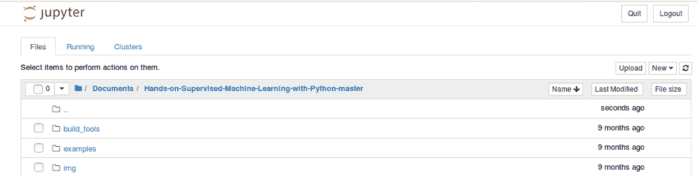

你可以看到我们这里唯一的笔记本是`1.1 Supervised Learning Demo.ipynb`:

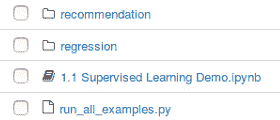

我们有监督学习演示 Jupyter 笔记本。我们将使用名为`Spam`数据集的 UCI 数据集。这是不同电子邮件的列表，包含对应于垃圾邮件或非垃圾邮件的不同特征。我们希望建立一个机器学习算法，可以预测我们是否有一封电子邮件将是垃圾邮件。如果你有自己的电子邮件服务器，这将对你非常有帮助。

因此，下面代码中的第一个函数只是一个请求的 get 函数。您应该已经有了数据集，它已经位于`examples`目录中。但是如果您不知道，您可以继续运行下面的代码。你可以看到我们已经有了`spam.csv`，所以我们不打算下载它:

接下来，我们将使用`pandas`库。这是一个来自 Python 的数据分析库。当我们进入下一阶段，即环境设置时，您可以安装它。该库是一个数据框数据结构，是一种原生 Python，我们将按如下方式使用:

这允许我们以下面的格式布置我们的数据。我们可以使用各种不同的统计函数，这些函数在你进行机器学习时非常好用:

```
from urllib.request import urlretrieve, ProxyHandler, build_opener, install_opener
import requests
import os
pfx = "https://archive.ics.uci.edu/ml/machine-learning databases/spambase/"
data_dir = "data"
# We might need to set a proxy handler...
try:
    proxies = {"http": os.environ['http_proxy'],
               "https": os.environ['https_proxy']}
    print("Found proxy settings")
    #create the proxy object, assign it to a variable
    proxy = ProxyHandler(proxies)
    # construct a new opener using your proxy settings
    opener = build_opener(proxy)
    # install the opener on the module-level
    install_opener(opener)

except KeyError:
    pass
# The following will download the data if you don't already have it...
def get_data(link, where):
    # Append the prefix
    link = pfx + link
```

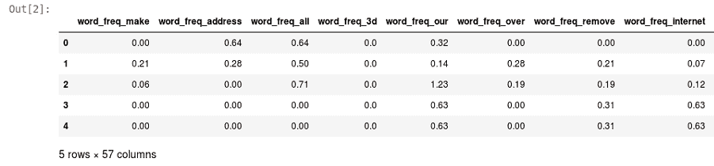

```
import pandas as pd
names = ["word_freq_make", "word_freq_address", "word_freq_all", 
         "word_freq_3d", "word_freq_our", "word_freq_over", 
         "word_freq_remove", "word_freq_internet", "word_freq_order",
         "word_freq_mail", "word_freq_receive", "word_freq_will", 
         "word_freq_people", "word_freq_report", "word_freq_addresses", 
         "word_freq_free", "word_freq_business", "word_freq_email", 
         "word_freq_you", "word_freq_credit", "word_freq_your", 
         "word_freq_font", "word_freq_000", "word_freq_money", 
         "word_freq_hp", "word_freq_hpl", "word_freq_george", 
         "word_freq_650", "word_freq_lab", "word_freq_labs", 
         "word_freq_telnet", "word_freq_857", "word_freq_data", 
         "word_freq_415", "word_freq_85", "word_freq_technology", 
         "word_freq_1999", "word_freq_parts", "word_freq_pm", 
         "word_freq_direct", "word_freq_cs", "word_freq_meeting", 
         "word_freq_original", "word_freq_project", "word_freq_re", 
         "word_freq_edu", "word_freq_table", "word_freq_conference", 
         "char_freq_;", "char_freq_(", "char_freq_[", "char_freq_!", 
         "char_freq_$", "char_freq_#", "capital_run_length_average", 
         "capital_run_length_longest", "capital_run_length_total",
         "is_spam"]
df = pd.read_csv(os.path.join("data", "spam.csv"), header=None, names=names)
# pop off the target
y = df.pop("is_spam")
df.head()
```

如果你对这些术语不熟悉，先不要惊慌，我们将在本书中详细学习这些术语。

对于`train_test_split`，我们将把`df`数据集分成两部分:训练集和测试集。除此之外，我们还有目标，这是一个`01`变量，表示垃圾邮件或非垃圾邮件的真或假。我们也将对其进行分割，其中包括相应的真假标签向量。通过拆分标签，我们得到了`3680`训练样本和`921`测试样本，文件如下面的代码片段所示:

上述代码的输出如下:

For `train_test_split`, we will take the `df` dataset and split it into two parts: train set and test set. In addition to that, we have the target, which is a `01` variable that indicates true or false for spam or not spam. We will split that as well, which includes the corresponding vector of true or false labels. By splitting the labels, we get `3680` training samples and `921` test samples, file as shown in the following code snippet:

```
from sklearn.model_selection import train_test_split
X_train, X_test, y_train, y_test = train_test_split(df, y, test_size=0.2, random_state=42, stratify=y)
print("Num training samples: %i" % X_train.shape[0])
print("Num test samples: %i" % X_test.shape[0])
```

请注意，我们的训练样本比测试样本多得多，这对拟合我们的模型很重要。我们将在本书的后面了解这一点。所以，不要太担心这里发生了什么，因为这只是为了演示。

```
Num training samples: 3680
Num test samples: 921
```

在下面的代码中，我们有了`packtml`库。这是我们正在构建的实际包，它是一个分类和回归树分类器。`CARTClassifier`是一个决策树的简单概括，用于回归和分类目的。我们在这里适合的一切都将是我们从零开始构建的监督机器学习算法。这是我们将在本书中构建的分类器之一。我们也有这个效用函数来绘制学习曲线。这将把我们的训练集分解成不同的文件夹进行交叉验证。我们将在多个训练样本的不同阶段拟合训练集，因此我们可以看到学习曲线如何在训练和验证折叠之间收敛，这决定了我们的算法如何学习，本质上:

我们将继续运行前面的代码，并绘制该算法在不同规模的训练集中是如何学习的。您可以看到，我们将在 3 倍交叉验证的情况下，针对 4 个不同的训练集大小进行调整。

因此，我们实际上正在做的是拟合 12 个独立的模型，这将需要几秒钟来运行:

```
from packtml.utils.plotting import plot_learning_curve
from packtml.decision_tree import CARTClassifier
from sklearn.metrics import accuracy_score
import numpy as np
import matplotlib.pyplot as plt
%matplotlib inline

# very basic decision tree
plot_learning_curve(
        CARTClassifier, metric=accuracy_score,
        X=X_train, y=y_train, n_folds=3, seed=21, trace=True,
        train_sizes=(np.linspace(.25, .75, 4) * X_train.shape[0]).astype(int),
        max_depth=8, random_state=42)\
    .show()
```

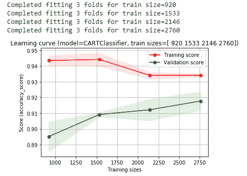

在前面的输出中，我们可以看到我们的**训练分数**和我们的**验证分数**。**训练分数**随着它学习归纳而减少，而我们的**验证分数**随着它学习从训练集归纳到验证集而增加。因此，在我们的验证集上，我们的准确率徘徊在 92-93%左右。

我们将使用最佳超参数:

逻辑回归

在本节中，我们将学习逻辑回归，这是我们要从头构建的另一个分类模型。我们将继续安装以下代码:

```
decision_tree = CARTClassifier(X_train, y_train, random_state=42, max_depth=8)
```


# 这比决策树快多了。在下面的输出中，您可以看到我们在 92.5%的范围内收敛了很多。这看起来比我们的决策树更加一致，但是它在验证集上的表现不够好:

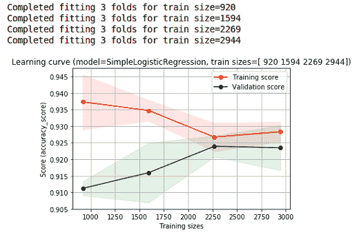

```
from packtml.regression import SimpleLogisticRegression
# simple logistic regression classifier
plot_learning_curve(
        SimpleLogisticRegression, metric=accuracy_score,
        X=X_train, y=y_train, n_folds=3, seed=21, trace=True,
        train_sizes=(np.linspace(.25, .8, 4) *     X_train.shape[0]).astype(int),
        n_steps=250, learning_rate=0.0025, loglik_interval=100)\
    .show()
```

在下面的截图中，有垃圾邮件的编码记录。我们将看到这种编码如何在我们可以阅读和验证的电子邮件上执行。因此，如果您访问过 Jupyter 笔记本顶部的 UCI 链接，它将提供数据集中所有要素的描述。我们这里有很多不同的功能，计算特定单词占整个电子邮件中单词数的比例。这些单词中的一些可能是免费的，而一些可能是有信用的。我们还有几个其他的特性，可以计算字符频率、感叹号的数量以及并发资金运行的数量。

所以，如果你有一组真正高度大写的单词，我们有所有这些特征:

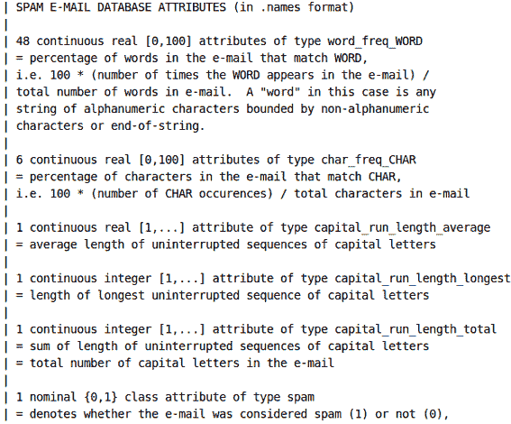

在下面的截图中，我们将创建两封电子邮件。第一封邮件显然是垃圾邮件。即使有人收到这封邮件，也不会有人回复:

上述代码片段的输出如下:

第二封邮件看起来不太像垃圾邮件:

```
spam_email = """
Dear small business owner,

This email is to inform you that for $0 down, you can receive a 
FREE CREDIT REPORT!!! Your money is important; PROTECT YOUR CREDIT and 
reply direct to us for assistance!
"""

print(spam_email)
```

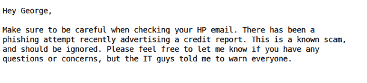

```
Dear small business owner,

This email is to inform you that for $0 down, you can receive a 
FREE CREDIT REPORT!!! Your money is important; PROTECT YOUR CREDIT and 
reply direct to us for assistance!
```

我们刚刚拟合的模型将查看这两封电子邮件并对特征进行编码，并将分类哪些是垃圾邮件，哪些不是垃圾邮件。

下面的函数将把这些邮件编码成我们讨论过的特性。最初，我们将使用一个`Counter`函数作为对象，并标记我们的电子邮件。我们所做的就是将我们的电子邮件拆分成一个单词列表，然后这些单词可以被拆分成一个字符列表。稍后，我们将统计字符和单词，以便生成我们的特征:

The model that we have just fit is going to look at both of the emails and encode the features, and will classify which is, and which is not, spam.

所以，所有这些我们一开始就有的特征告诉我们，我们有兴趣统计哪些单词。我们可以看到，原始数据集感兴趣的是计数单词，如地址、电子邮件、业务和信用，然后，对于我们的字符，我们正在寻找左括号和右括号以及美元符号(这与我们的垃圾邮件非常相关)。因此，我们将按如下方式对所有这些进行计数:

```
from collections import Counter
import numpy as np
def encode_email(email):
    # tokenize the email
    tokens = email.split()

    # easiest way to count characters will be to join everything
    # up and split them into chars, then use a counter to count them
    # all ONE time.
    chars = list("".join(tokens))
    char_counts = Counter(chars)
    n_chars = len(chars)

    # we can do the same thing with "tokens" to get counts of words
    # (but we want them to be lowercase!)
    word_counts = Counter([t.lower() for t in tokens])

    # Of the names above, the ones that start with "word" are
    # percentages of frequencies of words. Let's get the words
    # in question
    freq_words = [ 
        name.split("_")[-1]
        for name in names 
        if name.startswith("word")
    ]

    # compile the first 48 values using the words in question
    word_freq_encodings = [100\. * (word_counts.get(t, 0) / len(tokens))
                           for t in freq_words]
```

应用比率并跟踪`capital_runs`的总数，计算平均值、最大值和最小值:

当我们运行前面的代码时，我们得到下面的输出。这将对我们的电子邮件进行编码。这只是所有不同特征的简单向量。长度应该在 50 个字符左右:

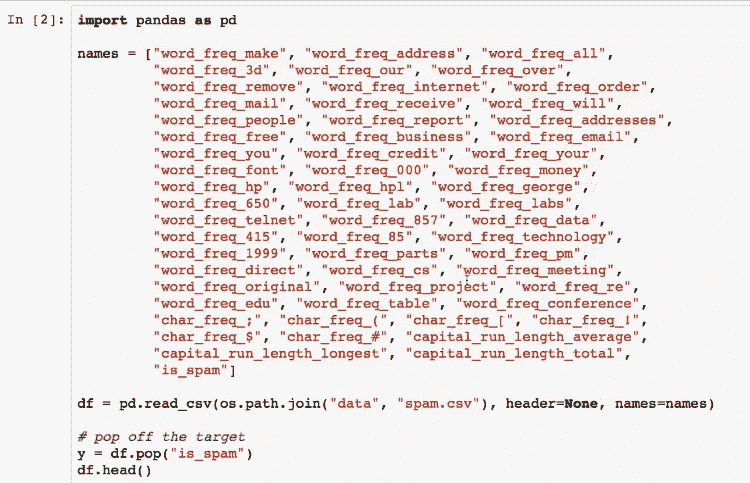

上述代码的输出如下:

```
 # make a np array to compute the next few stats quickly
capital_runs = np.asarray(capital_runs)
    capital_stats = [capital_runs.mean(), 
                     capital_runs.max(), 
                     capital_runs.sum()]

```

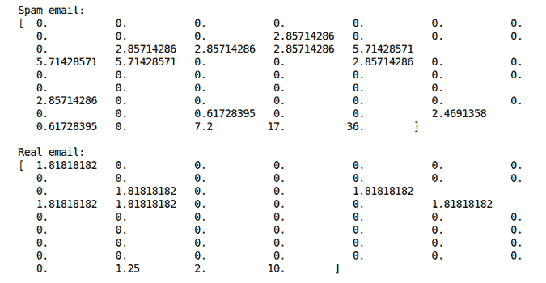

```
# get the email vectors
fake_email = encode_email(spam_email)
real_email = encode_email(not_spam)
# this is what they look like:
print("Spam email:")
print(fake_email)
print("\nReal email:")
print(real_email)
```

当我们将前面的值放入我们的模型时，我们将会看到我们的模型是否好。所以，理想情况下，我们会看到实际的假邮件被预测为假的，而实际的真邮件被预测为真的。因此，如果电子邮件被预测为假的，那么对于决策树和逻辑回归来说，我们的垃圾邮件预测确实是垃圾邮件。我们真正的电子邮件不是垃圾邮件，这也许更重要，因为我们不想将真正的电子邮件过滤到垃圾邮件文件夹中。因此，您可以看到，我们在这里安装了一些非常好的模型，适用于我们可以直观地检查是否为真正的垃圾邮件的一些内容:

上述代码的输出如下:

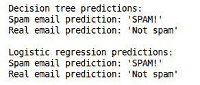

```
predict = (lambda rec, mod: "SPAM!" if mod.predict([rec])[0] == 1 else "Not spam")

print("Decision tree predictions:")
print("Spam email prediction: %r" % predict(fake_email, decision_tree))
print("Real email prediction: %r" % predict(real_email, decision_tree))

print("\nLogistic regression predictions:")
print("Spam email prediction: %r" % predict(fake_email, logistic_regression))
print("Real email prediction: %r" % predict(real_email, logistic_regression))
```

这是我们将在本书中从头构建的实际算法的演示，可以应用于现实世界的问题。

设置环境

我们将继续设置我们的环境。现在我们已经完成了前面的例子，让我们继续设置我们的 Anaconda 环境。其中，Anaconda 是一个依赖管理工具，它允许我们控制我们想要使用的每个包的特定版本。我们将通过这个链接、【https://www.anaconda.com/download/】、进入 Anaconda 网站，并点击下载选项卡。


# 我们正在构建的包不能用于 Python 2.7。因此，一旦您有了 Anaconda，我们将执行一个实际包设置的现场编码示例，以及包含在我们构建的`.yml`文件中的环境设置。

一旦在主目录中设置了 Anaconda，我们将使用`environment.yml`文件。你可以看到我们要创建的环境的名称是`packt-sml`用于监督机器学习。我们将需要 NumPy，SciPy，scikit-learn 和熊猫。这些都是科学计算和数据分析库。Matplotlib 是我们在 Jupyter 笔记本中用来绘制这些图的工具，所以您将需要所有这些图。`conda`包使得构建这个环境变得非常容易。我们所要做的就是键入`conda env create`，然后用`-f`指向该文件，转到`Hands-on-Supervised-Machine-Learning-with-Python-master`，我们将使用`environment.yml`，如以下命令所示:

因为这是你第一次创建它，它会创建一个大的脚本来下载你需要的所有东西。一旦创建了环境，就需要激活它。因此，在 macOS 或 Linux 机器上，我们将键入`source activate packt-sml`。

Once you have Anaconda set up inside the home directory, we are going to use the `environment.yml` file. You can see that the name of the environment we're going to create is `packt-sml` for supervised machine learning. We will need NumPy, SciPy, scikit-learn, and pandas. These are all scientific computing and data analysis libraries. Matplotlib is what we were using to plot those plots inside the Jupyter Notebook, so you're going to need all those plots. The `conda` package makes it really easy to build this environment. All we have to do is type `conda env create` and then `-f` to point it to the file, go to `Hands-on-Supervised-Machine-Learning-with-Python-master`, and we're going to use the `environment.yml` as shown in the following command:

```
cat environment.yml conda env create -f environment.yml
```

As this is the first time you're creating this, it will create a large script that will download everything you need. Once you have created your environment, you need to activate it. So, on a macOS or a Linux machine, we will type `source activate packt-sml`.

如果你在 Windows 上，只需输入`activate packt-sml`，这将激活那个环境:

输出如下所示:

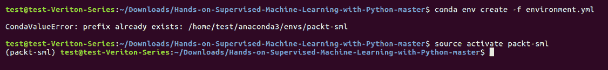

```
 source activate packt-sml
```

为了构建这个包，我们将输入`cat setup.py`命令。我们可以快速检查一下:

看看这个`setup.py`。基本上，这只是使用安装工具来安装软件包。在下面的屏幕截图中，我们可以看到所有不同的子模型:

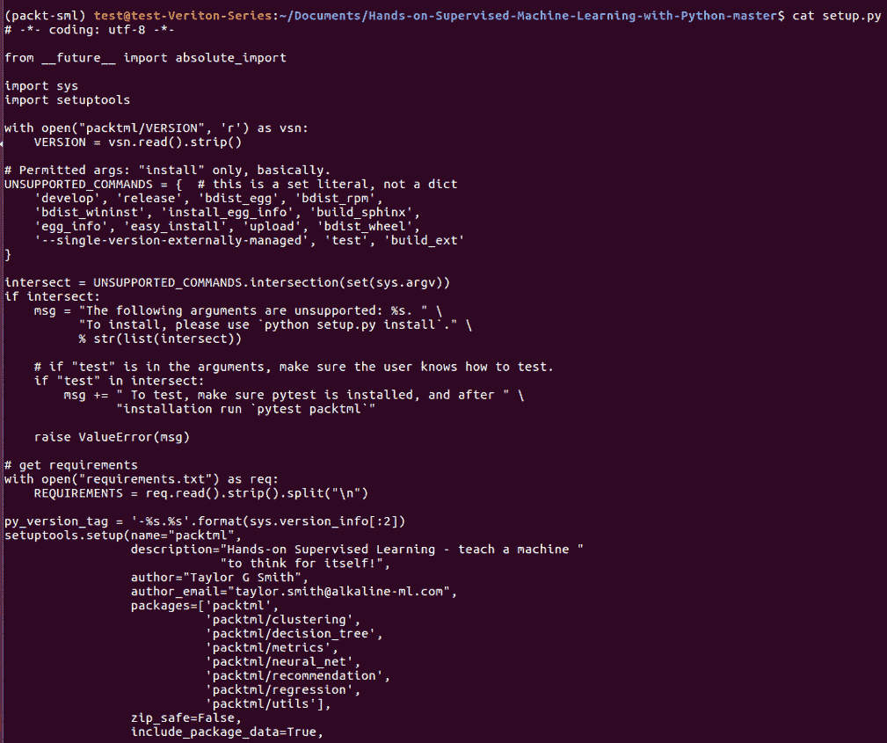

```
cat setup.py
```

我们将通过键入`python setup.py install`命令来构建这个包。现在，当我们进入 Python 并尝试导入`packtml`时，我们得到以下输出:


在本节中，我们已经安装了环境并构建了包。在下一节，我们将开始介绍监督机器学习背后的一些理论。

监督学习

在这一节，我们将正式定义什么是机器学习，特别是什么是监督机器学习。


# Supervised learning

In this section, we will formally define what machine learning is and, specifically, what supervised machine learning is.

在人工智能的早期，一切都是规则引擎。程序员编写函数和规则，计算机只是简单地遵循它们。现代人工智能更符合机器学习，即教会计算机编写自己的函数。有些人可能会质疑这一概念的过于简单化，但从核心来看，这在很大程度上就是机器学习的全部内容。

我们要看一个快速的例子，什么是机器学习，什么不是。这里，我们使用 scikit-learn 的 datasets 子模块来创建两个对象和变量，也称为协方差或特征，它们位于列轴上。`y`是一个向量，其值的数量与`X`中的行数相同。在这种情况下，`y`是一个阶级标签。举例来说，`y`这里可以是对应于真实世界事件的二进制标签，例如肿瘤的恶性程度。`X`是描述`y`的属性矩阵。一个特征可以是肿瘤的直径，另一个特征可以指示其密度。在下面的代码中可以看到前面的解释:

根据我们的定义，规则引擎就是简单的业务逻辑。你需要多简单就有多复杂，但规则是由程序员制定的。在这个函数中，我们将通过返回`1`或`true`来评估我们的`X`矩阵，其中行的总和大于`0`。即使这里涉及到一些数学问题，仍然有一个规则引擎，因为我们，程序员，定义了一个规则。因此，理论上我们可能会进入一个灰色区域，在那里规则本身是通过机器学习发现的。但是，为了便于讨论，让我们举一个例子，首席外科医生任意选择`0`作为我们的阈值，任何高于这个阈值的都被认为是癌性的:

上述代码片段的输出如下:

```
import numpy as np
from sklearn.datasets import make_classification

rs = np.random.RandomState(42)
X,y = make_classification(n_samples=10, random_state=rs)
```

A rules engine, by our definition, is simply business logic. It can be as simple or as complex as you need it to be, but the programmer makes the rules. In this function, we're going to evaluate our `X` matrix by returning `1`, or `true`, where the sums over the rows are greater than `0`. Even though there's some math involved here, there is still a rules engine, because we, the programmers, defined a rule. So, we could theoretically get into a gray area, where the rule itself was discovered via machine learning. But, for the sake of argument, let's take an example that the head surgeon arbitrarily picks `0` as our threshold, and anything above that is deemed as cancerous:

```
def make_life_alterning_decision(X):
    """Determine whether something big happens"""
    row_sums = X.sum(axis=1)
    return (row_sums > 0).astype(int)
make_life_alterning_decision(X)
```

The output of the preceding code snippet is as follows:

```
array([0, 1, 0, 0, 1, 1, 1, 0, 1, 0])
```

现在，如前所述，我们的规则引擎可以简单，也可以复杂。在这里，我们不仅对`row_sums`感兴趣，而且我们有几个标准来满足，以便认为某些东西是癌性的。除了以下三个标准中的一个或多个之外，行中的最小值必须小于`-1.5`:

行总和超过`0`

行的总和可以被`0.5`整除

*   该行的最大值大于`1.5`
*   因此，尽管我们的数学在这里有点复杂，我们仍然只是在构建一个规则引擎:
*   上述代码的输出如下:

现在，假设我们的外科医生理解并意识到他们并不是他们自认为的数学或编程高手。所以，他们雇佣程序员为他们建立一个机器学习模型。模型本身是发现补充决策函数的参数的函数，决策函数本质上是机器本身学习的函数。因此，参数是我们将在下一章[第 2 章](b51fa9b6-9158-4bcf-9998-18a8f91d3d06.xhtml)、*实现参数模型、*中讨论的内容，这些都是参数模型。所以，当我们调用`fit`方法时，在幕后发生的是模型学习数据的特征和模式，以及`X`矩阵如何描述`y`向量。然后，当我们调用`predict`函数时，它将其学习到的决策函数应用于输入数据，以做出有根据的猜测:

```
def make_more_complex_life_alterning_decision(X):
    """Make a more complicated decision about something big"""   
    row_sums = X.sum(axis=1)
      return ((X.min(axis=1) < -1.5) &
              ((row_sums >= 0.) |
               (row_sums % 0.5 == 0) |
               (X.max(axis=1) > 1.5))).astype(int)

make_more_complex_life_alterning_decision(X) 
```

上述代码的输出如下:

```
array([0, 1, 1, 1, 1, 1, 0, 1, 1, 0])
```

所以，现在我们需要明确定义监督学习是什么。监督学习正是我们之前描述的例子。给定我们的示例矩阵， *X* ，在相应标签的向量中， *y* ，其学习近似 *y* 或的值的函数:

```
from sklearn.linear_model import LogisticRegression

def learn_life_lession(X, y):
    """Learn a lesson abd apply it in a future situation"""
    model = LogisticRegression().fit(X, y)
    return (lambda X: model.predict(X))
educated_decision = learn_life_lession(X, y)(X)
educated_decision
```

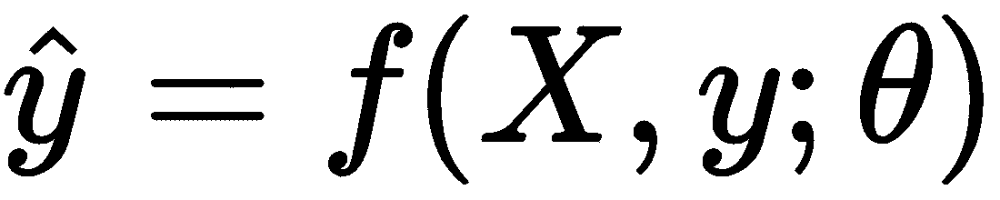

```
array([1, 1, 0, 0, 0, 1, 1, 0, 1, 0])
```

还有其他形式的机器学习是没有监督的，称为**无监督机器学习**。这些没有标签，更适合模式识别任务。所以，被标记的数据的存在使得某些东西被监管。

回到我们之前的例子，当我们调用`fit`方法时，我们学习新的决策函数，然后，当我们调用`predict`时，我们逼近新的`y`值。所以，输出就是我们刚刚看到的这个:

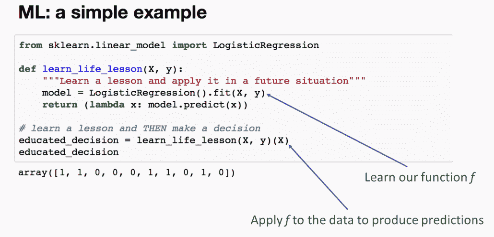

监督学习从带标签的样本中学习一个函数，该函数近似未来的`y`值。在这一点上，你应该对解释抽象的概念感到舒服——只是监督机器学习是什么的高层次想法。

爬山和损失函数

在上一节中，我们熟悉了监督机器学习的概念。现在，我们将学习机器是如何在引擎盖下学习的。本节将考察许多机器学习算法使用的一种常见优化技术，称为**爬山**。它基于这样一个事实，即每个问题都有一个理想状态，并有一种方法来衡量我们离理想状态有多近或多远。需要注意的是，并不是所有的机器学习算法都使用这种方法。


# 损失函数

首先，我们将讨论损失函数，然后，在开始爬山和下坡之前，我们将快速复习一下数学。


# 这节课会有一些数学知识，虽然我们试图避开纯理论的概念，但这是我们为了理解这些算法的本质而必须要做的事情。最后会有一个简短的应用部分。如果你记不住一些微积分，不要惊慌；只是简单地试图抓住黑匣子背后发生的事情。

因此，如前所述，机器学习算法必须测量它与某个目标的接近程度。我们将此定义为成本函数或损失函数。有时，我们听到它被称为目标函数。虽然并非所有的机器学习算法都是为了直接最小化损失函数而设计的，但我们在这里要学习的是规则而不是例外。损失函数的目的是确定模型拟合的良好程度。它通常在模型的学习过程中进行评估，并在模型最大化其学习能力时收敛。

典型的损失函数计算由真实标签和预测标签给出的标量值。也就是给定我们实际的 *y* 和我们预测的 *y* ，也就是。这个符号可能有点神秘，但它的意思是，某个函数， *L* ，我们称之为损失函数，将接受基本事实， *y* 和预测，，并返回一些标量值。损失函数的典型公式如下所示:

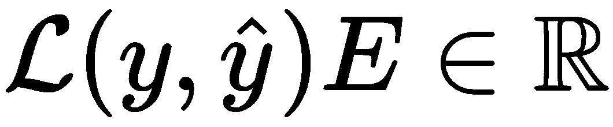

所以，我在这里列出了几个常见的损失函数，它们可能看起来熟悉，也可能不熟悉。**误差平方和** ( **SSE** )是我们将用于回归模型的指标:

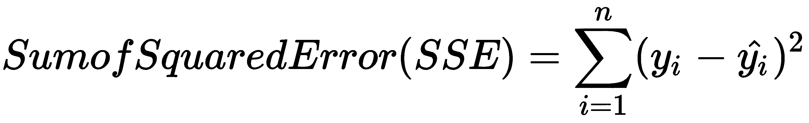

交叉熵是一种非常常用的分类度量:

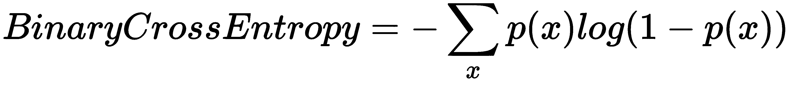

在下面的图表中，左边的 *L* 函数简单地表明它是我们在给定参数θ的 *y* 和上的损失函数。因此，对于任何算法，我们都希望找到使损失最小的θ参数集。也就是说，举例来说，如果我们在预测一栋房子的成本，我们可能希望尽可能准确地估计每平方英尺的成本，以尽量减少我们的错误。

参数通常在比可视表示更高的维度空间中。所以，我们关心的大问题是:我们怎样才能把成本降到最低？对我们来说，尝试每一个可能的值来确定一个问题的真正最小值通常是不可行的。因此，我们必须找到一种方法来降低这种模糊的损失山。困难的是，在任何给定的点，如果没有某种评估，我们不知道曲线是上升还是下降。这正是我们想要避免的，因为它非常昂贵:

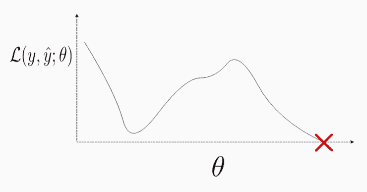

我们可以把这个问题描述为在一个漆黑的房间里醒来，地板不平，试图找到房间的最低点。你不知道房间有多大。你不知道它有多深或多高。你先从哪里开始？我们能做的一件事是检查我们到底站在哪里，并确定我们周围的哪个方向是向下倾斜的。为此，我们必须测量曲线的斜率。

测量曲线的斜率

下面是标量导数的快速复习。为了计算任意给定点的斜率，标准的方法通常是测量我们感兴趣的点和某个割线点之间的直线的斜率，我们称之为 delta *x* :


# 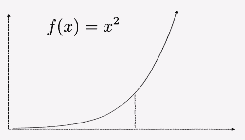

当 *x* 和它的邻居 delta *x* 之间的距离接近 *0* 时，或者当我们的极限接近 *0* 时，我们到达曲线的斜率。这由以下公式给出:

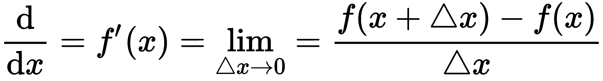

您可能熟悉几种不同的符号。一个是 *x* 的 *f* 质数。常数的斜率为 *0* 。所以，如果 *f(x)* 是 *9* ，换句话说，如果 *y* 仅仅是 *9* ，它永远不变。没有坡度。因此，斜率为 *0* ，如图所示:

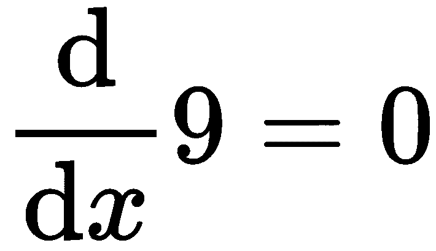

在第二个例子中，我们也可以看到幂律在起作用。这以后会有用的。如果我们将变量乘以幂，然后将幂减 1，我们会得到以下结果:

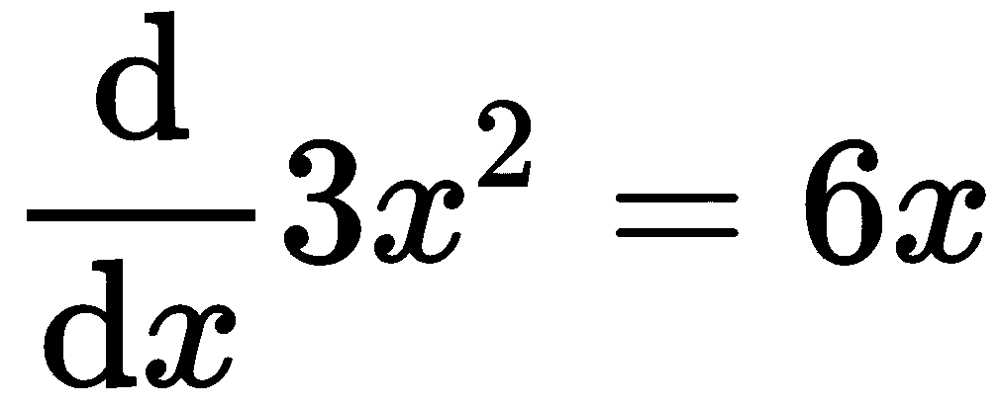

测量 Nd 曲线的斜率

为了测量一个向量或多维曲面的斜率，我们将引入偏导数的概念，偏导数就是相对于一个变量的导数，所有其他变量保持不变。所以，我们的解是一个维数为 *k* 的向量，其中 *k* 是我们函数所取变量的个数。在这种情况下，我们有 *x* 和 *y* 。我们求解的向量中的每个位置都是相对于相应函数的位置变量的导数。


# 从概念层面来说，我们所做的是保持其中一个变量不变，改变它周围的其他变量，来观察斜率是如何变化的。我们分母的符号表示我们用哪个变量来测量，相对于那个点的斜率。因此，在这种情况下，第一个位置， *d(x)* ，显示我们对函数 *f* 相对于 *x* 求偏导数，这里我们保持 *y* 不变。然后，同样地，在第二个例子中，我们对函数 f 相对于 *y* 求导，保持 *x* 不变。所以，我们最后得到的叫做梯度，是一个超级关键词。它只是一个偏导数的向量:


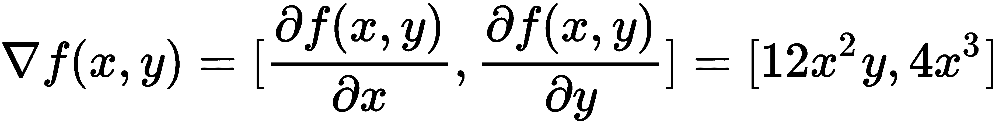

测量多个函数的斜率

不过，我们希望变得非常复杂，同时测量多个函数的斜率。我们最终得到的是一个沿着行的梯度矩阵。在下面的公式中，我们可以看到我们刚刚从上一个示例中解决的解决方案:


# 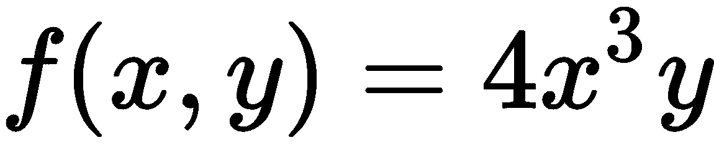

在下一个公式中，我们引入了这个新函数，称为 *g* 。我们看到函数 *g* 的梯度，每个位置对应于变量 *x* 和 *y* 的偏导数:

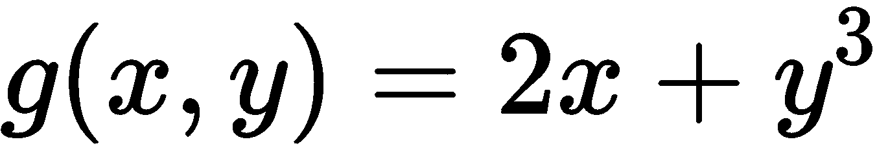

In the next formula, we have introduced this new function, called *g*. We see the gradient for function *g*, with each position corresponding to the partial derivative with respect to the variables *x* and *y*:

当我们把这些堆成一个矩阵时，我们得到的是一个雅可比矩阵。你不需要解决这个问题，但你应该明白，我们正在做的是一个多维曲面的斜率。只要你明白这一点，你就可以把它当作一个黑箱。这正是我们计算梯度和雅可比矩阵的方法:

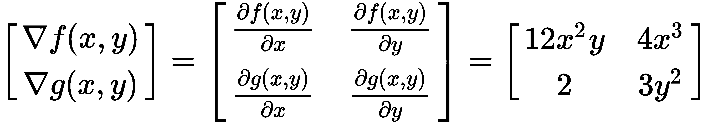

爬山和下山

我们将回到我们的例子——我们看到的失落的山丘。我们希望找到一种方法来选择一组θ参数，使我们的损失函数 *L* 最小。正如我们已经建立的，我们需要爬山或下山，并了解我们相对于相邻点的位置，而不必计算一切。为此，我们需要能够测量曲线相对于θ参数的斜率。所以，回到我们的房子例子，如前所述，我们想知道每平方英尺成本的增量值有多正确。一旦我们知道了这一点，我们就可以开始朝着找到最佳估计值的方向前进。所以，如果你猜错了，你可以掉头朝相反的方向走。因此，我们可以根据我们的度量标准爬山或下山，这允许我们优化我们想要学习的函数的参数，而不管函数本身的表现如何。这是一层抽象。这个优化过程被称为梯度下降，它支持我们将在本书中讨论的许多机器学习算法。


# 下面的代码展示了一个简单的例子，我们如何测量一个矩阵相对于θ的梯度。这个例子实际上是逻辑回归学习部分的一个简化片段:

在最顶端，我们随机初始化`X`和`y`，这不是算法的一部分。所以，`x`这里是 sigmoid 函数，也叫**逻辑函数**。逻辑这个词来自逻辑级数。这是逻辑回归中应用的必要转换。只要明白我们必须应用它；这是功能的一部分。因此，我们初始化我们的`theta`向量，关于它，我们将计算我们的梯度为零。同样，它们都是零。这些是我们的参数。现在，对于每次迭代，我们将得到我们的，这是我们估计的`y`，如果你还记得的话。我们通过将我们的`X`矩阵与我们的θ参数进行点积，通过逻辑函数`h`，也就是我们的，得到这个结果。

现在，我们想要计算残差和预测值的输入矩阵`X`之间的点积的梯度。我们计算残差的方法是简单地用`y`减去，得到残差。现在，我们有了我们的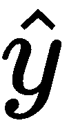。我们如何得到梯度？梯度就是输入矩阵`X`和这些残差之间的点积。我们将使用该梯度来确定我们需要进入的方向。我们的方法是把梯度加到θ向量上。Lambda 调节我们增加或减少梯度的速度。所以，这是我们的学习率。如果你把它想成一个步长——回到那个暗室的例子——如果太大，很容易超过最低点。但是如果太小，你将永远在房间里慢慢移动。所以，这是一种平衡行为，但它允许我们调节更新θ值和降低梯度的速度。同样，这个算法是我们将在下一章讨论的内容。

```
import numpy as np

seed = (42)

X = np.random.RandomState(seed).rand(5, 3).round(4)

y = np.array([1, 1, 0, 1, 0])

h = (lambda X: 1\. / (1\. + np.exp(-X)))

theta = np.zeros(3)

lam = 0.05

def iteration(theta):

    y_hat = h(X.dot(theta))

    residuals = y - y_hat

    gradient = X.T.dot(residuals)
    theta += gradient * lam
    print("y hat: %r" % y_hat.round(3).tolist())
    print("Gradient: %r" % gradient.round(3).tolist())
    print("New theta: %r\n" % theta.round(3).tolist())

iteration(theta)
iteration(theta)
```

我们得到前面代码的输出如下:

这个例子演示了当我们调整系数时，梯度或斜率实际上是如何变化的，反之亦然。

在下一节中，我们将看到如何评估我们的模型，并学习神秘的`train_test_split`。

模型评估和数据分割

在本章中，我们将定义评估模型的意义、衡量模型支持度的最佳实践、如何拆分数据，以及在准备拆分时必须考虑的几个因素。

```
y hat: [0.5, 0.5, 0.5, 0.5, 0.5]
Gradient: [0.395, 0.024, 0.538]
New theta: [0.02, 0.001, 0.027]

y hat: [0.507, 0.504, 0.505, 0.51, 0.505]
Gradient: [0.378, 0.012, 0.518]
New theta: [0.039, 0.002, 0.053]

```

了解机器学习的一些核心最佳实践很重要。作为 ML 实践者，我们的主要任务之一是创建一个有效的模型来对新数据进行预测。但是我们怎么知道一个模型是好的呢？如果您还记得上一节，我们将监督学习定义为一项简单的任务，它从标记数据中学习一个函数，这样我们就可以逼近新数据的目标。因此，我们可以测试我们的模型的有效性。我们可以确定它在从未见过的数据上的表现，就像它在进行测试一样。

样本外与样本内评估


# 假设我们正在训练一台小型机器，这是一项简单的分类任务。这里有一些你需要的术语:样本内数据是模型学习的数据，样本外数据是模型从未见过的数据。许多新数据科学家犯的一个错误是，他们根据模型学习的相同数据来衡量模型的有效性。这最终做的是奖励模型的记忆能力，而不是它的概括能力，这是一个巨大的差异。

如果你看一下这里的两个例子，第一个提供了一个模型学习的样本，我们有理由相信它会预测一个样本，这是正确的。第二个例子展示了一个新的样本，看起来更像 zero 类。当然，模型并不知道这些。但是一个好的模型应该能够识别和概括这种模式，如下所示:

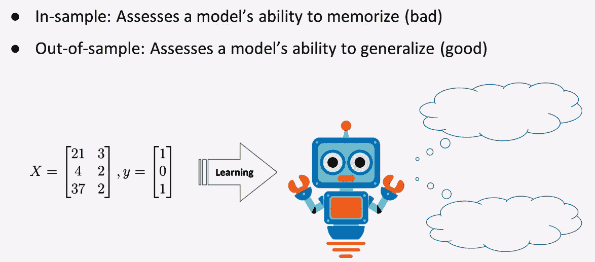


# 因此，现在的问题是，我们如何确保样本内和样本外的数据，以证明模型的价值。更准确地说，我们的样本外数据需要被标记。新的或未标记的数据是不够的，因为我们必须知道实际的答案，以确定模型有多正确。因此，我们在机器学习中处理这一问题的方法之一是将我们的数据分成两部分:训练集和测试集。训练集是我们的模型将要学习的内容；测试集是我们的模型将被评估的基础。你有多少数据很重要。事实上，在接下来的部分中，当我们讨论偏差-方差权衡时，您将看到一些模型比其他模型需要更多的数据来学习。

另一件要记住的事情是，如果你的变量的一些分布是高度倾斜的，或者你有罕见的分类级别嵌入其中，或者甚至在你的`y`向量中有类别不平衡，你可能最终得到一个糟糕的分割。举例来说，假设您的`X`矩阵中有一个二进制特征，该特征指示每 10，000 次出现一次的某个事件存在一个非常罕见的传感器。如果您随机分割您的数据，并且所有积极的传感器事件都在您的测试集中，那么您的模型将从训练数据中了解到传感器从未被触发，并且可能认为这是一个不重要的变量，而实际上，它可能非常重要，并且具有巨大的预测性。所以，你可以通过分层来控制这类问题。

If you take a look at the two examples here, the first presents a sample that the model learned from, and we can be reasonably confident that it's going to predict one, which would be correct. The second example presents a new sample, which appears to resemble more of the zero class. Of course, the model doesn't know that. But a good model should be able to recognize and generalize this pattern, shown as follows:

拆分变得简单

这里，我们有一个简单的片段，演示了如何使用 scikit-learn 库将我们的数据分成训练集和测试集。我们从数据集模块加载数据，并将`X`和`y`传递给 split 函数。我们应该熟悉如何加载数据。我们有来自`sklearn`中`model_selection`子模块的`train_test_split`功能。这需要任意数量的数组。因此，20%将是`test_size`，其余 80%的数据将是训练。我们定义了`random_state`，这样，如果我们必须证明我们是如何得到这种分裂的，我们的分裂是可重复的。还有`stratify`关键字，我们在这里没有使用，它可以用于`stratify`分割稀有特征或不平衡的`y`矢量:

上述代码的输出如下:


# Splitting made easy

摘要

```
from sklearn.datasets import load_boston

from sklearn.model_selection import train_test_split

boston_housing = load_boston() # load data

X, y = boston_housing.data, boston_housing.target # get X, y

X_train, X_test, y_train, y_test = train_test_split(X, y, test_size=0.2,

                                                                                                              random_state=42)

# show num samples (there are no duplicates in either set!)
print("Num train samples: %i" % X_train.shape[0])

print("Num test samples: %i" % X_test.shape[0])
```

在本章中，我们介绍了监督学习，整合了我们的环境，并学习了爬山和模型评估。此时，您应该理解机器学习的抽象概念基础。这都是关于优化一些损失函数。在下一章，我们将跳到参数模型，甚至从头开始编写一些流行的算法。

```
Num train samples: 404
Num test samples: 102
```


# Summary

In this chapter, we introduced supervised learning, got our environment put together, and learned about hill climbing and model evaluation. At this point, you should understand the abstract conceptual underpinnings of what makes a machine learn. It's all about optimizing a number of loss functions. In the next chapter, we'll jump into parametric models and even code some popular algorithms from scratch.