# 二、实现参数模型

在前一章，我们从监督机器学习的基础开始。在这一章中，我们将深入研究参数建模家族中几种流行的监督学习算法。我们将从正式介绍参数模型开始这一章。然后，我们将介绍两个非常流行的参数模型:线性和逻辑回归。我们将花一些时间来看看它们的内部工作方式，然后我们将跳到 Python 中，从头开始编写这些工作方式的代码。

在本章中，我们将讨论以下主题:

*   参数模型
*   从头开始实现线性回归
*   逻辑回归模型
*   从头开始实现逻辑回归
*   参数模型的利与弊


# 技术要求

对于本章，您需要安装以下软件，如果您还没有这样做:

*   Jupyter 笔记本
*   蟒蛇
*   计算机编程语言

本章的代码文件可以在 [https:/ / github 找到。com/ PacktPublishing/
用 Python 监督机器学习](https:/%E2%80%8B/%E2%80%8Bgithub.%E2%80%8Bcom/%E2%80%8BPacktPublishing/%20Supervised-Machine-Learning-with-Python)。


# 参数模型

说到监督学习，有两类学习算法:**参数化**和**非参数化**。这一地区也恰好是看门人和基于意见的猜测的温床，关于哪个更好。基本上，参数模型是有限维的，这意味着它们只能学习限定数量的模型参数。他们的学习阶段通常通过学习一些向量θ来分类，向量θ也被称为**系数**。最后，学习函数通常是一种已知的形式，这一点我们将在本节后面阐明。


# 有限维模型

如果我们回到监督学习的定义，回想一下我们需要学习一些函数， *f* 。参数模型将在有限数量的汇总点内汇总我们的矩阵 *X* 和目标矩阵 *y* 之间的映射。点的数量通常与输入数据中的要素数量相关。所以，如果有三个变量， *f* 会尝试总结出 *X* 和 *y* 之间的关系，假设 theta 中有三个值。这些被称为**模型参数** *f: y=f(X)* 。

让我们回顾并解释一下参数模型的一些特征。


# 参数学习算法的特点

我们现在将介绍参数学习算法的不同特性:

*   模型参数通常被约束到输入空间的相同维度
*   您可以指向一个变量及其相应的参数值，通常可以了解变量的重要性或它与我们的目标 *y* 的关系
*   最后，它们通常速度很快，不需要太多数据


# 参数模型示例

想象一下，我们被要求根据房子的平方英尺和浴室数量来估计房子的价格。我们需要学习多少参数？对于我们的例子，我们需要学习多少参数？

考虑到浴室的面积和数量，我们需要了解两个参数。因此，我们的函数可以表示为给定两个变量的估计价格——平方英尺和浴室数量——P1*和 P2*。 *P1* 将平方英尺与价格的关系。 *P2* 将浴室的数量与价格的关系。**

 **以下代码显示了 Python 中设置的问题。`x1`是我们的第一个变量——平方英尺的数量。你可以看到，价格范围从小到`1200`到大到`4000`，我们的价格范围从`200000`到`500000`不等。在`x2`中，我们有浴室的数量。范围从少至`1`到多至`4`:

```py
import numpy as np
from numpy import linalg

x1 = np.array([2500, 2250, 3500, 4000, 1890, 1200, 2630])
x2 = np.array([3, 2, 4, 3, 2, 1, 2])
y = np.array([260000, 285000, 425000, 482500, 205000, 220000, 320000])
```

现在，你可以从我们的图中看到，这里似乎有一个积极的趋势。这很有道理。但是当我们深入研究这个例子时，我们会发现:

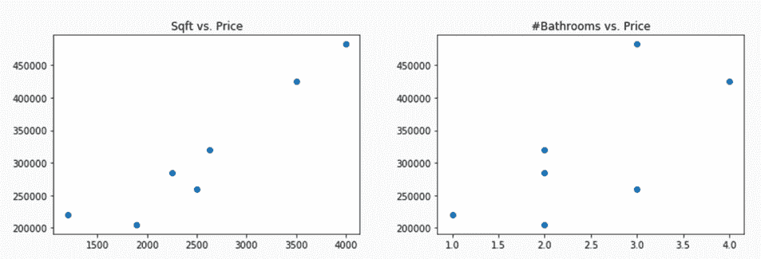

现在，我们想学习一个估计价格的函数，这个函数就是我们数据的每个向量行中估计参数的内积。所以，我们在这里进行线性回归。使用最小二乘方程可以方便地求解线性回归。因为从技术上讲，这个问题有无限多种可能的解决方案，最小二乘法将找到最小化误差平方和的解决方案。

这里，我们完成了对`X`的最小二乘法，并学习了第一个单元格中的参数。然后，在下一个单元格中，我们将`X`乘以我们刚刚学习的θ参数，以获得预测。所以，如果你真的深究一下，只有一栋房子的价值被我们严重低估:倒数第二栋，面积`1200`平方英尺，有一间浴室。所以，它可能是一套公寓，而且可能位于城镇的一个非常热的地区，这就是为什么它的价格如此之高的原因:

```py
# solve for the values of theta
from numpy import linalg
X = np.hstack((x1.reshape(x1.shape[0], 1), x2.reshape(x2.shape[0], 1)))
linalg.lstsq(X, y)[0]

# get the estimated y values
X.dot(linalg.lstsq(X,y)[0])
```

上述代码片段的输出如下:

```py
array([   142.58050018, -23629.43252307])

array([285562.95287566, 273547.26035425, 404514.02053054, 499433.70314259,
       222218.28029018, 147467.16769047, 327727.85042187])
```

现在来分析我们的参数。我们的房子每增加一平方英尺，估计价格就会上涨 142 美元 58 美分，这很直观。然而，我们每增加一个卫生间，我们的房子就会贬值 24000 美元:*价格= 142.58 * sqft+-23629.43 *卫生间*。

这里还有另一个难题。按照这种逻辑，如果我们有一栋 3000 平方英尺、0 间浴室的房子，那么它的价格应该和一栋 4000 平方英尺、4 间浴室的房子差不多。所以，我们的模型显然有一些限制。当我们试图用很少的特征和数据来总结映射时，将会出现一些不合理的结论。但是当我们拟合线性回归时，还有一些我们没有考虑到的因素可以帮助我们。首先，我们不适合截距，我们没有集中我们的特征。所以，如果你回到中学，甚至是高中早期的代数，你会记得，当你在笛卡尔图上拟合直线时，截距是直线与 y 轴相交的地方，我们没有拟合其中之一。

在下面的代码中，我们在求解最小二乘法之前将数据集中，并估计截距，截距就是`y`的平均值，实际价格减去`X` var 的内积，var 是`X`列和估计参数的平均值:

```py
X_means = X.mean(axis=0) # compute column (variable) name
X_center = X - X_means  # center our data
theta = linalg.lstsq(X_center, y)[0]  # solve lstsq
print ("Theta: %r" % theta)

intercept = y.mean() -np.dot(X_means, theta.T) # find the intercept
print("Intercept: %.2f" % intercept)
print("Preds: %r" % (X.dot(theta.T) + intercept))
```

上述代码片段的输出如下:

```py
Theta: array([ 128.90596161, -28362.07260241])
Intercept: 51887.87
Preds: array([289066.55823365, 285202.14043457, 389610.44723722, 482425.50064261,
 238795.99425642, 178212.9533507 , 334186.40584484])
```

以上总结了线性回归背后的数学和概念，以及参数学习的介绍。在线性回归中，我们简单地拟合多个点之间的最佳直线，试图最小化误差平方和。在下一节中，我们将学习 PyCharm，并演示如何从头开始编写一个线性回归类。


# 从头开始实现线性回归

线性回归求解最小二乘方程以发现参数向量θ。在这一节中，我们将浏览一下`packtml` Python 库中的线性回归类的源代码，然后介绍一下`examples`目录中的一个简短的图形示例。

在我们看代码之前，我们将被介绍到支持书中所有估算器的接口。它叫做`BaseSimpleEstimator`，是一个抽象类。它将只执行一个方法，即`predict`。不同的子类层将为不同的模型族执行其他方法。但这一层支持我们将建立的所有模型，因为我们将所有东西放在一起都是监督，所以这一切都需要能够预测。你会注意到签名是在`dock`字符串中指定的。每个模型都将接受签名中的`X`和`y`，以及任何其他模型超参数:

```py
class BaseSimpleEstimator(six.with_metaclass(ABCMeta)):
 """Base class for packt estimators.
 The estimators in the Packt package do not behave exactly like 
 scikit-learn
 estimators (by design). They are made to perform the model fit 
 immediately upon class instantiation. Moreover, many of the hyper
 parameter options are limited to promote readability and avoid
 confusion.
 The constructor of every Packt estimator should resemble the 
 following::
 def __init__(self, X, y, *args, **kwargs):
 ...
 where ``X`` is the training matrix, ``y`` is the training target
 variable,
 and ``*args`` and ``**kwargs`` are varargs that will differ for each
 estimator.
 """
 @abstractmethod
 def predict(self, X):
 """Form predictions based on new data.
 This function must be implemented by subclasses to generate
 predictions given the model fit.
 Parameters
 ----------
 X : array-like, shape=(n_samples, n_features)
 The test array. Should be only finite values.
 """
```


# BaseSimpleEstimator 接口

第一次刷新类似于基于 scikit-learn 估计器接口的刷新。但是有几个不同之处。首先，当我们构建一个模型时，我们不允许有太多的选项。此外，模型在实例化的时候就被训练好了。这也不同于 scikit-learn，因为我们没有一个`fit`方法。Scikit-learn 有一个`fit`方法允许网格搜索和超参数调整。所以，这只是我们不同于他们签名的又一个原因。现在，让我们继续研究线性回归:

1.  如果你有 PyCharm，请打开它。我们将进入`packtml` `Hands-on-Supervised-Machine-Learning-with-Python`库，如下面的代码所示。你可以看到这是在皮查姆。这只是项目级别的根级别，我们将要使用的包是`packtml`。我们将浏览一下所有的`simple_regression.py`文件代码是如何工作的。如果您不使用 PyCharm，Sublime 是一个替代方法，或者您可以使用您喜欢的任何其他文本编辑器:

```py
from __future__ import absolute_import

from sklearn.utils.validation import check_X_y, check_array

import numpy as np
from numpy.linalg import lstsq

from packtml.base import BaseSimpleEstimator

__all__ = [
 'SimpleLinearRegression'
]

class SimpleLinearRegression(BaseSimpleEstimator):
 """Simple linear regression.

 This class provides a very simple example of straight forward OLS
 regression with an intercept. There are no tunable parameters, and
 the model fit happens directly on class instantiation.

 Parameters
 ----------
 X : array-like, shape=(n_samples, n_features)
 The array of predictor variables. This is the array we will use
 to regress on ``y``.
```

位于我们包层内部的`base.py`，将为`BaseSimpleEstimator`提供接口，我们将在整个包中使用它。唯一在抽象层次上强制执行的方法是`predict`函数。该函数将接受一个参数，即`X`。我们已经提到过，监督学习意味着我们将学习一个函数， *f，*给定`X`和`y`，这样我们就可以近似给定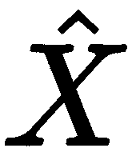，或者在这种情况下的`X`测试。由于每个子类都将实现不同的`predict`方法，我们将使用抽象方法`base`，如下面的代码片段所示:

接下来，在`regression`子模块中，我们将打开`simple_regression.py`文件。这个文件将实现一个名为`SimpleLinearRegression`的类。我们称之为简单，只是为了不与 scikit-learn 线性回归混淆:

`SimpleLinearRegression`要带两个参数。`X`是我们的矩阵协方差，`y`是训练目标，解释如下:

```py
@abstractmethod
   def predict(self, X):
       """Form predictions based on new data.
       This function must be implemented by subclasses to generate
       predictions given the model fit.
       Parameters
       ----------
       X : array-like, shape=(n_samples, n_features)
       The test array. Should be only finite values.
      """
```

2.  Next, inside the `regression` submodule, we will open the `simple_regression.py` file. This file will implement a class called `SimpleLinearRegression`. We call it simple just so you don't confuse it with the scikit-learn linear regression:

```py
from __future__ import absolute_import

from sklearn.utils.validation import check_X_y, check_array

import numpy as np
from numpy.linalg import lstsq

from ..base import BaseSimpleEstimator

__all__ = [
    'SimpleLinearRegression'
]

class SimpleLinearRegression(BaseSimpleEstimator):
    """Simple linear regression.

    This class provides a very simple example of straight forward OLS
    regression with an intercept. There are no tunable parameters, and
    the model fit happens directly on class instantiation.

    Parameters
    ----------
    X : array-like, shape=(n_samples, n_features)
        The array of predictor variables. This is the array we will use
        to regress on ``y``.
```

现在，在我们的签名中，我们在`init`函数中要做的第一件事就是通过 scikit-learn 的`check_X_y`运行它。我们将确保维度在`X`和`y`之间匹配，因为对于我们来说，传递一个小于`X`中样本数量的训练目标向量是行不通的，反之亦然。我们还强制要求`y`中的所有内容都是数字。

接下来我们需要做的是计算`X`中各列的平均值，这样我们就可以将所有内容居中，计算`y`中各值的平均值，这样我们就可以将它们居中。在这个完整的函数中，我们从 NumPy 库中提取了最小二乘优化函数。所以，我们只打算馈入`X`和`y`，它们现在都集中在`lstsq`。我们会得到三个东西，第一个是θ，也就是学习到的参数。所以，`X.theta`将会是`y`的最佳近似值。如果你想深入了解实际解决方案的分解，我们将得到等级，即`matrix`和`singular_values`的等级。正如上一节所讨论的，关于平均房屋成本，如果我们正在计算房屋价值减去`X_means`的内积，则列 means 是一个向量乘以另一个向量 theta。因此，我们将在这里为截距获取一个标量值，并分配一些`self`属性:

```py
Parameters
    ----------
    X : array-like, shape=(n_samples, n_features)
        The array of predictor variables. This is the array we will use
        to regress on ``y``.

    y : array-like, shape=(n_samples,)
        This is the target array on which we will regress to build
        our model.
    Attributes
    ----------
    theta : array-like, shape=(n_features,)
        The least-squares solution (the coefficients)

    rank : int
        The rank of the predictor matrix, ``X``

    singular_values : array-like, shape=(n_features,)
        The singular values of ``X``

    X_means : array-like, shape=(n_features,)
        The column means of the predictor matrix, ``X``

    y_mean : float
        The mean of the target variable, ``y``

    intercept : float
        The intercept term
    """
    def __init__(self, X, y):
        # First check X, y and make sure they are of equal length, no
        NaNs
        # and that they are numeric
        X, y = check_X_y(X, y, y_numeric=True,
                         accept_sparse=False) # keep it simple
```

3.  当你实例化一个类的时候，你已经拟合了一个线性回归。然而，我们必须从`BaseSimpleEstimator`超类中覆盖`predict`函数。要预测这个，你要做的就是计算`X`的内积，`theta`上的新矩阵，以及我们已经学过的参数，然后加上截距。现在，这里与你在构造函数上看到的不同之处在于，我们不需要重新调整`X`的中心。如果进行`X`测试，我们唯一一次集中数据是在我们学习参数的时候，而不是在我们应用参数的时候。然后，我们将`X`乘以参数，那里的内积，然后加上截距。现在我们有了一个预测值的向量:
4.  现在，我们可以看一个例子。在项目级别打开`examples`目录，然后打开`regression`。我们将看看`example_linear_regression.py`文件，如下:

```py

# We will do the same with our target variable, y
X_means = np.average(X, axis=0)
y_mean = y.mean(axis=0)

# don't do in place, so we get a copy
X = X - X_means
y = y - y_mean

# Let's compute the least squares on X wrt y
# Least squares solves the equation `a x = b` by computing a
# vector `x` that minimizes the Euclidean 2-norm `|| b - a x ||^2`.
theta, _, rank, singular_values = lstsq(X, y, rcond=None)

# finally, we compute the intercept values as the mean of the target
# variable MINUS the inner product of the X_means and the coefficients
intercept = y_mean - np.dot(X_means, theta.T)

# ... and set everything as an instance attribute
self.theta = theta
self.rank = rank
self.singular_values = singular_values

# we have to retain some of the statistics around the data too
self.X_means = X_means
self.y_mean = y_mean
self.intercept = intercept
```

让我们来看看这里到底发生了什么，只是为了向您展示我们如何将它应用到真实数据中。我们将加载刚刚创建的线性回归，并导入 scikit-learn 的线性回归，以便我们可以比较结果。我们要做的第一件事是用`500`样本和`2`维度创建随机值的`X`矩阵。然后我们将创建`y`矩阵，这将是第一个`X`变量和`0`的线性组合，它将是第一列的`2`倍加上第二列的`1.5`倍。我们这样做的原因是为了表明我们的线性回归类将学习这些确切的参数，`2`和`1.5`，如下面的代码片段所示:

```py
def predict(self, X):
        """Compute new predictions for X"""
        # copy, make sure numeric, etc...
        X = check_array(X, accept_sparse=False, copy=False) # type: np.ndarray

        # make sure dims match
        theta = self.theta
        if theta.shape[0] != X.shape[1]:
            raise ValueError("Dim mismatch in predictors!")

        # creates a copy
        return np.dot(X, theta.T) + self.intercept

```

5.  正如我们已经讨论过的，我们想要拆分我们的数据。你永远不希望只是评估和拟合你的样本数据；否则，你很容易过度适应:

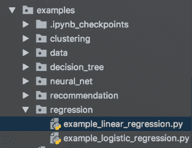

接下来，我们将拟合我们的线性回归并计算我们的预测。所以，我们也可以用我们的断言来证明，我们学到的θ，与我们预期的实际θ非常接近；也就是`2`和`1.5`。因此，我们的预测应该类似于`y`列车输入:

```py
from packtml.regression import SimpleLinearRegression
from sklearn.linear_model import LinearRegression
from sklearn.model_selection import train_test_split
from matplotlib import pyplot as plt
import numpy as np
import sys

# #############################################################################
# Create a data-set that perfectly models the linear relationship:
# y = 2a + 1.5b + 0
random_state = np.random.RandomState(42)
X = random_state.rand(500, 2)
y = 2\. * X[:, 0] + 1.5 * X[:, 1]

```

接下来，我们将拟合 scikit-learn 回归，以表明我们得到了类似的结果，如果不是完全相同的结果的话。我们正在展示我们刚刚创建的类中的θ与 scikit-learn 生成的系数相匹配。Scikit-learn 是一个经过严格测试的著名库。所以，它们匹配的事实表明我们在正确的轨道上。最后，我们可以证明我们的预测非常接近 scikit-learn 解决方案:

```py
# split the data
X_train, X_test, y_train, y_test = train_test_split(X, y,

                                                   random_state=random_state)
```

6.  我们现在将拟合一个类的线性回归，这样我们就可以看到一个图。为此，让我们继续运行以下示例:

```py
# Fit a simple linear regression, produce predictions
lm = SimpleLinearRegression(X_train, y_train)
predictions = lm.predict(X_test)
print("Test sum of residuals: %.3f" % (y_test - predictions).sum())
assert np.allclose(lm.theta, [2., 1.5])

```

7.  转到`Hands-on-Supervised-Machine-Learning-with-Python-master`顶层内的终端:项目层。记住要寻找内容环境的来源。因此，如果您还没有这样做，那么对于 Unix 用户，您将需要`source activate`,或者通过键入以下命令来激活:

```py
# Show that our solution is similar to scikit-learn's

lr = LinearRegression(fit_intercept=True)
lr.fit(X_train, y_train)
assert np.allclose(lm.theta, lr.coef_)
assert np.allclose(predictions, lr.predict(X_test))
```

8.  通过键入文件名运行这个例子，文件名是`examples/regression/example_linear_regression.py`:

```py
# Fit another on ONE feature so we can show the plot
X_train = X_train[:, np.newaxis, 0]
X_test = X_test[:, np.newaxis, 0]
lm = SimpleLinearRegression(X_train, y_train)

# create the predictions & plot them as the line
preds = lm.predict(X_test)
plt.scatter(X_test[:, 0], y_test, color='black')
plt.plot(X_test[:, 0], preds, linewidth=3)

# if we're supposed to save it, do so INSTEAD OF showing it
if len(sys.argv) > 1:
    plt.savefig(sys.argv[1])
else:
    plt.show()
```

9.  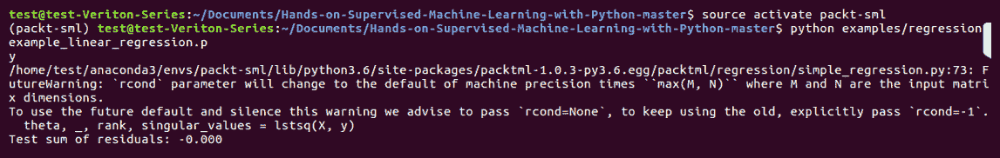

```py
source activate packt-sml
```

10.  Run this example by typing the name of the file, which is `examples/regression/example_linear_regression.py`:

当我们运行前面的代码时，我们应该得到我们的绘图，如下面的屏幕截图所示:

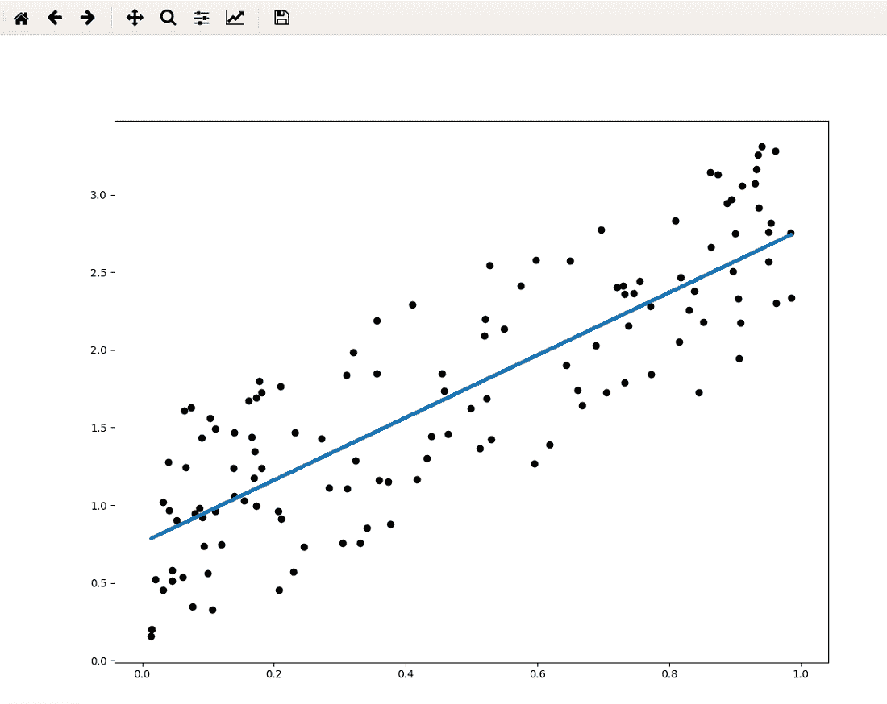

我们可以看到，我们的残差和基本上为零，这意味着我们的预测是正确的。在这种情况下很简单，因为我们创建了一个场景，在这个场景中我们学习了准确的θ值。你可以看到我们在一个变量上拟合的线。考虑到我们只学习了一个变量，这就更接近了。通过 scikit-learn 的预测和系数，它似乎在定性和定量上与我们的预期相匹配。

在下一节中，我们将学习逻辑回归模型。

We can see that our sum of residuals is essentially zero, meaning that we were spot on in our predictions. It is easy in this case, because we created a scenario where we learned our exact theta values. You can see here the line that we're fitting across one variable. This is a bit more approximated given that we only learned it on one variable. It seems to both qualitatively and quantitatively match what we expected via scikit-learn's predictions and coefficients.

In the next section, we will learn about logistic regression models.

逻辑回归模型

在这一节中，我们将看看逻辑回归，这是我们将涉及的第一个爬山算法，我们将简要回顾一下线性回归。我们还将研究逻辑回归在数学和概念上的不同。最后，我们将学习核心算法，并解释它如何进行预测。


# 这个概念

逻辑回归在概念上与线性回归相反。如果我们想要一个离散值或一个类，而不是一个实值，那该怎么办？当我们想要预测一封电子邮件是否是垃圾邮件时，我们已经看到了一个这类问题的例子。因此，使用逻辑回归，我们可以预测类成员的概率，也称为分类，而不是预测真实值。


# 数学

数学上，逻辑回归与线性回归非常相似。我们的参数和 *X* 的内积表示一个类的成员的对数概率，它只是概率的自然对数超过 *1* 减去概率:


# 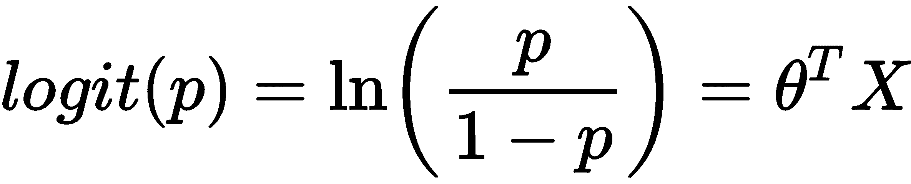

我们真正想要的是类成员的概率。我们可以退出对数赔率，并使用 sigmoid 或逻辑函数来确定概率。

逻辑(sigmoid)变换

在下面的代码中，我们将在`-10`和`10`之间创建一个值的`X`向量，然后应用逻辑转换得到`y`，然后我们可以绘制它:


# 正如你所看到的，我们得到了一条 S 形曲线，原始的`X`值在 *x* 轴上，而`y`值在 *y* 轴上。注意，一切都映射在 y 轴上的 0 和 1 之间。这些现在可以解释为概率:

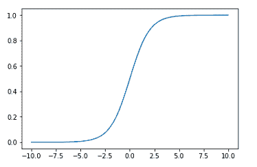

```py
import numpy as np
import matplotlib.pyplot as plt
%matplotlib inline

x = np.linspace(-10, 10, 10000)
y = 1\. / (1 + np.exp(-x)) # sigmoid transformation
plt.plot(x, y)
```

该算法

现在，我们已经在前面的部分简要介绍了逻辑回归算法。但是这里有一个我们如何学习参数的回顾:


# 我们首先将θ初始化为零向量:

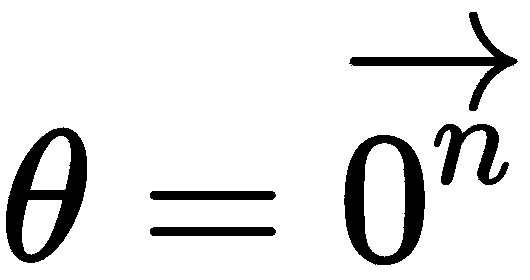

1.  因为这是一个爬山算法，所以它是迭代的。因此，对于每次迭代，我们将对数几率计算为θ转置 *X* ，然后通过逻辑转换对其进行转换:

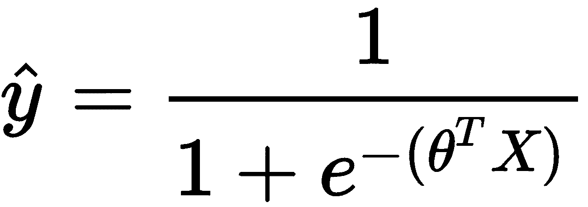

2.  接下来，我们计算梯度，它是函数斜率的偏导数的向量，我们在上一节中已经讨论过了。我们简单地将其计算为 *X* 转置乘以残差， *y - 。*记住 *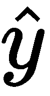* 是现在遵循逻辑转换的概率:

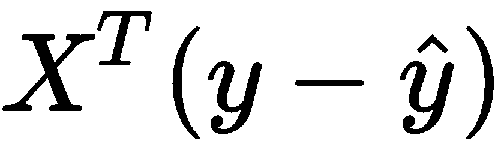

3.  最后，我们可以将系数更新为θ加上梯度。这里还可以看到一个参数，简单来说就是学习率参数。这控制着我们允许系数在每一步增长的幅度:

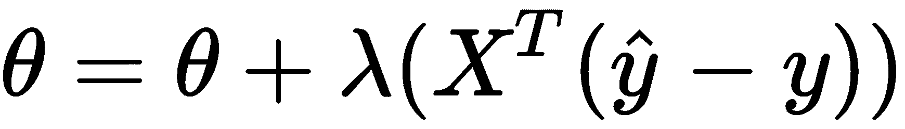

创建预测

4.  我们最终收敛我们的梯度，它不再更新我们的系数，我们只剩下一堆类概率。那么，我们如何做出预测呢？我们所要做的就是超过一个给定的阈值，我们就可以得到类。因此，在这一节中，我们将使用一个二元问题。但是，对于多类，我们可以只对每个类使用 argmax 函数。现在，我们将生成离散预测，如以下代码所示:

上述代码的输出如下:


# 在下一节中，我们将从头开始在`packtml`包中实现逻辑回归。

从头开始实现逻辑回归

```py
sigmoid = (lambda x: 1\. / (1 + np.exp(-x)))
log_odds = np.array([-5.6, 8.9, 3.7, 0.6, 0.])
probas = sigmoid(log_odds)
classes = np.round(probas).astype(int)
print("Log odds: %r\nProbas: %r\nClasses: %r"
      % (log_odds, probas, classes))
```

在这一节中，我们将在`packtml`包中用 Python 实现逻辑回归。我们首先简要回顾一下逻辑回归试图完成的任务，然后查看源代码并看一个例子。

```py
Log odds: array([-5.6, 8.9, 3.7, 0.6, 0\. ])
Probas: array([0.00368424, 0.99986363, 0.97587298, 0.64565631, 0.5 ])
Classes: array([0, 1, 1, 1, 0])
```

In the next section, we will walk through the implementation of logistic regression from scratch in the `packtml` package.


# 回想一下，逻辑回归试图将样本分类到一个离散的类别中，也称为**分类**。逻辑转换允许我们转换从参数和`X`的内积中得到的对数概率。

请注意，我们打开了三个 Python 文件。一个是`extmath.py`，来自`packtml`里面的`utils`目录；另一个是`simple_logistic.py`，来自`packtml`中的`regression`库内；最后一个是一个`example_logistic_regression.py`文件，在`examples`目录和`regression`中。

我们将通过以下步骤深入代码库:

我们将从`extmath.py`文件开始。这里我们将使用两个函数。第一个是`log_likelihood`，这是我们希望在逻辑回归中最大化的目标函数:

`log_likelihood`函数的细节对于理解逻辑回归是如何工作的并不重要。但是，本质上，你在这里可以看到的是，我们将对`y`乘以对数几率进行求和，减去`1`的对数，再加上对数几率的指数。这里的加权本质上是对数几率，即`X.dot(w)`，`w`是我们正在学习的θ。这是目标函数。因此，我们对这些日志进行总结:

We will dive right into the code base using the following steps:

1.  We will start with the `extmath.py` file. There are two functions that we will be using here. The first is `log_likelihood`, which is the objective function that we would like to maximize inside of the logistic regression:

```py
def log_likelihood(X, y, w):
    """Compute the log-likelihood function.

    Computes the log-likelihood function over the training data.
    The key to the log-likelihood is that the log of the product of
    likelihoods becomes the sum of logs. That is (in pseudo-code),

        np.log(np.product([f(i) for i in range(N)]))

    is equivalent to:

        np.sum([np.log(f(i)) for i in range(N)])

    The log-likelihood function is used in computing the gradient for
    our loss function since the derivative of the sum (of logs) is equivalent
    to the sum of derivatives, which simplifies all of our math.
```

2.  The specifics of the `log_likelihood` function are not necessarily critical for understanding how logistic regression works. But, essentially, what you can see here is that we will be summing up `y` times the log odds, minus the log of `1` plus the exponential of the log odds. Weighted here is essentially the log odds, that is, `X.dot(w)`, `w` being the theta that we are learning. This is the objective function. So, we're summing over those logs:

```py
 weighted = X.dot(w)
 return (y * weighted - np.log(1\. + np.exp(weighted))).sum()
```

第二个是`logistic_sigmoid`函数，我们现在将更深入地学习它。这就是我们如何能够退出对数赔率以获得类别概率的方法，该概率简单地等于`1`除以`1`加上负对数赔率的指数，其中`x`是这种情况下的对数赔率:

我们将在逻辑回归类中使用这两个函数。因此，在`simple_logistic.py`中，您将看到一个类似于我们在上一节中使用的线性回归类的类:

现在，这个函数或类扩展了`BaseSimpleEstimator`。我们将在某个时候覆盖`predict`函数，构造函数将拟合模型并学习参数。所以，我们有四个超参数，在这个类中。第一个是`X`，是我们的训练数据；然后`y`，作为我们的训练标签；并且`n_steps`回顾了作为迭代模型的逻辑回归。因此，`n_steps`是我们将执行的迭代次数，其中`learning_rate`是我们的λ。如果你回到算法本身，这控制了给定梯度时我们更新θ的速度，最后，`loglik_interval`。这只是一个辅助参数。计算对数似然性可能非常昂贵。我们可以在下面的代码片段中看到这个解释:

3.  最后，我们得到`theta`、参数`intercept`，然后是`log_likelihood`，这只是在每个间隔计算的对数似然性的列表。我们将首先检查我们的`X`和`y`是否如我们所愿，也就是`0, 1`。我们不会做任何接近 scikit-learn 所能做的事情。我们也不允许不同的字符串类:

```py
def logistic_sigmoid(x):
    """The logistic function.

    Compute the logistic (sigmoid) function over a vector, ``x``.

    Parameters
    ----------
    x : np.ndarray, shape=(n_samples,)
        A vector to transform.
    """
    return 1\. / (1\. + np.exp(-x))
```

4.  接下来，我们要确定它实际上是二进制的。原因是我们正在执行逻辑回归，它在`0`和`1`之间是离散的。有一个回归的一般化，叫做 **softmax 回归**，它将允许我们使用许多不同的类。这是一个多级分类。当我们进入神经网络时，我们会谈到这一点。现在，我们把它限制为一个二元问题。

```py
# -*- coding: utf-8 -*-

from __future__ import absolute_import

from sklearn.utils.validation import check_X_y, check_array

import numpy as np
from packtml.utils.extmath import log_likelihood, logistic_sigmoid
from packtml.utils.validation import assert_is_binary
from packtml.base import BaseSimpleEstimator

__all__ = [
    'SimpleLogisticRegression'
]

try:
    xrange
except NameError: # py 3 doesn't have an xrange
    xrange = range

class SimpleLogisticRegression(BaseSimpleEstimator):
    """Simple logistic regression.

    This class provides a very simple example of straight forward logistic
    regression with an intercept. There are few tunable parameters aside from
    the number of iterations, & learning rate, and the model is fit upon
    class initialization.
```

5.  接下来，我们希望将我们的`X`矩阵居中并标准化。这意味着我们将从`X`中减去列`means`，然后除以它的标准差。因此，我们有均值`0`和标准差`1`:

```py
Parameters
    ----------
X : array-like, shape=(n_samples, n_features)
        The array of predictor variables. This is the array we will use
        to regress on ``y``.

y : array-like, shape=(n_samples,)
        This is the target array on which we will regress to build
        our model. It should be binary (0, 1).

n_steps : int, optional (default=100)
        The number of iterations to perform.

learning_rate : float, optional (default=0.001)
        The learning rate.

loglik_interval : int, optional (default=5)
        How frequently to compute the log likelihood. This is an expensive
        operation--computing too frequently will be very expensive.
```

现在，当我们学习线性回归参数或逻辑回归参数时，我们可以做一些小聪明的事情，这是我们在线性回归中不能做的。我们可以在学习时将截距添加到矩阵中，而不必在事后计算。我们将在`X`矩阵上创建一个 1 的向量作为新特征，如下所示:

正如我们在算法中定义的，我们首先定义θ等于零。`X`中有多少列就有多少参数。对于每次迭代，我们将在这里计算对数概率。然后，我们用逻辑 sigmoid 来转换它。我们将计算我们的残差为`y - preds`。所以，在这一点上，`preds`是或然性。`y`可以被认为是二进制分类问题的分类概率，其中`1`是 100%可能某物属于分类`1`，而`0`是 0%可能某物属于分类`1`:

6.  因此，我们可以从`y`中减去概率，得到我们的残差。为了得到我们的梯度，我们将执行`X`乘以残差，这是那里的内积。记住，梯度是函数斜率的偏导数的向量。

```py
def __init__(self, X, y, n_steps=100, learning_rate=0.001,
                 loglik_interval=5):
        X, y = check_X_y(X, y, accept_sparse=False, # keep dense for example
                         y_numeric=True)

        # we want to make sure y is binary since that's all our example covers
        assert_is_binary(y)

        # X should be centered/scaled for logistic regression, much like
        # with linear regression
        means, stds = X.mean(axis=0), X.std(axis=0)
        X = (X - means) / stds
```

7.  我们将通过增加梯度乘以我们的学习率来更新`theta`和参数。学习率是控制我们学习速度的λ函数。你可能还记得，如果我们学习得太快，我们可能会超越全局最优解，最终得到一个非最优解。如果我们走得太慢，那么我们会适应很长一段时间。逻辑回归是一个有趣的例子；由于这实际上是一个凸优化问题，我们将有足够的迭代次数来达到全局最优。因此，`learning_rate`这里有一点半开玩笑的意思，但这就是通常爬山函数使用`learning_rate`的工作方式:
8.  Next, we want to center and standardize our `X` matrix. That means we're going to subtract the column `means` from `X` and divide it by its standard deviation. So, we have mean `0`, and standard deviation `1`:

```py
# since we're going to learn an intercept, we can cheat and set the
# intercept to be a new feature that we'll learn with everything else
X_w_intercept = np.hstack((np.ones((X.shape[0], 1)), X))
```

9.  Now, we can do something a little bit clever here when we are learning our linear regression parameters, or the logistic regression parameters that we could not do in linear regression. We can add the intercept to the matrix while we learn it, rather than having to compute it after the fact. We will create a vector of ones as a new feature on our `X` matrix, as shown:

```py
 # initialize the coefficients as zeros
 theta = np.zeros(X_w_intercept.shape[1])
```

这里的最后一步是，如果我们在适当的间隔，我们将计算`log_likelihood`。现在，再一次，你可以在每一次迭代中计算这个函数，但是这会花你很长时间。我们可以选择每隔 5 或 10 分钟进行一次，这将让我们看到我们正在优化该功能。但是，与此同时，这意味着我们不必在每次迭代中计算它。

10.  最后，我们将所有这些保存为一个类的实例参数。注意，我们去掉了截距，并尽可能保持`1`向前的参数。这些是非截距参数，我们将在预测的内积中计算:

```py
 # now for each step, we compute the inner product of X and the
 # coefficients, transform the predictions with the sigmoid function,
 # and adjust the weights by the gradient
 ll = []
 for iteration in xrange(n_steps):
     preds = logistic_sigmoid(X_w_intercept.dot(theta))
     residuals = y - preds # The error term
     gradient = X_w_intercept.T.dot(residuals)
```

因此，我们进行逻辑转换为`X`乘以`theta.T`，然后在我们对输入`X`进行集中和标准化后，添加`intercept`，这将给出概率:

11.  但是，为了得到实际的预测，我们只需将概率向上取整。因此，在`predict`函数中，我们将把`predict_proba`向上或向下舍入到 0 或 1，得到类型为`int`，这将给出我们的类 0 和 1:

```py
# update the coefficients
theta += learning_rate * gradient

# you may not always want to do this, since it's expensive. Tune
# the error_interval to increase/reduce this
if (iteration + 1) % loglik_interval == 0:
    ll.append(log_likelihood(X_w_intercept, y, theta))
```

12.  逻辑回归的例子
13.  现在，作为一个例子，我们将看看我们的`example_logistic_regression.py`脚本。我们将比较我们的`simple_logistic_regression.py`文件的输出和 scikit-learn 的输出，并证明我们在输出中获得了相似的(如果不是完全相等的)参数。我们使用 scikit-learn `make_classification`函数创建`100`样本和两个特征，并执行`train_test_split`。首先，我们将我们自己的`SimpleLogisticRegression`与我们刚刚走过的模型相适应，并采取`50`步骤，因为这是一个`50`迭代，如下面的代码所示:

```py
# recall that our theta includes the intercept, so we need to  pop
# that off and store it
self.intercept = theta[0]
self.theta = theta[1:]
self.log_likelihood = ll
self.column_means = means
self.column_std = stds
```

接下来，我们将在几乎没有正则化的情况下计算 scikit-learn 的`LogisticRegression`，并对其进行拟合，如下所示:

```py
# scale the data appropriately
X = (X - self.column_means) / self.column_std

# creates a copy
return logistic_sigmoid(np.dot(X, theta.T) + self.intercept)
```

我们将运行这段代码。通过键入`source activate packt-sml`，确保您已经激活了 Anaconda 环境。

```py
 def predict(self, X):
     return np.round(self.predict_proba(X)).astype(int)
```

如果你用的是 Windows，这将只是`activate packt-sml`。

我们看到我们的测试准确率为 96%，非常接近`Sklearn`的 100%。Scikit-learn 运行更多的迭代，这就是它获得更好准确性的原因。如果我们运行更多的迭代，理论上我们可以得到完美的精确度。在下面的输出中，您可以看到一个完美的线性可分边界。但是，由于我们没有运行同样多的迭代，我们没有达到它。所以，你可以在这个图中看到，我们有这个线性边界，这是我们学过的决策函数，把这两个类分开。左边是一个类，右边是另一个类，如图所示:


# 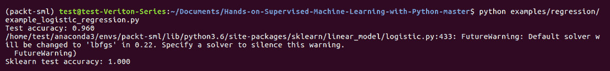

上述代码的输出如下:

```py
# -*- coding: utf-8 -*-

from __future__ import absolute_import

from packtml.regression import SimpleLogisticRegression
from packtml.utils.plotting import add_decision_boundary_to_axis
from sklearn.linear_model import LogisticRegression
from sklearn.datasets import make_classification
from sklearn.model_selection import train_test_split
from sklearn.metrics import accuracy_score
from matplotlib import pyplot as plt
import sys

# #############################################################################
# Create an almost perfectly linearly-separable classification set
X, y = make_classification(n_samples=100, n_features=2, random_state=42,
                           n_redundant=0, n_repeated=0, n_classes=2,
                           class_sep=1.0)

# split data
X_train, X_test, y_train, y_test = train_test_split(X, y, random_state=42)

# #############################################################################
# Fit a simple logistic regression, produce predictions
lm = SimpleLogisticRegression(X_train, y_train, n_steps=50)

predictions = lm.predict(X_test)
acc = accuracy_score(y_test, predictions)
print("Test accuracy: %.3f" % acc)
```

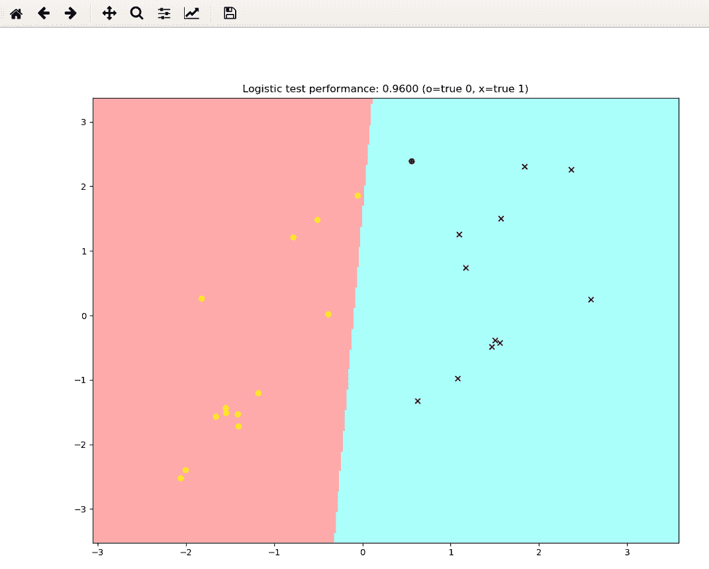

```py
# Show that our solution is similar to scikit-learn's
lr = LogisticRegression(fit_intercept=True, C=1e16) # almost no regularization
lr.fit(X_train, y_train)
print("Sklearn test accuracy: %.3f" % accuracy_score(y_test, 
                                                   lr.predict(X_test)))
```

假设，如果我们运行这个代码一百次甚至更多次，我们可以实现一个完美的线性可分平面，这可以保证一个线性可分的类，因为逻辑回归总是会达到全局最优。我们也知道我们的公式与 scikit-learn 的公式完全相同。所以，这只是我们在那里运行了多少次迭代的问题。

在下一节中，我们将看看参数模型的一些优点和缺点。

We see that our test accuracy is 96%, which is pretty close to `Sklearn` at 100%. Scikit-learn runs more iterations, which is why it gets better accuracy. If we ran more iterations, we could theoretically get perfect accuracy. In the following output, you can see a perfectly linearly separable boundary here. But, since we haven't run as many iterations, we're not hitting it. So, what you can see in this diagram is that we have this linear boundary, which is the decision function we've learned, separating these two classes. On the left, you have one class, and on the right, you have another, as shown:

参数模型的利与弊

参数模型有一些非常方便的属性。也就是说，它们拟合速度快，不需要太多的数据，并且很容易解释。在线性和逻辑回归的情况下，很容易查看系数并直接解释一个变量在任一方向上波动的影响。在金融或保险等受监管行业，参数模型往往占据主导地位，因为它们可以很容易地向监管者解释。商业伙伴倾向于真正依赖这些系数产生的洞察力。然而，正如我们到目前为止已经看到的，它们倾向于过于简化。因此，作为一个例子，我们在上一节中看到的逻辑回归决策边界假设两个类之间有一个完美的线性边界。

现实世界很少能被约束成线性关系。也就是说，模型非常简单。它们并不总是抓住变量之间关系的真正细微差别，这有点像一把双刃剑。此外，它们受到离群值和数据规模的严重影响。所以，你必须非常小心地准备数据。这是我们必须确保在拟合之前居中并缩放数据的原因之一。最后，如果你给你的模型添加数据，它们不太可能变得更好。这引入了一个新概念，我们称之为偏差。

偏差引起的误差是我们将在后续章节中讨论的一个概念。这是一个过于简化的模型的结果。在下图中，我们的模型通过将一个`logit`函数视为线性函数来简化它:

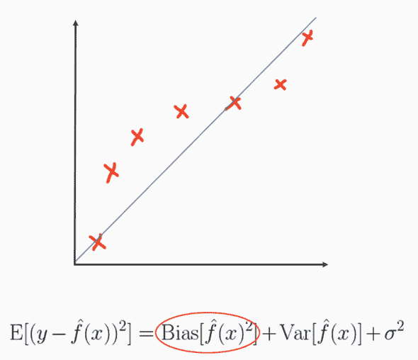

这也称为**欠拟合**，在参数模型族中很常见。有几种方法可以对抗高偏差，其中大部分我们将在下一章介绍。但是，本着探索参数模型的缺点的精神，在这里指出其中一些是值得的。如前所述，在高偏差情况下，我们无法添加更多数据来学习更好的函数。如果我们以前面的例子为例，如果你沿着 logit 线增加更多的样本，我们的学习线或蓝线将不再接近真实函数，因为它是线性的。它不够复杂，不足以模拟真正的底层函数，这是许多参数模型简单的不幸后果。更多的模型复杂性和复杂的非线性特征通常有助于校正高偏差。


# 摘要

在这一章中，我们介绍了参数模型。然后，在转到 Python 中的实现之前，我们讨论了线性逻辑回归的低级数学。既然我们已经讨论了参数模型的一些优点和缺点，那么在下一章中，我们将看看一些非参数模型。

It is rare that the real world can be constrained into linear relationships. That said, the models are very simple. They don't always capture the true nuances of relationships between variables, which is a bit of a double-edged sword. Also, they're heavily impacted by outliers and data scale. So, you have to take great care with data preparation. This is one of the reasons that we had to make sure we centered and scaled our data before fitting. Finally, if you add data to your models, it's unlikely that they're going to get much better. This introduces a new concept, which we're going to call bias.

Error due to bias is a concept we will talk about in subsequent chapters. It's the result of a model that is oversimplified. In the following diagram, our model oversimplifies a `logit` function by treating it as linear:


This is also known as **underfitting**, which is common within the parametric model family. There are several ways to combat high bias, most of which we will introduce in the next chapter. But, in the spirit of exploring the drawbacks of parametric models, it's worth pointing some of them out here. As mentioned before, we cannot add more data to learn a better function in high-bias situations. If we take the previous example, if you were to add more samples along the logit line, our learned or blue line would not approach the true function any more than it already has, because it's linear. It's not complex enough to model the true underlying function, which is an unfortunate consequence of the simplicity of many parametric models. More model complexity and complex nonlinear features usually help to correct high bias.


# Summary

In this chapter, we were introduced to parametric models. We then walked through the low-level math of linear logistic regression, before moving on to implementations in Python. Now that we've covered some of the pros and cons of parametric models, in the next chapter, we will take a look at some non-parametric models.**