# 监督机器学习的高级主题

在这一章中，我们将关注一些高级主题。我们将讨论两个主题:推荐系统和神经网络。我们将从协同过滤开始，然后将基于内容的相似性集成到协同过滤系统中。我们将进入神经网络并转移学习。最后，在学习 Python 代码之前，我们将介绍每种方法背后的数学和概念。

我们将讨论以下主题:

*   推荐系统和协作过滤介绍
*   矩阵分解
*   基于内容的过滤
*   神经网络和深度学习
*   使用迁移学习


# 技术要求

对于本章，您需要安装以下软件，如果您还没有这样做:

*   Jupyter 笔记本
*   蟒蛇
*   计算机编程语言

本章的代码文件可以在 [https:/ / github 找到。com/ PacktPublishing/
用 Python 监督机器学习](https://github.com/PacktPublishing/Supervised-Machine-Learning-with-Python)。


# 推荐系统和协作过滤介绍

在这一部分，我们将讨论协同过滤和推荐系统。我们将从解释什么可能构成推荐系统开始，用户如何在不知情的情况下自愿分享关于他们自己的大量数据，然后我们将讨论协同过滤。

不管你是否意识到，你每天都在与众多的推荐系统互动。如果你曾经在亚马逊上购物，或者在脸书上浏览，或者在网飞上观看过一个节目，你就会得到某种形式的个性化内容。这就是电子商务平台如何最大限度地提高转化率，并让你再次购买。

一个真正好的推荐系统的标志之一是它知道你想要什么，不管你是否已经知道。一个好的会让你很好奇:他们是怎么知道的？因此，事实证明，人类的行为是非常可预测的，即使不必分享关于他们自己的信息，我们称之为用脚投票，这意味着用户可能声称喜欢一种类型的电影，比如喜剧，但不成比例地消费另一种类型的电影，比如爱情片。所以，推荐系统的目标只是让你上钩；然而，次要目标通常因平台本身而异。它可以是最大化销售收入，创造客户满意度，或任何数量的其他指标。但真正让这些变得如此有趣的是，它们可以被人类直接消费，而如此多的其他**机器学习** ( **ML** )模型的存在可以取代自动化过程。

这里有一个例子，解释用脚投票:


这位用户说他喜欢足球、辣鸡翅和滑水。然而，他的收视率历史表明，他竖起大拇指去了一家翼餐厅，竖起大拇指去了另一家，然后竖起大拇指去了一家电影院。所以，这意味着他不喜欢第二翼餐厅的某些东西。可能是环境的原因，也可能是鸡翅酱。不管是什么，他对辣鸡翅的兴趣——他声称对辣鸡翅的兴趣——比他最初让我们相信的要微妙得多。同样，他表达了对电影的兴趣，尽管他没有透露。所以，这里的要点是，人们用行动说的比用言语说的多，而且他们对行动比对言语更诚实。我们可以利用推荐系统来学习商品和人们兴趣之间的微妙模式。

协同过滤是一种常见的推荐系统。它基于一个被称为**同性**的概念，基本上是*物以类聚*。所以，也就是说，如果你喜欢某样东西，同样喜欢那件东西的人很可能和你有一些其他的共同兴趣；现在我们有了一个很好的兴趣池，可以开始互相推荐东西了。

在典型的协同过滤系统中，我们的数据将会是这样的格式:

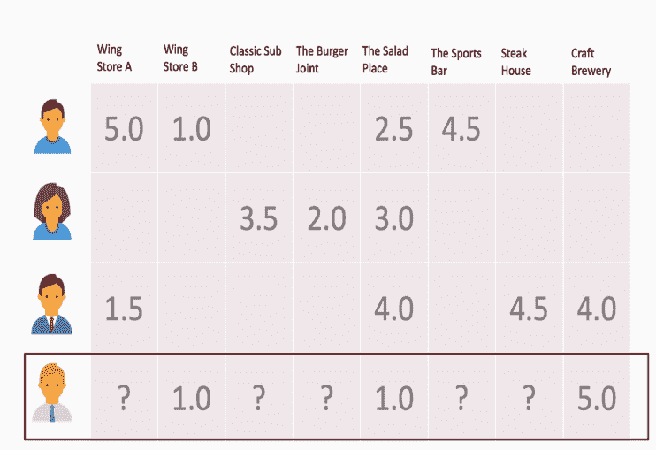

在前面的屏幕截图中，用户沿着 *y* 轴显示，它们是行，而项目沿着 *x* 轴显示，它们是列。你可能有明确的评级，通常是连续的，或者隐含的，通常是二元的。我们在这里展示的是明确的。我们试图回答的问题是，用户的预测评分是多少？但是为了达到这个目的，我们必须以某种方式计算项目之间的相似性。这是一种协作过滤的形式，称为项目到项目的协作过滤，我们只能计算由用户共同评价的项目之间的相似性。这通常对明确评级的系统最有效；它基于亚马逊几年前发表的一篇论文。

计算项目之间的相似性很简单。我们可以使用几种常见的度量标准之一来计算成对相似性，包括**皮尔逊相关**或余弦相似性。例如，我们将使用余弦相似度如下:

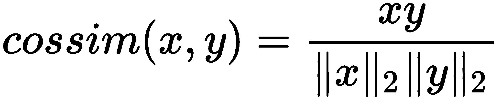

它的计算方式与我们在[第三章](028b1786-df10-4e2b-96be-541675edd2cd.xhtml)、*中使用非参数模型*、**欧几里德距离**研究聚类的方式非常相似。然而，这是计算相似性而不是空间距离。因此，它是概念的精确逆，但是以相似的方式计算。

由于我们的数据非常稀疏，我们将首先使用 SciPy 将其放入稀疏的 CSR 矩阵中，而不是必须存储 32 个元素，现在我们只需存储 14 个:

```
from scipy import sparse
import numpy as np

rows = np.array([0,0,0,0,1,1,1,2,2,2,2,3,3,3])
cols = np.array([0,1,4,5,2,3,4,0,4,6,7,1,4,7])
data = np.array([5.,1.,2.5,4.5,3.5,2.,3.,1.5,
                 4.,4.5,4.,1.,1.,5.])
# Make a sparse matrix
R = sparse.csr_matrix((data, (rows, cols)), shape = (4, 8))
print(R.todense())
```

上述代码的输出如下:

```
[[5\. 1\. 0\. 0\. 2.5 4.5 0\. 0\. ]
 [0\. 0\. 3.5 2\. 3\. 0\. 0\. 0\. ]
 [1.5 0\. 0\. 0\. 4\. 0\. 4.5 4\. ]
 [0\. 1\. 0\. 0\. 1\. 0\. 0\. 5\. ]]
```

这是一个基于我们实际看到的密集矩阵。所以，你可以想象当我们有成千上万的用户和数以百万计的商品时，这将变得多么方便——例如，亚马逊就是如此。

我们只需要计算矩阵转置的成对余弦相似度。这里有很多零。这并不是说很多都是正交的，从数学上来说，余弦相似度用 0 来表示；那就是我们正在经历一种被称为“冷启动”的东西，其中有几个项目从未被共同评定过。因此，我们不能有效地仅基于评级来计算相似性。

现在，我们将看到如何为给定用户生成预测，给出他们在计算项中的历史相似性。在下面的例子中，我们使用同一个用户，我们只是预测`user_3`:

```
from sklearn.metrics.pairwise import cosine_similarity

# Compute the sim matrix
sim = cosine_similarity(R.T).round(3)
sim
top_k = 3
user_3 = np.array([0., 1., 0., 0., 1., 0., 0., 5.])

# compute dot product btwn user vec and the sim matrix
recommendations = user_3.dot(sim)
item_indices = np.arange(recommendations.shape[0])

# now arg sort descending (most similar items first)
order = np.argsort(-recommendations)[:top_k]
items = item_indices[order]

# zip them together (item, predicted rating)
list(zip(items, recommendations[order]))
```

上述代码的输出如下:

```
[(7, 6.130000000000001), (4, 4.326), (1, 4.196)]
```

因此，在这个算法中，计算预测非常简单。您只需计算用户评分向量和相似度矩阵的点积。然后，`argsort`按照降序排列，与我们处理最近邻的方式非常相似，但是降序与升序相反。所以，这里有需要注意的地方。第一，预测评级超过了`6.12`的地面真实评级规模。我们最多只能评定五个等级，但我们不能保证一定的等级。因此，我们可以调用这些评级或使用其他策略，但其他两个评级实际上是用户之前已经评级的。如果你回头看看评分矩阵，这两个都被用户评为一星。因此，我们可以看到，这不是一个伟大的推荐模型，它的排名和用户数量都很低。

推荐系统在技术上是监督学习，但它们不同于传统意义上的 *x* ， *y* 配对，因为我们的基础事实在技术上是我们的数据本身。因此，在我们的示例中，我们可以查看第四项和第一项的评分，并说明我们与实际情况的差距。


# 项目对项目的协同过滤

让我们看看代码。这是项目对项目的协同过滤。让我们从出现在`packtml/recommendation`中的`base.py`文件开始:

```
class RecommenderMixin(six.with_metaclass(ABCMeta)):
    """Mixin interface for recommenders.

    This class should be inherited by recommender algorithms. It provides an
    abstract interface for generating recommendations for a user, and a
    function for creating recommendations for all users.
    """
    @abstractmethod
    def recommend_for_user(self, R, user, n=10, filter_previously_seen=False,
                           return_scores=True, **kwargs):
        """Generate recommendations for a user.

        A method that should be overridden by subclasses to create
        recommendations via their own prediction strategy.
        """

    def recommend_for_all_users(self, R, n=10,
                                filter_previously_seen=False,
                                return_scores=True, **kwargs):
        """Create recommendations for all users."""
        return (
            self.recommend_for_user(
                R, user, n=n, filter_previously_seen=filter_previously_seen,
                return_scores=return_scores, **kwargs)
            for user in xrange(R.shape[0]))
```

这个`base`级叫做`RecommenderMixin`。它只是一个界面。有两种方法:一种是已经为所有子类编写好的，那就是`recommend_for_all_users`；另一个是`recommended_for_user`。因此，我们需要基于子类覆盖它。我们要看的子类是项目对项目的协同过滤。

在下面的`itemitem.py`文件中，我们看到两个参数:

```
 def __init__(self, R, k=10):
        # check the array, but don't copy if not needed
        R = check_array(R, dtype=np.float32, copy=False) # type: np.ndarray

        # save the hyper param for later use later
        self.k = k
        self.similarity = self._compute_sim(R, k)

    def _compute_sim(self, R, k):
        # compute the similarity between all the items. This calculates the
        # similarity between each ITEM
        sim = cosine_similarity(R.T)

        # Only keep the similarities of the top K, setting all others to zero
        # (negative since we want descending)
        not_top_k = np.argsort(-sim, axis=1)[:, k:] # shape=(n_items, k)

        if not_top_k.shape[1]: # only if there are cols (k < n_items)
            # now we have to set these to zero in the similarity matrix
            row_indices = np.repeat(range(not_top_k.shape[0]),
                                    not_top_k.shape[1])
            sim[row_indices, not_top_k.ravel()] = 0.

        return sim

    def recommend_for_user(self, R, user, n=10,
                           filter_previously_seen=False,
                           return_scores=True, **kwargs):
        """Generate predictions for a single user.
```

我们有`R`和`k`。`R`，这是我们的评级矩阵，它不同于其他基本估计量，因为我们没有相应的`y`值。`R`是我们的地面真理以及训练阵列。`k`是一个参数，我们可以用它来限制相似项目的最大数量。它有助于减少我们比较的空间，使计算更容易。因此，对于构造函数来说，拟合过程只是通过`compute_sim`函数计算相似性数组。我们取`R`数组，转置它，使项目沿着行轴，然后我们计算行之间的余弦相似性，这就是现在的项目。我们有一个 *n x n* 矩阵，第一个 *n* 代表 11 月矩阵，第二个 *n* 是项目数量的维度。基本上，我们会说任何不在`top_k`中的东西，我们会设置相似度为零。这里的一个策略是，它允许我们以某种方式增加我们的相似性矩阵，否则，我们不能。这就是我们正在做的:按降序排列。我们首先想要最相似的，沿着列的 argsorting。我们获取相似性矩阵并将其存储在`self.similarity`中。我们在计算预测时会用到它。

所以，`recommend_for_user`是我们在超抽象接口中要覆盖的函数。我们可以提出几个论点。因此，我们有了用户向量，这是一个索引，还有 *n* ，这是我们想要产生的推荐数量。现在我们从`R`中得到`user_vector`:

推荐——原始推荐——是用户向量和相似性矩阵之间的内积，这在 NumPy 中产生了一个 *nD* 或 *1D* 数组。

我们借助 NumPy 中的`arange`方法得到`item_indices`:

我们将根据推荐的降序来排序。现在，如果我们愿意，我们可以将它们限制在顶部`n`。

We have `R` and `k`. `R`, which is our ratings matrix, it is different from other base estimators in that we don't have the corresponding `y` value. `R` is our ground truth as well as the training array. `k` is a parameter that we can use to limit the top number of items that are similar. It helps reduce our space that we're comparing within and makes computations easier. So, for the constructor, the fit procedure is simply computing the similarity array via the `compute_sim` function. We take the `R` array, transpose it so items are along the row axis, and then we compute the cosine similarity between the rows, which are now the items. We have an *n x n* matrix, the first *n* stands for the November matrix and the second *n* is the dimensionality of the number of items. Basically, we're going to say anything that's not in `top_k`, we'll set to zero similarity. One of the strategies here is that it allows us to augment our similarity matrix in a way that, otherwise, we couldn't. And that's what we're doing: argsorting into the descending order. We want the most similar first, argsorting along the columns. We take the similarity matrix and store that in `self.similarity`. And we're going to use that when we compute predictions.

如果你想对每件事都产生推荐，你可以把`None`作为`n`传递。我们将返回`items`、`indices`和`recommendations`，它们是每个相应项目的预测评分，如下所示:

```
# check the array and get the user vector
R = check_array(R, dtype=np.float32, copy=False)
user_vector = R[user, :]
```

我们转到`example_item_item_recommender.py`文件。我们将加载名为`get_completely_fabricated_ratings_data`的有趣的`titled`数据集，它在`data.py`文件中可用。这里，我们有几个用户，如下面的代码所示:

We get `item_indices` with the help of an `arange` method in NumPy:

```
# compute the dot product between the user vector and the similarity
# matrix
recommendations = user_vector.dot(self.similarity) # shape=(n_items,)

# if we're filtering previously-seen items, now is the time to do that
item_indices = np.arange(recommendations.shape[0])
if filter_previously_seen:
    rated_mask = user_vector != 0.
    recommendations = recommendations[~rated_mask]
    item_indices = item_indices[~rated_mask]
```

We're going to order this based on the descending `argsort` of the recommendations. Now we can limit them to the top `n` if we want to.

假设用户 0 是经典的 30 岁千禧一代，热爱 90 年代的怀旧。所以，他们对`The Princess Bride`、`Ghost Busters`、`Ghost Busters 2`评价很高。用户 1，40 岁，只喜欢动作片。于是，他们评了`Die Hard`和`Pulp Fiction`。用户 2 是一个 12 岁的孩子，他的父母相当严格，所以我们可以假设用户 2 没有看过`Pulp Fiction`或类似的东西。但是用户 2 已经观看了`Ghost Busters`、`Ghost Busters 2`和`The Goonies`。用户 2 对它们的评价都很高。用户 3 已经看到了这一切。用户 4 刚刚开了一个网飞账户，还没有机会看太多。因此，用户 4 可能是我们有兴趣为其产生推荐的用户。

所有这些都是一个 NumPy 数组。我们正在返回一个密集数组。您可以将此作为稀疏数组返回。

在`examples/recommendation`中的`example_item_item_recommender.py`文件中，我们将从`get_completely_fabricated_ratings_data`中获取`R`评级矩阵和`titles`:

```
# now arg sort descending (most similar items first)
order = np.argsort(-recommendations)[:n]
items = item_indices[order]

if return_scores:
   return items, recommendations[order]
return items
```

我们用`k=3`创建一个`recommender`项目。我们只保留每个项目的三个最相似的对应项目。然后我们为用户 0 产生推荐。

```
    return (np.array([
        # user 0 is a classic 30-yo millennial who is nostalgic for the 90s
        [5.0, 3.5, 5.0, 0.0, 0.0, 0.0, 4.5, 3.0,
         0.0, 2.5, 4.0, 4.0, 0.0, 1.5, 3.0],

        # user 1 is a 40-yo who only likes action
        [1.5, 0.0, 0.0, 1.0, 0.0, 4.0, 5.0, 0.0,
         2.0, 0.0, 3.0, 3.5, 0.0, 4.0, 0.0],

        # user 2 is a 12-yo whose parents are strict about what she watches.
        [4.5, 4.0, 5.0, 0.0, 0.0, 0.0, 0.0, 4.0,
         3.5, 5.0, 0.0, 0.0, 0.0, 0.0, 5.0],

        # user 3 has just about seen it all, and doesn't really care for
        # the goofy stuff. (but seriously, who rates the Goonies 2/5???)
        [2.0, 1.0, 2.0, 1.0, 2.5, 4.5, 4.5, 0.5,
         1.5, 1.0, 2.0, 2.5, 3.5, 3.5, 2.0],

        # user 4 has just opened a netflix account and hasn't had a chance
        # to watch too much
        [0.0, 0.0, 0.0, 0.0, 2.0, 0.0, 0.0, 0.0,
         0.0, 0.0, 0.0, 1.5, 4.0, 0.0, 0.0],
    ]), np.array(["Ghost Busters", "Ghost Busters 2",
                  "The Goonies", "Big Trouble in Little China",
                  "The Rocky Horror Picture Show", "A Clockwork Orange",
                  "Pulp Fiction", "Bill & Ted's Excellent Adventure",
                  "Weekend at Bernie's", "Dumb and Dumber", "Clerks",
                  "Jay & Silent Bob Strike Back", "Tron", "Total Recall",
                  "The Princess Bride" ]))
```

如果我们运行`example_item_item_recommender.py`文件，让我们看看用户 0 排名前三的电影是什么:

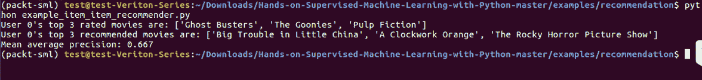

用户 0 评分最高的三部电影分别是:`Ghost Busters`、`The Goonies`和`Pulp Fiction`。这意味着用户 0 高度评价了`Ghost Busters`和`The Goonies`，但没有评价`Pulp Fiction`。

我们还可以看到，平均精度大约是 2/3。平均精度是我们将用于推荐系统的一个指标。它实际上来自信息检索领域。它不像，比如说，平均绝对误差或均方误差。我们所做的是陈述我们推荐的那些存在于地面真实集合中的比例。在这种情况下，它意味着哪些用户一开始就评价很高，这表明我们生产的产品非常好。

```
# #############################################################################
# Use our fabricated data set
R, titles = get_completely_fabricated_ratings_data()

# #############################################################################
# Fit an item-item recommender, predict for user 0
rec = ItemItemRecommender(R, k=3)
user0_rec, user_0_preds = rec.recommend_for_user(
    R, user=0, filter_previously_seen=True,
    return_scores=True)
```

矩阵分解

在这一部分，我们将研究推荐系统并介绍矩阵分解技术。在典型的协同过滤问题中，我们在一个轴上有用户，在另一个轴上有商品或报价。我们希望解决任何给定项目的用户的预测评级，但要达到这一点，我们必须以某种方式计算用户或项目之间的亲和力。在上一节中，我们研究了项目到项目的协同过滤，其中我们使用余弦相似性度量来显式计算相似性矩阵，但现在我们想探索一种方法，该方法不会显式比较项目到项目或用户到用户。

矩阵分解是一种协作过滤的形式，关注产品的无形资产。例如，在概念层面上，每一种产品或每一家餐馆都有无形的东西让你喜欢、不喜欢或对它们漠不关心。例如，对于一家餐馆，也许你感受到的气氛或氛围比菜单更重要。或者，考虑下面的陈述:食物很难吃，但快乐时光很棒。在这种情况下，我们感兴趣的是了解隐藏或潜在的变量，这些变量是数据模式的基础和表现。

矩阵分解将允许我们通过将我们的单个评级矩阵分解成两个低秩矩阵来发现这些潜在变量，这两个低秩矩阵相乘时，近似原始评级矩阵。直观地说，我们正在学习这些隐藏的因素或潜在的变量，并学习我们的用户和项目如何对它们进行评分。如下图所示，其中一个低等级矩阵映射了用户对所发现因素的密切关系，另一个映射了项目在因素上的排名:


矩阵因式分解的一个缺点是在组成一个因子的背后缺乏清晰度或直觉。这类似于一种**主成分**分析( **PCA** )类型的技术，其中一个因素可以被概念化为一个主题。一个细心的、有洞察力的、拥有大量主题专业知识的分析师可以从主题中提取出意义，但是这样做非常困难，因此，考虑到其难度，通常不会进行这种分析。例如，也许上图中的**因子 1** 是一个多变的大气。因此，鸡翅店被分为不同的等级。正如你在上图的右边所看到的，在**机翼商店 A** 和第一个因素**潜水杆**之间有很强的关联性。你也可以假设**运动酒吧**在那个尺度上的评级可能相当高。那么，也许**因素 2** 是一个有一些健康意识选项的地方。因此，这种联系的强度是一个人或一个产品相对于潜在因素的等级。您可以在上图的左侧和右侧看到这一点。


# 本质上，我们有一个评级矩阵， *Q* 。在不同的文献中，它被称为 *Q* 或 *R* 。我们在这里称它为 *Q* 。我们想要发现两个较低等级的矩阵， *X* 和 *Y* ，使得两者的乘积近似于评级矩阵。即 *Q* 或 *Q* 质数约等于*X . Y^T:*


我们的目标函数在底部，基本上是一个正则化的均方误差。因此，我们看到的是 *X* 和 *Y* 和 *Q* 质数之间的均方误差，或者说重构误差，另一边是正则项，λ。

对于数学工作者来说，分解矩阵并不新鲜。但是在非凸优化问题中寻找这种低秩矩阵的情况下这样做可能有点困难。所以，我们将要看到的方法叫做**交替最小二乘法** ( **ALS** )。

ALS 算法如下:

初始化两个随机矩阵， *X* 和 *Y*

设置 *Q* 和 *O* 的空值

从 *X* 开始，解决以下问题:

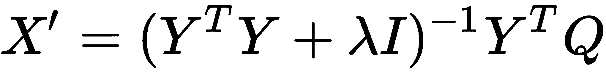

现在用新的 *X* 求解 *Y* :

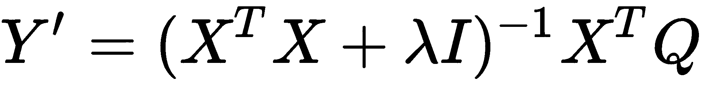

1.  迭代，在 *X* 和 *Y* 之间交替，直到收敛
2.  本质上，我们将交替求解各自的矩阵，最终会达到一个收敛点。因此，我们首先将 *X* 和 *Y* 初始化为随机值。然后，从 *X* 开始，我们求解 *X* 素数。现在我们有了一个更精确的 X 素数版本，我们可以用它来求解 Y 素数。在每次迭代中，每个矩阵都会为另一个矩阵创建一个更好的解决方案。我们可以像这样交替进行任意多次迭代，或者直到我们达到收益递减点，我们可以说我们已经收敛了。
3.  这里的符号有一个简单的注释:你在 lambda 旁边看到的 *I* 只是一个 *F x F* 单位矩阵，其中 *F* 是我们想要发现的潜在因素的数量。我们将其乘以正则化参数λ。所以，沿着对角线轴我们有λ，然后剩下的就是零。

下面是 Python 中 ALS 的一个 30 行代码的近似版本。我们从定义`Q`或评级矩阵开始:

4.  Now solve for *Y* with the new *X*:


5.  这是我们在前面的示例和上一节中看到的评级。现在我们要得到一个布尔掩码，`nan_mask`。首先，我们要为随后的计算将所有缺失值设置为零。接下来，我们将初始化`I`作为我们的单位矩阵，并乘以λ。我们只需要做一次，这很好。Lambda 目前只有 0.01，但这是一个可以使用交叉验证进行调整的超参数。所以，λ越高，我们就越正则化。然后，我们用`random_state`初始化`X`和`Y`。`X`将要等于 *M x F* ，也就是用户数乘以因子数。`Y`将等于因子数乘以项数: *F x N* 。

在迭代中，我们求解`X`，然后在给定新的`X`的情况下求解`Y`。然后，我们计算我们的训练损失，这也是均方误差的屏蔽版本，其中我们屏蔽掉原始真实数组(即我们的评级数组)中的缺失值。然后我们继续迭代，直到达到收敛。

在前面代码的底部，您可以看到`X`和`Y`之间的近似值的输出。这是一个近似值。如果你看看`Q`的定义，3 和底部的输出，看起来非常相似。因此，我们在最后创建预测的方式是，我们利用整个系统中的错误，并返回预测最高的项目，供用户过滤之前评级的项目。因此，用户 4(最后一个用户)将获得牛排店的推荐，即 *2.0* ，这是该用户的最高非先前评级项目。这实际上只是乘法误差或近似误差的结果。

在下图中，您可以看到训练损失在每次迭代中是如何减少的:

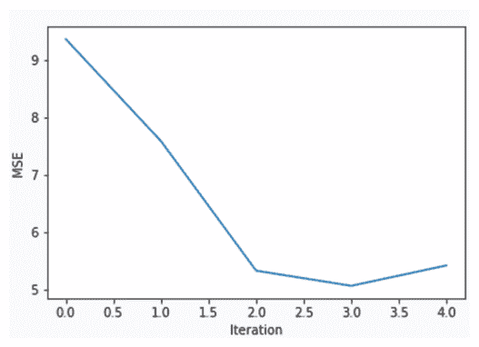

```
import numpy as np
from numpy.linalg import solve

nan = np.nan
Q = np.array([[5.0, 1.0, nan, nan, 2.5, 4.5, nan, nan],
              [nan, nan, 3.5, 2.0, 3.0, nan, nan, nan],
              [1.5, nan, nan, nan, 4.0, nan, 4.5, 4.0],
              [nan, 1.0, nan, nan, 1.0, nan, nan, 5.0]])

nan_mask = np.isnan(Q) # mask applied when computing loss
Q[nan_mask] = 0.

f = 3 # num factors
n_iter = 5 # num iterations
I_lambda = np.eye(f) * 0.01 # regularizing term
random_state = np.random.RandomState(42)

# initialize X, Y randomly
X = random_state.rand(Q.shape[0], f)
Y = random_state.rand(f, Q.shape[1])
W = nan_mask.astype(int) # weights for calculating loss (0/1)

# iterate:
errors = []
for i in range(n_iter):
    X = solve(Y.dot(Y.T) + I_lambda, Y.dot(Q.T)).T
    Y = solve(X.T.dot(X) + I_lambda, X.T.dot(Q))
    errors.append(((W * (Q - X.dot(Y))) ** 2).sum())

X.dot(Y).round(3)
```

This is the rating that we've seen in the earlier example, and in the previous section. Now we're going to get a Boolean mask, `nan_mask`. First, we're going to set all the missing values to zero for the ensuing computations. Next, we're going to initialize `I` as our identity matrix and multiply it by lambda. We only have to do that one time, which is nice. Lambda is just 0.01 for now, but that's a hyperparameter that can be tuned using cross-validation. So, the higher lambda is, the more we'll regularize. Then, we initialize `X` and `Y` with `random_state`. `X` is going to be equal to *M x F*, that is, the number of users by the number of factors. `Y` is going to be equal to the number of factors by the number of items: *F x N*.

Python 中的矩阵分解

在上一节中，我们希望将我们的评级矩阵分解为两个低秩矩阵，以发现驱动消费者决策的无形潜在因素。一个矩阵映射用户对发现的因素的密切关系，另一个映射项目在这些因素上的排名。

所以，让我们看看这是如何在 Python 中实现的。我们有两个文件，`als.py`和`example_als_recommender`。让我们看看我们的`als.py`文件。在上一节中，我们看到了项目到项目的协作过滤器；ALS 很像。它将实现`RecommenderMixin`:

ALS 有几个参数。第一个，也是唯一一个非可选的，是`R`，我们的评级矩阵。在我们看到的一些数学中，我们将这种情况互换称为`R`和`Q`。再说一次，这是文学的一种怪癖。这取决于你读的是什么报纸，非此即彼。第二个参数是`factors`。`factors`参数是我们想要发现的潜在变量的数量。我用过 float，但是你也可以用整数。浮点将会在 0 和 1 之间。`n_iter`为迭代次数。在此模块中，ALS 不支持提前收敛或提前停止。这是你完全可以写出来的东西。但是如果你有太多的迭代，发生的事情是你可能会过度拟合你的数据。Lambda 是我们的正则化参数，然后你可以通过`random_state`作为再现性的一种方式。

第一步，像往常一样，我们将检查我们的数组，以确保我们只有浮点:

这里我们将允许丢失数据，因为丢失数据在推荐系统中是很自然的。我们几乎可以保证总会有丢失的数据。


# Matrix factorization in Python

在下面的代码中，我们确保我们的因子是一个整数。如果是`float`，我们计算出将要发现的`factors`的数量:

所以，这里的`W`等于`nan_mask`，我们在上一节已经看过了:

```
def __init__(self, R, factors=0.25, n_iter=10, lam=0.001,
 random_state=None):
```

本质上，这将是一个加权数组，表示值是否从一开始就丢失了。因此，当我们在迭代过程中计算均方误差时，我们用这个来掩盖评级矩阵中的基本事实。

这里，我们初始化`Y`:

```
# check the array
R = check_array(R, dtype=np.float32) # type: np.ndarray
n_users, n_items = R.shape
# get the random state
random_state = check_random_state(random_state)
```

我们没有初始化`X`,因为我们知道这将是我们迭代求解的第一个问题。因此，正如我们在上一节中看到的，我们还将`I`初始化为单位矩阵，即 *F x F* ，并将其乘以我们的正则化参数。

现在我们将进行迭代，如以下代码所示:

首先求解`X`，然后求解`Y`。在每次迭代中，我们将只计算训练误差，即均方误差。我们将它添加到列表中，并在下面的代码中作为`self`参数存储。

In the following code, we're making sure that our factor is an integer. And if it's `float`, we figure out the number of `factors` we're going to discover:

```
# get the number of factors. If it's a float, compute it
if isinstance(factors, float):
    factors = min(np.ceil(factors * n_items).astype(int), n_items)
```

ALS 的训练阶段实际上非常容易。在上一节中，我们没有看到如何具体地生成预测。我们看到了它背后的数学原理，但是我们还没有实现它。如果您在 ALS 上调用 predict，如以下代码所示，它将简单地计算用户因子和项目因子的乘积，以返回`R`质数—基本上是近似值:

```
W = (R > 0.).astype(np.float32)
```

你可以传入`R`，它表面上是测试数据。这是包括最初没有包括在 fit 中的新用户的数据，或者这可能意味着用户已经更新了他们的数据。但是如果我们愿意，我们可以重新计算用户因素。因此，如果用户已经及时移动，并且我们的拟合是大约一周前的，那么我们可以相对于现有的项目因子重新计算用户因子。然后，在最后，我们只是返回`X`和`Y`的乘积。

现在我们将调用`recommend_for_user`函数。因此，给定您的测试矩阵和用户指数，我们想知道哪些最重要的`n`项目可以推荐给用户，我们也做了同样的事情:

```
# initialize the first array, Y, and X to None
 Y = random_state.rand(factors, n_items)
 X = None
# the identity matrix (time lambda) is added to the XX or YY product
# at each iteration.
 I = np.eye(factors) * lam
```

我们将创建这个预测，但是提取出预测的用户向量。因此，我们使用`self.predict`方法，如下面的代码所示:

如果我们对过滤掉之前看到的感兴趣，我们只需屏蔽掉它们，并返回我们感兴趣的项目的降序 argsorted 索引。这与我们之前看到的空间聚类非常相似，但在这里，我们所做的只是计算`X`和`Y`的近似值，并对列进行 argsorting。

```
# for each iteration, iteratively solve for X, Y, and compute the
 # updated MSE
 for i in xrange(n_iter):
 X = solve(Y.dot(Y.T) + I, Y.dot(R.T)).T
 Y = solve(X.T.dot(X) + I, X.T.dot(R))
# update the training error
 train_err.append(mse(R, X, Y, W))
# now we have X, Y, which are our user factors and item factors
 self.X = X
 self.Y = Y
 self.train_err = train_err
 self.n_factors = factors
 self.lam = lam
```

让我们看看`example_als_recommender.py`文件中的一个例子:

您可以从前面的代码中回忆起推荐的数据。这是我们在前面章节中提到的完全捏造的数据。我们将采用相同的数据，并在其上安装 ALS。我们想知道用户 0 的预测，所以在运行之前，我们需要一些信息。假设用户 0 对`Ghost Busters`的评价很高，对`The Goonies`的评价也很高。这家伙知道他们的东西！所以，这家伙是典型的 90/80 后千禧一代。

你会注意到，在下面的截图中，我们已经激活了我的`packt-sml` conda 环境:

```
def predict(self, R, recompute_users=False):
        """Generate predictions for the test set.

        Computes the predicted product of ``XY`` given the fit factors.
        If recomputing users, will learn the new user factors given the
        existing item factors.
        """
        R = check_array(R, dtype=np.float32, copy=False) # type: np.ndarray
        Y = self.Y # item factors
        n_factors, _ = Y.shape

        # we can re-compute user factors on their updated ratings, if we want.
        # (not always advisable, but can be useful for offline recommenders)
        if recompute_users:
            I = np.eye(n_factors) * self.lam
            X = solve(Y.dot(Y.T) + I, Y.dot(R.T)).T
        else:
            X = self.X

        return X.dot(Y)
```

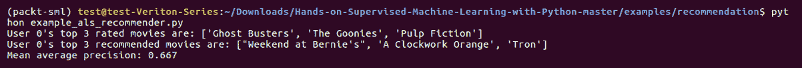

上述代码的输出如下:

```
def recommend_for_user(self, R, user, n=10, recompute_user=False,
                       filter_previously_seen=False,
                       return_scores=True):
```

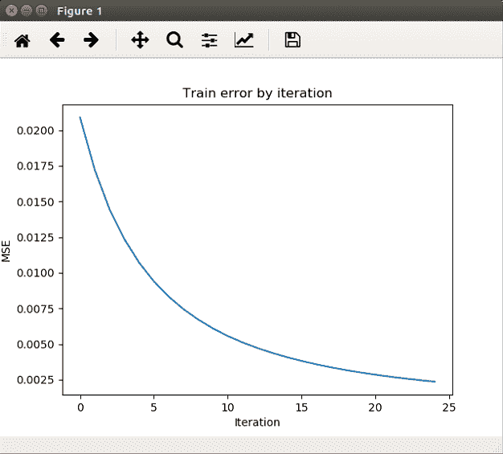

```
R = check_array(R, dtype=np.float32, copy=False)
# compute the new user vector. Squeeze to make sure it's a vector
 user_vec = self.predict(R, recompute_users=recompute_user)[user, :]
 item_indices = np.arange(user_vec.shape[0])
# if we are filtering previously seen, remove the prior-rated items
 if filter_previously_seen:
 rated_mask = R[user, :] != 0.
 user_vec = user_vec[~rated_mask]
 item_indices = item_indices[~rated_mask]
order = np.argsort(-user_vec)[:n] # descending order of computed scores
 items = item_indices[order]
 if return_scores:
 return items, user_vec[order]
 return items
```

If we are interested in filtering out the ones we previously saw, we just mask those out and return the descending argsorted indices of items that we're interested in. This is very similar to what we've seen before when we were looking at spatial clustering, but here, all we're doing is computing the approximation of `X` and `Y` and argsorting the columns.

你也需要这样做。因此，当我们运行这个时，我们将得到前面的图，它显示了训练误差如何随着迭代而减小，正如我们所预期的那样。因此，我们将推荐用户 0 观看`Weekend at Bernie's`作为最高评级的建议。鉴于`The Goonies`和`Ghost Busters`，这似乎是有道理的。但是`Pulp Fiction`有点暴力，所以我们也推荐了`Clockwork Orange`，它似乎也与此相呼应。因此，平均精度本质上是查看推荐，然后将它们与实际情况进行比较，并指出其中有多少实际上是以前被高度评价的。

```
# -*- coding: utf-8 -*-

from __future__ import absolute_import

from packtml.recommendation import ALS
from packtml.recommendation.data import get_completely_fabricated_ratings_data
from packtml.metrics.ranking import mean_average_precision
from matplotlib import pyplot as plt
import numpy as np
import sys

# #############################################################################
# Use our fabricated data set
R, titles = get_completely_fabricated_ratings_data()

# #############################################################################
# Fit an item-item recommender, predict for user 0
n_iter = 25
rec = ALS(R, factors=5, n_iter=n_iter, random_state=42, lam=0.01)
user0_rec, user_0_preds = rec.recommend_for_user(
    R, user=0, filter_previously_seen=True,
    return_scores=True)

# print some info about user 0
top_rated = np.argsort(-R[0, :])[:3]
print("User 0's top 3 rated movies are: %r" % titles[top_rated].tolist())
print("User 0's top 3 recommended movies are: %r"
      % titles[user0_rec[:3]].tolist())
```

ALS 的局限性

我们一直在使用明确的评级。比如在亚马逊上，评分在一星到五星之间。这里的问题是，显式评级系统通常很难让用户对项目进行评级，因为从用户角度来看，消费内容比评估内容更容易。因此，隐式评级与显式评级相反，它们通常可以在用户不知情的情况下由系统收集。很多时候这是更有利的，因为它不需要用户在第二种意义上与系统交互来明确地对项目进行评级，我们可以获得更多的数据，这意味着更少的稀疏数据。因此，隐含评级可能包括一首歌曲的收听次数。上一个 FM 团队收集了非常著名的评分数据集，它使用隐式评分，通常用于推荐系统的基准测试。ALS 有一个隐含版本，但是我们只讨论了它的显式版本。但是如果你在谷歌上搜索隐性 ALS，有各种各样的相关文献。我们鼓励你去查一下。

推荐器的下一个挑战是稀疏性对密度。正如我们所见，评级矩阵可能相当稀疏。对于一些系统，比如 Amazon，每个用户可能只有不到大约 1%的所有项目的评级，很多时候甚至更少。因此，密集矩阵通常不是最好的解决方案，而且常常是不可行的。因此，我们要么使用稀疏矩阵，要么非常聪明地分配数据，这样我们就不会完全耗尽我们的内存。

推荐者通常需要很长时间来训练。像许多其他机器学习模型一样，我们也会遇到同样的事情，但推荐器有点不同，因为它们必须以更高的频率更新，在许多情况下，每天多次，这取决于系统本身。因此，目录中的新项目或开始消费媒体的新用户意味着推荐器必须更新。但是我们不能在网上或实时做这些，否则我们就有系统瘫痪的危险。因此，一般来说，推荐人会以离线方式定期接受再培训。并且以在线或更实时的方式对模型评分。


在这一节中，我们看了在`packtml`库中 ALS 的 Python 实现和一个例子。最后，我们讨论了我们在推荐系统中面临的一些现实挑战。

基于内容的过滤


# 在这一节中，我们将通过介绍一种完全独立的计算相似性的方法来总结我们关于推荐系统的讨论，并看看我们如何使用它来增强我们的协同过滤系统。

基于内容的推荐器的操作类似于我们前面看到的原始的项目对项目的协作系统，但是它们不使用评级数据来计算相似性。相反，他们通过使用目录中提供的项目属性来直接计算相似性。然后，可以通过计算评级矩阵和相似性矩阵的乘积，以与项目到项目协作过滤相同的方式来计算预测。

The next challenge of recommenders is sparsity versus density. As we've seen, ratings matrices can be pretty sparse. For some systems, such as Amazon, there may only be ratings for less than approximately one percent of all items per user, and a lot of times even less than that. So, dense matrices are not usually the best solution, and oftentimes they're not even feasible. So, we either have to use sparse matrices or get really clever with how we distribute the data, so we don't totally blow up our memory.

下面是我们如何使用内容向量来直接计算项目相似性矩阵的示例:

上述代码的输出如下:

我们使用了与前几节相同的评分矩阵，并为不同的餐厅创建了 11 个不同的属性。通常，这些伪编码特征的内容向量指示一个项目是否属于给定的类别。所以，你可以看到相似度是以完全相同的方式计算的。所以，我们只是计算行之间的余弦相似度。然后我们甚至以同样的方式产生预测。我们计算相似度和评分的乘积。


# 基于内容的系统的局限性

基于内容的系统有几个明显的局限性，这使得它们在大多数情况下都不太理想。第一个是特征工程的手动性质，考虑到收集关于项目的数据的困难可能非常耗时，并且很多时候，我们呈现的关于项目的数据仅限于文本描述，这可能会非常困难。因此，我们没有得到这个好的编码矩阵，这意味着我们必须从描述中提取属性，这可能是具有挑战性的，并且非常耗时。

接下来，我们最终得到了大量虚拟编码的内容向量集，这意味着它严重地零膨胀。因此，自然地，我们的相似性计算相对于我们从可比较的协作方法计算中可能得到的结果来说是相当低的。最后，随着我们的特征矩阵在等级上的增长，两个给定项目之间的相似性将是正交的或零，所以这种可能性接近 1。更多信息可以参考[https://math . stack exchange . com/questions/995623/why-are-random-drawn-vectors-near-vertical-in-high-dimensions](https://math.stackexchange.com/questions/995623/why-are-randomly-drawn-vectors-nearly-perpendicular-in-high-dimensions)。这是一个松散的证明，表明等级越高，越有可能接近正交性，这是我们不想要的。所有这些限制很好地解释了为什么基于内容的系统不如基于协作的系统有利。

但也有一些情况下，他们真的很有用。其中一个叫做**冷启动问题**，我们在本节前面已经讨论过，我们在每个协同过滤应用中都遇到过。这是当一个新项目被添加，并且由于其自身缺乏评级而不能在评级的基础上与现有项目进行比较时。所以，这里的挑战，除了不能计算相似性，是如果你用 0 或其他随机值来估算，你可能永远不会把它呈现给消费者。你含蓄地减少了你推荐那个项目的机会。

在项目对项目的协同过滤中，由于我们无法计算相似性，所以在有两个项目没有被同一用户相互评价的情况下也会发生这种情况。因此，这是一个额外的情况，在这种情况下，它将导致矩阵中的相似度为 0，因为我们用 0 来估算所有缺失值，即使理论上我们有评级来衡量亲和力。在这些情况下，有一个后备计划是很有用的。

这里，我们安装了一个项目到项目的协同过滤推荐器:

```
import numpy as np
from sklearn.metrics.pairwise import cosine_similarity

ratings = np.array(([5.0, 1.0, 0.0, 0.0, 2.5, 4.5, 0.0, 0.0],
                    [0.0, 0.0, 3.5, 2.0, 3.0, 0.0, 0.0, 0.0],
                    [1.5, 0.0, 0.0, 0.0, 4.0, 0.0, 4.5, 4.0],
                    [0.0, 1.0, 0.0, 0.0, 1.0, 0.0, 0.0, 5.0]))
# content vector

categories = ['Alcohol license',
              'Healthy options',
              'Burgers on menu',
              'Located in downtown',
              '$', '$$', '$$$', '$$$$',
              'Full bar', 'Southern cooking',
              'Grilled food']
# categories        a1   he  bu  dt  1$  2$  3$  4$  fb  sc  gf
content = np.array([[0., 1., 0., 0., 0., 1., 0., 0., 0., 0., 0.],
                    [1., 0., 1., 1., 0., 1., 0., 0., 1., 0., 0.],
                    [0., 1., 1., 0., 1., 0., 0., 0., 0., 0., 1.],
                    [1., 1., 1., 1., 0., 0., 1., 0., 0., 1., 1.],
                    [0., 1., 0., 0., 1., 0., 0., 0., 0., 0., 1.],
                    [1., 0., 1., 0., 0., 0., 1., 0., 0., 1., 1.],
                    [1., 1., 0., 1., 0., 0., 0., 1., 1., 0., 1.],
                    [1., 1., 1., 0., 0., 0., 1., 0., 0., 0., 1.]
                   ])
sim = cosine_similarity(content)
ratings.dot(sim).round(3)
```

上述代码的输出如下:

```
array([[6.337, 4.381, 6.169, 6.738, 5.703, 5.545, 4.813, 6.872],
 [2.997, 1.797, 7.232, 5.294, 6.904, 4.03 , 4.078, 5.587],
 [5.697, 4.539, 8.515, 8.305, 8.799, 5.876, 9.01 , 9.005],
 [2.306, 3\. , 4.444, 5.169, 3.582, 4.658, 3.758, 5.916]])
```

We're using the same ratings matrix as we have over the last few sections, and we've created 11 different attributes about the various restaurants. Generally, the content vectors of these dummy-encoded features indicate whether an item belongs to a given category. So, you can see the similarity is computed in exactly the same fashion. So, we just compute the cosine similarity between the rows. And then we even generate predictions in the same way. We compute the product of the similarities and the ratings.


# 从前面的代码中，我们看到了评级数据上的`packtml`包中的几个部分，这是我们在过去几个部分中一直使用的。我们将使用内容相似性计算来估算遭受冷启动问题的数据。当我们检查相似性矩阵时，您可以看到不再有 0。因此，有一种可能得到 0 的极端情况，即如果缺少相互相似性或冷启动问题，那么实际内容向量中的正交性是完美的。但我们没有看到这一点。因此，从表面上看，这让我们更接近一个更稳健的模型。但是您仍然受限于我们之前看到的限制，即收集内容属性和计算那些潜在的正交向量。

所以，在这一点上，你熟悉这个概念，你意识到仅仅基于内容的相似性是不可行的。但是如果你有合适的环境和设置，它们实际上可以增强你的协同过滤方法。围绕使用神经网络来自动混合基于内容的系统和协作系统，已经有了很多研究。他们中的许多人正在使用神经网络从文本描述中创建特征，这在自动意义上有点不正式，然后创建一个单独的网络来分解矩阵。因此，在未来，内容和协作系统可以平等共存，这是很有希望的。

下面是两篇采用这种方法的论文:

*神经网络混合协同过滤*，Florian Strub，Jeremie Mary 和 Romaric Gaudel，2016 年

*基于高斯混合模型的半监督聚类混合推荐系统*，Cyberworlds (CW)，2016 年国际会议，第 155-158 页，2016

神经网络和深度学习

这是机器学习中一个巨大的话题，所以我们无法在本章涵盖所有内容。如果你以前从未见过神经网络，它们看起来就像一个巨大的蜘蛛网。这些蜘蛛网的顶点被称为神经元或单元，它们基于一种被称为感知器的老式线性分类器。这个想法是，你的向量进来，用相应的参数权重向量计算点积，然后加上一个偏差值。然后，我们通过一个激活函数来转换它。一般来说，如果使用 sigmoid 变换，感知器在规范上可以与逻辑回归相同。

Here, we're fitting an item-to-item collaborative filtering recommender:

```
from packtml.recommendation import ItemItemRecommender

rec = ItemItemRecommender(ratings, k=5)

zero_mask = rec.similarity == 0
rec.similarity[zero_mask] = sim[zero_mask]
rec.similarity
```

The output of the preceding code is as follows:

```
array([[0.99999994, 0.67728543, 0.35355338, 0.26726124, 0.62405604,
        0.95782626, 0.28734788, 0.31622776],
       [0.67728543, 0.99999994, 0.2236068 , 0.50709254, 0.43580094,
        0.70710677, 0.5477226 , 0.5521576 ],
       [0.35355338, 0.2236068 , 1\. , 1\. , 0.52827054,
        0.4472136 , 0.4082483 , 0.6708204 ],
       [0.26726124, 0.50709254, 1\. , 1\. , 0.52827054,
        0.8451542 , 0.6172134 , 0.8451542 ],
       [0.62405604, 0\. , 0.52827054, 0.4364358 , 1\. ,
        0.2581989 , 0.7043607 , 0.577514 ],
       [0.95782626, 0.70710677, 0.4472136 , 0.8451542 , 0.44022545,
        1\. , 0.36514837, 0.8 ],
       [0.28734788, 0.5477226 , 0.4082483 , 0.6172134 , 0.7043607 ,
        0.36514837, 1\. , 0.62469506],
       [0.1795048 , 0.5521576 , 0.6708204 , 0.8451542 , 0.577514 ,
        0.8 , 0.62469506, 0.99999994]], dtype=float32)
```

当你把所有这些串在一起时，你得到的是一个巨大的感知器网络，为感知器提供信息:这被称为多层感知器，但也被称为神经网络。当这些感知机中的每一个馈入下一层时，神经元最终学习输入空间中的一系列非线性变换，最终在最后一层产生预测。

这些模型的历史实际上非常迷人。它们在 20 世纪 50 年代初首次被提出，但是它们的潜力在很长一段时间内都没有被真正释放出来，因为它们是如此的计算密集型。然而现在，我们到处都听到关于深度学习的说法，它实际上只是指更广泛的神经网络家族，包括它们的一些无监督和生成的变体。

那么，神经网络实际上是如何学习的呢？好吧，我们将通过网络的各层在各个时期反复输入数据。向前馈送层就像计算一层和下一层之间的矩阵乘积一样简单，沿着列轴添加偏置向量，然后通过激活函数转换输出。有很多不同的激活函数可以使用，但一些最常见的是乙状结肠；双曲正切，类似于 sigmoid，但介于负 1 和 1 之间，而不是零和 1 之间；和**整流线性单元** ( **ReLUs** )，它们实际上只是值和零之间的地板函数。它确保没有任何负面的东西从单元中产生。因此，在每个时期或迭代之后，在输出层之外，我们将计算网络的误差，并通过各层向上传递消息，它们可以相应地调整权重。这个过程被称为反向传播。对此我们通常使用梯度下降。

对于我们的两层示例，它实际上只是中间的一层，最后是一个输出层，我们只需为每个时期计算两个矩阵乘积。人们发现，如何初始化你的权重对网络的学习能力有很大的影响。有几种方法可以实现这种策略，但最简单的方法是将它们初始化为非常小的值。我们通常在负 0.1 和正 0.1 之间选择随机值。你可以变小；你可以变得更聪明。我们将偏差初始化为 1 个向量。同样，还有其他聪明的方法可以做到这一点。我们将使用 1，权重矩阵本身将一层映射到下一层。因此，从第 1 层到第 2 层，我们从三个单元到四个单元。你可以从单位的数量上看到这种维度。我们对应的权重矩阵将是 *3 x 4* ，同样，第二个权重矩阵将是 *4 x 2* 。

*   这里，我们只是将我们的网络表示为一个线性方程组:
*   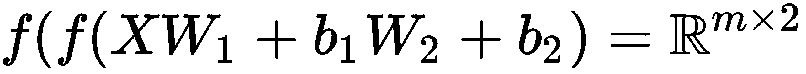


# 第一层被传递到嵌套在内侧括号中的第二层，然后传递到外侧括号中的最后一层。我们最终得到的是这个真正的矩阵，在 *m x 2* 中。

下面是一段高度简化的 Python 代码:

我们正在定义我们的激活函数。`f`是逻辑或 sigmoid 变换。`lam`，或`lambda`，将是我们的学习率，我们在讨论梯度下降时已经知道了。你们会从逻辑回归中记住这一点，我们可以控制下降梯度的速度。初始化`X`和`y`后，我们只是用它们作为随机值，我们创建隐藏的`H1`和`H2`层，以及`b1`和`b2`偏差。在这个例子中，我们使用 NumPy `rand`函数创建了层。但是这是你想要变聪明的地方，把它们限制在负的`0.1`和正的`0.1`之间。然后，通过将我们的`f`激活函数应用于`AX + b`线性方程来计算我们的隐藏层 1 的结果`H1_res`。因此，我们只需计算`X`和`H1`之间的内积，然后沿着列向量添加偏置向量。

通过以相同的方式将第二个隐藏层应用于第一个隐藏层的输出来计算输出。因此，我们将这些线性系统连接起来，并将这种非线性变换应用到输出中。

When you string a whole bunch of these together, what you get is the massive web of perceptrons feeding perceptrons: this is called a multi layer perceptron, but it's also known as a neural network. As each of these perceptrons feeds the next layer, the neurons end up learning a series of nonlinear transformations in the input space, ultimately producing a prediction in the final layer.

The history of these models is actually really fascinating. They were first proposed in the early 1950s, but their potential was not really unlocked for quite a long time, since they're so computationally intensive. Nowadays, though, we hear a bout deep learning everywhere, and it's really just referring to the broader family of neural networks, including some of their unsupervised and generative variants.

因此，现在我们已经完成了第一个纪元，我们需要调整网络的权重以获得误差最小化状态，因为现在，我们的网络很可能产生了一个可怕的误差。因此，这里开始了反向传播的乐趣，如果你认为我们在这本书的前面有很多微积分，你在这里得到了款待。我们要计算四个导数:每层两个。我们用它们来调整上一层的权重，就像我们在逻辑回归中所做的一样。然后，下一次我们进行前向传递时，权重已经被调整，理论上，我们在网络中的误差会比以前小。

这里，我们从头开始实现反向传播:

我们将计算四个导数:每个权重层的导数和损失函数，这是两个，偏差层也是两个。第一个增量很容易计算:它只是预测的概率，也就是这个矩阵减去`y`的真实指数。接下来，我们将使用刚刚计算的δ来计算第一层的输出，它将是最后一层(即输出层)的导数。然后，我们可以对结果的列求和，得到第二层偏差的导数。

我们可以用同样的方法计算下一层`H1`和`b1`的导数。一旦我们计算出这些梯度，我们就可以用与逻辑回归中相同的方式更新权重和偏差，即将每个导数乘以负学习率，并分别添加到权重矩阵和`H1`和`b1`，以及`H2`和`b2`偏差向量。现在我们已经更新了我们的权重和偏差，沿着我们函数中变化最大的轴:损失函数。

因此，如果反向传播正确，将会得到类似下图的误差项:

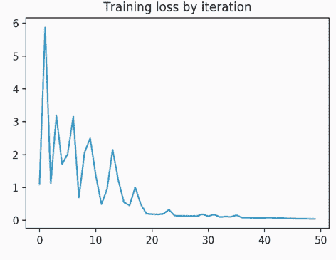

```
import numpy as np

# define activation function
f = (lambda v: 1./ (1\. + np.exp(-v)))
lam = 0.01
# input matrix
X = np.array([[1.5, 5.0, 2.5],
             [0.6, 3.5, 2.8],
             [2.4, 5.6, 5.6]])

y = np.array([1, 1, 0])
# initialize hidden layers, bias

rs = np.random.RandomState(42)
H1 = rs.rand(3, 4)
H2 = rs.rand(4, 2)
b1, b2 = np.ones(4), np.ones(2)

# feed forward
H1_res = f(X.dot(H1) + b1)
output = f(H1_res.dot(H2) + b2)
```

训练神经网络的提示和技巧

这里有一些技巧，可以让你从头开始训练神经网络时变得更容易。你可以提前一点停止训练，以避免过度适应。在上图中，你可以看到有一条长尾，误差不再减少，我们仍在训练。大约在公元前 25 或 30 年。我们本可以早点停下来的。

正规化和辍学是防止你的网络过度适应的方法。现在，对于非常大的数据，您可以在每个时期进行部分拟合，这意味着您可以在每次向前传递时通过您的网络拟合许多批次，这样您就不必将所有内容都保存在内存中。这也使得反向传播变得更容易，不同的激活函数会给你不同的结果。所以，要经常尝试。最后，正如我们之前讨论的那样，始终使用交叉验证来选择模型超参数，这样就不会无意中造成验证集的模型泄漏，甚至不会过度拟合训练集。

So, now that we have our first epoch complete, we need to adjust the weights of the network to get an error-minimizing state because, right now, the chances are our network produced a terrible error. And so, here begins the fun of backpropagation, and if you thought we had a lot of calculus earlier in this book, you're in for a treat here. We're going to compute four derivatives: two for each layer. We use them to adjust the weight in the layer immediately above, much like we did in logistic regression. Then, the next time we do a forward pass, the weights have been adjusted and we'll, in theory, have less error in the network than we did previously.

神经网络

```
# back prop
out_delta = output.copy() # get a copy of the output
out_delta[range(X.shape[0]), y] -= 1.
H2_d = H1_res.T.dot(out_delta)
b2_d = H2_d.sum(axis=0)
delta2 = out_delta.dot(H2.T) * (1\. - np.power(H1_res, 2.))
H1_d = X.T.dot(delta2)
b1_d = delta2.sum(axis=0)

# update weights, bias

H1 += -lam * H1_d
b1 += -lam * b1_d
H2 += -lam * H2_d
b2 += -lam * b2_d
```

我们将通过网络中的各层在各个时期反复输入数据。每次迭代后，我们将计算网络和输出的误差，并将信号向上传回各层，以便它们可以相应地调整权重。所以，这是所有的理论和概述。

我们有两份文件要看。我们有源代码和一个例子:`base.py`和`mlp.py`，代表多层感知器。先说`base.py`:

我们有两个功能。一个函数，`tanh`，是一个双曲正切函数，我们将使用它作为激活函数。这只是`np.tanh`的包装。然后，我们有一个`NeuralMixin`类，这是一种抽象接口，我们将使用它来导出我们每个网络的权重和偏差。

在`mlp.py`中，我们将依赖 scikit-learn 中的典型`check_X_y`，`check_classification_targets`。因为我们只执行二元或多类分类，所以我们将使用 softmax，然后使用`check_random_state`。因此，我们可以在我们的神经网络中使用一个可复制的`random_state`。


# Tips and tricks for training a neural network

在类本身之外有一个函数— `calculate_loss`:

本质上，这将是我们的神经网络内部的目标函数，我们可以计算，并通过网络反向传播损失。Softmax 将成为泛化，也就是说，我们的逻辑函数适用于多个类。这就是我们从中得到的。从`K`矩阵，其中`K`是类数的维数，我们有一个三类问题；我们可以计算每一类成员的概率。这就是 softmax 所做的。

现在，我们的神经网络分类器将采用一些不同的参数，如下所示:

像往常一样，我们有我们的`X`和`y`，然后我们有`hidden`，这将是一个元组或其他一些具有位置元素的可迭代对象，指示每层中单元的数量。因此，如果我们想要有两层，我们可能有`X`、`25`，其中每层将有`25`个单元。没有精确的科学来决定你想要多少单位，这取决于你的目标。如果要压缩维度，可以使单位数小于输入维度。如果你想发现各种细微的特征，那么你可以增加单元的数量。迭代的次数实际上是我们要执行的历元数。学习率是我们在逻辑回归中看到的λ。正规化是我们的`l2`惩罚，这将帮助我们防止过度拟合。而`random_state`又是我们用来控制`random_state`的种子，所以这是可复制的。


# 在构造函数中，我们所做的就是给算法自动分配不同的属性:

然后，我们初始化权重和偏差。我们在追踪最后一个矩阵的最后一个维度，或者说隐藏权重矩阵。所以，我们将从`none`开始输入。我们将使用列维度作为下一层的输入维度。所以，我们在例子中提到，我们从三个到四个。我们的第一个隐藏矩阵或隐藏层的维数可能是*3×4*。我们跟踪最后一列的维度，因为它成为下一层的行维度。我们返回到`X`、`y`、`weights`、`biases`，稍后子类也会用到它，这就是为什么它是一个类函数。

现在，我们开始向前推进我们的网络。首先，我们计算向前的步骤:

```
def tanh(X):
    """Hyperbolic tangent.

    Compute the tan-h (Hyperbolic tangent) activation function.
    This is a very easily-differentiable activation function.

    Parameters
    ----------
    X : np.ndarray, shape=(n_samples, n_features)
        The transformed X array (X * W + b).
    """
    return np.tanh(X)

class NeuralMixin(six.with_metaclass(ABCMeta)):
    """Abstract interface for neural network classes."""
    @abstractmethod
    def export_weights_and_biases(self, output_layer=True):
        """Return the weights and biases of the network"""
```

向前一步很容易。我们有自己的体重和偏见。我们将把我们的权重和偏见压缩在一起，这样我们就可以一起跟踪它们。我们将计算出`X.dot(w)`、`w`的乘积，即权重，并加上偏差。这又是那个`AX`线性系统加上`b`。然后，我们应用这个非线性变换，`tanh`。但是如果你想用乙状结肠，你可以这样做。最后一层略有不同。我们不是在最后一层运行`tanh`，我们实际上是在运行 softmax。这是一个分类问题，所以我们将 softmax 应用于`X`的输出，而不是`tanh`。这是输出层。

在构造函数中，我们已经计算了第一个前进步骤和第一个纪元:

现在我们要计算损失；这种损失就是我们之前看到的对数损失。在`train_loss`中，我们将跟踪每个时期的损失。如果你想加快速度，你可以只计算损失，比如说，每五次迭代。在下面的反向传播示例中，我们将得到一个关于如何以一种比上一个示例中的两层示例更具可扩展性的方式实现这些渐变的巧妙想法。

There is a function outside of the class itself—`calculate_loss`:

```
def _calculate_loss(truth, preds, weights, l2):
    """Compute the log loss.

    Calculate the log loss between the true class labels and the predictions
    generated by the softmax layer in our neural network.

    Parameters
    ----------
    truth : np.ndarray, shape=(n_samples,)
        The true labels

    preds : np.ndarray, shape=(n_samples, n_classes)
        The predicted class probabilities

    weights : list
        The list of weights matrices. Used for computing the loss
        with the L2 regularization.

    l2 : float
        The regularization parameter
    """
    # get the log probs of the prediction for the true class labels
    n_samples = truth.shape[0]
    logprobs = -np.log(preds[range(n_samples), truth])

    # compute the sum of log probs
    sum_logprobs = logprobs.sum()

    # add the L2 regularization term
    sum_logprobs += l2 / 2\. * sum(np.square(W).sum() for W in weights)
    return 1\. / n_samples * sum_logprobs
```

现在，在反向传播函数中，我们再次计算 delta，它是每个类的概率减去真实指数:

这是我们的第一个三角洲。现在，迭代地，我们要做的是计算该层结果乘以当前增量的导数。我们从刚刚减去的这些概率的当前增量开始。现在我们已经得到了梯度，我们可以通过对导数中的列求和来计算偏差的导数。现在我们有了偏差的导数，下一次迭代时，我们将计算下一个增量。我们使用正则化的方法是将正则化乘以`next_weights`。因此，`next_weights`是我们计算梯度的权重矩阵。我们将其正则化，并将其添加到导数中，然后我们将调整权重。所以，我们可以加上`learning_rate`乘以δ，或者梯度，我们对偏差做同样的处理。我们已经改变了`next_weights`和`next_biases`的权重和偏差。这是一个`void`功能。它不返回任何东西，因为它都发生在原地。

```
 def __init__(self, X, y, hidden=(25,), n_iter=10, learning_rate=0.001,
              regularization=0.01, random_state=42):
```

现在，权重和偏差已经迭代更新。下一次我们在迭代中前进——下一个纪元——我们应该会看到更低的误差。因此，我们将通过迭代次数来继续这一过程，通过我们所有的时代来进步，并保存我们的权重和偏差。然后，我们将生成一个预测，并通过在最后使用 softmax 向前传递来计算这些概率。取列的`argmax`:那是概率最高的类。这就是我们用压缩向量返回的结果。

在`example_mlp_classifier`文件中，我们使用了与决策树分类相似的数据集，这些`multivariate_normal`气泡是我们二维空间中的一种聚类。我们将像往常一样做`train_test_split`:

现在我们要训练两个神经网络。第一个将只使用四次迭代，并有一个 10 个单位的隐藏层。第二个有点复杂。我们将进行 150 次迭代，每次迭代有两个隐藏层的`25`单元。

```
self.hidden = hidden
self.random_state = random_state
self.n_iter = n_iter
self.learning_rate = learning_rate
self.regularization = regularization
# initialize weights, biases, etc.
X, y, weights, biases = self._init_weights_biases(
    X, y, hidden, random_state, last_dim=None)
```

所以，我们运行`example_mlp_classifier.py`文件:

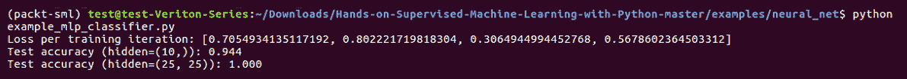

```
    def _forward_step(X, weights, biases):
        # track the intermediate products
        intermediate_results = [X]

        # progress through all the layers EXCEPT the very last one.
        for w, b in zip(weights[:-1], biases[:-1]):

            # apply the activation function to the product of X and the weights
            # (after adding the bias vector)
            X = tanh(X.dot(w) + b)

            # append this layer result
            intermediate_results.append(X)

        # we handle the very last layer a bit differently, since it's out
        # output layer. First compute the product...
        X = X.dot(weights[-1]) + biases[-1]

        # then rather than apply the activation function (tanh), we apply
        # the softmax, which is essentially generalized logistic regression.
        return softmax(X), intermediate_results
```

我们用 10 个单元的单一隐藏层获得了相当好的测试精度:94.4%。但是你可以看到，如果我们有两个 25 度的隐藏层，我们几乎可以得到 100%。我们也有第一个的训练迭代。

In the constructor, we've computed the first forward step and our first epoch:

```
        # for each iteration, feed X through the network, compute the loss,
        # and back-propagate the error to correct the weights.
        for _ in xrange(n_iter):
            # compute the product of X on the hidden layers (the output of
            # the network)
            out, layer_results = self._forward_step(X, weights, biases)

            # compute the loss on the output
            loss = _calculate_loss(truth=y, preds=out, weights=weights,
                                   l2=self.regularization)
            train_loss.append(loss)

            # now back-propagate to correct the weights and biases via
            # gradient descent
            self._back_propagate(y, out, layer_results, weights,
                                 biases, learning_rate,
                                 self.regularization)
```

在下图中，您可以看到损失有所波动:

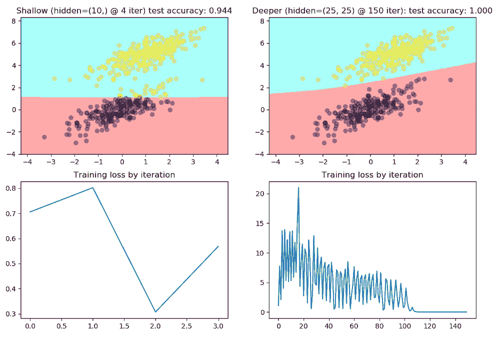

但是随着时间的推移，这种损失会减少。它不能保证是完美的下降，它可能会上升或下降一点，但我们可以看到，随着时间的推移，我们的损失达到了一个非常小的点。我们在这里学到的更复杂的函数是一个非常有趣的非线性决策边界。对这些边界点进行分类有点困难，但这就是我们如何使用神经网络来学习一个比逻辑回归学习更复杂的函数。

```
probas[range(n_samples), truth] -= 1.
# iterate back through the layers computing the deltas (derivatives)
 last_delta = probas
 for next_weights, next_biases, layer_res in \
 zip(weights[::-1], biases[::-1], layer_results[::-1]):
# the gradient for this layer is equivalent to the previous delta
# multiplied by the intermittent layer result
 d_W = layer_res.T.dot(last_delta)
# column sums of the (just-computed) delta is the derivative
# of the biases
 d_b = np.sum(last_delta, axis=0)
# set the next delta for the next iter
 last_delta = last_delta.dot(next_weights.T) * \
 (1\. - np.power(layer_res, 2.))
# update the weights gradient with the L2 regularization term
 d_W += l2 * next_weights
# update the weights in this layer. The learning rate governs how
# quickly we descend the gradient
 next_weights += -learning_rate * d_W
 next_biases += -learning_rate * d_b
```

使用迁移学习

在本节中，我们将更进一步，探索神经网络是否可以从其他神经网络学习以及它们已经学习了什么的问题。我们将从迁移学习的概念开始，然后我们将进入一些 Python 代码。

迁移学习本质上是机器学习的弗兰肯斯坦怪物。这个想法来自于这样一个问题:我怎样才能利用其他网络已经学到的东西，并从那里继续前进？我们基本上要在几个不同的网络之间做一个大脑拼接。如果网络是根据您无法访问的数据进行训练的，或者训练过程需要花费数小时或数天的时间，这一点非常有价值，这在文本或图像处理领域很常见。

```
# Fit a simple neural network
n_iter = 4
hidden = (10,)
clf = NeuralNetClassifier(X_train, y_train, hidden=hidden, n_iter=n_iter,
                          learning_rate=0.001, random_state=42)
print("Loss per training iteration: %r" % clf.train_loss)

pred = clf.predict(X_test)
clf_accuracy = accuracy_score(y_test, pred)
print("Test accuracy (hidden=%s): %.3f" % (str(hidden), clf_accuracy))

# #############################################################################
# Fit a more complex neural network
n_iter2 = 150
hidden2 = (25, 25)
clf2 = NeuralNetClassifier(X_train, y_train, hidden=hidden2, n_iter=n_iter2,
                           learning_rate=0.001, random_state=42)

pred2 = clf2.predict(X_test)
clf_accuracy2 = accuracy_score(y_test, pred2)
print("Test accuracy (hidden=%s): %.3f" % (str(hidden2), clf_accuracy2))
```

我们不想重新训练我们的模型，因为那会花很长时间，但是我们想利用我们已经学到的关于其他两个类的知识，开始学习关于其他类的其他知识。我们可以使用迁移学习来重新开始我们离开的地方，而不是重新培训整个过程。现在，你已经有了背后的想法和概念，让我们看看如何将其应用于我们现在熟悉的现有多层感知器框架。

在`transfer.py`文件中，从`TransferLearningClassifier`开始，比在`MLPClassifier`中多了一个参数:那就是预训练网络。那可以是`NeuralNetClassifier`也可以是`TransferLearningClassifier`。但是在这个例子中，我们只取`NeuralNetClassifier`。类似于 MLP 构造函数，我们将使用前几行将所有内容保存为自身属性，然后我们将确保您作为预训练网络传入的任何内容都是某种形式的`NeuralMixin`:

因为我们必须访问以前课程中的权重和偏差，所以我们得到了预训练权重和预训练偏差。我们只想初始化新的权重和偏差，我们可以一直叠加到最后。因此，如果我们之前有一个四层网络，这些只是辅助性的。我们不会训练它们——我们只是要冷冻它们。然后，我们想在最后叠加几层，这样我们就可以训练和教授新的特性——我们可能想要预测的新类的新特性。我们将仅对新的权重和偏差进行初始化的权重和偏差。

时代看起来略有不同；他们看起来很像 MLPs，但是有一点点不同。

因此，对于每个时期，我们将执行一个预训练的前进步骤。基本上，我们在这里要做的是，对于预训练权重和偏差中的每一层，我们将使用我们的`tanh`函数计算 *AX + b* 。请注意，即使在输出层，我们也将计算`tanh`，而不是计算 softmax，因为我们不再对获取那些类概率感兴趣。现在我们只想把它输送到下一层。所以，我们要用那个激活函数。可能是`sigmoid`或者`relu`。

现在，我们希望在现有的或新的权重和偏差层上向前迈出一步，我们确实希望进行训练:

我们将计算`loss`，然后我们将只在新图层上反向传播。所以，我们根本不是在训练旧的权重和偏见，而是在训练新的权重和偏见。

预测略有不同:


# 我们不仅要计算单个前进步长，还要计算预训练的前进步长，因为我们不希望 softmax 出现在另一个网络的末端。然后，我们将使用预训练的前进步骤的输出来计算正常的前进步骤，这将把 softmax 堆叠到末端。

In this section, we're going to take it one step further and explore the question of whether a neural network could learn from other neural networks and what they've already learned. We'll start by covering the concept of transfer learning, and then we'll get into some Python code.

对于预测，我们再一次取列的`argmax`。也就是说，从预测概率中获取最高概率类。

让我们看一个示例文件。这看起来很像我们在之前的 MLP 示例中设置的内容，只是我们有两个数据集:

第一个将有两个 blob:我们一直在使用的`multivariate_normal`blob 和多数类。这里的第三个将把第三个类放在两个类之间。我们的迁移学习任务是在已经从二进制分类例子中学到的基础上学习这个新类。

```
    def __init__(self, X, y, pretrained, hidden=(25,), n_iter=10,
                 regularization=0.01, learning_rate=0.001, random_state=42):

        # initialize via the NN static method
        self.hidden = hidden
        self.random_state = random_state
        self.n_iter = n_iter
        self.learning_rate = learning_rate
        self.regularization = regularization

        # this is the previous model
        self.model = pretrained

        # assert that it's a neural net or we'll break down later
        assert isinstance(pretrained, NeuralMixin), \
            "Pre-trained model must be a neural network!"

        # initialize weights, biases, etc. for THE TRAINABLE LAYERS ONLY!
        pt_w, pt_b = pretrained.export_weights_and_biases(output_layer=False)
        X, y, weights, biases = NeuralNetClassifier._init_weights_biases(
            X, y, hidden, random_state,

            # use as the last dim the column dimension of the last weights
            # (the ones BEFORE the output layer, that is)
            last_dim=pt_w[-1].shape[1])
```

让我们来拟合我们将使用的第一个神经网络，这是我们的预训练网络:

Epochs look slightly different; they look a lot like MLPs, but there's a little bit of difference.

这将非常类似于我们在第一个例子中看到的，我们有一个两层网络，每层都有`25`单元。我们将为`75`纪元设定一个相当低的学习率，我们将看看它在学习二进制分类任务时表现如何。

现在，假设我们预测某种类型的疾病，有一型和二型。我不会用糖尿病，因为只有两种类型。但是假设第三种类型出现了。也许这是一种寨卡病毒，我们想预测这种新类型的病毒是否存在于进来的病人身上。我们不想重新培训一切，因为这可能要花很长时间。因此，我们将把这个新层放在最后，上面写着“了解第三类的这些新功能”。然后我们将为三个类而不是两个类生成一个新的输出层。我们只打算做`25`新时代，只是基于我们已经从前面的二进制分类任务中学到的东西。我们想看看我们是否能在不重新训练一切的情况下学习这个新的职业。这就是我们在这里要做的:

```
        train_loss = []
        for _ in xrange(n_iter):
            # first, pass the input data through the pre-trained model's
            # hidden layers. Do not pass it through the last layer, however,
            # since we don't want its output from the softmax layer.
            X_transform = _pretrained_forward_step(X, pt_w, pt_b)

            # NOW we complete a forward step on THIS model's
            # untrained weights/biases
            out, layer_results = NeuralNetClassifier._forward_step(
                X_transform, weights, biases)

            # compute the loss on the output
            loss = _calculate_loss(truth=y, preds=out, weights=pt_w + weights,
                                   l2=self.regularization)
            train_loss.append(loss)

            # now back-propagate to correct THIS MODEL's weights and biases via
            # gradient descent. NOTE we do NOT adjust the pre-trained model's
            # weights!!!
            NeuralNetClassifier._back_propagate(
                truth=y, probas=out, layer_results=layer_results,
                weights=weights, biases=biases,
                learning_rate=learning_rate,
                l2=self.regularization)
```

然后我们会把这两个都画出来，这样你就可以看到二进制和三类分类问题的决策边界。

让我们运行一个迁移学习的例子:

```
    def predict(self, X):
        # compute the probabilities and then get the argmax for each class
        probas = self.predict_proba(X)

        # we want the argmaxes of each row
        return np.argmax(probas, axis=1)

    def predict_proba(self, X):
        # Compute a forward step with the pre-trained model first:
        pt_w, pt_b = self.model.export_weights_and_biases(output_layer=False)
        X_transform = _pretrained_forward_step(X, pt_w, pt_b)

        # and then complete a forward step with the trained weights and biases
        return NeuralNetClassifier._forward_step(
            X_transform, self.weights, self.biases)[0]

    def export_weights_and_biases(self, output_layer=True):
        pt_weights, pt_biases = \
            self.model.export_weights_and_biases(output_layer=False)
        w = pt_weights + self.weights
        b = pt_biases + self.biases

        if output_layer:
            return w, b
        return w[:-1], b[:-1]
```

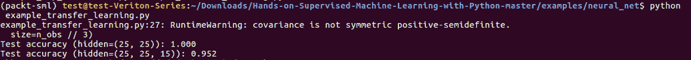

我们的测试精度下降到了百分之`95.2`。

您可以在下图中看到，我们能够在二元分类任务中学习复杂的决策边界:

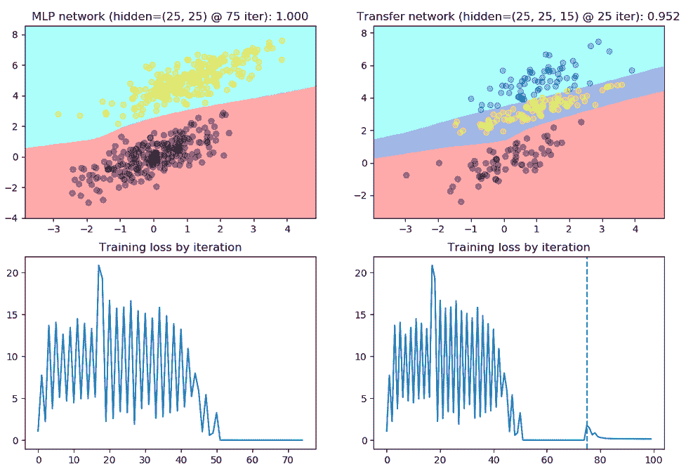

```
# these are the majority classes
n_obs = 1250
x1 = rs.multivariate_normal(mean=[0, 0], cov=covariance, size=n_obs)
x2 = rs.multivariate_normal(mean=[1, 5], cov=covariance, size=n_obs)

# this is the minority class
x3 = rs.multivariate_normal(mean=[0.85, 3.25], cov=[[1., .5], [1.25, 0.85]],
                            size=n_obs // 3)

# this is what the FIRST network will be trained on
n_first = int(0.8 * n_obs)
X = np.vstack((x1[:n_first], x2[:n_first])).astype(np.float32)
y = np.hstack((np.zeros(n_first), np.ones(n_first))).astype(int)

# this is what the SECOND network will be trained on
X2 = np.vstack((x1[n_first:], x2[n_first:], x3)).astype(np.float32)
y2 = np.hstack((np.zeros(n_obs - n_first),
                np.ones(n_obs - n_first),
                np.ones(x3.shape[0]) * 2)).astype(int)
```

然后我们把它拿来，我们说让我们用一个新的类来做迁移学习，我们仍然能够学得很好。现在，我们已经了解了在初始决策边界之上构建的第二个决策边界，它看起来非常好。所以，我们有 95.2%的准确率。

摘要

```
# Fit the transfer network - train one more layer with a new class
t_hidden = (15,)
t_iter = 25
transfer = TransferLearningClassifier(X2_train, y2_train, pretrained=clf,
                                      hidden=t_hidden, n_iter=t_iter,
                                      random_state=42)

t_pred = transfer.predict(X2_test)
trans_accuracy = accuracy_score(y2_test, t_pred)
print("Test accuracy (hidden=%s): %.3f" % (str(hidden + t_hidden),
                                           trans_accuracy))
```

迁移学习是一个灵活的概念，它允许你将网络堆叠在一起，完成比你想象的更复杂的任务。我们讨论了推荐系统，特别是协同过滤，然后我们看了矩阵分解技术，以及如何用基于内容的相似性来补充你的推荐器。最后，我们研究了神经网络和迁移学习。

This is going to be very similar to what we saw in the first example, where we have a two-layer network with `25` units in each layer. We're going to fit `75` epochs with a pretty low learning rate and we'll see how it does on learning the binary classification task.

Now, let's say we're predicting some type of disease, and there's type one something and type two something. I'm not going to use diabetes because there's only two types. But let's say, a third type comes out. Maybe it's a type of Zika virus, and we want to predict whether this new class is present in a patient who comes in. We don't want to retrain everything, because it's going to take forever, perhaps. So, we're going to just stack this new layer on the end that says learn these new features about this third class. And then we'll produce a new output layer for three classes rather than two. We're only going to do `25` new epochs, just based on what we've already learned from the previous binary classification task. We want to see if we can learn this new class without retraining everything. And that's all we're going to do here:

```
# Fit the transfer network - train one more layer with a new class
t_hidden = (15,)
t_iter = 25
transfer = TransferLearningClassifier(X2_train, y2_train, pretrained=clf,
                                      hidden=t_hidden, n_iter=t_iter,
                                      random_state=42)

t_pred = transfer.predict(X2_test)
trans_accuracy = accuracy_score(y2_test, t_pred)
print("Test accuracy (hidden=%s): %.3f" % (str(hidden + t_hidden),
                                           trans_accuracy))
```

And then we're going to plot both out so you can see the decision boundary from both the binary and this three-class classification problem.

Let's run an example of transfer learning:


Our test accuracy is down to `95.2` percent.

You can see in the following graph that we are able to learn a complex decision boundary in the binary classification task:


And then we took that and we said let's do transfer learning with a new class, and we were still able to learn it really well. So, now we've learned the second decision boundary that we built on top of our initial decision boundary and it looks really good. So, we get 95.2 percent accuracy.


# Summary

Transfer learning is a flexible concept that'll allow you to stack networks together to accomplish far more complex tasks than you thought possible. We covered recommender systems and collaborative filtering in particular, and then we looked at matrix factorization techniques and how to supplement your recommenders with content-based similarities. Lastly, we worked with neural networks and transfer learning.